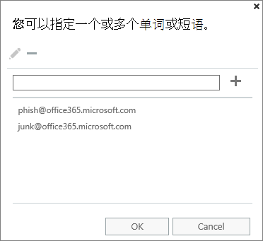
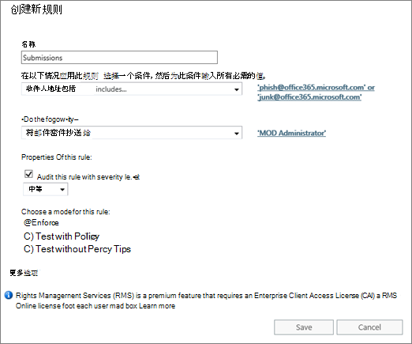
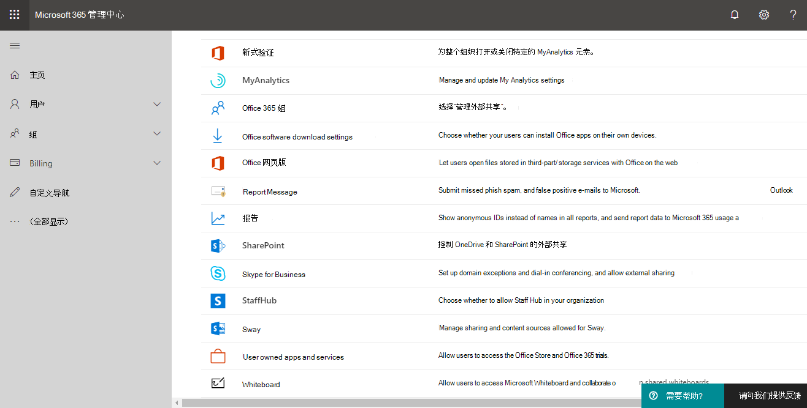

# 启用报表消息加载项Enable the Report Message add-in

> [!NOTE]
> Outlook 和 web 上的 Outlook 的报告邮件外接程序与[Outlook 垃圾邮件筛选器](https://support.office.com/article/5ae3ea8e-cf41-4fa0-b02a-3b96e21de089)并不完全相同，但这两者都可用于将电子邮件标记为垃圾邮件、非垃圾邮件或网络钓鱼尝试。The Report Message add-in for Outlook and Outlook on the web is not exactly the same thing as the [Outlook Junk Email Filter](https://support.office.com/article/5ae3ea8e-cf41-4fa0-b02a-3b96e21de089), although both can be used to mark email as junk, not junk, or a phishing attempt. 不同之处在于，Outlook 和 web 上的 Outlook 的报告邮件外接程序会通知 Microsoft misclassified 电子邮件，而 Outlook 垃圾邮件筛选器用于组织用户邮箱中的电子邮件。The difference is, the Report Message add-in for Outlook and Outlook on the web notifies Microsoft about misclassified email, whereas the Outlook Junk Email Filter is used to organize email messages in a user's mailbox.

## 概述Overview

Outlook 和 web 上的 Outlook 的报告邮件外接程序（以前称为 Outlook Web App）使用户能够轻松地向 Microsoft 及其子公司报告 misclassified 电子邮件（无论是安全还是恶意）。The Report Message add-in for Outlook and Outlook on the web (formerly known as Outlook Web App) enables people to easily report misclassified email, whether safe or malicious, to Microsoft and its affiliates for analysis. Microsoft 使用这些提交改进电子邮件保护技术的有效性。Microsoft uses these submissions to improve the effectiveness of email protection technologies. 此外，如果您的组织使用的是[Office 365 高级威胁防护计划 1](office-365-atp.md)或[计划 2](office-365-ti.md)，则报告消息外接程序会为您组织的安全团队提供可用于查看和更新安全策略的有用信息。In addition, if your organization is using [Office 365 Advanced Threat Protection Plan 1](office-365-atp.md) or [Plan 2](office-365-ti.md), the Report Message add-in provides your organization's security team with useful information they can use to review and update security policies.

例如，假设有人将大量邮件报告为网络钓鱼。For example, suppose that people are reporting a lot of messages as phishing. [安全仪表板](security-dashboard.md)和其他报告中的此信息图面。This information surfaces in the [Security Dashboard](security-dashboard.md) and other reports. 组织的安全团队可以使用此信息指示可能需要更新的反网络钓鱼策略。Your organization's security team can use this information as an indication that anti-phishing policies might need to be updated. 或者，如果用户使用报告邮件外接程序报告大量被标记为垃圾邮件的邮件，则组织的安全团队可能需要调整[反垃圾邮件策略](configure-the-anti-spam-policies.md)。Or, if people are reporting a lot of messages that were flagged as junk mail as Not Junk by using the Report Message add-in, your organization's security team might need to adjust [anti-spam policies](configure-the-anti-spam-policies.md).

报告邮件加载项适用于大多数 Office 365 订阅和以下产品：The Report Message add-in works with most Office 365 subscriptions and the following products:

 - Outlook 网页版Outlook on the web
 - Outlook 2013 SP1Outlook 2013 SP1
 - Outlook 2016Outlook 2016
 - Outlook 2016 for MacOutlook 2016 for Mac
 - Outlook 包含在 Office 365 专业增强版中Outlook included with Office 365 ProPlus

报告邮件外接程序目前不可用于：The Report Message add-in is currently not available for:

 - 内部部署 Exchange 组织中的邮箱Mailboxes in on-premises Exchange organizations
 - GCC、GCC 高或 DoD 订阅GCC, GCC HIGH, or DoD subscriptions

您的现有 web 浏览器应该能够满足报告消息外接程序的需要。但是，如果您注意到加载项不可用或无法按预期工作，请尝试使用不同的浏览器。Your existing web browser should suffice for the Report Message add-in to work; however, if you notice the add-in is not available or not working as expected, try a different browser.

如果您是单个用户，则可以[为自己启用报告邮件加载项](#get-the-report-message-add-in-for-yourself)。If you're an individual user, you can [enable the Report Message add-in for yourself](#get-the-report-message-add-in-for-yourself).

如果您是 Office 365 全局管理员或 Exchange Online 管理员，并且将 Exchange 配置为使用 OAuth 身份验证，则可以[为您的组织启用报告消息外接程序](#get-and-enable-the-report-message-add-in-for-your-organization)。If you're an Office 365 global administrator or an Exchange Online administrator, and Exchange is configured to use OAuth authentication, you can [enable the Report Message add-in for your organization](#get-and-enable-the-report-message-add-in-for-your-organization). 现在，可以通过[集中部署](https://docs.microsoft.com/office365/admin/manage/centralized-deployment-of-add-ins)使用报告消息加载项。The Report Message Add-In is now available through [Centralized Deployment](https://docs.microsoft.com/office365/admin/manage/centralized-deployment-of-add-ins).

## 获取自己的报告邮件外接程序Get the Report Message add-in for yourself

1. 在[Microsoft AppSource](https://appsource.microsoft.com/marketplace/apps)中，搜索[报告邮件外接程序](https://appsource.microsoft.com/product/office/wa104381180)。In [Microsoft AppSource](https://appsource.microsoft.com/marketplace/apps), search for the [Report Message add-in](https://appsource.microsoft.com/product/office/wa104381180).

2. 选择 "**立即获取**"。Choose **GET IT NOW**.

   

3. 查看使用条款和隐私策略。Review the terms of use and privacy policy. 然后选择" **继续**"。Then choose **Continue**.

4. 使用你的工作或学校帐户（用于商业用途）或你的 Microsoft 帐户（供个人使用）登录 Office 365。Sign in to Office 365 using your work or school account (for business use) or your Microsoft account (for personal use).

安装并启用加载项后，您将看到以下图标：After the add-in is installed and enabled, you'll see the following icons:

- 在 Outlook 中，图标如下所示：In Outlook, the icon looks like this:

  

- 在 web 上的 Outlook （以前称为 Outlook Web App）中，图标如下所示：In Outlook on the web (formerly known as Outlook Web App), the icon looks like this:

  

> [!TIP]
> 作为下一步，了解如何[使用报告邮件加载项](https://support.office.com/article/b5caa9f1-cdf3-4443-af8c-ff724ea719d2)。As a next step, learn how to [Use the Report Message add-in](https://support.office.com/article/b5caa9f1-cdf3-4443-af8c-ff724ea719d2).

## 为您的组织获取并启用报告邮件外接程序Get and enable the Report Message add-in for your organization

> [!IMPORTANT]
> 若要完成此任务，您必须是 Office 365 全局管理员或 Exchange Online 管理员。You must be an Office 365 global administrator or an Exchange Online Administrator to complete this task. 此外，必须将 Exchange 配置为使用 OAuth 身份验证以了解详细信息，请参阅[exchange 要求（加载项的集中部署）](https://docs.microsoft.com/office365/admin/manage/centralized-deployment-of-add-ins)。In addition, Exchange must be configured to use OAuth authentication To learn more, see [Exchange requirements (Centralized Deployment of add-ins)](https://docs.microsoft.com/office365/admin/manage/centralized-deployment-of-add-ins).

1. 转到 Microsoft 365 管理中心中的 "[服务 & 外接程序" 页面](https://admin.microsoft.com/AdminPortal/Home#/Settings/ServicesAndAddIns)。Go to the [Services & add-ins page](https://admin.microsoft.com/AdminPortal/Home#/Settings/ServicesAndAddIns) in the Microsoft 365 admin center.

   

2. 选择 " **+ 部署外接端"**。Choose **+ Deploy Add-in**.

   

3. 在 "**新建外接端**" 屏幕中，查看信息，然后选择 "**下一步**"。In the **New Add-In** screen, review the information, and then choose **Next**.

   

4. 选择 **"我想从 Office 应用商店添加外接程序**"，然后选择 "**下一步**"。Select **I want to add an Add-In from the Office Store**, and then choose **Next**.

   

5. 搜索**报告消息**，并在结果列表中的**报告邮件外接程序**旁边，选择 "**添加**"。Search for **Report Message**, and in the list of results, next to the **Report Message Add-In**, choose **Add**.

   

6. 在 "**报告邮件**" 屏幕上，查看信息，然后选择 "**下一步**"。On the **Report Message** screen, review the information, and then choose **Next**.

   

7. 指定 Outlook 的用户默认设置，然后选择 "**下一步**"。Specify the user default settings for Outlook, and  then choose **Next**.

   

8. 指定要获取报告邮件加载项的收件人，然后选择 "**保存**"。Specify who gets the Report Message Add-in, and then choose **Save**.

   

> [!TIP]
> 建议[设置一个规则，以获取用户报告的电子](#set-up-a-rule-to-get-a-copy-of-email-messages-reported-by-your-users)邮件的副本。We recommend [setting up a rule to get a copy of email messages reported by your users](#set-up-a-rule-to-get-a-copy-of-email-messages-reported-by-your-users).

根据您在设置加载项时选择的内容（上面的步骤7-8），贵组织中的人员将会看到[报告消息外接程序](https://support.office.com/article/b5caa9f1-cdf3-4443-af8c-ff724ea719d2)。Depending on what you selected when you set up the add-in (steps 7-8 above), people in your organization will have the [Report Message add-in](https://support.office.com/article/b5caa9f1-cdf3-4443-af8c-ff724ea719d2) available. 你组织中的人员将看到以下图标：People in your organization will see the following icons:

- 在 Outlook 中，图标如下所示：In Outlook, the icon looks like this:

  

- 在 web 上的 Outlook 中，图标如下所示：In Outlook on the web, the icon looks like this:

  

> [!TIP]
> 当您通知用户有关报告邮件加载项时，请包含[使用报告邮件加载项](https://support.office.com/article/b5caa9f1-cdf3-4443-af8c-ff724ea719d2)的链接。When you notify users about the Report Message add-in, include a link to [Use the Report Message add-in](https://support.office.com/article/b5caa9f1-cdf3-4443-af8c-ff724ea719d2).

## 设置一个规则，以获取用户报告的电子邮件的副本Set up a rule to get a copy of email messages reported by your users

> [!IMPORTANT]
> 您必须是 Exchange Online 管理员才能执行此任务。You must be an Exchange Online Administrator to perform this task.

您可以设置一个规则，以获取由组织中的用户报告的电子邮件的副本。You can set up a rule to get a copy of email messages reported by users in your organization. 为组织下载并启用报告邮件外接程序后，可以执行此操作。You do this after you have downloaded and enabled the Report Message add-in for your organization.

1. 在 Exchange 管理中心中，选择 "**邮件流** \> **规则**"。In the Exchange admin center, choose **mail flow** \> **rules**.

2. 选择**+** \> "**创建新规则**"。Choose **+** \> **Create a new rule**.

3. 在 "**名称**" 框中，键入一个名称，如 "提交"。In the **Name** box, type a name, such as Submissions.

4. 在 "在**以下情况应用此规则**" 列表中，选择**收件人地址包括 ...**。In the **Apply this rule if** list, choose **The recipient address includes...**.

5. 在 "**指定字词或短语**" 屏幕中`junk@office365.microsoft.com` ， `phish@office365.microsoft.com`添加和，然后选择 **"确定"**。In the **specify words or phrases** screen, add `junk@office365.microsoft.com` and `phish@office365.microsoft.com`, and then choose **OK**.

   

6. 在 "**执行以下操作 ...** " 列表中，选择 **"将邮件密件抄送给 ...**"。In the **Do the following...** list, choose **Bcc the message to...**.

7. 添加全局管理员、安全管理员和/或安全阅读者，这些读者应收到用户报告给 Microsoft 的每封电子邮件的副本，然后选择 **"确定"**。Add a global administrator, security administrator, and/or security reader who should receive a copy of each email message that people report to Microsoft, and then choose **OK**.

   

8. 选择 "**使用严重性级别审核此规则**"，然后选择 "**中**"。Select **Audit this rule with severity level**, and choose **Medium**.

9. 在 "**为此规则选择模式**" 下，选择 "**强制**"。Under **Choose a mode for this rule**, choose **Enforce**.

   

10. 选择“**保存**”。Choose **Save**.

在适当的情况下，当组织中的某人使用报告邮件加载项报告电子邮件时，全局管理员、安全管理员和/或安全读者将收到该邮件的副本。With this rule in place, whenever someone in your organization reports an email message using the Report Message add-in, your global administrator, security administrator, and/or security reader will receive a copy of that message. 此信息可以让你设置或调整策略，如[Office 365 ATP 安全链接](atp-safe-links.md)策略或[反垃圾邮件](anti-spam-protection.md)设置。This information can enable you to set up or adjust policies, such as [Office 365 ATP Safe Links](atp-safe-links.md) policies, or your [anti-spam](anti-spam-protection.md) settings.

## 了解如何使用报告邮件加载项Learn how to use the Report Message add-in

请参阅[使用报告邮件加载项](https://support.office.com/article/b5caa9f1-cdf3-4443-af8c-ff724ea719d2)。See [Use the Report Message add-in](https://support.office.com/article/b5caa9f1-cdf3-4443-af8c-ff724ea719d2).

## 查看或编辑报告邮件外接程序的设置Review or edit settings for the Report Message add-in

您可以在 "[服务" & "外接程序" 页](https://admin.microsoft.com/AdminPortal/Home#/Settings/ServicesAndAddIns)上查看和编辑报告邮件外接程序的默认设置。You can review and edit the default settings for the Report Message add-in on the [Services & Add-Ins page](https://admin.microsoft.com/AdminPortal/Home#/Settings/ServicesAndAddIns).

> [!IMPORTANT]
> 若要完成此任务，您必须是 Office 365 全局管理员或 Exchange Online 管理员。You must be an Office 365 global administrator or an Exchange Online Administrator to complete this task.

1. 转到 Microsoft 365 管理中心中的 "[服务 & 外接程序" 页面](https://admin.microsoft.com/AdminPortal/Home#/Settings/ServicesAndAddIns)。Go to the [Services & add-ins page](https://admin.microsoft.com/AdminPortal/Home#/Settings/ServicesAndAddIns) in the Microsoft 365 admin center.

   

2. 查找并选择报告邮件加载项。Find and select the Report Message add-in.

   

3. 在 "报告邮件" 屏幕上，查看并编辑适用于您的组织的设置。On the Report Message screen, review and edit settings as appropriate for your organization.

   

## 相关主题Related topics

[使用报告邮件加载项Use the Report Message add-in](https://support.office.com/article/b5caa9f1-cdf3-4443-af8c-ff724ea719d2)

[查看安全&amp;合规性中心中的电子邮件安全报告View email security reports in the Security &amp; Compliance Center](view-email-security-reports.md)

[查看 Office 365 高级威胁防护报告View reports for Office 365 Advanced Threat Protection](view-reports-for-atp.md)

[在安全&amp;合规中心中使用资源管理器Use Explorer in the Security &amp; Compliance Center](threat-explorer.md)
