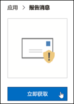
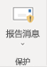
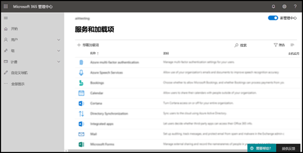
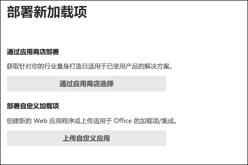
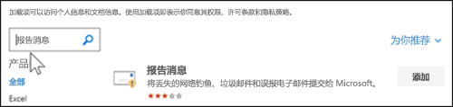
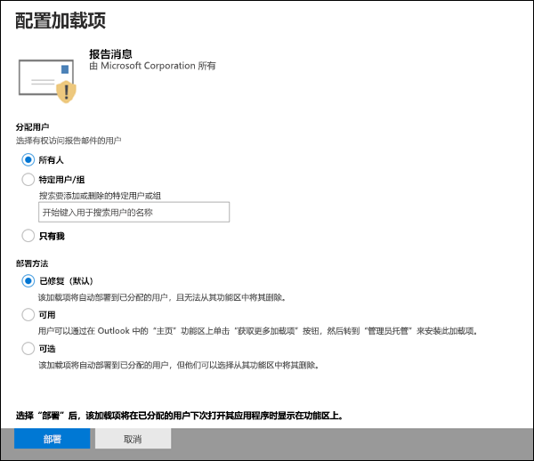
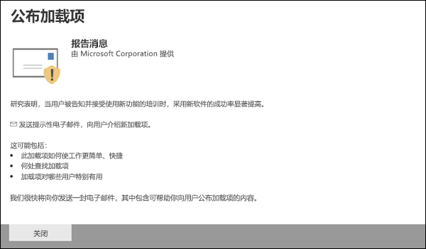
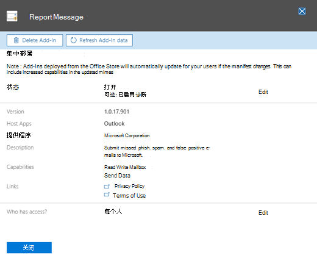

# 启用报告邮件或举报网络钓鱼加载项

[!INCLUDE [Microsoft 365 Defender rebranding](../includes/microsoft-defender-for-office.md)]

**适用对象**
- [Exchange Online Protection](exchange-online-protection-overview.md)
- [Microsoft Defender for Office 365 计划 1 和计划 2](defender-for-office-365.md)
- [Microsoft 365 Defender](../defender/microsoft-365-defender.md)

> [!NOTE]
> 如果你是拥有多个邮箱Microsoft 365组织Exchange Online管理员，我们建议你使用 Microsoft 365 Defender 门户中的"提交"页面。  有关详细信息，请参阅使用[管理员提交将可疑的垃圾邮件、网络钓鱼、URL 和文件提交到 Microsoft。](admin-submission.md)

Outlook 和 Outlook 网页版 (的报告邮件和报告网络钓鱼外接程序（以前称为 Outlook Web App) ）使用户能够轻松地向 Microsoft 及其关联公司报告误报 (标记为错误) 或误报 (错误电子邮件允许) 至 Microsoft 及其关联公司进行分析。

Microsoft 使用这些提交来提高电子邮件保护技术的有效性。 例如，假设用户正在使用报告网络钓鱼外接程序报告许多邮件。 此信息在安全仪表板和其他报告中显示。 组织的安全团队可以使用此信息指示可能需要更新反网络钓鱼策略。

可以安装"报告邮件"或"报告钓鱼邮件"加载项。 如果希望用户同时报告垃圾邮件和网络钓鱼邮件，请在你的组织中部署"报告邮件"加载项。 有关详细信息，请参阅启用报告邮件外接程序。

报告邮件外接程序提供报告垃圾邮件和网络钓鱼邮件的选项。 管理员可以为组织启用"报告邮件"外接程序，并且各个用户可以自行安装它。

报告网络钓鱼外接程序提供仅报告网络钓鱼邮件的选项。 管理员可以为组织启用报告网络钓鱼外接程序，单个用户可以自行安装它。

如果您是单个用户，您可以为自己启用这两个外接程序。

如果您是全局管理员或 Exchange Online 管理员，并且 Exchange 配置为使用 OAuth 身份验证，您可以为组织启用"报告邮件"外接程序和"报告网络钓鱼"外接程序。 这两个加载项现在都可以通过集中 [部署获得](../../admin/manage/centralized-deployment-of-add-ins.md)。

## 开始前，有必要了解什么？

- 报告邮件外接程序和报告网络钓鱼外接程序适用于大多数Microsoft 365订阅和以下产品：
  - Outlook 网页版
  - Outlook 2013 SP1 或更高版本
  - Outlook 2016 for Mac
  - Outlook应用程序Microsoft 365中包含的Enterprise
  - Outlook iOS 和 Android 版应用

- 这两个加载项均不适用于共享邮箱或本地组织Exchange邮箱。

- 现有的 Web 浏览器应同时使用报告邮件和报告钓鱼外接程序。但是，如果您注意到外接程序不可用或未正常工作，请尝试其他浏览器。

- 对于组织安装，组织需要配置为使用 OAuth 身份验证。 有关详细信息，请参阅确定加载项的集中部署 [是否适用于你的组织](../../admin/manage/centralized-deployment-of-add-ins.md)。

- 管理员需为全局管理员角色组的成员。 有关详细信息，请参阅 [Microsoft 365 Defender 门户中的权限](permissions-microsoft-365-security-center.md)。

- 有关如何使用"报告邮件"功能报告邮件的信息，请参阅报告邮件中的误报和[Outlook。](report-false-positives-and-false-negatives.md)

- 具有 URL 筛选或安全解决方案 (如代理和 FireWall) 的组织将需要在 HTTPS 协议上访问 ipagave.azurewebsites.net 和 outlook.office.com 终结点。

> [!IMPORTANT]
> 我们不建议使用内置报告体验Outlook因为它不使用用户[提交策略](./user-submission.md)。 我们建议改为使用报告邮件外接程序或报告钓鱼外接程序。

## 获取报告邮件外接程序

### 为自己获取报告邮件外接程序

1. 转到 Microsoft AppSource ， <https://appsource.microsoft.com/marketplace/apps> 然后搜索"报告消息"加载项。 若要直接转到"报告邮件"加载项，请转到 <https://appsource.microsoft.com/product/office/wa104381180> 。

2. 单击 **"立即获取"。**

   

3. 在出现的对话框中，查看使用条款和隐私策略，然后单击"继续 **"。**

4. 使用工作或学校帐户登录 (商业) Microsoft 帐户 (个人使用) 。

安装并启用加载项后，你将看到以下图标：

- 在Outlook中，图标如下所示：

  > [!div class="mx-imgBorder"]
  > 

- 在Outlook 网页版中，图标如下所示：

  > [!div class="mx-imgBorder"]
  > 

### 获取组织的"报告邮件"加载项

> [!NOTE]
> 外接程序可能需要 12 个小时才能显示在组织中。

1. 在Microsoft 365 管理中心中，转到 **"设置** \> **外接程序"** 页（位于 <https://admin.microsoft.com/AdminPortal/Home#/Settings/AddIns> ）。 如果看不到"外接程序"页面，请转到"**集成** 设置页面上的"集成应用外接程序 \>  \> **"** 链接。

2. 选择 **页面顶部的"** 部署外接程序"，然后选择"下一 **步"。**

   

3. 在出现的 **"部署新的外接程序"** 飞出中，查看信息，然后单击"下一步 **"。**

4. 下一页上，单击 **从应用商店中选择**。

   

5. 在出现的 **"选择外接程序"** 页中，单击"搜索"框中，输入"**报告** 邮件"，然后单击"**搜索搜索"**  。 在结果列表中，找到"**报告邮件**"，然后单击"添加 **"。**

   

6. 在出现的对话框中，查看许可和隐私信息，然后单击"继续 **"。**

7. 在 **出现的"配置外接程序"** 页中，配置以下设置：

   - **已分配用户**：选择下列值之一：
     - **每个人都** (默认) 
     - **特定用户/组**
     - **就我自己**

   - **部署方法**：选择下列值之一：
     - **修复 (默认) ：** 加载项会自动部署到指定用户，且无法删除。
     - **可用**：用户可以在家庭获取外接程序 \> **管理员** 管理的 \> **安装外接程序**。
     - **可选**：外接程序将自动部署到指定用户，但他们可以选择将其删除。

   

   完成后，单击"部署 **"。**

8. 在 **出现的"** 部署报告消息"页中，你将看到一个进度报告，然后确认外接程序已部署。 阅读信息后，单击"下一 **步"。**

   

9. 在出现的 **"宣布外接程序"** 页上，查看信息，然后单击"关闭 **"。**

   

## 查看或编辑报告邮件外接程序的设置

1. 在Microsoft 365 管理中心中，转到 转到 "设置 \> **外接程序"** 页，位于 <https://admin.microsoft.com/AdminPortal/Home#/Settings/AddIns> 。 如果看不到"外接程序"页面，请转到"**集成** 设置页面上的"集成应用外接程序 \>  \> **"** 链接。

   

2. 查找并选择 **"报告邮件** "外接程序。

3. 在出现的 **"编辑报告消息** "飞出控件中，根据组织情况查看和编辑设置。 完成时，请单击“保存”。

   

## 获取报告网络钓鱼外接程序

### 为自己获取报告网络钓鱼外接程序

1. 转到 Microsoft AppSource ， <https://appsource.microsoft.com/marketplace/apps> 然后搜索"报告钓鱼"加载项。

2. 单击 **"立即获取"。**

3. 在出现的对话框中，查看使用条款和隐私策略，然后单击"继续 **"。**

4. 使用工作或学校帐户登录 (商业) Microsoft 帐户 (个人使用) 。

安装并启用加载项后，你将看到以下图标：

- 在Outlook中，图标如下所示：

  

- 在Outlook 网页版中，图标如下所示：

  > [!div class="mx-imgBorder"]
  > 

### 获取组织的"报告网络钓鱼"外接程序

> [!NOTE]
> 外接程序可能需要 12 个小时才能显示在组织中。

1. 在Microsoft 365 管理中心中，转到 **"设置** \> **外接程序"** 页，位于 <https://admin.microsoft.com/AdminPortal/Home#/Settings/AddIns> 。 如果看不到"加载项"页面，请转到"**集成** 应用"设置顶部的"集成应用加载项 \>  \> **"** 链接。

2. 选择 **页面顶部的"** 部署外接程序"，然后选择"下一 **步"。**

   

3. 在出现的 **"部署新的外接程序"** 飞出中，查看信息，然后单击"下一步 **"。**

4. 下一页上，单击 **从应用商店中选择**。

   

5. 在出现的 **"选择外接程序"** 页中，单击"搜索"框中，输入"**报告** 网络钓鱼"，然后单击"搜索 **搜索"**  。 在结果列表中，找到"**报告网络钓鱼"，** 然后单击"添加 **"。**

6. 在出现的对话框中，查看许可和隐私信息，然后单击"继续 **"。**

7. 在 **出现的"配置外接程序"** 页中，配置以下设置：

   - **已分配用户**：选择下列值之一：
     - **每个人都** (默认) 
     - **特定用户/组**
     - **就我自己**

   - **部署方法**：选择下列值之一：
     - **修复 (默认) ：** 加载项会自动部署到指定用户，且无法删除。
     - **可用**：用户可以在家庭获取外接程序 \> **管理员** 管理的 \> **安装外接程序**。
     - **可选**：外接程序将自动部署到指定用户，但他们可以选择将其删除。

   完成后，单击"部署 **"。**

8. 在 **出现的"部署** 报告网络钓鱼"页中，你将看到一个进度报告，然后确认外接程序已部署。 阅读信息后，单击"下一 **步"。**

9. 在出现的 **"宣布外接程序"** 页上，查看信息，然后单击"关闭 **"。**

## 查看或编辑报告网络钓鱼外接程序的设置

1. 在Microsoft 365 管理中心中，转到 **"设置** \> **外接程序"** 页，位于 <https://admin.microsoft.com/AdminPortal/Home#/Settings/AddIns> 。 如果看不到"加载项"页面，请转到"**集成** 应用"设置顶部的"集成应用加载项 \>  \> **"** 链接。

2. 查找并选择报告 **网络钓鱼** 外接程序。

3. 在出现的 **"编辑报告** 钓鱼"飞出控件中，查看和编辑适合你的组织的设置。 完成时，请单击“保存”。
