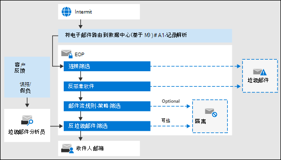

# Exchange Online Protection 概述Exchange Online Protection overview

Exchange Online Protection （EOP）是基于云的筛选服务，可帮助组织抵御垃圾邮件和恶意软件。Exchange Online Protection (EOP) is the cloud-based filtering service that helps protect your organization against spam and malware. EOP 包含在具有 Exchange Online 邮箱的所有 Microsoft 365 组织中。EOP is included in all Microsoft 365 organizations with Exchange Online mailboxes.

但是，在以下本地方案中也可以使用 EOP：But, EOP is also available in the following on-premises scenarios:

- **在独立方案中**： EOP 为您的内部部署 Exchange 组织或任何其他内部部署 SMTP 电子邮件解决方案提供基于云的电子邮件保护。**In a standalone scenario**: EOP provides cloud-based email protection for your on-premises Exchange organization or for any other on-premises SMTP email solution.

- **在混合部署中**：在混合使用内部部署和云邮箱时，可以将 EOP 配置为保护您的电子邮件环境并控制邮件路由。**In a hybrid deployment**: EOP can be configured to protect your email environment and control mail routing when you have a mix of on-premises and cloud mailboxes.

在这些方案中，EOP 可简化电子邮件环境的管理，并缓解维护内部部署硬件和软件带来的许多负担。In these scenarios, EOP can simplify the management of your email environment and alleviate many of the burdens that come with maintaining on-premises hardware and software.

本主题的其余部分将介绍 EOP 在独立和混合环境中的工作方式。The rest of this topic explains how EOP works in standalone and hybrid environments.

## EOP 如何工作How EOP works

了解 EOP 如何工作，有助于查看其如何处理传入的电子邮件：To understand how EOP works, it helps to see how it processes incoming email:

- 传入邮件最初通过连接筛选，它会检查发件人的信誉并检查邮件中是否存在恶意软件。An incoming message initially passes through connection filtering, which checks the sender's reputation and inspects the message for malware. 大多数垃圾邮件在这时就会被 EOP 阻止并删除。The majority of spam is stopped at this point and deleted by EOP. 有关详细信息，请参阅[配置连接筛选](configure-the-connection-filter-policy.md)。For more information, see [Configure connection filtering](configure-the-connection-filter-policy.md).

- 邮件将继续通过策略筛选，其中将根据您从模板创建或实施的自定义邮件流规则（也称为传输规则）对邮件进行评估。Messages continue through policy filtering, where messages are evaluated against custom mail flow rules (also known as transport rules) that you create or enforce from a template. 例如，你可以将规则设置为当收到来自特定发件人的邮件时向管理器发送通知。For example, you can have a rule that sends a notification to a manager when mail arrives from a specific sender. 数据丢失防护（DLP）检查在此点也会发生（Exchange Enterprise CAL with Services）。Data loss prevention (DLP) checks also occur at this point (Exchange Enterprise CAL with Services).

- 接下来，邮件通过反垃圾邮件筛选（也称为内容筛选）传递。Next, messages pass through anti-spam filtering (also known as content filtering). 确定为垃圾邮件的邮件可以发送到用户的 "垃圾邮件" 文件夹或 "隔离"，以及其他选项。A message that's determined to be spam can be sent to a user's Junk Email folder or to the quarantine, among other options. 有关详细信息，请参阅[配置反垃圾邮件策略](configure-your-spam-filter-policies.md)。For more information, see [Configure anti-spam policies](configure-your-spam-filter-policies.md).

- 在邮件成功传递所有这些保护层后，会将其传递给收件人。After a message passes all of these protection layers successfully, it's delivered to the recipient.

有关详细信息，请参阅[电子邮件保护的顺序和优先级](how-policies-and-protections-are-combined.md)。For more information, see [Order and precedence of email protection](how-policies-and-protections-are-combined.md).

### EOP 数据中心EOP datacenters

EOP 在数据中心的全球网络中运行，旨在提供最好的可用性。EOP runs on a worldwide network of datacenters that are designed to provide the best availability. 例如，如果某个数据中心不可用，则会将电子邮件自动路由到其他数据中心，而不会对服务有任何中断。For example, if a datacenter becomes unavailable, email messages are automatically routed to another datacenter without any interruption in service. 每个数据中心中的服务器代表您接受邮件，提供组织和 internet 之间的一层隔离，从而减少服务器上的负载。Servers in each datacenter accept messages on your behalf, providing a layer of separation between your organization and the internet, thereby reducing load on your servers. 通过此高可用性网络，Microsoft 可以确保电子邮件及时到达您的组织。Through this highly available network, Microsoft can ensure that email reaches your organization in a timely manner.

EOP 在数据中心之间执行负载平衡，但仅限在一个区域内。如果在一个区域中设置，将使用该区域的邮件路由处理所有邮件。下面的列表显示了 EOP 数据中心的区域邮件路由如何工作：EOP performs load balancing between datacenters but only within a region. If you're provisioned in one region all your messages will be processed using the mail routing for that region. The following list shows the how regional mail routing works for the EOP datacenters:

- 在欧洲、中东和非洲 (EMEA)，所有 Exchange Online 邮箱均位于 EMEA 数据中心，所有邮件均通过 EMEA 数据中心路由以进行 EOP 筛选。In Europe, the Middle East, and Africa (EMEA), all Exchange Online mailboxes are located in EMEA datacenters, and all messages are routed through EMEA datacenters for EOP filtering.

- 在亚太地区（APAC）中，所有 Exchange Online 邮箱均位于 APAC 数据中心中，并且邮件当前通过 APAC 数据中心路由以进行 EOP 筛选。In Asia-Pacific (APAC), all Exchange Online mailboxes are located in APAC datacenters, and messages are currently routed through APAC datacenters for EOP filtering.

- 在美洲，所有 Exchange Online 邮箱均位于美国数据中心，但使用巴西和智利中的数据中心和加拿大中使用数据中心（在加拿大的位置）的情况除外。In the Americas, all Exchange Online mailboxes are located in U.S. datacenters, with the exception of South America where datacenters in Brazil and Chile are used and in Canada where datacenters in Canada are used. 所有电子邮件（包括在南美洲和加拿大的客户的邮件）通过本地数据中心进行路由，以进行 EOP 筛选;隔离的电子邮件存储在租户所在的数据中心中。All email messages, including messages for customers in South America and Canada, are routed through local datacenters for EOP filtering; quarantined email is stored in the datacenter where the tenant is located.

- 对于政府社区云 (GCC)，所有 Exchange Online 邮箱均位于美国数据中心，所有邮件均通过美国数据中心路由以进行 EOP 筛选。For the Government Community Cloud (GCC), all Exchange Online mailboxes are located in U.S. datacenters and all messages are routed through U.S. datacenters for EOP filtering.

## 适用于内部部署电子邮件组织的 EOP 计划和功能EOP plans and features for on-premises email organizations

可用的 EOP 订阅计划包括：The available EOP subscription plans are:

- **EOP 独立**：在 EOP 中注册以保护您的内部部署电子邮件组织。**EOP standalone**: You enroll in EOP to protect your on-premises email organization.

- **Exchange online 中的 EOP 功能**：包括 exchange online 的任何订阅（独立的或作为 Microsoft 365 的一部分）使用 EOP 来保护 Exchange Online 邮箱。**EOP features in Exchange Online**: Any subscription that includes Exchange Online (standalone or as part of Microsoft 365) uses EOP to protect your Exchange Online mailboxes.

- **Exchange ENTERPRISE cal With services**：如果您有一个内部部署 exchange 组织，并且您已使用这些服务许可证购买了其他 Exchange 企业版 cal，则 EOP 是所包含服务的一部分。**Exchange Enterprise CAL with Services**: If you have an on-premises Exchange organization where you've purchased additional Exchange Enterprise CAL with Services licenses, EOP is part of the included services.

有关跨所有 EOP 订阅计划的要求、重要限制和功能可用性的信息，请参阅[Exchange Online Protection 服务说明](https://docs.microsoft.com/office365/servicedescriptions/exchange-online-protection-service-description/exchange-online-protection-service-description)。For information about requirements, important limits, and feature availability across all EOP subscription plans, see the [Exchange Online Protection service description](https://docs.microsoft.com/office365/servicedescriptions/exchange-online-protection-service-description/exchange-online-protection-service-description).

## 为内部部署电子邮件组织设置 EOPSetting up EOP for on-premises email organizations

设置 EOP 可能很简单，尤其是在组织比较小，且拥有少数符合性规则的情况下。但是，如果组织较大，且拥有多个域、自定义符合性规则或混合邮件流，设置可能需要更多规划和时间。Setting up EOP can be simple, especially in the case of a small organization with a handful of compliance rules. However, if you have a large organization with multiple domains, custom compliance rules, or hybrid mail flow, set up can take more planning and time.

如果您已购买 EOP，请参阅 [设置 EOP 服务](set-up-your-eop-service.md)，确保完成配置 EOP 所需的所有步骤，以保护您的邮件环境。If you've already purchased EOP, see [Set up your EOP service](set-up-your-eop-service.md) to ensure that you complete all the steps necessary to configure EOP to protect your messaging environment.

## 管理员的 EOP 帮助EOP Help for admins

针对 EOP 管理员的帮助内容包括以下顶级类别：The Help content for EOP administrators consists of the following top-level categories:

- [Exchange Online Protection 概述](exchange-online-protection-overview.md)：介绍 EOP 如何工作，并提供其他信息的链接。[Exchange Online Protection overview](exchange-online-protection-overview.md): Introduces how EOP works and provides links to additional information.

- [EOP 功能](eop-features.md)：提供 EOP 中可用的功能列表。[EOP features](eop-features.md): Provides a list of features that are available in EOP.

- [设置 EOP 服务](set-up-your-eop-service.md)：提供有关设置 EOP 服务的步骤，以及指向其他信息的链接。[Set up your EOP service](set-up-your-eop-service.md): Provides steps for setting up your EOP service, and links to additional information.

- [从 Google Postini、Barracuda 垃圾邮件和病毒防火墙或 Cisco IronPort 切换到 EOP](switch-to-eop-from-google-postini-the-barracuda-spam-and-virus-firewall-or-cisco.md)：介绍了从其他电子邮件保护产品切换到 EOP 的过程。[Switch to EOP from Google Postini, the Barracuda Spam and Virus Firewall, or Cisco IronPort](switch-to-eop-from-google-postini-the-barracuda-spam-and-virus-firewall-or-cisco.md): Describes the process for switching to EOP from another email protection product.

- [在独立 EOP 中管理收件人](manage-recipients-in-eop.md)：介绍如何在 EOP 中管理邮件用户和组。[Manage recipients in standalone EOP](manage-recipients-in-eop.md): Describes how to manage mail users and groups in EOP.

- [EOP 中的邮件流](mail-flow-in-eop.md)：介绍如何使用连接器配置自定义邮件流方案、如何管理与服务关联的域以及如何启用基于目录的边缘阻止（DBEB）功能。[Mail flow in EOP](mail-flow-in-eop.md): Describes how to configure custom mail flow scenarios using connectors, how to manage domains associated with the service, and how to enable the Directory Based Edge Blocking (DBEB) feature.

- [配置 EOP 的最佳实践](best-practices-for-configuring-eop.md)：介绍了在设置和设置服务后建议的配置设置和注意事项。[Best practices for configuring EOP](best-practices-for-configuring-eop.md): Describes recommended configuration settings and considerations for after you set up and provision your service.

- [独立 EOP 中的审核报告](auditing-reports-in-eop.md)：介绍如何使用审核报告跟踪对服务的配置更改。[Auditing reports in standalone EOP](auditing-reports-in-eop.md): Describes how to use auditing reports to track configuration changes to the service.

- [EOP 中的反垃圾邮件和反恶意软件保护](anti-spam-and-anti-malware-protection.md)：介绍垃圾邮件筛选和恶意软件筛选，并演示如何对它们进行自定义以最大限度地满足组织的需求。[Anti-spam and anti-malware protection in EOP](anti-spam-and-anti-malware-protection.md): Describes spam filtering and malware filtering and shows how to customize them to best meet the needs of your organization. 还介绍了管理员和最终用户可以对隔离邮件执行的任务。Also describes tasks that administrators and end users can perform on quarantined messages.

- [Exchange Online Protection 中的报告和邮件跟踪](reporting-and-message-trace-in-exchange-online-protection.md)：介绍了可用的报告和故障排除工具。[Reporting and message trace in Exchange Online Protection](reporting-and-message-trace-in-exchange-online-protection.md): Describes the reports and troubleshooting tools that are available.

- [独立 EOP 中的 Exchange 管理中心](exchange-admin-center-in-exchange-online-protection-eop.md)：介绍如何通过 exchange 管理中心（EAC）管理界面访问和导航，以管理您的 EOP 服务。[Exchange admin center in standalone EOP](exchange-admin-center-in-exchange-online-protection-eop.md): Describes how to access and navigate through the Exchange admin center (EAC) management interface in order to manage your EOP service.

- [Exchange Online Protection PowerShell](https://docs.microsoft.com/powershell/exchange/exchange-eop/exchange-online-protection-powershell)：提供有关远程 PowerShell 的信息，该信息允许您从命令行管理 EOP 服务。[Exchange Online Protection PowerShell](https://docs.microsoft.com/powershell/exchange/exchange-eop/exchange-online-protection-powershell): Provides information about remote PowerShell, which lets you manage your EOP service from the command line.

- [EOP 帮助与支持](help-and-support-for-eop.md) 提供有关获取帮助和技术支持的信息。[Help and support for EOP](help-and-support-for-eop.md) Provides information about obtaining help and technical support.
