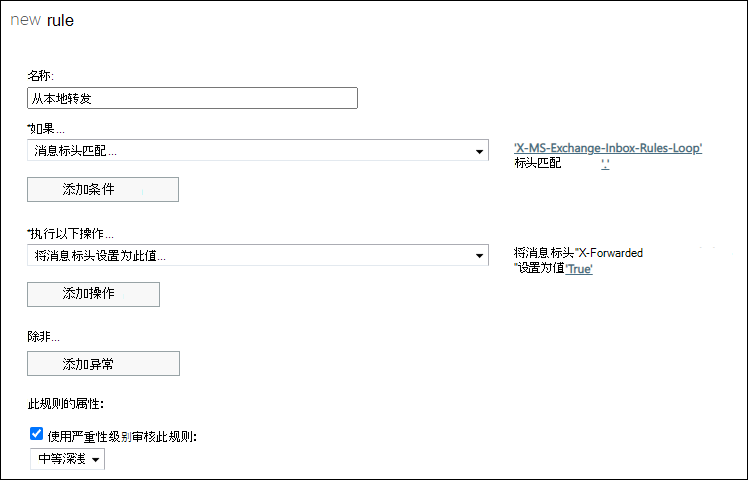

# 控制邮件中的自动外部电子邮件Microsoft 365

[!INCLUDE [Microsoft 365 Defender rebranding](../includes/microsoft-defender-for-office.md)]

**适用对象**
- [Exchange Online Protection](exchange-online-protection-overview.md)
- [Microsoft Defender for Office 365 计划 1 和计划 2](defender-for-office-365.md)
- [Microsoft 365 Defender](../defender/microsoft-365-defender.md)

作为管理员，你可能要求限制或控制自动转发给组织外部 (外部收件人的邮件) 。 电子邮件转发可能很有用，但也可能由于信息泄露而带来安全风险。 攻击者可能会使用此信息来攻击你的组织或合作伙伴。

以下类型的自动转发在Microsoft 365：

- 用户可以将 [收件箱规则](https://support.microsoft.com/office/c24f5dea-9465-4df4-ad17-a50704d66c59) 配置为自动将邮件转发给外部发件人 (或由于帐户遭到入侵) 。
- 管理员可以配置邮箱 [转发 (](/exchange/recipients-in-exchange-online/manage-user-mailboxes/configure-email-forwarding)_也称为 SMTP_ 转发) 自动将邮件转发给外部收件人。 管理员可以选择是直接转发邮件，还是保留邮箱中转发邮件的副本。

> [!NOTE]
> 通过本地电子邮件系统自动转发Microsoft 365将受与即将更新中的云邮箱相同的策略控制。 此更新将通过消息中心帖子进行通信。

您可以使用出站垃圾邮件筛选器策略来控制自动转发给外部收件人。 有三种设置可用：

- **自动 - 系统控制**：这是默认设置。 此设置现在与"关 **"相同**。 最初引入此设置时，它等效于 **"打开"**。 随着时间的推移，由于默认安全原则，此设置已 针对所有客户逐渐更改为 **"** 关闭"。 有关详细信息，请参阅 [此博客文章](https://techcommunity.microsoft.com/t5/exchange-team-blog/all-you-need-to-know-about-automatic-email-forwarding-in/ba-p/2074888)。 
- **On**：允许且不允许自动外部转发。
- **关闭**：自动外部转发处于禁用状态，将导致向发件人发送 (NDR 或退回邮件) 未送达报告。

有关如何配置这些设置的说明，请参阅在 EOP 中配置出 [站垃圾邮件筛选](configure-the-outbound-spam-policy.md)。

> [!NOTE]
>
> - 禁用自动转发会禁用任何收件箱规则 (用户) 或邮箱转发 (管理员) 将邮件重定向到外部地址。
>
> - 出站垃圾邮件筛选器策略中的设置不会在内部用户之间自动转发邮件。

## 出站垃圾邮件筛选器策略设置如何与其他自动电子邮件转发控件一起工作

作为管理员，您可能已经配置了其他控件以允许或阻止自动电子邮件转发。 例如：

- [允许或](/exchange/mail-flow-best-practices/remote-domains/remote-domains) 阻止自动电子邮件转发到某些或所有外部域的远程域。
- 邮件流规则Exchange[中的](/exchange/security-and-compliance/mail-flow-rules/mail-flow-rules)条件和操作 (传输规则) 检测并阻止自动转发给外部收件人的邮件。

当一个设置允许外部转发，而另一个设置阻止外部转发时，该块通常优先。 下表中描述了示例：

|应用场景|结果|
|---|---|
|<ul><li>配置远程域设置以允许自动转发。</li><li>出站垃圾邮件筛选器策略中的自动转发设置为"关闭 **"**。</li></ul>|自动转发给受影响域中收件人的邮件将被阻止。|
|<ul><li>配置远程域设置以允许自动转发。</li><li>出站垃圾邮件筛选策略中的自动转发设置为自动 **- 系统控制**。</li></ul>|自动转发给受影响域中收件人的邮件将被阻止。 
 如前面所述， **自动 - 系统控制** 用于表示 **"** 开"，但设置已随着时间的推移而更改为在所有组织中都为 **"关闭** "。 
 为绝对清楚起见，您应将出站垃圾邮件筛选器策略配置为 **"开** "或" **关"**。|
|<ul><li>出站垃圾邮件筛选器策略中的自动转发设置为 **"开"**</li><li>您可以使用邮件流规则或远程域来阻止自动转发的电子邮件。</li></ul>|邮件流规则或远程域阻止将自动转发给受影响的收件人的邮件。|

您可以使用此行为 (例如，) 出站垃圾邮件筛选器策略中允许自动转发，但使用远程域控制用户可以将邮件转发到的外部域。

## 如何查找自动转发的用户

您可以在基于云的帐户的自动转发邮件报告中查看有关自动将邮件转发给外部收件人的用户的信息。 对于通过邮件流自动从本地电子邮件系统转发Microsoft 365，您需要创建邮件流规则来跟踪这些用户。 有关如何创建邮件流规则的说明，请参阅使用 [EAC 创建邮件流规则](/exchange/security-and-compliance/mail-flow-rules/manage-mail-flow-rules#use-the-eac-to-create-a-mail-flow-rule)。

在 EAC Exchange 管理中心内创建邮件流规则 (以下信息) ：

- **如果满足以下条件 (** 应用) ：**邮件**\>头 **与这些文本模式匹配**。 请注意，可能需要单击" **更多选项** "来查看此选项。
  - **标头名称**： `X-MS-Exchange-Inbox-Rules-Loop`
  - **标头值**： `.`

  条件如下所示："**X-MS-Exchange-Inbox-Rules-Loop"** 标头与"**."匹配。**

  此条件将匹配标头的任何值。

-  (可选) **执行以下 (** 操作) ：可以配置可选操作。 例如，可以使用操作修改邮件 **属性**\>设置邮件头，标头名称 **为 X-Forwarded**，值为 **True**。 但是，不需要配置操作。
- 将 **"使用严重性级别审核此审核"设置为**"**低****、中"** 或"高 **"值**。 此设置允许您使用传输[Exchange报告](view-email-security-reports.md#exchange-transport-rule-report)获取正在转发的用户的详细信息。

## 阻止的电子邮件转发邮件

当邮件被检测为自动转发，并且出站垃圾邮件筛选器策略阻止该活动时，该邮件将在包含以下信息的 NDR 中返回给发件人：

`5.7.520 Access denied, Your organization does not allow external forwarding. Please contact your administrator for further assistance. AS(7555)`
