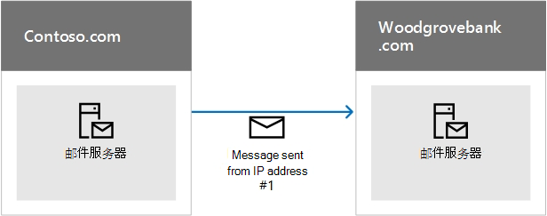
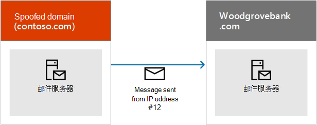
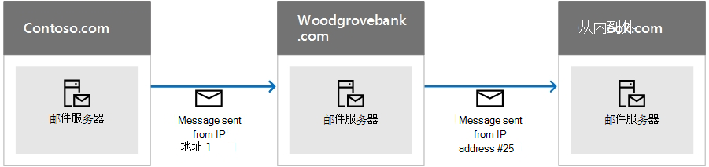

# <a name="how-microsoft-365-uses-sender-policy-framework-spf-to-prevent-spoofing"></a>Microsoft 365 如何使用发件人策略框架 (SPF) 来防止欺骗

 **摘要：** 本文介绍了 Microsoft 365 如何在 DNS 中使用发件人策略框架（SPF） TXT 记录来确保目标电子邮件系统信任从自定义域发送的邮件。 这适用于从 Microsoft 365 发送的出站邮件。 从 Microsoft 365 发送到 Microsoft 365 中的收件人的邮件将始终通过 SPF。

SPF TXT 记录是一个 DNS 记录，通过验证发出电子邮件的域的域名，帮助阻止欺骗和钓鱼。SPF 根据发送域的可疑所有者来验证发件人的 IP 地址，从而验证电子邮件的来源。

> [!NOTE]
> Internet 工程任务组 (IETF) 于 2014 年弃用 SPF 记录类型。请务必在 DNS 中改用 TXT 记录来发布 SPF 信息。为清楚起见，本文的其余部分使用 SPF TXT 记录一词。

域管理员在 DNS 的 TXT 记录中发布 SPF 信息。 SPF 信息可以标识得到授权的出站电子邮件服务器。 目标电子邮件系统验证邮件是否来自得到授权的出站电子邮件服务器。 如果您已熟悉 SPF，或者您有简单的部署，并且只需要了解在 Microsoft 365 的 DNS 中要包含在 SPF TXT 记录中的内容，则可以转到[在 microsoft 365 中设置 spf 以帮助防止欺骗](set-up-spf-in-office-365-to-help-prevent-spoofing.md)。 如果您没有在 Microsoft 365 中完全托管的部署，或者您希望了解有关 SPF 的工作方式或如何对 Microsoft 365 的 SPF 进行故障排除的详细信息，请继续阅读。

> [!NOTE]
> 以前，如果还使用了 SharePoint Online，必须向自定义域添加不同的 SPF TXT 记录。 现在，不再需要这样做。 此更改应该会降低 SharePoint Online 通知邮件最终被转入垃圾电子邮件文件夹的风险。 您无需立即进行任何更改，但如果收到 "查找次数过多" 错误，请按照在[Microsoft 365 中设置 spf](set-up-spf-in-office-365-to-help-prevent-spoofing.md)中所述修改 SPF TXT 记录，以帮助防止欺骗。

## <a name="how-spf-works-to-prevent-spoofing-and-phishing-in-microsoft-365"></a>在 Microsoft 365 中阻止哄骗和网络钓鱼的 SPF 的工作方式
<a name="HowSPFWorks"> </a>

SPF 确定是否允许发件人代表域发送邮件。如果不允许发件人发送邮件，即电子邮件无法通过接收服务器上的 SPF 检查，那么在该服务器上配置垃圾邮件策略会确定如何处理该邮件。

每个 SPF TXT 记录包含三个部分：SPF TXT 记录声明、允许从你的域和可以代表你的域发送邮件的外部域发送邮件的 IP 地址，以及强制规则。 三个部分俱全，才算是有效的 SPF TXT 记录。 本文介绍如何形成 SPF TXT 记录，并提供使用 Microsoft 365 中的服务的最佳实践。 此外，还提供了说明链接，指导你如何使用你的域注册机构将记录发布到 DNS。

### <a name="spf-basics-ip-addresses-allowed-to-send-from-your-custom-domain"></a>SPF 基础知识：允许从自定义域发送邮件的 IP 地址
<a name="SPFBasicsIPaddresses"> </a>

看看 SPF 规则的基本语法：

v = spf1 \<IP\>\<enforcement rule\>

例如，假设 contoso.com 存在以下 SPF 规则：

v = spf1 \<IP address #1\> \<IP address #2\> \<IP address #3\>\<enforcement rule\>

在本示例中，SPF 规则指示接收电子邮件服务器仅为域 contoso.com 接受来自这些 IP 地址的邮件。

- IP 地址 #1

- IP 地址 #2

- IP 地址 #3

此 SPF 规则指示接收电子邮件服务器，如果邮件是从 contoso.com 发送，而不是从这三个 IP 地址中的任何一个发送，则接收服务器应将强制规则应用于邮件。强制规则通常是下列选项之一：

- **硬失败。** 在邮件信封中用"硬失败"标记邮件，然后此类型的邮件遵照接收服务器的配置垃圾邮件策略。

- **软失败。** 在邮件信封中用"软失败"标记邮件。通常，电子邮件服务器配置为始终传递这些邮件。大多数最终用户不会看到此标记。

- **中性。** 不执行任何操作，即不标记邮件信封。通常将此选项保留用于测试，而且也很少使用。

下面的示例显示了 SPF 在不同情况中的工作原理。在这些示例中，contoso.com 是发件人，woodgrovebank.com 收件人。

### <a name="example-1-email-authentication-of-a-message-sent-directly-from-sender-to-receiver"></a>示例 1：直接从发送人发送到收件人的邮件的电子邮件身份验证
<a name="spfExample1"> </a>

SPF 最适用于从发件人到收件人的路径是直接路径的情况，例如：



Woodgrovebank.com 接收邮件时，如果 IP 地址 #1 在 contoso.com 的 SPF TXT 记录中，则消息通过 SPF 检查并进行身份验证。

### <a name="example-2-spoofed-sender-address-fails-the-spf-check"></a>示例 2：欺骗性发件人地址无法通过 SPF 检查
<a name="spfExample2"> </a>

假设欺诈者找到办法欺骗 contoso.com：



由于 IP 地址 #12 不在 contoso.com 的 SPF TXT 记录中，邮件无法通过 SPF 检查，收件人可以选择将其标记为垃圾邮件。

### <a name="example-3-spf-and-forwarded-messages"></a>示例 3：SPF 和转发的邮件
<a name="spfExample3"> </a>

SPF 的一个缺点是它对转发的电子邮件不起作用。例如，假设 woodgrovebank.com 的用户已经设置了转发规则将所有电子邮件发送到 outlook.com 帐户：



此邮件最初可以通过 woodgrovebank.com 的 SPF 检查，但无法通过 outlook.com 的 SPF 检查，因为 IP #25 不在 contoso.com 的 SPF TXT 记录中。Outlook.com 则可能将邮件标记为垃圾邮件。若要解决此问题，请结合使用 SPF 和其他电子邮件身份验证方法（如 DKIM 和 DMARC）。

### <a name="spf-basics-including-third-party-domains-that-can-send-mail-on-behalf-of-your-domain"></a>SPF 基础知识：包括可以代表您的域发送邮件的第三方域
<a name="SPFBasicsIncludes"> </a>

除 IP 地址外，您还可以配置您的 SPF TXT 记录以包括域作为发件人。这些都作为"include"语句添加到 SPF TXT 记录中。例如，contoso.com 可能想要包括所有来自 contoso.net 以及它另外拥有的 contoso.org 的邮件服务器的 IP 地址。为了实现此目的，contoso.com 发布了 SPF TXT 记录，如下所示：

```text
v=spf1 include:contoso.net include:contoso.org -all
```

当接收服务器在 DNS 中看到此记录时，它还对 contoso.net 的 SPF TXT 记录执行 DNS 查找，然后对 contoso.org 执行 DNS 查找。如果它在 contoso.net 或 contoso.org 的记录中找到附加的 include 语句，它也会遵循这些语句。 为了帮助防止拒绝服务攻击，一封电子邮件的 DNS 查找的最大次数是 10 次。 每个 include 语句都表示一个额外的 DNS 查找。 如果邮件超过 10 次限制，则该邮件将无法通过 SPF 检查。 邮件达到此限制后，根据接收服务器的配置方式，发件人可能会收到一条消息，指出邮件生成的 "查找次数过多" 或 "邮件的最大跃点计数" （在查找循环和超过 DNS 超时时可能会发生这种情况）。 有关如何避免此问题的提示，请参阅[疑难解答： Microsoft 365 中 SPF 的最佳实践](how-office-365-uses-spf-to-prevent-spoofing.md#SPFTroubleshoot)。

## <a name="requirements-for-your-spf-txt-record-and-microsoft-365"></a>您的 SPF TXT 记录和 Microsoft 365 的要求
<a name="SPFReqsinO365"> </a>

如果在设置 Microsoft 365 时设置了邮件，则您已经创建了一个 SPF TXT 记录，用于将 Microsoft 邮件服务器标识为域的合法邮件源。 此记录可能如下所示：

```text
v=spf1 include:spf.protection.outlook.com -all
```

如果你是完全托管的客户，即没有可发送出站邮件的本地邮件服务器，这是您需要为 Office 365 发布的唯一 SPF TXT 记录。

如果你有混合部署（即，您的一些邮箱在本地，有些托管在 Microsoft 365 中，如果您是 Exchange Online Protection （EOP）独立客户（即，您的组织使用 EOP 保护您的内部部署邮箱），则应将每个内部部署边缘邮件服务器的出站 IP 地址添加到 DNS 中的 SPF TXT 记录。

## <a name="form-your-spf-txt-record-for-microsoft-365"></a>为 Microsoft 365 构成 SPF TXT 记录
<a name="FormYourSPF"> </a>

请参考本文中的语法信息，构成自定义域的 SPF TXT 记录。尽管还有其他语法选项本文未提及，这些都是最常用的选项。在构成记录后，需要在域注册机构更新记录。

若要了解有关要包含在 Microsoft 365 中的域的信息，请参阅[SPF 所需的外部 DNS 记录](https://docs.microsoft.com/office365/enterprise/external-domain-name-system-records)。 使用[分步操作说明](https://docs.microsoft.com/microsoft-365/admin/get-help-with-domains/create-dns-records-at-any-dns-hosting-provider#add-a-txt-record-for-spf-to-help-prevent-email-spam)更新域注册机构的 SPF (TXT) 记录。

### <a name="spf-txt-record-syntax-for-microsoft-365"></a>适用于 Microsoft 365 的 SPF TXT 记录语法
<a name="SPFSyntaxO365"> </a>

Microsoft 365 的典型 SPF TXT 记录具有以下语法：

```text
v=spf1 [<ip4>|<ip6>:<IP address>] [include:<domain name>] <enforcement rule>
```

例如：

```text
v=spf1 ip4:192.168.0.1 ip4:192.168.0.2 include:spf.protection.outlook.com -all
```

其中：

- **v=spf1** 是必需的，用于将 TXT 记录定义为 SPF TXT 记录。

- **ip4** 表示您使用的是 IP 第 4 版地址。**ip6** 表示您使用的是 IP 第 6 版地址。如果您使用的是 IPv6 IP 地址，则将 **ip4** 替换为本文示例中的 **ip6**。您还可以使用 CIDR 表示法指定 IP 地址范围，例如 **ip4:192.168.0.1/26**。

- _IP address_ 是要添加到 SPF TXT 记录的 IP 地址。 通常情况下，这是组织的出站邮件服务器的 IP 地址。 可以列出多个出站邮件服务器。 有关详细信息，请参阅[示例：多个出站本地邮件服务器和 Microsoft 365 的 SPF TXT 记录](how-office-365-uses-spf-to-prevent-spoofing.md#ExampleSPFMultipleMailServerO365)。

- _domain name_ 是您想要添加为合法发件人的域。 若要获取 Microsoft 365 应包含的域名列表，请参阅[SPF 所需的外部 DNS 记录](https://docs.microsoft.com/office365/enterprise/external-domain-name-system-records)。

- 强制规则通常是下列之一：

  - -all

    表示硬失败。如果您知道您的域的所有授权 IP 地址，请在 SPF TXT 记录中列出这些地址并使用 -all（硬失败）限定符。此外，如果您仅使用 SPF，即不使用 DMARC 或 DKIM，您应使用 -all 限定符。我们建议您始终使用此限定符。

  - ~all

    表示软失败。如果您不确定是否有 IP 地址的完整列表，那么您应该使用 ~all（软失败）限定符。此外，如果您使用的是 p=quarantine 或 p=reject 的 DMARC，则可以使用 ~all。否则，请使用 -all。

  - ?all

    表示中性。这在测试 SPF 时使用。不建议您在实时部署中使用此限定符。

### <a name="example-spf-txt-record-to-use-when-all-of-your-mail-is-sent-by-microsoft-365"></a>示例：在 Microsoft 365 发送所有邮件时要使用的 SPF TXT 记录
<a name="ExampleSPFNoSP"> </a>

如果你的所有邮件均由 Microsoft 365 发送，请在你的 SPF TXT 记录中使用它：

```text
v=spf1 include:spf.protection.outlook.com -all
```

### <a name="example-spf-txt-record-for-a-hybrid-scenario-with-one-on-premises-exchange-server-and-microsoft-365"></a>示例：具有一个本地 Exchange Server 和 Microsoft 365 的混合方案的 SPF TXT 记录
<a name="ExampleSPFHybridOneExchangeServer"> </a>

在混合环境中，如果本地 Exchange Server 的 IP 地址为 192.168.0.1，为了将 SPF 强制规则设置为硬故障，请构成如下 SPF TXT 记录：

```text
v=spf1 ip4:192.168.0.1 include:spf.protection.outlook.com -all
```

### <a name="example-spf-txt-record-for-multiple-outbound-on-premises-mail-servers-and-microsoft-365"></a>示例：多个出站本地邮件服务器和 Microsoft 365 的 SPF TXT 记录
<a name="ExampleSPFMultipleMailServerO365"> </a>

如果有多个出站邮件服务器，可以在 SPF TXT 记录中添加每个邮件服务器的 IP 地址，并用空格（后跟"ip4:"语句）分隔每个 IP 地址。例如：

```text
v=spf1 ip4:192.168.0.1 ip4:192.168.0.2 ip4:192.168.0.3 include:spf.protection.outlook.com -all
```

## <a name="next-steps-set-up-spf-for-microsoft-365"></a>后续步骤：为 Microsoft 365 设置 SPF
<a name="SPFNextSteps"> </a>

制定 SPF TXT 记录后，请按照在[Microsoft 365 中设置 SPF](set-up-spf-in-office-365-to-help-prevent-spoofing.md)中的步骤操作，以帮助防止欺骗将其添加到你的域中。

尽管 SPF 旨在帮助防止欺骗，但还有 SPF 无法防止的欺骗技术。 为了防止这些情况，在设置 SPF 之后，还应为 Microsoft 365 配置 DKIM 和 DMARC。 若要开始，请参阅[使用 DKIM 验证从 Microsoft 365 中的自定义域发送的出站电子邮件](use-dkim-to-validate-outbound-email.md)。 然后，请参阅[使用 DMARC 验证 Microsoft 365 中的电子邮件](use-dmarc-to-validate-email.md)。

## <a name="troubleshooting-best-practices-for-spf-in-microsoft-365"></a>故障排除： Microsoft 365 中 SPF 的最佳实践
<a name="SPFTroubleshoot"> </a>

只能为自定义域创建一个 SPF TXT 记录。创建多个记录会导致轮循机制发生，并且 SPF 也会失败。为了避免发生这种情况，可以为每个子域单独创建记录。例如，为 contoso.com 创建一个记录，为 bulkmail.contoso.com 创建另一个记录。

如果在传递邮件之前，电子邮件引起超过 10 次 DNS 查找，那么接收邮件服务器将使用永久性错误进行响应，也称为  _permerror_，并且会导致邮件无法通过 SPF 检查。接收服务器还可能使用未送达报告 (NDR) 进行响应，其中包含一个类似以下的错误：

- 邮件超出跃点计数。

- 邮件需要的查找次数过多。

## <a name="avoiding-the-too-many-lookups-error-when-you-use-third-party-domains-with-microsoft-365"></a>在 Microsoft 365 中使用第三方域时，避免出现 "太多查找" 错误
<a name="SPFTroubleshoot"> </a>

第三方域的一些 SPF TXT 记录指示接收服务器执行大量 DNS 查找。例如，在撰写本文时，Salesforce.com 的记录中包含 5 个 include 语句：

```text
v=spf1 include:_spf.google.com
include:_spfblock.salesforce.com
include:_qa.salesforce.com
include:_spfblock1.salesforce.com
include:spf.mandrillapp.com mx ~all
```

若要避免此错误，您可以实现一个允许任何人发送批量电子邮件的策略，例如，必须使用为此专门创建的一个子域。然后，您可以为包含批量电子邮件的子域定义不同的 SPF TXT 记录。

 在某些情况下，如 salesforce.com 示例，您必须使用您的 SPF TXT 记录中的域，但在其他情况下，第三方可能已创建要用于此目的的一个子域。例如，exacttarget.com 已经创建了一个需要用于您的 SPF TXT 记录的子域：

```text
cust-spf.exacttarget.com
```

当您的 SPF TXT 记录中包含第三方域时，您需要与第三方进行确认要使用哪些域或子域以避免运行次数达到 10 次查找限制。

## <a name="how-to-view-your-current-spf-txt-record-and-determine-the-number-of-lookups-that-it-requires"></a>如何查看当前 SPF TXT 记录，并确定它需要的查找次数
<a name="SPFTroubleshoot"> </a>

可以使用 nslookup 查看 DNS 记录，包括 SPF TXT 记录。或者，如果需要，还可以使用许多免费的联机工具来查看 SPF TXT 记录的内容。通过查看 SPF TXT 记录并遵循 include 语句链和重定向，可以确定记录需要的 DNS 查找次数。一些联机工具甚至会计算并显示查找次数。跟踪查找次数将有助于防止从组织发送的邮件触发接收服务器生成永久性错误（称为 permerror）。

## <a name="for-more-information"></a>更多详细信息
<a name="SPFTroubleshoot"> </a>

需要有关添加 SPF TXT 记录的？ 阅读文章 "[在任何 DNS 托管提供商处创建 dns 记录" microsoft 365](https://docs.microsoft.com/microsoft-365/admin/get-help-with-domains/create-dns-records-at-any-dns-hosting-provider#add-a-txt-record-for-spf-to-help-prevent-email-spam) ，以了解有关在 microsoft 365 中使用自定义域的发件人策略框架的详细信息。 [反垃圾邮件邮件头](anti-spam-message-headers.md)包括 Microsoft 365 用于 SPF 检查的语法和标头字段。


