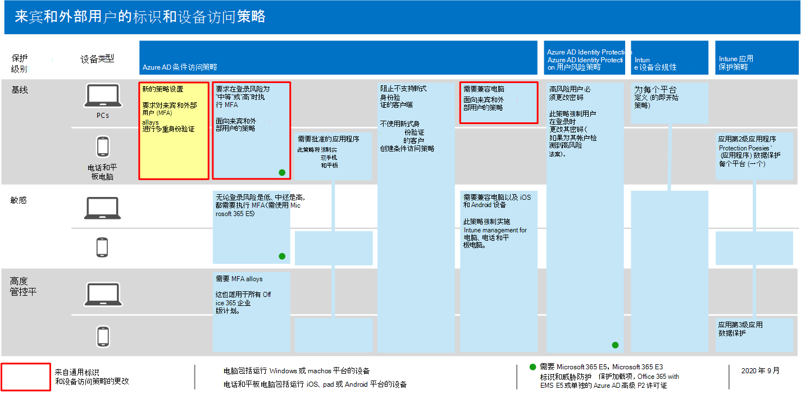

# 允许来宾访问和 B2B 外部用户访问的策略

本文讨论调整推荐的设备和标识访问策略，以允许具有 Azure Active Directory (Azure AD) 企业到企业 (B2B) 帐户的来宾和外部用户访问。 本指南基于通用 [标识和设备访问策略](identity-access-policies.md)。

这些建议旨在应用于 **保护的基线** 层。 但您也可以根据敏感和高度管控保护的特定需求 **调整建议**。 

为 B2B 帐户提供向 Azure AD 租户进行身份验证的路径不会授予这些帐户访问整个环境的访问权限。 B2B 用户及其帐户有权访问由条件访问策略与它们共享的服务和资源（如文件）。

## 更新常见策略以允许和保护来宾和外部用户访问

此图显示了在通用标识和设备访问策略之间添加或更新哪些策略，用于 B2B 来宾和外部用户访问。

[查看此图像的较大版本](https://github.com/MicrosoftDocs/microsoft-365-docs/raw/public/microsoft-365/media/microsoft-365-policies-configurations/identity-access-ruleset-guest.png)

下表列出了创建和更新所需的策略。 常见策略链接到通用标识和设备访问策略文章中的 [关联配置](identity-access-policies.md) 说明。

|保护级别|策略|更多信息|
|---|---|---|
|**Baseline**|[始终要求来宾和外部用户使用 MFA](identity-access-policies.md#require-mfa-based-on-sign-in-risk)|创建此新策略并配置： <ul><li>对于 **分配>包括** 的用户和组>，选择"选择用户 **和组**"，然后选择"所有 **来宾用户"和"外部用户"。**</li><li>对于 **>条件>，** 保留所有选项未选中状态，以始终在 MFA (多重) 。</li></ul>|
||[当登录风险为中或高 *时需要* MFA](identity-access-policies.md#require-mfa-based-on-sign-in-risk)|修改此策略以排除来宾和外部用户。|
||[需要兼容电脑](identity-access-policies.md#require-compliant-pcs-but-not-compliant-phones-and-tablets)|修改此策略以排除来宾和外部用户。|

若要在条件访问策略中包括或排除来宾和外部用户，>用户和组分配>**包含或** 排除，请检查所有 **来宾和外部用户**。 

## 更多信息

### 使用 Microsoft Teams 的来宾和外部用户访问

Microsoft Teams 定义以下用户：

- **来宾访问** 使用 Azure AD B2B 帐户，可添加为团队成员，并有权访问团队的通信和资源。

- **外部** 访问适用于没有 B2B 帐户的外部用户。 外部用户访问包括邀请、通话、聊天和会议，但不包括团队成员身份和访问团队资源。

有关详细信息，请参阅来宾和团队 [的外部用户访问之间的比较](https://docs.microsoft.com/microsoftteams/communicate-with-users-from-other-organizations#compare-external-and-guest-access)。

有关保护 Teams 的标识和设备访问策略详细信息，请参阅用于保护 Teams 聊天、组和文件的策略 [建议](teams-access-policies.md)。

### 始终要求来宾和外部用户使用 MFA

此策略会提示来宾在租户中注册 MFA，无论他们是否在家庭租户中注册了 MFA。 访问租户中的资源时，来宾和外部用户需要针对每个请求使用 MFA。

### 从基于风险的 MFA 中排除来宾和外部用户

虽然组织可以使用 Azure AD Identity Protection 为 B2B 用户强制执行基于风险的策略，但资源目录中 B2B 协作用户的 Azure AD Identity Protection 实施存在一些限制，因为 B2B 协作用户的身份已存储在其主目录中。 由于这些限制，Microsoft 建议从基于风险的 MFA 策略中排除来宾，并要求这些用户始终使用 MFA。

有关详细信息，请参阅 [B2B 协作用户的 Identity Protection 的限制](https://docs.microsoft.com/azure/active-directory/identity-protection/concept-identity-protection-b2b#limitations-of-identity-protection-for-b2b-collaboration-users)。

### 从设备管理中排除来宾和外部用户

只有一个组织可以管理设备。 如果未将来宾和外部用户从要求设备符合性的策略中排除，这些策略将阻止这些用户。

## 后续步骤

为：

- [Microsoft Teams](teams-access-policies.md)
- [Exchange Online](secure-email-recommended-policies.md)
- [SharePoint](sharepoint-file-access-policies.md)
