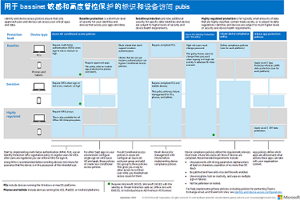

# 常见标识和设备访问策略

本文介绍用于保护对 Microsoft 365 云服务的访问的常见建议策略，包括使用 Azure Active Directory (Azure AD) 应用程序代理发布的本地应用程序。

本指南讨论如何在新设置的环境中部署建议的策略。 在单独的实验室环境中设置这些策略后，可以在暂存到生产前和生产环境之前了解和评估建议的策略。 新预配的环境可以是仅云环境或混合环境，以反映评估需求。

## 策略集

下图演示了建议的策略集。 它显示每个策略所适用的保护层，以及策略是应用于电脑、手机和平板电脑，还是适用于这两类设备。 它还指示配置这些策略的地方。

[查看此图像的较大版本](https://github.com/MicrosoftDocs/microsoft-365-docs/raw/public/microsoft-365/media/microsoft-365-policies-configurations/Identity_device_access_policies_byplan.png)

以下是包含指向各个策略的链接的一页 PDF 摘要：

   [以 PDF 格式查看](../../downloads/MSFT-cloud-architecture-identity-device-protection-handout.pdf) \|[下载为 PDF](https://github.com/MicrosoftDocs/microsoft-365-docs/raw/public/microsoft-365/downloads/MSFT-cloud-architecture-identity-device-protection-handout.pdf)

本文的其余部分介绍如何配置这些策略。

> [!NOTE]
> 在 Intune 中注册设备 (MFA) 要求使用多重身份验证，以确保设备由目标用户拥有。 必须先在 Intune 中注册设备，然后才能强制执行设备合规性策略。

为了让你有时间来完成这些任务，我们建议按此表中列出的顺序实现基准策略。 但是，可随时实施敏感和高度管控级别的 MFA 策略。

|保护级别|策略|更多信息|
|---|---|---|
|**Baseline**|[当登录风险为中或高 *时需要* MFA](#require-mfa-based-on-sign-in-risk)||
||[阻止不支持新式身份验证的客户端](#block-clients-that-dont-support-modern-authentication)|不使用新式身份验证的客户端可以绕过条件访问策略，因此阻止这些策略非常重要。|
||[高风险用户必须更改密码](#high-risk-users-must-change-password)|如果检测到其帐户存在高风险活动，则强制用户在登录时更改其密码。|
||[应用应用数据保护策略](#apply-app-data-protection-policies)|每个平台的一个 Intune 应用保护策略 (Windows、iOS/iPadOS、Android) 。|
||[需要批准的应用和应用保护](#require-approved-apps-and-app-protection)|使用 iOS、iPadOS 或 Android 对手机和平板电脑强制执行移动应用保护。|
||[定义设备合规性策略](#define-device-compliance-policies)|每个平台一个策略。|
||[需要兼容电脑](#require-compliant-pcs-but-not-compliant-phones-and-tablets)|使用 Windows 或 MacOS 强制执行电脑的 Intune 管理。|
|**敏感**|[当登录风险较低、中等或高时 *需要* MFA](#require-mfa-based-on-sign-in-risk)||
||[要求 *兼容电脑和* 移动设备](#require-compliant-pcs-and-mobile-devices)|对 Windows 或 MacOS (和手机) 平板电脑（iOS、iPadOS 或 Android (）强制执行 Intune) 。|
|**高度管控**|[*始终* 需要 MFA](#require-mfa-based-on-sign-in-risk)|
|

## 向组和用户分配策略

在配置策略之前，请确定你用于每一层保护的 Azure AD 组。 通常，基线保护适用于组织中的每个人。 同时包含基线和敏感保护的用户将应用所有基线策略以及敏感策略。 保护是累积的，并且强制执行最严格的策略。

建议的做法是创建用于条件访问排除的 Azure AD 组。 将此组添加到"分配"部分"用户和组"设置的"排除"值中的所有条件 **访问** 策略。 这样一来，您可以在解决访问问题时为用户提供访问权限。 建议仅作为临时解决方案。 监视此组的更改，并确保仅按预期使用排除组。

下面是要求 MFA 的组分配和排除的示例。

以下是结果：

- 当登录风险为中或高时，所有用户都需要使用 MFA。

- 当登录风险较低、中等或较高时，Executive Staff 组的成员需要使用 MFA。

  在这种情况下，Executive Staff 组的成员与基线和敏感条件访问策略匹配。 两个策略的访问控制组合在一起，在这种情况下等效于敏感条件访问策略。

- 始终需要顶级机密项目 X 组的成员才能使用 MFA

  在这种情况下，顶级机密项目 X 组的成员匹配基线和高度管控的条件访问策略。 两个策略的访问控制组合在一起。 由于高度管控条件访问策略的访问控制更加严格，因此使用了该访问控制。

向组和用户应用更高级别的保护时请小心。 例如，顶级机密项目 X 组的成员每次登录时都需要使用 MFA，即使他们未处理 Project X 的高度管控内容。

作为这些建议的一部分创建的所有 Azure AD 组都必须创建为 Microsoft 365 组。 这一点对于在 Microsoft Teams 和 SharePoint 中保护文档时部署敏感度标签非常重要。

## 基于登录风险要求 MFA

在要求用户使用 MFA 之前，应让用户注册 MFA。 如果你有 Microsoft 365 E5、Identity 为 & 威胁防护加载项的 Microsoft 365 E3、带 EMS E5 的 Office 365 或单个 Azure AD Premium P2 许可证，可以使用具有 Azure AD Identity Protection 的 MFA 注册策略来要求用户注册 MFA。 先决条件 [工作](identity-access-prerequisites.md) 包括使用 MFA 注册所有用户。

注册用户后，可以使用新的条件访问策略要求 MFA 进行登录。

1. 转到 [Azure 门户](https://portal.azure.com)，然后使用你的凭据登录。
2. 在 Azure 服务列表中，选择 **"Azure Active Directory"。**
3. 在"**管理**"列表中，**选择"安全性**"，然后选择"**条件访问"。**
4. 选择 **"新建** 策略"并键入新策略的名称。

下表介绍了根据登录风险要求 MFA 的条件访问策略设置。

在 **"分配"** 部分：

|设置|属性|值|注意|
|---|---|---|---|
|用户和组|包括|**选择用户和>组**：选择包含目标用户帐户的特定组。|从包含试点用户帐户的组开始。|
||排除|**用户和组**：选择条件访问异常组;服务帐户 (应用标识) 。|应根据需要临时修改成员身份。|
|云应用或操作|**云应用>包括**|**选择应用**：选择要应用此策略的应用。 例如，选择 Exchange Online。||
|条件|||配置特定于您的环境和需求的条件。|
||登录风险||请参阅下表中的指南。|
|

### 登录风险条件设置

根据目标保护级别应用风险级别设置。

|保护级别|所需的风险级别值|操作|
|---|---|---|
|基线|高、中|检查两者。|
|敏感|高、中、低|检查所有三项。|
|高度管控||保留所有选项未选中状态，以始终强制执行 MFA。|
|

在 **"访问控制"** 部分：

|设置|属性|值|操作|
|---|---|---|---|
|授予|**Grant access**||Select|
|||**需要多重身份验证**|支票|
||**需要所有已选控件**||Select|
|

选择 **"** 选择"保存 **"授予"** 设置。

最后，选择 **"启用****"策略，** 然后选择"**创建"。**

此外，还应考虑使用 [What if](https://docs.microsoft.com/azure/active-directory/active-directory-conditional-access-whatif) 工具测试策略。

## 阻止不支持新式身份验证的客户端

将这些表中的设置用于条件访问策略，以阻止不支持新式验证的客户端。

请参阅 [本文，](../../enterprise/microsoft-365-client-support-modern-authentication.md) 了解 Microsoft 365 中支持新式身份验证的客户端列表。

在 **"分配"** 部分：

|设置|属性|值|注意|
|---|---|---|---|
|用户和组|包括|**选择用户和>组**：选择包含目标用户帐户的特定组。|从包含试点用户帐户的组开始。|
||排除|**用户和组**：选择条件访问异常组;服务帐户 (应用标识) 。|应根据需要临时修改成员身份。|
|云应用或操作|**云应用>包括**|**选择应用**：选择与不支持新式验证的客户端对应的应用。||
|条件|**客户端应用**|选择 **"是** "进行 **配置** 
 清除浏览器和移动应用以及 **桌面客户端的选中标记**||
|

在 **"访问控制"** 部分：

|设置|属性|值|操作|
|---|---|---|---|
|授予|**阻止访问**||Select|
||**需要所有已选控件**||Select|
|

选择 **"** 选择"保存 **"授予"** 设置。

最后，为 **启用策略选择"打开****"，** 然后选择"**创建"。**

请考虑使用 [What if](https://docs.microsoft.com/azure/active-directory/active-directory-conditional-access-whatif) 工具测试策略。

对于 Exchange Online，可以使用身份验证策略禁用 [基本](https://docs.microsoft.com/exchange/clients-and-mobile-in-exchange-online/disable-basic-authentication-in-exchange-online)身份验证，这将强制所有客户端访问请求使用新式身份验证。

## 高风险用户必须更改密码

为确保在登录时强制所有高风险用户遭到入侵的帐户执行密码更改，必须应用以下策略。

Log in to the [Microsoft Azure portal (https://portal.azure.com)](https://portal.azure.com/) with your administrator credentials, and then navigate to **Azure AD Identity Protection > User Risk Policy**.

在 **"分配"** 部分：

|类型|属性|值|操作|
|---|---|---|---|
|Users|包括|**所有用户**|Select|
|用户风险|**High**||Select|
|

在"第二 **个分配"** 部分：

|类型|属性|值|操作|
|---|---|---|---|
|访问|**允许访问**||Select|
|||**需要更改密码**|支票|
|

选择 **"** 完成"保存 **Access** 设置。

最后，选择 **"打开** 以强制执行 **策略**"，然后选择"**保存"。**

请考虑使用 [What if](https://docs.microsoft.com/azure/active-directory/active-directory-conditional-access-whatif) 工具测试策略。

结合配置 [Azure AD](https://docs.microsoft.com/azure/active-directory/authentication/concept-password-ban-bad)密码保护使用此策略，可检测和阻止已知的弱密码及其变体以及特定于您的组织的其他弱术语。 使用 Azure AD 密码保护可确保已更改的密码是强密码。

## 应用 APP 数据保护策略

APP (策略) 定义允许哪些应用以及这些应用可以使用组织数据采取的操作。 APP 中的可用选项使组织能够定制保护以满足其特定需求。 对于一些用户，实现完整方案所需的策略设置可能并不明显。 为了帮助组织确定移动客户端终结点强化的优先级，Microsoft 引入了适用于 iOS 和 Android 移动应用管理的 APP 数据保护框架的分类。

APP 数据保护框架分为三个不同的配置级别，每个级别都从上一级别构建：

- **企业基本数据保护 (** 级别 1) 可确保应用使用 PIN 进行保护并加密，并执行选择性擦除操作。 对于 Android 设备，此级别验证 Android 设备证明。 这是一种入口点配置，在 Exchange Online 邮箱策略中提供类似的数据保护控制，并且向 APP 引入了 IT 和用户总体。
- **企业增强的数据保护 (** 级别 2) 引入了 APP 数据泄露防护机制和最低操作系统要求。 这是适用于访问工作或学校数据的大多数移动用户的配置。
- **企业高级数据保护 (** 级别 3) 引入了高级数据保护机制、增强的 PIN 配置和 APP 移动威胁防护。 访问高风险数据的用户需要此配置。

To see the specific recommendations for each configuration level and the minimum apps that must be protected， review [Data protection framework using app protection policies.](https://docs.microsoft.com/mem/intune/apps/app-protection-framework)

使用标识和设备访问配置中概述的原则，基线和敏感保护层与级别 2 企业增强的数据保护设置紧密映射。 高度管控保护层紧密映射到级别 3 企业高数据保护设置。

|保护级别|应用保护策略|更多信息|
|---|---|---|
|基线|[级别 2 增强的数据保护](https://docs.microsoft.com/mem/intune/apps/app-protection-framework#level-2-enterprise-enhanced-data-protection)|级别 2 中强制执行的策略设置包括为级别 1 建议的所有策略设置，并且仅添加到或更新以下策略设置，以实施比级别 1 更多的控件和更复杂的配置。|
|敏感|[级别 2 增强的数据保护](https://docs.microsoft.com/mem/intune/apps/app-protection-framework#level-2-enterprise-enhanced-data-protection)|级别 2 中强制执行的策略设置包括为级别 1 建议的所有策略设置，并且仅添加到或更新以下策略设置，以实施比级别 1 更多的控件和更复杂的配置。|
|高度管控|[第 3 级企业高数据保护](https://docs.microsoft.com/mem/intune/apps/app-protection-framework#level-3-enterprise-high-data-protection)|级别 3 中强制执行的策略设置包括级别 1 和级别 2 建议的所有策略设置，并且仅添加或更新以下策略设置，以实施比级别 2 更多的控件和更复杂的配置。|
|

若要使用数据保护框架设置为 Microsoft Endpoint Manager (iOS 和 Android) 的每个平台创建新的应用保护策略，你可以：

1. 通过按照如何使用 Microsoft Intune 创建和部署应用保护策略中的 [步骤手动创建策略](https://docs.microsoft.com/mem/intune/apps/app-protection-policies)。
2. 使用 Intune 的[PowerShell](https://github.com/microsoftgraph/powershell-intune-samples)脚本导入[示例 Intune 应用保护策略配置框架 JSON](https://github.com/microsoft/Intune-Config-Frameworks/tree/master/AppProtectionPolicies)模板。

## 需要批准的应用和应用保护

若要强制执行在 Intune 中应用的应用保护策略，必须创建条件访问策略，以要求批准的客户端应用和 APP 保护策略中设置的条件。

强制执行 APP 保护策略需要一组策略，如"需要应用保护策略"中所述，用于通过条件 [访问访问云应用](https://docs.microsoft.com/azure/active-directory/conditional-access/app-protection-based-conditional-access)。 每个策略都包含在此推荐的标识和访问配置策略集内。

若要创建需要已批准应用和应用保护的条件访问策略，请按照方案 1 中的"步骤 1：为 Microsoft 365 配置 Azure AD 条件访问策略"操作 [：Microsoft 365](https://docs.microsoft.com/azure/active-directory/conditional-access/app-protection-based-conditional-access#scenario-1-office-365-apps-require-approved-apps-with-app-protection-policies)应用需要具有应用保护策略的已批准应用，该策略允许 Outlook for iOS 和 Outlook for Android，但阻止支持 OAuth 的 Exchange ActiveSync 客户端连接到 Exchange Online。

   > [!NOTE]
   > 此策略可确保移动用户可以使用适用的应用访问所有 Office 终结点。

如果要启用对 Exchange Online 的移动访问，请实现阻止 [ActiveSync](secure-email-recommended-policies.md#block-activesync-clients)客户端，这将Exchange ActiveSync利用基本身份验证的客户端连接到 Exchange Online。 此策略未在本文顶部的图中显示。 它在用于保护电子邮件的策略[建议中进行了描述和图片。](secure-email-recommended-policies.md)

 这些策略利用授权控件["需要批准的客户端应用"和](https://docs.microsoft.com/azure/active-directory/conditional-access/concept-conditional-access-grant#require-approved-client-app)"[需要应用保护策略"。](https://docs.microsoft.com/azure/active-directory/conditional-access/concept-conditional-access-grant#require-app-protection-policy)

最后，阻止 iOS 和 Android 设备上其他客户端应用的旧身份验证可确保这些客户端无法绕过条件访问策略。 如果你正在按照本文中的指南操作，则已经配置了不支持新式验证 [的阻止客户端](#block-clients-that-dont-support-modern-authentication)。

<!---
With Conditional Access, organizations can restrict access to approved (modern authentication capable) iOS and Android client apps with Intune app protection policies applied to them. Several Conditional Access policies are required, with each policy targeting all potential users. Details on creating these policies can be found in [Require app protection policy for cloud app access with Conditional Access](https://docs.microsoft.com/azure/active-directory/conditional-access/app-protection-based-conditional-access).

1. Follow "Step 1: Configure an Azure AD Conditional Access policy for Microsoft 365" in [Scenario 1: Microsoft 365 apps require approved apps with app protection policies](https://docs.microsoft.com/azure/active-directory/conditional-access/app-protection-based-conditional-access#scenario-1-office-365-apps-require-approved-apps-with-app-protection-policies), which allows Outlook for iOS and Android, but blocks OAuth capable Exchange ActiveSync clients from connecting to Exchange Online.

   > [!NOTE]
   > This policy ensures mobile users can access all Office endpoints using the applicable apps.

2. If enabling mobile access to Exchange Online, implement [Block ActiveSync clients](secure-email-recommended-policies.md#block-activesync-clients), which prevents Exchange ActiveSync clients leveraging basic authentication from connecting to Exchange Online.

   The above policies leverage the grant controls [Require approved client app](https://docs.microsoft.com/azure/active-directory/conditional-access/concept-conditional-access-grant#require-approved-client-app) and [Require app protection policy](https://docs.microsoft.com/azure/active-directory/conditional-access/concept-conditional-access-grant#require-app-protection-policy).

3. Disable legacy authentication for other client apps on iOS and Android devices. For more information, see [Block clients that don't support modern authentication](#block-clients-that-dont-support-modern-authentication).
-->

## 定义设备合规性策略

设备合规性策略定义设备必须满足的要求，以被确定为合规。 从 Microsoft Endpoint Manager 管理中心内创建 Intune 设备合规性策略。

必须为每个电脑、手机或平板电脑平台创建策略：

- Android 设备管理员
- Android 企业版
- iOS/iPadOS
- macOS
- Windows 8.1 及更高版本
- Windows 10 及更高版本

若要创建设备合规性策略，请使用管理员凭据登录到 [Microsoft Endpoint Manager](https://endpoint.microsoft.com)管理中心，然后导航到 **"设备** \> **合规性策略** \> **策略"。** 选择 **"创建策略"。**

若要部署设备合规性策略，必须将其分配给用户组。 创建并保存策略后分配策略。 在管理中心，选择策略，然后选择"分配 **"。** 选择要接收策略的组后，选择"保存"以保存该组分配并部署策略。

有关在 Intune 中创建合规性策略的分步指南，请参阅 [Intune 文档中的"在 Microsoft Intune](https://docs.microsoft.com/mem/intune/protect/create-compliance-policy) 中创建合规性策略"。

### 适用于 Windows 10 和更高版本的建议设置

对于运行 Windows 10 及更高版本的 PC，建议使用以下设置，如策略创建过程的步骤 **2：** 合规性设置中配置。

有关 **Windows 运行状况>服务评估规则** 的设备运行状况，请参阅此表。

|属性|值|操作|
|---|---|---|
|需要 BitLocker|需要|Select|
|要求在设备上启用安全启动|需要|Select|
|要求代码完整性|需要|Select|
|

对于 **设备属性**，请根据你的 IT 和安全策略为操作系统版本指定适当的值。

对于 **Configuration Manager 合规性，** 选择"**要求"。**

有关 **系统安全性，** 请参阅此表。

|类型|属性|值|操作|
|---|---|---|---|
|Password|需要密码才能解锁移动设备|需要|Select|
||简单密码|阻止|Select|
||密码类型|设备默认值|Select|
||最短密码长度|6 |类型|
||需要密码之前不活动的最大分钟数|15 |类型 
 Android 版本 4.0 及以上版本或 KNOX 4.0 及以上版本支持此设置。 对于 iOS 设备，它受 iOS 8.0 及以上版本支持。|
||密码过期 (天数) |41|类型|
||防止重复使用的以前密码的数量|5 |类型|
||当设备从移动和全息设备 (空闲状态时需要密码) |需要|适用于 Windows 10 和更高版本|
|加密|设备上数据存储的加密|需要|Select|
|设备安全性|防火墙|需要|Select|
||防病毒|需要|Select|
||反间谍软件|需要|Select 
 此设置需要向 Windows 安全中心注册的反间谍软件解决方案。|
|Defender|Microsoft Defender 反恶意软件|需要|Select|
||Microsoft Defender 反恶意软件最低版本||类型 
 仅支持 Windows 10 桌面版。 Microsoft 建议的版本与最新版本的后面版本不超过五个。|
||Microsoft Defender 反恶意软件签名最新|需要|Select|
||实时保护|需要|Select 
 仅支持 Windows 10 桌面版|
|

#### Microsoft Defender for Endpoint

|类型|属性|值|操作|
|---|---|---|---|
|适用于终结点的 Microsoft Defender 规则|要求设备处于计算机风险分数或处于计算机风险分数之下|中|Select|
|

## 要求符合标准的电脑 (但不符合标准的手机和平板电脑) 

在添加策略以要求兼容电脑之前，请务必将设备注册到 Intune 中以用于管理。 建议在将设备注册到 Intune 之前使用多重身份验证，确保设备由目标用户拥有。

若要要求兼容电脑：

1. 转到 [Azure 门户](https://portal.azure.com)，然后使用你的凭据登录。
2. 在 Azure 服务列表中，选择 **"Azure Active Directory"。**
3. 在"**管理**"列表中，**选择"安全性**"，然后选择"**条件访问"。**
4. 选择 **"新建** 策略"并键入新策略的名称。

5. 在 **"****分配"下**，选择"用户和组"，并包括您希望策略应用于的用户。 此外，排除条件访问排除组。

6. 在 **"分配"** 下 **，选择云应用或操作**。

7. 对于 **"包含**"， **选择>选择**"，然后从"云应用" **列表中选择所需的** 应用。 例如，选择 Exchange Online。 选择 **"完成** 时选择"。

8. 若要要求兼容电脑 (兼容手机和平板电脑) ，在"分配"下，选择">**设备平台"。**  选择 **"是** "进行 **配置**。 选择 **"选择设备平台**"，**选择 Windows** 和 **macOS，** 然后选择"**完成"。**

9. 在 **"访问控制"** 下，选择"**授予"。**

10. 选择 **"授予** 访问权限"，然后选中"要求 **设备标记为合规"。** 对于多个控件，选择 **"需要所有选定的控件"。** 完成后，选择"**选择"。**

11. 选择 **"** 启用 **"策略**，然后选择"**创建"。**

> [!NOTE]
> 在启用此策略之前，请确保你的设备合规。 否则，你将被锁定，并且将无法更改此策略，直到用户帐户添加到条件访问排除组。

## 要求 *兼容电脑和* 移动设备

若要要求所有设备的合规性：

1. 转到 [Azure 门户](https://portal.azure.com)，然后使用你的凭据登录。
2. 在 Azure 服务列表中，选择 **"Azure Active Directory"。**
3. 在"**管理**"列表中，**选择"安全性**"，然后选择"**条件访问"。**
4. 选择 **"新建** 策略"并键入新策略的名称。

5. 在 **"分配**" **下** ，选择"用户和组"，并包括您希望策略应用于的用户。 此外，排除条件访问排除组。

6. 在 **"分配"** 下 **，选择云应用或操作**。

7. 对于 **"包含****"，>** 选择应用，然后从云应用列表中选择 **所需的** 应用。 例如，选择 Exchange Online。 选择 **"完成** 时选择"。

8. 在 **"访问控制"** 下，选择"**授予"。**

9. 选择 **"授予** 访问权限"，然后选中"要求 **设备标记为合规"。** 对于多个控件，选择 **"需要所有选定的控件"。** 完成后，选择"**选择"。**

10. 选择 **"** 启用 **"策略**，然后选择"**创建"。**

> [!NOTE]
> 在启用此策略之前，请确保你的设备合规。 否则，在将用户帐户添加到条件访问排除组之前，你将被锁定，并且将不能更改此策略。

## 后续步骤

[了解针对来宾和外部用户的策略建议](identity-access-policies-guest-access.md)
