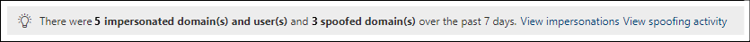

# Defender for Office 365 中的模拟见解Impersonation insight in Defender for Office 365

[!INCLUDE [Microsoft 365 Defender rebranding](../includes/microsoft-defender-for-office.md)]

**适用对象****Applies to**
- [Microsoft Defender for Office 365 计划 1 和计划 2Microsoft Defender for Office 365 plan 1 and plan 2](defender-for-office-365.md)
- [Microsoft 365 DefenderMicrosoft 365 Defender](../defender/microsoft-365-defender.md)

> [!NOTE]
> 本文中所述的功能在预览版中，可能会更改，并且并非在所有组织中都可用。The features described in this article are in Preview, are subject to change, and are not available in all organizations.

模拟是电子邮件发件人看起来与真实或预期的发件人电子邮件地址非常相似的地方。Impersonation is where the sender of an email message looks very similar to a real or expected sender email address. 攻击者经常在网络钓鱼或其他类型的攻击中模拟发件人电子邮件地址，以赢得收件人的信任。Attackers often user impersonated sender email addresses in phishing or other types of attacks in an effort to gain the trust of the recipient. 基本上有两种类型的模拟：There are basically two types of impersonation:

- **域模拟**：lila@contoso.com，模拟发件人的电子邮件地址将 lila@ćóntoso.com。**Domain impersonation**: Instead of lila@contoso.com, the impersonated sender's email address is lila@ćóntoso.com.
- **用户模拟**：michelle@contoso.com，模拟发件人的电子邮件地址将 rnichell@contoso.com。**User impersonation**: Instead of michelle@contoso.com, the impersonated sender's email address is rnichell@contoso.com.

域模拟不同于域 [欺骗](anti-spoofing-protection.md)，因为模拟的域通常是真实的注册域。Domain impersonation is different from [domain spoofing](anti-spoofing-protection.md), because the impersonated domain is typically a real, registered domain. 来自模拟域中的发件人的邮件可以而且通常通过常规电子邮件身份验证检查，以识别 SPF、DKIM 和 DMARC (欺骗) 。Messages from senders in the impersonated domain can and often do pass regular email authentication checks that would otherwise identify spoofing attempts (SPF, DKIM, and DMARC).

模拟保护是专用于 Microsoft Defender for Office 365 的反网络钓鱼策略设置的一Office 365。Impersonation protection is part of the anti-phishing policy settings that are exclusive to Microsoft Defender for Office 365. 有关这些设置详细信息，请参阅 Microsoft Defender for Office 365 中的防钓鱼[策略中的模拟Office 365。](set-up-anti-phishing-policies.md#impersonation-settings-in-anti-phishing-policies-in-microsoft-defender-for-office-365)For more information about these settings, see [Impersonation settings in anti-phishing policies in Microsoft Defender for Office 365](set-up-anti-phishing-policies.md#impersonation-settings-in-anti-phishing-policies-in-microsoft-defender-for-office-365).

您可以使用 Microsoft 365 Defender 门户中的模拟见解来快速识别来自已配置为用于模拟保护的模拟发件人或发件人域的邮件。You can use the impersonation insight in the Microsoft 365 Defender portal to quickly identify messages from impersonated senders or sender domains that you've configured for impersonation protection.

## 开始前，有必要了解什么？What do you need to know before you begin?

- 访问 <https://security.microsoft.com> 打开 Microsoft 365 Defender 门户。You open the Microsoft 365 Defender portal at <https://security.microsoft.com>. 若要直接转到"反网络钓鱼"页面上的模拟 **见解** ，请使用 <https://security.microsoft.com/antiphishing> 。To go directly to the impersonation insight on the **Anti-phishing** page, use <https://security.microsoft.com/antiphishing>. 若要直接转到模拟 **见解页面** ，请使用 <https://security.microsoft.com/impersonationinsight> 。To go directly to the **Impersonation insight** page, use <https://security.microsoft.com/impersonationinsight>.

- 您需在 Microsoft 365 Defender 门户中分配权限，然后才能执行本文中的过程：You need to be assigned permissions in the Microsoft 365 Defender portal before you can do the procedures in this article:
  - **组织管理****Organization Management**
  - **安全管理员****Security Administrator**
  - **安全读者****Security Reader**
  - **全局读者****Global Reader**

  有关详细信息，请参阅 [Microsoft 365 Defender 门户中的权限](permissions-microsoft-365-security-center.md)。For more information, see [Permissions in the Microsoft 365 Defender portal](permissions-microsoft-365-security-center.md).

  **注意**：向 Microsoft 365 管理中心 中的相应 Azure Active Directory 角色添加用户会为用户提供 Microsoft 365 Defender 门户中所需的权限以及 Microsoft 365 中其他功能Microsoft 365。 **Note**: Adding users to the corresponding Azure Active Directory role in the Microsoft 365 admin center gives users the required permissions in the Microsoft 365 Defender portal _and_ permissions for other features in Microsoft 365. 有关详细信息，请参阅 [关于管理员角色](../../admin/add-users/about-admin-roles.md)。For more information, see [About admin roles](../../admin/add-users/about-admin-roles.md).

- 在 Microsoft Defender for Office 365 中的防钓鱼策略中启用和配置Office 365。You enable and configure impersonation protection in anti-phishing policies in Microsoft Defender for Office 365. 默认情况下不启用模拟保护。Impersonation protection is not enabled by default. 有关详细信息，请参阅 Configure [anti-phishing policies in Microsoft Defender for Office 365](configure-mdo-anti-phishing-policies.md)。For more information, see [Configure anti-phishing policies in Microsoft Defender for Office 365](configure-mdo-anti-phishing-policies.md).

## 在模拟门户中打开模拟Microsoft 365 Defender见解Open the impersonation insight in the Microsoft 365 Defender portal

1. In the Microsoft 365 Defender portal， go to **Email & Collaboration** Policies & \> **Rules** \> **Threat policies** page \> **Policies** section \> **Anti-phishing**.In the Microsoft 365 Defender portal, go to **Email & Collaboration** \> **Policies & Rules** \> **Threat policies** page \> **Policies** section \> **Anti-phishing**.

2. 在 **"防钓鱼"** 页面上，模拟见解如下所示：On the **Anti-phishing** page, the impersonation insight looks like this:

   

   见解有两种模式：The insight has two modes:

    - 见解模式：如果在任何防钓鱼策略中启用和配置了模拟保护，则此见解将显示过去七天内从模拟域和模拟用户 (发件人) 检测到的邮件数。**Insight mode**: If impersonation protection is enabled and configured in any anti-phishing policies, the insight shows the number of detected messages from impersonated domains and impersonated users (senders) over the past seven days. 这是所有反网络钓鱼策略中所有检测到的模拟发件人总数。This is the total of all detected impersonated senders from all anti-phishing policies.
    - **如果模式**：如果未在任何活动的反网络钓鱼策略中启用和配置模拟保护，则此见解将展示我们的模拟保护功能在过去七天内检测到的邮件数。**What if mode**: If impersonation protection is not enabled and configured in any active anti-phishing policies, the insight shows you how many messages *would* have been detected by our impersonation protection capabilities over the past seven days.

若要查看有关模拟检测的信息，请单击模拟见解 **中的** "查看模拟"。To view information about the impersonation detections, click **View impersonations** in the impersonation insight.

   > [!NOTE]
   > 有关欺骗智能见解的信息，请参阅 [EOP 中的欺骗智能见解](learn-about-spoof-intelligence.md)。For information about the spoof intelligence insight, see [Spoof intelligence insight in EOP](learn-about-spoof-intelligence.md).

## 查看有关来自模拟域中发件人的邮件的信息View information about messages from senders in impersonated domains

在单击 **模拟见解** 中的"查看模拟"后出现的"模拟见解"页上，验证是否选择了"**域**"选项卡。On the **Impersonation insight** page that appears after you click **View impersonations** in the impersonation insight, verify that the **Domains** tab is selected. " **域** "选项卡包含以下信息：The **Domains** tab contains the following information:

- **发件人** 域：模拟域，用于发送电子邮件的域。**Sender Domain**: The impersonating domain, which is the domain that was used to send the email message.
- **邮件计数**：过去 7 天内来自模拟发件人域的邮件数。**Message count**: The number of messages from impersonating sender domain over the last 7 days.
- **模拟类型**：此值显示模拟帐户的检测 (例如，**地址中的域) 。****Impersonation type**: This value shows the detected location of the impersonation (for example, **Domain in address**).
- **模拟 (域) ：** 模拟域，它应非常类似于在反网络钓鱼策略中配置为进行模拟保护的域。**Impersonated domain(s)**: The impersonated domain, which should closely resemble the domain that's configured for impersonation protection in the anti-phishing policy.
- **域类型**：此值是 **内部域** 的公司域或自定义 **域** 的自定义域。**Domain type**: This value is **Company domain** for internal domains or **Custom domain** for custom domains.
- **策略**：检测到模拟域的防钓鱼策略。**Policy**: The anti-phishing policy that detected the impersonated domain.
- **允许模拟**：下列值之一：**Allowed to impersonate**: One of the following values:
  - **是**：域配置为受信任的域 (防钓鱼策略中的) 保护策略的例外。**Yes**: The domain was configured as trusted domain (an exception for impersonation protection) in the anti-phishing policy. 检测到来自模拟域中发件人的邮件，但允许。Messages from senders in the impersonated domain were detected, but allowed.
  - **否**：域配置为在反网络钓鱼策略中提供模拟保护。**No**: The domain was configured for impersonation protection in the anti-phishing policy. 根据反网络钓鱼策略中模拟域的操作，检测到来自模拟域中的发件人的邮件，并基于这些操作执行这些邮件。Messages from senders in the impersonated domain were detected and acted upon based on the action for impersonated domains in the anti-phishing policy.

您可以单击所选列标题对结果进行排序。You can click selected column headings to sort the results.

若要筛选结果，可以使用"搜索"图标"搜索"框输入以  逗号分隔的值列表来筛选结果。To filter the results, you can use the  **Search** box to enter a comma-separated list of values to filter the results.

### 查看有关来自模拟域中发件人的邮件的详细信息View details about messages from senders in impersonated domains

在" **模拟** 见解 **"页上的** "域"选项卡上，选择一个可用的模拟检测。On the **Domains** tab on the **Impersonation insight** page, select one of the available impersonation detections. 显示的详细信息飞出包含以下信息和功能：The details flyout that appears contains the following information and features:

- **要修改的选择模拟策略**：选择要修改的受影响的防钓鱼策略。**Selection impersonation policy to modify**: Select the affected anti-phishing policy that you want to modify. 只有策略中定义了模拟域的策略才可用。Only polices where the impersonated domain is defined in the policy are available. 参考上一页，查看哪个策略实际负责根据收件人 (以及策略的优先级来检测模拟) 。Refer to the previous page to see which policy was actually responsible for detecting the impersonated domain (likely based on the recipient and the priority of the policy).
- 添加到允许 **的** 模拟列表：使用此开关添加或删除所选防钓鱼策略的"受信任的发件人和域 **(** 模拟) 例外"中的发件人：**Add to the allowed to impersonation list**: Use this toggle to add or remove the sender from the **Trusted senders and domains** (impersonation exceptions) for the anti-phishing policy that you selected:
  - 如果 **此条目的"允许模拟** "值为 **"否**"，则开关处于关闭状态。If the **Allowed to impersonate** value for this entry was **No**, the toggle is off. 若要通过模拟保护使此域中的所有发件人免于评估，将开关滑动到"打开"：  。To exempt all senders in this domain from evaluation by impersonation protection, slide the toggle to on: . 该域将添加到反网络钓鱼策略的模拟保护设置中的"受信任的域"列表中。The domain is added to the **Trusted domains** list in the impersonation protection settings of the anti-phishing policy.
  - 如果 **此条目的"允许模拟** "值为 **"是**"，则切换处于打开状态。If the **Allowed to impersonate** value for this entry was **Yes**, the toggle is on. 若要通过模拟保护使此域中的所有发件人返回评估，请切换为关闭：  。To return all senders in this domain to evaluation by impersonation protection, slide the toggle to off: . 该域将从反 **网络钓鱼** 策略的模拟保护设置中的"受信任的域"列表中删除。The domain is removed from the **Trusted domains** list in the impersonation protection settings of the anti-phishing policy.
- 我们为什么捕获到此。Why we caught this.
- 需要执行哪些工作。What you need to do.
- 列出模拟域的域摘要。A domain summary that list the impersonated domain.
- WhoIs 有关发件人的数据。WhoIs data about the sender.
- 打开威胁资源管理器 [以查看有关](threat-explorer.md) 发件人的其他详细信息的链接。A link to open [Threat Explorer](threat-explorer.md) to see additional details about the sender.
- 来自已传递到组织的同一发件人的类似邮件。Similar messages from the same sender that were delivered to your organization.

## 查看有关来自模拟发件人的邮件的信息View information about messages from impersonated senders

在单击 **模拟见解** 中的"查看模拟"后出现的"模拟见解"页上，单击"用户 **"** 选项卡。"**用户**"选项卡包含以下信息：On the **Impersonation insight** page that appears after you click **View impersonations** in the impersonation insight, click the **Users** tab. The **Users** tab contains the following information:

- **发件人**：发送电子邮件的模拟发件人的电子邮件地址。**Sender**: The email address of the impersonating sender that sent the email message.
- **邮件计数**：最近 7 天内来自模拟发件人的邮件数。**Message count**: The number of messages from the impersonating sender over the last 7 days.
- **模拟类型**：此值为 **User in 显示名称。****Impersonation type**: This value is **User in display name**.
- **模拟 (** 用户) ：模拟发件人的电子邮件地址，该地址应该与在反网络钓鱼策略中配置为进行模拟保护的用户非常类似。**Impersonated user(s)**: The email address of the impersonated sender, which should closely resemble the user that's configured for impersonation protection in the anti-phishing policy.
- **用户类型**：此值显示应用保护 (例如，受保护的用户或邮箱 **智能) 。** **User type**: This value shows the type of protection applied (for example, **Protected user** or **Mailbox Intelligence**).
- **策略**：检测到模拟发件人的防钓鱼策略。**Policy**: The anti-phishing policy that detected the impersonated sender.
- **允许模拟**：下列值之一：**Allowed to impersonate**: One of the following values:
  - **是**：发件人配置为受信任用户 (防钓鱼策略中) 的模拟保护例外。**Yes**: The sender was configured as trusted user (an exception for impersonation protection) in the anti-phishing policy. 检测到来自模拟发件人的邮件，但允许这些邮件。Messages from the impersonated sender were detected, but allowed.
  - **否**：发件人配置为在反网络钓鱼策略中提供模拟保护。**No**: The sender was configured for impersonation protection in the anti-phishing policy. 根据反网络钓鱼策略中模拟用户的操作，检测并操作来自模拟发件人的邮件。Messages from the impersonated sender were detected and acted upon based on the action for impersonated users in the anti-phishing policy.

您可以单击所选列标题对结果进行排序。You can click selected column headings to sort the results.

若要筛选结果，可以使用"筛选发件人"框输入以逗号分隔的值列表以筛选结果。To filter the results, you can use the **Filter sender** box to enter a comma-separated list of values to filter the results.

### 查看有关来自模拟发件人的邮件的详细信息View details about messages from impersonated senders

在" **模拟** 见解 **"页上的** "用户"选项卡上，选择一个可用的模拟检测。On the **Users** tab on the **Impersonation insight** page, select one of the available impersonation detections. 显示的详细信息飞出包含以下信息和功能：The details flyout that appears contains the following information and features:

- **要修改的选择模拟策略**：选择要修改的受影响的防钓鱼策略。**Selection impersonation policy to modify**: Select the affected anti-phishing policy that you want to modify. 只有策略中定义了模拟发件人的策略才可用。Only polices where the impersonated sender is defined in the policy are available. 参考上一页，查看哪个策略实际负责根据收件人 (以及策略的优先级来检测) 。Refer to the previous page to see which policy was actually responsible for detecting the impersonated sender (likely based on the recipient and the priority of the policy).
- 添加到允许 **的** 模拟列表：使用此开关添加或删除所选防钓鱼策略的"受信任的发件人和域 **(** 模拟) 例外"中的发件人：**Add to the allowed to impersonation list**: Use this toggle to add or remove the sender from the **Trusted senders and domains** (impersonation exceptions) for the anti-phishing policy that you selected:
  - 如果 **此条目的"允许模拟** "值为 **"否**"，则开关处于关闭状态。If the **Allowed to impersonate** value for this entry was **No**, the toggle is off. 若要通过模拟保护使发件人免于评估，将开关滑动到"打开"：  "。To exempt the sender from evaluation by impersonation protection, slide the toggle to on: . 发件人将添加到反 **网络钓鱼** 策略的模拟保护设置中的"受信任的用户"列表中。The sender is added to the **Trusted users** list in the impersonation protection settings of the anti-phishing policy.
  - 如果 **此条目的"允许模拟** "值为 **"是**"，则切换处于打开状态。If the **Allowed to impersonate** value for this entry was **Yes**, the toggle is on. 若要通过模拟保护将发件人返回到评估，将切换开关切换为关闭：  。To return the sender to evaluation by impersonation protection, slide the toggle to off: . 发件人将从反网络钓鱼策略的模拟保护设置中的"受信任的用户"列表中删除。The sender is removed from the **Trusted users** list in the impersonation protection settings of the anti-phishing policy.
- 我们为什么捕获到此。Why we caught this.
- 需要执行哪些工作。What you need to do.
- 列出模拟发件人的发件人摘要。A sender summary that list the impersonated sender.
- WhoIs 有关发件人的数据。WhoIs data about the sender.
- 打开威胁资源管理器 [以查看有关](threat-explorer.md) 发件人的其他详细信息的链接。A link to open [Threat Explorer](threat-explorer.md) to see additional details about the sender.
- 来自已传递到组织的同一发件人的类似邮件。Similar messages from the same sender that were delivered to your organization.
