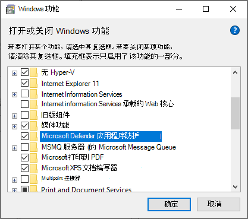
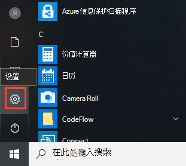
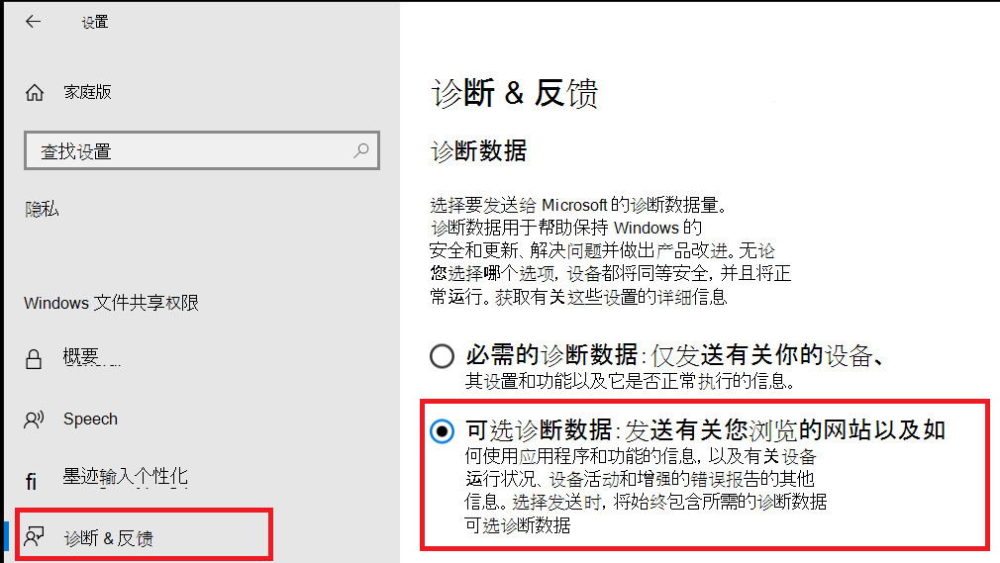

# <a name="application-guard-for-office-for-admins"></a>适用于管理员Office应用程序防护

**适用于：** Word、Excel、Microsoft 365 专属 PowerPoint、Windows 10 企业版、Windows 11 Enterprise

Microsoft Defender 应用程序防护 Office (应用程序防护Office) 有助于防止不受信任的文件访问受信任的资源，使企业安全不受新的和新出现的攻击。 本文将指导管理员设置设备，预览适用于Office。 它提供有关在设备上启用应用程序防护的系统要求Office安装步骤的信息。

## <a name="prerequisites"></a>必备条件

### <a name="minimum-hardware-requirements"></a>最低硬件要求

* **CPU**：64 位、4 核 (物理或虚拟) 、虚拟化扩展 (Intel VT-x OR AMD-V) 、Core i5 等效项或更高建议
* **物理内存**：8 GB RAM
* **硬盘：** 系统驱动器上 10 GB 的可用空间 (SSD) 

### <a name="minimum-software-requirements"></a>最低软件要求

* **Windows**：Windows 10 企业版版客户端内部版本 2004 (20H1) 版本 19041 或更高版本。 支持所有Windows 11版本。 
* **Office**：Office当前频道和每月 Enterprise 频道，内部版本 2011 16.0.13530.10000 或更高版本。 Office Semi-Annual Enterprise Channel，内部版本 2108 或更高版本。 支持 32 位和 64 位版本的 Office。
* **更新程序包**：Windows 10每月安全更新 [KB4571756](https://support.microsoft.com/help/4571756/windows-10-update-KB4571756)

有关详细的系统要求，请参阅系统[要求Microsoft Defender 应用程序防护](/windows/security/threat-protection/microsoft-defender-application-guard/reqs-md-app-guard)。 此外，请参阅计算机制造商的指南，了解如何启用虚拟化技术。
若要了解有关更新Office，请参阅更新[频道概述Microsoft 365](/deployoffice/overview-update-channels)。

### <a name="licensing-requirements"></a>许可要求

* Microsoft 365 E5 或 Microsoft 365 E5 安全性

> [!NOTE]
> Microsoft 365 企业应用版基于设备的许可证的许可证无法访问应用程序防护Office。

## <a name="deploy-application-guard-for-office"></a>部署应用程序防护Office

### <a name="enable-application-guard-for-office"></a>启用应用程序防护Office

1. 下载并安装 **Windows 10每月安全更新 KB4571756**。

2. 选择 **Microsoft Defender 应用程序防护** 功能Windows选择"确定 **"**。 启用应用程序防护功能将提示重新启动系统。 可以选择立即重启，也可以选择在步骤 3 之后重新启动。

   

   还可以以管理员角色运行以下 PowerShell 命令来启用该功能：

   ```powershell
   Enable-WindowsOptionalFeature -online -FeatureName Windows-Defender-ApplicationGuard
   ```

3. 在托管 **Microsoft Defender 应用程序防护****\\，计算机配置管理\\模板、组件Windows中的组策略Microsoft Defender 应用程序防护\\**。 打开此策略，方法为将"选项"下的值设置为 **2** 或 **3**，然后选择" **确定** "或"应用 **"**。

   

   相反，你可以设置相应的云解决方案提供商策略：

   > OMA-URI：**./Device/Vendor/MSFT/WindowsDefenderApplicationGuard/设置/AllowWindowsDefenderApplicationGuard** <br> 数据类型： **Integer** <br> 值： **2**

4. 重新启动系统。

### <a name="set-diagnostics--feedback-to-send-full-data"></a>设置诊断&反馈以发送完整数据

> [!NOTE]
> 但是，这不是必需的，配置可选诊断数据将有助于诊断报告的问题。

此步骤确保识别并解决问题所需的数据已到达 Microsoft。 请按照以下步骤在设备上启用Windows诊断：

1. 从 **设置** 打开"开始"菜单。

   

2. On **Windows 设置**， select **Privacy**.

   

3. 在"隐私"下 **，选择"诊断&反馈"，** 然后选择 **"可选诊断数据"**。

   

有关配置诊断Windows，请参阅在Windows[配置诊断数据](/windows/privacy/configure-windows-diagnostic-data-in-your-organization#enterprise-management)。

### <a name="confirm-that-application-guard-for-office-is-enabled-and-working"></a>确认应用程序防护Office并正常工作

在确认应用程序防护Office之前，在已部署策略Excel设备上启动 Word、Excel 或 PowerPoint。 请确保Office激活。 你可能需要先使用工作标识来激活Office产品。

若要确认应用程序防护Office，请启动 Word、Excel 或 PowerPoint，然后打开不受信任的文档。 例如，您可以打开从 Internet 下载的文档或组织外部人员的电子邮件附件。

首次打开不受信任的文件时，你可能会看到Office屏幕，如以下示例所示。 它可能在应用程序防护的激活Office文件打开时显示一段时间。 随后打开不受信任的文件应更快。


打开后，文件应显示几个可视指示器，指示文件在应用程序防护内打开Office：

* 功能区中的标注

  

* 任务栏中带防护的应用程序图标

  

## <a name="configure-application-guard-for-office"></a>配置应用程序防护Office

Office支持以下策略，以便你可以配置应用程序防护的Office。 可以通过组策略或云策略服务配置Office[策略](/DeployOffice/overview-office-cloud-policy-service)。


> [!NOTE]
> 配置这些策略可以针对在应用程序防护中打开的文件禁用某些Office。

|策略|说明|
|---|---|
|请勿将应用程序防护用于Office|启用此策略将强制 Word、Excel 和 PowerPoint 使用受保护的视图隔离容器，而不是应用程序防护Office。 此策略可用于暂时禁用应用程序防护，Office当存在问题而将其保留为启用状态Microsoft Edge。|
|配置应用程序防护Office容器预创建|此策略确定是否预先创建了用于Office应用程序防护容器（用于隔离不受信任的文件）以提高运行时性能。 如果启用此设置，可以指定继续预创建容器的天数，或让 Office内置启发式预创建容器。
|不允许在应用程序防护中打开Office文档进行复制/粘贴Office|启用此策略将阻止用户将内容从应用程序防护中打开的文档复制Office粘贴到在应用程序防护中打开的文档。|
|在应用程序防护中禁用硬件加速Office|此策略控制应用程序防护Office硬件加速来呈现图形。 如果启用此设置，Office 应用程序防护将使用基于软件的 (CPU) 呈现，并且不会加载任何第三方图形驱动程序，也不会与任何连接的图形硬件交互。
|在应用程序防护中禁用不支持的文件类型保护Office|此策略控制应用程序防护Office阻止打开不受支持的文件类型，还是允许重定向到受保护的视图。
|关闭应用程序防护中打开的文档的相机和麦克风Office|启用此策略将Office应用程序防护内的相机和麦克风的访问权限，从而Office。|
|限制从应用程序防护中打开的文档进行打印Office|启用此策略将限制用户可从应用程序防护中打开的文件打印到的打印机Office。 例如，可以使用此策略将用户限制为仅打印为 PDF。|
|阻止用户删除应用程序防护Office文件保护|启用此策略将删除 Office (应用程序体验) 中的选项) 以禁用 Office 保护的应用程序防护或打开应用程序防护外部的文件Office。 <p> **注意：** 用户仍可以通过手动从文件中删除 Web 标记属性或将文档移动到受信任位置来绕过此策略。|

> [!NOTE]
> 以下策略将要求用户注销并再次登录Windows生效：
>
> * 针对在应用程序防护中打开的文档禁用复制/粘贴Office
> * 限制打印在应用程序防护中打开的文档Office
> * 关闭对应用程序防护中打开的文档的相机和麦克风Office

## <a name="submit-feedback"></a>提交反馈

### <a name="submit-feedback-via-feedback-hub"></a>通过反馈中心提交反馈

如果你在启动应用程序防护时遇到任何问题Office，建议你通过反馈中心提交反馈：

1. 打开 **反馈中心应用** 并登录。

2. 如果在启动应用程序防护时看到错误对话框，请选择错误对话框中的"向 **Microsoft** 报告"以启动新的反馈提交。 否则，导航到 以<https://aka.ms/mdagoffice-fb>选择正确的应用程序防护类别，然后选择 **+&nbsp;** 右上方附近添加新反馈。

3. 如果尚未填写 **汇总，** 请在"总结反馈"框中输入摘要。

4. 在"详细说明"框中输入您遇到的问题以及所执行步骤的详细说明，然后选择"下一步 **"**。

5. 选择"问题"旁边的 **气泡**。 确保所选的类别为"安全和隐私Microsoft Defender 应用程序防护 **\> – Office**"，然后选择"下一步 **"**。

6. 选择 **"新建反馈"**，然后选择"下一 **步"**。

7. 收集有关问题的跟踪：

   1. 展开" **重新创建我的问题"** 磁贴。

   2. 如果在应用程序防护运行时遇到问题，请打开应用程序防护实例。 打开实例允许从应用程序防护容器内收集其他跟踪。

   3. 选择 **"开始** 录制"，然后等待磁贴停止旋转并说出" *停止录制"*。

   4. 使用应用程序防护完全重现该问题。 重现可能包括尝试启动应用程序防护实例并等待它失败，或在正在运行的应用程序防护实例中重现问题。

   5. 选择" **停止录制"** 磁贴。

   6. 使任何正在运行的应用程序防护 (保持) 打开状态，即使在提交后几分钟内，也可以收集容器诊断。

8. 附加与该问题相关的任何相关屏幕截图或文件。

9. 选择“**提交**”。

### <a name="submit-feedback-via-office-customer-voice"></a>通过客户语音Office反馈

如果当应用程序防护中打开Office文档时Office提交反馈。 请参阅《[Office](https://insider.office.com/handbook)预览体验成员手册》，以提交反馈。

## <a name="integration-with-microsoft-defender-for-endpoint-and-microsoft-defender-for-office-365"></a>与 Microsoft Defender for Endpoint 和 Microsoft Defender for Office 365

适用于 Office 应用程序防护与 Microsoft Defender for Endpoint 集成，以提供对隔离环境中发生的恶意活动的监视和警报。

[保险箱 Microsoft E365 E5](/microsoft-365/security/office-365-security/safe-docs) 中的文档是一项使用 Microsoft Defender for Endpoint 扫描在应用程序防护中打开的文档Office。 对于另一层保护，用户无法离开应用程序防护Office直到确定扫描结果。

Microsoft Defender for Endpoint 是一个安全平台，旨在帮助企业网络预防、检测、调查和响应高级威胁。 有关此平台的更多详细信息，请参阅 [Microsoft Defender for Endpoint](https://www.microsoft.com/microsoft-365/windows/microsoft-defender-atp)。 若要了解有关将设备载入此平台的信息，请参阅 [将设备载入到 Microsoft Defender for Endpoint 服务](/windows/security/threat-protection/microsoft-defender-atp/onboard-configure)。

还可以将 Microsoft Defender 配置为Office 365 Defender for Endpoint 使用。 有关详细信息，请参阅集成 [Defender for Office 365 Microsoft Defender for Endpoint](integrate-office-365-ti-with-mde.md)。

## <a name="limitations-and-considerations"></a>限制和注意事项

* Office应用程序防护是一种受保护的模式，可隔离不受信任的文档，以便它们无法访问受信任的公司资源、Intranet、用户标识和计算机上的任意文件。 因此，如果用户尝试访问依赖此类访问的功能（如从磁盘上的本地文件插入图片）时，访问将失败并生成类似于以下示例的提示。 若要使不受信任的文档能够访问受信任的资源，用户必须从文档中删除应用程序防护保护。 

  

  > [!NOTE]
  > 建议用户仅在信任文件及其来源或来源时删除保护。

* 当不受信任的文档存储在受信任位置时，文档将继承来自该位置的信任。 通常，组织的云存储被标识为受信任位置。
  
* 宏和控件等文档中的活动ActiveX在应用程序防护中禁用Office。 用户需要删除应用程序防护保护才能启用活动内容。

* 来自网络共享或来自不同组织的 OneDrive、OneDrive for Business 或 SharePoint Online 共享文件的不受信任的文件在应用程序防护中以只读方式打开。 用户可以保存此类文件的本地副本以在容器中继续工作，或删除保护以直接处理原始文件。

* 默认情况下，受信息权限管理 (IRM) 的文件将被阻止。 如果用户想要在受保护的视图中打开此类文件，则管理员必须为组织配置不受支持的文件类型的策略设置。

* 在应用程序防护Office应用程序的任何自定义Office在用户重新登录或设备重启后不会保留。

* 只有使用 UIA 框架的辅助功能工具才能为在应用程序防护中打开的文件提供辅助Office。

* 安装后首次启动应用程序防护需要网络连接。 应用程序防护需要连接才能验证许可证。

* 在文档的信息部分中， *"上次修改* 者"属性可能会将 **WDAGUtilityAccount** 显示为用户。 WDAGUtilityAccount 是在应用程序防护中配置的匿名用户。 桌面用户的身份不在应用程序防护容器内共享。

## <a name="performance-optimizations-for-application-guard-for-office"></a>适用于应用程序防护的性能优化Office

本部分概述了应用程序防护中用于实现性能优化Office。 此信息可以帮助管理员诊断来自用户的报告，这些报告与应用程序防护Office或整体系统的性能相关。

应用程序防护使用虚拟化容器将不受信任的文档与系统隔离。 创建容器和设置应用程序防护容器以打开 Office 文档的过程具有性能开销，这些开销可能会对用户打开不受信任的文档时用户体验产生负面影响。

为了为用户提供预期的文件打开体验，当系统符合以下启发性要求时，应用程序防护会使用逻辑预先创建容器：用户在过去 28 天内以受保护的视图或应用程序防护打开文件。

当满足此启发性要求时，Office将在用户登录后为用户预先创建应用程序防护Windows。 虽然此预创建操作正在进行中，但系统可能会遇到性能缓慢的问题，但该操作完成后，该影响将立即解决。

> [!NOTE]
> 启发式预创建容器所需的提示由用户Office时生成的。 如果用户在Office应用程序防护的新系统中安装此文档，Office 在用户首次在系统上打开不受信任的文档之前不会预创建容器。 用户将观察到，在应用程序防护中打开第一个文件需要更长时间。

## <a name="known-issues"></a>已知问题

* 选择 (`http` 或) `https` 无法打开浏览器的 Web 链接。
* 复制粘贴保护策略的默认设置是启用仅对文本的剪贴板访问。
* 不受支持的文件类型保护策略的默认设置是阻止打开加密的不受信任的文件类型，或阻止 IRM (信息权限管理) 文件类型。 这包括具有使用加密Microsoft 信息保护或高度机密 (敏感度标签) 。
* 目前不支持 CSV 和 HTML 文件。
* 应用程序防护Office NTFS 压缩卷。 如果看到错误"ERROR_VIRTUAL_DISK_LIMITATION"，请尝试解压缩卷。
* 更新 .NET 可能会导致文件在应用程序防护中无法打开。 作为一种解决方法，用户可以在遇到此故障时重新启动其设备。 有关该问题的详细信息，请通过尝试在沙盒中打开或[Windows Defender 应用程序防护Windows错误消息](https://support.microsoft.com/help/4575917/receiving-an-error-message-when-attempting-to-open-windows-defender-ap)。
* 有关详细信息[，请参阅常见问题 - Microsoft Defender 应用程序防护。](/windows/security/threat-protection/microsoft-defender-application-guard/faq-md-app-guard) 
