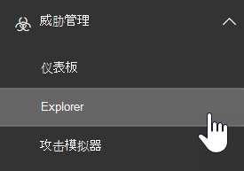
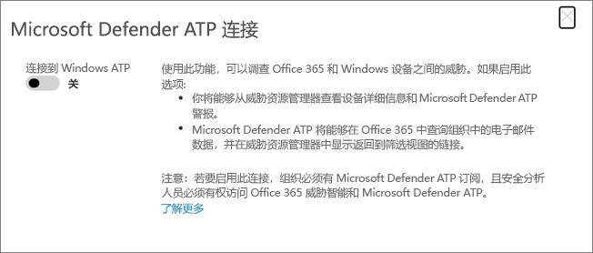

# 将 Office 365 高级威胁防护与 Microsoft Defender 高级威胁防护集成Integrate Office 365 Advanced Threat Protection with Microsoft Defender Advanced Threat Protection

[!INCLUDE [Microsoft 365 Defender rebranding](../includes/microsoft-defender-for-office.md)]

[Office 365 高级威胁防护](https://docs.microsoft.com/microsoft-365/security/office-365-security/office-365-atp?view=o365-worldwide) (OFFICE 365 atp) 可以配置为在 MICROSOFT defender ATP)  (使用 [Microsoft Defender 高级威胁防护](https://docs.microsoft.com/windows/security/threat-protection) 。[Office 365 Advanced Threat Protection](https://docs.microsoft.com/microsoft-365/security/office-365-security/office-365-atp?view=o365-worldwide) (Office 365 ATP) can be configured to work with [Microsoft Defender Advanced Threat Protection](https://docs.microsoft.com/windows/security/threat-protection) (Microsoft Defender ATP).

将 Office 365 ATP 与 Microsoft Defender ATP 集成可帮助你的安全操作团队监控并快速采取行动（如果用户的设备存在风险）。Integrating Office 365 ATP with Microsoft Defender ATP can help your security operations team monitor and take action quickly if users' devices are at risk. 例如，在启用集成后，安全操作团队将能够查看检测到的电子邮件可能影响的设备，以及这些设备在 Microsoft Defender ATP 中所具有的最近通知数。For example, once integration is enabled, your security operations team will be able to see the devices that are potentially affected by a detected email message, as well as how many recent alerts those devices have in Microsoft Defender ATP. 

下图描述了 " **设备** " 选项卡的外观，如已启用 MICROSOFT Defender ATP 集成：The following image depicts what the **Devices** tab looks like have Microsoft Defender ATP integration enabled:
  

  
在此示例中，可以看到检测到的电子邮件的收件人有四台设备，并且有一个警报。In this example, you can see that the recipients of the detected email message have four devices and one has an alert. 单击设备的链接将在 Microsoft Defender 安全中心 () 中打开其页面 [https://securitycenter.windows.com](https://securitycenter.windows.com) 。Clicking the link for a device opens its page in the Microsoft Defender Security Center ([https://securitycenter.windows.com](https://securitycenter.windows.com)).

> [!TIP]
> **[了解有关 Microsoft Defender 安全中心的详细信息](https://docs.microsoft.com/windows/security/threat-protection/microsoft-defender-atp/use)** (也称为 MICROSOFT defender ATP 门户。 ) **[Learn more about the Microsoft Defender Security Center](https://docs.microsoft.com/windows/security/threat-protection/microsoft-defender-atp/use)** (also referred to as the Microsoft Defender ATP portal.)
  
## RequirementsRequirements

- 您的组织必须拥有 Office 365 ATP Plan 2 (或 Office 365 E5) 和 Microsoft Defender ATP。Your organization must have Office 365 ATP Plan 2 (or Office 365 E5) and Microsoft Defender ATP.
    
- 您必须是全局管理员或具有安全管理员角色 (如安全 [ &amp; 合规中心](https://protection.office.com)中分配的安全管理员) 。You must be a global administrator or have a security administrator role (such as Security Administrator) assigned in the [Security &amp; Compliance Center](https://protection.office.com).  (查看 [安全 &amp; 合规性中心中的权限](permissions-in-the-security-and-compliance-center.md)) (See [Permissions in the Security &amp; Compliance Center](permissions-in-the-security-and-compliance-center.md))
    
- 您必须具有对 [资源管理器 (或实时检测) ](threat-explorer.md) 在安全 & 合规中心和 Microsoft Defender 安全中心中的访问权限。You must have access to both [Explorer (or real-time detections)](threat-explorer.md) in the Security & Compliance Center and the Microsoft Defender Security Center.
    
## 将 Office 365 ATP 与 Microsoft Defender ATP 集成To integrate Office 365 ATP with Microsoft Defender ATP

通过使用安全 & 合规性中心和 Microsoft Defender 安全中心，将 Office 365 ATP 与 Microsoft Defender ATP 集成。Integrating Office 365 ATP with Microsoft Defender ATP is set up by using both the Security & Compliance Center AND the Microsoft Defender Security Center.
  
1. 作为全局管理员或安全管理员，请转到 [https://protection.office.com](https://protection.office.com) 并登录。As a global administrator or a security administrator, go to [https://protection.office.com](https://protection.office.com) and sign in.  (此操作将转到 Office 365 安全 & 合规中心。 ) (This takes you to the Office 365 Security & Compliance Center.)
    
2. 在导航窗格中，选择 "**威胁管理**  >  **资源管理器**"。In the navigation pane, choose **Threat management** > **Explorer**.  
    
3. 在屏幕的右上角，选择 " **WDATP 设置**"。In the upper right corner of the screen, choose **WDATP Settings**.
    
4. 在 "Microsoft Defender ATP 连接" 对话框中，启用 " **连接到 WINDOWS ATP**"。In the Microsoft Defender ATP connection dialog box, turn on **Connect to Windows ATP**.  
    
5. 请转到 Microsoft Defender 安全中心 ([https://securitycenter.windows.com](https://securitycenter.windows.com)) 。Go to the Microsoft Defender Security Center ([https://securitycenter.windows.com](https://securitycenter.windows.com)).

6. 在导航栏中，选择 " **设置**"。In the navigation bar, choose **Settings**. 然后，在 " **常规**" 下，选择 " **高级功能**"。Then, under **General**, choose **Advanced features**.

7. 向下滚动到 " **Office 365 威胁智能连接**"，然后打开连接。Scroll down to **Office 365 Threat Intelligence connection**, and turn the connection on.  

## 相关文章Related articles

[Office 365 中的威胁调查和响应功能Threat investigation and response capabilities in Office 365](office-365-ti.md)
  
[Office 365 高级威胁防护Office 365 Advanced Threat Protection](office-365-atp.md)
  
[Microsoft Defender ATPMicrosoft Defender ATP](https://docs.microsoft.com/windows/security/threat-protection)
