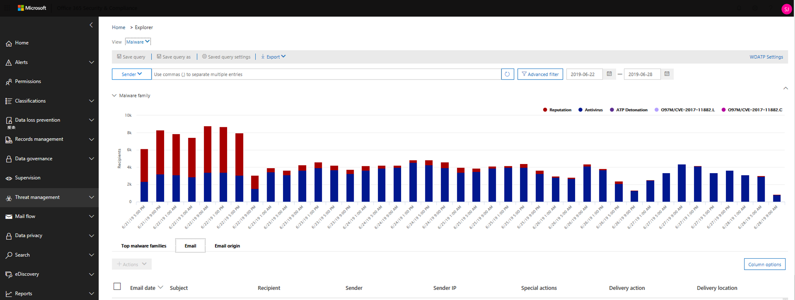

# 调查在 Office 365 中传递的恶意电子邮件Investigate malicious email that was delivered in Office 365

[!INCLUDE [Microsoft 365 Defender rebranding](../includes/microsoft-defender-for-office.md)]

**适用于****Applies to**

- [Microsoft Defender for Office 365 计划 1 和计划 2Microsoft Defender for Office 365 plan 1 and plan 2](https://go.microsoft.com/fwlink/?linkid=2148715)
- [Microsoft 365 DefenderMicrosoft 365 Defender](https://go.microsoft.com/fwlink/?linkid=2118804)

[Microsoft Defender for Office 365](office-365-atp.md) 使你能够调查将组织成员置于风险之中的活动，并采取措施来保护你的组织。[Microsoft Defender for Office 365](office-365-atp.md) enables you to investigate activities that put people in your organization at risk, and to take action to protect your organization. 例如，如果你是组织的安全团队的一员，你可以查找并调查已送达的可疑电子邮件。For example, if you are part of your organization's security team, you can find and investigate suspicious email messages that were delivered. 为此，可以使用威胁资源管理器 (或实时[检测) 。 ](threat-explorer.md)You can do this by using [Threat Explorer (or real-time detections)](threat-explorer.md).

> [!NOTE]
> 跳转到此处的修正 [文章](remediate-malicious-email-delivered-office-365.md)。Jump to the remediation article [here](remediate-malicious-email-delivered-office-365.md).

## 准备工作Before you begin

请确保满足以下要求：Make sure that the following requirements are met:

- 你的组织拥有[适用于 Office 365 的 Microsoft Defender，](office-365-atp.md)[许可证已分配给用户](../../admin/manage/assign-licenses-to-users.md)。Your organization has [Microsoft Defender for Office 365](office-365-atp.md) and [licenses are assigned to users](../../admin/manage/assign-licenses-to-users.md).

- [为](../../compliance/turn-audit-log-search-on-or-off.md) 组织启用审核日志记录。[audit logging](../../compliance/turn-audit-log-search-on-or-off.md) is turned on for your organization.

- 您的组织已针对反垃圾邮件、反恶意软件、反网络钓鱼等定义了策略。Your organization has policies defined for anti-spam, anti-malware, anti-phishing, and so on. 请参阅 [Office 365 中的威胁防护](protect-against-threats.md)。See [Protect against threats in Office 365](protect-against-threats.md).

- 你是全局管理员，或者你已分配有安全管理员或安全与合规中心&清除角色。You are a global administrator, or you have either the Security Administrator or the Search and Purge role assigned in the Security & Compliance Center. 请参阅 [安全与合规中心&权限](permissions-in-the-security-and-compliance-center.md)。See [Permissions in the Security & Compliance Center](permissions-in-the-security-and-compliance-center.md). 对于某些操作，还必须分配有新的预览角色。For some actions, you must also have a new Preview role assigned.

### 预览角色权限Preview role permissions

若要执行某些操作（如查看邮件头或下载电子邮件内容），必须将名为 *Preview* 的新角色添加到另一个相应的角色组。To perform certain actions, such as viewing message headers or downloading email message content, you must have a new role called *Preview* added to another appropriate role group. 下表阐明了所需的角色和权限。The following table clarifies required roles and permissions.

****

|活动Activity|角色组Role group|需要预览角色？Preview role needed?|
|---|---|---|
|使用威胁 (实时检测功能分析) 威胁Use Threat Explorer (and real-time detections) to analyze threats |全局管理员Global Administrator 
 安全管理员Security Administrator 
 安全读取者Security Reader|否No|
|使用威胁 (和实时检测) 查看电子邮件头，以及预览和下载隔离的电子邮件Use Threat Explorer (and real-time detections) to view headers for email messages as well as preview and download quarantined email messages|全局管理员Global Administrator 
 安全管理员Security Administrator 
 安全读取者Security Reader|否No|
|使用威胁资源管理器查看邮件头，仅 (电子邮件实体页面预览电子邮件) 并下载传递到邮箱的电子邮件Use Threat Explorer to view headers, preview email (only in the email entity page) and download email messages delivered to mailboxes|全局管理员Global Administrator 
 安全管理员Security Administrator 
 安全读取者Security Reader 
 预览Preview|是Yes|
|

> [!NOTE]
> *预览* 是一个角色，而不是角色组;预览角色必须添加到 Office 365 的现有角色组 [https://protection.office.com](https://protection.office.com) ， () 。*Preview* is a role and not a role group; the Preview role must be added to an existing role group for Office 365 (at [https://protection.office.com](https://protection.office.com)). 转到 **"权限"，** 然后编辑现有角色组或添加分配有 **预览** 角色的新角色组。Go to **Permissions**, and then either edit an existing role group or add a new role group with the **Preview** role assigned.
> 全局管理员角色分配有 Microsoft 365 管理中心 () ，安全管理员和安全读者角色在安全&合规中心 <https://admin.microsoft.com> <https://protection.office.com> () 。The Global Administrator role is assigned the Microsoft 365 admin center (<https://admin.microsoft.com>), and the Security Administrator and Security Reader roles are assigned in the Security & Compliance Center (<https://protection.office.com>). 若要详细了解角色和权限，请参阅安全与合规中心& [权限](permissions-in-the-security-and-compliance-center.md)。To learn more about roles and permissions, see [Permissions in the Security & Compliance Center](permissions-in-the-security-and-compliance-center.md).

我们了解预览和下载电子邮件是敏感活动，因此，我们针对这些活动启用了审核。We understand previewing and downloading email are sensitive activities, and so we auditing is enabled for these. 管理员对电子邮件执行这些活动后，将针对相同的内容生成审核日志，可在 Office 365 安全与合规中心&查看 [https://protection.office.com](https://protection.office.com) () 。Once an admin performs these activities on emails, audit logs are generated for the same and can be seen in the Office 365 Security & Compliance Center ([https://protection.office.com](https://protection.office.com)). 转到 **"搜索**  >  **审核日志搜索**"，然后根据"搜索"部分中的管理员名称进行筛选。Go to **Search** > **Audit log search** and filter on the admin name in Search section. 筛选出的结果将显示活动 **AdminMailAccess。**The filtered results will show activity **AdminMailAccess**. 选择一行以查看"详细信息"部分 **有关预览** 或下载的电子邮件的详细信息。Select a row to view details in the **More information** section about previewed or downloaded email.

## 查找已送达的可疑电子邮件Find suspicious email that was delivered

威胁资源管理器是一个功能强大的报告，可用于多种目的，例如查找和删除邮件、识别恶意电子邮件发件人的 IP 地址或启动事件以进一步调查。Threat Explorer is a powerful report that can serve multiple purposes, such as finding and deleting messages, identifying the IP address of a malicious email sender, or starting an incident for further investigation. 以下过程重点介绍使用资源管理器查找和删除收件人邮箱中的恶意电子邮件。The following procedure focuses on using Explorer to find and delete malicious email from recipient's mailboxes.

> [!NOTE]
> 资源管理器中的默认搜索当前不包括 Zapped 项目。Default searches in Explorer don't currently include Zapped items.  这适用于所有视图，例如恶意软件或网络钓鱼视图。This applies to all views, for example malware or phish views. 若要包含 Zapped 项目，你需要添加 **传递操作** 集以包含 **ZAP 删除**。To include Zapped items you need to add a **Delivery action** set to include **Removed by ZAP**. 如果包括所有选项，你将看到所有传递操作结果，包括 Zapped 项目。If you include all options, you'll see all delivery action results, including Zapped items.

1. **导航到威胁资源管理器**：转到 Office <https://protection.office.com> 365 的工作或学校帐户并登录。**Navigate to Threat Explorer**: Go to <https://protection.office.com> and sign in using your work or school account for Office 365. 这会将您带至安全&中心。This takes you to the Security & Compliance Center.

2. 在左侧导航快速启动中，选择 **"威胁管理** \> **资源管理器"。**In the left navigation quick-launch, choose **Threat management** \> **Explorer**.

    

    你可能会注意到新的 **"特殊操作"** 列。You may notice the new **Special actions** column. 此功能旨在告知管理员处理电子邮件的结果。This feature is aimed at telling admins the outcome of processing an email. 可以在 **传递** 操作和传递 **位置相同的位置** 访问特殊 **操作列**。The **Special actions** column can be accessed in the same place as **Delivery action** and **Delivery location**. 特殊操作可能在威胁资源管理器的电子邮件时间线结束时更新，这是一项新功能，旨在为管理员提供更好的搜寻体验。Special actions might be updated at the end of Threat Explorer's email timeline, which is a new feature aimed at making the hunting experience better for admins.

3. **威胁资源管理器中的视图**：**在"视图**"菜单中，选择 **"所有电子邮件"。****Views in Threat Explorer**: In the **View** menu, choose **All email**.

    

    *恶意软件* 视图当前为默认视图，并捕获检测到恶意软件威胁的电子邮件。The *Malware* view is currently the default, and captures emails where a malware threat is detected. 对于 *网络钓鱼* ，网络钓鱼视图的运行方式相同。The *Phish* view operates in the same way, for Phish.

    但是 *，所有电子邮件* 视图都会列出组织接收的每封邮件，无论是否已检测到威胁。However, *All email* view lists every mail received by the organization, whether threats were detected or not. 正如你想象的那样，这是一个大量的数据，这就是为什么此视图显示要求应用筛选器的占位符的原因。As you can imagine, this is a lot of data, which is why this view shows a placeholder that asks a filter be applied.  (此视图仅适用于 Office 365 P2 客户的 Defender。) (This view is only available for Defender for Office 365 P2 customers.)

    *提交* 视图显示管理员或用户提交给 Microsoft 的所有邮件。*Submissions* view shows up all mails submitted by admin or user that were reported to Microsoft.

4. **威胁资源管理器中的** 搜索和筛选：筛选器显示在搜索栏中页面的顶部，以帮助管理员进行调查。**Search and filter in Threat Explorer**: Filters appear at the top of the page in the search bar to help admins in their investigations. 请注意，可以同时应用多个筛选器，并且向筛选器添加多个逗号分隔值来缩小搜索范围。Notice that multiple filters can be applied at the same time, and multiple comma-separated values added to a filter to narrow down the search. 请注意：Remember:

    - 筛选器在大多数筛选条件上执行完全匹配。Filters do exact matching on most filter conditions.
    - 主题筛选器使用 CONTAINS 查询。Subject filter uses a CONTAINS query.
    - URL 筛选器可处理或不与 (协议。URL filters work with or without protocols (ex. https) 。https).
    - URL 域、URL 路径、URL 域和路径筛选器不需要协议进行筛选。URL domain, URL path, and URL domain and path filters don't require a protocol to filter.
    - 每次更改筛选器值时，都必须单击"刷新"图标才能获得相关结果。You must click the Refresh icon every time you change the filter values to get relevant results.

5. **高级筛选器**：使用这些筛选器，可以生成复杂的查询并筛选数据集。**Advanced filters**: With these filters, you can build complex queries and filter your data set. 单击 *"高级筛选器"* 将打开一个包含选项的飞出。Clicking on *Advanced Filters* opens a flyout with options.

   高级筛选是搜索功能很好的补充。Advanced filtering is a great addition to search capabilities. 收件人、发件人和发件人域上引入了布尔 **NOT** 筛选器，以允许管理员通过排除值进行调查。A boolean **NOT** filter has been introduced on *Recipient*, *Sender* and *Sender domain* to allow admins to investigate by excluding values. 此选项显示在选择参数"不包含 *"下*。This option appears under selection parameter *Contains none of*. **NOT** will let admins exclude alert mailboxes， default reply mailboxes from their investigations， and is useful for cases where admins search for a specific subject (subject="Attention") where the Recipient can be set *of none of defaultMail \@ contoso.com.***NOT** will let admins exclude alert mailboxes, default reply mailboxes from their investigations, and is useful for cases where admins search for a specific subject (subject="Attention") where the Recipient can be set to *none of defaultMail\@contoso.com*. 这是精确值搜索。This is an exact value search.

   

   *按小时筛选* 将帮助组织的安全团队快速向下钻取。*Filtering by hours* will help your organization's security team drill down quickly. 允许的最短持续时间为 30 分钟。The shortest allowed time duration is 30 minutes. 如果可以按时间范围缩小可疑操作 (例如，它发生在 3 小时之前) ，这将限制上下文并帮助找出问题。If you can narrow the suspicious action by time-frame (e.g. it happened 3 hours ago), this will limit the context and help pinpoint the problem.

   

6. **威胁资源管理器** 中的字段： 威胁资源管理器中公开了更多与安全相关的邮件信息，如传递操作、传递 *位置*、*特殊操作*、*方向性*、替代和 URL *威胁*。**Fields in Threat Explorer**: Threat Explorer exposes a lot more security-related mail information such as *Delivery action*, *Delivery location*, *Special action*, *Directionality*, *Overrides*, and *URL threat*. 它还允许组织的安全团队以更高的确定性进行调查。It also allows your organization's security team to investigate with a higher certainty.

    *传递* 操作是对现有策略或检测对电子邮件采取的操作。*Delivery action* is the action taken on an email due to existing policies or detections. 以下是电子邮件可以采取的可能操作：Here are the possible actions an email can take:

    - **已** 传递 – 电子邮件已传递到用户的收件箱或文件夹，用户可以直接访问它。**Delivered** – email was delivered to inbox or folder of a user and the user can directly access it.
    - **垃圾邮件** (垃圾邮件) – 电子邮件已发送到用户的垃圾邮件文件夹或已删除文件夹，并且用户有权访问其"垃圾邮件"或"已删除"文件夹中的电子邮件。**Junked** (Delivered to junk)– email was sent to either user's junk folder or deleted folder, and the user has access to email messages in their Junk or Deleted folder.
    - **已阻止** – 被隔离、失败或已丢弃的任何电子邮件。**Blocked** – any email messages that are quarantined, that failed, or were dropped.  (用户完全无法访问此功能。) (This is completely inaccessible by the user.)
    - **替换** – 任何恶意附件被 .txt 文件取代的电子邮件，指出附件是恶意附件**Replaced** – any email where malicious attachments are replaced by .txt files that state the attachment was malicious

    **传递位置**：提供传递位置筛选器，以帮助管理员了解可疑恶意邮件的结束位置以及对邮件采取的操作。**Delivery location**: The Delivery location filter is available in order to help admins understand where suspected malicious mail ended-up and what actions were taken on it. 生成的数据可以导出到电子表格。The resulting data can be exported to spreadsheet. 可能的传递位置包括：Possible delivery locations are:

    - **收件箱或文件夹** – 电子邮件位于收件箱或特定文件夹中，根据您的电子邮件规则。**Inbox or folder** – The email is in the Inbox or a specific folder, according to your email rules.
    - **本地或外部** – 邮箱不存在于云中，但位于本地。**On-prem or external** – The mailbox doesn't exist in the Cloud but is on-premises.
    - **垃圾邮件** 文件夹 – 电子邮件位于用户的"垃圾邮件"文件夹中。**Junk folder** – The email is in a user's Junk mail folder.
    - **"已删除邮件"文件夹** – 电子邮件位于用户的"已删除邮件"文件夹中。**Deleted items folder** – The email is in a user's Deleted items folder.
    - **隔离** – 隔离中的电子邮件，而不是用户邮箱中的电子邮件。**Quarantine** – The email in quarantine, and not in a user's mailbox.
    - **失败** – 电子邮件无法到达邮箱。**Failed** – The email failed to reach the mailbox.
    - **已** 丢弃 – 电子邮件在邮件流中的某位置丢失。**Dropped** – The email was lost somewhere in the mail flow.

    **方向性**：此选项允许安全运营团队按邮件来自或正在发送的"方向"进行筛选。**Directionality**: This option allows your security operations team to filter by the 'direction' a mail comes from, or is going. 方向值是 *入站*、出站和组织内部 *(* 分别对应于从外部进入组织、从组织发出或内部发送到组织的邮件) 。Directionality values are *Inbound*, *Outbound*, and *Intra-org* (corresponding to mail coming into your org from outside, being sent out of your org, or being sent internally to your org, respectively). 此信息可以帮助安全运营团队发现欺骗和模拟，因为方向性值与 (不匹配。This information can help security operations teams spot spoofing and impersonation, because a mismatch between the Directionality value (ex. *入站*) 和发件人域 (可能是内部域的) 显而易见！ *Inbound*), and the domain of the sender (which *appears* to be an internal domain) will be evident! 方向性值是单独的，并且可能与邮件跟踪不同。The Directionality value is separate, and can differ from, the Message Trace. 结果可以导出到电子表格。Results can be exported to spreadsheet.

    **替代**：此筛选器获取出现在邮件详细信息选项卡上的信息，并使用它公开组织或用户策略的覆盖位置，以允许和阻止 *邮件*。**Overrides**: This filter takes information that appears on the mail's details tab and uses it to expose where organizational, or user policies, for allowing and blocking mails have been *overridden*. 此筛选器最重要的一点就是，它可帮助组织的安全团队查看由于配置而传递的可疑电子邮件数。The most important thing about this filter is that it helps your organization's security team see how many suspicious emails were delivered due to configuration. 这样，他们可以根据需要修改允许和阻止。This gives them an opportunity to modify allows and blocks as needed. 此结果集可以导出到电子表格。This result set of this filter can be exported to spreadsheet.

    ****

    |威胁资源管理器替代Threat Explorer Overrides|它们的含义What they mean|
    |---|---|
    |组织策略允许Allowed by Org Policy|根据组织策略指示，允许邮件进入邮箱。Mail was allowed into the mailbox as directed by the organization policy.|
    |被组织策略阻止Blocked by Org policy|根据组织策略，阻止将邮件发送到邮箱。Mail was blocked from delivery to the mailbox as directed by the organization policy.|
    |组织策略阻止的文件扩展名File extension blocked by Org Policy|文件被阻止按照组织策略指示传递至邮箱。File was blocked from delivery to the mailbox as directed by the organization policy.|
    |用户策略允许Allowed by User Policy|根据用户策略指示，允许邮件进入邮箱。Mail was allowed into the mailbox as directed by the user policy.|
    |被用户策略阻止Blocked by User Policy|根据用户策略指示，阻止将邮件发送到邮箱。Mail was blocked from delivery to the mailbox as directed by the user policy.|
    |

    **URL 威胁**：URL 威胁字段已包含在电子邮件的详细信息 *选项卡中* ，以指示 URL 显示的威胁。**URL threat**: The URL threat field has been included on the *details* tab of an email to indicate the threat presented by a URL. URL 呈现的威胁可能包括 *恶意软件*、*网络钓鱼* 或 *垃圾邮件*，并且没有威胁的 URL在威胁部分将表示"无"。Threats presented by a URL can include *Malware*, *Phish*, or *Spam*, and a URL with *no threat* will say *None* in the threats section.

7. **电子邮件日程表视图**：你的安全运营团队可能需要深入了解电子邮件详细信息，以便进一步调查。**Email timeline view**: Your security operations team might need to deep-dive into email details to investigate further. 电子邮件时间线允许管理员查看对从传递到传递后的电子邮件采取的操作。The email timeline allows admins to view actions taken on an email from delivery to post-delivery. 若要查看电子邮件时间线，请单击电子邮件的主题，然后单击"电子邮件时间线"。To view an email timeline, click on the subject of an email message, and then click Email timeline.  (显示在面板上的其他标题（如摘要或详细信息）中。) 这些结果可以导出到电子表格。(It appears among other headings on the panel like Summary or Details.) These results can be exported to spreadsheet.

    电子邮件时间线将打开一个表，该表显示电子邮件的所有传递和传递后事件。Email timeline will open to a table that shows all delivery and post-delivery events for the email. 如果没有对电子邮件执行进一步的操作，则应该会看到原始传递的单个事件，该事件指出结果（如"阻止"）和类似"钓鱼邮件"*的裁定*。If there are no further actions on the email, you should see a single event for the original delivery that states a result, such as *Blocked*, with a verdict like *Phish*. 管理员可以导出整个电子邮件时间线，包括选项卡上的所有详细信息和电子邮件 (例如，主题、发件人、收件人、网络和邮件 ID) 。Admins can export the entire email timeline, including all details on the tab and email (such as, Subject, Sender, Recipient, Network, and Message ID). 电子邮件时间线会减少随机化，因为检查不同位置以尝试了解电子邮件到达后所发生事件所花费的时间较少。The email timeline cuts down on randomization because there is less time spent checking different locations to try to understand events that happened since the email arrived. 当电子邮件上同时发生或接近多个事件时，这些事件会显示在日程表视图中。When multiple events happen at, or close to, the same time on an email, those events show up in a timeline view.

8. **预览/下载**： 威胁资源管理器为安全运营团队提供调查可疑电子邮件所需的详细信息。**Preview / download**: Threat Explorer gives your security operations team the details they need to investigate suspicious email. 安全运营团队可以：Your security operations team can either:

    - [检查传递操作和位置](#check-the-delivery-action-and-location)。[Check the delivery action and location](#check-the-delivery-action-and-location).

    - [查看电子邮件的日程表](#view-the-timeline-of-your-email)。[View the timeline of your email](#view-the-timeline-of-your-email).

### 检查传递操作和位置Check the delivery action and location

在 [威胁 (](threat-explorer.md)和实时检测) 中，现在具有"传递操作"和"传递位置"列，而不是以前的"传递 **状态"** 列。In [Threat Explorer (and real-time detections)](threat-explorer.md), you now have **Delivery Action** and **Delivery Location** columns instead of the former **Delivery Status** column. 这可更完整地了解电子邮件的陆地。This results in a more complete picture of where your email messages land. 此更改的目标之一是让安全运营团队更易于进行调查，但最终结果是一目了然地了解问题电子邮件的位置。Part of the goal of this change is to make investigations easier for security operations teams, but the net result is knowing the location of problem email messages at a glance.

传递状态现在分为两列：Delivery Status is now broken out into two columns:

- **传递** 操作 - 此电子邮件的状态是什么？**Delivery action** - What is the status of this email?

- **送达位置** - 此电子邮件作为结果路由在何处？**Delivery location** - Where was this email routed as a result?

传递操作是对现有策略或检测对电子邮件采取的操作。Delivery action is the action taken on an email due to existing policies or detections. 以下是电子邮件可以采取的可能操作：Here are the possible actions an email can take:

- **已** 传递 – 电子邮件已传递到用户的收件箱或文件夹，用户可以直接访问它。**Delivered** – email was delivered to inbox or folder of a user and the user can directly access it.

- **垃圾邮件** – 电子邮件已发送到用户的垃圾邮件文件夹或已删除文件夹，并且用户可以访问其"垃圾邮件"或"已删除"文件夹中的电子邮件。**Junked** – email was sent to either user's junk folder or deleted folder, and the user has access to email messages in their Junk or Deleted folder.

- **已阻止** – 被隔离、失败或已丢弃的任何电子邮件。**Blocked** – any email messages that are quarantined, that failed, or were dropped.  (用户完全无法访问此功能。) (This is completely inaccessible by the user.)

- **替换** – 任何恶意附件替换为 .txt 文件的电子邮件，指出附件是恶意附件。**Replaced** – any email where malicious attachments are replaced by .txt files that state the attachment was malicious.

传递位置显示运行传递后的策略和检测的结果。Delivery location shows the results of policies and detections that run post-delivery. 它链接到传递操作。It's linked to a Delivery Action. 添加了此字段，以深入了解在发现问题邮件时采取的操作。This field was added to give insight into the action taken when a problem mail is found. 以下是传递位置的可能值：Here are the possible values of delivery location:

- **收件箱或文件夹** – 电子邮件位于收件箱或文件夹中 (根据电子邮件规则) 。**Inbox or folder** – The email is in the inbox or a folder (according to your email rules).

- **本地或外部** – 邮箱在云中不存在，但位于本地。**On-prem or external** – The mailbox doesn't exist on cloud but is on-premises.

- **垃圾邮件** 文件夹 – 电子邮件位于用户的"垃圾邮件"文件夹中。**Junk folder** – The email is in a user's Junk folder.

- **"已删除邮件"文件夹** – 电子邮件位于用户的"已删除邮件"文件夹中。**Deleted items folder** – The email is in a user's Deleted items folder.

- **隔离** – 隔离中的电子邮件，而不是用户邮箱中的电子邮件。**Quarantine** – The email in quarantine, and not in a user's mailbox.

- **失败** – 电子邮件无法到达邮箱。**Failed** – The email failed to reach the mailbox.

- **已** 丢弃 – 电子邮件在邮件流中的某位置丢失。**Dropped** – The email gets lost somewhere in the mail flow.

### 查看电子邮件时间线View the timeline of your email

**电子邮件时间线** 是威胁资源管理器中的一个字段，可便于安全操作团队进行搜寻。**Email Timeline** is a field in Threat Explorer that makes hunting easier for your security operations team. 当电子邮件上同时发生或接近同一时间发生多个事件时，这些事件会显示在日程表视图中。When multiple events happen at or close to the same time on an email, those events show up in a timeline view. "特殊操作"列中将捕获在电子邮件传递后发生的 **一些** 事件。Some events that happen post-delivery to email are captured in the **Special actions** column. 将电子邮件时间线的信息与传递后执行的任何特殊操作相结合，管理员可以深入了解策略和威胁处理 (例如邮件的路由位置，在某些情况下，了解最终评估) 。Combining information from the timeline of an email message with any special actions that were taken post-delivery gives admins insight into policies and threat handling (such as where the mail was routed, and, in some cases, what the final assessment was).

> [!IMPORTANT]
> 跳转到此处的修正 [主题](remediate-malicious-email-delivered-office-365.md)。Jump to a remediation topic [here](remediate-malicious-email-delivered-office-365.md).

## 相关主题Related topics

[修正在 Office 365 中传递的恶意电子邮件Remediate malicious email delivered in Office 365](remediate-malicious-email-delivered-office-365.md)

[Microsoft Defender for Office 365Microsoft Defender for Office 365](office-365-ti.md)

[防止 Office 365 中的威胁Protect against threats in Office 365](protect-against-threats.md)

[查看适用于 Office 365 的 Defender 报告View reports for Defender for Office 365](view-reports-for-atp.md)
