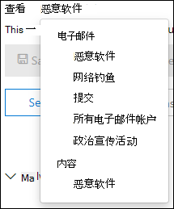
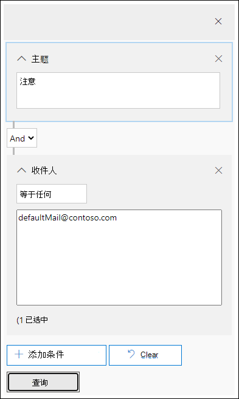

# 调查在邮件中传递的恶意Microsoft 365

[!INCLUDE [Microsoft 365 Defender rebranding](../includes/microsoft-defender-for-office.md)]

**适用于：**

- [Microsoft Defender for Office 365 计划 1 和计划 2](defender-for-office-365.md)
- [Microsoft 365 Defender](../defender/microsoft-365-defender.md)

[Microsoft Defender for Office 365](defender-for-office-365.md)使你能够调查使组织成员面临风险的活动，并采取措施来保护你的组织。 例如，如果你是组织安全团队的一员，你可以查找并调查传递的可疑电子邮件。 为此，可以使用威胁资源管理器 ([或实时检测) ](threat-explorer.md)。

> [!NOTE]
> 跳转到此处的修正 [文章](remediate-malicious-email-delivered-office-365.md)。

## 准备工作

请确保满足以下要求：

- 你的组织具有 [Microsoft Defender for Office 365](defender-for-office-365.md)[，许可证已分配给用户](../../admin/manage/assign-licenses-to-users.md)。

- [为](../../compliance/turn-audit-log-search-on-or-off.md) 组织启用审核日志记录。

- 组织为反垃圾邮件、反恶意软件、防钓鱼等定义了策略。 请参阅[防止威胁Office 365](protect-against-threats.md)。

- 你是全局管理员，或者你已分配有安全管理员或搜索和清除角色，Microsoft 365 Defender角色。 有关详细信息，请参阅 [Microsoft 365 Defender 门户中的权限](permissions-microsoft-365-security-center.md)。 对于一些操作，还必须分配有"预览"角色。

### 预览角色权限

若要执行某些操作（如查看邮件头或下载电子邮件内容），必须将 *Preview* 角色添加到另一个相应的角色组。 下表阐明了所需的角色和权限。

|活动|角色组|需要预览角色？|
|---|---|---|
|使用威胁 (和实时检测) 分析威胁|全局管理员 
 安全管理员 
 安全信息读取者|否|
|使用威胁 (和实时检测) 查看电子邮件的邮件头，以及预览和下载隔离的电子邮件|全局管理员 
 安全管理员 
 安全信息读取者|否|
|使用威胁资源管理器查看邮件头，仅在 (电子邮件实体页面预览电子邮件) 并下载传递到邮箱的电子邮件|全局管理员 
 安全管理员 
 安全信息读取者 
 预览|是|

> [!NOTE]
> **预览** 是角色，而不是角色组。 预览角色必须添加到现有角色组或角色门户中的新角色Microsoft 365 Defender组。 有关详细信息，请参阅 [Microsoft 365 Defender 门户中的权限](permissions-microsoft-365-security-center.md)。
>
> 全局管理员角色分配有Microsoft 365 管理中心角色<https://admin.microsoft.com>。 安全管理员和安全读者角色在安全门户Microsoft 365 Defender分配。

我们知道预览和下载电子邮件是敏感活动，因此为这些活动启用审核。 管理员在电子邮件上执行这些活动后，将针对相同内容生成审核日志，可在 Microsoft 365 Defender <https://security.microsoft.com>  \> 门户的"审核搜索"选项卡上查看，并筛选"用户"框中的 **管理员名称。**  筛选出的结果将显示活动 **AdminMailAccess**。 选择一行以查看有关预览或下载的电子邮件的详细信息部分的详细信息。

## 查找已送达的可疑电子邮件

威胁资源管理器是一个功能强大的报告，可用于多种目的，例如查找和删除邮件、标识恶意电子邮件发件人的 IP 地址或启动事件以进一步调查。 以下过程重点介绍使用资源管理器查找和删除收件人邮箱中的恶意电子邮件。

> [!NOTE]
> 资源管理器中的默认搜索当前不包括通过零时差自动清除从云邮箱中删除的已送达 (ZAP) 。 此限制适用于所有视图 (例如电子邮件 **\>****\>** 恶意软件或电子邮件钓鱼视图) 。 若要包含 ZAP 删除的项目，需要添加"传递" **操作集以** 包含 **"由 ZAP 删除"**。 如果包括所有选项，你将看到所有传递操作结果，包括 ZAP 删除的项目。

1. In the Microsoft 365 Defender portal at <https://security.microsoft.com>， go to **Email & collaboration** \> **Explorer** . 若要直接转到资源管理器 **页面** ，请使用 <https://security.microsoft.com/threatexplorer>。

   在 **"资源管理器** "页上，" **其他** 操作"列向管理员显示处理电子邮件的结果。 可以在 **与** "传递操作"和"传递位置 **"相同的位置** 访问"其他操作 **"列**。 特殊操作可能在威胁资源管理器的电子邮件时间线结束时更新，这是一项旨在为管理员提供更好的搜寻体验的新功能。

2. 在"**视图"****菜单中，从**\>下拉列表 **中选择**"所有电子邮件"。

    

    *恶意软件视图* 当前为默认视图，并捕获检测到恶意软件威胁的电子邮件。 对于 *网络钓鱼* ，网络钓鱼视图的运行方式相同。

    但是 *，所有电子邮件* 视图都会列出组织接收的每封邮件，无论是否已检测到威胁。 正如您想象的那样，这有很多数据，这就是此视图显示要求应用筛选器的占位符的原因。  (此视图仅适用于 P2 Office 365 Defender。) 

    *提交* 视图显示管理员或用户提交给 Microsoft 的所有邮件。

4. **威胁资源管理器中的** 搜索和筛选：筛选器显示在搜索栏中页面的顶部，以帮助管理员进行调查。 请注意，可以同时应用多个筛选器，并且向筛选器中添加多个逗号分隔值来缩小搜索范围。 请注意:

    - 筛选器在大多数筛选条件上执行完全匹配。
    - 主题筛选器使用 CONTAINS 查询。
    - URL 筛选器是否与协议一 (一致。 https) 。
    - URL 域、URL 路径和 URL 域和路径筛选器不需要协议进行筛选。
    - 每次更改筛选器值时，都必须单击"刷新"图标才能获得相关结果。

5. **高级筛选器**：使用这些筛选器，可以生成复杂的查询并筛选数据集。 单击" *高级筛选器"* 将打开一个包含选项的飞出区。

   高级筛选是搜索功能的一项补充。 收件人、发件人和发件人域筛选器上的布尔  NOT 允许管理员通过排除值进行调查。 此选项为" **等于无选择** "。 此选项允许管理员将不需要的邮箱从调查 (例如，警报邮箱和默认回复邮箱) 中排除，并且对于管理员搜索特定主题 (例如，注意) 其中收件人可以设置为等于无以下项的情况很有用 *：defaultMail@contoso.com*。 这是精确值搜索。

   

   将时间筛选器添加到开始日期和结束日期可帮助安全团队快速向下钻取。 允许的最短持续时间为 30 分钟。 如果可以通过时间范围限制来缩小可疑操作 (例如，它发生在 3 小时前) ，这将限制上下文并帮助找到问题所在。

   

6. **威胁资源管理器中的** 字段：威胁资源管理器中公开了许多与安全相关的邮件信息，如传递操作、传递位置、特殊操作、*方向性*、替代和 *URL 威胁*。  它还允许组织的安全团队以更高的确定性进行调查。

    *传递* 操作是对现有策略或检测对电子邮件采取的操作。 以下是电子邮件可以采取的可能操作：

    - **已** 送达 - 电子邮件已传递到用户的收件箱或文件夹，用户可以直接访问它。
    - **垃圾邮件** (垃圾邮件) 垃圾邮件 – 电子邮件已发送到用户的垃圾邮件文件夹或已删除文件夹，并且用户有权访问其"垃圾邮件"或"已删除"文件夹中的电子邮件。
    - **已阻止** – 隔离、失败或已丢弃的任何电子邮件。
    - **已** 替换 – 任何恶意附件替换为.txt附件是恶意附件的电子邮件

    **传递位置**：提供传递位置筛选器，以帮助管理员了解可疑恶意邮件的结束位置以及已对邮件采取的操作。 生成的数据可以导出到电子表格。 可能的传递位置包括：

    - **收件箱或文件夹** - 电子邮件位于收件箱或特定文件夹中，根据您的电子邮件规则。
    - **本地或外部** – 邮箱在云中不存在，但位于本地。
    - **垃圾邮件** 文件夹 – 电子邮件位于用户的"垃圾邮件"文件夹中。
    - **"已删除邮件** "文件夹 – 电子邮件位于用户的"已删除邮件"文件夹中。
    - **隔离** – 隔离中的电子邮件，而不是用户邮箱中的电子邮件。
    - **失败** – 电子邮件无法到达邮箱。
    - **已** 丢弃 - 电子邮件在邮件流中的某处丢失。

    **方向** 性：此选项允许安全运营团队按邮件来自或正在发送的"方向"进行筛选。 方向性值为 *Inbound*、 *Outbound* 和 *Intra-org* (对应于从外部进入组织、从组织发出或内部发送到组织的邮件，分别) 。 此信息可帮助安全运营团队发现欺骗和模拟，因为方向性值与 (不匹配。 *入站*) 和发件人域 (可能是内部域的域，) 显而易见！ 方向性值是单独的，并且可能与邮件跟踪不同。 结果可以导出到电子表格。

    **替代**：此筛选器获取显示在邮件详细信息选项卡上的信息，并使用它来公开组织策略或用户策略的覆盖位置，以允许和阻止 *邮件*。 此筛选器最重要的一点就是，它可帮助组织的安全团队查看由于配置而传递的可疑电子邮件数。 这样，他们有机会根据需要修改允许和阻止。 可以将结果集的此筛选器模板导出到电子表格。

    |威胁资源管理器替代|它们的含义|
    |---|---|
    |由组织策略允许|根据组织策略指示，允许邮件进入邮箱。|
    |被组织策略阻止|邮件被阻止按照组织策略指示发送到邮箱。|
    |组织策略阻止的文件扩展名|根据组织策略指示，阻止将文件传递至邮箱。|
    |用户策略允许|根据用户策略指示，允许邮件进入邮箱。|
    |被用户策略阻止|邮件被阻止按照用户策略指示发送到邮箱。|

    **URL 威胁**：URL 威胁字段已包含在电子邮件的详细信息选项卡中，用于指示 URL 显示的威胁。 URL 呈现的威胁可能包括 *恶意软件*、*网络钓鱼* 或垃圾邮件，没有威胁的 URL 在威胁部分中会显示 *"无*"。

7. **电子邮件时间线视图**：安全运营团队可能需要深入了解电子邮件详细信息，以便进一步调查。 电子邮件时间线允许管理员查看对从传递到传递后的电子邮件采取的操作。 若要查看电子邮件时间线，请单击电子邮件的主题，然后单击"电子邮件时间线"。  ("摘要"或"详细信息"等面板上的其他标题中显示) 可以将这些结果导出到电子表格。

    电子邮件时间线将打开一个表，该表显示电子邮件的所有传递和传递后事件。 如果电子邮件上没有进一步的操作，应该会看到原始传递的单个事件，该事件会指出结果（如"已阻止"）以及类似 *钓鱼邮件的裁定*。 管理员可以导出整个电子邮件时间线，包括选项卡上的所有详细信息和电子邮件 (如主题、发件人、收件人、网络和邮件 ID) 。 电子邮件时间线会减少随机化，因为检查不同位置以尝试了解自电子邮件到达后所发生事件所花的时间较少。 当在电子邮件上同时发生或接近多个事件时，这些事件会显示在时间线视图中。

8. **预览/下载**：威胁资源管理器向安全运营团队提供他们调查可疑电子邮件所需的详细信息。 安全运营团队可以：

    - [检查传递操作和位置](#check-the-delivery-action-and-location)。

    - [查看电子邮件的日程表](#view-the-timeline-of-your-email)。

### 检查传递操作和位置

在 [威胁 (](threat-explorer.md)和实时检测) 中，现在具有"传递操作"和"传递位置"列，而不是以前的"传递 **状态"** 列。 这可更完整地了解电子邮件的陆地位置。 此更改的一部分是使调查更易于安全运营团队，但最终结果是一目了然地了解问题电子邮件的位置。

传递状态现在分为两列：

- **传递** 操作 - 此电子邮件的状态是什么？
- **送达位置** - 此电子邮件作为结果路由在何处？

传递操作是对现有策略或检测对电子邮件采取的操作。 以下是电子邮件可以采取的可能操作：

- **已** 送达 - 电子邮件已传递到用户的收件箱或文件夹，用户可以直接访问它。
- **垃圾邮件** – 电子邮件发送到用户的垃圾邮件文件夹或已删除文件夹，并且用户有权访问其"垃圾邮件"或"已删除"文件夹中的电子邮件。
- **已阻止** – 隔离、失败或已丢弃的任何电子邮件。
- **已** 替换 – 任何恶意附件替换为.txt附件是恶意附件的文件的电子邮件。

传递位置显示运行传递后的策略和检测的结果。 它链接到传递操作。 添加了此字段，可深入了解在发现问题邮件时采取的操作。 以下是传递位置的可能值：

- **收件箱或文件夹** - 电子邮件位于收件箱或文件夹中 (电子邮件规则) 。
- **本地或外部** – 邮箱在云中不存在，但位于本地。
- **垃圾邮件** 文件夹 – 电子邮件位于用户的"垃圾邮件"文件夹中。
- **"已删除邮件** "文件夹 – 电子邮件位于用户的"已删除邮件"文件夹中。
- **隔离** – 隔离中的电子邮件，而不是用户邮箱中的电子邮件。
- **失败** – 电子邮件无法到达邮箱。
- **已** 丢弃 – 电子邮件在邮件流中的某处丢失。

### 查看电子邮件时间线

**电子邮件时间线** 是威胁资源管理器中的一个字段，可便于安全操作团队进行搜寻。 当电子邮件上同时发生或接近同一时间发生多个事件时，这些事件会显示在时间线视图中。 "特殊操作"列中会捕获在电子邮件传递后发生的 **一些** 事件。 将电子邮件时间线的信息与传递后执行的任何特殊操作相结合，管理员可深入了解策略和威胁处理 (例如邮件的路由位置，在某些情况下，还了解最终评估) 。

> [!IMPORTANT]
> 跳转到此处的修正 [主题](remediate-malicious-email-delivered-office-365.md)。

## 相关主题

[修正在邮件中传递的Office 365](remediate-malicious-email-delivered-office-365.md)

[Microsoft Defender for Office 365](office-365-ti.md)

[防范威胁Office 365](protect-against-threats.md)

[查看 Defender for Office 365](view-reports-for-mdo.md)
