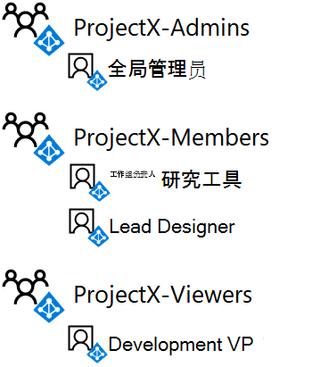

# <a name="isolated-sharepoint-online-team-site-devtest-environment"></a><span data-ttu-id="98a73-103">独立的 SharePoint Online 团队网站开发/测试环境</span><span class="sxs-lookup"><span data-stu-id="98a73-103">Isolated SharePoint Online team site dev/test environment</span></span>

[!INCLUDE [Microsoft 365 Defender rebranding](../includes/microsoft-defender-for-office.md)]

<span data-ttu-id="98a73-104">**适用对象**</span><span class="sxs-lookup"><span data-stu-id="98a73-104">**Applies to**</span></span>
- [<span data-ttu-id="98a73-105">Exchange Online Protection</span><span class="sxs-lookup"><span data-stu-id="98a73-105">Exchange Online Protection</span></span>](exchange-online-protection-overview.md)
- [<span data-ttu-id="98a73-106">Microsoft Defender for Office 365 计划 1</span><span class="sxs-lookup"><span data-stu-id="98a73-106">Microsoft Defender for Office 365 plan 1</span></span>](office-365-atp.md)
- <span data-ttu-id="98a73-107">SharePoint Online</span><span class="sxs-lookup"><span data-stu-id="98a73-107">SharePoint Online</span></span> 


 <span data-ttu-id="98a73-108">**摘要：** 在 Microsoft 365 开发/测试环境中配置与组织其余部分隔离的 SharePoint Online 团队网站。</span><span class="sxs-lookup"><span data-stu-id="98a73-108">**Summary:** Configure a SharePoint Online team site that is isolated from the rest of the organization in your Microsoft 365 dev/test environment.</span></span>

<span data-ttu-id="98a73-109">Microsoft 365 中的 SharePoint Online 团队网站是使用通用文档库、OneNote 笔记本和其他服务进行协作的位置。</span><span class="sxs-lookup"><span data-stu-id="98a73-109">SharePoint Online team sites in Microsoft 365 are locations for collaboration using a common document library, a OneNote notebook, and other services.</span></span> <span data-ttu-id="98a73-110">在大多数情况下，需要跨部门或组织实现广泛访问和协作。</span><span class="sxs-lookup"><span data-stu-id="98a73-110">In many cases, you want wide access and collaboration across departments or organizations.</span></span> <span data-ttu-id="98a73-111">但是，在某些情况下，您希望严格控制一小组人员之间的协作访问权限和权限。</span><span class="sxs-lookup"><span data-stu-id="98a73-111">However, in some cases, you want to tightly control the access and permissions for collaboration among a small group of people.</span></span>

<span data-ttu-id="98a73-112">对 SharePoint Online 团队网站的访问权限以及用户可以执行哪些操作由 SharePoint 组和权限级别控制。</span><span class="sxs-lookup"><span data-stu-id="98a73-112">Access to SharePoint Online team sites and what users can do is controlled by SharePoint groups and permission levels.</span></span> <span data-ttu-id="98a73-113">默认情况下，SharePoint Online 网站有三种访问级别：</span><span class="sxs-lookup"><span data-stu-id="98a73-113">By default, SharePoint Online sites have three levels of access:</span></span>

- <span data-ttu-id="98a73-114">**成员**：可以在网站上查看、创建和修改资源。</span><span class="sxs-lookup"><span data-stu-id="98a73-114">**Members**, who can view, create, and modify resources on the site.</span></span>
- <span data-ttu-id="98a73-115">**所有者**：可完全控制网站，包括能够更改权限。</span><span class="sxs-lookup"><span data-stu-id="98a73-115">**Owners**, who have complete control of the site, including the ability to change permissions.</span></span>
- <span data-ttu-id="98a73-116">**访问者**：只能在网站上查看资源。</span><span class="sxs-lookup"><span data-stu-id="98a73-116">**Visitors**, who only can view resources on the site.</span></span>

<span data-ttu-id="98a73-117">本文将分步介绍为名为 ProjectX 的机密开发项目配置独立 SharePoint Online 团队网站的步骤。</span><span class="sxs-lookup"><span data-stu-id="98a73-117">This article steps you through the configuration of an isolated SharePoint Online team site for a secret research project named ProjectX.</span></span> <span data-ttu-id="98a73-118">访问要求包括：</span><span class="sxs-lookup"><span data-stu-id="98a73-118">The access requirements are:</span></span>

- <span data-ttu-id="98a73-119">只有此项目的成员才能访问网站及其内容（文档、OneNote 笔记本、网页），编辑和查看 SharePoint 权限级别是通过组成员身份进行控制。</span><span class="sxs-lookup"><span data-stu-id="98a73-119">Only members of the project can access the site and its contents (documents, OneNote Notebook, Pages), with edit and view SharePoint permission levels controlled through group membership.</span></span>

- <span data-ttu-id="98a73-120">只有网站创建者和网站管理员组成员才能管理网站，包括可以修改网站级权限。</span><span class="sxs-lookup"><span data-stu-id="98a73-120">Only the site creator and members of an Admins group for the site can perform site administration, which includes modifying site-level permissions.</span></span>

<span data-ttu-id="98a73-121">在 Microsoft 365 开发/测试环境中设置独立的 SharePoint Online 团队网站有三个阶段：</span><span class="sxs-lookup"><span data-stu-id="98a73-121">There are three phases to setting up an isolated SharePoint Online team site in your Microsoft 365 dev/test environment:</span></span>

1. <span data-ttu-id="98a73-122">创建 Microsoft 365 开发/测试环境。</span><span class="sxs-lookup"><span data-stu-id="98a73-122">Create the Microsoft 365 dev/test environment.</span></span>

2. <span data-ttu-id="98a73-123">创建 ProjectX 用户和组。</span><span class="sxs-lookup"><span data-stu-id="98a73-123">Create the users and groups for ProjectX.</span></span>

3. <span data-ttu-id="98a73-124">创建新的 ProjectX SharePoint Online 团队网站并将其隔离。</span><span class="sxs-lookup"><span data-stu-id="98a73-124">Create a new ProjectX SharePoint Online team site and isolate it.</span></span>

> [!TIP]
> <span data-ttu-id="98a73-125">单击[此处](https://aka.ms/catlgstack)可直观映射到 One Microsoft 云测试实验室指南堆栈中的所有文章。</span><span class="sxs-lookup"><span data-stu-id="98a73-125">Click [here](https://aka.ms/catlgstack) for a visual map to all the articles in the One Microsoft Cloud Test Lab Guide stack.</span></span>

## <a name="phase-1-build-out-your-lightweight-or-simulated-enterprise-microsoft-365-devtest-environment"></a><span data-ttu-id="98a73-126">第 1 阶段：构建轻型或模拟的企业 Microsoft 365 开发/测试环境</span><span class="sxs-lookup"><span data-stu-id="98a73-126">Phase 1: Build out your lightweight or simulated enterprise Microsoft 365 dev/test environment</span></span>

<span data-ttu-id="98a73-127">如果只需要使用最低要求的轻型方式创建独立的 SharePoint Online 团队网站，请按照轻型基本配置的第 2 阶段和阶段 3 [中的说明操作](../../enterprise/lightweight-base-configuration-microsoft-365-enterprise.md)。</span><span class="sxs-lookup"><span data-stu-id="98a73-127">If you just want to create an isolated SharePoint Online team site in a lightweight way with the minimum requirements, follow the instructions in phases 2 and 3 of [The lightweight base configuration](../../enterprise/lightweight-base-configuration-microsoft-365-enterprise.md).</span></span>

<span data-ttu-id="98a73-128">如果要在模拟的企业配置中创建独立的 SharePoint Online 团队网站，请按照 [Microsoft 365](../../enterprise/password-hash-sync-m365-ent-test-environment.md)测试环境的密码哈希同步中的说明操作。</span><span class="sxs-lookup"><span data-stu-id="98a73-128">If you want to create an isolated SharePoint Online team site in a simulated enterprise configuration, follow the instructions in [Password hash synchronization for your Microsoft 365 test environment](../../enterprise/password-hash-sync-m365-ent-test-environment.md).</span></span>

> [!NOTE]
> <span data-ttu-id="98a73-129">创建独立 SharePoint Online 网站不需要模拟的企业开发/测试环境，其中包括连接到 Internet 的模拟 Intranet 和 Active Directory 域服务 (AD DS) 林的目录同步。</span><span class="sxs-lookup"><span data-stu-id="98a73-129">Creating an isolated SharePoint Online site does not require the simulated enterprise dev/test environment, which includes a simulated intranet connected to the Internet and directory synchronization for a Active Directory Domain Services (AD DS) forest.</span></span> <span data-ttu-id="98a73-130">可以根据需要选择此选项，以便能够测试独立 SharePoint Online 网站，并在代表典型组织的环境中对其进行试验。</span><span class="sxs-lookup"><span data-stu-id="98a73-130">It is provided here as an option so that you can test an isolated SharePoint Online site and experiment with it in an environment that represents a typical organization.</span></span>

## <a name="phase-2-create-user-accounts-and-access-groups"></a><span data-ttu-id="98a73-131">第 2 阶段：创建用户帐户和访问组</span><span class="sxs-lookup"><span data-stu-id="98a73-131">Phase 2: Create user accounts and access groups</span></span>

<span data-ttu-id="98a73-132">使用连接到 [Office 365 PowerShell](../../enterprise/connect-to-microsoft-365-powershell.md) 中的说明，使用以下全局管理员帐户连接到试用订阅：</span><span class="sxs-lookup"><span data-stu-id="98a73-132">Use the instructions in [Connect to Office 365 PowerShell](../../enterprise/connect-to-microsoft-365-powershell.md) to connect to your trial subscription with your global administrator account from:</span></span>

- <span data-ttu-id="98a73-133">你的计算机 (轻型 Microsoft 365 开发/测试环境) 。</span><span class="sxs-lookup"><span data-stu-id="98a73-133">Your computer (for the lightweight Microsoft 365 dev/test environment).</span></span>

- <span data-ttu-id="98a73-134">CLIENT1 虚拟机 (模拟企业 Microsoft 365 开发/测试环境) 。</span><span class="sxs-lookup"><span data-stu-id="98a73-134">The CLIENT1 virtual machine (for the simulated enterprise Microsoft 365 dev/test environment).</span></span>

<span data-ttu-id="98a73-135">若要为 ProjectX SharePoint Online 团队网站创建新的访问组，请从 Active Directory 模块Windows Azure以下命令，Windows PowerShell提示：</span><span class="sxs-lookup"><span data-stu-id="98a73-135">To create the new access groups for the ProjectX SharePoint Online team site, run these commands from the Windows Azure Active Directory Module for Windows PowerShell prompt:</span></span>

```powershell
$groupName="ProjectX-Members"
$groupDesc="People allowed to collaborate for ProjectX."
New-MsolGroup -DisplayName $groupName -Description $groupDesc
$groupName="ProjectX-Admins"
$groupDesc="People allowed to administer SharePoint for ProjectX."
New-MsolGroup -DisplayName $groupName -Description $groupDesc
$groupName="ProjectX-Viewers"
$groupDesc="People allowed to view the SharePoint resources for ProjectX."
New-MsolGroup -DisplayName $groupName -Description $groupDesc
```

<span data-ttu-id="98a73-136">填写组织名称（示例：contosotoycompany），你所在位置的两位字符的国家/地区代码，然后从用于 Windows PowerShell 的 Windows Azure Active Directory 模块提示符中运行以下命令：</span><span class="sxs-lookup"><span data-stu-id="98a73-136">Fill in your organization name (example: contosotoycompany), the two-character country code for your location, and then run the following commands from the Windows Azure Active Directory Module for Windows PowerShell prompt:</span></span>

```powershell
$orgName="<organization name>"
$loc="<two-character country code, such as US>"
$licAssignment= $orgName + ":ENTERPRISEPREMIUM"
$userName= "designer@" + $orgName + ".onmicrosoft.com"
New-MsolUser -DisplayName "Lead Designer" -FirstName Lead -LastName Designer -UserPrincipalName $userName -UsageLocation $loc -LicenseAssignment $licAssignment -ForceChangePassword $false
```

<span data-ttu-id="98a73-137">在安全的位置上，记下显示的 **New-MsolUser** 命令中为 Lead Designer 帐户生成的密码。</span><span class="sxs-lookup"><span data-stu-id="98a73-137">From the display of the **New-MsolUser** command, note the generated password for the Lead Designer account and record it in a safe location.</span></span>

<span data-ttu-id="98a73-138">从用于 Windows PowerShell 的 Windows Azure Active Directory 模块提示符中运行以下命令：</span><span class="sxs-lookup"><span data-stu-id="98a73-138">Run the following commands from the Windows Azure Active Directory Module for Windows PowerShell prompt:</span></span>

```powershell
$userName= "researcher@" + $orgName + ".onmicrosoft.com"
New-MsolUser -DisplayName "Lead Researcher" -FirstName Lead -LastName Researcher -UserPrincipalName $userName -UsageLocation $loc -LicenseAssignment $licAssignment -ForceChangePassword $false
```

<span data-ttu-id="98a73-139">在安全的位置上，记下显示的 **New-MsolUser** 命令中为 Lead Researcher 帐户生成的密码。</span><span class="sxs-lookup"><span data-stu-id="98a73-139">From the display of the **New-MsolUser** command, note the generated password for the Lead Researcher account and record it in a safe location.</span></span>

<span data-ttu-id="98a73-140">从用于 Windows PowerShell 的 Windows Azure Active Directory 模块提示符中运行以下命令：</span><span class="sxs-lookup"><span data-stu-id="98a73-140">Run the following commands from the Windows Azure Active Directory Module for Windows PowerShell prompt:</span></span>

```powershell
$userName= "devvp@" + $orgName + ".onmicrosoft.com"
New-MsolUser -DisplayName "Development VP" -FirstName Development -LastName VP -UserPrincipalName $userName -UsageLocation $loc -LicenseAssignment $licAssignment -ForceChangePassword $false
```

<span data-ttu-id="98a73-141">在安全的位置上，记下显示的 **New-MsolUser** 命令中为 Development VP 帐户生成的密码。</span><span class="sxs-lookup"><span data-stu-id="98a73-141">From the display of the **New-MsolUser** command, note the generated password for the Development VP account and record it in a safe location.</span></span>

<span data-ttu-id="98a73-142">接下来，若要将新帐户添加到新访问组，请从 Active Directory 模块中运行Windows Azure PowerShell 命令，Windows PowerShell提示：</span><span class="sxs-lookup"><span data-stu-id="98a73-142">Next, to add the new accounts to the new access groups, run these PowerShell commands from the Windows Azure Active Directory Module for Windows PowerShell prompt:</span></span>

```powershell
$grpName="ProjectX-Members"
$userUPN="designer@" + $orgName + ".onmicrosoft.com"
Add-MsolGroupMember -GroupObjectId (Get-MsolGroup | Where { $_.DisplayName -eq $grpName }).ObjectID -GroupMemberObjectId (Get-MsolUser | Where { $_.UserPrincipalName -eq $userUPN }).ObjectID -GroupMemberType "User"
$userUPN="researcher@" + $orgName + ".onmicrosoft.com"
Add-MsolGroupMember -GroupObjectId (Get-MsolGroup | Where { $_.DisplayName -eq $grpName }).ObjectID -GroupMemberObjectId (Get-MsolUser | Where { $_.UserPrincipalName -eq $userUPN }).ObjectID -GroupMemberType "User"
$grpName="ProjectX-Admins"
Add-MsolGroupMember -GroupObjectId (Get-MsolGroup | Where { $_.DisplayName -eq $grpName }).ObjectID -GroupMemberObjectId (Get-MsolUser | Where { $_.UserPrincipalName -eq $userCredential.UserName }).ObjectID -GroupMemberType "User"
$grpName="ProjectX-Viewers"
$userUPN="devvp@" + $orgName + ".onmicrosoft.com"
Add-MsolGroupMember -GroupObjectId (Get-MsolGroup | Where { $_.DisplayName -eq $grpName }).ObjectID -GroupMemberObjectId (Get-MsolUser | Where { $_.UserPrincipalName -eq $userUPN }).ObjectID -GroupMemberType "User"
```

<span data-ttu-id="98a73-143">结果：</span><span class="sxs-lookup"><span data-stu-id="98a73-143">Results:</span></span>

- <span data-ttu-id="98a73-144">该ProjectX-Members访问组包含 Lead Designer 和 Lead Researcher 用户帐户</span><span class="sxs-lookup"><span data-stu-id="98a73-144">The ProjectX-Members access group contains the Lead Designer and Lead Researcher user accounts</span></span>

- <span data-ttu-id="98a73-145">ProjectX-Admins访问组包含试用订阅的全局管理员帐户</span><span class="sxs-lookup"><span data-stu-id="98a73-145">The ProjectX-Admins access group contains the global administrator account for your trial subscription</span></span>

- <span data-ttu-id="98a73-146">该ProjectX-Viewers访问组包含 Development VP 用户帐户</span><span class="sxs-lookup"><span data-stu-id="98a73-146">The ProjectX-Viewers access group contains the Development VP user account</span></span>

<span data-ttu-id="98a73-147">图 1 显示了访问组及其成员身份。</span><span class="sxs-lookup"><span data-stu-id="98a73-147">Figure 1 shows the access groups and their membership.</span></span>

<span data-ttu-id="98a73-148">**图 1：**</span><span class="sxs-lookup"><span data-stu-id="98a73-148">**Figure 1**:</span></span>



## <a name="phase-3-create-a-new-projectx-sharepoint-online-team-site-and-isolate-it"></a><span data-ttu-id="98a73-150">第 3 阶段：创建新的 ProjectX SharePoint Online 团队网站并将其隔离</span><span class="sxs-lookup"><span data-stu-id="98a73-150">Phase 3: Create a new ProjectX SharePoint Online team site and isolate it</span></span>

<span data-ttu-id="98a73-151">若要为 ProjectX 创建 SharePoint Online 团队网站，请执行下列操作：</span><span class="sxs-lookup"><span data-stu-id="98a73-151">To create a SharePoint Online team site for ProjectX, do the following:</span></span>

1. <span data-ttu-id="98a73-152">使用本地计算机或 (轻型配置) 或 CLIENT1 (模拟企业配置) 上的浏览器，使用全局管理员帐户登录 Microsoft 365 管理中心 (<https://admin.microsoft.com>) 。</span><span class="sxs-lookup"><span data-stu-id="98a73-152">Using a browser on either your local computer (lightweight configuration) or on CLIENT1 (simulated enterprise configuration), sign in to the Microsoft 365 admin center (<https://admin.microsoft.com>) using your global administrator account.</span></span>

2. <span data-ttu-id="98a73-153">在磁贴列表中，单击“SharePoint”。</span><span class="sxs-lookup"><span data-stu-id="98a73-153">In the list of tiles, click **SharePoint**.</span></span>

3. <span data-ttu-id="98a73-154">在浏览器上的新“SharePoint”选项卡中，单击“+ 创建网站”。</span><span class="sxs-lookup"><span data-stu-id="98a73-154">On the new SharePoint tab in your browser, click **+ Create site**.</span></span>

4. <span data-ttu-id="98a73-155">在“团队网站名称”中，键入“ProjectX”。</span><span class="sxs-lookup"><span data-stu-id="98a73-155">In **Team site name**, type **ProjectX**.</span></span> <span data-ttu-id="98a73-156">在 **"隐私**"设置 **中，选择"专用 - 只有成员才能访问此网站"。**</span><span class="sxs-lookup"><span data-stu-id="98a73-156">In **Privacy settings**, select **Private - only members can access this site**.</span></span>

5. <span data-ttu-id="98a73-157">在“团队网站描述”中，键入“ProjectX 的 SharePoint 网站”，然后单击“下一步”。</span><span class="sxs-lookup"><span data-stu-id="98a73-157">In **Team site description**, type **SharePoint site for ProjectX**, and then click **Next**.</span></span>

6. <span data-ttu-id="98a73-158">在“想添加什么人员?”窗格中，单击“完成”。</span><span class="sxs-lookup"><span data-stu-id="98a73-158">On the **Who do you want to add**? pane, click **Finish**.</span></span>

7. <span data-ttu-id="98a73-159">在浏览器上的新“ProjectX-主页”选项卡上，依次单击工具栏中的设置图标和“网站权限”。</span><span class="sxs-lookup"><span data-stu-id="98a73-159">On the new **ProjectX-Home** tab in your browser, in the tool bar, click the settings icon, and then click **Site permissions**.</span></span>

8. <span data-ttu-id="98a73-160">在“网站权限”窗格中，单击“高级权限设置”。</span><span class="sxs-lookup"><span data-stu-id="98a73-160">In the **Site permissions** pane, click **Advanced permissions settings**.</span></span>

9. <span data-ttu-id="98a73-161">在浏览器上的新“权限：Project X”选项卡中，单击“访问请求设置”。</span><span class="sxs-lookup"><span data-stu-id="98a73-161">In the new **Permissions: Project X** tab in your browser, click **Access Request Settings**.</span></span>

10. <span data-ttu-id="98a73-162">在“访问请求设置”对话框中，取消选中“允许成员共享网站以及个别文件和文件夹”和“允许访问请求”（以便取消选中全部三个复选框），然后单击“确定”。</span><span class="sxs-lookup"><span data-stu-id="98a73-162">In the **Access Requests Settings** dialog box, clear **Allow members to share the site and individual files and folders** and **Allow access requests** (so that all three check boxes are cleared), and then click **OK**.</span></span>

11. <span data-ttu-id="98a73-163">单击列表中的“ProjectX 成员”。</span><span class="sxs-lookup"><span data-stu-id="98a73-163">Click **ProjectX Members** in the list.</span></span>

12. <span data-ttu-id="98a73-164">在“**人员和组**”页面上，单击“**新建**”。</span><span class="sxs-lookup"><span data-stu-id="98a73-164">On the **People and Groups** page, click **New**.</span></span>

13. <span data-ttu-id="98a73-165">在“共享”对话框中，键入并选择“ProjectX-Members”，然后单击“共享”。</span><span class="sxs-lookup"><span data-stu-id="98a73-165">In the **Share** dialog box, type **ProjectX-Members**, select it, and then click **Share**.</span></span>

14. <span data-ttu-id="98a73-166">单击浏览器上的后退按钮。</span><span class="sxs-lookup"><span data-stu-id="98a73-166">Click the back button on your browser.</span></span>

15. <span data-ttu-id="98a73-167">单击列表中的“ProjectX 所有者”。</span><span class="sxs-lookup"><span data-stu-id="98a73-167">Click **ProjectX Owners** in the list.</span></span>

16. <span data-ttu-id="98a73-168">在“**人员和组**”页面上，单击“**新建**”。</span><span class="sxs-lookup"><span data-stu-id="98a73-168">On the **People and Groups** page, click **New**.</span></span>

17. <span data-ttu-id="98a73-169">在“共享”对话框中，键入并选择“ProjectX-Admins”，然后单击“共享”。</span><span class="sxs-lookup"><span data-stu-id="98a73-169">In the **Share** dialog box, type **ProjectX-Admins**, select it, and then click **Share**.</span></span>

18. <span data-ttu-id="98a73-170">单击浏览器上的后退按钮。</span><span class="sxs-lookup"><span data-stu-id="98a73-170">Click the back button on your browser.</span></span>

19. <span data-ttu-id="98a73-171">单击列表中的“ProjectX 访问者”。</span><span class="sxs-lookup"><span data-stu-id="98a73-171">Click **ProjectX Visitors** in the list.</span></span>

20. <span data-ttu-id="98a73-172">在“人员和组”页面上，单击“新建”。</span><span class="sxs-lookup"><span data-stu-id="98a73-172">On the **People and Groups** page, click **New**.</span></span>

21. <span data-ttu-id="98a73-173">在“共享”对话框中，键入并选择“ProjectX-Viewers”，然后单击“共享”。</span><span class="sxs-lookup"><span data-stu-id="98a73-173">In the **Share** dialog box, type **ProjectX-Viewers**, select it, and then click **Share**.</span></span>

22. <span data-ttu-id="98a73-174">关闭浏览器上的“人员和组”选项卡，单击浏览器上的“ProjectX-主页”选项卡，然后关闭“网站权限”窗格。</span><span class="sxs-lookup"><span data-stu-id="98a73-174">Close the **People and Groups** tab in your browser, click the **ProjectX-Home** tab in your browser, and then close the **Site permissions** pane.</span></span>

<span data-ttu-id="98a73-175">下面介绍了权限配置结果：</span><span class="sxs-lookup"><span data-stu-id="98a73-175">Here are the results of configuring permissions:</span></span>

- <span data-ttu-id="98a73-176">ProjectX 成员 SharePoint 组仅包含 ProjectX-Members 访问组 (其中仅包含 Lead Designer 和 Lead Researcher 用户帐户) 和 ProjectX 组 (其中仅包含全局管理员用户帐户) 。</span><span class="sxs-lookup"><span data-stu-id="98a73-176">The ProjectX Members SharePoint group contains only the ProjectX-Members access group (which contains only the Lead Designer and Lead Researcher user accounts) and the ProjectX group (which contains only the global administrator user account).</span></span>

- <span data-ttu-id="98a73-177">ProjectX Owners SharePoint 组仅包含ProjectX-Admins访问组 (其中仅包含全局管理员用户帐户) 。</span><span class="sxs-lookup"><span data-stu-id="98a73-177">The ProjectX Owners SharePoint group contains only the ProjectX-Admins access group (which contains only the global administrator user account).</span></span>

- <span data-ttu-id="98a73-178">ProjectX Visitors SharePoint 组仅包含ProjectX-Viewers访问组 (仅包含 Development VP 用户帐户) 。</span><span class="sxs-lookup"><span data-stu-id="98a73-178">The ProjectX Visitors SharePoint group contains only the ProjectX-Viewers access group (which contains only the Development VP user account).</span></span>

- <span data-ttu-id="98a73-179">成员无法修改网站级权限（只有 ProjectX-Admins 组成员才能修改）。</span><span class="sxs-lookup"><span data-stu-id="98a73-179">Members cannot modify site-level permissions (this can only be done by members of the ProjectX-Admins group).</span></span>

- <span data-ttu-id="98a73-180">其他用户帐户无法访问网站及其资源，也无法请求访问网站。</span><span class="sxs-lookup"><span data-stu-id="98a73-180">Other user accounts cannot access the site or its resources or request access to the site.</span></span>

<span data-ttu-id="98a73-181">图 2 展示了 SharePoint 组及其成员身份。</span><span class="sxs-lookup"><span data-stu-id="98a73-181">Figure 2 shows the SharePoint groups and their membership.</span></span>

<span data-ttu-id="98a73-182">**图 2**</span><span class="sxs-lookup"><span data-stu-id="98a73-182">**Figure 2**</span></span>


<span data-ttu-id="98a73-184">现在，让我们演示使用 Lead Designer 用户帐户的访问：</span><span class="sxs-lookup"><span data-stu-id="98a73-184">Now let's demonstrate access using the Lead Designer user account:</span></span>

1. <span data-ttu-id="98a73-185">关闭浏览器中的“ProjectX-主页”选项卡，然后单击浏览器中的“Microsoft Office 主页”选项卡。</span><span class="sxs-lookup"><span data-stu-id="98a73-185">Close the **ProjectX-Home** tab in your browser, and then click the **Microsoft Office Home** tab in your browser.</span></span>

2. <span data-ttu-id="98a73-186">依次单击全局管理员名称和“注销”。</span><span class="sxs-lookup"><span data-stu-id="98a73-186">Click the name of your global administrator, and then click **Sign out**.</span></span>

3. <span data-ttu-id="98a73-187">使用 Lead Designer 帐户名 () 登录到 Microsoft 365 管理 <https://admin.microsoft.com> 中心。</span><span class="sxs-lookup"><span data-stu-id="98a73-187">Sign in to the Microsoft 365 admin center (<https://admin.microsoft.com>) using the Lead Designer account name and its password.</span></span>

4. <span data-ttu-id="98a73-188">在磁贴列表中，单击“SharePoint”。</span><span class="sxs-lookup"><span data-stu-id="98a73-188">In the list of tiles, click **SharePoint**.</span></span>

5. <span data-ttu-id="98a73-189">在浏览器的新 **SharePoint** 选项卡上，在搜索框中键入 **ProjectX，** 激活搜索，然后单击 **ProjectX** 团队网站。</span><span class="sxs-lookup"><span data-stu-id="98a73-189">On the new **SharePoint** tab in your browser, type **ProjectX** in the search box, activate the search, and then click the **ProjectX** team site.</span></span> <span data-ttu-id="98a73-190">您应该在浏览器中看到 ProjectX 团队网站的新选项卡。</span><span class="sxs-lookup"><span data-stu-id="98a73-190">You should see a new tab in your browser for the ProjectX team site.</span></span>

6. <span data-ttu-id="98a73-p107">单击设置图标。请注意，没有“网站权限”选项。这没有问题，因为只有 ProjectX-Admins 组成员才能修改网站级权限</span><span class="sxs-lookup"><span data-stu-id="98a73-p107">Click the settings icon. Notice that there is no option for **Site Permissions**. This is correct because only the members of the ProjectX-Admins group can modify permissions on the site</span></span>

7. <span data-ttu-id="98a73-194">打开选择的记事本或文本编辑器。</span><span class="sxs-lookup"><span data-stu-id="98a73-194">Open Notepad or a text editor of your choice.</span></span>

8. <span data-ttu-id="98a73-195">复制 ProjectX 团队网站的 URL，并将其粘贴到记事本或文本编辑器中的新行上。</span><span class="sxs-lookup"><span data-stu-id="98a73-195">Copy the URL of the ProjectX team site and paste it on a new line in Notepad or your text editor.</span></span>

9. <span data-ttu-id="98a73-196">在浏览器上的新“ProjectX-主页”选项卡中，单击“文档”。</span><span class="sxs-lookup"><span data-stu-id="98a73-196">On the new **ProjectX-Home** tab in your browser, click **Documents**.</span></span>

10. <span data-ttu-id="98a73-197">将 ProjectX 文档文件夹的 URL 复制并粘贴到记事本或文本编辑器中的新行上。</span><span class="sxs-lookup"><span data-stu-id="98a73-197">Copy the URL of the ProjectX documents folder and paste it on a new line in Notepad or your text editor.</span></span>

11. <span data-ttu-id="98a73-198">在浏览器上的新“ProjectX-文档”选项卡中，依次单击“新建”>“Word 文档”。</span><span class="sxs-lookup"><span data-stu-id="98a73-198">On the new **ProjectX-Documents** tab in your browser, click **New > Word document**.</span></span>

12. <span data-ttu-id="98a73-199">在页面上键入一些文本，等待状态指示已保存，单击浏览器上的后退按钮，然后刷新页面。</span><span class="sxs-lookup"><span data-stu-id="98a73-199">Type some text on the page, wait for the status to indicate **Saved**, click the back button on your browser, and then refresh the page.</span></span> <span data-ttu-id="98a73-200">应该会看到“文档”文件夹中有新的“Document.docx”。</span><span class="sxs-lookup"><span data-stu-id="98a73-200">You should see a new **Document.docx** in the **Documents** folder.</span></span>

13. <span data-ttu-id="98a73-201">依次单击“Document.docx”文档对应的省略号和“获取链接”。</span><span class="sxs-lookup"><span data-stu-id="98a73-201">Click the ellipsis for the **Document.docx** document, and then click **Get a link**.</span></span>

14. <span data-ttu-id="98a73-202">复制"共享Document.docx"对话框中的 **URL，** 并将其粘贴到记事本或文本编辑器中的新 **行** 上，然后关闭"Document.docx"对话框。</span><span class="sxs-lookup"><span data-stu-id="98a73-202">Copy the URL in the **Share 'Document.docx'** dialog box and paste it on a new line in Notepad or your text editor, and then close the **Share 'Document.docx'** dialog box.</span></span>

15. <span data-ttu-id="98a73-203">关闭浏览器中的“ProjectX-文档”和“SharePoint”选项卡，然后单击“Microsoft Office 主页”选项卡。</span><span class="sxs-lookup"><span data-stu-id="98a73-203">Close the **ProjectX-Documents** and **SharePoint** tabs in your browser, and then click the **Microsoft Office Home** tab.</span></span>

16. <span data-ttu-id="98a73-204">依次单击“Lead Designer”名称和“注销”。</span><span class="sxs-lookup"><span data-stu-id="98a73-204">Click the **Lead Designer** name, and then click **Sign out**.</span></span>

<span data-ttu-id="98a73-205">现在，让我们演示使用 Development VP 用户帐户的访问：</span><span class="sxs-lookup"><span data-stu-id="98a73-205">Now let's demonstrate access using the Development VP user account:</span></span>

1. <span data-ttu-id="98a73-206">使用 Development VP 帐户名 () 登录到 Microsoft 365 管理 <https://admin.microsoft.com> 中心。</span><span class="sxs-lookup"><span data-stu-id="98a73-206">Sign in to the Microsoft 365 admin center (<https://admin.microsoft.com>) using the Development VP account name and its password.</span></span>

2. <span data-ttu-id="98a73-207">在磁贴列表中，单击“SharePoint”。</span><span class="sxs-lookup"><span data-stu-id="98a73-207">In the list of tiles, click **SharePoint**.</span></span>

3. <span data-ttu-id="98a73-208">在浏览器的新 **SharePoint** 选项卡上，在搜索框中键入 **ProjectX，** 激活搜索，然后单击 **ProjectX** 团队网站。</span><span class="sxs-lookup"><span data-stu-id="98a73-208">On the new **SharePoint** tab in your browser, type **ProjectX** in the search box, activate the search, and then click the **ProjectX** team site.</span></span> <span data-ttu-id="98a73-209">您应该在浏览器中看到 ProjectX 团队网站的新选项卡。</span><span class="sxs-lookup"><span data-stu-id="98a73-209">You should see a new tab in your browser for the ProjectX team site.</span></span>

4. <span data-ttu-id="98a73-210">依次单击“文档”和“Document.docx”文件。</span><span class="sxs-lookup"><span data-stu-id="98a73-210">Click **Documents**, and then click the **Document.docx** file.</span></span>

5. <span data-ttu-id="98a73-p110">在浏览器上的“Document.docx”选项卡中，尝试修改文本。应该会看到一条内容为“此文档为只读”的消息。这属于正常情况，因为 Development VP 用户帐户仅拥有对网站的查看权限。</span><span class="sxs-lookup"><span data-stu-id="98a73-p110">In the **Document.docx** tab in your browser, try to modify the text. You should see a message stating **This document is read-only.** This is expected because the Development VP user account only has view permissions for the site.</span></span>

6. <span data-ttu-id="98a73-214">关闭浏览器中的“Document.docx”、“ProjectX-文档”和“SharePoint”选项卡。</span><span class="sxs-lookup"><span data-stu-id="98a73-214">Close the **Document.docx**, **ProjectX-Documents**, and **SharePoint** tabs in your browser.</span></span>

7. <span data-ttu-id="98a73-215">依次单击“Microsoft Office 主页”选项卡、“Development VP”名称和“注销”。</span><span class="sxs-lookup"><span data-stu-id="98a73-215">Click the **Microsoft Office Home** tab, click the **Development VP** name, and then click **Sign out**.</span></span>

<span data-ttu-id="98a73-216">现在，让我们演示对没有权限的用户帐户的访问权限：</span><span class="sxs-lookup"><span data-stu-id="98a73-216">Now let's demonstrate access with a user account that has no permissions:</span></span>

1. <span data-ttu-id="98a73-217">使用用户 3 帐户名 () 登录到 <https://admin.microsoft.com> Microsoft 365 管理中心。</span><span class="sxs-lookup"><span data-stu-id="98a73-217">Sign in to the Microsoft 365 admin center (<https://admin.microsoft.com>) using the User 3 account name and its password.</span></span>

2. <span data-ttu-id="98a73-218">在磁贴列表中，单击“SharePoint”。</span><span class="sxs-lookup"><span data-stu-id="98a73-218">In the list of tiles, click **SharePoint**.</span></span>

3. <span data-ttu-id="98a73-p111">	在浏览器上的新“SharePoint”选项卡中，在搜索框中键入“ProjectX”，然后开始搜索。应该会看到一条内容为“这里没有与你的搜索相匹配的内容”的消息。</span><span class="sxs-lookup"><span data-stu-id="98a73-p111">On the new **SharePoint** tab in your browser, type **ProjectX** in the search box and then activate the search. You should see the message **Nothing here matches your search.**</span></span>

4. <span data-ttu-id="98a73-p112">将 ProjectX 网站的 URL 从记事本或文本编辑器的打开实例复制到浏览器的地址栏中，然后按“Enter”。应该会看到“拒绝访问”网页。</span><span class="sxs-lookup"><span data-stu-id="98a73-p112">From the open instance of Notepad or your text editor, copy the URL for the ProjectX site into the address bar of your browser and press **Enter**. You should see an **Access Denied** page.</span></span>

5. <span data-ttu-id="98a73-p113">将 ProjectX 文档文件夹的 URL 从记事本或文本编辑器复制到浏览器的地址栏中，然后按“Enter”。应该会看到“拒绝访问”网页。</span><span class="sxs-lookup"><span data-stu-id="98a73-p113">From Notepad or your text editor, copy the URL for the ProjectX Documents folder into the address bar of your browser and press **Enter**. You should see an **Access Denied** page.</span></span>

6. <span data-ttu-id="98a73-p114">将 Documents.docx 文件的 URL 从记事本或文本编辑器复制到浏览器的地址栏中，然后按“Enter”。应该会看到“拒绝访问”网页。</span><span class="sxs-lookup"><span data-stu-id="98a73-p114">From Notepad or your text editor, copy the URL for the Documents.docx file into the address bar of your browser and press **Enter**. You should see an **Access Denied** page.</span></span>

7. <span data-ttu-id="98a73-227">关闭浏览器中的“SharePoint”选项卡，然后依次单击“Microsoft Office 主页”选项卡、“用户 3”名称和“注销”。</span><span class="sxs-lookup"><span data-stu-id="98a73-227">Close the **SharePoint** tab in your browser, click the **Microsoft Office Home** tab, click the **User 3** name, and then click **Sign out**.</span></span>

<span data-ttu-id="98a73-228">独立 SharePoint Online 网站现在已准备好进行其他实验。</span><span class="sxs-lookup"><span data-stu-id="98a73-228">Your isolated SharePoint Online site is now ready for your additional experimentation.</span></span>

## <a name="next-step"></a><span data-ttu-id="98a73-229">后续步骤</span><span class="sxs-lookup"><span data-stu-id="98a73-229">Next Step</span></span>

<span data-ttu-id="98a73-230">当准备好在生产中部署单独的 SharePoint Online 团队网站后，请参阅[设计单独的 SharePoint Online 团队网站](design-an-isolated-sharepoint-online-team-site.md)中的分步设计注意事项。</span><span class="sxs-lookup"><span data-stu-id="98a73-230">When you are ready to deploy an isolated SharePoint Online team site in production, see the step-by-step design considerations in [Design an isolated SharePoint Online team site](design-an-isolated-sharepoint-online-team-site.md).</span></span>

## <a name="see-also"></a><span data-ttu-id="98a73-231">另请参阅</span><span class="sxs-lookup"><span data-stu-id="98a73-231">See Also</span></span>

[<span data-ttu-id="98a73-232">独立 SharePoint Online 团队网站</span><span class="sxs-lookup"><span data-stu-id="98a73-232">Isolated SharePoint Online team sites</span></span>](isolated-sharepoint-online-team-sites.md)

[<span data-ttu-id="98a73-233">云采用测试实验室指南 (TLG)</span><span class="sxs-lookup"><span data-stu-id="98a73-233">Cloud adoption Test Lab Guides (TLGs)</span></span>](../../enterprise/cloud-adoption-test-lab-guides-tlgs.md)

[<span data-ttu-id="98a73-234">模拟企业基础配置</span><span class="sxs-lookup"><span data-stu-id="98a73-234">The simulated enterprise base configuration</span></span>](../../enterprise/simulated-ent-base-configuration-microsoft-365-enterprise.md)

[<span data-ttu-id="98a73-235">轻型基本配置</span><span class="sxs-lookup"><span data-stu-id="98a73-235">The lightweight base configuration</span></span>](../../enterprise/lightweight-base-configuration-microsoft-365-enterprise.md)

[<span data-ttu-id="98a73-236">Microsoft 365 解决方案和体系结构中心</span><span class="sxs-lookup"><span data-stu-id="98a73-236">Microsoft 365 solution and architecture center</span></span>](../../solutions/index.yml)