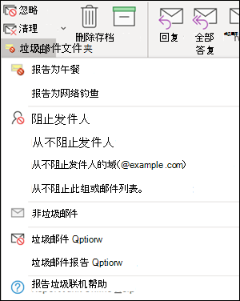
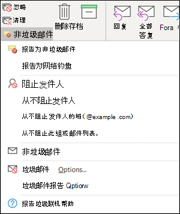

# <a name="install-and-use-the-junk-email-reporting-add-in-for-microsoft-outlook"></a><span data-ttu-id="d412d-103">安装和使用 Microsoft Outlook 的垃圾邮件报告加载项</span><span class="sxs-lookup"><span data-stu-id="d412d-103">Install and use the Junk Email Reporting add-in for Microsoft Outlook</span></span>

> [!NOTE]
> <span data-ttu-id="d412d-104">如果当前未使用垃圾电子邮件报告加载项，建议 [改为使用报告邮件](enable-the-report-message-add-in.md) 外接程序。</span><span class="sxs-lookup"><span data-stu-id="d412d-104">If you aren't currently using the Junk E-mail Reporting add-in, we recommend the [Report Message add-in](enable-the-report-message-add-in.md) instead.</span></span> <span data-ttu-id="d412d-105">有关详细信息，请参见[向 Microsoft 报告邮件和文件](report-junk-email-messages-to-microsoft.md)。</span><span class="sxs-lookup"><span data-stu-id="d412d-105">For more information, see [Report messages and files to Microsoft](report-junk-email-messages-to-microsoft.md).</span></span>

<span data-ttu-id="d412d-106">用户可以通过 Microsoft Outlook 垃圾电子邮件报告外接程序将误报 (标记为垃圾邮件) 、允许邮件 (错误的邮件) 添加到 Microsoft。</span><span class="sxs-lookup"><span data-stu-id="d412d-106">The Junk Email Reporting Add-in for Microsoft Outlook allows users to submit false positives (good email marked as spam), false negatives (bad email allowed) and phishing messages to Microsoft.</span></span> <span data-ttu-id="d412d-107">如果您的组织不使用 Exchange Online Protection (例如，本地 Exchange 或 Exchange Online) 以外的电子邮件服务，您的垃圾邮件报告提交将不会影响垃圾邮件筛选。</span><span class="sxs-lookup"><span data-stu-id="d412d-107">If your organization doesn't use Exchange Online Protection (for example, on-premises Exchange or email services other than Exchange Online), your junk email report submission will not affect your spam filtering.</span></span>

<span data-ttu-id="d412d-108">本主题说明如何安装和使用垃圾邮件报告外接程序。</span><span class="sxs-lookup"><span data-stu-id="d412d-108">This topic explains how to install and use the Junk Email Reporting add-in.</span></span>

## <a name="what-do-you-need-to-know-before-you-begin"></a><span data-ttu-id="d412d-109">开始前，有必要了解什么？</span><span class="sxs-lookup"><span data-stu-id="d412d-109">What do you need to know before you begin?</span></span>

- <span data-ttu-id="d412d-110">若要安装垃圾电子邮件报告外接程序，请参阅 [本主题后面的"安装垃圾邮件](#install-the-junk-email-reporting-add-in) 报告加载项"部分。</span><span class="sxs-lookup"><span data-stu-id="d412d-110">To install the Junk Email Reporting add-in, see the [Install the Junk Email Reporting add-in](#install-the-junk-email-reporting-add-in) section later in this topic.</span></span>

- <span data-ttu-id="d412d-111">垃圾电子邮件报告加载项可与 Outlook 的以下版本一起使用：</span><span class="sxs-lookup"><span data-stu-id="d412d-111">The Junk Email Reporting add-in works with the following versions of Outlook:</span></span>

  - <span data-ttu-id="d412d-112">Outlook 2013 或更高版本</span><span class="sxs-lookup"><span data-stu-id="d412d-112">Outlook 2013 or later</span></span>
  - <span data-ttu-id="d412d-113">Microsoft 365 企业应用版随附的 Outlook</span><span class="sxs-lookup"><span data-stu-id="d412d-113">Outlook included with Microsoft 365 Apps for enterprise</span></span>

- <span data-ttu-id="d412d-114">有关向 Microsoft 报告消息的详细信息，请参阅"[报告邮件和文件到 Microsoft"。](report-junk-email-messages-to-microsoft.md)</span><span class="sxs-lookup"><span data-stu-id="d412d-114">For more information about reporting messages to Microsoft, see [Report messages and files to Microsoft](report-junk-email-messages-to-microsoft.md).</span></span>

## <a name="use-the-junk-email-reporting-add-in-to-report-spam-and-phishing-messages"></a><span data-ttu-id="d412d-115">使用垃圾邮件报告加载项报告垃圾邮件和网络钓鱼邮件</span><span class="sxs-lookup"><span data-stu-id="d412d-115">Use the Junk Email Reporting add-in to report spam and phishing messages</span></span>

1. <span data-ttu-id="d412d-116">对于"收件箱"或"垃圾邮件"之外的任何其他电子邮件文件夹中的邮件，请使用下列任意一种方法报告垃圾邮件和网络钓鱼邮件：</span><span class="sxs-lookup"><span data-stu-id="d412d-116">For messages in the Inbox or any other email folder except Junk Email, use any of the following methods to report spam and phishing messages:</span></span>

   - <span data-ttu-id="d412d-117">选择邮件或打开邮件。</span><span class="sxs-lookup"><span data-stu-id="d412d-117">Select the message or open the message.</span></span> <span data-ttu-id="d412d-118">在功能区**的"主页\*\*\*\*"** 或"邮件"选项卡中，单击 **"垃圾邮件"，** 然后选择"**报告**为**网络钓鱼邮件"。**</span><span class="sxs-lookup"><span data-stu-id="d412d-118">In the **Home** or **Message** tab in the ribbon, click **Junk**, and then select **Report as Junk** or **Report as Phishing**.</span></span>

     

   - <span data-ttu-id="d412d-120">右键单击邮件，选择"垃圾邮件 **"，** 然后选择"**报告为网络**钓**鱼邮件"。**</span><span class="sxs-lookup"><span data-stu-id="d412d-120">Right-click on the message, select **Junk**, and then select **Report as Junk** or **Report as Phishing**.</span></span>

     

   - <span data-ttu-id="d412d-122">选择多个邮件，右键单击，然后选择"报告**为网络\*\*\*\*钓鱼邮件"。**</span><span class="sxs-lookup"><span data-stu-id="d412d-122">Select multiple messages, right-click, and then select **Report as Junk** or **Report as Phishing**.</span></span>

     

2. <span data-ttu-id="d412d-124">在出现的对话框中，阅读信息并单击"报告 **"。**</span><span class="sxs-lookup"><span data-stu-id="d412d-124">In the dialog that appears, read the information and click **Report**.</span></span> <span data-ttu-id="d412d-125">如果您改变了主想，请单击 **"不报告"。**</span><span class="sxs-lookup"><span data-stu-id="d412d-125">If you change your mind, click **Don't Report**.</span></span>

   

   

3. <span data-ttu-id="d412d-128">选定的消息会被发送至 Microsoft 以供分析，且：</span><span class="sxs-lookup"><span data-stu-id="d412d-128">The selected messages will be sent to Microsoft for analysis and:</span></span>

   - <span data-ttu-id="d412d-129">如果被报告为垃圾邮件，移动到"垃圾邮件"文件夹。</span><span class="sxs-lookup"><span data-stu-id="d412d-129">Moved to the Junk Email folder if it was reported as spam.</span></span>
   - <span data-ttu-id="d412d-130">删除（如果报告为钓鱼邮件）。</span><span class="sxs-lookup"><span data-stu-id="d412d-130">Deleted if it was reported as phishing.</span></span>
   
   <span data-ttu-id="d412d-131">若要确认已提交的邮件，请打开您的“已发送邮件”\*\*\*\* 文件夹查看已提交的邮件。</span><span class="sxs-lookup"><span data-stu-id="d412d-131">To confirm that the messages have been submitted, open your **Sent Items** folder to view the submitted messages.</span></span>

## <a name="use-the-junk-email-reporting-add-in-to-report-non-spam-and-phishing-messages-from-the-junk-email-folder"></a><span data-ttu-id="d412d-132">使用垃圾电子邮件报告外接程序从"垃圾邮件"文件夹报告非垃圾邮件和网络钓鱼邮件</span><span class="sxs-lookup"><span data-stu-id="d412d-132">Use the Junk Email Reporting add-in to report non-spam and phishing messages from the Junk Email folder</span></span>

1. <span data-ttu-id="d412d-133">在"垃圾邮件"文件夹中，可使用以下任意一种方法报告垃圾邮件误报或网络钓鱼邮件：</span><span class="sxs-lookup"><span data-stu-id="d412d-133">In the Junk Email folder, use any of the following methods to report spam false positives or phishing messages:</span></span>

   - <span data-ttu-id="d412d-134">选择邮件或打开邮件。</span><span class="sxs-lookup"><span data-stu-id="d412d-134">Select the message or open the message.</span></span> <span data-ttu-id="d412d-135">在功能区**的"主页\*\*\*\*"或**"邮件"选项卡中，单击 **"非垃圾邮件**"，然后选择"**报告\*\*\*\*为网络钓鱼邮件"。**</span><span class="sxs-lookup"><span data-stu-id="d412d-135">In the **Home** or **Message** tab in the ribbon, click **Not Junk**, and then select **Report as Not Junk** or **Report as Phishing**.</span></span>

     

   - <span data-ttu-id="d412d-137">右键单击邮件，单击"垃圾邮件 **"，** 然后选择"**报告为'非垃圾邮件'** 或 **'报告为网络钓鱼邮件'。**</span><span class="sxs-lookup"><span data-stu-id="d412d-137">Right-click on the message, click **Junk**, and then select **Report as Not Junk** or **Report as Phishing**.</span></span>

     

   - <span data-ttu-id="d412d-139">选择多个邮件，右键单击，然后选择"报告**为网络**钓**鱼邮件"。**</span><span class="sxs-lookup"><span data-stu-id="d412d-139">Select multiple messages, right-click, and then select **Report as Not Junk** or **Report as Phishing**.</span></span>

     

2. <span data-ttu-id="d412d-141">在出现的对话框中，阅读信息并单击"报告 **"。**</span><span class="sxs-lookup"><span data-stu-id="d412d-141">In the dialog that appears, read the information and click **Report**.</span></span> <span data-ttu-id="d412d-142">如果您改变了主想，请单击 **"不报告"。**</span><span class="sxs-lookup"><span data-stu-id="d412d-142">If you change your mind, click **Don't Report**.</span></span>

   

   

3. <span data-ttu-id="d412d-145">选定的消息会被发送至 Microsoft 以供分析，且：</span><span class="sxs-lookup"><span data-stu-id="d412d-145">The selected messages will be sent to Microsoft for analysis and:</span></span>

   - <span data-ttu-id="d412d-146">如果被报告为垃圾邮件，移动到"垃圾邮件"文件夹。</span><span class="sxs-lookup"><span data-stu-id="d412d-146">Moved to the Junk Email folder if it was reported as spam.</span></span>
   - <span data-ttu-id="d412d-147">删除（如果报告为钓鱼邮件）。</span><span class="sxs-lookup"><span data-stu-id="d412d-147">Deleted if it was reported as phishing.</span></span>

   <span data-ttu-id="d412d-148">若要确认已提交的邮件，请打开您的“已发送邮件”\*\*\*\* 文件夹查看已提交的邮件。</span><span class="sxs-lookup"><span data-stu-id="d412d-148">To confirm that the messages have been submitted, open your **Sent Items** folder to view the submitted messages.</span></span>

## <a name="install-the-junk-email-reporting-add-in"></a><span data-ttu-id="d412d-149">安装垃圾电子邮件报告加载项</span><span class="sxs-lookup"><span data-stu-id="d412d-149">Install the Junk Email Reporting add-in</span></span>

- <span data-ttu-id="d412d-150">您需要在要安装外接程序的计算机上拥有管理员权限。</span><span class="sxs-lookup"><span data-stu-id="d412d-150">You need to have administrator privileges on the computer where you're installing the add-in.</span></span>

- <span data-ttu-id="d412d-151">转到 <https://www.microsoft.com/download/details.aspx?id=18275> 适用于您的 Office 版本的相应 .msi 文件并将其下载到易于查找的位置：</span><span class="sxs-lookup"><span data-stu-id="d412d-151">Go to <https://www.microsoft.com/download/details.aspx?id=18275> and download the appropriate .msi file for your version of Office to a location that's easy to find:</span></span>

  - <span data-ttu-id="d412d-152">**32 位**： `Junk Reporting Add-in for Office 2007, 2010, 2013, and 2016 (32-bit).msi`</span><span class="sxs-lookup"><span data-stu-id="d412d-152">**32-bit**: `Junk Reporting Add-in for Office 2007, 2010, 2013, and 2016 (32-bit).msi`</span></span>
  - <span data-ttu-id="d412d-153">**64 位**： `Junk Reporting Add-in for Office 2007, 2010, 2013, and 2016 (64-bit).msi`</span><span class="sxs-lookup"><span data-stu-id="d412d-153">**64-bit**: `Junk Reporting Add-in for Office 2007, 2010, 2013, and 2016 (64-bit).msi`</span></span>

- <span data-ttu-id="d412d-154">对于 Outlook 2013 或更高版本，唯一的先决条件是 Microsoft .NET Framework 2.0。</span><span class="sxs-lookup"><span data-stu-id="d412d-154">For Outlook 2013 or later, the only prerequisite is the Microsoft .NET Framework 2.0.</span></span> <span data-ttu-id="d412d-155">在 Windows 10 中，不从下载安装 .NET Framework 2.0。</span><span class="sxs-lookup"><span data-stu-id="d412d-155">In Windows 10, you don't install the .NET Framework 2.0 from a download.</span></span>

### <a name="install-the-junk-email-reporting-add-in-using-the-setup-wizard"></a><span data-ttu-id="d412d-156">使用安装向导安装垃圾电子邮件报告外接程序</span><span class="sxs-lookup"><span data-stu-id="d412d-156">Install the Junk Email Reporting Add-in using the Setup wizard</span></span>

1. <span data-ttu-id="d412d-157">在您的计算机上关闭 Outlook。</span><span class="sxs-lookup"><span data-stu-id="d412d-157">On your computer, close Outlook.</span></span>

2. <span data-ttu-id="d412d-158">在 Windows 10 中，验证已启用 .NET Framework 2.0。</span><span class="sxs-lookup"><span data-stu-id="d412d-158">In Windows 10, verify the .NET Framework 2.0 is enabled.</span></span> <span data-ttu-id="d412d-159">有关说明，请参阅["控制面板中启用 .NET Framework 3.5"。](https://docs.microsoft.com/dotnet/framework/install/dotnet-35-windows-10#enable-the-net-framework-35-in-control-panel)</span><span class="sxs-lookup"><span data-stu-id="d412d-159">For instructions, see [Enable the .NET Framework 3.5 in Control Panel](https://docs.microsoft.com/dotnet/framework/install/dotnet-35-windows-10#enable-the-net-framework-35-in-control-panel).</span></span>

3. <span data-ttu-id="d412d-160">找到您下载的 .msi 文件并双击它。</span><span class="sxs-lookup"><span data-stu-id="d412d-160">Locate the .msi file you downloaded and double-click on it.</span></span>

4. <span data-ttu-id="d412d-161">在“欢迎使用 Microsoft 垃圾电子邮件报告外接程序安装程序”\*\*\*\* 页面上，单击“下一步”\*\*\*\*。</span><span class="sxs-lookup"><span data-stu-id="d412d-161">On the **Welcome to Microsoft Junk Email Reporting Add-in Setup** page, click **Next**.</span></span>

5. <span data-ttu-id="d412d-162">查看许可协议，如果您同订这些条款 **，** 请单击"我接受许可协议中的条款"，然后单击"下一**步"。**</span><span class="sxs-lookup"><span data-stu-id="d412d-162">Review the license agreement, click **I accept the terms in the License Agreement** if you agree to the terms, and then click **Next**.</span></span>

6. <span data-ttu-id="d412d-163">向导完成后，单击“完成”\*\*\*\*。 </span><span class="sxs-lookup"><span data-stu-id="d412d-163">When the wizard is complete, click **Finish**.</span></span>

<span data-ttu-id="d412d-164">启动 Outlook。</span><span class="sxs-lookup"><span data-stu-id="d412d-164">Start Outlook.</span></span>

<span data-ttu-id="d412d-165">查找 Outlook **功能区** 上的"垃圾邮件"按钮。</span><span class="sxs-lookup"><span data-stu-id="d412d-165">Look for the **Junk** button on your Outlook ribbon.</span></span> <span data-ttu-id="d412d-166">现在，可以通过在收件箱中选择垃圾电子邮件并单击“报告垃圾邮件”\*\*\*\* 按钮，向 Microsoft 报告垃圾电子邮件。</span><span class="sxs-lookup"><span data-stu-id="d412d-166">You can now report junk email messages to Microsoft by selecting the junk email messages in your Inbox and clicking the **Report Junk** button.</span></span>

<span data-ttu-id="d412d-p110">如果想要向 Microsoft 报告仿冒垃圾电子邮件，请选择\*\*\*\*“垃圾邮件”旁边的向下箭头查看更多选项，如\*\*\*\*“报告为仿冒邮件”。如果一封电子邮件被错误识别为垃圾邮件，则在垃圾邮件文件夹中，您还可以选择“报告不是垃圾邮件”\*\*\*\*。</span><span class="sxs-lookup"><span data-stu-id="d412d-p110">Choose the down arrow next to **Junk** for more options such as **Report as Phishing** if you want to report phishing scam emails to Microsoft. In your junk mail folder, you can also select, **Report not junk** if an email was incorrectly identified as junk mail.</span></span>

### <a name="install-the-junk-email-reporting-add-in-using-silent-mode"></a><span data-ttu-id="d412d-169">使用静默模式安装垃圾电子邮件报告外接程序</span><span class="sxs-lookup"><span data-stu-id="d412d-169">Install the Junk Email Reporting Add-In using Silent Mode</span></span>

1. <span data-ttu-id="d412d-170">在您的计算机上关闭 Outlook。</span><span class="sxs-lookup"><span data-stu-id="d412d-170">On your computer, close Outlook.</span></span>

2. <span data-ttu-id="d412d-171">在 Windows 10 中，通过运行以下命令安装 .NET Framework 2.0：</span><span class="sxs-lookup"><span data-stu-id="d412d-171">In Windows 10, install the .NET Framework 2.0 by running the following command:</span></span>

   ```dos
   DISM /Online /Enable-Feature /FeatureName:NetFx3 /All
   ```

3. <span data-ttu-id="d412d-172">若要在不进行任何用户交互的情况下安装加载项，请打开命令提示符，并使用以下语法：</span><span class="sxs-lookup"><span data-stu-id="d412d-172">To install the add-in without any user interaction, open a Command Prompt and use the following syntax:</span></span>

   ```dos
   msiexec /qn /i "<PathToMSIFile>\<MSIFile>" [MaxMessageSelection=<1-50>] [BccEmailAddress="<EmailAddress1>; <EmailAddress2>"...]
   ```

   - <span data-ttu-id="d412d-173">`MaxMessageSelection` 指定可以为一个提交选择的最大邮件数。</span><span class="sxs-lookup"><span data-stu-id="d412d-173">`MaxMessageSelection` specifies the maximum number of messages that you can select for a single submission.</span></span> <span data-ttu-id="d412d-174">有效值为 1 至 50。</span><span class="sxs-lookup"><span data-stu-id="d412d-174">Valid values are from 1 to 50.</span></span> <span data-ttu-id="d412d-175">默认值为 15。</span><span class="sxs-lookup"><span data-stu-id="d412d-175">The default value is 15.</span></span>

   - <span data-ttu-id="d412d-176">`BccEmailAddress` 指定接收所有用户提交副本的其他"Bcc"收件人。</span><span class="sxs-lookup"><span data-stu-id="d412d-176">`BccEmailAddress` specifies additional Bcc recipients who will receive a copy of all user submissions.</span></span> <span data-ttu-id="d412d-177">默认值是不包含其他 (抄送收件人"列表，) 。</span><span class="sxs-lookup"><span data-stu-id="d412d-177">The default value is blank (no additional Bcc recipients).</span></span>

   <span data-ttu-id="d412d-178">此示例使用默认设置的指定路径安装 64 位版本的加载项。</span><span class="sxs-lookup"><span data-stu-id="d412d-178">This example installs the 64-bit version of the add-in from the specified path with the default settings.</span></span>

   ```dos
   msiexec /qn /i "C:\Downloads\Junk Reporting Add-in for Office 2007, 2010, 2013, and 2016 (64-bit).msi"
   ```

   <span data-ttu-id="d412d-179">此示例使用以下其他设置，从指定路径安装 32 位版本的加载项：</span><span class="sxs-lookup"><span data-stu-id="d412d-179">This example installs the 32-bit version of the add-in from the specified path with the following additional settings:</span></span>

   - <span data-ttu-id="d412d-180">在一个提交中最多可选择 20 个邮件。</span><span class="sxs-lookup"><span data-stu-id="d412d-180">Up to 20 messages can be selected in a single submission.</span></span>
   - <span data-ttu-id="d412d-181">junkreports@contoso.com和 hollyd@treyresearch.net收到所有提交的 Bcc 副本。</span><span class="sxs-lookup"><span data-stu-id="d412d-181">junkreports@contoso.com and hollyd@treyresearch.net receive Bcc copies of all submissions.</span></span>

   ```dos
   msiexec /qn /i "C:\Downloads\Junk Reporting Add-in for Office 2007, 2010, 2013, and 2016 (32-bit).msi" MaxMessageSelection=20 BccEmailAddress="junkreports@contoso.com; hollyd@treyresearch.net"
   ```

### <a name="how-do-you-know-this-worked"></a><span data-ttu-id="d412d-182">如何判断是否生效？</span><span class="sxs-lookup"><span data-stu-id="d412d-182">How do you know this worked?</span></span>

<span data-ttu-id="d412d-183">若要验证是否已成功安装垃圾电子邮件报告外接程序，请在 Outlook 中执行以下任一步骤：</span><span class="sxs-lookup"><span data-stu-id="d412d-183">To verify that you've successfully installed the Junk Email Reporting Add-in, do the any of the following steps in Outlook:</span></span>

- <span data-ttu-id="d412d-184">选择邮件或打开邮件。</span><span class="sxs-lookup"><span data-stu-id="d412d-184">Select the message or open the message.</span></span> <span data-ttu-id="d412d-185">在功能区**的"\*\*\*\*主页**"或"邮件"选项卡中，**单击"垃圾邮件**"，然后验证以下选项是否可用：</span><span class="sxs-lookup"><span data-stu-id="d412d-185">In the **Home** or **Message** tab in the ribbon, click **Junk**, and verify that the following options are available:</span></span>

  - <span data-ttu-id="d412d-186">**报告为垃圾邮件**</span><span class="sxs-lookup"><span data-stu-id="d412d-186">**Report as Junk**</span></span>
  - <span data-ttu-id="d412d-187">**报告为钓鱼邮件**</span><span class="sxs-lookup"><span data-stu-id="d412d-187">**Report as Phishing**</span></span>
  - <span data-ttu-id="d412d-188">**垃圾邮件报告选项**</span><span class="sxs-lookup"><span data-stu-id="d412d-188">**Junk Reporting Options**</span></span>
  - <span data-ttu-id="d412d-189">**报告垃圾邮件联机帮助**</span><span class="sxs-lookup"><span data-stu-id="d412d-189">**Report Junk Online Help**</span></span>

  

- <span data-ttu-id="d412d-191">右键单击邮件，选择" **垃圾邮件"，** 然后验证以下选项是否可用：</span><span class="sxs-lookup"><span data-stu-id="d412d-191">Right-click on the message, select **Junk**, and verify that the following options are available:</span></span>

  - <span data-ttu-id="d412d-192">**报告为垃圾邮件**</span><span class="sxs-lookup"><span data-stu-id="d412d-192">**Report as Junk**</span></span>
  - <span data-ttu-id="d412d-193">**报告为钓鱼邮件**</span><span class="sxs-lookup"><span data-stu-id="d412d-193">**Report as Phishing**</span></span>
  - <span data-ttu-id="d412d-194">**垃圾邮件报告选项**</span><span class="sxs-lookup"><span data-stu-id="d412d-194">**Junk Reporting Options**</span></span>
  - <span data-ttu-id="d412d-195">**报告垃圾邮件联机帮助**</span><span class="sxs-lookup"><span data-stu-id="d412d-195">**Report Junk Online Help**</span></span>

  

- <span data-ttu-id="d412d-197">选择多个邮件、右键单击，并验证以下选项是否可用：</span><span class="sxs-lookup"><span data-stu-id="d412d-197">Select multiple messages, right click, and verify that the following options are available:</span></span>

  - <span data-ttu-id="d412d-198">**报告为垃圾邮件**</span><span class="sxs-lookup"><span data-stu-id="d412d-198">**Report as Junk**</span></span>
  - <span data-ttu-id="d412d-199">**报告为钓鱼邮件**</span><span class="sxs-lookup"><span data-stu-id="d412d-199">**Report as Phishing**</span></span>

  

- <span data-ttu-id="d412d-201">在"垃圾邮件"文件夹中执行之前**的操作**并验证之前的**垃圾邮件报告**选项现在是否不是 **"垃圾邮件"。**</span><span class="sxs-lookup"><span data-stu-id="d412d-201">Do the previous actions in the **Junk Email** folder and verify the previous **Junk** reporting options are now **Not Junk**.</span></span>

  

  

  

## <a name="uninstall-the-junk-email-reporting-add-in"></a><span data-ttu-id="d412d-205">卸载垃圾电子邮件报告外接程序</span><span class="sxs-lookup"><span data-stu-id="d412d-205">Uninstall the Junk Email Reporting Add-in</span></span>

<span data-ttu-id="d412d-206">关闭 Outlook 之后，请执行下列任意过程卸载垃圾电子邮件报告外接程序：</span><span class="sxs-lookup"><span data-stu-id="d412d-206">After you close Outlook, use any of the following procedures to uninstall the Junk Email Reporting Add-in:</span></span>

- <span data-ttu-id="d412d-207">**控制面板**：按 Windows 键 + R。在打开**的**"运行"对话框中，输入 `control appwiz.cpl` ，然后单击"确定 **"。**</span><span class="sxs-lookup"><span data-stu-id="d412d-207">**Control Panel**: Press the Windows key + R. In the **Run** dialog that opens, enter `control appwiz.cpl` and then click **OK**.</span></span>

  <span data-ttu-id="d412d-208">在列表中**查找并选择"Microsoft 垃圾电子邮件**报告外接程序"，然后单击"卸载 **"。**</span><span class="sxs-lookup"><span data-stu-id="d412d-208">Find and select **Microsoft Junk Email Reporting Add-in** in the list, and then click **Uninstall**.</span></span>

- <span data-ttu-id="d412d-209">**Windows Installer 程序包**：查找或下载相应的 .msi 文件，然后双击该文件。</span><span class="sxs-lookup"><span data-stu-id="d412d-209">**Windows Installer package**: Find or download the appropriate .msi file, and double-click on it.</span></span>

  - <span data-ttu-id="d412d-210">**32 位**： `Junk Reporting Add-in for Office 2007, 2010, 2013, and 2016 (32-bit).msi`</span><span class="sxs-lookup"><span data-stu-id="d412d-210">**32-bit**: `Junk Reporting Add-in for Office 2007, 2010, 2013, and 2016 (32-bit).msi`</span></span>

  - <span data-ttu-id="d412d-211">**64 位**： `Junk Reporting Add-in for Office 2007, 2010, 2013, and 2016 (64-bit).msi`</span><span class="sxs-lookup"><span data-stu-id="d412d-211">**64-bit**: `Junk Reporting Add-in for Office 2007, 2010, 2013, and 2016 (64-bit).msi`</span></span>

  <span data-ttu-id="d412d-212">在出现的对话框中，选择"删除**Outlook 的 Microsoft 垃圾邮件报告外接程序"，** 然后单击"下一步 **"。**</span><span class="sxs-lookup"><span data-stu-id="d412d-212">In the dialog that appears, select **Remove Microsoft Junk Email Reporting Add-in for Outlook** and then click **Next**.</span></span>

- <span data-ttu-id="d412d-213">**静默模式：** 查找或下载相应的 .msi 文件。</span><span class="sxs-lookup"><span data-stu-id="d412d-213">**Silent Mode**: Find or download the appropriate .msi file.</span></span> <span data-ttu-id="d412d-214">在命令提示符窗口中， \<PathToFile\> 将 .msi 文件的位置替换为 .msi 文件的位置，然后运行以下命令之一：</span><span class="sxs-lookup"><span data-stu-id="d412d-214">In a Command Prompt window, replace \<PathToFile\> with the location of the .msi file, and run one of the following commands:</span></span>

  - <span data-ttu-id="d412d-215">**32 位**：</span><span class="sxs-lookup"><span data-stu-id="d412d-215">**32-bit**:</span></span>

    ```dos
    msiexec /x "<PathToFile>\Junk Reporting Add-in for Office 2007, 2010, 2013, and 2016 (32-bit).msi" /qn MSIRESTARTMANAGERCONTROL="DisableShutdown"
    ```

  - <span data-ttu-id="d412d-216">**64 位**：</span><span class="sxs-lookup"><span data-stu-id="d412d-216">**64-bit**:</span></span>

    ```dos
    msiexec /x "<PathToFile>\Junk Reporting Add-in for Office 2007, 2010, 2013, and 2016 (64-bit).msi" /qn MSIRESTARTMANAGERCONTROL="DisableShutdown"
    ```

<span data-ttu-id="d412d-217">卸载后打开 Outlook 时，应该会删除垃圾邮件、非垃圾邮件和网络钓鱼报告选项。</span><span class="sxs-lookup"><span data-stu-id="d412d-217">When you open Outlook after the uninstall, the junk, not junk, and phishing reporting options should be gone.</span></span>

## <a name="troubleshooting-the-junk-email-reporting-add-in"></a><span data-ttu-id="d412d-218">疑难解答垃圾电子邮件报告加载项</span><span class="sxs-lookup"><span data-stu-id="d412d-218">Troubleshooting the Junk Email Reporting add-in</span></span>

<span data-ttu-id="d412d-219">有时，您的 Outlook 在添加垃圾邮件报告外接程序之后可能出现问题。</span><span class="sxs-lookup"><span data-stu-id="d412d-219">Occasionally, you might experience trouble with Outlook after adding the Junk Email Reporting Add-In.</span></span> <span data-ttu-id="d412d-220">本节介绍您可能遇到的问题以及解决这些问题的提示。</span><span class="sxs-lookup"><span data-stu-id="d412d-220">This section describes problems that you might encounter, along with tips for resolving these issues.</span></span>

### <a name="troubleshooting-for-users"></a><span data-ttu-id="d412d-221">用户的疑难解答</span><span class="sxs-lookup"><span data-stu-id="d412d-221">Troubleshooting for users</span></span>

<span data-ttu-id="d412d-222">您会遇到以下一个或多个问题：</span><span class="sxs-lookup"><span data-stu-id="d412d-222">You experience one or more of the following problems:</span></span>

- <span data-ttu-id="d412d-223">Nothing happens when you click **Report Junk**</span><span class="sxs-lookup"><span data-stu-id="d412d-223">Nothing happens when you click **Report Junk**</span></span>
- <span data-ttu-id="d412d-224">当您选择一封电子邮件之后，Outlook 停止响应</span><span class="sxs-lookup"><span data-stu-id="d412d-224">Outlook stops responding after you select an email message</span></span>
- <span data-ttu-id="d412d-225">由于收到"未送达"回复，报告的垃圾邮件无法传递</span><span class="sxs-lookup"><span data-stu-id="d412d-225">Reported junk mail cannot be delivered due to an "undeliverable" reply</span></span>

<span data-ttu-id="d412d-226">要解决此问题，请执行下列步骤：</span><span class="sxs-lookup"><span data-stu-id="d412d-226">To fix this problem, do the following steps:</span></span>

1. <span data-ttu-id="d412d-227">关闭并重新启动 Outlook。</span><span class="sxs-lookup"><span data-stu-id="d412d-227">Close and restart Outlook.</span></span>
2. <span data-ttu-id="d412d-228">创建并发送测试邮件，并验证收件人是否收到此邮件。</span><span class="sxs-lookup"><span data-stu-id="d412d-228">Create and send a test message, and verify that the recipient received the message.</span></span>
3. <span data-ttu-id="d412d-229">如果问题仍然存在，请与管理员联系。</span><span class="sxs-lookup"><span data-stu-id="d412d-229">If the problem persists, contact your admin.</span></span>

<span data-ttu-id="d412d-230">有关可用于将邮件提交给 Microsoft 的其他方法，请参阅"[报告邮件和文件"提交给 Microsoft。](report-junk-email-messages-to-microsoft.md)</span><span class="sxs-lookup"><span data-stu-id="d412d-230">For other methods that you can use to submit messages to Microsoft, see [Report messages and files to Microsoft](report-junk-email-messages-to-microsoft.md).</span></span>

### <a name="troubleshooting-for-admins"></a><span data-ttu-id="d412d-231">管理员疑难解答</span><span class="sxs-lookup"><span data-stu-id="d412d-231">Troubleshooting for admins</span></span>

#### <a name="problem-an-error-message-continually-appears-that-asks-users-to-contact-their-system-administrator"></a><span data-ttu-id="d412d-232">问题：不一步显示错误消息，要求用户联系系统管理员</span><span class="sxs-lookup"><span data-stu-id="d412d-232">Problem: An error message continually appears that asks users to contact their system administrator</span></span>

1. <span data-ttu-id="d412d-233">验证或将 `LoggingLevel` 注册表项设置为值"详细"：</span><span class="sxs-lookup"><span data-stu-id="d412d-233">Verify or set the `LoggingLevel` registry key to the value "Verbose":</span></span>

   - <span data-ttu-id="d412d-234">**32 位 Windows 上的 32 位 Outlook：**</span><span class="sxs-lookup"><span data-stu-id="d412d-234">**32-bit Outlook on 32-bit Windows**:</span></span>

     ```text
     Windows Registry Editor Version 5.00

     [HKEY_LOCAL_MACHINE\Software\Microsoft\Junk Email Reporting\Addins]
     "LoggingLevel"="Verbose"
     ```

   - <span data-ttu-id="d412d-235">**64 位 Windows 上的 32 位 Outlook：**</span><span class="sxs-lookup"><span data-stu-id="d412d-235">**32-bit Outlook on 64-bit Windows**:</span></span>

     ```text
     Windows Registry Editor Version 5.00

     [HKEY_LOCAL_MACHINE\Software\Wow6432Node\Microsoft\Junk Email Reporting\Addins]
     "LoggingLevel"="Verbose"
     ```

   - <span data-ttu-id="d412d-236">**64 位 Outlook：**</span><span class="sxs-lookup"><span data-stu-id="d412d-236">**64-bit Outlook**:</span></span>

     ```text
     Windows Registry Editor Version 5.00

     [HKEY_LOCAL_MACHINE\Software\Microsoft\Junk E-mail Reporting\Addins]
     "LoggingLevel"="Verbose"
     ```

2. <span data-ttu-id="d412d-237">重新启动 Outlook，并要求用户在看到错误消息时回退。</span><span class="sxs-lookup"><span data-stu-id="d412d-237">Restart Outlook and ask users to report back when they see the error message.</span></span>

3. <span data-ttu-id="d412d-238">收集在以下位置找到的日志信息：</span><span class="sxs-lookup"><span data-stu-id="d412d-238">Collect the log information found at the following location:</span></span>

   `%LOCALAPPDATA%\Microsoft\Junk Email Reporting Add-in\SpamReporterAddinLog.txt`

4. <span data-ttu-id="d412d-239">联系 Exchange Online Protection 技术支持并向他们提供日志信息。</span><span class="sxs-lookup"><span data-stu-id="d412d-239">Contact Exchange Online Protection Technical Support and provide them with the log information.</span></span>

#### <a name="problem-users-selected-not-to-receive-a-confirmation-prompt-when-they-report-messages-and-now-they-want-the-prompt-back"></a><span data-ttu-id="d412d-240">问题：用户在报告邮件时选择了不接收确认提示，而现在他们想要提示</span><span class="sxs-lookup"><span data-stu-id="d412d-240">Problem: Users selected not to receive a confirmation prompt when they report messages, and now they want the prompt back</span></span>

1. <span data-ttu-id="d412d-241">创建 `ConfirmReportJunk` 注册表项，其值为"True"：</span><span class="sxs-lookup"><span data-stu-id="d412d-241">Create the `ConfirmReportJunk`registry key with the value "True":</span></span>

   ```text
   Windows Registry Editor Version 5.00

   HKEY_CURRENT_USER\Software\Microsoft\Junk E-mail Reporting\Preferences]
   "ConfirmReportJunk"="True"
   ```

2. <span data-ttu-id="d412d-242">重新启动 Outlook。</span><span class="sxs-lookup"><span data-stu-id="d412d-242">Restart Outlook.</span></span>
