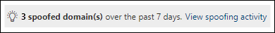

# <a name="spoof-intelligence-insight-in-eop"></a><span data-ttu-id="71504-103">EOP 中的欺骗智能见解</span><span class="sxs-lookup"><span data-stu-id="71504-103">Spoof intelligence insight in EOP</span></span>

[!INCLUDE [Microsoft 365 Defender rebranding](../includes/microsoft-defender-for-office.md)]

<span data-ttu-id="71504-104">**适用对象**</span><span class="sxs-lookup"><span data-stu-id="71504-104">**Applies to**</span></span>
- [<span data-ttu-id="71504-105">Exchange Online Protection</span><span class="sxs-lookup"><span data-stu-id="71504-105">Exchange Online Protection</span></span>](exchange-online-protection-overview.md)
- [<span data-ttu-id="71504-106">Microsoft Defender for Office 365 计划 1 和计划 2</span><span class="sxs-lookup"><span data-stu-id="71504-106">Microsoft Defender for Office 365 plan 1 and plan 2</span></span>](defender-for-office-365.md)
- [<span data-ttu-id="71504-107">Microsoft 365 Defender</span><span class="sxs-lookup"><span data-stu-id="71504-107">Microsoft 365 Defender</span></span>](../defender/microsoft-365-defender.md)

> [!NOTE]
> <span data-ttu-id="71504-108">本文中所述的功能在预览版中，可能会更改，并且并非在所有组织中都可用。</span><span class="sxs-lookup"><span data-stu-id="71504-108">The features described in this article are in Preview, are subject to change, and are not available in all organizations.</span></span> <span data-ttu-id="71504-109">如果你的组织没有本文中所述的功能，请参阅使用 EOP 中的欺骗智能策略和欺骗智能见解管理欺骗发件人中的旧版欺骗 [管理体验](walkthrough-spoof-intelligence-insight.md)。</span><span class="sxs-lookup"><span data-stu-id="71504-109">If your organization does not have the features described in this article, see the older spoof management experience at [Manage spoofed senders using the spoof intelligence policy and spoof intelligence insight in EOP](walkthrough-spoof-intelligence-insight.md).</span></span>

<span data-ttu-id="71504-110">在Microsoft 365邮箱位于 Exchange Online 或独立 Exchange Online Protection (EOP) 组织中Exchange Online，入站电子邮件将自动防止欺骗。</span><span class="sxs-lookup"><span data-stu-id="71504-110">In Microsoft 365 organizations with mailboxes in Exchange Online or standalone Exchange Online Protection (EOP) organizations without Exchange Online mailboxes, inbound email messages are automatically protected against spoofing.</span></span> <span data-ttu-id="71504-111">EOP **使用欺骗智能** 作为组织防御网络钓鱼的整体防御的一部分。</span><span class="sxs-lookup"><span data-stu-id="71504-111">EOP uses **spoof intelligence** as part of your organization's overall defense against phishing.</span></span> <span data-ttu-id="71504-112">有关详细信息，请参阅 [EOP 中的反欺骗保护](anti-spoofing-protection.md)。</span><span class="sxs-lookup"><span data-stu-id="71504-112">For more information, see [Anti-spoofing protection in EOP](anti-spoofing-protection.md).</span></span>

<span data-ttu-id="71504-113">当发件人欺骗电子邮件地址时，他们显示为组织某个域中的用户，或者是向组织发送电子邮件的外部域中的用户。</span><span class="sxs-lookup"><span data-stu-id="71504-113">When a sender spoofs an email address, they appear to be a user in one of your organization's domains, or a user in an external domain that sends email to your organization.</span></span> <span data-ttu-id="71504-114">需要阻止欺骗发件人发送垃圾邮件或钓鱼电子邮件的攻击者。</span><span class="sxs-lookup"><span data-stu-id="71504-114">Attackers who spoof senders to send spam or phishing email need to be blocked.</span></span> <span data-ttu-id="71504-115">但在某些情况下，合法发件人存在欺骗行为。</span><span class="sxs-lookup"><span data-stu-id="71504-115">But there are scenarios where legitimate senders are spoofing.</span></span> <span data-ttu-id="71504-116">例如：</span><span class="sxs-lookup"><span data-stu-id="71504-116">For example:</span></span>

- <span data-ttu-id="71504-117">欺骗内部域的合法方案：</span><span class="sxs-lookup"><span data-stu-id="71504-117">Legitimate scenarios for spoofing internal domains:</span></span>
  - <span data-ttu-id="71504-118">第三方发件人使用您的域向您自己的员工发送批量邮件，进行公司投票。</span><span class="sxs-lookup"><span data-stu-id="71504-118">Third-party senders use your domain to send bulk mail to your own employees for company polls.</span></span>
  - <span data-ttu-id="71504-119">外部公司代表你生成并发送广告或产品更新。</span><span class="sxs-lookup"><span data-stu-id="71504-119">An external company generates and sends advertising or product updates on your behalf.</span></span>
  - <span data-ttu-id="71504-120">助理需要定期为组织内部的另一个人发送电子邮件。</span><span class="sxs-lookup"><span data-stu-id="71504-120">An assistant regularly needs to send email for another person within your organization.</span></span>
  - <span data-ttu-id="71504-121">内部应用程序发送电子邮件通知。</span><span class="sxs-lookup"><span data-stu-id="71504-121">An internal application sends email notifications.</span></span>

- <span data-ttu-id="71504-122">欺骗外部域的合法方案：</span><span class="sxs-lookup"><span data-stu-id="71504-122">Legitimate scenarios for spoofing external domains:</span></span>
  - <span data-ttu-id="71504-123">发件人位于一个邮件列表 (也称为讨论列表) ，邮件列表将原始发件人的电子邮件中继到邮件列表上的所有参与者。</span><span class="sxs-lookup"><span data-stu-id="71504-123">The sender is on a mailing list (also known as a discussion list), and the mailing list relays email from the original sender to all the participants on the mailing list.</span></span>
  - <span data-ttu-id="71504-124">外部公司代表另一家公司发送电子邮件 (例如自动报告或软件即服务公司) 。</span><span class="sxs-lookup"><span data-stu-id="71504-124">An external company sends email on behalf of another company (for example, an automated report or a software-as-a-service company).</span></span>

<span data-ttu-id="71504-125">您可以使用 Microsoft 365 Defender门户中的欺骗智能见解，从未通过 SPF、DKIM 或 DMARC 检查) 的域中快速识别合法向您发送未经身份验证的电子邮件 (邮件的欺骗性发件人，并手动允许这些发件人。</span><span class="sxs-lookup"><span data-stu-id="71504-125">You can use the **spoof intelligence insight** in the Microsoft 365 Defender portal to quickly identify spoofed senders who are legitimately sending you unauthenticated email (messages from domains that don't pass SPF, DKIM, or DMARC checks), and manually allow those senders.</span></span>

<span data-ttu-id="71504-126">通过允许已知发件人从已知位置发送欺骗邮件，你可以减少误报 (标记为错误) 。</span><span class="sxs-lookup"><span data-stu-id="71504-126">By allowing known senders to send spoofed messages from known locations, you can reduce false positives (good email marked as bad).</span></span> <span data-ttu-id="71504-127">通过监视允许的欺骗发件人，你可以提供额外的安全层，以防止不安全的邮件到达你的组织。</span><span class="sxs-lookup"><span data-stu-id="71504-127">By monitoring the allowed spoofed senders, you provide an additional layer of security to prevent unsafe messages from arriving in your organization.</span></span>

<span data-ttu-id="71504-128">同样，你可以查看欺骗智能允许的欺骗性发件人，并手动阻止这些发件人获得欺骗智能见解。</span><span class="sxs-lookup"><span data-stu-id="71504-128">Likewise, you can review spoofed senders that were allowed by spoof intelligence and manually block those senders from the spoof intelligence insight.</span></span>

<span data-ttu-id="71504-129">本文的其余部分介绍如何在 Microsoft 365 Defender 门户和 PowerShell (Exchange Online PowerShell 中为 Microsoft 365 组织使用欺骗智能见解，Exchange Online;适用于没有邮箱或邮箱Exchange Online的独立 EOP PowerShell) 。</span><span class="sxs-lookup"><span data-stu-id="71504-129">The rest of this article explains how to use the spoof intelligence insight in the Microsoft 365 Defender portal and in PowerShell (Exchange Online PowerShell for Microsoft 365 organizations with mailboxes in Exchange Online; standalone EOP PowerShell for organizations without Exchange Online mailboxes).</span></span>

> [!NOTE]
>
> - <span data-ttu-id="71504-130">欺骗智能见解中只显示欺骗智能检测到的欺骗发件人。</span><span class="sxs-lookup"><span data-stu-id="71504-130">Only spoofed senders that were detected by spoof intelligence appear in the spoof intelligence insight.</span></span> <span data-ttu-id="71504-131">当你替代见解中的允许或阻止裁定时，欺骗发件人将成为一个手动允许或阻止条目，该条目仅出现在租户允许/阻止列表中的"欺骗"选项卡上。</span><span class="sxs-lookup"><span data-stu-id="71504-131">When you override the allow or block verdict in the insight, the spoofed sender becomes a manual allow or block entry that appears only on the **Spoof** tab in the Tenant Allow/Block List.</span></span> <span data-ttu-id="71504-132">还可以在欺骗智能检测到欺骗发件人之前，手动为这些发件人创建允许或阻止条目。</span><span class="sxs-lookup"><span data-stu-id="71504-132">You can also manually create allow or block entries for spoofed senders before they're detected by spoof intelligence.</span></span> <span data-ttu-id="71504-133">有关详细信息，请参阅[管理 EOP 中的租户允许/阻止列表](tenant-allow-block-list.md)。</span><span class="sxs-lookup"><span data-stu-id="71504-133">For more information, see [Manage the Tenant Allow/Block List in EOP](tenant-allow-block-list.md).</span></span>
>
> - <span data-ttu-id="71504-134">租户允许/阻止列表中的欺骗智能见解和"欺骗"选项卡取代了安全与合规中心的反垃圾邮件策略页面上提供的欺骗智能&功能。</span><span class="sxs-lookup"><span data-stu-id="71504-134">The spoof intelligence insight and the **Spoof** tab in the Tenant Allow/Block list replace the functionality of the spoof intelligence policy that was available on the anti-spam policy page in the Security & Compliance Center.</span></span>
>
>- <span data-ttu-id="71504-135">欺骗智能见解显示 7 天的数据。</span><span class="sxs-lookup"><span data-stu-id="71504-135">The spoof intelligence insight shows 7 days worth of data.</span></span> <span data-ttu-id="71504-136">**Get-SpoofIntelligenceInsight** cmdlet 显示 30 天的数据。</span><span class="sxs-lookup"><span data-stu-id="71504-136">The **Get-SpoofIntelligenceInsight** cmdlet shows 30 days worth of data.</span></span>

## <a name="what-do-you-need-to-know-before-you-begin"></a><span data-ttu-id="71504-137">开始前，有必要了解什么？</span><span class="sxs-lookup"><span data-stu-id="71504-137">What do you need to know before you begin?</span></span>

- <span data-ttu-id="71504-138">访问 <https://security.microsoft.com/> 打开 Microsoft 365 Defender 门户。</span><span class="sxs-lookup"><span data-stu-id="71504-138">You open the Microsoft 365 Defender portal at <https://security.microsoft.com/>.</span></span> <span data-ttu-id="71504-139">若要直接转到" **防钓鱼"页面** ，请使用 <https://security.microsoft.com/antiphishing> 。</span><span class="sxs-lookup"><span data-stu-id="71504-139">To go directly to the **Anti-phishing** page, use <https://security.microsoft.com/antiphishing>.</span></span> <span data-ttu-id="71504-140">若要直接转到欺骗 **智能见解** 页面，请使用 <https://security.microsoft.com/spoofintelligence> 。</span><span class="sxs-lookup"><span data-stu-id="71504-140">To go directly to the **Spoof intelligence insight** page, use <https://security.microsoft.com/spoofintelligence>.</span></span>

- <span data-ttu-id="71504-141">若要连接到 Exchange Online PowerShell，请参阅[连接到 Exchange Online PowerShell](/powershell/exchange/connect-to-exchange-online-powershell)。</span><span class="sxs-lookup"><span data-stu-id="71504-141">To connect to Exchange Online PowerShell, see [Connect to Exchange Online PowerShell](/powershell/exchange/connect-to-exchange-online-powershell).</span></span> <span data-ttu-id="71504-142">若要连接到独立 EOP PowerShell，请参阅[连接到 Exchange Online Protection PowerShell](/powershell/exchange/connect-to-exchange-online-protection-powershell)。</span><span class="sxs-lookup"><span data-stu-id="71504-142">To connect to standalone EOP PowerShell, see [Connect to Exchange Online Protection PowerShell](/powershell/exchange/connect-to-exchange-online-protection-powershell).</span></span>

- <span data-ttu-id="71504-143">在 Exchange Online 网站中 **分配** 权限，才能执行本文中的步骤：</span><span class="sxs-lookup"><span data-stu-id="71504-143">You need to be assigned permissions in **Exchange Online** before you can do the procedures in this article:</span></span>
  - <span data-ttu-id="71504-144">若要修改欺骗智能策略或启用或禁用欺骗智能，你需要是组织管理或安全 **管理员\*\*\*\*角色组** 的成员。</span><span class="sxs-lookup"><span data-stu-id="71504-144">To modify the spoof intelligence policy or enable or disable spoof intelligence, you need to be a member of the **Organization Management** or **Security Administrator** role groups.</span></span>
  - <span data-ttu-id="71504-145">若要对欺骗智能策略进行只读访问，你需要是全局读者或安全 **读者角色组** 的成员。 </span><span class="sxs-lookup"><span data-stu-id="71504-145">For read-only access to the spoof intelligence policy, you need to be a member of the **Global Reader** or **Security Reader** role groups.</span></span>

  <span data-ttu-id="71504-146">有关详细信息，请参阅 [Exchange Online 中权限](/exchange/permissions-exo/permissions-exo)。</span><span class="sxs-lookup"><span data-stu-id="71504-146">For more information, see [Permissions in Exchange Online](/exchange/permissions-exo/permissions-exo).</span></span>

  > [!NOTE]
  > - <span data-ttu-id="71504-147">在 Microsoft 365 管理中心将用户添加到相应的 Azure Active Directory 角色后，将为用户提供所需的权限 _和_ Microsoft 365 中其他功能的所需权限。</span><span class="sxs-lookup"><span data-stu-id="71504-147">Adding users to the corresponding Azure Active Directory role in the Microsoft 365 admin center gives users the required permissions _and_ permissions for other features in Microsoft 365.</span></span> <span data-ttu-id="71504-148">有关详细信息，请参阅 [关于管理员角色](../../admin/add-users/about-admin-roles.md)。</span><span class="sxs-lookup"><span data-stu-id="71504-148">For more information, see [About admin roles](../../admin/add-users/about-admin-roles.md).</span></span>
  > - <span data-ttu-id="71504-149">[Exchange Online](/Exchange/permissions-exo/permissions-exo#role-groups) 中的 **仅查看组织管理人员** 角色组也提供到该功能的只读访问。</span><span class="sxs-lookup"><span data-stu-id="71504-149">The **View-Only Organization Management** role group in [Exchange Online](/Exchange/permissions-exo/permissions-exo#role-groups) also gives read-only access to the feature.</span></span>

- <span data-ttu-id="71504-150">在 EOP 和 Microsoft Defender for Office 365 中启用和禁用反网络钓鱼策略中的欺骗Office 365。</span><span class="sxs-lookup"><span data-stu-id="71504-150">You enable and disable spoof intelligence in anti-phishing policies in EOP and Microsoft Defender for Office 365.</span></span> <span data-ttu-id="71504-151">默认情况下启用欺骗智能。</span><span class="sxs-lookup"><span data-stu-id="71504-151">Spoof intelligence is enabled by default.</span></span> <span data-ttu-id="71504-152">有关详细信息，请参阅在[EOP](configure-anti-phishing-policies-eop.md)中配置防钓鱼策略或在 Microsoft Defender 中配置防钓鱼策略[Office 365。](configure-mdo-anti-phishing-policies.md)</span><span class="sxs-lookup"><span data-stu-id="71504-152">For more information, see [Configure anti-phishing policies in EOP](configure-anti-phishing-policies-eop.md) or [Configure anti-phishing policies in Microsoft Defender for Office 365](configure-mdo-anti-phishing-policies.md).</span></span>

- <span data-ttu-id="71504-153">有关建议的欺骗智能设置，请参阅 [EOP 防钓鱼策略设置](recommended-settings-for-eop-and-office365-atp.md#eop-anti-phishing-policy-settings)。</span><span class="sxs-lookup"><span data-stu-id="71504-153">For our recommended settings for spoof intelligence, see [EOP anti-phishing policy settings](recommended-settings-for-eop-and-office365-atp.md#eop-anti-phishing-policy-settings).</span></span>

## <a name="open-the-spoof-intelligence-insight-in-the-microsoft-365-defender-portal"></a><span data-ttu-id="71504-154">在企业门户中打开Microsoft 365 Defender见解</span><span class="sxs-lookup"><span data-stu-id="71504-154">Open the spoof intelligence insight in the Microsoft 365 Defender portal</span></span>

1. <span data-ttu-id="71504-155">In the Microsoft 365 Defender portal， go to **Email & Collaboration** Policies & \> **Rules** \> **Threat policies** page Tenant \> **Allow/Block Lists**.</span><span class="sxs-lookup"><span data-stu-id="71504-155">In the Microsoft 365 Defender portal, go to **Email & Collaboration** \> **Policies & Rules** \> **Threat policies** page \> **Tenant Allow/Block Lists**.</span></span>

2. <span data-ttu-id="71504-156">在" **租户允许/阻止列表"** 页上，欺骗智能见解如下所示：</span><span class="sxs-lookup"><span data-stu-id="71504-156">On the **Tenant Allow/Block Lists** page, the spoof intelligence insight looks like this:</span></span>

   

   <span data-ttu-id="71504-158">见解有两种模式：</span><span class="sxs-lookup"><span data-stu-id="71504-158">The insight has two modes:</span></span>

   - <span data-ttu-id="71504-159">**见解模式**：如果启用了欺骗智能，该见解将展示过去七天内欺骗智能检测到的邮件数。</span><span class="sxs-lookup"><span data-stu-id="71504-159">**Insight mode**: If spoof intelligence is enabled, the insight shows you how many messages were detected by spoof intelligence during the past seven days.</span></span>
   - <span data-ttu-id="71504-160">**如果模式 ：** 如果禁用欺骗智能，则见解将显示过去七天内欺骗智能检测到的邮件数。</span><span class="sxs-lookup"><span data-stu-id="71504-160">**What if mode**: If spoof intelligence is disabled, then the insight shows you how many messages *would* have been detected by spoof intelligence during the past seven days.</span></span>

<span data-ttu-id="71504-161">若要查看有关欺骗智能检测的信息，请单击" **查看** 欺骗智能见解中的欺骗活动"。</span><span class="sxs-lookup"><span data-stu-id="71504-161">To view information about the spoof intelligence detections, click **View spoofing activity** in the spoof intelligence insight.</span></span>

### <a name="view-information-about-spoofed-messages"></a><span data-ttu-id="71504-162">查看有关欺骗邮件的信息</span><span class="sxs-lookup"><span data-stu-id="71504-162">View information about spoofed messages</span></span>

> [!NOTE]
> <span data-ttu-id="71504-163">请记住，只有欺骗智能检测到的欺骗性发件人会出现在此页面上。</span><span class="sxs-lookup"><span data-stu-id="71504-163">Remember, only spoofed senders that were detected by spoof intelligence appear on this page.</span></span> <span data-ttu-id="71504-164">当你替代见解中的允许或阻止裁定时，欺骗发件人将成为一个手动允许或阻止条目，该条目仅出现在租户允许/阻止列表中的"欺骗"选项卡上。</span><span class="sxs-lookup"><span data-stu-id="71504-164">When you override the allow or block verdict in the insight, the spoofed sender becomes a manual allow or block entry that appears only on the **Spoof** tab in the Tenant Allow/Block List.</span></span>

<span data-ttu-id="71504-165">在单击 **在** 欺骗智能见解中查看欺骗活动后出现的"欺骗智能见解"页面上，该页面包含以下信息：</span><span class="sxs-lookup"><span data-stu-id="71504-165">On the **Spoof intelligence insight** page that appears after you click **View spoofing activity** in the spoof intelligence insight, the page contains the following information:</span></span>

- <span data-ttu-id="71504-166">**欺骗用户\*\*\*\*：电子邮件** 客户端的"来源"框中显示的欺骗用户的域。 </span><span class="sxs-lookup"><span data-stu-id="71504-166">**Spoofed user**: The **domain** of the spoofed user that's displayed in the **From** box in email clients.</span></span> <span data-ttu-id="71504-167">"From"地址也称为 `5322.From` "地址"。</span><span class="sxs-lookup"><span data-stu-id="71504-167">The From address is also known as the `5322.From` address.</span></span>
- <span data-ttu-id="71504-168">**发送基础结构**：也称为 _基础结构_。</span><span class="sxs-lookup"><span data-stu-id="71504-168">**Sending infrastructure**: Also known as the _infrastructure_.</span></span> <span data-ttu-id="71504-169">发送基础结构将为以下值之一：</span><span class="sxs-lookup"><span data-stu-id="71504-169">The sending infrastructure will be one of the following values:</span></span>
  - <span data-ttu-id="71504-170">反向 DNS 查找中的域 (源) IP 地址的 PTR 记录。</span><span class="sxs-lookup"><span data-stu-id="71504-170">The domain found in a reverse DNS lookup (PTR record) of the source email server's IP address.</span></span>
  - <span data-ttu-id="71504-171">如果源 IP 地址没有 PTR 记录，则发送基础结构标识为 \<source IP\> /24 (例如，192.168.100.100/24) 。</span><span class="sxs-lookup"><span data-stu-id="71504-171">If the source IP address has no PTR record, then the sending infrastructure is identified as \<source IP\>/24 (for example, 192.168.100.100/24).</span></span>
- <span data-ttu-id="71504-172">**邮件计数**：过去 7 天内从欺骗域和发送基础结构组合发送到组织的邮件数量。</span><span class="sxs-lookup"><span data-stu-id="71504-172">**Message count**: The number of messages from the combination of the spoofed domain _and_ the sending infrastructure to your organization within the last 7 days.</span></span>
- <span data-ttu-id="71504-173">**上次看到** 时间：从包含欺骗域的发送基础结构接收邮件的最后日期。</span><span class="sxs-lookup"><span data-stu-id="71504-173">**Last seen**: The last date when a message was received from the sending infrastructure that contains the spoofed domain.</span></span>
- <span data-ttu-id="71504-174">**欺骗类型**：下列值之一：</span><span class="sxs-lookup"><span data-stu-id="71504-174">**Spoof type**: One of the following values:</span></span>
  - <span data-ttu-id="71504-175">**内部**：欺骗性发件人位于组织所属的域中， ([接受的) 。](/exchange/mail-flow-best-practices/manage-accepted-domains/manage-accepted-domains)</span><span class="sxs-lookup"><span data-stu-id="71504-175">**Internal**: The spoofed sender is in a domain that belongs to your organization (an [accepted domain](/exchange/mail-flow-best-practices/manage-accepted-domains/manage-accepted-domains)).</span></span>
  - <span data-ttu-id="71504-176">**外部**：欺骗性发件人位于外部域中。</span><span class="sxs-lookup"><span data-stu-id="71504-176">**External**: The spoofed sender is in an external domain.</span></span>
- <span data-ttu-id="71504-177">**操作**：此值为 **"允许"** 或 **"已阻止"：**</span><span class="sxs-lookup"><span data-stu-id="71504-177">**Action**: This value is **Allowed** or **Blocked**:</span></span>
  - <span data-ttu-id="71504-178">**允许**：域未通过显式电子邮件身份验证检查 [SPF、DKIM](how-office-365-uses-spf-to-prevent-spoofing.md)和 [DMARC](use-dmarc-to-validate-email.md)) 。 [](use-dkim-to-validate-outbound-email.md)</span><span class="sxs-lookup"><span data-stu-id="71504-178">**Allowed**: The domain failed explicit email authentication checks [SPF](how-office-365-uses-spf-to-prevent-spoofing.md), [DKIM](use-dkim-to-validate-outbound-email.md), and [DMARC](use-dmarc-to-validate-email.md)).</span></span> <span data-ttu-id="71504-179">但是，域已通过隐式电子邮件身份验证检查， ([身份验证) 。](email-validation-and-authentication.md#composite-authentication)</span><span class="sxs-lookup"><span data-stu-id="71504-179">However, the domain passed our implicit email authentication checks ([composite authentication](email-validation-and-authentication.md#composite-authentication)).</span></span> <span data-ttu-id="71504-180">因此，未对邮件执行反欺骗操作。</span><span class="sxs-lookup"><span data-stu-id="71504-180">As a result, no anti-spoofing action was taken on the message.</span></span>
  - <span data-ttu-id="71504-181">**已阻止**：来自欺骗域和发送基础结构组合的邮件被欺骗智能标记为错误。</span><span class="sxs-lookup"><span data-stu-id="71504-181">**Blocked**: Messages from the combination of the spoofed domain _and_ sending infrastructure are marked as bad by spoof intelligence.</span></span> <span data-ttu-id="71504-182">对欺骗邮件采取的操作由默认反网络钓鱼策略或自定义防钓鱼策略控制 (默认值为"将邮件移动到垃圾邮件文件夹") 。 </span><span class="sxs-lookup"><span data-stu-id="71504-182">The action that's taken on the spoofed messages is controlled by the default anti-phishing policy or custom anti-phishing policies (the default value is **Move message to Junk Email folder**).</span></span> <span data-ttu-id="71504-183">有关详细信息，请参阅 Configure [anti-phishing policies in Microsoft Defender for Office 365](configure-mdo-anti-phishing-policies.md)。</span><span class="sxs-lookup"><span data-stu-id="71504-183">For more information, see [Configure anti-phishing policies in Microsoft Defender for Office 365](configure-mdo-anti-phishing-policies.md).</span></span>

<span data-ttu-id="71504-184">您可以单击所选列标题对结果进行排序。</span><span class="sxs-lookup"><span data-stu-id="71504-184">You can click selected column headings to sort the results.</span></span>

<span data-ttu-id="71504-185">若要筛选结果，可以使用以下选项：</span><span class="sxs-lookup"><span data-stu-id="71504-185">To filter the results, you have the following options:</span></span>

- <span data-ttu-id="71504-186">单击" **筛选器"** 按钮。</span><span class="sxs-lookup"><span data-stu-id="71504-186">Click the **Filter** button.</span></span> <span data-ttu-id="71504-187">在 **出现的"** 筛选器"飞出中，可以按以下方式筛选结果：</span><span class="sxs-lookup"><span data-stu-id="71504-187">In the **Filter** flyout that appears, you can filter the results by:</span></span>
  - <span data-ttu-id="71504-188">**欺骗类型**</span><span class="sxs-lookup"><span data-stu-id="71504-188">**Spoof type**</span></span>
  - <span data-ttu-id="71504-189">**Action**</span><span class="sxs-lookup"><span data-stu-id="71504-189">**Action**</span></span>
- <span data-ttu-id="71504-190">使用 **"搜索** "框输入以逗号分隔的欺骗域值列表或发送基础结构值以筛选结果。</span><span class="sxs-lookup"><span data-stu-id="71504-190">Use the **Search** box to enter a comma-separated list of spoofed domain values or sending infrastructure values to filter the results.</span></span>

### <a name="view-details-about-spoofed-messages"></a><span data-ttu-id="71504-191">查看有关欺骗邮件的详细信息</span><span class="sxs-lookup"><span data-stu-id="71504-191">View details about spoofed messages</span></span>

<span data-ttu-id="71504-192">当你从列表中选择条目时，将显示一个包含以下信息和功能的详细信息飞出图：</span><span class="sxs-lookup"><span data-stu-id="71504-192">When you select an entry from the list, a details flyout appears that contains the following information and features:</span></span>

- <span data-ttu-id="71504-193">允许欺骗或阻止欺骗：选择这些值之一以替代原始欺骗智能裁定，将条目从欺骗智能见解移动到租户允许/阻止列表作为欺骗允许或阻止条目。</span><span class="sxs-lookup"><span data-stu-id="71504-193">**Allow to spoof** or **Block from spoofing**: Select one of these values to override the original spoof intelligence verdict and move the entry from the spoof intelligence insight to the Tenant Allow/Block List as an allow or block entry for spoof.</span></span>
- <span data-ttu-id="71504-194">我们为什么捕获到此。</span><span class="sxs-lookup"><span data-stu-id="71504-194">Why we caught this.</span></span>
- <span data-ttu-id="71504-195">需要执行哪些工作。</span><span class="sxs-lookup"><span data-stu-id="71504-195">What you need to do.</span></span>
- <span data-ttu-id="71504-196">包含主要欺骗智能页面中大部分相同信息的域摘要。</span><span class="sxs-lookup"><span data-stu-id="71504-196">A domain summary that includes most of the same information from the main spoof intelligence page.</span></span>
- <span data-ttu-id="71504-197">WhoIs 有关发件人的数据。</span><span class="sxs-lookup"><span data-stu-id="71504-197">WhoIs data about the sender.</span></span>
- <span data-ttu-id="71504-198">一个链接，用于打开[威胁](threat-explorer.md)资源管理器以查看有关 Microsoft Defender for (的发件人的其他Office 365) 。</span><span class="sxs-lookup"><span data-stu-id="71504-198">A link to open [Threat Explorer](threat-explorer.md) to see additional details about the sender (Microsoft Defender for Office 365).</span></span>
- <span data-ttu-id="71504-199">我们在租户中看到的来自同一发件人的类似邮件。</span><span class="sxs-lookup"><span data-stu-id="71504-199">Similar messages we have seen in your tenant from the same sender.</span></span>

### <a name="about-allowed-spoofed-senders"></a><span data-ttu-id="71504-200">关于允许的欺骗发件人</span><span class="sxs-lookup"><span data-stu-id="71504-200">About allowed spoofed senders</span></span>

<span data-ttu-id="71504-201">手动更改为"允许欺骗"的欺骗智能见解中允许的欺骗发件人或阻止的欺骗发件人仅允许来自欺骗域和发送基础结构组合的邮件。 </span><span class="sxs-lookup"><span data-stu-id="71504-201">An allowed spoofed sender in the spoof intelligence insight or a blocked spoofed sender that you manually changed to **Allow to spoof** only allows messages from the combination of the spoofed domain *and* the sending infrastructure.</span></span> <span data-ttu-id="71504-202">它不允许来自任何来源的欺骗性域的电子邮件，也不允许来自任何域的发送基础结构的电子邮件。</span><span class="sxs-lookup"><span data-stu-id="71504-202">It does not allow email from the spoofed domain from any source, nor does it allow email from the sending infrastructure for any domain.</span></span>

<span data-ttu-id="71504-203">例如，允许以下欺骗性发件人欺骗：</span><span class="sxs-lookup"><span data-stu-id="71504-203">For example, the following spoofed sender is allowed to spoof:</span></span>

- <span data-ttu-id="71504-204">**域**： gmail.com</span><span class="sxs-lookup"><span data-stu-id="71504-204">**Domain**: gmail.com</span></span>
- <span data-ttu-id="71504-205">**基础结构**：tms.mx.com</span><span class="sxs-lookup"><span data-stu-id="71504-205">**Infrastructure**: tms.mx.com</span></span>

<span data-ttu-id="71504-206">仅允许来自该域/发送基础结构对的电子邮件欺骗。</span><span class="sxs-lookup"><span data-stu-id="71504-206">Only email from that domain/sending infrastructure pair will be allowed to spoof.</span></span> <span data-ttu-id="71504-207">不会自动允许其他发件人 gmail.com 欺骗邮件。</span><span class="sxs-lookup"><span data-stu-id="71504-207">Other senders attempting to spoof gmail.com aren't automatically allowed.</span></span> <span data-ttu-id="71504-208">来自其他域中发件人的邮件 tms.mx.com 欺骗智能仍在检查，并且可能会阻止。</span><span class="sxs-lookup"><span data-stu-id="71504-208">Messages from senders in other domains that originate from tms.mx.com are still checked by spoof intelligence, and might be blocked.</span></span>

## <a name="use-the-spoof-intelligence-insight-in-exchange-online-powershell-or-standalone-eop-powershell"></a><span data-ttu-id="71504-209">在 PowerShell 或独立 EOP PowerShell Exchange Online欺骗智能见解</span><span class="sxs-lookup"><span data-stu-id="71504-209">Use the spoof intelligence insight in Exchange Online PowerShell or standalone EOP PowerShell</span></span>

<span data-ttu-id="71504-210">在 PowerShell 中，使用 **Get-SpoofIntelligenceInsight** cmdlet 查看欺骗智能检测到的允许和阻止的欺骗发件人。 </span><span class="sxs-lookup"><span data-stu-id="71504-210">In PowerShell, you use the **Get-SpoofIntelligenceInsight** cmdlet to **view** allowed and blocked spoofed senders that were detected by spoof intelligence.</span></span> <span data-ttu-id="71504-211">若要手动允许或阻止欺骗的发件人，你需要使用 **New-TenantAllowBlockListSpoofItems** cmdlet。</span><span class="sxs-lookup"><span data-stu-id="71504-211">To manually allow or block the spoofed senders, you need to use the **New-TenantAllowBlockListSpoofItems** cmdlet.</span></span> <span data-ttu-id="71504-212">有关详细信息，请参阅使用 [PowerShell 配置租户允许/阻止列表](tenant-allow-block-list.md#use-exchange-online-powershell-or-standalone-eop-powershell-to-configure-the-tenant-allowblock-list)。</span><span class="sxs-lookup"><span data-stu-id="71504-212">For more information, see [Use PowerShell to configure the Tenant Allow/Block List](tenant-allow-block-list.md#use-exchange-online-powershell-or-standalone-eop-powershell-to-configure-the-tenant-allowblock-list).</span></span>

<span data-ttu-id="71504-213">若要查看欺骗智能见解中的信息，请运行以下命令：</span><span class="sxs-lookup"><span data-stu-id="71504-213">To view the information in the spoof intelligence insight, run the following command:</span></span>

```powershell
Get-SpoofIntelligenceInsight
```

<span data-ttu-id="71504-214">有关语法和参数的详细信息，请参阅 [Get-SpoofIntelligenceInsight](/powershell/module/exchange/get-spoofintelligenceinsight)。</span><span class="sxs-lookup"><span data-stu-id="71504-214">For detailed syntax and parameter information, see [Get-SpoofIntelligenceInsight](/powershell/module/exchange/get-spoofintelligenceinsight).</span></span>

## <a name="other-ways-to-manage-spoofing-and-phishing"></a><span data-ttu-id="71504-215">管理欺骗和网络钓鱼的其他方法</span><span class="sxs-lookup"><span data-stu-id="71504-215">Other ways to manage spoofing and phishing</span></span>

<span data-ttu-id="71504-216">对于欺骗和网络钓鱼防护，要多下努力。</span><span class="sxs-lookup"><span data-stu-id="71504-216">Be diligent about spoofing and phishing protection.</span></span> <span data-ttu-id="71504-217">以下相关方法可检查欺骗你的域的发件人，并有助于防止他们破坏你的组织：</span><span class="sxs-lookup"><span data-stu-id="71504-217">Here are related ways to check on senders who are spoofing your domain and help prevent them from damaging your organization:</span></span>

- <span data-ttu-id="71504-218">检查 **欺骗邮件报告**。</span><span class="sxs-lookup"><span data-stu-id="71504-218">Check the **Spoof Mail Report**.</span></span> <span data-ttu-id="71504-219">你可以经常使用此报告来查看并帮助管理欺骗性发件人。</span><span class="sxs-lookup"><span data-stu-id="71504-219">You can use this report often to view and help manage spoofed senders.</span></span> <span data-ttu-id="71504-220">有关信息，请参阅 [欺骗检测报告](view-email-security-reports.md#spoof-detections-report)。</span><span class="sxs-lookup"><span data-stu-id="71504-220">For information, see [Spoof Detections report](view-email-security-reports.md#spoof-detections-report).</span></span>

- <span data-ttu-id="71504-221">查看你的发件人策略框架 (SPF) 配置。</span><span class="sxs-lookup"><span data-stu-id="71504-221">Review your Sender Policy Framework (SPF) configuration.</span></span> <span data-ttu-id="71504-222">若要了解 SPF 的快速简介及其快速配置方法，请参阅[在 Microsoft 365 中设置 SPF 以防欺骗](set-up-spf-in-office-365-to-help-prevent-spoofing.md)。</span><span class="sxs-lookup"><span data-stu-id="71504-222">For a quick introduction to SPF and to get it configured quickly, see [Set up SPF in Microsoft 365 to help prevent spoofing](set-up-spf-in-office-365-to-help-prevent-spoofing.md).</span></span> <span data-ttu-id="71504-223">有关 Office 365 如何使用 SPF 的更深入了解，或者有关故障排除或非标准部署（如混合部署）的信息，请开始阅读[How Office 365 uses Sender Policy Framework (SPF) to prevent spoofing](how-office-365-uses-spf-to-prevent-spoofing.md)。</span><span class="sxs-lookup"><span data-stu-id="71504-223">For a more in-depth understanding of how Office 365 uses SPF, or for troubleshooting or non-standard deployments such as hybrid deployments, start with [How Office 365 uses Sender Policy Framework (SPF) to prevent spoofing](how-office-365-uses-spf-to-prevent-spoofing.md).</span></span>

- <span data-ttu-id="71504-224">查看你的域密钥识别邮件 (DKIM) 配置。</span><span class="sxs-lookup"><span data-stu-id="71504-224">Review your DomainKeys Identified Mail (DKIM) configuration.</span></span> <span data-ttu-id="71504-225">除了 SPF 和 DMARC 之外，还应使用 DKIM 来帮助阻止攻击者发送看起来来自你的域的邮件。</span><span class="sxs-lookup"><span data-stu-id="71504-225">You should use DKIM in addition to SPF and DMARC to help prevent attackers from sending messages that look like they are coming from your domain.</span></span> <span data-ttu-id="71504-226">你可以使用 DKIM 将数字签名添加到电子邮件的邮件头中。</span><span class="sxs-lookup"><span data-stu-id="71504-226">DKIM lets you add a digital signature to email messages in the message header.</span></span> <span data-ttu-id="71504-227">有关信息，请参阅[使用 DKIM 验证从](use-dkim-to-validate-outbound-email.md)自定义域发送的出站Office 365。</span><span class="sxs-lookup"><span data-stu-id="71504-227">For information, see [Use DKIM to validate outbound email sent from your custom domain in Office 365](use-dkim-to-validate-outbound-email.md).</span></span>

- <span data-ttu-id="71504-228">查看基于域的邮件身份验证、报告和一致性 (DMARC) 配置。</span><span class="sxs-lookup"><span data-stu-id="71504-228">Review your Domain-based Message Authentication, Reporting, and Conformance (DMARC) configuration.</span></span> <span data-ttu-id="71504-229">实现使用 SPF 和 DKIM 的 DMARC 可以针对欺骗和钓鱼电子邮件提供额外的保护。</span><span class="sxs-lookup"><span data-stu-id="71504-229">Implementing DMARC with SPF and DKIM provides additional protection against spoofing and phishing email.</span></span> <span data-ttu-id="71504-230">DMARC 可帮助接收邮件系统确定如何处理从你的域发送且未通过 SPF 或 DKIM 检查的邮件。</span><span class="sxs-lookup"><span data-stu-id="71504-230">DMARC helps receiving mail systems determine what to do with messages sent from your domain that fail SPF or DKIM checks.</span></span> <span data-ttu-id="71504-231">有关信息，请参阅[使用 DMARC 验证电子邮件Office 365。](use-dmarc-to-validate-email.md)</span><span class="sxs-lookup"><span data-stu-id="71504-231">For information, see [Use DMARC to validate email in Office 365](use-dmarc-to-validate-email.md).</span></span>
