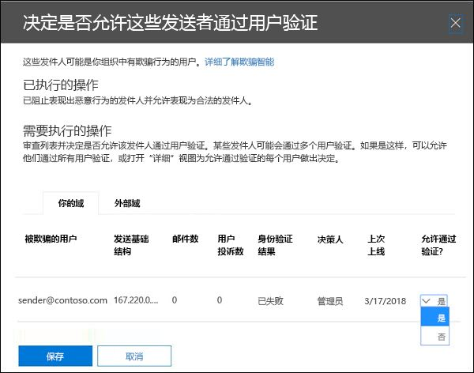

# <a name="configure-spoof-intelligence-in-eop"></a><span data-ttu-id="b1211-103">在 EOP 中配置欺骗智能</span><span class="sxs-lookup"><span data-stu-id="b1211-103">Configure spoof intelligence in EOP</span></span>

[!INCLUDE [Microsoft 365 Defender rebranding](../includes/microsoft-defender-for-office.md)]

<span data-ttu-id="b1211-104">**适用对象**</span><span class="sxs-lookup"><span data-stu-id="b1211-104">**Applies to**</span></span>
- [<span data-ttu-id="b1211-105">Exchange Online Protection</span><span class="sxs-lookup"><span data-stu-id="b1211-105">Exchange Online Protection</span></span>](exchange-online-protection-overview.md)
- [<span data-ttu-id="b1211-106">Microsoft Defender for Office 365 计划 1 和计划 2</span><span class="sxs-lookup"><span data-stu-id="b1211-106">Microsoft Defender for Office 365 plan 1 and plan 2</span></span>](defender-for-office-365.md)
- [<span data-ttu-id="b1211-107">Microsoft 365 Defender</span><span class="sxs-lookup"><span data-stu-id="b1211-107">Microsoft 365 Defender</span></span>](../defender/microsoft-365-defender.md)

<span data-ttu-id="b1211-108">在具有 Exchange Online 或独立 Exchange Online Protection (EOP) 组织邮箱且没有 Exchange Online 邮箱的 Microsoft 365 组织中，自 2018 年 10 日起，入站电子邮件将自动受到 EOP 的欺骗保护。</span><span class="sxs-lookup"><span data-stu-id="b1211-108">In Microsoft 365 organizations with mailboxes in Exchange Online or standalone Exchange Online Protection (EOP) organizations without Exchange Online mailboxes, inbound email messages are automatically protected against spoofing by EOP as of October 2018.</span></span> <span data-ttu-id="b1211-109">EOP 使用欺骗智能作为组织防御网络钓鱼的整体防御的一部分。</span><span class="sxs-lookup"><span data-stu-id="b1211-109">EOP uses spoof intelligence as part of your organization's overall defense against phishing.</span></span> <span data-ttu-id="b1211-110">有关详细信息，请参阅 [EOP 中的反欺骗保护](anti-spoofing-protection.md)。</span><span class="sxs-lookup"><span data-stu-id="b1211-110">For more information, see [Anti-spoofing protection in EOP](anti-spoofing-protection.md).</span></span>

<span data-ttu-id="b1211-111">当发件人欺骗电子邮件地址时，他们显示为组织某个域中的用户，或者是向组织发送电子邮件的外部域中的用户。</span><span class="sxs-lookup"><span data-stu-id="b1211-111">When a sender spoofs an email address, they appear to be a user in one of your organization's domains, or a user in an external domain that sends email to your organization.</span></span> <span data-ttu-id="b1211-112">需要阻止欺骗发件人发送垃圾邮件或钓鱼电子邮件的攻击者。</span><span class="sxs-lookup"><span data-stu-id="b1211-112">Attackers who spoof senders to send spam or phishing email need to be blocked.</span></span> <span data-ttu-id="b1211-113">但在某些情况下，合法发件人存在欺骗行为。</span><span class="sxs-lookup"><span data-stu-id="b1211-113">But there are scenarios where legitimate senders are spoofing.</span></span> <span data-ttu-id="b1211-114">例如：</span><span class="sxs-lookup"><span data-stu-id="b1211-114">For example:</span></span>

- <span data-ttu-id="b1211-115">欺骗内部域的合法方案：</span><span class="sxs-lookup"><span data-stu-id="b1211-115">Legitimate scenarios for spoofing internal domains:</span></span>

  - <span data-ttu-id="b1211-116">第三方发件人使用您的域向您自己的员工发送批量邮件，进行公司投票。</span><span class="sxs-lookup"><span data-stu-id="b1211-116">Third-party senders use your domain to send bulk mail to your own employees for company polls.</span></span>
  - <span data-ttu-id="b1211-117">外部公司代表你生成并发送广告或产品更新。</span><span class="sxs-lookup"><span data-stu-id="b1211-117">An external company generates and sends advertising or product updates on your behalf.</span></span>
  - <span data-ttu-id="b1211-118">助理需要定期为组织内部的另一个人发送电子邮件。</span><span class="sxs-lookup"><span data-stu-id="b1211-118">An assistant regularly needs to send email for another person within your organization.</span></span>
  - <span data-ttu-id="b1211-119">内部应用程序发送电子邮件通知。</span><span class="sxs-lookup"><span data-stu-id="b1211-119">An internal application sends email notifications.</span></span>

- <span data-ttu-id="b1211-120">欺骗外部域的合法方案：</span><span class="sxs-lookup"><span data-stu-id="b1211-120">Legitimate scenarios for spoofing external domains:</span></span>

  - <span data-ttu-id="b1211-121">发件人位于一个邮件列表 (也称为讨论列表) ，邮件列表将原始发件人的电子邮件中继到邮件列表上的所有参与者。</span><span class="sxs-lookup"><span data-stu-id="b1211-121">The sender is on a mailing list (also known as a discussion list), and the mailing list relays email from the original sender to all the participants on the mailing list.</span></span>
  - <span data-ttu-id="b1211-122">外部公司代表另一家公司发送电子邮件 (例如自动报告或软件即服务公司) 。</span><span class="sxs-lookup"><span data-stu-id="b1211-122">An external company sends email on behalf of another company (for example, an automated report or a software-as-a-service company).</span></span>

<span data-ttu-id="b1211-123">欺骗智能（尤其是默认的 (和仅) 欺骗智能策略）有助于确保合法发件人发送的欺骗电子邮件不会在 EOP 垃圾邮件筛选器或外部电子邮件系统中被发现，同时保护用户免受垃圾邮件或网络钓鱼攻击。</span><span class="sxs-lookup"><span data-stu-id="b1211-123">Spoof intelligence, and specifically the default (and only) spoof intelligence policy, helps ensure that the spoofed email sent by legitimate senders doesn't get caught up in EOP spam filters or external email systems, while protecting your users from spam or phishing attacks.</span></span>

<span data-ttu-id="b1211-124">可以在安全与合规中心内或在 PowerShell & PowerShell 中管理欺骗智能， (Exchange Online PowerShell 中Microsoft 365邮箱位于 Exchange Online;适用于没有邮箱或邮箱Exchange Online的独立 EOP PowerShell) 。</span><span class="sxs-lookup"><span data-stu-id="b1211-124">You can manage spoof intelligence in the Security & Compliance Center, or in PowerShell (Exchange Online PowerShell for Microsoft 365 organizations with mailboxes in Exchange Online; standalone EOP PowerShell for organizations without Exchange Online mailboxes).</span></span>

## <a name="what-do-you-need-to-know-before-you-begin"></a><span data-ttu-id="b1211-125">开始前，有必要了解什么？</span><span class="sxs-lookup"><span data-stu-id="b1211-125">What do you need to know before you begin?</span></span>

- <span data-ttu-id="b1211-126">安全与合规中心的打开网址为 <https://protection.office.com/>。</span><span class="sxs-lookup"><span data-stu-id="b1211-126">You open the Security & Compliance Center at <https://protection.office.com/>.</span></span> <span data-ttu-id="b1211-127">若要直接转到 **“反垃圾邮件设置”** 页，请访问 <https://protection.office.com/antispam>。</span><span class="sxs-lookup"><span data-stu-id="b1211-127">To go directly to the **Anti-spam settings** page, use <https://protection.office.com/antispam>.</span></span> <span data-ttu-id="b1211-128">若要直接转到" **防钓鱼"页面** ，请使用 <https://protection.office.com/antiphishing> 。</span><span class="sxs-lookup"><span data-stu-id="b1211-128">To go directly to the **Anti-phishing** page, use <https://protection.office.com/antiphishing>.</span></span>

- <span data-ttu-id="b1211-129">若要连接到 Exchange Online PowerShell，请参阅[连接到 Exchange Online PowerShell](/powershell/exchange/connect-to-exchange-online-powershell)。</span><span class="sxs-lookup"><span data-stu-id="b1211-129">To connect to Exchange Online PowerShell, see [Connect to Exchange Online PowerShell](/powershell/exchange/connect-to-exchange-online-powershell).</span></span> <span data-ttu-id="b1211-130">若要连接到独立 EOP PowerShell，请参阅[连接到 Exchange Online Protection PowerShell](/powershell/exchange/connect-to-exchange-online-protection-powershell)。</span><span class="sxs-lookup"><span data-stu-id="b1211-130">To connect to standalone EOP PowerShell, see [Connect to Exchange Online Protection PowerShell](/powershell/exchange/connect-to-exchange-online-protection-powershell).</span></span>

- <span data-ttu-id="b1211-131">在 Exchange Online 网站中 **分配** 权限，才能执行本文中的步骤：</span><span class="sxs-lookup"><span data-stu-id="b1211-131">You need to be assigned permissions in **Exchange Online** before you can do the procedures in this article:</span></span>
  - <span data-ttu-id="b1211-132">若要修改欺骗智能策略或启用或禁用欺骗智能，你需要是组织管理或安全 **管理员\*\*\*\*角色组** 的成员。</span><span class="sxs-lookup"><span data-stu-id="b1211-132">To modify the spoof intelligence policy or enable or disable spoof intelligence, you need to be a member of the **Organization Management** or **Security Administrator** role groups.</span></span>
  - <span data-ttu-id="b1211-133">若要对欺骗智能策略进行只读访问，你需要是全局读者或安全 **读者角色组** 的成员。 </span><span class="sxs-lookup"><span data-stu-id="b1211-133">For read-only access to the spoof intelligence policy, you need to be a member of the **Global Reader** or **Security Reader** role groups.</span></span>

  <span data-ttu-id="b1211-134">有关详细信息，请参阅 [Exchange Online 中权限](/exchange/permissions-exo/permissions-exo)。</span><span class="sxs-lookup"><span data-stu-id="b1211-134">For more information, see [Permissions in Exchange Online](/exchange/permissions-exo/permissions-exo).</span></span>

  <span data-ttu-id="b1211-135">**注意**：</span><span class="sxs-lookup"><span data-stu-id="b1211-135">**Notes**:</span></span>

  - <span data-ttu-id="b1211-136">在 Microsoft 365 管理中心将用户添加到相应的 Azure Active Directory 角色后，将为用户提供所需的权限 _和_ Microsoft 365 中其他功能的所需权限。</span><span class="sxs-lookup"><span data-stu-id="b1211-136">Adding users to the corresponding Azure Active Directory role in the Microsoft 365 admin center gives users the required permissions _and_ permissions for other features in Microsoft 365.</span></span> <span data-ttu-id="b1211-137">有关详细信息，请参阅 [关于管理员角色](../../admin/add-users/about-admin-roles.md)。</span><span class="sxs-lookup"><span data-stu-id="b1211-137">For more information, see [About admin roles](../../admin/add-users/about-admin-roles.md).</span></span>
  - <span data-ttu-id="b1211-138">[Exchange Online](/Exchange/permissions-exo/permissions-exo#role-groups) 中的 **仅查看组织管理人员** 角色组也提供到该功能的只读访问。</span><span class="sxs-lookup"><span data-stu-id="b1211-138">The **View-Only Organization Management** role group in [Exchange Online](/Exchange/permissions-exo/permissions-exo#role-groups) also gives read-only access to the feature.</span></span>

- <span data-ttu-id="b1211-139">有关建议的欺骗智能设置，请参阅 [EOP 默认防钓鱼策略设置](recommended-settings-for-eop-and-office365.md#eop-default-anti-phishing-policy-settings)。</span><span class="sxs-lookup"><span data-stu-id="b1211-139">For our recommended settings for spoof intelligence, see [EOP default anti-phishing policy settings](recommended-settings-for-eop-and-office365.md#eop-default-anti-phishing-policy-settings).</span></span>

## <a name="use-the-security--compliance-center-to-manage-spoofed-senders"></a><span data-ttu-id="b1211-140">使用安全&中心管理欺骗性发件人</span><span class="sxs-lookup"><span data-stu-id="b1211-140">Use the Security & Compliance Center to manage spoofed senders</span></span>

> [!NOTE]
> <span data-ttu-id="b1211-141">如果你拥有 Microsoft 365 企业版 E5 订阅或单独购买了适用于 Office 365 加载项的 Microsoft Defender，则还可以通过欺骗智能见解管理欺骗你的域的[发件人](walkthrough-spoof-intelligence-insight.md)。</span><span class="sxs-lookup"><span data-stu-id="b1211-141">If you have an Microsoft 365 Enterprise E5 subscription or have separately purchased a Microsoft Defender for Office 365 add-on, you can also manage senders who are spoofing your domain through the [Spoof Intelligence insight](walkthrough-spoof-intelligence-insight.md).</span></span>

1. <span data-ttu-id="b1211-142">在安全与合规中心内，依次转到 **“威胁管理”**\>**“策略”**\>**“反垃圾邮件”**。</span><span class="sxs-lookup"><span data-stu-id="b1211-142">In the Security & Compliance Center, go to **Threat management** \> **Policy** \> **Anti-spam**.</span></span>

2. <span data-ttu-id="b1211-143">在"**反垃圾邮件设置"页上**，单击"  "展开 **"欺骗智能策略"。**</span><span class="sxs-lookup"><span data-stu-id="b1211-143">On the **Anti-spam settings** page, click  to expand **Spoof intelligence policy**.</span></span>

   

3. <span data-ttu-id="b1211-145">进行以下选择之一：</span><span class="sxs-lookup"><span data-stu-id="b1211-145">Make one of the following selections:</span></span>

   - <span data-ttu-id="b1211-146">**查看新发件人**</span><span class="sxs-lookup"><span data-stu-id="b1211-146">**Review new senders**</span></span>
   - <span data-ttu-id="b1211-147">**向我显示我已审阅的发件人**</span><span class="sxs-lookup"><span data-stu-id="b1211-147">**Show me senders I already reviewed**</span></span>

4. <span data-ttu-id="b1211-148">在 **确定是否允许这些发件人欺骗** 出现的用户飞出邮件中，选择以下选项卡之一：</span><span class="sxs-lookup"><span data-stu-id="b1211-148">In the **Decide if these senders are allowed to spoof your users** flyout that appears, select one of the following tabs:</span></span>

   - <span data-ttu-id="b1211-149">**你的域**：发件人欺骗内部域中的用户。</span><span class="sxs-lookup"><span data-stu-id="b1211-149">**Your Domains**: Senders spoofing users in your internal domains.</span></span>
   - <span data-ttu-id="b1211-150">**外部域**：发件人欺骗外部域中的用户。</span><span class="sxs-lookup"><span data-stu-id="b1211-150">**External Domains**: Senders spoofing users in external domains.</span></span>

5. <span data-ttu-id="b1211-151">单击  欺骗 **？"列中的"展开图标** "。</span><span class="sxs-lookup"><span data-stu-id="b1211-151">Click  in the **Allowed to spoof?** column.</span></span> <span data-ttu-id="b1211-152&quot;>选择 **&quot;** 是&quot;以允许欺骗发件人，或选择&quot; **否** &quot;将邮件标记为欺骗邮件。</span><span class=&quot;sxs-lookup&quot;><span data-stu-id=&quot;b1211-152&quot;>Choose **Yes** to allow the spoofed sender, or choose **No** to mark the message as spoofed.</span></span> <span data-ttu-id=&quot;b1211-153&quot;>该操作由默认反网络钓鱼策略或自定义防钓鱼策略控制， (默认值为&quot;将邮件移动到垃圾邮件文件夹") 。 </span><span class="sxs-lookup"><span data-stu-id="b1211-153">The action is controlled by the default anti-phishing policy or custom anti-phishing policies (the default value is **Move message to Junk Email folder**).</span></span> <span data-ttu-id="b1211-154">有关详细信息，请参阅反网络钓鱼 [策略中的欺骗设置](set-up-anti-phishing-policies.md#spoof-settings)。</span><span class="sxs-lookup"><span data-stu-id="b1211-154">For more information, see [Spoof settings in anti-phishing policies](set-up-anti-phishing-policies.md#spoof-settings).</span></span>

   

   <span data-ttu-id="b1211-156">您看到的列和值如下列表所示：</span><span class="sxs-lookup"><span data-stu-id="b1211-156">The columns and values that you see are explained in the following list:</span></span>

   - <span data-ttu-id="b1211-157">**欺骗用户**：被欺骗的用户帐户。</span><span class="sxs-lookup"><span data-stu-id="b1211-157">**Spoofed user**: The user account that's being spoofed.</span></span> <span data-ttu-id="b1211-158">这是"发件人"地址 (也称为电子邮件 `5322.From`) 中显示的地址发件人。</span><span class="sxs-lookup"><span data-stu-id="b1211-158">This is the message sender in the From address (also known as the `5322.From` address) that's shown in email clients.</span></span> <span data-ttu-id="b1211-159">SPF 不检查此地址的有效性。</span><span class="sxs-lookup"><span data-stu-id="b1211-159">The validity of this address is not checked by SPF.</span></span>

     - <span data-ttu-id="b1211-160">在 **"你的域** "选项卡上，值包含一个电子邮件地址，或者，如果源电子邮件服务器欺骗多个用户帐户，则它包含 **多个**。</span><span class="sxs-lookup"><span data-stu-id="b1211-160">On the **Your Domains** tab, the value contains a single email address, or if the source email server is spoofing multiple user accounts, it contains **More than one**.</span></span>

     - <span data-ttu-id="b1211-161">在 **"外部域** "选项卡上，值包含欺骗用户的域，而不是完整的电子邮件地址。</span><span class="sxs-lookup"><span data-stu-id="b1211-161">On the **External Domains** tab, the value contains the domain of the spoofed user, not the full email address.</span></span>

   - <span data-ttu-id="b1211-162">**发送基础结构**：在反向 DNS 查找 (找到的域) 源电子邮件服务器的 IP 地址的 PTR 记录。</span><span class="sxs-lookup"><span data-stu-id="b1211-162">**Sending Infrastructure**: The domain found in a reverse DNS lookup (PTR record) of the source email server's IP address.</span></span> <span data-ttu-id="b1211-163">如果源 IP 地址没有 PTR 记录，则发送基础结构标识为 \<source IP\> /24 (例如，192.168.100.100/24) 。</span><span class="sxs-lookup"><span data-stu-id="b1211-163">If the source IP address has no PTR record, then the sending infrastructure is identified as \<source IP\>/24 (for example, 192.168.100.100/24).</span></span>

     <span data-ttu-id="b1211-164">有关邮件源和邮件发件人的信息，请参阅 [电子邮件标准概述](how-office-365-validates-the-from-address.md#an-overview-of-email-message-standards)。</span><span class="sxs-lookup"><span data-stu-id="b1211-164">For more information about message sources and message senders, see [An overview of email message standards](how-office-365-validates-the-from-address.md#an-overview-of-email-message-standards).</span></span>

   - <span data-ttu-id="b1211-165">**邮件数**：过去 30 天内从发送基础结构发送到包含指定欺骗性发件人或发件人的组织的邮件数量。</span><span class="sxs-lookup"><span data-stu-id="b1211-165">**# of messages**: The number of messages from the sending infrastructure to your organization that contain the specified spoofed sender or senders within the last 30 days.</span></span>

   - <span data-ttu-id="b1211-166">**用户投诉数**：用户最近 30 天内针对此发件人提出投诉。</span><span class="sxs-lookup"><span data-stu-id="b1211-166">**# of user complaints**: Complaints filed by your users against this sender within the last 30 days.</span></span> <span data-ttu-id="b1211-167">投诉通常采用向 Microsoft 提交垃圾邮件的形式。</span><span class="sxs-lookup"><span data-stu-id="b1211-167">Complaints are usually in the form of junk submissions to Microsoft.</span></span>

   - <span data-ttu-id="b1211-168">**身份验证结果**：下列值之一：</span><span class="sxs-lookup"><span data-stu-id="b1211-168">**Authentication result**: One of the following values:</span></span>
      - <span data-ttu-id="b1211-169">**已通过**：发件人已通过 SPF 或 DKIM (发件人电子邮件) 。</span><span class="sxs-lookup"><span data-stu-id="b1211-169">**Passed**: The sender passed sender email authentication checks (SPF or DKIM).</span></span>
      - <span data-ttu-id="b1211-170">**失败**：发件人未通过 EOP 发件人身份验证检查。</span><span class="sxs-lookup"><span data-stu-id="b1211-170">**Failed**: The sender failed EOP sender authentication checks.</span></span>
      - <span data-ttu-id="b1211-171">**未知**：这些检查的结果未知。</span><span class="sxs-lookup"><span data-stu-id="b1211-171">**Unknown**: The result of these checks isn't known.</span></span>

   - <span data-ttu-id="b1211-172">**决策集：** 显示谁确定发送基础结构是否允许欺骗用户：</span><span class="sxs-lookup"><span data-stu-id="b1211-172">**Decision set by**: Shows who determined if the sending infrastructure is allowed to spoof the user:</span></span>
       - <span data-ttu-id="b1211-173">**欺骗智能策略** (自动) </span><span class="sxs-lookup"><span data-stu-id="b1211-173">**Spoof intelligence policy** (automatic)</span></span>
       - <span data-ttu-id="b1211-174">**管理员** (手动) </span><span class="sxs-lookup"><span data-stu-id="b1211-174">**Admin** (manual)</span></span>

   - <span data-ttu-id="b1211-175">**Last seen**： The last date when a message was received from the sending infrastructure that contains the spoofed user.</span><span class="sxs-lookup"><span data-stu-id="b1211-175">**Last seen**: The last date when a message was received from the sending infrastructure that contains the spoofed user.</span></span>

   - <span data-ttu-id="b1211-176">**允许欺骗？：** 你在此处看到的值是：</span><span class="sxs-lookup"><span data-stu-id="b1211-176">**Allowed to spoof?**: The values that you see here are:</span></span>
     - <span data-ttu-id="b1211-177">**是**：允许来自欺骗用户和发送基础结构组合的邮件，并且不会被视为欺骗电子邮件。</span><span class="sxs-lookup"><span data-stu-id="b1211-177">**Yes**: Messages from the combination of spoofed user and sending infrastructure are allowed and not treated as spoofed email.</span></span>
     - <span data-ttu-id="b1211-178">**否**：来自欺骗用户和发送基础结构组合的邮件被标记为欺骗邮件。</span><span class="sxs-lookup"><span data-stu-id="b1211-178">**No**: Messages from the combination of spoofed user and sending infrastructure are marked as spoofed.</span></span> <span data-ttu-id="b1211-179">该操作由默认反网络钓鱼策略或自定义防钓鱼策略控制， (默认值为"将邮件移动到垃圾邮件文件夹") 。 </span><span class="sxs-lookup"><span data-stu-id="b1211-179">The action is controlled by the default anti-phishing policy or custom anti-phishing policies (the default value is **Move message to Junk Email folder**).</span></span> <span data-ttu-id="b1211-180">有关详细信息，请参阅下一节。</span><span class="sxs-lookup"><span data-stu-id="b1211-180">See the next section for more information.</span></span>

     - <span data-ttu-id="b1211-181">**某些用户** (你的域"选项卡) ：发送基础结构是欺骗多个用户，其中允许一些欺骗用户，另一些不允许。</span><span class="sxs-lookup"><span data-stu-id="b1211-181">**Some users** (**Your Domains** tab only): A sending infrastructure is spoofing multiple users, where some spoofed users are allowed and others are not.</span></span> <span data-ttu-id="b1211-182">使用 **"详细** "选项卡查看特定地址。</span><span class="sxs-lookup"><span data-stu-id="b1211-182">Use the **Detailed** tab to see the specific addresses.</span></span>

6. <span data-ttu-id="b1211-183">在页面底部，单击“保存”。</span><span class="sxs-lookup"><span data-stu-id="b1211-183">At the bottom of the page, click **Save**.</span></span>

## <a name="use-powershell-to-manage-spoofed-senders"></a><span data-ttu-id="b1211-184">使用 PowerShell 管理欺骗性发件人</span><span class="sxs-lookup"><span data-stu-id="b1211-184">Use PowerShell to manage spoofed senders</span></span>

<span data-ttu-id="b1211-185">若要查看欺骗智能中允许和阻止的发件人，请使用以下语法：</span><span class="sxs-lookup"><span data-stu-id="b1211-185">To view allowed and blocked senders in spoof intelligence, use the following syntax:</span></span>

```powershell
Get-PhishFilterPolicy [-AllowedToSpoof <Yes | No | Partial>] [-ConfidenceLevel <Low | High>] [-DecisionBy <Admin | SpoofProtection>] [-Detailed] [-SpoofType <Internal | External>]
```

<span data-ttu-id="b1211-186">此示例返回有关允许其欺骗域中用户的所有发件人的详细信息。</span><span class="sxs-lookup"><span data-stu-id="b1211-186">This example returns detailed information about all senders that are allowed to spoof users in your domains.</span></span>

```powershell
Get-PhishFilterPolicy -AllowedToSpoof Yes -Detailed -SpoofType Internal
```

<span data-ttu-id="b1211-187">有关语法和参数的详细信息，请参阅 [Get-PhishFilterPolicy](/powershell/module/exchange/get-phishfilterpolicy)。</span><span class="sxs-lookup"><span data-stu-id="b1211-187">For detailed syntax and parameter information, see [Get-PhishFilterPolicy](/powershell/module/exchange/get-phishfilterpolicy).</span></span>

<span data-ttu-id="b1211-188">若要在欺骗智能中配置允许和阻止的发件人，请按照以下步骤操作：</span><span class="sxs-lookup"><span data-stu-id="b1211-188">To configure allowed and blocked senders in spoof intelligence, follow these steps:</span></span>

1. <span data-ttu-id="b1211-189">将 **Get-PhishFilterPolicy** cmdlet 的输出写入 CSV 文件，捕获检测到的欺骗发件人的当前列表：</span><span class="sxs-lookup"><span data-stu-id="b1211-189">Capture the current list of detected spoofed senders by writing the output of the **Get-PhishFilterPolicy** cmdlet to a CSV file:</span></span>

   ```powershell
   Get-PhishFilterPolicy -Detailed | Export-CSV "C:\My Documents\Spoofed Senders.csv"
   ```

2. <span data-ttu-id="b1211-190">编辑 CSV 文件以添加或修改 **SpoofedUser** (电子邮件地址) **AllowedToSpoof** (是或否) 值。</span><span class="sxs-lookup"><span data-stu-id="b1211-190">Edit the CSV file to add or modify the **SpoofedUser** (email address) and **AllowedToSpoof** (Yes or No) values.</span></span> <span data-ttu-id="b1211-191">保存文件、读取文件，将内容存储为名为 的变量 `$UpdateSpoofedSenders` ：</span><span class="sxs-lookup"><span data-stu-id="b1211-191">Save the file, read the file, and store the contents as a variable named `$UpdateSpoofedSenders`:</span></span>

   ```powershell
   $UpdateSpoofedSenders = Get-Content -Raw "C:\My Documents\Spoofed Senders.csv"
   ```

3. <span data-ttu-id="b1211-192">使用 `$UpdateSpoofedSenders` 变量配置欺骗智能策略：</span><span class="sxs-lookup"><span data-stu-id="b1211-192">Use the `$UpdateSpoofedSenders` variable to configure the spoof intelligence policy:</span></span>

   ```powershell
   Set-PhishFilterPolicy -Identity Default -SpoofAllowBlockList $UpdateSpoofedSenders
   ```

<span data-ttu-id="b1211-193">有关语法和参数的详细信息，请参阅 [Set-PhishFilterPolicy](/powershell/module/exchange/set-phishfilterpolicy)。</span><span class="sxs-lookup"><span data-stu-id="b1211-193">For detailed syntax and parameter information, see [Set-PhishFilterPolicy](/powershell/module/exchange/set-phishfilterpolicy).</span></span>

## <a name="use-the-security--compliance-center-to-configure-spoof-intelligence"></a><span data-ttu-id="b1211-194">使用安全与&中心配置欺骗智能</span><span class="sxs-lookup"><span data-stu-id="b1211-194">Use the Security & Compliance Center to configure spoof intelligence</span></span>

<span data-ttu-id="b1211-195">反网络钓鱼策略中的欺骗设置中介绍了欺骗 [智能的配置选项](set-up-anti-phishing-policies.md#spoof-settings)。</span><span class="sxs-lookup"><span data-stu-id="b1211-195">The configuration options for spoof intelligence are described in [Spoof settings in anti-phishing policies](set-up-anti-phishing-policies.md#spoof-settings).</span></span>

<span data-ttu-id="b1211-196">您可以在默认的反网络钓鱼策略以及自定义策略中配置欺骗智能设置。</span><span class="sxs-lookup"><span data-stu-id="b1211-196">You can configure spoof intelligence settings in the default anti-phishing policy, and also in custom policies.</span></span> <span data-ttu-id="b1211-197">有关基于订阅的说明，请参阅下列主题之一：</span><span class="sxs-lookup"><span data-stu-id="b1211-197">For instructions based on your subscription, see one of the following topics:</span></span>

- <span data-ttu-id="b1211-198">[在 EOP 中配置防钓鱼策略](configure-anti-phishing-policies-eop.md)。</span><span class="sxs-lookup"><span data-stu-id="b1211-198">[Configure anti-phishing policies in EOP](configure-anti-phishing-policies-eop.md).</span></span>

- <span data-ttu-id="b1211-199">[在 Microsoft Defender 中为用户配置Office 365。](configure-atp-anti-phishing-policies.md)</span><span class="sxs-lookup"><span data-stu-id="b1211-199">[Configure anti-phishing policies in Microsoft Defender for Office 365](configure-atp-anti-phishing-policies.md).</span></span>

## <a name="how-do-you-know-these-procedures-worked"></a><span data-ttu-id="b1211-200">如何判断这些过程生效了？</span><span class="sxs-lookup"><span data-stu-id="b1211-200">How do you know these procedures worked?</span></span>

<span data-ttu-id="b1211-201">若要验证是否配置了具有允许和不允许欺骗的发件人的欺骗智能，以及是否配置了欺骗智能设置，请执行以下步骤之一：</span><span class="sxs-lookup"><span data-stu-id="b1211-201">To verify that you've configured spoof intelligence with senders who are allowed and not allowed to spoof, and that you've configured the spoof intelligence settings, use any of the following steps:</span></span>

- <span data-ttu-id="b1211-202">在安全&合规中心，转到"威胁管理""策略""反垃圾邮件"展开"反垃圾邮件智能策略"，选择"向我显示已审阅的发件人"选择"你的域"或"外部域"选项卡，并验证发件人的" \>  \>  \>  \>  \> **允许** 欺骗？"值。</span><span class="sxs-lookup"><span data-stu-id="b1211-202">In the Security & Compliance Center, go to **Threat management** \> **Policy** \> **Anti-spam** \> expand **Spoof intelligence policy** \> select **Show me senders I already reviewed** \> select the **Your Domains** or **External Domains** tab, and verify the **Allowed to spoof?** value for the sender.</span></span>

- <span data-ttu-id="b1211-203">在 PowerShell 中，运行以下命令以查看允许和不允许欺骗的发件人：</span><span class="sxs-lookup"><span data-stu-id="b1211-203">In PowerShell, run the following commands to view the senders who are allowed and not allowed to spoof:</span></span>

  ```powershell
  Get-PhishFilterPolicy -AllowedToSpoof Yes -SpoofType Internal
  Get-PhishFilterPolicy -AllowedToSpoof No -SpoofType Internal
  Get-PhishFilterPolicy -AllowedToSpoof Yes -SpoofType External
  Get-PhishFilterPolicy -AllowedToSpoof No -SpoofType External
  ```

- <span data-ttu-id="b1211-204">在 PowerShell 中，运行以下命令，将所有欺骗性发件人的列表导出到 CSV 文件：</span><span class="sxs-lookup"><span data-stu-id="b1211-204">In PowerShell, run the following command to export the list of all spoofed senders to a CSV file:</span></span>

   ```powershell
   Get-PhishFilterPolicy -Detailed | Export-CSV "C:\My Documents\Spoofed Senders.csv"
   ```

- <span data-ttu-id="b1211-205">在安全&合规中心，转到"威胁管理""策略""防钓鱼"或"ATP 防钓鱼"，然后执行 \>  \> 以下步骤之一：   </span><span class="sxs-lookup"><span data-stu-id="b1211-205">In the Security & Compliance Center, go to **Threat management** \> **Policy**  \> **Anti-phishing**  or **ATP anti-phishing**, and do either of the following steps:</span></span>

  - <span data-ttu-id="b1211-206">从列表中选择策略。</span><span class="sxs-lookup"><span data-stu-id="b1211-206">Select a policy from the list.</span></span> <span data-ttu-id="b1211-207">In the flyout that appears， verify the values in the **Spoof** section.</span><span class="sxs-lookup"><span data-stu-id="b1211-207">In the flyout that appears, verify the values in the **Spoof** section.</span></span>
  - <span data-ttu-id="b1211-208">单机“**默认策略**”。</span><span class="sxs-lookup"><span data-stu-id="b1211-208">Click **Default policy**.</span></span> <span data-ttu-id="b1211-209">In the flyout that appears， verify the values in the **Spoof** section.</span><span class="sxs-lookup"><span data-stu-id="b1211-209">In the flyout that appears, verify the values in the **Spoof** section.</span></span>

- <span data-ttu-id="b1211-210">在 Exchange Online PowerShell 中，将 替换为 Office365 AntiPhish Default 或自定义策略的名称，然后运行以下命令 \<Name\> 来验证设置：</span><span class="sxs-lookup"><span data-stu-id="b1211-210">In Exchange Online PowerShell, replace \<Name\> with Office365 AntiPhish Default or the name of a custom policy, and run the following command to verify the settings:</span></span>

  ```PowerShell
  Get-AntiPhishPolicy -Identity "<Name>" | Format-List EnableSpoofIntelligence,EnableUnauthenticatedSender,AuthenticationFailAction
  ```

## <a name="other-ways-to-manage-spoofing-and-phishing"></a><span data-ttu-id="b1211-211">管理欺骗和网络钓鱼的其他方法</span><span class="sxs-lookup"><span data-stu-id="b1211-211">Other ways to manage spoofing and phishing</span></span>

<span data-ttu-id="b1211-212">对于欺骗和网络钓鱼防护，要多下努力。</span><span class="sxs-lookup"><span data-stu-id="b1211-212">Be diligent about spoofing and phishing protection.</span></span> <span data-ttu-id="b1211-213">以下相关方法可检查欺骗域的发件人，并有助于防止他们破坏组织：</span><span class="sxs-lookup"><span data-stu-id="b1211-213">Here are related ways to check on senders spoofing your domain and help prevent them from damaging your organization:</span></span>

- <span data-ttu-id="b1211-214">检查 **欺骗邮件报告**。</span><span class="sxs-lookup"><span data-stu-id="b1211-214">Check the **Spoof Mail Report**.</span></span> <span data-ttu-id="b1211-215">你可以经常使用此报告来查看并帮助管理欺骗性发件人。</span><span class="sxs-lookup"><span data-stu-id="b1211-215">You can use this report often to view and help manage spoofed senders.</span></span> <span data-ttu-id="b1211-216">有关信息，请参阅 [欺骗检测报告](view-email-security-reports.md#spoof-detections-report)。</span><span class="sxs-lookup"><span data-stu-id="b1211-216">For information, see [Spoof Detections report](view-email-security-reports.md#spoof-detections-report).</span></span>

- <span data-ttu-id="b1211-217">查看你的发件人策略框架 (SPF) 配置。</span><span class="sxs-lookup"><span data-stu-id="b1211-217">Review your Sender Policy Framework (SPF) configuration.</span></span> <span data-ttu-id="b1211-218">若要了解 SPF 的快速简介及其快速配置方法，请参阅[在 Microsoft 365 中设置 SPF 以防欺骗](set-up-spf-in-office-365-to-help-prevent-spoofing.md)。</span><span class="sxs-lookup"><span data-stu-id="b1211-218">For a quick introduction to SPF and to get it configured quickly, see [Set up SPF in Microsoft 365 to help prevent spoofing](set-up-spf-in-office-365-to-help-prevent-spoofing.md).</span></span> <span data-ttu-id="b1211-219">有关 Office 365 如何使用 SPF 的更深入了解，或者有关故障排除或非标准部署（如混合部署）的信息，请开始阅读[How Office 365 uses Sender Policy Framework (SPF) to prevent spoofing](how-office-365-uses-spf-to-prevent-spoofing.md)。</span><span class="sxs-lookup"><span data-stu-id="b1211-219">For a more in-depth understanding of how Office 365 uses SPF, or for troubleshooting or non-standard deployments such as hybrid deployments, start with [How Office 365 uses Sender Policy Framework (SPF) to prevent spoofing](how-office-365-uses-spf-to-prevent-spoofing.md).</span></span>

- <span data-ttu-id="b1211-220">查看你的域密钥识别邮件 (DKIM) 配置。</span><span class="sxs-lookup"><span data-stu-id="b1211-220">Review your DomainKeys Identified Mail (DKIM) configuration.</span></span> <span data-ttu-id="b1211-221">除了 SPF 和 DMARC 之外，还应使用 DKIM 来帮助阻止攻击者发送看起来来自你的域的邮件。</span><span class="sxs-lookup"><span data-stu-id="b1211-221">You should use DKIM in addition to SPF and DMARC to help prevent attackers from sending messages that look like they are coming from your domain.</span></span> <span data-ttu-id="b1211-222">你可以使用 DKIM 将数字签名添加到电子邮件的邮件头中。</span><span class="sxs-lookup"><span data-stu-id="b1211-222">DKIM lets you add a digital signature to email messages in the message header.</span></span> <span data-ttu-id="b1211-223">有关信息，请参阅[使用 DKIM 验证从](use-dkim-to-validate-outbound-email.md)自定义域发送的出站Office 365。</span><span class="sxs-lookup"><span data-stu-id="b1211-223">For information, see [Use DKIM to validate outbound email sent from your custom domain in Office 365](use-dkim-to-validate-outbound-email.md).</span></span>

- <span data-ttu-id="b1211-224">查看基于域的邮件身份验证、报告和一致性 (DMARC) 配置。</span><span class="sxs-lookup"><span data-stu-id="b1211-224">Review your Domain-based Message Authentication, Reporting, and Conformance (DMARC) configuration.</span></span> <span data-ttu-id="b1211-225">实现使用 SPF 和 DKIM 的 DMARC 可以针对欺骗和钓鱼电子邮件提供额外的保护。</span><span class="sxs-lookup"><span data-stu-id="b1211-225">Implementing DMARC with SPF and DKIM provides additional protection against spoofing and phishing email.</span></span> <span data-ttu-id="b1211-226">DMARC 可帮助接收邮件系统确定如何处理从你的域发送且未通过 SPF 或 DKIM 检查的邮件。</span><span class="sxs-lookup"><span data-stu-id="b1211-226">DMARC helps receiving mail systems determine what to do with messages sent from your domain that fail SPF or DKIM checks.</span></span> <span data-ttu-id="b1211-227">有关信息，请参阅[使用 DMARC 验证电子邮件Office 365。](use-dmarc-to-validate-email.md)</span><span class="sxs-lookup"><span data-stu-id="b1211-227">For information, see [Use DMARC to validate email in Office 365](use-dmarc-to-validate-email.md).</span></span>