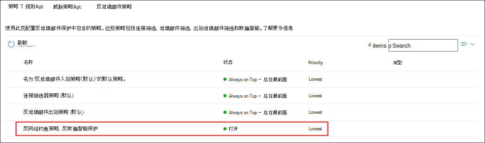

# <a name="configure-spoof-intelligence-in-microsoft-365"></a><span data-ttu-id="4e813-103">在 Microsoft 365 中配置欺骗智能</span><span class="sxs-lookup"><span data-stu-id="4e813-103">Configure spoof intelligence in Microsoft 365</span></span>

<span data-ttu-id="4e813-104">如果您是 Exchange Online 邮箱或独立 Exchange Online Protection （EOP）客户（没有 Exchange Online 邮箱）的 Microsoft 365 客户，则入站电子邮件将自动受 EOP 到10月2018的欺骗保护。</span><span class="sxs-lookup"><span data-stu-id="4e813-104">If you're an Microsoft 365 customer with mailboxes in Exchange Online or a standalone Exchange Online Protection (EOP) customer without Exchange Online mailboxes, inbound email messages are automatically protected against spoofing by EOP as of October 2018.</span></span> <span data-ttu-id="4e813-105">EOP 在组织对网络钓鱼的整体防护过程中使用欺骗智能。</span><span class="sxs-lookup"><span data-stu-id="4e813-105">EOP uses spoof intelligence as part of your organization's overall defense against phishing.</span></span> <span data-ttu-id="4e813-106">有关详细信息，请参阅[Microsoft 365 中的反欺骗保护](anti-spoofing-protection.md)。</span><span class="sxs-lookup"><span data-stu-id="4e813-106">For more information, see [Anti-spoofing protection in Microsoft 365](anti-spoofing-protection.md).</span></span>

<span data-ttu-id="4e813-107">当发件人假冒电子邮件地址时，它们似乎是组织的某个域中的用户，或者是外部域中向您的组织发送电子邮件的用户。</span><span class="sxs-lookup"><span data-stu-id="4e813-107">When a sender spoofs an email address, they appear to be a user in one of your organization's domains, or a user in an external domain that sends email to your organization.</span></span> <span data-ttu-id="4e813-108">欺骗发件人以发送垃圾邮件或网络钓鱼电子邮件的攻击者需要阻止。</span><span class="sxs-lookup"><span data-stu-id="4e813-108">Attackers who spoof senders to send spam or phishing email need to be blocked.</span></span> <span data-ttu-id="4e813-109">但在某些情况下，合法发件人是欺骗的。</span><span class="sxs-lookup"><span data-stu-id="4e813-109">But there are scenarios where legitimate senders are spoofing.</span></span> <span data-ttu-id="4e813-110">例如：</span><span class="sxs-lookup"><span data-stu-id="4e813-110">For example:</span></span>

- <span data-ttu-id="4e813-111">欺骗性内部域的合法方案：</span><span class="sxs-lookup"><span data-stu-id="4e813-111">Legitimate scenarios for spoofing internal domains:</span></span>

  - <span data-ttu-id="4e813-112">第三方发件人使用您的域向您自己的员工发送批量邮件，以进行公司投票。</span><span class="sxs-lookup"><span data-stu-id="4e813-112">Third-party senders use your domain to send bulk mail to your own employees for company polls.</span></span>

  - <span data-ttu-id="4e813-113">外部公司代表你生成并发送广告或产品更新。</span><span class="sxs-lookup"><span data-stu-id="4e813-113">An external company generates and sends advertising or product updates on your behalf.</span></span>

  - <span data-ttu-id="4e813-114">助理定期需要为组织中的其他人发送电子邮件。</span><span class="sxs-lookup"><span data-stu-id="4e813-114">An assistant regularly needs to send email for another person within your organization.</span></span>

  - <span data-ttu-id="4e813-115">内部应用程序发送电子邮件通知。</span><span class="sxs-lookup"><span data-stu-id="4e813-115">An internal application sends email notifications.</span></span>

- <span data-ttu-id="4e813-116">欺骗外部域的合法方案：</span><span class="sxs-lookup"><span data-stu-id="4e813-116">Legitimate scenarios for spoofing external domains:</span></span>

  - <span data-ttu-id="4e813-117">发件人在邮寄列表（也称为讨论列表）中，并且邮寄列表将电子邮件从原始发件人中继到邮件列表中的所有参与者。</span><span class="sxs-lookup"><span data-stu-id="4e813-117">The sender is on a mailing list (also known as a discussion list), and the mailing list relays email from the original sender to all the participants on the mailing list.</span></span>

  - <span data-ttu-id="4e813-118">外部公司代表其他公司发送电子邮件（例如，自动报告或作为服务的软件公司）。</span><span class="sxs-lookup"><span data-stu-id="4e813-118">An external company sends email on behalf of another company (for example, an automated report or a software-as-a-service company).</span></span>

<span data-ttu-id="4e813-119">欺骗性智能，特别是默认（仅适用于）欺骗智能策略，可帮助确保合法发件人发送的欺骗电子邮件不会在 Microsoft 365 或外部电子邮件系统中出现垃圾邮件筛选器，同时保护您的用户免受垃圾邮件或网络钓鱼攻击。</span><span class="sxs-lookup"><span data-stu-id="4e813-119">Spoof intelligence, and specifically the default (and only) spoof intelligence policy, helps ensure that the spoofed email sent by legitimate senders doesn't get caught up in spam filters in Microsoft 365 or external email systems, while protecting your users from spam or phishing attacks.</span></span>

<span data-ttu-id="4e813-120">您可以在 Microsoft 365 Security & 合规中心或 PowerShell （Exchange Online PowerShell for Microsoft 365 客户;）中管理欺骗情报;适用于独立 EOP 客户的 Exchange Online Protection PowerShell）。</span><span class="sxs-lookup"><span data-stu-id="4e813-120">You can manage spoof intelligence in the Microsoft 365 Security & Compliance Center, or in PowerShell (Exchange Online PowerShell for Microsoft 365 customers; Exchange Online Protection PowerShell for standalone EOP customers).</span></span>

## <a name="what-do-you-need-to-know-before-you-begin"></a><span data-ttu-id="4e813-121">开始前，有必要了解什么？</span><span class="sxs-lookup"><span data-stu-id="4e813-121">What do you need to know before you begin?</span></span>

- <span data-ttu-id="4e813-122">安全与合规中心的打开网址为 <https://protection.office.com/>。</span><span class="sxs-lookup"><span data-stu-id="4e813-122">You open the Security & Compliance Center at <https://protection.office.com/>.</span></span> <span data-ttu-id="4e813-123">若要直接转到 **“反垃圾邮件设置”** 页，请访问 <https://protection.office.com/antispam>。</span><span class="sxs-lookup"><span data-stu-id="4e813-123">To go directly to the **Anti-spam settings** page, use <https://protection.office.com/antispam>.</span></span> <span data-ttu-id="4e813-124">若要直接转到 "**反钓鱼**" 页面， <https://protection.office.com/antiphishing>请使用。</span><span class="sxs-lookup"><span data-stu-id="4e813-124">To go directly to the **Anti-phishing** page, use <https://protection.office.com/antiphishing>.</span></span>

- <span data-ttu-id="4e813-125">若要连接到 Exchange Online PowerShell，请参阅[连接到 Exchange Online PowerShell](https://docs.microsoft.com/powershell/exchange/exchange-online/connect-to-exchange-online-powershell/connect-to-exchange-online-powershell)。</span><span class="sxs-lookup"><span data-stu-id="4e813-125">To connect to Exchange Online PowerShell, see [Connect to Exchange Online PowerShell](https://docs.microsoft.com/powershell/exchange/exchange-online/connect-to-exchange-online-powershell/connect-to-exchange-online-powershell).</span></span> <span data-ttu-id="4e813-126">若要连接到独立 Exchange Online Protection，请参阅[连接到 Exchange Online Protection PowerShell](https://docs.microsoft.com/powershell/exchange/exchange-eop/connect-to-exchange-online-protection-powershell)。</span><span class="sxs-lookup"><span data-stu-id="4e813-126">To connect to standalone Exchange Online Protection PowerShell, see [Connect to Exchange Online Protection PowerShell](https://docs.microsoft.com/powershell/exchange/exchange-eop/connect-to-exchange-online-protection-powershell).</span></span>

- <span data-ttu-id="4e813-127">必须先分配有权限，然后才能执行这些过程。</span><span class="sxs-lookup"><span data-stu-id="4e813-127">You need to be assigned permissions before you can perform these procedures.</span></span> <span data-ttu-id="4e813-128">若要修改欺骗性智能策略或启用或禁用欺骗智能，您需要是 "**组织管理**" 或 "**安全管理员**" 角色组的成员。</span><span class="sxs-lookup"><span data-stu-id="4e813-128">To modify the spoof intelligence policy or enable or disable spoof intelligence, you need to be a member of the **Organization Management** or **Security Administrator** role groups.</span></span> <span data-ttu-id="4e813-129">若要对欺骗智能策略进行只读访问，您需要是**安全读者**角色组的成员。</span><span class="sxs-lookup"><span data-stu-id="4e813-129">For read-only access to the spoof intelligence policy, you need to be a member of the **Security Reader** role group.</span></span> <span data-ttu-id="4e813-130">若要详细了解安全与合规中心内的角色组，请参阅 [Office 365 安全与合规中心内的权限](permissions-in-the-security-and-compliance-center.md)。</span><span class="sxs-lookup"><span data-stu-id="4e813-130">For more information about role groups in the Security & Compliance Center, see [Permissions in the Office 365 Security & Compliance Center](permissions-in-the-security-and-compliance-center.md).</span></span>

- <span data-ttu-id="4e813-131">有关我们针对欺骗情报的建议设置，请[EOP 默认反网络钓鱼策略设置](recommended-settings-for-eop-and-office365-atp.md#eop-default-anti-phishing-policy-settings)。</span><span class="sxs-lookup"><span data-stu-id="4e813-131">For our recommended settings for spoof intelligence, [EOP default anti-phishing policy settings](recommended-settings-for-eop-and-office365-atp.md#eop-default-anti-phishing-policy-settings).</span></span>

## <a name="use-the-security--compliance-center-to-manage-spoofed-senders"></a><span data-ttu-id="4e813-132">使用安全 & 合规性中心管理欺骗性发件人</span><span class="sxs-lookup"><span data-stu-id="4e813-132">Use the Security & Compliance Center to manage spoofed senders</span></span>

> [!NOTE]
> <span data-ttu-id="4e813-133">如果您拥有 Office 365 企业版 E5 订阅或已单独购买和高级威胁防护（ATP）加载项，则还可以管理通过[欺骗性智能洞察力](walkthrough-spoof-intelligence-insight.md)欺骗您的域的发件人。</span><span class="sxs-lookup"><span data-stu-id="4e813-133">If you have an Office 365 Enterprise E5 subscription or have separately purchased and Advanced Threat Protection (ATP) add-on, you can also manage senders who are spoofing your domain through the [Spoof Intelligence insight](walkthrough-spoof-intelligence-insight.md).</span></span>

1. <span data-ttu-id="4e813-134">在安全与合规中心内，依次转到 **“威胁管理”**\>**“策略”**\>**“反垃圾邮件”**。</span><span class="sxs-lookup"><span data-stu-id="4e813-134">In the Security & Compliance Center, go to **Threat management** \> **Policy** \> **Anti-spam**.</span></span>

2. <span data-ttu-id="4e813-135">在 "**反垃圾邮件设置**" 页上 "展开图标" 以展开 "**欺骗智能策略**"。</span><span class="sxs-lookup"><span data-stu-id="4e813-135">On the **Anti-spam settings** page, click  to expand **Spoof intelligence policy**.</span></span>

   

3. <span data-ttu-id="4e813-137">进行下列选择之一：</span><span class="sxs-lookup"><span data-stu-id="4e813-137">Make one of the following selections:</span></span>

   - <span data-ttu-id="4e813-138">**查看新发件人**</span><span class="sxs-lookup"><span data-stu-id="4e813-138">**Review new senders**</span></span>
   - <span data-ttu-id="4e813-139">**显示已审阅的发件人**</span><span class="sxs-lookup"><span data-stu-id="4e813-139">**Show me senders I already reviewed**</span></span>

4. <span data-ttu-id="4e813-140">在**决定是否允许这些发件人哄骗**出现的用户浮出控件时，选择下列选项卡之一：</span><span class="sxs-lookup"><span data-stu-id="4e813-140">In the **Decide if these senders are allowed to spoof your users** flyout that appears, select one of the following tabs:</span></span>

   - <span data-ttu-id="4e813-141">**您的域**：发件人哄骗内部域中的用户。</span><span class="sxs-lookup"><span data-stu-id="4e813-141">**Your Domains**: Senders spoofing users in your internal domains.</span></span>
   - <span data-ttu-id="4e813-142">**外部域**：发件人哄骗外部域中的用户。</span><span class="sxs-lookup"><span data-stu-id="4e813-142">**External Domains**: Senders spoofing users in external domains.</span></span>

5. <span data-ttu-id="4e813-143">单击 **允许欺骗"** 列中的 "展开图标"。</span><span class="sxs-lookup"><span data-stu-id="4e813-143">Click  in the **Allowed to spoof?** column.</span></span> <span data-ttu-id="4e813-144">选择 **"是"** 允许欺骗发件人，或选择 "**否**" 将邮件标记为 "欺骗"。</span><span class="sxs-lookup"><span data-stu-id="4e813-144">Choose **Yes** to allow the spoofed sender, or choose **No** to mark the message as spoofed.</span></span> <span data-ttu-id="4e813-145">该操作由默认的反网络钓鱼策略或自定义 ATP 反网络钓鱼策略控制（默认值为 "**将邮件移动到垃圾邮件" 文件夹**）。</span><span class="sxs-lookup"><span data-stu-id="4e813-145">The action is controlled by the default anti-phishing policy or custom ATP anti-phishing policies (the default value is **Move message to Junk Email folder**).</span></span> <span data-ttu-id="4e813-146">有关详细信息，请参阅[反网络钓鱼策略中的欺骗设置](set-up-anti-phishing-policies.md#spoof-settings)。</span><span class="sxs-lookup"><span data-stu-id="4e813-146">For more information, see [Spoof settings in anti-phishing policies](set-up-anti-phishing-policies.md#spoof-settings).</span></span>

   

   <span data-ttu-id="4e813-148">下表中说明了您看到的列和值：</span><span class="sxs-lookup"><span data-stu-id="4e813-148">The columns and values that you see are explained in the following list:</span></span>

   - <span data-ttu-id="4e813-149">**欺骗用户**：被欺骗的用户帐户。</span><span class="sxs-lookup"><span data-stu-id="4e813-149">**Spoofed user**: The user account that's being spoofed.</span></span> <span data-ttu-id="4e813-150">这是电子邮件客户端中显示的发件人地址（ `5322.From`也称为地址）中的邮件发件人。</span><span class="sxs-lookup"><span data-stu-id="4e813-150">This is the message sender in the From address (also known as the `5322.From` address) that's shown in email clients.</span></span> <span data-ttu-id="4e813-151">SPF 不会检查此地址的有效性。</span><span class="sxs-lookup"><span data-stu-id="4e813-151">The validity of this address is not checked by SPF.</span></span>

     - <span data-ttu-id="4e813-152">在 "**您的域**" 选项卡上，值包含一个电子邮件地址，或者如果源电子邮件服务器正在哄骗多个用户帐户，则它包含**多**个用户帐户。</span><span class="sxs-lookup"><span data-stu-id="4e813-152">On the **Your Domains** tab, the value contains a single email address, or if the source email server is spoofing multiple user accounts, it contains **More than one**.</span></span>

     - <span data-ttu-id="4e813-153">在 "**外部域**" 选项卡上，值包含欺骗用户的域，而不是完整的电子邮件地址。</span><span class="sxs-lookup"><span data-stu-id="4e813-153">On the **External Domains** tab, the value contains the domain of the spoofed user, not the full email address.</span></span>

   - <span data-ttu-id="4e813-154">**发送基础结构**：在源电子邮件服务器的 IP 地址的反向 DNS 查找（PTR 记录）中找到的域; 如果源没有 PTR 记录，则为 IP 地址。</span><span class="sxs-lookup"><span data-stu-id="4e813-154">**Sending Infrastructure**: The domain found in a reverse DNS lookup (PTR record) of the source email server's IP address, or the IP address if the source has no PTR record.</span></span>

     <span data-ttu-id="4e813-155">有关邮件源和邮件发件人的详细信息，请参阅[电子邮件标准概述](how-office-365-validates-the-from-address.md#an-overview-of-email-message-standards)。</span><span class="sxs-lookup"><span data-stu-id="4e813-155">For more information about message sources and message senders, see [An overview of email message standards](how-office-365-validates-the-from-address.md#an-overview-of-email-message-standards).</span></span>

   - <span data-ttu-id="4e813-156">**邮件**数：在最近30天内包含指定的欺骗发件人或发件人的组织的发送方结构中的邮件数。</span><span class="sxs-lookup"><span data-stu-id="4e813-156">**# of messages**: The number of messages from the sending infrastructure to your organization that contain the specified spoofed sender or senders within the last 30 days.</span></span>

   - <span data-ttu-id="4e813-157">**用户投诉**：在过去30天内，用户对此发件人存档的投诉。</span><span class="sxs-lookup"><span data-stu-id="4e813-157">**# of user complaints**: Complaints filed by your users against this sender within the last 30 days.</span></span> <span data-ttu-id="4e813-158">投诉通常是提交给 Microsoft 的垃圾邮件的形式。</span><span class="sxs-lookup"><span data-stu-id="4e813-158">Complaints are usually in the form of junk submissions to Microsoft.</span></span>

   - <span data-ttu-id="4e813-159">**身份验证结果**：下列值之一：</span><span class="sxs-lookup"><span data-stu-id="4e813-159">**Authentication result**: One of the following values:</span></span>

      - <span data-ttu-id="4e813-160">已**传递**：发件人通过了发件人电子邮件身份验证检查（SPF 或 DKIM）。</span><span class="sxs-lookup"><span data-stu-id="4e813-160">**Passed**: The sender passed sender email authentication checks (SPF or DKIM).</span></span>
      - <span data-ttu-id="4e813-161">**失败**：发件人失败 EOP 发件人身份验证检查。</span><span class="sxs-lookup"><span data-stu-id="4e813-161">**Failed**: The sender failed EOP sender authentication checks.</span></span>
      - <span data-ttu-id="4e813-162">**未知**：这些检查的结果不是已知的结果。</span><span class="sxs-lookup"><span data-stu-id="4e813-162">**Unknown**: The result of these checks isn't known.</span></span>

   - <span data-ttu-id="4e813-163">**决策集依据**：显示确定是否允许发送基础结构欺骗用户的用户：</span><span class="sxs-lookup"><span data-stu-id="4e813-163">**Decision set by**: Shows who determined if the sending infrastructure is allowed to spoof the user:</span></span>

       - <span data-ttu-id="4e813-164">**欺骗智能策略**（自动）</span><span class="sxs-lookup"><span data-stu-id="4e813-164">**Spoof intelligence policy** (automatic)</span></span>
       - <span data-ttu-id="4e813-165">**管理员**（手动）</span><span class="sxs-lookup"><span data-stu-id="4e813-165">**Admin** (manual)</span></span>

   - <span data-ttu-id="4e813-166">**上次查看**时间：从包含欺骗用户的发送基础结构收到邮件的最后日期。</span><span class="sxs-lookup"><span data-stu-id="4e813-166">**Last seen**: The last date when a message was received from the sending infrastructure that contains the spoofed user.</span></span>

   - <span data-ttu-id="4e813-167">是否**允许欺骗？**：您在此处看到的值是：</span><span class="sxs-lookup"><span data-stu-id="4e813-167">**Allowed to spoof?**: The values that you see here are:</span></span>

     - <span data-ttu-id="4e813-168">**是**：允许欺骗用户和发送基础结构组合的邮件不会被视为欺骗电子邮件。</span><span class="sxs-lookup"><span data-stu-id="4e813-168">**Yes**: Messages from the combination of spoofed user and sending infrastructure are allowed and not treated as spoofed email.</span></span>

     - <span data-ttu-id="4e813-169">**否**：来自欺骗用户和发送基础结构组合的邮件被标记为欺骗。</span><span class="sxs-lookup"><span data-stu-id="4e813-169">**No**: Messages from the combination of spoofed user and sending infrastructure are marked as spoofed.</span></span> <span data-ttu-id="4e813-170">该操作由默认的反网络钓鱼策略或自定义 ATP 反网络钓鱼策略控制（默认值为 "**将邮件移动到垃圾邮件" 文件夹**）。</span><span class="sxs-lookup"><span data-stu-id="4e813-170">The action is controlled by the default anti-phishing policy or custom ATP anti-phishing policies (the default value is **Move message to Junk Email folder**).</span></span> <span data-ttu-id="4e813-171">有关详细信息，请参阅下一节。</span><span class="sxs-lookup"><span data-stu-id="4e813-171">See the next section for more information.</span></span>

     - <span data-ttu-id="4e813-172">**某些用户**（仅限**域**选项卡）：发送基础结构会哄骗多个用户，其中某些欺骗用户是允许的，其他是不允许的。</span><span class="sxs-lookup"><span data-stu-id="4e813-172">**Some users** (**Your Domains** tab only): A sending infrastructure is spoofing multiple users, where some spoofed users are allowed and others are not.</span></span> <span data-ttu-id="4e813-173">使用 "**详细信息**" 选项卡查看特定地址。</span><span class="sxs-lookup"><span data-stu-id="4e813-173">Use the **Detailed** tab to see the specific addresses.</span></span>

6. <span data-ttu-id="4e813-174">在页面底部，单击“保存”\*\*\*\*。</span><span class="sxs-lookup"><span data-stu-id="4e813-174">At the bottom of the page, click **Save**.</span></span>

## <a name="use-powershell-to-manage-spoofed-senders"></a><span data-ttu-id="4e813-175">使用 PowerShell 管理欺骗性发件人</span><span class="sxs-lookup"><span data-stu-id="4e813-175">Use PowerShell to manage spoofed senders</span></span>

<span data-ttu-id="4e813-176">若要在欺骗智能中查看允许和阻止的发件人，请使用以下语法：</span><span class="sxs-lookup"><span data-stu-id="4e813-176">To view allowed and blocked senders in spoof intelligence, use the following syntax:</span></span>

```powershell
Get-PhishFilterPolicy [-AllowedToSpoof <Yes | No | Partial>] [-ConfidenceLevel <Low | High>] [-DecisionBy <Admin | SpoofProtection>] [-Detailed] [-SpoofType <Internal | External>]
```

<span data-ttu-id="4e813-177">本示例返回有关允许在您的域中欺骗用户的所有发件人的详细信息。</span><span class="sxs-lookup"><span data-stu-id="4e813-177">This example returns detailed information about all senders that are allowed to spoof users in your domains.</span></span>

```powershell
Get-PhishFilter -AllowedToSpoof Yes -Detailed -SpoofType Internal
```

<span data-ttu-id="4e813-178">有关语法和参数的详细信息，请参阅[将 get-phishfilterpolicy](https://docs.microsoft.com/powershell/module/exchange/advanced-threat-protection/get-phishfilterpolicy)。</span><span class="sxs-lookup"><span data-stu-id="4e813-178">For detailed syntax and parameter information, see [Get-PhishFilterPolicy](https://docs.microsoft.com/powershell/module/exchange/advanced-threat-protection/get-phishfilterpolicy).</span></span>

<span data-ttu-id="4e813-179">若要在欺骗智能中配置允许和阻止的发件人，请按照以下步骤操作：</span><span class="sxs-lookup"><span data-stu-id="4e813-179">To configure allowed and blocked senders in spoof intelligence, follow these steps:</span></span>

1. <span data-ttu-id="4e813-180">通过将**将 get-phishfilterpolicy** cmdlet 的输出写入 CSV 文件，捕获当前检测到的欺骗发件人列表：</span><span class="sxs-lookup"><span data-stu-id="4e813-180">Capture the current list of detected spoofed senders by writing the output of the **Get-PhishFilterPolicy** cmdlet to a CSV file:</span></span>

   ```powershell
   Get-PhishFilterPolicy -Detailed | Export-CSV "C:\My Documents\Spoofed Senders.csv"
   ```

2. <span data-ttu-id="4e813-181">编辑 CSV 文件以添加或修改**SpoofedUser** （电子邮件地址）和**AllowedToSpoof** （是或否）值。</span><span class="sxs-lookup"><span data-stu-id="4e813-181">Edit the CSV file to add or modify the **SpoofedUser** (email address) and **AllowedToSpoof** (Yes or No) values.</span></span> <span data-ttu-id="4e813-182">保存文件，读取文件，并将内容存储为名为`$UpdateSpoofedSenders`的变量：</span><span class="sxs-lookup"><span data-stu-id="4e813-182">Save the file, read the file, and store the contents as a variable named `$UpdateSpoofedSenders`:</span></span>

   ```powershell
   $UpdateSpoofedSenders = Get-Content -Raw "C:\My Documents\Spoofed Senders.csv"
   ```

3. <span data-ttu-id="4e813-183">使用`$UpdateSpoofedSenders`变量配置欺骗性智能策略：</span><span class="sxs-lookup"><span data-stu-id="4e813-183">Use the `$UpdateSpoofedSenders` variable to configure the spoof intelligence policy:</span></span>

   ```powershell
   Set-PhishFilterPolicy -Identity Default -SpoofAllowBlockList $UpdateSpoofedSenders
   ```

<span data-ttu-id="4e813-184">有关语法和参数的详细信息，请参阅[将 get-phishfilterpolicy](https://docs.microsoft.com/powershell/module/exchange/advanced-threat-protection/set-phishfilterpolicy)。</span><span class="sxs-lookup"><span data-stu-id="4e813-184">For detailed syntax and parameter information, see [Set-PhishFilterPolicy](https://docs.microsoft.com/powershell/module/exchange/advanced-threat-protection/set-phishfilterpolicy).</span></span>

## <a name="use-the-security--compliance-center-to-configure-spoof-intelligence"></a><span data-ttu-id="4e813-185">使用安全 & 合规中心配置欺骗性智能</span><span class="sxs-lookup"><span data-stu-id="4e813-185">Use the Security & Compliance Center to configure spoof intelligence</span></span>

<span data-ttu-id="4e813-186">欺骗性智能的配置选项在[反网络钓鱼策略中的欺骗设置](set-up-anti-phishing-policies.md#spoof-settings)中进行了说明。</span><span class="sxs-lookup"><span data-stu-id="4e813-186">The configuration options for spoof intelligence are described in [Spoof settings in anti-phishing policies](set-up-anti-phishing-policies.md#spoof-settings).</span></span>

<span data-ttu-id="4e813-187">您可以在默认的反网络钓鱼策略中以及自定义策略中配置欺骗智能设置。</span><span class="sxs-lookup"><span data-stu-id="4e813-187">You can configure spoof intelligence settings in the default anti-phishing policy, and also in custom policies.</span></span> <span data-ttu-id="4e813-188">有关基于你的订阅的说明，请参阅以下主题之一：</span><span class="sxs-lookup"><span data-stu-id="4e813-188">For instructions based on your subscription, see one of the following topics:</span></span>

- <span data-ttu-id="4e813-189">[在 EOP 中配置反网络钓鱼策略](configure-anti-phishing-policies-eop.md)。</span><span class="sxs-lookup"><span data-stu-id="4e813-189">[Configure anti-phishing policies in EOP](configure-anti-phishing-policies-eop.md).</span></span>

- <span data-ttu-id="4e813-190">[在 Microsoft 365 中配置 ATP 反网络钓鱼策略](configure-atp-anti-phishing-policies.md)。</span><span class="sxs-lookup"><span data-stu-id="4e813-190">[Configure ATP anti-phishing policies in Microsoft 365](configure-atp-anti-phishing-policies.md).</span></span>

## <a name="how-do-you-know-these-procedures-worked"></a><span data-ttu-id="4e813-191">如何判断这些过程生效了？</span><span class="sxs-lookup"><span data-stu-id="4e813-191">How do you know these procedures worked?</span></span>

<span data-ttu-id="4e813-192">若要验证您是否已使用允许且不允许欺骗的发件人配置了欺骗智能，并且您已配置了欺骗性智能设置，请执行以下任一步骤：</span><span class="sxs-lookup"><span data-stu-id="4e813-192">To verify that you've configured spoof intelligence with senders who are allowed and not allowed to spoof, and that you've configured the spoof intelligence settings, use any of the following steps:</span></span>

- <span data-ttu-id="4e813-193">在安全 & 合规性中心中，转**到威胁管理** \> **策略** \> **反垃圾邮件** \>展开**欺骗智能策略** \>选择 "**显示我已审阅** \>的发件人"。选中 "您的**域**或**外部域**" 选项卡，并验证发件人的 "是否**允许欺骗？** " 值。</span><span class="sxs-lookup"><span data-stu-id="4e813-193">In the Security & Compliance Center, go to **Threat management** \> **Policy** \> **Anti-spam** \> expand **Spoof intelligence policy** \> select **Show me senders I already reviewed** \> select the **Your Domains** or **External Domains** tab, and verify the **Allowed to spoof?** value for the sender.</span></span>

- <span data-ttu-id="4e813-194">在 PowerShell 中，运行以下命令以查看允许且不允许欺骗的发件人：</span><span class="sxs-lookup"><span data-stu-id="4e813-194">In PowerShell, run the following commands to view the senders who are allowed and not allowed to spoof:</span></span>

  ```powershell
  Get-PhishFilter -AllowedToSpoof Yes -SpoofType Internal
  Get-PhishFilter -AllowedToSpoof No -SpoofType Internal
  Get-PhishFilter -AllowedToSpoof Yes -SpoofType External
  Get-PhishFilter -AllowedToSpoof No -SpoofType External
  ```

- <span data-ttu-id="4e813-195">在 PowerShell 中，运行以下命令以将所有欺骗性发件人的列表导出到 CSV 文件：</span><span class="sxs-lookup"><span data-stu-id="4e813-195">In PowerShell, run the following command to export the list of all spoofed senders to a CSV file:</span></span>

   ```powershell
   Get-PhishFilterPolicy -Detailed | Export-CSV "C:\My Documents\Spoofed Senders.csv"
   ```

- <span data-ttu-id="4e813-196">在使用 Exchange Online 邮箱的 Microsoft 365 组织中，执行以下步骤之一：</span><span class="sxs-lookup"><span data-stu-id="4e813-196">In Microsoft 365 organizations with Exchange Online mailboxes, do either of the following steps:</span></span>

  - <span data-ttu-id="4e813-197">在安全 & 合规性中心中，转到 "**威胁管理** \> **策略** \> **反网络钓鱼** \> " 单击 "**默认策略**"，然后在浮出控件中查看详细信息。</span><span class="sxs-lookup"><span data-stu-id="4e813-197">In the Security & Compliance Center, go to **Threat management** \> **Policy** \> **Anti-phishing** \> click **Default policy** and view the details in the flyout.</span></span>

  - <span data-ttu-id="4e813-198">在 Exchange Online PowerShell 中，运行以下命令并验证设置：</span><span class="sxs-lookup"><span data-stu-id="4e813-198">In Exchange Online PowerShell, run the following command and verify the settings:</span></span>

    ```PowerShell
    Get-AntiPhishPolicy -Identity "Office365 AntiPhish Default"
    ```

- <span data-ttu-id="4e813-199">在 Microsoft 365 ATP 组织中，执行以下任一步骤：</span><span class="sxs-lookup"><span data-stu-id="4e813-199">In Microsoft 365 ATP organizations, do either of the following steps:</span></span>

  - <span data-ttu-id="4e813-200">在安全 & 合规性中心中，转到 "**威胁管理** \> **策略** \> **ATP 反网络钓鱼**"，并执行下列步骤之一：</span><span class="sxs-lookup"><span data-stu-id="4e813-200">In the Security & Compliance Center, go to **Threat management** \> **Policy** \> **ATP anti-phishing** and do either of the following steps:</span></span>

    - <span data-ttu-id="4e813-201">从列表中选择一个策略。</span><span class="sxs-lookup"><span data-stu-id="4e813-201">Select a policy from the list.</span></span> <span data-ttu-id="4e813-202">在出现的浮出控件中，验证**欺骗**部分中的值。</span><span class="sxs-lookup"><span data-stu-id="4e813-202">In the flyout that appears, verify the values in the **Spoof** section.</span></span>
    - <span data-ttu-id="4e813-203">单击 "**默认策略**"。</span><span class="sxs-lookup"><span data-stu-id="4e813-203">Click **Default policy**.</span></span> <span data-ttu-id="4e813-204">在出现的浮出控件中，验证**欺骗**部分中的值。</span><span class="sxs-lookup"><span data-stu-id="4e813-204">In the flyout that appears, verify the values in the **Spoof** section.</span></span>

  - <span data-ttu-id="4e813-205">在 Exchange Online PowerShell 中， \<将\> Name 替换为 Office365 AntiPhish 默认值或自定义 ATP 反网络钓鱼策略的名称，然后运行以下命令并验证设置：</span><span class="sxs-lookup"><span data-stu-id="4e813-205">In Exchange Online PowerShell, replace \<Name\> with Office365 AntiPhish Default or the name of a custom ATP anti-phishing policy, and run the following command and verify the settings:</span></span>

    ```PowerShell
    Get-AntiPhishPolicy -Identity "<Name>"
    ```

## <a name="other-ways-to-manage-spoofing-and-phishing"></a><span data-ttu-id="4e813-206">管理欺骗和网络钓鱼的其他方法</span><span class="sxs-lookup"><span data-stu-id="4e813-206">Other ways to manage spoofing and phishing</span></span>

<span data-ttu-id="4e813-207">请这有关哄骗和网络钓鱼防护的信息。</span><span class="sxs-lookup"><span data-stu-id="4e813-207">Be diligent about spoofing and phishing protection.</span></span> <span data-ttu-id="4e813-208">下面是检查发件人欺骗你的域并帮助防止其损坏组织的相关方法：</span><span class="sxs-lookup"><span data-stu-id="4e813-208">Here are related ways to check on senders spoofing your domain and help prevent them from damaging your organization:</span></span>

- <span data-ttu-id="4e813-209">检查**欺骗邮件报告**。</span><span class="sxs-lookup"><span data-stu-id="4e813-209">Check the **Spoof Mail Report**.</span></span> <span data-ttu-id="4e813-210">您可以经常使用此报告查看和帮助管理欺骗性发件人。</span><span class="sxs-lookup"><span data-stu-id="4e813-210">You can use this report often to view and help manage spoofed senders.</span></span> <span data-ttu-id="4e813-211">有关信息，请参阅[欺骗检测报告](view-email-security-reports.md#spoof-detections-report)。</span><span class="sxs-lookup"><span data-stu-id="4e813-211">For information, see [Spoof Detections report](view-email-security-reports.md#spoof-detections-report).</span></span>

- <span data-ttu-id="4e813-212">查看您的发件人策略框架（SPF）配置。</span><span class="sxs-lookup"><span data-stu-id="4e813-212">Review your Sender Policy Framework (SPF) configuration.</span></span> <span data-ttu-id="4e813-213">若要了解 SPF 的快速简介及其快速配置方法，请参阅[在 Microsoft 365 中设置 SPF 以防欺骗](set-up-spf-in-office-365-to-help-prevent-spoofing.md)。</span><span class="sxs-lookup"><span data-stu-id="4e813-213">For a quick introduction to SPF and to get it configured quickly, see [Set up SPF in Microsoft 365 to help prevent spoofing](set-up-spf-in-office-365-to-help-prevent-spoofing.md).</span></span> <span data-ttu-id="4e813-214">有关 Office 365 如何使用 SPF 的更深入了解，或者有关故障排除或非标准部署（如混合部署）的信息，请开始阅读[How Office 365 uses Sender Policy Framework (SPF) to prevent spoofing](how-office-365-uses-spf-to-prevent-spoofing.md)。</span><span class="sxs-lookup"><span data-stu-id="4e813-214">For a more in-depth understanding of how Office 365 uses SPF, or for troubleshooting or non-standard deployments such as hybrid deployments, start with [How Office 365 uses Sender Policy Framework (SPF) to prevent spoofing](how-office-365-uses-spf-to-prevent-spoofing.md).</span></span>

- <span data-ttu-id="4e813-215">查看您的域密钥识别邮件（DKIM）配置。</span><span class="sxs-lookup"><span data-stu-id="4e813-215">Review your DomainKeys Identified Mail (DKIM) configuration.</span></span> <span data-ttu-id="4e813-216">除了 SPF 和 DMARC，还应使用 DKIM，以帮助防止攻击者发送看上去来自您的域的邮件。</span><span class="sxs-lookup"><span data-stu-id="4e813-216">You should use DKIM in addition to SPF and DMARC to help prevent attackers from sending messages that look like they are coming from your domain.</span></span> <span data-ttu-id="4e813-217">你可以使用 DKIM 将数字签名添加到电子邮件的邮件头中。</span><span class="sxs-lookup"><span data-stu-id="4e813-217">DKIM lets you add a digital signature to email messages in the message header.</span></span> <span data-ttu-id="4e813-218">有关信息，请参阅[使用 DKIM 验证从您的自定义域在 Office 365 中发送的出站电子邮件](use-dkim-to-validate-outbound-email.md)。</span><span class="sxs-lookup"><span data-stu-id="4e813-218">For information, see [Use DKIM to validate outbound email sent from your custom domain in Office 365](use-dkim-to-validate-outbound-email.md).</span></span>

- <span data-ttu-id="4e813-219">查看基于域的邮件身份验证、报告和一致性（DMARC）配置。</span><span class="sxs-lookup"><span data-stu-id="4e813-219">Review your Domain-based Message Authentication, Reporting, and Conformance (DMARC) configuration.</span></span> <span data-ttu-id="4e813-220">实现使用 SPF 和 DKIM 的 DMARC 可以针对欺骗和钓鱼电子邮件提供额外的保护。</span><span class="sxs-lookup"><span data-stu-id="4e813-220">Implementing DMARC with SPF and DKIM provides additional protection against spoofing and phishing email.</span></span> <span data-ttu-id="4e813-221">DMARC 可帮助接收邮件系统确定如何处理从你的域发送且未通过 SPF 或 DKIM 检查的邮件。</span><span class="sxs-lookup"><span data-stu-id="4e813-221">DMARC helps receiving mail systems determine what to do with messages sent from your domain that fail SPF or DKIM checks.</span></span> <span data-ttu-id="4e813-222">有关信息，请参阅[使用 DMARC 验证 Office 365 中的电子邮件](use-dmarc-to-validate-email.md)。</span><span class="sxs-lookup"><span data-stu-id="4e813-222">For information, see [Use DMARC to validate email in Office 365](use-dmarc-to-validate-email.md).</span></span>