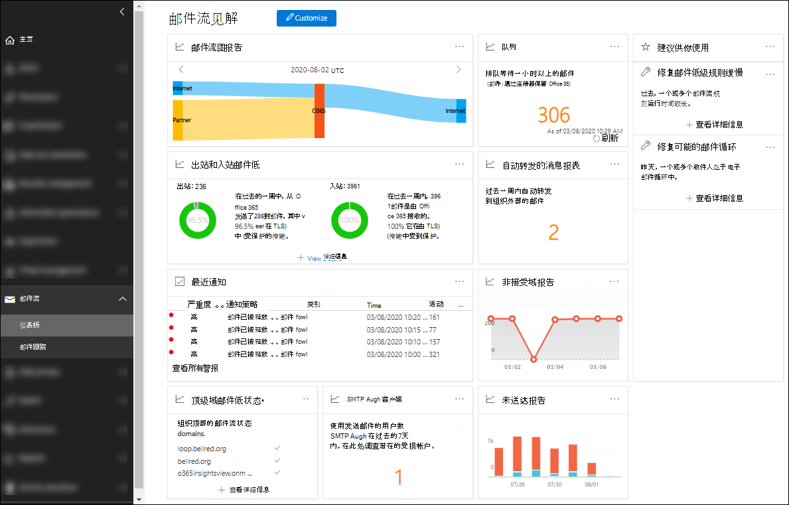

# 安全与合规中心内的邮件流见解

[!INCLUDE [Microsoft 365 Defender rebranding](../includes/microsoft-defender-for-office.md)]

管理员可以使用安全 & 合规性中心中的邮件流仪表板来发现趋势、见解，并采取措施解决与组织中的邮件流相关的问题。

可用的见解包括：

- [自动转发的邮件见解](mfi-auto-forwarded-messages-report.md)

- [修复可能的邮件循环见解](mfi-mail-loop-insight.md)1

- [修复慢速邮件流规则真知灼见](mfi-slow-mail-flow-rules-insight.md)1

- [邮件流地图](mfi-mail-flow-map-report.md)

- [转发的新域电子邮件洞察力](mfi-new-domains-being-forwarded-email.md)2

- [新用户转发电子邮件真知灼见](mfi-new-users-forwarding-email.md)2

- [非接受域报告](mfi-non-accepted-domain-report.md)

- [未送达报告](mfi-non-delivery-report.md)

- [出站和入站邮件流见解](mfi-outbound-and-inbound-mail-flow.md)

- [队列见解](mfi-queue-alerts-and-queues.md)

- [SMTP 身份验证客户端见解和报告](mfi-smtp-auth-clients-report.md)

- [顶级域邮件流状态见解](mfi-domain-mail-flow-status-insight.md)

1 只有在检测到问题之后，才会在 "邮件流" 仪表板的 " **建议** " 区域中显示此见解。 否则，您将看不到它。

2 此真知灼见不会出现在邮件流仪表板上，但在检测到问题后，在 " [转发报告](view-mail-flow-reports.md#forwarding-report) " 页面上可见。 否则，您将看不到它。

## 查看邮件流仪表板所需的权限

邮件流仪表板可用于以下角色组的成员：

- 安全 & 合规中心 (全局管理员) 中的 " **组织管理** "。

- Azure Active Directory 中的 **[Exchange 管理员](https://docs.microsoft.com/azure/active-directory/users-groups-roles/directory-assign-admin-roles#exchange-administrator)** 。

- Security & 合规性中心中的 **邮件流管理员** ：如果此角色组的成员不是全局管理员或 Exchange 管理员角色组的成员，则请注意以下问题和要求：

  - 用户必须直接在中直接登录到安全 & 合规性中心 <https://protection.office.com> 。
  - 用户将只具有对邮件流仪表板的只读权限。
  - 用户将无法访问 Microsoft 365 管理中心。

有关安全性 & 合规性中心中的权限的详细信息，请参阅 [security & 合规性中心中的权限](permissions-in-the-security-and-compliance-center.md) 和 [授予用户对安全 & 合规性中心的访问](grant-access-to-the-security-and-compliance-center.md)权限。

## 在何处查找邮件流仪表板

在中打开 "安全 & 合规中心" <https://protection.office.com> ，展开 " **邮件流** "，然后选择 " **仪表板** "。

若要直接转到 "邮件流" 仪表板，请打开 <https://protection.office.com/mailflow/dashboard> 。
