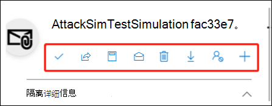

# 在 EOP 中以管理员身份管理已隔离邮件和文件

[!INCLUDE [Microsoft 365 Defender rebranding](../includes/microsoft-defender-for-office.md)]

**适用对象**
- [Exchange Online Protection](exchange-online-protection-overview.md)
- [Microsoft Defender for Office 365 计划 1 和计划 2](defender-for-office-365.md)
- [Microsoft 365 Defender](../defender/microsoft-365-defender.md)

无论是在有 Exchange Online 邮箱的 Microsoft 365 组织中，还是在没有 Exchange Online 邮箱的独立 Exchange Online Protection (EOP) 组织中，隔离功能都会隔离具有潜在危险或不需要的邮件。 有关详细信息，请参阅 [EOP 中的隔离电子邮件](quarantine-email-messages.md)。

管理员可以查看、释放和删除所有用户的所有类型的隔离邮件。 管理员还可以向 Microsoft 报告误报。

默认情况下，只有管理员才能管理被隔离为恶意软件、高可信度网络钓鱼或邮件流规则 (也称为传输规则) 。 但是，管理员可以使用 _隔离_ 策略根据邮件被隔离的原因来定义允许用户对隔离邮件执行哪些操作 (支持的功能) 。 有关详细信息，请参阅 [隔离策略](quarantine-policies.md)。

使用 Microsoft Defender for Office 365 的组织的管理员还可以管理由 保险箱 Attachments 隔离的文件（SharePoint、OneDrive 和[Microsoft Teams）。](mdo-for-spo-odb-and-teams.md)

在 Microsoft 365 Defender 门户中或在 PowerShell (Exchange Online PowerShell 中查看和管理隔离邮件，Microsoft 365邮箱在 Exchange Online;适用于没有邮箱Exchange Online的独立 EOP PowerShell) 。

## 开始前，有必要了解什么？

- 若要打开 Microsoft 365 Defender 门户，请转到 <https://security.microsoft.com>。 要直接打开“**隔离**”页，请使用 <https://security.microsoft.com/quarantine>。

- 若要连接到 Exchange Online PowerShell，请参阅[连接到 Exchange Online PowerShell](/powershell/exchange/connect-to-exchange-online-powershell)。 若要连接到独立 EOP PowerShell，请参阅[连接到 Exchange Online Protection PowerShell](/powershell/exchange/connect-to-exchange-online-protection-powershell)。

- 在 Exchange Online 网站中 **分配** 权限，才能执行本文中的步骤：
  - 若要对所有用户的隔离邮件采取措施，你需要是组织管理、安全管理员或隔离管理员 **角色** \* 组的成员。
  - 若要对所有用户的隔离邮件进行只读访问，你需要是全局读者或安全读者 **角色组的成员**。 

  有关详细信息，请参阅 [Exchange Online 中权限](/exchange/permissions-exo/permissions-exo)。

  **注意**：

  - 在 Microsoft 365 管理中心将用户添加到相应的 Azure Active Directory 角色后，将为用户提供所需的权限 _和_ Microsoft 365 中其他功能的权限。有关详细信息，请参阅 [关于管理员角色](../../admin/add-users/about-admin-roles.md)。
  - [Exchange Online](/Exchange/permissions-exo/permissions-exo#role-groups) 中的 **仅查看组织管理人员** 角色组也提供到该功能的只读访问。
  - \*[Microsoft 365 Defender](permissions-microsoft-365-security-center.md#email--collaboration-roles-in-the-microsoft-365-defender-portal)门户中电子邮件 &协作角色中的隔离管理员角色组的成员还需要是 Exchange Online 中清洁管理角色组的成员，才能在[Exchange Online](/Exchange/permissions-exo/permissions-exo#role-groups) PowerShell 中执行隔离过程。

- 根据隔离邮件的原因，隔离邮件将保留一段默认时间。 保留期到期后，邮件将自动删除且不可恢复。 有关详细信息，请参阅隔离 [的电子邮件 EOP 和 Defender for Offie 365](quarantine-email-messages.md)。

## 使用 Microsoft 365 Defender 门户管理隔离的电子邮件

### 查看隔离电子邮件

1. 在 Microsoft 365 Defender 门户中，转到“**电子邮件和协作**”\>“**检查**”\>“**隔离**”。
2. 在" **隔离** "页上，验证" **电子邮件"** 选项卡是否被选中。

3. 若要对结果进行排序，可以单击可用列标题。 单击“**自定义列**”以更改显示的列。 默认值标有星号（\*）：

   - **接收时间**\*
   - **主题**\*
   - **发件人**\*
   - **隔离原因**\*
   - **释放状态**\*
   - **策略类型**\*
   - **到期时间**\*
   - **收件人**
   - **邮件 ID**
   - **策略名称**
   - **邮件大小**
   - **邮件方向**
   - **收件人标记**

   完成后，单击“**应用**”。

4. 要筛选结果，请单击“**筛选器**”。 在出现的 **筛选器** 中提供了以下筛选器：
   - **邮件 ID**：邮件的全局唯一标识符。

     例如 [，使用邮件](message-trace-scc.md) 跟踪查找已发送给组织中用户的邮件，并确定邮件是隔离的而不是传递的。 请务必包括完整的邮件 ID 值，该值可能包含尖括号 \<\> () 。 例如：`<79239079-d95a-483a-aacf-e954f592a0f6@XYZPR00BM0200.contoso.com>`。

   - **发件人地址**
   - **收件人地址**
   - **主题**
   - **接收时间**：输入 **开始时间** 和 **结束时间**（日期）。
   - **过期**：按邮件的隔离到期时间筛选：
     - **今天**
     - **未来 2 天**
     - **未来 7 天**
     - **自定义**：输入 **开始时间** 和 **结束时间**（日期）。
   - **收件人标记**
   - **隔离原因**：
     - **传输规则**（邮件流规则）
     - **大量邮件**
     - **垃圾邮件**
     - **恶意软件**：EOP 中的反恶意软件策略保险箱 Defender for Office 365 中的附件策略。 " **策略类型** "值指示使用了哪个功能。
     - 网络钓鱼：垃圾邮件筛选器裁定是网络钓鱼或防钓鱼保护隔离了邮件 ([欺骗](set-up-anti-phishing-policies.md#spoof-settings)设置或[模拟保护] (设置-防钓鱼策略。
     - **高可信度网络钓鱼电子邮件**
   - **收件人**：**所有用户或****只有我**。 最终用户只能管理发送给他们的隔离邮件。
   - **释放状态**：以下任何值：
     - **需要审查**
     - **已批准**
     - **已拒绝**
     - **已请求释放**
     - **已释放**
   - **策略类型**：按策略类型筛选邮件：
     - **反恶意软件策略**
     - **安全附件策略**
     - **反钓鱼策略**
     - **反垃圾邮件策略**
     - **传输规则**（邮件流规则）

   完成后，单击“**应用**”。 要清除筛选器，请单击“。 **清除筛选器**

5. 使用 **"搜索** "框和相应的值查找特定邮件。 不支持通配符。 可以按下面的值搜索：
   - 发件人电子邮件地址
   - 主题。 使用邮件的整个主题。 搜索不区分大小写。

   输入搜索条件后，按 Enter 筛选结果。

找到特定的已隔离邮件后，选择此邮件即可查看它的详细信息，并对它执行操作（例如，查看、释放、下载或删除邮件）。

#### 查看已隔离邮件的详细信息

从列表中选择已隔离邮件时，所显示的详细信息浮出控件中提供了以下信息。

- **邮件 ID**：邮件的全局唯一标识符。 在邮件 **头的 Message-ID** 头字段中可用。
- **发件人地址**
- **接收时间**：收到邮件的日期/时间。
- **主题**
- **隔离原因**：显示邮件被标识为垃圾邮件、批量邮件、网络钓鱼邮件、匹配邮件流规则 (**传输** 规则) 或标识为包含恶意软件 **。**
- **策略类型**
- **策略名称**
- **收件人计数**
- **收件人**：如果邮件有多个收件人，需要单击“预览邮件”或“查看邮件头”，以查看完整的收件人列表。
- **收件人标记**：有关详细信息，请参阅 Microsoft Defender 中的用户标记 [Office 365。](user-tags.md)
- **到期时间**：邮件自动从隔离中永久删除的日期/时间。
- **已释放到的位置**：邮件已释放到的所有电子邮件地址（若有）。
- **尚未释放到的位置**：邮件尚未释放到的所有电子邮件地址（若有）。

要对邮件执行操作，请参阅下一部分。

> [!NOTE]
> 要保留在详细信息浮出控件中，但更改正在查看的已隔离邮件，请使用浮出控件顶部的向上和向下箭头。
>
> 

### 对已隔离电子邮件执行操作

从列表中选择隔离邮件后，详细信息浮出控件中将提供以下操作：

-  **释放电子邮件** \* ：在出现的飞出窗格中，配置以下选项：
  - **将发件人添加到组织的允许列表**：选择此选项可阻止隔离来自发件人的邮件。
  - 选择下列选项之一：
    - **释放给所有收件人**
    - **释放到特定收件人**：在出现的" **收件人"** 框中选择收件人
  - **向其他收件人发送** 此邮件的副本：选择此选项，在出现的"收件人"框中输入收件人电子邮件地址。 

    > [!NOTE]
    > 若要将邮件副本发送给其他收件人，还必须将至少一个原始收件人释放 (选择"释放给所有收件人"或"释放给特定收件人") 。  

  - **将邮件提交给 Microsoft** 以改进检测 (误报) ：此选项默认选中，将错误隔离的邮件报告给 Microsoft 作为误报。 如果邮件被隔离为垃圾邮件、批量邮件、网络钓鱼邮件或包含恶意软件，也会将邮件报告给 Microsoft 垃圾邮件分析团队。 根据分析结果的不同，可能会调整服务范围内的垃圾邮件筛选规则以允许邮件通过。

  - **允许如下所示的邮件**：此选项默认处于关闭状态 ( 。) 。 打开" (打开") 以暂时阻止隔离具有类似  URL、附件和其他属性的邮件。 打开此选项时，可以使用以下选项：
    - **删除时间**：选择您希望允许类似以下邮件的多久。 选择 **"1 天到** **30 天"。** 默认值为 30。
    - **可选说明**：输入允许的有用说明。

  完成后，单击"释放 **邮件"。**

  有关释放邮件的注意事项：

  - 不能将邮件释放给同一收件人多次。
  - 只有尚未收到邮件的收件人将显示在潜在收件人列表中。

-  **共享电子邮件**：在出现的 flyout 中，添加一个或多个收件人以接收邮件副本。 完成后，单击"共享 **"。**

单击“”**更多操作** 后，可以执行以下操作：

-  **查看邮件头**：选择此链接可查看邮件头文本。 **邮件头** 浮出控件随以下链接一起显示：
  - **复制邮件头**：单击此链接可将邮件头（所有标题字段）复制到剪贴板。
  - **Microsoft 邮件头分析器**：要深入分析标头字段和值，请单击此链接以转到邮件头分析器。 将邮件头粘贴到 **插入要分析的邮件头** 部分（CTRL+V 或右键单击并选择“**粘贴**”），然后单击“**分析邮件头**”。

-  **预览消息**：在显示的浮出控件中，选择下列选项卡之一：
  - “**源**”：显示禁用所有链接的 HTML 版邮件正文。
  - “**纯文本**”：以纯文本格式显示邮件正文。

-  **从隔离区** 删除 ：在出现的警告中单击"是"后，邮件将立即删除，而不会发送给原始收件人。

-  **下载电子邮件**：在所显示的浮出控件中选择“**我了解下载此邮件所带来的风险**”，然后单击“**下载**”可使用 .eml 格式保存邮件的本地副本。

-  **阻止发件人**：将发件人添加到 **你的** 邮箱中的阻止发件人列表中。 有关详细信息，请参阅 [阻止邮件发件人](https://support.microsoft.com/office/b29fd867-cac9-40d8-aed1-659e06a706e4)。

-  **仅提交**：将邮件报告给 Microsoft 进行分析。 在出现的"飞出"中，选择以下选项：
  - **选择提交类型：电子邮件 (** 默认 **) 、URL** 或 **文件**。 
  - **添加网络消息 ID 或上载电子邮件文件**：选择下列选项之一：
    - **将电子邮件网络邮件 ID** (默认值，框中会显示相应的) 
    - **Upload电子邮件文件 (.msg 或 eml) ：单击"浏览文件"** 查找并选择要提交的 .msg 或 .eml 邮件文件。
  - **选择具有问题的** 收件人：选择 (首选) 或邮件的一个或多个原始收件人，以分析应用于他们的策略。
  - **选择提交到 Microsoft 的原因**：选择以下选项之一：
    - **默认情况下，不应阻止 (误报)  ()** 选项：
      - **允许如下所示的邮件**：此选项默认处于关闭状态 ( 。) 。 打开" (打开") 以暂时阻止隔离具有类似  URL、附件和其他属性的邮件。 打开此选项时，可以使用以下选项：
        - **删除时间**：选择您希望允许类似以下邮件的多久。 选择 **"1 天到** **30 天"。** 默认值为 30。
        - **可选说明**：输入允许的有用说明。
    - **应已被阻止 (漏报) 。**

  完成后，请单击“**提交**”。

\* 此选项不适用于已经释放的邮件（**已释放状态** 值为 **已释放**）。

如果没有释放或删除邮件，则将在默认隔离保持期到期（如 **过期** 列中所示）后删除。

> [!NOTE]
> 在移动设备上，说明文本在操作图标上不可用。
>
> 
>
> 下表汇总了按顺序排列的图标及其相应的说明：
>
> |图标|说明|
> |---:|---|
> ||**释放电子邮件**|
> ||**共享电子邮件**|
> ||**查看邮件头**|
> ||**预览邮件**|
> ||**从隔离区删除**|
> ||**下载电子邮件**|
> ||**阻止发件人**|
> ||**仅提交**|

#### 对多封已隔离电子邮件执行操作

当通过单击第一列左侧空白区域来选择列表中的多个已隔离邮件（最多 100 条）时，将显示“**批量操作**”下拉列表，你可以在其中执行以下操作：

-  **释放邮件**：将邮件释放到所有收件人。 在出现的"飞出"中，可以选择以下选项，这些选项与释放单个邮件时的选项相同：
  - **将发件人添加到组织的允许列表**
  - **向其他收件人发送此邮件的副本**
  - **将邮件提交给 Microsoft 以改进检测 (误报)**
  - **允许类似这样的邮件**：
    - **删除时间****：1 天到** **30 天**
    - **可选注释**

  完成后，单击"释放 **邮件"。**

  > [!NOTE]
  > 请考虑以下方案：john@gmail.com 向用户发送 faith@contoso.com john@subsidiary.contoso.com。 Gmail 将此邮件分为两个副本，在 Microsoft 中都作为网络钓鱼路由到隔离邮箱。 管理员将这两条消息释放到 admin@contoso.com。 将传递到达管理员邮箱的第一个释放的邮件。 第二个释放的邮件被标识为重复传递并跳过。 如果邮件具有相同的邮件 ID 和接收时间，则邮件被标识为重复项。

-  **删除邮件**：在出现的警告中单击"是"后，邮件将立即从隔离区中删除，而不会发送给原始收件人。
-  **下载邮件**
-  **仅提交**

## 使用 Microsoft 365 Defender 门户在 Defender for Office 365

> [!NOTE]
> 本部分中隔离文件的过程仅适用于 Microsoft Defender for Office 365 计划 1 或计划 2 订阅者。

在具有 Defender for Office 365 的组织中，管理员可以管理由 保险箱 Attachments 隔离的文件SharePoint、OneDrive和Microsoft Teams。 若要启用对这些文件的保护，请参阅打开保险箱[附件SharePoint、OneDrive和Microsoft Teams。](turn-on-mdo-for-spo-odb-and-teams.md)

### 查看隔离文件

1. 在 Microsoft 365 Defender 门户中，转到“**电子邮件和协作**”\>“**检查**”\>“**隔离**”。
2. 在" **隔离** "页上 **，选择"** 文件 **"选项卡** ("电子邮件是默认选项卡") 。

3. 若要对结果进行排序，可以单击可用列标题。 单击 **"自定义** 列"以更改显示的列。 默认列标有星号 \* () ：
   - **用户**\*
   - **位置**\*
   - **附件文件名**\*
   - **文件 URL**\*
   - **文件大小**
   - **释放状态**\*
   - **到期时间**\*
   - **检测者**
   - **按时间修改**

   完成后，单击"应用 **"** 或"取消 **"。**

4. 要筛选结果，请单击“**筛选器**”。 在出现的 **筛选器** 中提供了以下筛选器：
   - **接收时间****：开始时间和** 结束 (日期) 。
   - **Expires**： **Start time** and **End time** (date) .
   - **隔离原因**：唯一可用的值为 **Malware**。
   - **策略类型**

   完成后，单击"应用 **"** 或"取消 **"。**

找到特定的隔离文件后，选择该文件以查看其详细信息， (例如查看、发布、下载或删除文件) 。

#### 查看隔离文件详细信息

从列表中选择隔离文件时，将在打开的详细信息飞出中提供以下信息：

- **文件名**
- **文件 URL：** 用于定义文件位置的 URL (例如，在 SharePoint Online) 。
- **检测到的恶意内容** 文件的隔离日期/时间。
- **Expires**：从隔离区删除文件的日期。
- **检测者**
- **已发布？**
- **恶意软件名称**
- **文档 ID：** 文档的唯一标识符。
- **文件大小：** 以 KB 为单位 (KB) 。
- **组织** 组织的唯一 ID。
- **上次修改时间**
- **修改者**：上次修改文件的用户。
- 安全哈希 **算法 256 位 (SHA-256) 值**：可以使用此哈希值在其他信誉存储或环境中的其他位置标识文件。

若要对文件采取操作，请参阅下一节。

> [!NOTE]
> 若要保留在详细信息飞出中，但更改要查看的隔离文件，请使用飞出顶部向上和向下箭头。
>
> 

### 对隔离文件采取措施

从列表中选择隔离文件后，详细信息飞出中会提供以下操作：

-  **发布文件**：在出现的飞出窗格中，打开或关闭向 Microsoft 报告文件进行分析， \* 然后单击"发布 **"。** 
- 
-  **下载文件**：在出现的飞出文件中，选择"我了解 **下载** 此文件的风险"，然后单击"下载"以保存文件的本地副本。
-  **从隔离区** 删除 ：在 **出现的警告中** 单击"是"后，将立即删除文件。
-  **阻止发件人**：将发件人添加到 **你的** 邮箱中的阻止发件人列表中。 有关详细信息，请参阅 [阻止邮件发件人](https://support.microsoft.com/office/b29fd867-cac9-40d8-aed1-659e06a706e4)。

\*此选项不适用于已发布的文件， (状态值为 **Released** **) 。**

如果未释放或删除文件，则默认隔离保留期到期后将 (如"过期"列中所示) 。 

#### 对多个隔离文件采取措施

当您通过单击"主题"列左侧的空白区域选择列表中的多个隔离文件 (最多 100) 时，将显示"批量操作"下拉列表，您可以在其中执行以下操作：

-  **发布文件**：在出现的飞出窗格中，打开或关闭向 **Microsoft** 报告文件进行分析，然后单击"发布 **"。**
-  **从隔离区** 删除 ：在 **出现的警告中** 单击"是"后，将立即删除文件。
-  **下载文件**：在出现的飞出文件中，选择"我了解 **下载** 此文件的风险"，然后单击"下载"以保存文件的本地副本。

## 使用 Exchange Online PowerShell 或独立 EOP PowerShell 查看和管理隔离的邮件和文件

以下列表介绍了用于查看和管理隔离邮件和文件的 cmdlet：

- [Delete-QuarantineMessage](/powershell/module/exchange/delete-quarantinemessage)
- [Export-QuarantineMessage](/powershell/module/exchange/export-quarantinemessage)
- [Get-QuarantineMessage](/powershell/module/exchange/get-quarantinemessage)
- [Preview-QuarantineMessage：](/powershell/module/exchange/preview-quarantinemessage)请注意，此 cmdlet 仅适用于 SharePoint、OneDrive 和 Microsoft Teams 的 保险箱 附件中的邮件，而不是隔离Microsoft Teams。
- [Release-QuarantineMessage](/powershell/module/exchange/release-quarantinemessage)

## 详细信息

[隔离邮件常见问题解答](quarantine-faq.yml)
