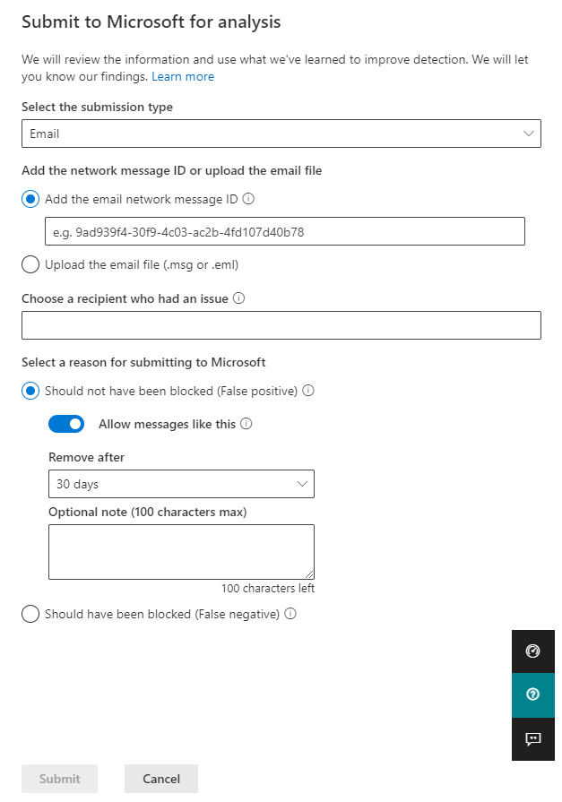

# <a name="add-allows-in-the-tenant-allowblock-list"></a>在租户允许/阻止列表中添加允许

[!INCLUDE [Microsoft 365 Defender rebranding](../includes/microsoft-defender-for-office.md)]

**适用对象**
- [Exchange Online Protection](exchange-online-protection-overview.md)
- [Microsoft Defender for Office 365 计划 1 和计划 2](defender-for-office-365.md)
- [Microsoft 365 Defender](../defender/microsoft-365-defender.md)

管理员无法添加允许直接进入租户允许/阻止列表。 相反，使用管理员提交过程提交被阻止的邮件，以便相应的 URL、文件和/或发件人将添加到租户允许/阻止列表。 如果文件、URL 或发件人的阻止未发生，将不会创建允许。 在大多数情况下，如果邮件被确定为错误阻止的误报，则只要需要，允许就会保留一段时间，以便系统能够自然地允许它们。

> [!IMPORTANT]
> 由于 Microsoft 为您管理允许，因此将删除不需要或视为错误允许的发件人、URL 或文件。 这是为了保护你的环境并防止允许的错误配置。 如果您不一致，可能需要支持案例来帮助确定邮件仍被视为错误的原因。

## <a name="add-sender-allows-using-the-submissions-portal"></a>添加发件人允许使用提交门户 

允许发件人 (或域) **中"** 提交"页上Microsoft 365 Defender。 

1. In the Microsoft 365 Defender portal at <https://security.microsoft.com>， go to **Actions & submissions**\>. 或者，若要直接转到 **提交页面，** 请使用 <https://security.microsoft.com/reportsubmission>。

2. 在 **"提交"** 页上，确认" **电子邮件** "选项卡已选中，然后单击"  **提交给 Microsoft 进行分析**。

3. 通过添加 **网络邮件** ID 或上载电子邮件文件，使用"提交到 Microsoft 进行审阅"飞出以提交邮件。 

4. 在 **"选择提交到 Microsoft** 的原因"部分中，选择"不应已被阻止 (**误报) "**。 

5. 启用" **允许类似此选项的邮件** "。 

6. 从 **"删除后** "下拉列表中，指定您希望允许选项工作多久。

7. 完成后，单击"提交 **"** 按钮。

> [!div class="mx-imgBorder"]
> 

## <a name="add-url-allows-using-the-submissions-portal"></a>添加 URL 允许使用提交门户

允许 url on the **Submissions** page in Microsoft 365 Defender.

1. In the Microsoft 365 Defender portal at <https://security.microsoft.com>， go to **Actions & submissions**\>. 或者，若要直接转到 **提交页面，** 请使用 <https://security.microsoft.com/reportsubmission>。

2. 在" **提交"** 页上，选择 **"URL** "选项卡，然后单击"  **提交给 Microsoft 进行分析**。

3. 使用 **"提交到 Microsoft 进行审阅** "飞出以通过添加 URL 提交邮件。

4. 在 **"选择提交到 Microsoft** 的原因"部分中，选择"不应已被阻止 (**误报) "**。

5. 启用" **允许类似 URL"选项** 。

6. 从 **"删除后** "下拉列表中，指定允许选项的可用时间。

7. 完成后，单击"提交 **"** 按钮。

> [!div class="mx-imgBorder"]
> 

## <a name="add-file-allows-using-the-submissions-portal"></a>添加文件允许使用提交门户

允许提交 **页面上** 的文件Microsoft 365 Defender。

In the Microsoft 365 Defender portal at <https://security.microsoft.com>， go to **Actions & submissions**\>. 或者，若要直接转到 **提交页面，** 请使用 <https://security.microsoft.com/reportsubmission>。

2. 在" **提交"** 页上，选择" **电子邮件附件"** 选项卡，然后单击"  **提交给 Microsoft 进行分析**。

3. 使用 **"提交到 Microsoft 查看** "飞出按钮，通过添加文件或文件提交邮件。

4. 在 **"选择提交到 Microsoft** 的原因"部分中，选择"不应已被阻止 (**误报) "**。

5. 启用" **允许类似这样的文件"** 选项。

6. 从 **"删除后** "下拉列表中，指定允许选项的可用时间。

7. 完成后，单击"提交 **"** 按钮。

> [!div class="mx-imgBorder"]
> 


## <a name="create-spoofed-sender-allow-entries-using-microsoft-365-defender"></a>创建欺骗性发件人允许使用Microsoft 365 Defender

> [!NOTE]
> 
> - 仅 _明确_ 允许或阻止欺骗用户和域对中定义的发送基础结构的组合。
> - 为域对配置允许或阻止条目时，来自该域对的邮件将不再显示在欺骗智能见解中。
> - 欺骗性发件人的条目永不过期。
> - 欺骗同时支持允许和阻止。 URL 仅支持允许。

1. In the Microsoft 365 Defender portal at <https://security.microsoft.com>， go to **Email & collaboration** \> **Policies & rules** \> **Tenant** \> **Allow/Block Lists** in the **Rules** section. 或者，若要直接转到租户 **允许/阻止列表** 页面，请使用 <https://security.microsoft.com/tenantAllowBlockList>。

2. 在" **租户允许/阻止列表"** 页上，选择" **欺骗"** 选项卡，然后单击"添加  **添加** 。

3. 在出现的 **"添加新域对** "飞出中，配置以下设置：
   - **添加包含通配符的新域对**：每行输入一个域对，最多输入 20 个域对。 有关欺骗性发件人条目的语法的详细信息，请参阅 [管理租户允许/阻止列表](tenant-allow-block-list.md)。
   - **欺骗类型**：选择下列值之一：
     - **内部**：欺骗性发件人位于你的组织所属的域中， ([接受的)](/exchange/mail-flow-best-practices/manage-accepted-domains/manage-accepted-domains) 。
     - **外部**：欺骗性发件人位于外部域中。
   - **操作**：选择 **"允许"** 或" **阻止"**。

4. 完成后，单击“**添加**”。

## <a name="add-spoofed-sender-allow-entries-using-powershell"></a>使用 PowerShell 添加欺骗性发件人允许条目

若要在 [PowerShell](/exchange/connect-to-exchange-online-powershell) 的租户允许/阻止列表中添加欺骗Exchange Online条目，请使用以下语法：

```powershell
New-TenantAllowBlockListSpoofItems -SpoofedUser <Domain | EmailAddress | *> -SendingInfrastructure <Domain | IPAddress/24> -SpoofType <External | Internal> -Action <Allow | Block>
```

有关语法和参数的详细信息，请参阅 [New-TenantAllowBlockListSpoofItems](/powershell/module/exchange/new-tenantallowblocklistspoofitems)。

## <a name="related-articles"></a>相关文章

- [管理员提交](admin-submission.md)
- [报告误报和漏报](report-false-positives-and-false-negatives.md)
