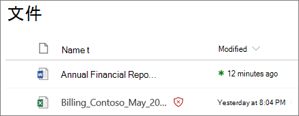
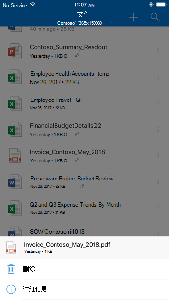
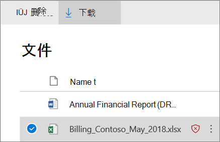

# 用于 SharePoint、OneDrive 和 Microsoft Teams 的安全附件Safe Attachments for SharePoint, OneDrive, and Microsoft Teams

[!INCLUDE [Microsoft 365 Defender rebranding](../includes/microsoft-defender-for-office.md)]

**适用对象****Applies to**
- [Microsoft Defender for Office 365 计划 1 和计划 2Microsoft Defender for Office 365 plan 1 and plan 2](defender-for-office-365.md)
- [Microsoft 365 DefenderMicrosoft 365 Defender](../defender/microsoft-365-defender.md)

[Microsoft Defender for Office 365](whats-new-in-defender-for-office-365.md)中的 SharePoint、OneDrive 和 Microsoft Teams 的安全附件为已在上传时由 Microsoft [365](virus-detection-in-spo.md)中的常见病毒检测引擎扫描的文件提供了一层额外的保护。Safe Attachments for SharePoint, OneDrive, and Microsoft Teams in [Microsoft Defender for Office 365](whats-new-in-defender-for-office-365.md) provides an additional layer of protection for files that have already been scanned at upload time by the [common virus detection engine in Microsoft 365](virus-detection-in-spo.md). SharePoint、OneDrive 和 Microsoft Teams 的安全附件可帮助检测和阻止团队网站和文档库中标识为恶意的现有文件。Safe Attachments for SharePoint, OneDrive, and Microsoft Teams helps detect and block existing files that are identified as malicious in team sites and document libraries.

默认情况下，SharePoint、OneDrive 和 Microsoft Teams 的安全附件未启用。Safe Attachments for SharePoint, OneDrive, and Microsoft Teams is not enabled by default. 若要启用它，请参阅启用 [SharePoint、OneDrive](turn-on-mdo-for-spo-odb-and-teams.md)和 Microsoft Teams 的安全附件。To turn it on, see [Turn on Safe Attachments for SharePoint, OneDrive, and Microsoft Teams](turn-on-mdo-for-spo-odb-and-teams.md).

## SharePoint、OneDrive 和 Microsoft Teams 的安全附件的工作原理How Safe Attachments for SharePoint, OneDrive, and Microsoft Teams works

如果启用 SharePoint、OneDrive 和 Microsoft Teams 的安全附件，并且将文件标识为恶意文件，则使用与文件存储的直接集成锁定该文件。When Safe Attachments for SharePoint, OneDrive, and Microsoft Teams is enabled and identifies a file as malicious, the file is locked using direct integration with the file stores. 下图显示了在库中检测到的恶意文件的示例。The following image shows an example of a malicious file detected in a library.

尽管阻止的文件仍在文档库和 Web、移动或桌面应用程序中列出，但用户无法打开、复制、移动或共享该文件。Although the blocked file is still listed in the document library and in web, mobile, or desktop applications, people can't open, copy, move, or share the file. 但他们可以删除阻止的文件。But they can delete the blocked file.

下面是阻止的文件在移动设备上的外观示例：Here's an example of what a blocked file looks like on a mobile device:

默认情况下，用户可以下载阻止的文件。By default, people can download a blocked file. 下面是在移动设备上下载阻止的文件的外观：Here's what downloading a blocked file looks like on a mobile device:

SharePoint Online 管理员可以阻止用户下载恶意文件。SharePoint Online admins can prevent people from downloading malicious files. 有关说明，请参阅 [使用 SharePoint Online PowerShell 阻止用户下载恶意文件](turn-on-mdo-for-spo-odb-and-teams.md#step-2-recommended-use-sharepoint-online-powershell-to-prevent-users-from-downloading-malicious-files)。For instructions, see [Use SharePoint Online PowerShell to prevent users from downloading malicious files](turn-on-mdo-for-spo-odb-and-teams.md#step-2-recommended-use-sharepoint-online-powershell-to-prevent-users-from-downloading-malicious-files).

若要了解有关文件被检测为恶意文件时的用户体验，请参阅 [在 SharePoint Online、OneDrive](https://support.microsoft.com/office/01e902ad-a903-4e0f-b093-1e1ac0c37ad2)或 Microsoft Teams 中发现恶意文件时要执行哪些操作。To learn more about the user experience when a file has been detected as malicious, see [What to do when a malicious file is found in SharePoint Online, OneDrive, or Microsoft Teams](https://support.microsoft.com/office/01e902ad-a903-4e0f-b093-1e1ac0c37ad2).

## 查看有关 SharePoint、OneDrive 和 Microsoft Teams 的安全附件检测到的恶意文件的信息View information about malicious files detected by Safe Attachments for SharePoint, OneDrive, and Microsoft Teams

Microsoft Defender for Office 365 标识为恶意的文件将显示在 [Microsoft Defender for Office 365](view-reports-for-mdo.md) 的报告和资源管理器 [ (](threat-explorer.md)以及实时检测) 。Files that are identified as malicious by Microsoft Defender for Office 365 will show up in [reports for Microsoft Defender for Office 365](view-reports-for-mdo.md) and in [Explorer (and real-time detections)](threat-explorer.md).

截至 2018 年 5 月，当 Microsoft Defender for Office 365 将文件标识为恶意文件时，该文件也可隔离。As of May 2018, when a file is identified as malicious by Microsoft Defender for Office 365, the file is also available in quarantine. 有关详细信息，请参阅使用安全与& [中心管理隔离的文件](manage-quarantined-messages-and-files.md#microsoft-defender-for-office-365-only-use-the-security--compliance-center-to-manage-quarantined-files)。For more information, see [Use the Security & Compliance Center to manage quarantined files](manage-quarantined-messages-and-files.md#microsoft-defender-for-office-365-only-use-the-security--compliance-center-to-manage-quarantined-files).

## 请记住以下几点Keep these points in mind

- Defender for Office 365 不会扫描 SharePoint Online、OneDrive for Business 或 Microsoft Teams 中的每个文件。Defender for Office 365 will not scan every single file in SharePoint Online, OneDrive for Business, or Microsoft Teams. 这是设计使然的。This is by design. 以异步方式扫描文件。Files are scanned asynchronously. 此过程使用共享和来宾活动事件以及智能启发和威胁信号来识别恶意文件。The process uses sharing and guest activity events along with smart heuristics and threat signals to identify malicious files.

- 确保 SharePoint 网站配置为使用新式 [体验](/sharepoint/guide-to-sharepoint-modern-experience)。Make sure your SharePoint sites are configured to use the [Modern experience](/sharepoint/guide-to-sharepoint-modern-experience). 无论使用新式体验还是经典视图，Defender for Office 365 保护都适用;但是，文件被阻止的视觉指示器仅在新式体验中可用。Defender for Office 365 protection applies whether the Modern experience or the Classic view is used; however, visual indicators that a file is blocked are available only in the Modern experience.

- SharePoint、OneDrive 和 Microsoft Teams 的安全附件是组织的整体威胁防护策略的一部分，其中包括 Exchange Online Protection (EOP) 中的反垃圾邮件和反恶意软件保护，以及 Microsoft Defender for Office 365 中的安全链接和安全附件。Safe Attachments for SharePoint, OneDrive, and Microsoft Teams is part of your organization's overall threat protection strategy, which includes anti-spam and anti-malware protection in Exchange Online Protection (EOP), as well as Safe Links and Safe Attachments in Microsoft Defender for Office 365. 若要了解更多信息，请参阅 Office [365 中的威胁防护](protect-against-threats.md)。To learn more, see [Protect against threats in Office 365](protect-against-threats.md).