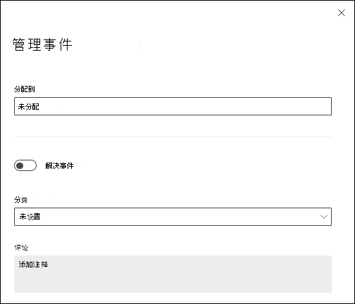

# 在Microsoft 365 Defender中管理来自Microsoft Defender for Office 365的事件和警报

Microsoft 365 Defender中的[一个事件](/microsoft-365/security/defender/incidents-overview)是相关警报和相关数据的集合，用于定义攻击的完整故事。 Defender for Office 365 [警报](/microsoft-365/compliance/alert-policies#default-alert-policies)、[自动调查和响应 (AIR)](office-365-air.md#the-overall-flow-of-air)，以及调查结果在Microsoft 365 Defender<https://security.microsoft.com/incidents-queue>的 **“事件**”页上进行本机集成和关联。 我们将此页面称为 _“事件”队列_。

当恶意或可疑活动影响实体 (（例如电子邮件、用户或邮箱) ）时，会创建警报。 警报提供了有关正在进行的或已完成的攻击的宝贵见解。 但是，持续的攻击可能会影响多个实体，从而导致来自不同源的多个警报。 某些内置警报会自动触发 AIR playbook。 这些 playbook 执行一系列调查步骤，以查找其他受影响的实体或可疑活动。

Defender for Office 365警报、调查及其数据自动关联。 确定关系后，系统会创建一个事件，以便安全团队能够查看整个攻击。

我们强烈建议 SecOps 团队管理事件队列<https://security.microsoft.com/incidents-queue>中Defender for Office 365的事件和警报。 此方法具有以下优势：

- 多个 [管理](/microsoft-365/security/defender/manage-incidents)选项：
  - 优先 级
  - 筛选
  - 分类
  - 标记管理

  可以直接从队列中获取事件，也可以将其分配给某人。 注释和注释历史记录有助于跟踪进度。

- 如果攻击影响到受 Microsoft Defender\* 保护的其他工作负荷，则相关警报、调查及其数据也与同一事件相关。

  \*Microsoft Defender for Endpoint、Microsoft Defender for Identity 和Microsoft Defender for Cloud Apps。

- 由于逻辑由系统提供，因此不需要复杂的相关逻辑。

- 如果相关逻辑不能完全满足需求，则可以将警报添加到现有事件或创建新事件。

- 相关Defender for Office 365警报、AIR 调查和调查中的挂起操作会自动添加到事件中。

- 如果 AIR 调查未发现任何威胁，系统会自动解决相关警报。 如果事件中的所有警报都已解决，则事件状态也会更改为 **“已解决**”。

- 相关证据和响应操作会自动聚合在事件 **的证据和响应** 选项卡上。

- 安全团队成员可以直接从事件执行响应操作。 例如，他们可以软删除邮箱中的电子邮件或从邮箱中删除可疑的收件箱规则。

- 仅当恶意电子邮件的最新传递位置是云邮箱时，才创建建议的电子邮件操作。

- 挂起的电子邮件操作将根据最新的传递位置进行更新。 如果已通过手动操作修正电子邮件，则状态将反映这一点。

- 建议的操作仅针对确定为最关键威胁的电子邮件和电子邮件群集创建：
  - 恶意软件
  - 高可信度网络钓鱼
  - 恶意 URL
  - 恶意文件

> [!NOTE]
> 事件不只是表示静态事件。 它们也代表随着时间推移而发生的攻击故事。 随着攻击的进行，新的Defender for Office 365警报、AIR 调查及其数据不断添加到现有事件中。

在Microsoft 365 Defender门户<https://security.microsoft.com/incidents-queue>的 **“事件”** 页上管理事件：

在 Microsoft Sentinel <https://portal.azure.com/#blade/HubsExtension/BrowseResource/resourceType/microsoft.securityinsightsarg%2Fsentinel>的 **“事件**”页上管理事件：：

## 要执行的响应操作

安全团队可以使用Defender for Office 365工具对电子邮件执行各种响应操作：

- 可以删除邮件，但也可以对电子邮件执行以下操作：
  - 移动到收件箱
  - 移动到垃圾邮件
  - 移至"已删除邮件"
  - 软删除
  - 硬删除。

  可以从以下位置执行以下操作：

  - “**事件**”页上事件详细信息的“**证据和响应**”选项卡 (<https://security.microsoft.com/incidents-queue> 建议的) 。
  - **威胁资源管理器** 在 <https://security.microsoft.com/threatexplorer>.
  - 统一 **的操作中心**。<https://security.microsoft.com/action-center/pending>

- 可以使用威胁资源管理器中的 **触发器调查** 操作手动启动任何电子邮件上的 AIR playbook。

- 可以使用 [威胁资源管理器](threat-explorer.md) 或 [管理员提交](admin-submission.md)直接向 Microsoft 报告误报或误报检测。

- 可以使用 [租户允许/阻止列表](tenant-allow-block-list.md)阻止未检测到的恶意文件、URL 或发件人。

Defender for Office 365操作无缝地集成到狩猎体验中，操作的历史记录在统一 **行动中心的**<https://security.microsoft.com/action-center/history>**“历史记录**”选项卡上可见。

执行操作的最有效方法是在Microsoft 365 Defender中使用内置与事件的集成。 只需批准 AIR 在Microsoft 365 Defender中事件[的证据和响应](/microsoft-365/security/defender/investigate-incidents#evidence-and-response)选项卡上Defender for Office 365建议的操作。 出于以下原因，建议使用此方法进行标记操作：

- 你将调查完整的攻击故事。
- 可从与其他工作负荷（Microsoft Defender for Endpoint、Microsoft Defender for Identity 和Microsoft Defender for Cloud Apps）的内置关联中获益。
- 你可以从单个位置对电子邮件执行操作。

根据手动调查或搜寻活动的结果，对电子邮件采取措施。 [威胁资源管理器](threat-explorer.md) 允许安全团队成员对云邮箱中可能仍然存在的任何电子邮件采取行动。 他们可以对组织中用户之间发送的组织内消息采取行动。 威胁资源管理器数据可用于过去 30 天。
