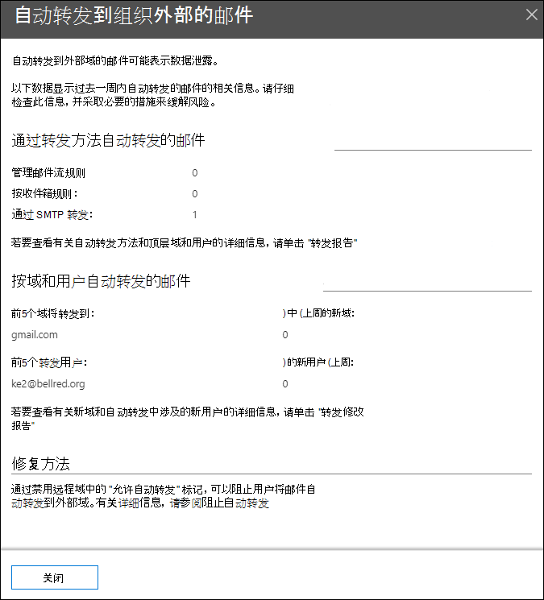

# 安全与合规中心中的自动转发&见解

[!INCLUDE [Microsoft 365 Defender rebranding](../includes/microsoft-defender-for-office.md)]

**适用对象**
- [Exchange Online Protection](exchange-online-protection-overview.md)
- [Microsoft Defender for Office 365 计划 1 和计划 2](defender-for-office-365.md)
- [Microsoft 365 Defender](../defender/microsoft-365-defender.md)

安全 &**与** 合规中心的"邮件流 ["](https://protection.office.com)仪表板中的"自动转发邮件"见解显示有关从组织自动转发给外部域中收件人的邮件的信息。

## 自动转发的邮件详细信息

单击小组件中的邮件数时，将显示一个显示有关自动转发邮件的详细信息的飞出窗格：

- **通过转发方法自动转发邮件**：

  - **按邮件流规则**
  - **按收件箱规则**
  - **通过 SMTP 转发**：此方法指示管理员可以在邮箱上配置的自动转发，如为邮箱配置 [电子邮件转发中所述](/Exchange/recipients-in-exchange-online/manage-user-mailboxes/configure-email-forwarding)。
  - 指向转发 [报告的链接，](view-mail-flow-reports.md#forwarding-report) 了解更多详细信息。

- **由域和用户自动转发的邮件**：

  - **转发到的前 5 个域**
  - **上周 (新域)**
  - **前 5 大转发用户**
  - **上周 (新用户)**
  - 有关更多详细信息 [，请参阅转发修改](mfi-new-users-forwarding-email.md#forwarding-modifications-report) 报告的链接。

## 见解

根据报告数据生成两个见解：

- [新用户转发电子邮件](mfi-new-users-forwarding-email.md)
- [正在转发电子邮件的新域](mfi-new-domains-being-forwarded-email.md)

## 另请参阅

有关邮件流仪表板中其他见解的信息，请参阅安全与合规中心内& [见解](mail-flow-insights-v2.md)。