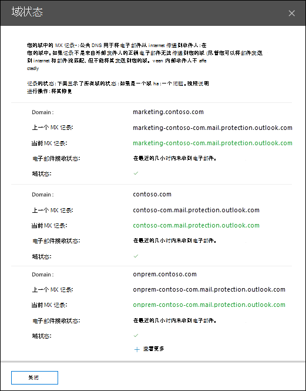

# 安全与合规中心内热门域&状态见解

[!INCLUDE [Microsoft 365 Defender rebranding](../includes/microsoft-defender-for-office.md)]

安全 **与合规** 中心的邮件流仪表板中的"热门域邮件流状态 "&可为你提供组织的当前邮件流状态。

此见解可帮助你识别遇到 *_*_* 邮件流 _ 问题的域并排除故障。 例如，域无法接收外部电子邮件，因为该域已过期或域的 MX 记录不正确。

在小组件中单击" _ *查看* 详细信息* "时，将显示"域状态"飞出控件，其中显示每个域状态的更多详细信息：

- **域**
- **以前的 MX 记录**
- **当前 MX 记录**
- **电子邮件接收状态**
- 域状态：绿色选中标记表示单击小组件) 时当前的 MX 记录 (与记录的值匹配，并且域在过去两小时内已收到电子邮件。

  红色 X 表示 MX 记录已更改，并且域在过去 6 小时内未收到任何电子邮件。 这很可能表示你的域已过期，或者 MX 记录更新不正确。 请与域注册机构或 DNS 托管服务联系，以查看域是否已过期，或者域的 MX 记录是否不正确。

可以单击 **"查看更多"** 查看更多域的相同信息。

## 另请参阅

有关邮件流仪表板中其他见解的信息，请参阅安全与合规中心& [见解](mail-flow-insights-v2.md)。
