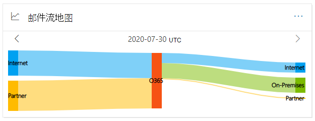
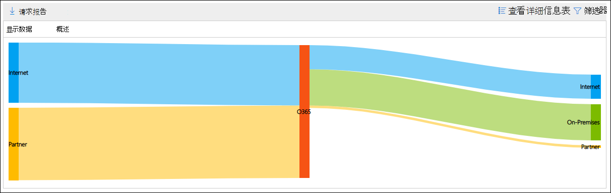
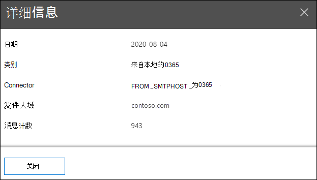

# 安全与合规中心&流程图

[!INCLUDE [Microsoft 365 Defender rebranding](../includes/microsoft-defender-for-office.md)]

**适用对象**
- [Exchange Online Protection](exchange-online-protection-overview.md)
- [Microsoft Defender for Office 365 计划 1 和计划 2](defender-for-office-365.md)
- [Microsoft 365 Defender](../defender/microsoft-365-defender.md)

安全 **与合规中心的**"邮件 流"仪表板中的"邮件流 ["&可](https://protection.office.com)深入了解邮件在组织中如何流动。 您可以使用此信息了解模式、识别异常并修复发生的问题。

默认情况下，小部件在称为 *Sankey* 图表的图表中显示前一天的邮件流模式。 可以使用向左箭头  和向右  显示不同日期的信息。 每种不同的颜色表示通过不同入站或出站连接器的邮件流 (或不使用连接器) 。 如果将鼠标悬停在特定颜色上，将显示该类型的连接器的消息数。

## 邮件流映射的报告视图

单击" **邮件流映射"** 小组件将进入 **"邮件流映射"** 报告。

下表中提供了以下报表视图：

- **显示数据：概述**：这基本上是小部件的较大视图。 如果将鼠标悬停在特定颜色上，将显示该类型的连接器的消息数。

  

- **显示数据：详细信息**：此视图显示有关连接器和目标域的详细信息。 列出顶级发件人和收件人域，其余域放在"其他 **"中**。 如果将鼠标悬停在特定颜色和分区上，将显示消息数。

  

If you click **Filters** in a 报表视图， you can specify a date range with **Start date** and **End date**.

若要将特定日期范围的报告通过电子邮件发送给一个或多个收件人，请单击"请求 **下载"。**

相关见解显示在邮件流映射下方（如果它们 (例如，修复 [可能的邮件循环见解](mfi-mail-loop-insight.md)）。

## 邮件流映射的详细信息表视图

如果单击 **视图中的"** 查看详细信息报表视图，将显示以下信息：

- **日期**
- **类别**
- **连接器/第三方服务提供商**
- **发件人/收件人域**
- **邮件计数**

如果在详细信息 **表** 视图中单击筛选器，可以指定开始日期和 **结束日期的日期范围**。 

如果您选择一行，则类似的详细信息将显示在一个飞出内容中：

若要将特定日期范围的报告通过电子邮件发送给一个或多个收件人，请单击"请求 **下载"。**

若要返回到报告视图，请单击"查看 **报告"。**

## 另请参阅

有关邮件流仪表板中其他见解的信息，请参阅安全与合规中心& [见解](mail-flow-insights-v2.md)。
