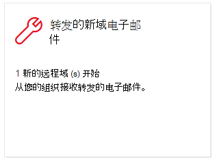

# 安全与合规中心内转发电子邮件见解&域

[!INCLUDE [Microsoft 365 Defender rebranding](../includes/microsoft-defender-for-office.md)]

**适用对象**
- [Exchange Online Protection](exchange-online-protection-overview.md)
- [Microsoft Defender for Office 365 计划 1 和计划 2](defender-for-office-365.md)
- [Microsoft 365 Defender](../defender/microsoft-365-defender.md)

将电子邮件转发给特定域中的外部收件人有有效的业务原因。 但是，当贵组织的用户突然开始将邮件转发到组织中没有人将邮件转发到新域的域中时， (可疑) 。

此条件可能指示用户帐户遭到入侵。 如果您怀疑帐户已被泄露，请参阅响应遭到入侵 [的电子邮件帐户](responding-to-a-compromised-email-account.md)。

安全 **与合规** 中心内 [&](https://protection.office.com) 转发电子邮件的新域将通知你，当组织用户将邮件转发到新域时。

此见解仅在检测到问题时显示，并且显示在"转发 [报告"页上](view-mail-flow-reports.md#forwarding-report) 。

单击小部件时，将出现一个飞出控件，您可以在其中找到有关转发邮件的更多详细信息，包括返回 [转发报告的链接](view-mail-flow-reports.md#forwarding-report)。

单击"报告仪表板"或"仪表板"上的"最热门见解&建议"区域中的"查看所有见解"后， (**进入** 此详细信息 \>  <https://protection.office.com/insightdashboard>) 。

若要阻止自动将邮件转发到外部域，请为部分或所有外部域配置远程域。 有关详细信息，请参阅管理[远程域Exchange Online。](/Exchange/mail-flow-best-practices/remote-domains/manage-remote-domains)

## 相关主题

有关邮件流仪表板中其他见解的信息，请参阅安全与合规中心& [见解](mail-flow-insights-v2.md)。