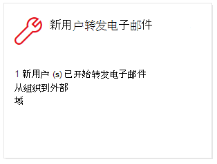
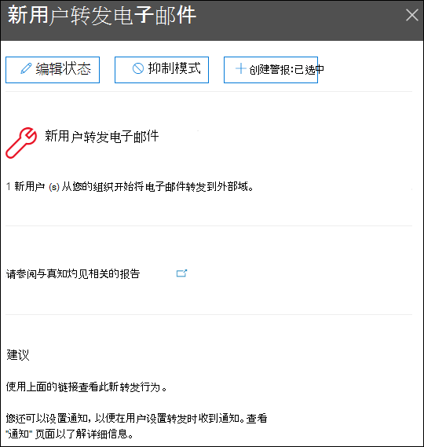
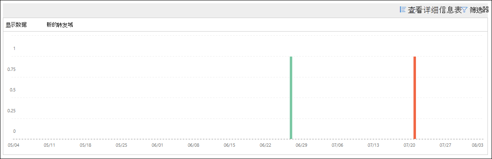

# 新用户在安全与合规中心&电子邮件见解

[!INCLUDE [Microsoft 365 Defender rebranding](../includes/microsoft-defender-for-office.md)]

**适用对象**
- [Exchange Online Protection](exchange-online-protection-overview.md)
- [Microsoft Defender for Office 365 计划 1 和计划 2](defender-for-office-365.md)
- [Microsoft 365 Defender](../defender/microsoft-365-defender.md)

当组织中新的用户帐户突然开始将电子邮件转发到外部域时，这是可疑的。

当 **组织中新** 创建的用户将邮件 [转发到](https://protection.office.com) 外部域时，安全与合规中心&转发的电子邮件见解会通知你。 此条件可能指示已使用遭到入侵的管理员帐户创建新用户。 如果您怀疑帐户已被泄露，请参阅 [响应遭到入侵的电子邮件帐户](responding-to-a-compromised-email-account.md)。

此见解仅在检测到问题时显示，并且显示在"转发 [报告"页上](view-mail-flow-reports.md#forwarding-report) 。

单击小部件时，将出现一个飞出控件，您可以在其中找到有关转发邮件的更多详细信息，包括指向本文稍后所述的转发修改报告的链接。

单击"报告仪表板"或"仪表板"上的"最热门见解&建议"区域中的"查看所有见解"后， (**进入** \> **此详细信息** <https://protection.office.com/insightdashboard>) 。

可以单击" **查看与见解关联的** 报告"链接转到"转发修改" **报告，如下** 一节中所述。

## 转发修改报告

转发 **修改报告显示** 有关自动转发自组织中发件人的邮件的详细信息：

- 将邮件转发到外部域的新创建的帐户。
- 将邮件转发到组织中其他发件人从未转发给的外部域的帐户。

这些类型的转发邮件可能会带来安全或合规性风险，并可能指示帐户遭到入侵。

该报告包含最多 90 天的数据。 默认情况下，报告显示最近 7 天的数据。

此报告不直接在 [邮件流仪表板](mail-flow-insights-v2.md) 或报表仪表板 [中提供](view-mail-flow-reports.md)。 除了单击"新用户转发电子邮件见解"中的"查看与见解关联的报告"链接，您还可以通过以下操作访问报告：

- 单击 **"正在转发的新** 域"电子邮件见解的详细信息中的 ["转发通知报告"链接](mfi-new-domains-being-forwarded-email.md)。
- 打开 <https://protection.office.com/reportv2?id=MailFlowNewForwarding>。

### 转发修改报告的报表视图

下表中提供了以下报表视图：

- **显示其数据：新转发用户**：

  

- **显示数据：新转发域**：

  

如果 **单击"筛选器**"，报表视图"开始日期"和"结束日期"来指定 **日期范围**。

### 转发修改报告的详细信息表视图

如果单击 **"查看详细信息** 表"，则显示的信息取决于您所查看的图表：

- **显示其数据：新转发用户**：

  - **名称**：发件人的电子邮件地址。
  - **转发类型**
  - **收件人地址**
  - **详细信息**
  - **Count**
  - **第一个转发日期**

- **显示数据：新转发域**：

  - **名称**：发件人的电子邮件域。
  - **转发类型**
  - **收件人地址**
  - **详细信息**
  - **Count**
  - **第一个转发日期**

如果在详细信息 **表** 视图中单击"筛选器"，可以指定开始日期和 **结束日期的日期范围**。

如果从表中选择一行，将显示"详细信息"飞出，并包含以下信息：

- 名称 **：这是** 发件人的电子邮件地址 ("显示数据：新建转发用户查看) "中的发件人电子邮件地址或发件人的电子邮件域 (from **Show data for： New forwarding domains** view) 。
- **转发类型**
- **收件人**
- **详细信息**
- **Count**
- **开始日期**
- **建议**：你可以从此处单击链接来管理用户Microsoft 365 管理中心。

若要返回到报告视图，请单击" **查看报告"**。

## 相关主题

有关邮件流仪表板中其他见解的信息，请参阅安全与合规中心内& [见解](mail-flow-insights-v2.md)。
