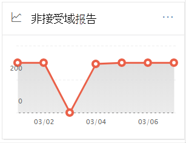
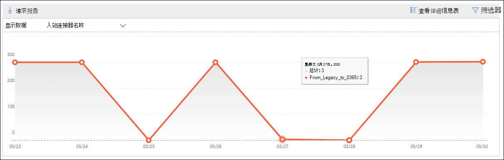
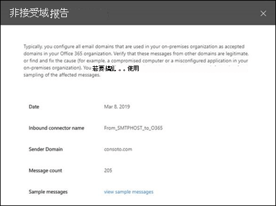

# 安全与合规中心中的未接受&报告Non-accepted domain report in the Security & Compliance Center

[!INCLUDE [Microsoft 365 Defender rebranding](../includes/microsoft-defender-for-office.md)]

**适用对象****Applies to**
- [Exchange Online ProtectionExchange Online Protection](exchange-online-protection-overview.md)
- [Microsoft Defender for Office 365 计划 1 和计划 2Microsoft Defender for Office 365 plan 1 and plan 2](defender-for-office-365.md)
- [Microsoft 365 DefenderMicrosoft 365 Defender](../defender/microsoft-365-defender.md)

安全与合规中心内邮件流仪表板中的"非接受域"报告显示有关来自本地电子邮件组织的邮件的信息，其中发件人的域未配置为 Microsoft 365 组织中接受的域。 [&](https://protection.office.com)The **Non-accepted domain** report in the [Mail flow dashboard](mail-flow-insights-v2.md) in the [Security & Compliance Center](https://protection.office.com) displays information about messages from your on-premises email organization where the sender's domain isn't configured as an accepted domain in your Microsoft 365 organization.

如果我们有数据可以证明这些邮件的意图是恶意的，Microsoft 365 可能会限制这些邮件。Microsoft 365 might throttle these messages if we have data to prove that the intent of these messages is malicious. 因此，了解发生的情况并解决该问题非常重要。Therefore, it's important for you to understand what's happening and to fix the issue.

## 未接受域报告的报告视图Report view for the Non-accepted domain report

单击"非接受 **域"小部件上的** 图表将进入 **"未接受域"** 报告。Clicking the chart on the **Non-accepted domain** widget will take you to the **Non-accepted domain** report.

默认情况下，将显示所有受影响的连接器的活动。By default, the activity for all affected connectors is shown. If you click **Show data for**， you can select a specific connector from the dropdown.If you click **Show data for**, you can select a specific connector from the dropdown.

如果将鼠标悬停在图表中 () 的数据点上，你将看到连接器的邮件总数。If you hover over a data point (day) in the chart, you'll see the total number of messages for the connector.

## 未接受域报告的详细信息表视图Details table view for the Non-accepted domain report

如果单击 **视图中的"** 查看详细信息"报表视图，将显示以下信息：If you click **View details table** in a report view, the following information is shown:

- "日期"**Date**
- **入站连接器名称****Inbound connector name**
- **发件人域****Sender domain**
- **邮件计数****Message count**
- **示例邮件**：受影响邮件示例的邮件 ID。**Sample messages**: The message IDs of a sample of affected messages.

如果在详细信息 **表** 视图中单击"筛选器"，可以指定开始日期和 **结束日期的日期范围**。 If you click **Filters** in a details table view, you can specify a date range with **Start date** and **End date**.

若要将特定日期范围的报告通过电子邮件发送给一个或多个收件人，请单击"请求 **下载"。**To email the report for a specific date range to one or more recipients, click **Request download**.

选择表格中的行时，将显示一个包含以下信息的飞出图：When you select a row in the table, a flyout appears with the following information:

- "日期"**Date**
- **入站连接器名称****Inbound connector name**
- **发件人域****Sender domain**
- **邮件计数****Message count**
- **示例邮件**：可以单击 **"查看示例** 邮件"以查看 [受影响邮件](message-trace-scc.md) 示例的邮件跟踪结果。**Sample messages**: You can click **View sample messages** to see the [message trace](message-trace-scc.md) results for a sample of the affected messages.

若要返回到报告视图，请单击"查看 **报告"。**To go back to the reports view, click **View report**.

## 相关主题Related topics

有关邮件流仪表板中其他见解的信息，请参阅安全与合规中心内& [见解](mail-flow-insights-v2.md)。For information about other insights in the Mail flow dashboard, see [Mail flow insights in the Security & Compliance Center](mail-flow-insights-v2.md).
