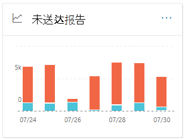
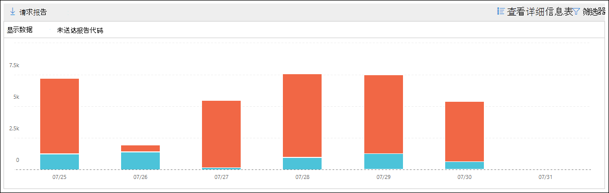

# 安全与合规中心&未送达报告

[!INCLUDE [Microsoft 365 Defender rebranding](../includes/microsoft-defender-for-office.md)]

**适用对象**
- [Exchange Online Protection](exchange-online-protection-overview.md)
- [Microsoft Defender for Office 365 计划 1 和计划 2](defender-for-office-365.md)
- [Microsoft 365 Defender](../defender/microsoft-365-defender.md)

安全与合规中心内"邮件流"仪表板中的"未送达"报告显示未送达报告 (也称为"未送达"或针对组织中用户的退回邮件) 中遇到的错误代码。 [&](https://protection.office.com) 此报告显示了 NDR 的详细信息，因此您可以解决电子邮件传递问题。

## 未送达报告的报告视图

单击" **未送达报告"** 小部件将进入 **未送达报告**。

默认情况下，将显示所有错误代码的活动。 If you click **Show data for**， you can select a specific error code from the dropdown.

如果将鼠标悬停在图表中 (特定) 显示的错误代码，你将看到该错误的消息总数。

## 未送达报告的详细信息表视图

如果单击 **视图中的"** 查看详细信息报表视图，将显示以下信息：

- **日期**
- **未送达报告代码**
- **Count**
- **示例邮件**：受影响邮件示例的邮件 ID。

如果在详细信息 **表** 视图中单击筛选器，可以指定开始日期和 **结束日期的日期范围**。 

若要将特定日期范围的报告通过电子邮件发送给一个或多个收件人，请单击"请求 **下载"。**

选择表格中的行时，将显示一个包含以下信息的飞出图：

- **Date**
- **未送达报告代码**：可以单击链接来查找有关特定错误代码的原因和解决方案的详细信息。
- **Count**
- **示例邮件**：可以单击 **"查看示例** 邮件"以查看 [受影响邮件](message-trace-scc.md) 示例的邮件跟踪结果。

## 相关主题

有关邮件流仪表板中其他见解的信息，请参阅安全与合规中心内& [见解](mail-flow-insights-v2.md)。
