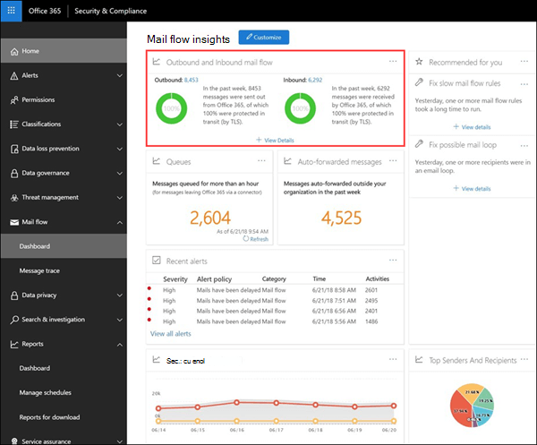

# 入站和出站邮件流Outbound and inbound mail flow

**出站和入站邮件流**小组件将**连接器报告**和以前的**TLS 概述报告**中的信息合并到一个位置。The **Outbound and inbound mail flow** widget combines the information from the **Connector Report** and the former **TLS Overview Report** in one place.

小组件中的信息与 Office 365 中的连接器和 TLS 邮件保护有关。The information in the widget is related to connectors and TLS message protection in Office 365. 有关详细信息，请参阅以下主题：For more information, see these topics:

- [Configure mail flow using connectors in Office 365Configure mail flow using connectors in Office 365](https://docs.microsoft.com/exchange/mail-flow-best-practices/use-connectors-to-configure-mail-flow/use-connectors-to-configure-mail-flow)

- [Exchange Online 如何使用 TLS 保护 Office 365 中的电子邮件连接How Exchange Online uses TLS to secure email connections in Office 365](https://docs.microsoft.com/microsoft-365/compliance/exchange-online-uses-tls-to-secure-email-connections)

## 邮件在传输过程中受到保护（通过 TLS）Message protected in transit (by TLS)

"**出站和入站邮件流**" 小组件显示在将邮件传递到组织或从组织发送邮件时用于连接的 TLS 加密。The **Outbound and inbound mail flow** widget displays the TLS encryption that's used for the connection when messages are delivered to and from your organization. 当双方提供 TLS 时，使用其他电子邮件服务建立的连接将由 TLS 进行加密。The connections that are established with other email services are encrypted by TLS when TLS is offered by both sides. 小组件提供邮件流的最后一周的快照。The widget offers a snapshot of the last week of mail flow. 单击 "**查看详细信息**" 时，**在传输过程中保护的邮件（通过 TLS）** 浮出控件将向您显示进入和离开组织的邮件的 TLS 保护。When you click **View Details**, the **Message protected in transit (by TLS)** flyout shows you the TLS protection for messages entering and leaving your organization.

目前，TLS 1.2 是 Office 365 提供的最安全的 TLS 版本。Currently, TLS 1.2 is the most secure version of TLS that's offered by Office 365. 通常，您需要知道正在用于合规性审核的 TLS 加密。Often, you'll need to know the TLS encryption that's being used for compliance audits. 您可能没有与源和目标电子邮件服务器的直接关系（您不拥有它们，也没有 Microsoft），因此，不需要使用很多选项来改进这些服务器所使用的 TLS 加密。You probably don't have a direct relationship with most of the source and destination email servers (you don't own them, and neither does Microsoft), so you don't have many options to improve the TLS encryption that's used by those servers.

不过，您可以使用[连接器](https://docs.microsoft.com/exchange/mail-flow-best-practices/use-connectors-to-configure-mail-flow/use-connectors-to-configure-mail-flow)来确保在电子邮件服务器和 Office 365 之间发送的邮件的最佳可用 TLS 保护。But, you can use [connectors](https://docs.microsoft.com/exchange/mail-flow-best-practices/use-connectors-to-configure-mail-flow/use-connectors-to-configure-mail-flow) to ensure the best available TLS protection for messages that are sent between your email servers and Office 365. 在 Microsoft 365 与您自己的电子邮件服务器或属于您的合作伙伴的服务器之间流动的邮件通常比常规邮件更重要且敏感，因此您需要对这些邮件应用额外的安全和 vigilance。Mail flow between Microsoft 365 and your own email servers or servers that belong to your partners is often more important and sensitive than regular messages, so you'll want to apply extra security and vigilance to those messages. 您可以升级或修复自己的电子邮件服务器，以改进正在使用的 TLS 加密，或与您的合作伙伴进行相同的操作。You can upgrade or fix your own email servers to improve the TLS encryption that's being used, or reach out to your partners to do the same. **连接器报告**为使用 Microsoft 365 连接器的邮件显示邮件流卷和 TLS 加密。The **Connector Report** displays both mail flow volume and TLS encryption for messages that use your Microsoft 365 connectors.

## 连接器报告Connector report

当您从**传输（通过 TLS）** 浮出控件中保护的邮件中单击**连接器报告**链接时，报告将显示使用连接器传递到组织或从您的组织发送的邮件的相关信息。When you click on the **Connector Report** link from the **Message protected in transit (by TLS)** flyout, the report displays information about messages that are delivered to and from your organization using connectors. 您在自己的电子邮件服务器和 Microsoft 365 或合作伙伴的服务器和 Office 365 之间使用连接器。You use connectors between your own email servers and Microsoft 365 or your partner's servers and Office 365. 每个连接器的邮件量和连接的 TLS 加密均可用。The message volume for each connector and the TLS encryption for the connection is available. 此外，您还可以查看在 Microsoft 365 中发送或接收的邮件的数据，而不使用连接器。In addition, you can also view data for messages that were sent or received in Microsoft 365 without using a connector.

"**邮件流**" 视图显示过去一周内通过连接器的邮件量。The **Mail Flow** view shows the volume of messages through the connector for the past week. 您可以更改日期范围，方法是选择 "**筛选器**" 可将范围增加到最多30天。You can change the date range by selecting **Filter** where you can increase the range to a maximum of 30 days. "**所有邮件流**" 视图通过所有连接器显示发送到组织或从组织发送的所有邮件流。The **All Mail Flow** view shows all mail flow to and from your organization through all connectors. 您可以在下拉菜单中按名称选择特定的连接器。You can select a specific connector by name in the drop down menu.

您可以从下拉视图中选择 " **tls 使用状况**" 视图，以查看通过连接器的邮件的 tls 保护细目。You can select the **TLS usage** view from the drop down to see the breakdown of TLS protection for messages through the connector. 与**Tls 概述报告**报告一样，此视图显示不同 TLS 版本的百分比。As with the **TLS Overview Report** report, this view shows the percentage of the different TLS versions. 对于 TLS 1.0 连接，确实需要将您的电子邮件服务器或合作伙伴的服务器升级或修复，以避免在 TLS 1.0 支持最终在 Office 365 中被弃用时出现的任何问题。For TLS 1.0 connections, you really need to get your email server or your partner's server upgraded or fixed to avoid any issues when TLS 1.0 support is eventually deprecated in Office 365. 有关详细信息，请参阅[Office 365 中有关加密的技术参考详细](https://docs.microsoft.com/microsoft-365/compliance/technical-reference-details-about-encryption)信息。For more information, see [Technical reference details about encryption in Office 365](https://docs.microsoft.com/microsoft-365/compliance/technical-reference-details-about-encryption).

Insights 指向连接器，有助于吸引你关注连接器的潜在 TLS 加密问题。Insights point to connectors to help draw your attention to potential TLS encryption problems for the connector. 见解为：**没有任何 TLS 超过 25%** 或**tls 1.0 高于 50%**。The insights are: **No TLS is over 25%** or **TLS 1.0 is above 50%**. 如果你看到这些见解，则需要调查与连接器关联的电子邮件服务器，或与合作伙伴组织联系。If you see these insights, you need to investigate your email servers that are associated with the connector, or reach out to your partner organization.

## 另请参阅See also

有关邮件流仪表板中的其他邮件流见解的详细信息，请参阅[Security & 合规性中心中的邮件流见解](mail-flow-insights-v2.md)。For more information about other mail flow insights in the mail flow dashboard, see [Mail flow insights in the Security & Compliance Center](mail-flow-insights-v2.md).
