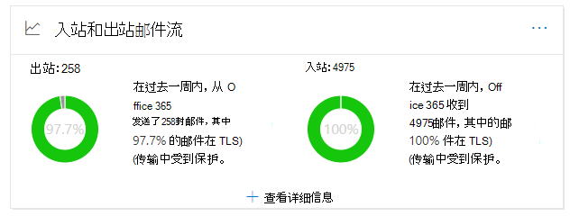

# 安全与合规中心中的出&和入站邮件流见解

[!INCLUDE [Microsoft 365 Defender rebranding](../includes/microsoft-defender-for-office.md)]

**适用对象**
- [Exchange Online Protection](exchange-online-protection-overview.md)
- [Microsoft Defender for Office 365 计划 1 和计划 2](defender-for-office-365.md)
- [Microsoft 365 Defender](../defender/microsoft-365-defender.md)

安全 [&](https://protection.office.com)**与合规** 中心内邮件流仪表板中的 出站和入站邮件流见解将连接器报告与以前的 **TLS** 概述报告中的信息合并 在一处。

小组件在邮件发送到组织或从组织传递邮件时显示用于连接的 TLS 加密。 如果 TLS 由双方提供，则与其他电子邮件服务建立的连接由 TLS 进行加密。 小部件提供上一周邮件流的快照。

小部件中的信息与连接器和 TLS 邮件保护Microsoft 365。 有关详细信息，请参阅以下主题：

- [使用连接器配置邮件流](/exchange/mail-flow-best-practices/use-connectors-to-configure-mail-flow/use-connectors-to-configure-mail-flow)
- [Exchange Online 如何使用 TLS 保护电子邮件连接](../../compliance/exchange-online-uses-tls-to-secure-email-connections.md)
- [有关加密技术技术Microsoft 365](../../compliance/technical-reference-details-about-encryption.md)

## 在传输过程中受 TLS (保护) 

在小组件上单击"查看详细信息"时，"受 **TLS** (保护的邮件") 显示对进入和离开组织的邮件的 TLS 保护。

目前，TLS 1.2 是由 TLS 提供的最安全Microsoft 365。 通常，需要知道用于合规性审核的 TLS 加密。 您可能没有与大多数源和目标电子邮件服务器的直接关系 (您不拥有它们，Microsoft) 也没有关系，因此您没有很多选项可以改进这些服务器使用的 TLS 加密。

但是，您可以使用[连接器来确保](/exchange/mail-flow-best-practices/use-connectors-to-configure-mail-flow/use-connectors-to-configure-mail-flow)电子邮件服务器和电子邮件服务器之间发送的邮件的最佳 TLS Microsoft 365。 邮件流Microsoft 365属于你的合作伙伴的电子邮件服务器或服务器之间的邮件流通常比常规邮件重要和敏感，因此，你需要为这些邮件应用额外的安全性和安全性。

您可以升级或修复自己的电子邮件服务器，以改进所使用的 TLS 加密，或者联系合作伙伴以执行相同的操作。 连接器 **报告** 显示使用您的连接器的邮件的邮件流Microsoft 365 TLS 加密。

可以单击" **连接器报告"** 链接转到"连接器 ["报表](view-mail-flow-reports.md#connector-report)。 如果检测到关联条件，则 **"** 连接器"报告页面上可能会提供以下见解：

- **入站合作伙伴连接器看到重要的 TLS1.0 邮件流**
- **入站 OnPremises 连接器看到重要的 TLS1.0 邮件流**

对于 TLS 1.0 连接，你确实需要升级或修复您的电子邮件服务器或合作伙伴的服务器，以避免在 Microsoft 365 中最终弃用 TLS 1.0 支持时出现任何问题。

## 另请参阅

有关邮件流仪表板中其他见解的信息，请参阅安全与合规中心内& [见解](mail-flow-insights-v2.md)。