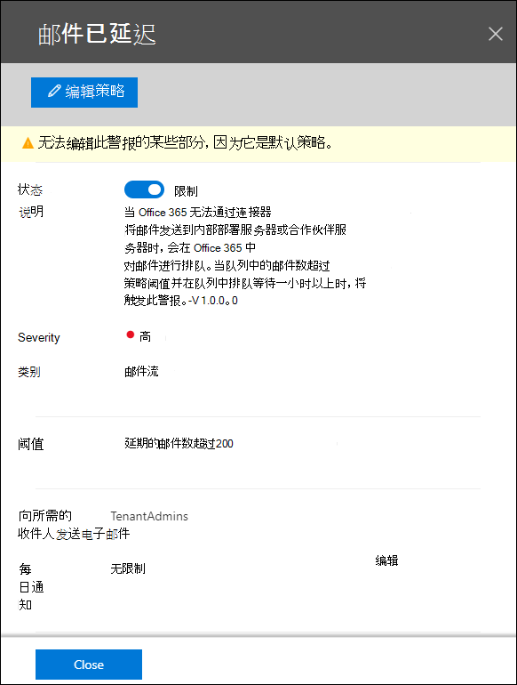
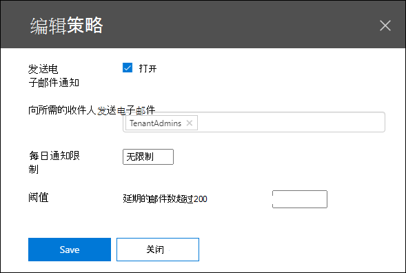
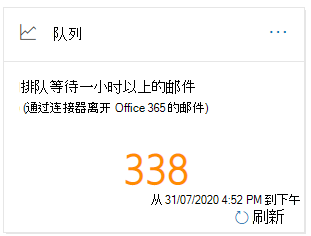
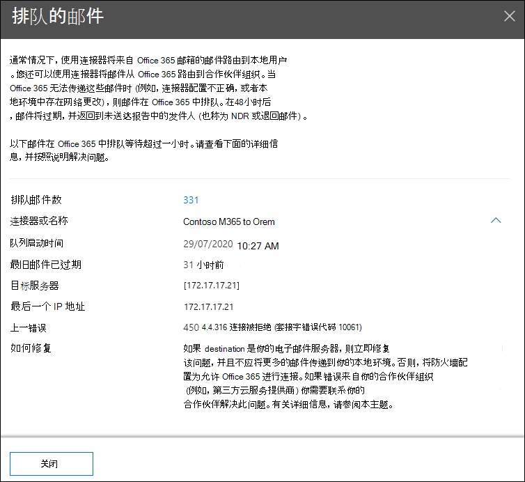
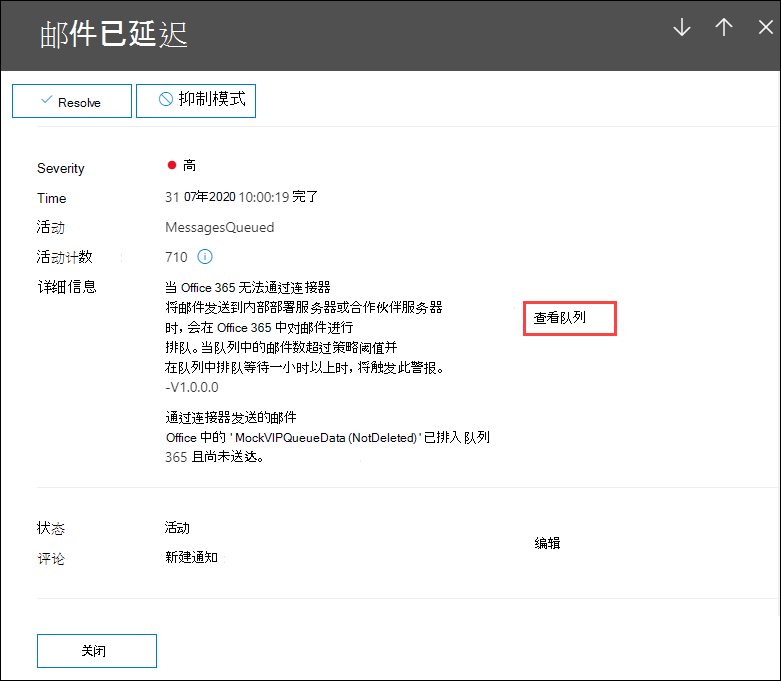

# 安全与合规中心&队列见解

[!INCLUDE [Microsoft 365 Defender rebranding](../includes/microsoft-defender-for-office.md)]

**适用对象**
- [Exchange Online Protection](exchange-online-protection-overview.md)
- [Microsoft Defender for Office 365 计划 1 和计划 2](defender-for-office-365.md)
- [Microsoft 365 Defender](../defender/microsoft-365-defender.md)

当无法将邮件从组织发送到使用连接器本地或合作伙伴电子邮件服务器时，这些邮件将排入Microsoft 365。 导致出现此条件的常见示例包括：

- 连接器配置不正确。
- 本地环境中已发生网络或防火墙更改。

Microsoft 365 24 小时内继续重试传递。 24 小时后，这些邮件将过期，并会在未送达报告（也称为"未送达 (或退回邮件）中退回) 。

如果排队的电子邮件卷超过预定义的阈值 (默认值为 200 封邮件) ，则信息可在以下位置获取：

- 安全 **与** 合规中心内 [邮件流仪表板](mail-flow-insights-v2.md)[中的队列&见解](https://protection.office.com)。 有关详细信息，请参阅本文中的 [邮件流仪表板中的](#queues-insight-in-the-mail-flow-dashboard) 队列见解部分。

- 警报显示在 **安全与合规** 中心内警报仪表板或&警报 (**警报** \>  <https://protection.office.com/alertsdashboard>) 。

  

- 管理员将收到一封电子邮件通知，通知基于名为"邮件已延迟"的默认警报 **策略的配置**。 若要为此警报配置通知设置，请参阅下一节。

  有关警报策略详细信息，请参阅安全与合规中心& [警报策略](../../compliance/alert-policies.md)。

## 自定义队列警报

1. 在安全 [与&](https://protection.office.com)中心，转到 **警报** \> **警报策略或** 打开 <https://protection.office.com/alertpolicies> 。

2. 在警报 **策略页面上** ，查找并选择名为 **邮件已延迟的策略**。

3. 在 **打开的"消息已** 延迟"飞出中，你可以打开或关闭警报并配置通知设置。

   

   - **状态**：你可以打开或关闭警报。

   - **电子邮件收件人** 和 **每日通知限制**：单击 **"编辑** "配置以下设置：

4. 若要配置通知设置，请单击"编辑 **"。** 在出现的 **"编辑** 策略"飞出控件中，配置以下设置：

   - **发送电子邮件通知**：默认值为 on。
   - **电子邮件收件人**：默认值为 **TenantAdmins**。
   - **每日通知限制**：默认值为 **"无限制"。**
   - **阈值**：默认值为 200。

   

5. 完成后，单击 **保存并****关闭**。

## 邮件流仪表板中的队列见解

即使排队的邮件卷未超出阈值并生成警报，您仍可以使用邮件流仪表板中的 **队列** 见解来查看排队时间超过 1 小时的邮件，在排队邮件数量变得过大之前采取措施。 

If you click the number of messages on the widget， a **Messages queued** flyout appears with the following information：

- **排队邮件数**
- **连接器名称**：单击连接器名称，在 EAC Exchange管理 (管理) 。
- **队列启动时间**
- **最旧邮件已过期**
- **目标服务器**
- **上一个 IP 地址**
- **上一个错误**
- **如何修复**：常见问题和解决方案可用。 If a **Fix it now** link is available， click it to fix the problem. 否则，请单击任何可用链接，了解有关错误和可能的解决方案的详细信息。

在邮件已延迟警报的详细信息中单击"查看队列"后，将显示 **相同的飞** 出图。

## 另请参阅

有关邮件流仪表板中其他见解的信息，请参阅安全与合规中心内& [见解](mail-flow-insights-v2.md)。
