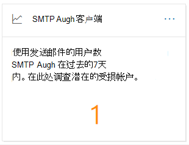
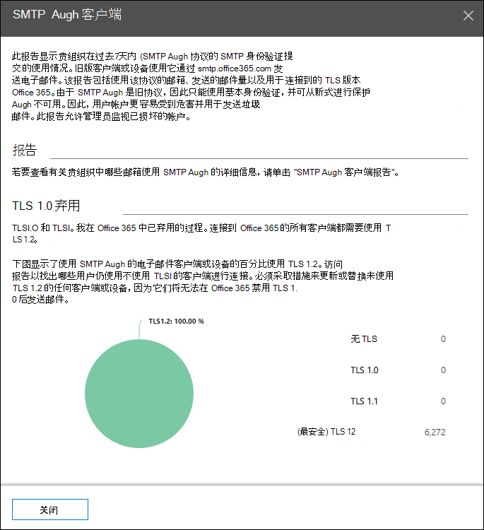
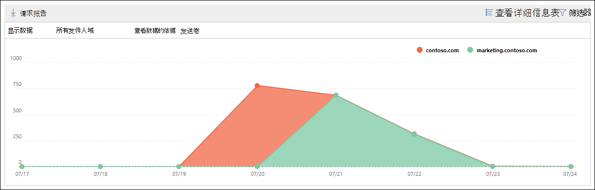
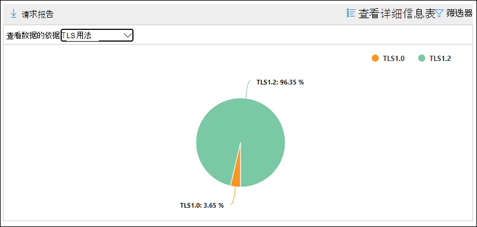

# SMTP 身份验证客户端在安全 & 合规中心中了解和报告SMTP Auth clients insight and report in the Security & Compliance Center

[!INCLUDE [Microsoft 365 Defender rebranding](../includes/microsoft-defender-for-office.md)]

**Smtp 身份验证客户端**在[邮件流仪表板](mail-flow-insights-v2.md)和关联的[SMTP auth 客户端](#smtp-auth-clients-report)之间的洞察力在[安全 & 合规性中心](https://protection.office.com)中突出显示了组织中的用户或系统帐户对 SMTP 身份验证客户端提交协议的使用。The **SMTP Auth clients** insight in the [Mail flow dashboard](mail-flow-insights-v2.md) and the associated [SMTP Auth clients report](#smtp-auth-clients-report) in the [Security & Compliance Center](https://protection.office.com) highlight the use of the SMTP AUTH client submission protocol by users or system accounts in your organization. 此旧版协议 (使用终结点 smtp.office365.com) 仅提供基本身份验证，并且容易被受攻击帐户用来发送电子邮件。This legacy protocol (which uses the endpoint smtp.office365.com) only offers Basic authentication, and is susceptible to being used by compromised accounts to send email. 通过真知灼见和报告，可以检查 SMTP 身份验证电子邮件提交是否有异常活动。The insight and report allow you to check for unusual activity for SMTP AUTH email submissions. 它还显示了使用 SMTP 身份验证的客户端或设备的 TLS 使用数据。It also shows the TLS usage data for clients or devices using SMTP AUTH.

该小部件指示最近7天内已使用 SMTP 身份验证协议的用户或服务帐户的数量。The widget indicates the number of users or service accounts that have used the SMTP Auth protocol in the last 7 days.

如果单击小组件上的邮件数，则将显示 **SMTP Auth 客户端** 弹出。If you click the number of messages on the widget, an **SMTP Auth clients** flyout appears. 浮出控件提供了上一周的 TLS 使用和卷的聚合视图。The flyout provides an aggregated view of the TLS usage and volumes for the last week.

您可以单击 " **Smtp auth 客户端报告** " 链接以转到 smtp auth 客户端报告，如下一节中所述。You can click the **SMTP Auth clients report** link to go to the SMTP Auth clients report as described in the next section.

## SMTP 身份验证客户端报告SMTP Auth clients report

### SMTP Auth 客户端报告的报告视图Report view for the SMTP Auth clients report

默认情况下，此报告显示过去7天的数据，但数据可用于过去的90天。By default, the report shows data for the last 7 days, but data is available for the last 90 days.

"概述" 部分包含以下图表：The overview section contains the following charts:

- **数据查看依据：发送卷**：默认情况下，图表显示从所有域发送的 SMTP 身份验证客户端邮件的数量 (显示其数据：默认情况下， **所有发件人域** 都处于选中状态) 。**View data by: Sending volume**: By default, the chart shows the number of SMTP Auth client messages that were sent from all domains (**Show data for: All sender domains** is selected by default). 您可以通过单击下拉列表中的 " **显示数据** " 并选择 "发件人域"，将结果筛选为特定发件人域。You can filter the results to a specific sender domain by clicking **Show data for** and selecting the sender domain from the dropdown list. 如果将特定数据点悬停 (天) ，则显示邮件数。If you hover a specific data point (day), the number of messages is shown.

  

- **查看数据的依据： TLS 用法**：图表显示选定时间段内所有 SMTP 身份验证客户端邮件的 TLS 使用百分比。**View data by: TLS Usage**: The chart shows the percentage of TLS usage for all SMTP Auth client messages during the selected time period. 此图允许你识别仍在使用旧版 TLS 的用户和系统帐户，并对其执行操作。This chart allows you to identify and take action on users and system accounts that are still using older versions of TLS.

  

如果您在报告视图中单击 " **筛选器** "，则可以指定具有 " **开始日期** " 和 " **结束日期**" 的日期范围。If you click **Filters** in a report view, you can specify a date range with **Start date** and **End date**.

单击 " **请求报告** " 可在电子邮件中接收更详细的报告版本。Click **Request report** to receive a more detailed version of the report in an email message. 您可以指定日期范围和接收报告的收件人。You can specify the date range and the recipients to receive the report.

### SMTP Auth 客户端报告的详细信息表格视图Details table view for the SMTP Auth clients report

如果您单击 " **查看详细信息表**"，则显示的信息将取决于所查看的图表：If you click **View details table**, the information that's shown depends on the chart you were looking at:

- **数据查看方式：发送卷**：表中显示以下信息：**View data by: Sending volume**: The following information is shown in a table:

  - **发件人地址****Sender address**
  - **邮件计数****Message count**

  如果选择了行，则会在浮出控件中显示相同的详细信息。If you select a row, the same details are shown in a flyout.

- **数据查看依据： TLS 用法**：表中显示了以下信息：**View data by: TLS Usage**: The following information is shown in a table:

  - **发件人地址****Sender address**
  - **TLS 1.0%**\***TLS1.0%**\*
  - **TLS 1.1%**\***TLS1.1%**\*
  - **TLS 1.2%**\***TLS1.2%**\*
  - **邮件计数****Message count**

  \* 此列显示发件人的邮件的百分比和数量。\* This column shows both the percentage and number of messages from the sender.

如果单击 "详细信息" 表视图中的 " **筛选器** "，则可以指定具有 " **开始日期** " 和 " **结束日期**" 的日期范围。If you click **Filters** in a details table view, you can specify a date range with **Start date** and **End date**.

如果选择行，则在浮出控件中显示类似的详细信息：If you select a row, similar details are shown in a flyout:

单击 " **请求报告** " 可在电子邮件中接收更详细的报告版本。Click **Request report** to receive a more detailed version of the report in an email message. 您可以指定日期范围和接收报告的收件人。You can specify the date range and the recipients to receive the report.

若要返回到 "报告" 视图，请单击 " **查看报告**"。To go back to the reports view, click **View report**.

## 相关主题Related topics

有关邮件流仪表板中的其他见解的信息，请参阅 [Security & 合规性中心中的邮件流见解](mail-flow-insights-v2.md)。For information about other insights in the Mail flow dashboard, see [Mail flow insights in the Security & Compliance Center](mail-flow-insights-v2.md).
