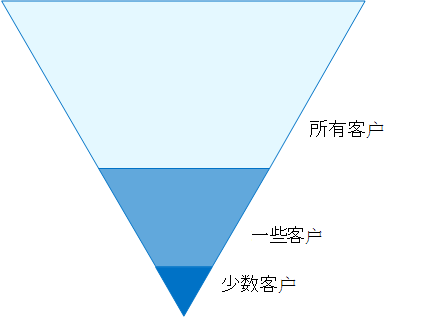
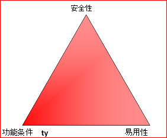

# 零信任标识和设备访问配置

依赖网络防火墙和虚拟专用网络 (VPN) 隔离和限制对组织技术资源和服务的访问的安全体系结构对于经常需要访问传统企业网络边界之外的应用程序和资源的员工来说不再足够。

为了应对这一新的计算领域，Microsoft 强烈建议使用零信任安全模型，该模型基于以下指导原则：

- 显式验证

  始终基于所有可用数据点进行身份验证和授权。 这是零信任标识和设备访问策略对登录和持续验证至关重要的地方。

- 使用最小特权访问

  使用 JIT/JEA (实时和 Just-Enough-Access) 、基于风险的自适应策略和数据保护来限制用户访问。  

- 假定泄露

  尽量减少爆炸半径和线段访问。 验证端到端加密，并使用分析获取可见性、促进威胁检测和加强防范。

下面是零信任的整体体系结构。

:::image type="content" source="../../media/microsoft-365-policies-configurations/zero-trust-architecture.png" alt-text="Microsoft 零信任体系结构" lightbox="../../media/microsoft-365-policies-configurations/zero-trust-architecture.png":::

零信任标识和设备访问策略满足 **以下各项的验证明确** 指导原则：

- 身份

  当标识尝试访问资源时，请验证身份是否具有强身份验证，并确保所请求的访问是合规且典型的。

- 设备 (也称为终结点) 

  监视和实施设备运行状况和合规性要求，以确保安全访问。

- 应用程序

  应用控件和技术以发现影子 IT、确保适当的应用内权限、基于实时分析的入口访问、监视异常行为、控制用户操作并验证安全配置选项。

本系列文章介绍了一组标识和设备访问先决条件配置，以及一组 Azure Active Directory (Azure AD) 条件访问、Microsoft Intune 以及其他针对零信任访问的策略Microsoft 365 用于企业云应用和服务、其他 SaaS 服务以及使用应用程序代理发布的Azure AD应用程序。

零信任标识和设备访问设置和策略分三层建议：针对具有高度管控或分类数据的环境的起点、企业专用安全。 这些层及其相应的配置可跨数据、标识和设备提供一致的零信任保护级别。

这些功能及其建议：

- 在 Microsoft 365 E3 和 Microsoft 365 E5 中Microsoft 365 E5。
- 与 Microsoft[安全分数以及](../defender/microsoft-secure-score.md)Azure AD[中的标识](/azure/active-directory/fundamentals/identity-secure-score)分数一致，将增加组织的这些分数。
- 将帮助您实施这 [五个步骤来保护标识基础结构](/azure/security/azure-ad-secure-steps)。

如果您的组织具有独特的环境要求或复杂性，请使用这些建议作为起点。 但是，大多数组织都可以按照规定实现这些建议。

观看此视频，快速概览适用于企业的 Microsoft 365和设备访问配置。

 

> [!VIDEO https://www.microsoft.com/videoplayer/embed/RWxEDQ]

> [!NOTE]
> Microsoft 还企业移动性 + 安全性 (EMS) 订阅Office 365许可证。 EMS E3 和 EMS E5 功能等效于 Microsoft 365 E3 和 Microsoft 365 E5。 有关详细信息 [，请参阅 EMS](https://www.microsoft.com/microsoft-365/enterprise-mobility-security/compare-plans-and-pricing) 计划。

## 目标受众

这些建议适用于熟悉 Microsoft 365 云生产力和安全服务的企业架构师和 IT 专业人员，其中包括 Azure AD (标识) 、Microsoft Intune (设备管理) 和 Microsoft 信息保护 (数据保护) 。

### 客户环境

建议的策略适用于完全在 Microsoft 云中运营的企业组织，以及混合标识基础结构（这是与 Azure AD 租户同步的一个本地 Active Directory 域服务 (AD DS) 林）的客户。

提供的很多建议都依赖于仅与 Microsoft 365 E5、Microsoft 365 E3 E5 安全加载项、EMS E5 或 Azure AD Premium P2 一起提供的服务。

对于没有这些许可证的组织，Microsoft 建议你至少实现安全默认值，它包含在所有Microsoft 365计划中。

### 注意事项

你的组织可能受法规或其他合规性要求限制，包括可能需要你应用与这些建议配置不同的策略的特定建议。 这些配置推荐以前没有提供的使用情况控件。 我们建议使用这些控件，因为我们认为它们代表安全性和生产力之间的平衡。

我们已尽力满足各种组织保护要求，但无法考虑所有可能的要求或组织的所有独特方面。

## 三层保护

大多数组织都具有安全性和数据保护方面的特定要求。 这些要求因行业部门和组织内的工作职能而异。 例如，法律部门及管理员可能需要针对其电子邮件通信进行额外的安全和信息保护控制，而其他业务部门不需要这些控制。

每个行业也有自己独特的一组规定。 针对三个不同级别的安全和保护提供了建议，可以基于你的需求粒度应用这三个不同级别的安全和保护，而不是提供所有可能的安全选项列表或每个行业部门或工作职能的建议。

- **起始点**：我们建议所有客户都制定并使用保护数据以及访问你的数据的标识和设备的最低标准。 你可以遵循这些建议，以提供强大的默认保护作为所有组织的起点。
- **Enterprise：** 某些客户具有必须在较高级别进行保护的数据子集，或者他们可能要求在较高级别保护所有数据。 你可以对环境中的所有或特定数据集应用增强Microsoft 365保护。 建议以与安全性相当的级别保护访问敏感数据的标识和设备。
- **专用安全**：如果需要，一些客户具有少量高度机密、构成商业机密或受监管的数据。 Microsoft 提供了一些功能来帮助这些客户满足这些要求，包括对标识和设备添加了保护。

本指南演示如何针对这些保护级别的标识和设备实施零信任保护。 使用本指南作为组织的最低要求，并调整策略以满足组织的特定要求。

在标识、设备和数据之间使用一致的保护级别非常重要。 例如，对于拥有优先帐户的用户（如主管、领导、经理和其他人员）的保护，应包含针对其身份、设备和他们访问的数据的相同 &mdash; &mdash; 级别的保护。 
<!--

The **Zero Trust identity and device protection for Microsoft 365** architecture model shows you which capabilities are comparable.

   [View as a PDF](../../downloads/MSFT_cloud_architecture_identity&device_protection.pdf) \| [Download as a PDF](https://github.com/MicrosoftDocs/microsoft-365-docs/raw/public/microsoft-365/downloads/MSFT_cloud_architecture_identity&device_protection.pdf)  \| [Download as a Visio](https://github.com/MicrosoftDocs/microsoft-365-docs/raw/public/microsoft-365/downloads/MSFT_cloud_architecture_identity&device_protection.vsdx)

--> 

此外，请参阅[部署数据隐私法规信息](../../solutions/information-protection-deploy.md)保护解决方案以保护存储在Microsoft 365。

## 安全性和生产力权衡

实施任何安全策略需要在安全性和工作效率之间进行选择。 评估每个决策对安全性、功能和易用性的平衡有何影响很有用。

提供的建议基于以下原则：

- 了解用户，并灵活满足其安全性和功能要求。
- 及时应用安全策略并确保其有意义。

## 零信任标识和设备访问保护的服务和概念

Microsoft 365企业版专为大型组织设计，使每个人都能够发挥创造力并安全地协同工作。

本节概述对零Microsoft 365和设备访问非常重要的服务和功能。

### Azure AD

Azure AD提供了一整套标识管理功能。 我们建议使用这些功能来保证访问安全。

|功能或特性|说明|许可|
|---|---|---|
|[多重身份验证 (MFA)](/azure/active-directory/authentication/concept-mfa-howitworks)|MFA 要求用户提供两种形式的验证，如用户密码以及来自 Microsoft Authenticator 应用或电话呼叫的通知。 MFA 大大减少了凭据被盗可用于访问环境的风险。 Microsoft 365使用 Azure AD 多重身份验证服务进行基于 MFA 的登录。|Microsoft 365 E3 或 E5|
|[条件访问](/azure/active-directory/conditional-access/overview)|Azure AD评估用户登录的条件，并使用条件访问策略来确定允许的访问。 例如，在本指南中，我们将向您展示如何创建条件访问策略，以要求设备合规性以访问敏感数据。 这大大降低了具有自己的设备和凭据被盗的黑客访问敏感数据的风险。 它还保护设备的敏感数据，因为设备必须满足运行状况和安全性的特定要求。|Microsoft 365 E3 或 E5|
|[Azure AD组](/azure/active-directory/fundamentals/active-directory-manage-groups)|条件访问策略、使用 Intune 的设备管理，甚至组织中文件和网站的权限都依赖于对用户帐户或组Azure AD分配。 我们建议你创建Azure AD保护级别对应的组。 例如，你的管理人员可能是黑客的更高价值目标。 因此，有必要将这些员工的用户帐户添加到 Azure AD 组，并将该组分配给条件访问策略和其他强制实施更高级别的访问保护的策略。|Microsoft 365 E3 或 E5|
|[设备注册](/azure/active-directory/devices/overview)|将设备注册到Azure AD为设备创建标识。 此标识用于在用户登录时对设备进行身份验证，并应用要求加入域或兼容电脑的条件访问策略。 对于本指南，我们使用设备注册在计算机中自动注册Windows域。 设备注册是使用 Intune 管理设备的先决条件。|Microsoft 365 E3 或 E5|
|[Azure AD Identity Protection](/azure/active-directory/identity-protection/overview)|使您可以检测影响组织标识的潜在漏洞，将自动修正策略配置为低、中、高登录风险和用户风险。 本指南依赖于此风险评估，对多重身份验证应用条件访问策略。 本指南还包括条件访问策略，要求用户在检测到其帐户的高风险活动时更改其密码。|Microsoft 365 E5，Microsoft 365 E3 E5 安全加载项、EMS E5 或 Azure AD Premium P2 许可证|
|[SSPR (自助服务密码) ](/azure/active-directory/authentication/concept-sspr-howitworks)|通过提供对管理员可以控制的多种身份验证方法的验证，允许用户安全地重置其密码，而无需支持人员干预。|Microsoft 365 E3 或 E5|
|[Azure AD密码保护](/azure/active-directory/authentication/concept-password-ban-bad)|检测并阻止已知的弱密码及其变体以及特定于您的组织的其他弱术语。 默认全局禁止使用的密码列表将自动应用于 Azure AD 租户中的所有用户。 可在自定义禁止密码列表中定义额外条目。 用户更改或重置其密码时，将检查这些禁止的密码列表，强制使用强密码。|Microsoft 365 E3 或 E5|
|

下面是零信任标识和设备访问的组件，包括 Intune 和 Azure AD 对象、设置和子服务。

:::image type="content" source="../../media/microsoft-365-policies-configurations/identity-device-access-components.png" alt-text="零信任标识和设备访问的组件。" lightbox="../../media/microsoft-365-policies-configurations/identity-device-access-components.png":::

### Microsoft Intune

[Intune](/intune/introduction-intune) 是 Microsoft 基于云的移动设备管理服务。 本指南建议使用 Intune 对Windows电脑进行设备管理，并推荐设备合规性策略配置。 Intune 确定设备是否合规，并将此数据Azure AD条件访问策略时将使用的数据。

#### Intune 应用保护

[Intune 应用](/intune/app-protection-policy) 保护策略可用于保护移动应用中的组织数据，支持或不将设备注册到管理中。 Intune 可帮助保护信息，确保员工仍可高效工作，并防止数据丢失。 通过实现应用级别的策略，可以限制对公司资源的访问，并控制 IT 部门的数据。

本指南演示如何创建建议策略以强制使用已批准的应用，并确定如何将这些应用与业务数据一同使用。

### Microsoft 365

本指南演示如何实施一组策略来保护对 Microsoft 365 云服务的访问，包括 Microsoft Teams、Exchange、SharePoint 和 OneDrive。 除了实施这些策略外，我们还建议你使用这些资源提高租户的保护级别：

- [配置租户以提高安全性](tenant-wide-setup-for-increased-security.md)

  推荐适用于租户的起始点安全性。

- [安全路线图：前 30 天、前 90 天及以后的首要任务](security-roadmap.md)

  推荐，包括日志记录、数据管理、管理员访问和威胁防护。

### Windows 11或Windows 10 Microsoft 365 企业应用版

Windows 11 Windows 10或Microsoft 365 企业应用版是电脑的推荐客户端环境。 我们建议Windows 11或Windows 10，因为 Azure 旨在为本地和本地环境提供尽可能流畅Azure AD。 Windows 11或Windows 10还包括可通过 Intune 管理的高级安全性功能。 Microsoft 365 企业应用版包括最新版本的 Office 应用程序。 这些身份验证使用新式验证，这是更安全且条件访问的要求。 这些应用还包括增强的合规性和安全工具。

## 跨三层保护应用这些功能

下表总结了我们对跨三层保护使用这些功能的建议。

|保护机制|起点|企业|专用安全|
|---|---|---|---|
|强制执行 MFA|针对中级或以上登录风险|针对低级或以上登录风险|针对所有新会话|
|**强制更改密码**|对于高风险用户|对于高风险用户|对于高风险用户|
|**强制执行 Intune 应用程序保护**|是|是|是|
|**强制对组织拥有的设备进行 Intune 注册**|需要兼容或已加入域的电脑，但允许自带设备 (BYOD) 手机和平板电脑|需要兼容或已加入域的设备|需要兼容或已加入域的设备|
|

## 设备所有权

上表反映了许多组织支持混合使用组织拥有的设备以及个人或 BYOD 的趋势，从而在整个员工中实现移动生产力。 Intune 应用保护策略可确保电子邮件在组织拥有的设备和 BYOD 上Outlook移动应用和其他 Office 移动应用中受到保护。

我们建议由 Intune 或已加入域的设备管理，以应用其他保护和控制。 根据数据敏感度，你的组织可能会选择不允许特定用户群体或特定应用的 BYOD。

## 部署和应用

在配置和推出适用于集成了 Azure AD应用的零信任标识和设备访问配置之前，你必须：

- 确定要保护的组织中使用的应用。
- 分析此应用列表，以确定提供适当保护级别的策略集。

  不应为每个应用创建单独的策略集，因为管理它们可能会变得很麻烦。 Microsoft 建议对对相同用户具有相同的保护要求的应用进行分组。

  例如，你可以拥有一组策略，其中包括针对所有用户的所有 Microsoft 365 应用，用于起始点保护;第二组策略适用于所有敏感应用（如人力资源或财务部门使用的策略）并应用于这些组。

确定要保护的应用的策略集后，以增量方式向用户推出策略，同时解决问题。

例如，配置将用于所有 Microsoft 365 应用的策略，Exchange其他更改Exchange。 向用户推出这些策略，并解决任何问题。 然后，添加Teams其其他更改，并推出给用户。 然后，添加SharePoint其其他更改。 继续添加其余的应用，直到你可以放心地配置这些起始点策略以包含所有Microsoft 365应用。

同样，对于敏感应用，创建一组策略，一次添加一个应用，并解决所有问题，直到所有问题都包含在敏感应用策略集内。

Microsoft 建议不要创建适用于所有应用的策略集，因为这可能会导致一些意外配置。 例如，阻止所有应用的策略可能会将管理员锁定在 Azure 门户之外，并且无法为重要终结点（如 Microsoft Graph）配置排除项。

## 配置零信任标识和设备访问的步骤

1. 配置先决条件标识功能及其设置。
2. 配置通用标识和访问条件访问策略。
3. 为来宾用户和外部用户配置条件访问策略。
4. 为云应用配置Microsoft 365访问策略，如 Microsoft Teams、Exchange 和 SharePoint 和 &mdash; Microsoft Defender for Cloud Apps &mdash; 策略。

配置零信任标识和设备访问后，请参阅[Azure AD 功能](/azure/active-directory/fundamentals/active-directory-deployment-checklist-p2)部署指南，了解要考虑的其他功能的分阶段清单，Azure AD Identity Governance 来保护、监视和[审核](/azure/active-directory/governance/)访问。

## 后续步骤

[实现零信任标识和设备访问策略的先决条件工作](identity-access-prerequisites.md)
