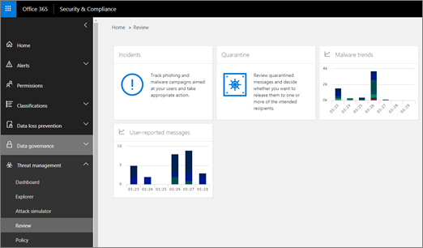
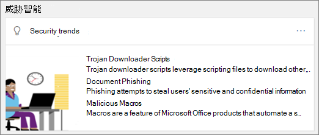

# 威胁调查和响应

[!INCLUDE [Microsoft 365 Defender rebranding](../includes/microsoft-defender-for-office.md)]

**应用于**
- [适用于 Office 365 计划 2 的 Microsoft Defender](defender-for-office-365.md)

[Microsoft Defender](defender-for-office-365.md)中的威胁调查和响应功能Office 365安全分析员和管理员通过执行Microsoft 365来保护其组织的业务数据：

- 轻松识别、监视和了解网络攻击
- 帮助快速解决 Exchange Online、SharePoint Online、OneDrive for Business 和 Microsoft Teams
- 提供见解和知识以帮助安全操作防止针对其组织的网络攻击
- 针对[基于电子邮件的关键威胁Office 365](automated-investigation-response-office.md)自动调查和响应

威胁调查和响应功能可深入了解威胁和相关响应操作，这些响应操作在 Microsoft 365 Defender可用。 这些见解可帮助组织的安全团队保护用户免受基于电子邮件或文件的攻击。 这些功能有助于监视信号并收集来自多个源的数据，例如用户活动、身份验证、电子邮件、被入侵电脑和安全事件。 业务决策者和安全运营团队可以使用此信息来了解并响应对组织的威胁，并保护知识产权。

## 熟悉威胁调查和响应工具

威胁调查和响应功能以一组Microsoft 365 Defender和响应工作流（包括以下内容）在 Microsoft 365 Defender 门户中显示：

- [资源管理器](#explorer)
- [事件](#incidents)
- [攻击模拟培训](attack-simulation-training.md)
- [自动调查和响应](automated-investigation-response-office.md)

### 资源管理器

使用 [资源管理器 (](threat-explorer.md) 实时检测功能) 威胁、查看攻击量以及按威胁系列、攻击者基础结构等分析数据。 资源管理器 (也称为威胁资源管理器) 是任何安全分析师调查工作流的起点。

若要查看和使用此报告，在 Microsoft 365 Defender 门户中，转到电子邮件 **&协作**  >  **资源管理器。**

### 事件

使用事件列表 (也称为调查) 查看正在飞行的安全事件列表。 事件用于跟踪威胁（如可疑电子邮件）以及执行进一步调查和修正。

若要查看组织的当前事件列表，在 Microsoft 365 Defender 门户中，转到"事件&**事件**  >  **"。**

### 攻击模拟培训

使用攻击模拟培训在组织中设置和运行真实的网络攻击，并识别在真实网络攻击影响你的业务之前易受攻击的人。 若要了解更多信息，请参阅 [模拟网络钓鱼攻击](attack-simulation-training.md)。

若要查看并使用 Microsoft 365 Defender 门户中的此功能，请转到电子邮件&**协作**  >  **攻击模拟培训**。

### 自动调查和响应

使用自动调查和响应 (AIR) 功能，节省将内容、设备和组织中面临威胁的人关联在一起所投入的时间和精力。 只要触发某些警报，或者由安全运营团队启动，AIR 进程就可以开始。 若要了解更多信息，请参阅 Office 365 中的[自动调查和Office 365。](automated-investigation-response-office.md)

## 威胁智能小组件

作为 Microsoft Defender for Office 365 2 产品/服务一部分，安全分析师可以审阅有关已知威胁的详细信息。 这可用于确定是否可以采取其他预防措施/步骤来保证用户安全。

## 我们如何获取这些功能？

Microsoft 365威胁调查和响应功能包含在 Microsoft Defender for Office 365 计划 2 中，该计划包含在 Enterprise E5 中或作为特定订阅的加载项。 若要了解更多信息，请参阅[Defender for Office 365 Plan 1 和 Plan 2。](defender-for-office-365.md#microsoft-defender-for-office-365-plan-1-and-plan-2)

## 所需角色和权限

Microsoft Defender for Office 365使用基于角色的访问控制。 权限通过 Azure Active Directory、Microsoft 365 管理中心 或 Microsoft 365 Defender 门户中的特定角色分配。

> [!TIP]
> 尽管某些角色（如安全管理员）可以在 Microsoft 365 Defender 门户中分配，但请考虑使用 Microsoft 365 管理中心 或 Azure Active Directory。 有关角色、角色组和权限的信息，请参阅以下资源：
>
> - [Microsoft 365 Defender 门户中的权限](permissions-microsoft-365-security-center.md)
> - [Azure AD内置角色](/azure/active-directory/roles/permissions-reference)

 

****

|活动|角色和权限|
|---|---|
|使用威胁&漏洞管理仪表板 (或新的 [安全仪表板](security-dashboard.md) 
 查看有关最近威胁或当前威胁的信息|以下各项之一： <ul><li>**全局管理员**</li><li>**安全管理员**</li><li>**安全信息读取者**</li></ul> 
 这些角色可以在角色分配Azure Active Directory () <https://portal.azure.com> 或 <https://admin.microsoft.com> Microsoft 365 管理中心 () 。|
|使用 [资源管理器 (实时检测功能) ](threat-explorer.md) 分析威胁|以下各项之一： <ul><li>**全局管理员**</li><li>**安全管理员**</li><li>**安全信息读取者**</li></ul> 
 这些角色可以在角色分配Azure Active Directory () <https://portal.azure.com> 或 <https://admin.microsoft.com> Microsoft 365 管理中心 () 。|
|查看事件 (也称为调查)  
 向事件添加电子邮件|以下各项之一： <ul><li>**全局管理员**</li><li>**安全管理员**</li><li>**安全信息读取者**</li></ul> 
 这些角色可以在角色分配Azure Active Directory () <https://portal.azure.com> 或 <https://admin.microsoft.com> Microsoft 365 管理中心 () 。|
|在事件中触发电子邮件操作 
 查找并删除可疑电子邮件|以下各项之一： <ul><li>**全局管理员**</li><li>**安全管理员** 以及 **搜索和清除** 角色</li></ul> 
 全局 **管理员****和安全管理员** 角色可以分配给 Azure Active Directory () 或 Microsoft 365 管理中心 (<https://portal.azure.com> <https://admin.microsoft.com>) 。 
 搜索 **和清除角色** 必须分配在 Microsoft 36 Defender &门户中的电子邮件和协作 <https://security.microsoft.com> () 。|
|将 Microsoft Defender for Office 365 计划 2 与 Microsoft Defender for Endpoint 集成 
 将 Microsoft Defender for Office 365 计划 2 与 SIEM 服务器集成|全局 **管理员或** 安全管理员角色在 Azure Active Directory () 或 Microsoft 365 管理中心 (<https://portal.azure.com> <https://admin.microsoft.com>) 。 
 --- **加号** --- 
 在其他应用程序（如 (或 SIEM Microsoft Defender 安全中心）中分配的适当) 。 |
|

## 后续步骤

- [了解威胁跟踪器 - 新增和值得注意的功能](threat-trackers.md)
- [查找并调查通过威胁调查和响应 (Office 365传递的恶意) ](investigate-malicious-email-that-was-delivered.md)
- [将Office 365威胁调查和响应与 Microsoft Defender for Endpoint 集成](integrate-office-365-ti-with-mde.md)
- [模拟网络钓鱼攻击](attack-simulation-training.md)
