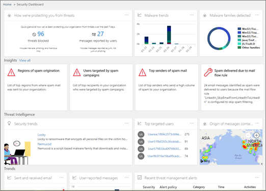

# 威胁调查和响应

Office 365 中的威胁调查和响应功能[高级威胁防护](office-365-atp.md)帮助安全分析员和管理员通过以下方式保护组织的 Microsoft 365 商业用户：
- 轻松识别、监控和理解 cyberattacks
- 帮助快速解决 Exchange Online、SharePoint Online、OneDrive for Business 和 Microsoft 团队中的威胁
- 提供有关帮助安全操作的见解和知识，以防止针对组织的 cyberattacks
- [在 Office 365 中采用自动调查和响应](automated-investigation-response-office.md)，以实现基于电子邮件的关键威胁
    
威胁调查和响应功能提供了对安全&amp;合规中心中提供的威胁和相关响应操作的见解。 这些见解可帮助您的组织的安全团队保护用户免受电子邮件或基于文件的攻击。 这些功能可帮助监视信号并收集来自多个源（如用户活动、身份验证、电子邮件、受损电脑和安全事件）的数据。 业务决策者和安全操作团队可以使用此信息来了解和响应针对组织的威胁，并保护您的知识产权。

## 了解威胁调查和响应工具

安全 & 合规性中心内的威胁调查和响应功能，作为一组工具和响应工作流，其中包括以下内容：

- [威胁仪表板](#threat-dashboard)
- [Explorer](#threat-explorer)
- [事件](#incidents)
- [攻击模拟器](#attack-simulator)
- [自动调查和响应](automated-investigation-response-office.md)

### 威胁仪表板

使用 "威胁" 仪表板（也称为 "安全"[仪表板](security-dashboard.md)）快速查看已解决的威胁，并以一种直观的方式向业务决策制定者报告 Microsoft 365 服务如何保护您的业务。
  

  
若要查看和使用此仪表板，请&amp;在安全合规性中心中，转到 "**威胁管理** \> "**仪表板**。
  
### 威胁资源管理器

使用[威胁浏览器（和实时检测）](threat-explorer.md)来分析威胁，查看一段时间内的攻击量，并根据威胁系列、攻击者基础结构等对数据进行分析。 威胁资源管理器（也称为浏览器）是任何安全分析员的调查工作流的起始位置。

  
若要查看和使用此报告，请在&amp;安全合规性中心中，转到 "**威胁管理** \> **资源管理器**"。
  
### 事件

使用 "事件" 列表（也称为 "调查"）查看飞行安全事件的列表。 事件用于跟踪可疑电子邮件等威胁，并进行进一步调查和修正。

若要查看您的组织的当前事件列表，请在安全 & 合规性中心中，转到 "**威胁管理** \> **审核** \> **事件**"。

### 攻击模拟器

使用攻击模拟器在您的组织中设置和运行真实的 cyberattacks，并在真正的 cyberattack 影响您的企业之前识别易受攻击的人员。 若要了解详细信息，请参阅[Office 365 中的攻击模拟器](attack-simulator.md)。

### 自动调查和响应

使用自动调查和响应（空气）功能来节省与内容、设备和人员相关的时间和精力，以防止组织中的威胁带来风险。 只要触发了某些警报，或安全操作团队启动时，AIR 进程就可以开始。 若要了解详细信息，请参阅[Office 365 中的自动化调查和响应](automated-investigation-response-office.md)。

## 威胁智能小部件

作为 Office 365 高级威胁防护计划2产品的一部分，安全分析员可以查看已知威胁的详细信息。 这有助于确定是否存在可采取的更多预防措施/步骤，以确保用户安全。

## 如何获取这些功能？

Microsoft 365 在 Office 365 高级威胁防护计划2中包含，它包含在企业版 E5 中或作为特定订阅的加载项。 若要了解详细信息，请参阅[Office 365 ATP 计划1和计划 2](office-365-atp.md#office-365-atp-plan-1-and-plan-2)。

## 所需角色和权限

Office 365 高级威胁防护使用基于角色的访问控制。 可以通过 Azure Active Directory、Microsoft 365 管理中心或 Security & 合规性中心中的某些角色分配权限。

> [!TIP]
> 虽然某些角色（如安全管理员）可以在安全 & 合规性中心中分配，但请考虑改用 Microsoft 365 管理中心或 Azure Active Directory。 有关角色、角色组和权限的信息，请参阅以下资源：
> - [安全&amp;合规性中心中的权限](permissions-in-the-security-and-compliance-center.md)
> - [Azure Active Directory 中的管理员角色权限](https://docs.microsoft.com/azure/active-directory/users-groups-roles/directory-assign-admin-roles)

|活动 |角色和权限 |  
|:-----|:-----|
|使用威胁仪表板（或新[安全仪表板](security-dashboard.md)）   查看有关最近或当前威胁的信息    |以下各项之一：  - **全局管理员**    - **安全管理员**  - **安全读者**    可以在任何 Azure Active Directory （[https://portal.azure.com](https://portal.azure.com)）或 Microsoft 365 管理中心（[https://admin.microsoft.com](https://admin.microsoft.com)）中分配这些角色。 |
|使用[威胁浏览器（和实时检测）](threat-explorer.md)分析威胁    |以下各项之一：  - **全局管理员**    - **安全管理员**  - **安全读者**    可以在任何 Azure Active Directory （[https://portal.azure.com](https://portal.azure.com)）或 Microsoft 365 管理中心（[https://admin.microsoft.com](https://admin.microsoft.com)）中分配这些角色。 |
|查看事件（也称为调查）   将电子邮件添加到事件    |以下各项之一：  - **全局管理员**    - **安全管理员**  - **安全读者**    可以在任何 Azure Active Directory （[https://portal.azure.com](https://portal.azure.com)）或 Microsoft 365 管理中心（[https://admin.microsoft.com](https://admin.microsoft.com)）中分配这些角色。  |
|触发事件中的电子邮件操作     查找和删除可疑电子邮件    |以下各项之一：  - **全局管理员**    - **安全管理员**和**搜索和清除**角色  **全局管理员**和**安全管理员**角色可以在 Azure Active Directory （[https://portal.azure.com](https://portal.azure.com)）或 Microsoft 365 管理中心（[https://admin.microsoft.com](https://admin.microsoft.com)）中进行分配。   必须在安全 & 合规中心（[https://protection.office.com](https://protection.office.com)）中分配**搜索和清除**角色。 |
|将 Office 365 高级威胁防护计划2与 Microsoft Defender 高级威胁防护集成     将 Office 365 高级威胁防护计划2与 SIEM 服务器集成    |**全局管理员**或在任何 Azure Active Directory （[https://portal.azure.com](https://portal.azure.com)）或 Microsoft 365 管理中心中分配的[https://admin.microsoft.com](https://admin.microsoft.com)**安全管理员**角色（）。 --- **外** --- 在其他应用程序（如[Microsoft Defender Security Center](https://docs.microsoft.com/windows/security/threat-protection/microsoft-defender-atp/user-roles)或 SIEM server）中分配的相应角色  |
   
    
## 后续步骤

- [了解威胁跟踪-新增和值得注意的事项](threat-trackers.md)

- [查找并调查已传递的恶意电子邮件（Office 365 威胁调查和响应）](investigate-malicious-email-that-was-delivered.md)

- [集成 Office 365 威胁调查和响应与 Microsoft Defender 高级威胁防护](integrate-office-365-ti-with-wdatp.md)

- [了解攻击模拟器](attack-simulator.md)
