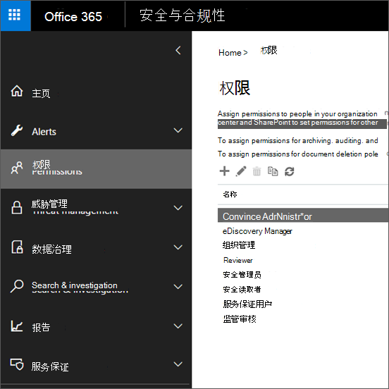

# 安全与合规中心内的权限

[!INCLUDE [Microsoft 365 Defender rebranding](../includes/microsoft-defender-for-office.md)]

**适用对象**
- [Exchange Online Protection](exchange-online-protection-overview.md)
- [Microsoft Defender for Office 365 计划 1 和计划 2](defender-for-office-365.md)
- [Microsoft 365 Defender](../defender/microsoft-365-defender.md)

安全&合规中心允许你向执行合规性任务（如设备管理、数据丢失防护、电子数据展示、保留等）的用户授予权限。 这些人员只能执行你明确授予其访问权限的任务。 若要访问安全&中心，用户需要是全局管理员或一个或多个安全与合规&组的成员。

安全与合规&中的权限基于基于角色的访问控制 (RBAC) 权限模型。 RBAC 与 Exchange 使用的权限模型相同，因此如果你熟悉 Exchange，在安全与合规中心内授予权限&非常相似。 但是，必须记住，Exchange组和安全&安全与合规中心角色组不共享成员身份或权限。 尽管二者都有一个组织管理角色组，但这两个角色组并不相同。 角色组授予的权限以及角色组的成员都有区别。 下面列出了安全与合规&角色组。

## 成员、角色和角色组之间的关系

**角色** 可授予执行一组任务的权限；例如，事例管理角色可以让人员处理电子数据展示事例。

**角色组** 是一组角色，允许用户在安全与合规中心&工作。 例如，合规性管理员角色组包括 (和其他角色) 包括案例管理、内容搜索和组织配置 (的角色以及其他) 因为合规性管理员需要具有执行这些任务的权限。

安全&合规中心包括用于需要为其分配人员的最常用任务和功能的默认角色组。 我们建议仅将单个用户添加 **为** 默认角色组的成员。

## 安全与合规中心&组

下表列出了安全与合规中心&的默认角色组，以及默认情况下分配给角色组的角色。 若要向用户授予执行合规性任务的权限，请将其添加到相应的安全与合规中心&组。

管理安全与&中心的权限仅允许用户访问安全与合规中心本身&功能的合规性功能。 如果要授予对不在安全 & 合规中心内的其他合规性功能的权限，例如 Exchange 邮件流规则 (也称为传输规则) ，则需要使用 Exchange 管理中心。

若要了解如何授予对安全与合规&的访问权限，请参阅向用户授予Microsoft 365[合规性管理中心的访问权限](grant-access-to-the-security-and-compliance-center.md)。

> [!NOTE]
> 若要查看安全 **与** 合规中心&"权限"选项卡，你需要是管理员。具体而言，您需要分配有"角色管理"角色，默认情况下，该角色仅分配给安全与合规中心&管理角色组。 此外， **角色管理** 角色允许用户查看、创建和修改角色组。

 

****

|角色组|说明|分配的默认角色|
|---|---|---|
|**通信合规性**|提供对以下所有通信合规性角色的权限：管理员、分析员、研究人员和查看者。|案例管理 
 通信合规性管理员 
 通信合规性分析员 
 通信合规性案例管理 
 通信合规性调查员 
 通信合规性查看者 
 数据分类反馈提供程序 
 View-Only Case|
|**通信合规性管理员**|通信合规性管理员，可创建/编辑策略和定义全局设置。|通信合规性管理员 
 通信合规性案例管理|
|**通信合规性分析师**|可调查策略匹配项、查看邮件元数据和采取修正操作的通信合规性分析员。|通信合规性分析员 
 通信合规性案例管理|
|**通信合规调查人员**|可调查策略匹配项、查看邮件内容以及执行修正操作的通信合规性分析员。|案例管理 
 通信合规性分析员 
 通信合规性案例管理 
 通信合规性调查员 
 数据分类反馈提供程序 
 View-Only Case|
|**通信合规性查看器**|可以访问可用报告和小组件的通信合规性查看器。|通信合规性案例管理 
 通信合规性查看者|
|**合规性管理员**1|成员可以管理设备管理、数据丢失防护、报告和保留的设置。|案例管理 
 合规管理员 
 合规性搜索 
 数据分类反馈提供程序 
 数据分类反馈审阅者 
 设备管理 
 处置管理 
 DLP 合规性管理 
 Hold 
 IB 合规性管理 
 管理通知 
 组织配置 
 RecordManagement 
 保留管理 
 仅供查看审核日志 
 View-Only Case 
 View-Only设备管理 
 View-Only DLP 合规性管理 
 View-Only IBS 合规性管理 
 View-Only管理警报 
 仅查看收件人 
 View-Only记录管理 
 View-Only保留管理|
|**合规数据管理员**|成员可以管理设备管理、数据保护、数据丢失防护、报告和保留的设置。|合规管理员 
 合规性搜索 
 设备管理 
 DLP 合规性管理 
 处置管理 
 IB 合规性管理 
 管理通知 
 组织配置 
 RecordManagement 
 保留管理 
 敏感度标签管理员 
 仅供查看审核日志 
 View-Only设备管理 
 View-Only DLP 合规性管理 
 View-Only一致性管理 
 View-Only管理警报 
 仅查看收件人 
 View-Only记录管理 
 View-Only保留管理|
|**合规性管理器管理员**|管理模板创建和修改。|合规性管理器管理 
 合规性管理器评估 
 合规性管理器贡献 
 合规性管理器读者|
|**合规性管理器评估员**|创建评估、实施改进操作和更新改进操作的测试状态。|合规性管理器评估 
 合规性管理器贡献 
 合规性管理器读者|
|**合规性管理器参与者**|创建评估并执行工作以实施改进操作。|合规性管理器贡献 
 合规性管理器读者|
|**合规性管理器读者**|查看除管理员功能之外的所有合规性管理器内容。|合规性管理器读者|
|**内容资源管理器内容查看器**|在内容资源管理器中查看内容文件。|数据分类内容查看器|
|**内容资源管理器列表查看器**|仅以列表格式查看内容资源管理器中的所有项目。|数据分类列表查看器|
|**电子数据展示管理员**|成员可以执行搜索并将邮箱、SharePoint Online 网站和 OneDrive for Business 位置置于保留状态。 成员还可以创建和管理电子数据展示事例、向事例添加和删除成员、创建和编辑与事例关联的内容搜索以及访问 Advanced eDiscovery。 
 电子数据展示管理员是电子数据展示管理员角色组的成员，该成员已分配有其他权限。 除了电子数据展示管理员可以执行的任务之外，电子数据展示管理员可以：<ul><li>查看组织的所有电子数据展示事例。</li><li>将其自己添加为任何电子数据展示事例的成员后管理这些事例。</li></ul> 
 电子数据 &展示管理员与电子数据展示管理员之间的主要区别在于，电子数据展示管理员可以访问安全与合规中心的"电子数据展示事例"页面上列出的所有事例。 电子数据展示管理员只能访问他们创建的事例或他们作为成员的情况。 有关使用户成为电子数据展示管理员的信息，请参阅在安全与合规中心& [电子数据展示权限](../../compliance/assign-ediscovery-permissions.md)。|案例管理 
 通信 
 合规性搜索 
 Custodian 
 导出 
 Hold 
 预览 
 审阅 
 RMS 解密|
|**全局读取者**|成员对报告、警报具有只读访问权限，并且可以看到所有配置和设置。
 全局阅读器和安全读者之间的主要区别在于，全局读者可以访问 **配置和设置**。|安全信息读取者 
 敏感度标签阅读器 
 服务保障视图 
 仅供查看审核日志 
 View-Only设备管理 
 View-Only DLP 合规性管理 
 View-Only一致性管理 
 View-Only管理警报 
 仅查看收件人 
 View-Only记录管理 
 View-Only保留管理|
|**内部风险管理**|使用此角色组来管理单个组中组织的预览体验成员风险管理。 通过添加指定管理员、分析师和支持人员的所有用户帐户，可在单个组中配置预览体验计划风险管理权限。 此角色组包含所有预览体验计划风险管理权限角色。 这是快速开始使用预览体验计划风险管理的最简单方法，非常适合不需要为单独的用户组定义单独权限的组织。|案例管理 
 内部风险管理管理员 
 内部风险管理分析 
 内部风险管理调查 
 View-Only Case|
|**内部风险管理管理员**|使用此角色组最初配置内部风险管理，稍后再将内部风险管理员隔离到定义的组中。 此角色组的用户可以创建、阅读、更新和删除预览体验计划风险管理策略、全局设置和角色组分配。|案例管理 
 内部风险管理管理员 
 View-Only Case|
|**预览体验计划风险管理分析员**|使用此组为将充当预览体验成员案例分析员的用户分配权限。 此角色组的用户可以访问所有预览体验计划风险管理警报、案例和通知模板。 他们无法访问预览体验成员风险内容资源管理器。|案例管理 
 内部风险管理分析 
 View-Only Case|
|**内部风险管理审核员**|使用此组向将审核内部风险管理活动的用户分配权限。 此角色组的用户可以访问内部风险审核日志。|内部风险管理审核|
|**预览体验计划风险管理调查员**|使用此组为将充当预览体验成员、风险数据执行者的用户分配权限。 此角色组的用户可以访问所有事例的预览体验计划风险管理警报、案例、通知模板和内容资源管理器。|案例管理 
 内部风险管理调查 
 View-Only Case|
|**IRM 参与者**|此角色组可见，但仅由后台服务使用。|内部风险管理永久参与 
 内部风险管理临时参与|
|**MailFlow 管理员**|成员可以在安全与合规中心监视和查看&见解和报告。 全局管理员可以向此组添加普通用户，但是，如果用户不是 Exchange Admin 组的成员，则用户将无法访问与Exchange相关的任务。|仅查看收件人|
|**组织管理**1|成员可以控制访问安全与合规&功能的权限，还可以管理设备管理、数据丢失防护、报告和保留的设置。 
 不是全局管理员的用户必须是 Exchange 管理员，才能在由 Microsoft 365 (（以前称为移动设备管理或 MDM 管理）管理的设备上查看和) 。 
 全局管理员将自动添加为此角色组的成员。|审核日志 
 案例管理 
 合规管理员 
 合规性搜索 
 设备管理 
 DLP 合规性管理 
 Hold 
 IB 合规性管理 
 管理通知 
 组织配置 
 隔离 
 RecordManagement 
 保留管理 
 角色管理 
 搜索和清除 
 安全管理员 
 安全信息读取者 
 敏感度标签管理员 
 敏感度标签阅读器 
 服务保障视图 
 标记参与者 
 标记管理器 
 标记读取器 
 仅供查看审核日志 
 View-Only设备管理 
 View-Only DLP 合规性管理 
 View-Only一致性管理 
 View-Only Case 
 View-Only管理警报 
 仅查看收件人 
 View-Only记录管理 
 View-Only保留管理|
|**隔离管理员**|成员可以访问所有隔离操作。 有关详细信息，请参阅在 EOP 中以管理员角色 [管理隔离的邮件和文件](manage-quarantined-messages-and-files.md)|隔离|
|**记录管理**|成员可以配置记录管理的各个方面，包括保留标签和处置评审。|处置管理 
 RecordManagement 
 保留管理|
|**Reviewer**|成员可以在一些情况下访问[Advanced eDiscovery](../../compliance/overview-ediscovery-20.md)集。 此角色组的成员可以在"电子数据展示 **">"** 高级"页上查看和打开Microsoft 365 合规中心他们作为成员的成员。 用户访问案例后Advanced eDiscovery，可以选择"审阅集"来访问案例数据。  此角色不允许用户预览与案例关联的集合搜索的结果，或执行其他搜索或案例管理任务。 此角色组的成员只能访问审阅集内的数据。|审阅|
|**安全管理员**|成员可以访问 Identity Protection Center、Privileged Identity Management、Monitor Microsoft 365 Service Health 和 Security & 安全中心等多个安全功能。 
 默认情况下，此角色组可能看起来没有任何成员。 但是，安全管理员角色Azure Active Directory分配给此角色组。 因此，此角色组从角色组继承安全管理员角色Azure Active Directory。 
 若要集中管理权限，在管理中心中添加和Azure Active Directory组成员。 有关详细信息，请参阅 [Azure AD 内置角色](/azure/active-directory/roles/permissions-reference)。 如果在安全与合规中心 & (成员身份或角色) 中编辑此角色组，则这些更改仅适用于安全 & 合规中心，不适用于任何其他服务。 
 此角色组包括安全读者角色的所有只读权限，以及用于相同服务的其他许多管理权限：Azure 信息保护、标识保护中心、Privileged Identity Management、监视 Microsoft 365 服务运行状况和安全 & 合规性中心。|审核日志 
 设备管理 
 DLP 合规性管理 
 IB 合规性管理 
 管理通知 
 隔离 
 安全管理员 
 敏感度标签管理员 
 标记参与者 
 标记管理器 
 标记读取器 
 仅供查看审核日志 
 View-Only设备管理 
 View-Only DLP 合规性管理 
 View-Only一致性管理 
 View-Only管理警报|
|**安全操作员**|成员可以管理安全警报，还可以查看安全功能的报告和设置。|合规性搜索 
 管理通知 
 安全信息读取者 
 标记参与者 
 标记读取器 
 仅供查看审核日志 
 View-Only设备管理 
 View-Only DLP 合规性管理 
 View-Only一致性管理 
 View-Only管理警报|
|**安全信息读取者**|成员对 Identity Protection Center、Privileged Identity Management、Monitor Microsoft 365 Service Health 和 Security &安全中心等多个安全功能具有只读访问权限。 
 默认情况下，此角色组可能看起来没有任何成员。 但是，安全读者角色Azure Active Directory分配给此角色组。 因此，此角色组从角色组继承安全读者角色Azure Active Directory。 
 若要集中管理权限，在管理中心中添加和Azure Active Directory组成员。 有关详细信息，请参阅 [Azure AD 内置角色](/azure/active-directory/roles/permissions-reference)。 如果在安全与合规中心 & (成员身份或角色) 中编辑此角色组，则这些更改仅适用于安全 & 合规中心，不适用于任何其他服务。|安全信息读取者 
 敏感度标签阅读器 
 标记读取器 
 View-Only设备管理 
 View-Only DLP 合规性管理 
 View-Only IBS 合规性管理 
 View-Only管理警报|
|**服务保证用户**|成员可以访问安全与合规中心中的服务&部分。 服务保证提供报告和文档，介绍 Microsoft 针对存储在客户安全中心中的客户数据Microsoft 365。 它还提供有关报告的独立第三方审核Microsoft 365。 有关详细信息，请参阅安全与 [合规中心&保证](../../compliance/service-assurance.md)。|服务保障视图|
|**监管审核**|成员可以创建和管理用于定义哪类通讯在组织中易受到审查的策略。 有关详细信息，请参阅 [为组织配置通信合规性策略](../../compliance/communication-compliance-configure.md)。|监管审核管理员|
|

> [!NOTE]
> 1此角色组不会向成员分配搜索 审核日志 或使用可能包含 Exchange 数据的任何报告（如 DLP 或 Defender for Office 365 报告）所需的权限。 若要搜索审核日志或查看所有报告，用户必须分配有Exchange Online。 这是因为用于搜索审核日志的基础 cmdlet 是 Exchange Online cmdlet。 全局管理员可搜索审核日志并查看所有报告，因为它们会自动添加为组织中组织管理角色Exchange Online。 有关详细信息，请参阅在安全与[审核日志中心搜索&搜索。](../../compliance/search-the-audit-log-in-security-and-compliance.md)

## 安全与合规&中的角色

下表列出了可用角色及其默认分配到的角色组。

请注意，默认情况下不会将以下角色分配给组织管理角色组：

- 通信
- 通信合规性管理员
- 通信合规性分析员
- 通信合规性案例管理
- 通信合规性调查员
- 通信合规性查看者
- 合规性管理器管理
- 合规性管理器评估
- 合规性管理器贡献
- 合规性管理器读者
- Custodian
- 数据分类内容查看器
- 数据分类反馈提供程序
- 数据分类反馈审阅者
- 数据分类列表查看器
- 处置管理
- 导出
- 内部风险管理管理员
- 内部风险管理分析
- 内部风险管理审核
- 内部风险管理调查
- 内部风险管理永久参与
- 内部风险管理临时参与
- 预览
- 审阅
- RMS 解密
- 监管审核管理员

 

****

|Role|说明|默认角色组分配|
|---|---|---|
|**审核日志**|打开并配置组织的审核，查看组织的审核报告，然后将这些报告导出到文件中。|组织管理 
 安全管理员|
|**案例管理**|创建、编辑、删除和控制对电子数据展示事例的访问。|通信合规性 
 通信合规调查人员 
 合规管理员 
电子数据展示管理员 
 内部风险管理 
 内部风险管理管理员 
 预览体验计划风险管理分析员 
 预览体验计划风险管理调查员 
 组织管理|
|**通信**|管理与案例识别的保管人Advanced eDiscovery通信。  创建保留通知、保留提醒以及上报给管理。 跟踪保管人对保留通知的确认，并管理对保管人门户的访问，在一种情况下，每个保管人使用该门户跟踪被识别为保管人的情况的通信。|电子数据展示管理员|
|**通信合规性管理员**|用于管理通信合规性功能中的策略。|通信合规性 
 通信合规性管理员|
|**通信合规性分析员**|用于对通信合规性功能中的邮件违反情况进行调查、修正。 只能查看邮件元数据。|通信合规性 
 通信合规性分析师 
 通信合规调查人员|
|**通信合规性案例管理**|用于访问通信合规性事例。|通信合规性 
 通信合规性管理员 
 通信合规性分析师 
 通信合规调查人员 
 通信合规性查看器|
|**通信合规性调查员**|用于执行通信合规性功能中的调查、修正和查看邮件违反。 可查看邮件元数据和消息。|通信合规性 
 通信合规调查人员|
|**通信合规性查看者**|用于访问通信合规性功能中的报告和小组件。|通信合规性 
 通信合规性查看器|
|**合规性管理员**|查看和编辑合规性功能的设置和报告。|合规管理员 
 合规数据管理员 
 组织管理|
|**合规性管理器管理**|管理模板创建和修改。|合规性管理器管理员|
|**合规性管理器评估**|创建评估、实施改进操作和更新改进操作的测试状态。|合规性管理器管理员 
 合规性管理器评估员|
|**合规性管理器贡献**|创建评估并执行工作以实施改进操作。|合规性管理器管理员 
 合规性管理器评估员 
 合规性管理器参与者|
|**合规性管理器读者**|查看除管理员功能之外的所有合规性管理器内容。|合规性管理器管理员 
 合规性管理器评估员 
 合规性管理器参与者 
 合规性管理器读者|
|**合规性搜索**|跨邮箱执行搜索并估计结果。|合规管理员 
 合规数据管理员 
电子数据展示管理员 
 组织管理 
 安全操作员|
|**Custodian**|识别和管理事例Advanced eDiscovery保管人，并使用来自Azure Active Directory和其他来源的信息查找与保管人关联的数据源。 将其他数据源（如邮箱、SharePoint网站Teams案例与保管人关联。  对与保管人关联的数据源设置法定保留，以在案例上下文中保留内容。|电子数据展示管理员|
|**数据分类内容查看器**|在内容资源管理器中查看文件的就地呈现。|内容资源管理器内容查看器|
|**数据分类反馈提供程序**|允许在内容资源管理器中向分类器提供反馈。|通信合规性 
 通信合规调查人员 
 合规管理员|
|**数据分类反馈审阅者**|允许在反馈资源管理器中查看分类器的反馈。|合规管理员|
|**数据分类列表查看器**|在内容资源管理器中查看文件列表。|内容资源管理器列表查看器|
|**设备管理**|查看和编辑设备管理功能的设置和报告。|合规管理员 
 合规数据管理员 
 组织管理 
 安全管理员|
|**处置管理**|控制在安全与合规中心内访问&处置的权限。|合规管理员 
 合规数据管理员 
 记录管理|
|**DLP 合规性管理**|查看和编辑 DLP 策略中的数据丢失防护 () 报告。|合规管理员 
 合规数据管理员 
 组织管理 
 安全管理员|
|**Export**|导出从搜索返回的邮箱和网站内容。|电子数据展示管理员|
|**Hold**|将邮箱、网站和公用文件夹中的内容置于保留状态。 当保留时，内容的副本将存储在安全的位置。 内容所有者仍可修改或删除原始内容。|合规管理员 
电子数据展示管理员 
 组织管理|
|**IB 合规性管理**|查看、创建、删除、修改和测试信息屏障策略。|合规管理员 
 合规数据管理员 
 组织管理 
 安全管理员|
|**内部风险管理管理员**|创建、编辑、删除和控制对内部风险管理功能的访问。|内部风险管理 
 内部风险管理管理员|
|**内部风险管理分析**|访问所有内部风险管理警报、案例和通知模板。|内部风险管理 
 预览体验计划风险管理分析员|
|**内部风险管理审核**|允许查看 Insider Risk 审核线索。|内部风险管理审核员|
|**内部风险管理调查**|访问所有案例的所有内部风险管理警报、案例、通知模板和内容资源管理器。|内部风险管理 
 预览体验计划风险管理调查员|
|**内部风险管理永久参与**|此角色组可见，但仅由后台服务使用。|IRM 参与者|
|**内部风险管理临时参与**|此角色组可见，但仅由后台服务使用。|IRM 参与者|
|**管理警报**|查看和编辑警报的设置和报告。|合规管理员 
 合规数据管理员 
 组织管理 
 安全管理员 
 安全操作员|
|**组织配置**|运行、查看和导出审核报告，并管理 DLP、设备和保留的合规性策略。|合规管理员 
 合规数据管理员 
 组织管理|
|**预览**|查看从内容搜索返回的项目列表，并打开列表中的每个项目以查看其内容。|电子数据展示管理员|
|**隔离**|允许查看和释放隔离电子邮件。|隔离管理员 
 安全管理员 
 组织管理|
|**RecordManagement**|查看和编辑记录管理功能的配置。|合规管理员 
 合规数据管理员 
 组织管理 
 记录管理|
|**保留管理**|管理保留策略、保留标签和保留标签策略。|合规管理员 
 合规数据管理员 
 组织管理 
 记录管理|
|**审阅**|此角色允许用户在一些情况下访问Advanced eDiscovery集。 分配了此角色的用户可以在他们作为成员>电子数据展示Microsoft 365 合规中心 **高级**"页面上查看和打开事例列表。 用户访问案例后Advanced eDiscovery，可以选择"审阅集"来访问案例数据。  此角色不允许用户预览与案例关联的集合搜索的结果，或执行其他搜索或案例管理任务。 具有此角色的用户只能访问审阅集内的数据。|电子数据展示管理员 
 Reviewer|
|**RMS 解密**|导出搜索结果时解密受 RMS 保护的内容。|电子数据展示管理员|
|**角色管理**|管理角色组成员身份并创建或删除自定义角色组。|组织管理|
|**搜索和清除**|允许用户批量删除与内容搜索条件匹配的数据。|组织管理|
|**安全管理员**|查看和编辑安全功能的配置和报告。|组织管理 
 安全管理员|
|**安全信息读取者**|查看安全功能的配置和报告。|全局读取者 
 组织管理 
 安全操作员 
 安全信息读取者|
|**敏感度标签管理员**|查看、创建、修改和删除敏感度标签。|合规数据管理员 
 组织管理 
 安全管理员|
|**敏感度标签阅读器**|查看敏感度标签的配置和使用。|全局读取者 
 组织管理 
 安全信息读取者|
|**服务保障视图**|从服务保障部分下载可用文档。 内容包括独立审核、合规性文档和与信任相关的指南，Microsoft 365功能来管理法规合规性和安全风险。|全局读取者 
 组织管理 
 服务保证用户|
|**监管审核管理员**|管理监管审核策略，包括要审阅的通信和审阅者。|监管审核|
|**标记参与者**|查看和更新现有用户标记的成员身份。|组织管理 
 安全管理员 
 安全操作员|
|**标记管理器**|查看、更新、创建和删除用户标记。|组织管理 
 安全管理员|
|**标记读取器**|对现有用户标记的只读访问。|安全信息读取者|
|**仅供查看审核日志**|查看和导出审核报告。 因为这些报告可能包含敏感信息，所以应仅向明确需要查看此信息的人分配此角色。|合规管理员 
 合规数据管理员 
 全局读取者 
 组织管理 
 安全管理员 
 安全操作员|
|**仅查看案例**||通信合规性 
 通信合规调查人员 
 合规管理员 
 内部风险管理 
 内部风险管理管理员 
 预览体验计划风险管理分析员 
 预览体验成员风险管理调查人员 
 组织管理|
|**仅查看设备管理**|查看设备管理功能的配置和报告。|合规管理员 
 合规数据管理员 
 全局读取者 
 组织管理 
 安全管理员 
 安全操作员 
 安全信息读取者|
|**仅查看 DLP 合规性管理**|查看 DLP 策略中的数据丢失防护 () 报告。|合规管理员 
 合规数据管理员 
 全局读取者 
 组织管理 
 安全管理员 
 安全操作员 
 安全信息读取者|
|**仅查看 IBM 合规性管理**|查看信息屏障功能的配置和报告。|合规管理员 
 合规数据管理员 
 全局读取者 
 组织管理 
 安全管理员 
 安全操作员 
 安全信息读取者|
|**仅查看管理警报**|查看"管理警报"功能的配置和报告。|合规管理员 
 合规数据管理员 
 全局读取者 
 组织管理 
 安全管理员 
 安全操作员 
 安全信息读取者|
|**仅查看收件人**|查看有关用户和组的信息。|合规管理员 
 合规数据管理员 
 全局读取者 
 MailFlow 管理员 
 组织管理|
|**仅查看记录管理**|查看记录管理功能的配置。|合规管理员 
 合规数据管理员 
 
 全局读取者 
 组织管理|
|**仅查看保留管理**|查看保留策略、保留标签和保留标签策略的配置。|合规管理员 
 合规数据管理员 
 全局管理员 
 组织管理|
|
