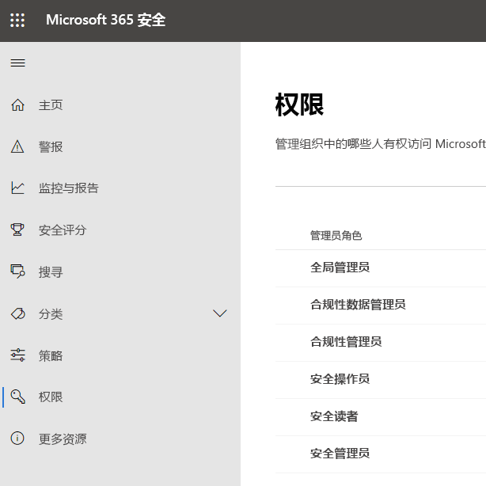

# Microsoft 365 合规中心和 Microsoft 365 安全中心中的权限Permissions in the Microsoft 365 compliance center and Microsoft 365 security center

组织需要管理跨所有 Microsoft 365 服务的安全和合规性方案。Your organization needs to manage security and compliance scenarios that span all the Microsoft 365 services. 并且你需要灵活地向组织 IT 组中的正确人员授予正确的管理员权限。And you need the flexibility to give the right admin permissions to the right people in your organization's IT group. 使用 Microsoft 365 安全中心或 Microsoft 365 合规中心，可以集中管理与安全或合规性相关的所有任务的权限。By using the Microsoft 365 security center or Microsoft 365 compliance center, you can manage permissions centrally for all tasks related to security or compliance.

在全局管理员分配这些管理员角色后，这些管理员可以访问跨 Microsoft 365 中所有服务（例如，Microsoft 365 安全中心、Microsoft 365 合规中心、Azure、Office 365 和企业移动性 + 安全性）的功能和数据。After the global administrator assigns these admin roles, the admins have access to features and data that span all services in Microsoft 365, such as the Microsoft 365 security center, Microsoft 365 compliance center, Azure, Office 365, and Enterprise Mobility + Security.

## Microsoft 365 角色是什么What the Microsoft 365 roles are

Microsoft 365 合规中心和 Microsoft 365 安全中心中显示的角色均为 Azure Active Directory 角色。The roles that appear in the Microsoft 365 compliance center and Microsoft 365 security center are Azure Active Directory roles. 这些角色旨在与组织 IT 组中的工作职能保持一致，从而可以轻松地使人员获得完成其工作所需的所有权限。These roles are designed to align with job functions in your organization's IT group, making it easy to give a person all the permissions necessary to get their job done.

|**角色****Role**|**说明****Description**|
|:-----|:-----|
|**全局管理员****Global administrator**|具有此角色的用户可以访问所有 Microsoft 365 服务中的所有管理功能。Users with this role have access to all administrative features in all Microsoft 365 services. 只有全局管理员才能分配其他管理员角色。Only global administrators can assign other administrator roles.|
|**合规性数据管理员****Compliance data administrator**|具有此角色的用户可以在 Microsoft 365 中跟踪组织的数据，确保数据受到保护，并深入了解任何问题以帮助缓解风险。Users with this role can keep track of your organization's data across Microsoft 365, make sure it's protected, and get insights into any issues to help mitigate risks.|
|**合规性管理员****Compliance administrator**|具有此角色的用户可以帮助组织遵守任何法规要求，管理电子数据展示案例，并维护 Microsoft 365 位置、标识和应用中的数据治理策略。Users with this role can help your organization stay compliant with any regulatory requirements, manage eDiscovery cases, and maintain data governance policies across Microsoft 365 locations, identities, and apps.|
|**安全操作员****Security operator**|具有此角色的用户可以查看、调查和响应对 Microsoft 365 用户、设备和内容的活动威胁。Users with this role can view, investigate, and respond to active threats to your Microsoft 365 users, devices, and content.|
|**安全读者****Security reader**|具有此角色的用户可以查看和调查对 Microsoft 365 用户、设备和内容的活动威胁，但（不同于安全操作员）他们无权采取措施来进行响应。Users with this role can view and investigate active threats to your Microsoft 365 users, devices, and content, but (unlike the Security operator) they do not have permissions to respond by taking action.|
|**安全管理员****Security Administrator**|具有此角色的用户可通过管理安全策略、查看 Microsoft 365 产品中的安全分析和报告以及及时了解威胁形势来控制组织的总体安全。Users with this role can control your organization's overall security by managing security policies, reviewing security analytics and reports across Microsoft 365 products, and staying up-to-speed on the threat landscape.|

## Microsoft 365 角色有权访问的内容What the Microsoft 365 roles have access to

可用角色及分配到这些角色的用户可执行的操作如下：Here are the available roles and what people assigned to them can do.

### 全局管理员Global administrator

具有此角色的用户有权访问 Azure Active Directory 以及使用 Azure Active Directory 标识的服务（例如 Microsoft 365 安全中心、Microsoft 365 合规中心、Exchange Online、SharePoint Online 和 Skype for Business Online）中的所有管理功能。Users with this role have access to all administrative features in Azure Active Directory, as well as services that use Azure Active Directory identities like Microsoft 365 security center, Microsoft 365 compliance center, Exchange Online, SharePoint Online, and Skype for Business Online. 注册 Azure Active Directory 租户的人员将成为全局管理员。The person who signs up for the Azure Active Directory tenant becomes a global administrator. 只有全局管理员才能分配其他管理员角色。Only global administrators can assign other administrator roles. 公司中可以有多个全局管理员。There can be more than one global administrator at your company. 全局管理员可以为任何用户和所有其他管理员重置密码。Global admins can reset the password for any user and all other administrators.

### 合规性管理员Compliance administrator

具有此角色的用户有权管理 Microsoft 365 合规中心、Microsoft 365 管理中心、Azure 和 Office 365 安全与合规中心中的合规性相关功能。Users with this role have permissions to manage compliance-related features in the Microsoft 365 compliance center, Microsoft 365 admin center, Azure, and Office 365 Security & Compliance Center. 这些用户还可以管理 Exchange 管理中心、Teams 和 Skype for Business 管理中心内的所有功能，并可创建适用于 Azure 和 Microsoft 365 的支持票证。Users can also manage all features within the Exchange admin center and Teams & Skype for Business admin center and create support tickets for Azure and Microsoft 365.

|**在此服务中...****In this service...**|**合规性管理员可以...****The compliance administrator can...**|
|:-----|:-----|
|[**Microsoft 365 合规性中心****Microsoft 365 compliance center**](https://compliance.microsoft.com/)|跨 Microsoft 365 服务保护和管理组织数据。Protect and manage your organization's data across Microsoft 365 services.    管理合规性警报。Manage compliance alerts.|
|[**合规性管理器****Compliance Manager**](https://docs.microsoft.com/office365/securitycompliance/meet-data-protection-and-regulatory-reqs-using-microsoft-cloud)|跟踪、分配并验证组织的法规合规性活动。Track, assign, and verify your organization's regulatory compliance activities.|
|[**Office 365 安全与合规中心****Office 365 Security & Compliance Center**](https://support.office.com/article/About-Office-365-admin-roles-da585eea-f576-4f55-a1e0-87090b6aaa9d)|管理数据治理。Manage data governance    执行法律和数据调查。Perform legal and data investigation.    管理数据主体请求。Manage Data Subject Request.|
|[**Intune****Intune**](https://docs.microsoft.com/intune/role-based-access-control)|查看所有 Intune 审核数据。View all Intune audit data.|
|[**云应用安全****Cloud App Security**](https://docs.microsoft.com/cloud-app-security/manage-admins)|拥有只读权限，可以管理警报。Has read-only permissions and can manage alerts.    可以创建和修改文件策略并允许执行文件管理操作。Can create and modify file policies and allow file governance actions.    可以查看数据管理下的所有内置报告。Can view all the built-in reports under Data Management.|

### 合规性数据管理员Compliance data administrator

具有此角色的用户有权保护和跟踪 Microsoft 365 合规中心、Microsoft 365 管理中心和 Azure 中的数据。Users with this role have permissions to protect and track data in the Microsoft 365 compliance center, Microsoft 365 admin center, and Azure. 这些用户还可以管理 Exchange 管理中心、Compliance Manager、Teams 和 Skype for Business 管理中心内的所有功能，并可创建适用于 Azure 和 Microsoft 365 的支持票证。Users can also manage all features within the Exchange admin center, Compliance Manager, and Teams & Skype for Business admin center and create support tickets for Azure and Microsoft 365.

|**在此服务中...****In this service...**|**合规性数据管理员可以...****The compliance data administrator can...**|
|:-----|:-----|
|[**Microsoft 365 合规性中心****Microsoft 365 compliance center**](https://compliance.microsoft.com/)|跨 Microsoft 365 服务保护和管理组织数据。Protect and manage your organization's data across Microsoft 365 services.    管理合规性警报。Manage compliance alerts.    管理敏感度标签Manage sensitivity labels|
|[**合规性管理器****Compliance Manager**](https://docs.microsoft.com/office365/securitycompliance/meet-data-protection-and-regulatory-reqs-using-microsoft-cloud)|跟踪、分配并验证组织的法规合规性活动。Track, assign, and verify your organization's regulatory compliance activities.|
|[**Office 365 安全与合规中心****Office 365 Security & Compliance Center**](https://support.office.com/article/About-Office-365-admin-roles-da585eea-f576-4f55-a1e0-87090b6aaa9d)|管理数据治理。Manage data governance    执行法律和数据调查。Perform legal and data investigation.    管理数据主体请求。Manage Data Subject Request.    管理敏感度标签Manage sensitivity labels|
|[**Intune**](https://docs.microsoft.com/intune/role-based-access-control)（即将推出）[**Intune**](https://docs.microsoft.com/intune/role-based-access-control) (coming soon)|查看所有 Intune 审核数据。View all Intune audit data.|
|[**云应用安全****Cloud App Security**](https://docs.microsoft.com/cloud-app-security/manage-admins)|使用只读权限查看信息。Use read-only permissions to view information.  管理警报。Manage alerts.    创建和修改文件策略并允许执行文件管理操作。Create and modify file policies and allow file governance actions.    查看数据管理下的所有内置报告。View all the built-in reports under Data Management.|

### 安全管理员Security administrator

具有此角色的用户有权管理 Microsoft 365 安全中心、Azure Active Directory Identity Protection、Azure 信息保护和 Office 365 安全与合规中心中与安全相关的功能。Users with this role have permissions to manage security-related features in the Microsoft 365 security center, Azure Active Directory Identity Protection, Azure Information Protection, and Office 365 Security & Compliance Center.

|**在此服务中...****In this service...**|**安全管理员...****The security administrator can...**|
|:-----|:-----|
|[**Microsoft 365 安全中心****Microsoft 365 security center**](https://security.microsoft.com/)|跨 Microsoft 365 服务监视与安全相关的策略。Monitor security-related policies across Microsoft 365 services.     管理安全威胁和警报。Manage security threats and alerts.    查看报告。View reports    管理敏感度标签。Manage sensitivity labels.|
|**Identity Protection 中心****Identity Protection Center**|执行“安全读者”角色可以执行的所有操作，此外，还执行所有 Identity Protection 中心操作，但不可重置密码。Do everything the Security Reader role can, plus  perform all Identity Protection Center operations, except for reset passwords.|
|[**Privileged Identity Management****Privileged Identity Management**](https://docs.microsoft.com/azure/active-directory/privileged-identity-management/pim-configure)|执行“安全读者”角色可执行的所有操作。Do everything the Security Reader role can.    **无法**管理 Azure AD 角色分配或设置。**Cannot** manage Azure AD role assignments or settings.|
|[**Office 365 安全与合规中心****Office 365 Security & Compliance Center**](https://support.office.com/article/About-Office-365-admin-roles-da585eea-f576-4f55-a1e0-87090b6aaa9d)|管理安全策略。Manage, configure, and apply security policies.    查看、调查和响应安全威胁View, investigate, and respond to security threats    查看报告。View reports    管理敏感度标签。Manage sensitivity labels.|
|**Azure 高级威胁防护****Azure Advanced Threat Protection**|监视和响应可疑安全活动。Monitor and respond to suspicious security activity.|
|**Windows Defender ATP 和 EDR****Windows Defender ATP and EDR**|分配角色。Assign admin roles    管理计算机组。Manage machine groups.    配置终结点威胁检测和自动修正。Configure endpoint threat detection and automated remediation.    查看、调查并响应警报。View, investigate, and respond to alerts.|
|[**Intune****Intune**](https://docs.microsoft.com/intune/role-based-access-control)|视图用户、设备、注册、配置和应用程序信息。Views user, device, enrollment, configuration, and application information.    **无法**对 Intune 进行更改。**Cannot** make changes to Intune.|
|[**云应用安全****Cloud App Security**](https://docs.microsoft.com/cloud-app-security/manage-admins)|添加管理员、添加策略和设置、上传日志以及执行管理操作。Add admins, add policies and settings, upload logs and perform governance actions.|
|[**Azure 安全中心**](https://docs.microsoft.com/azure/role-based-access-control/built-in-roles)（即将支持）[**Azure Security Center**](https://docs.microsoft.com/azure/role-based-access-control/built-in-roles) (coming soon)|查看安全策略、查看安全状态、编辑安全策略、查看警报和建议、关闭警报和建议。View security policies, view security states, edit security policies, view alerts and recommendations, dismiss alerts and recommendations.|
|[**Office 365 服务运行状况****Office 365 service**](https://docs.microsoft.com/office365/enterprise/view-service-health)|查看 Office 365 服务的运行状况。View the health of Office 365 services.|

### 安全操作员Security operator

具有此角色的用户可以管理警报，对安全相关的功能具有全局只读访问权限，包括 Microsoft 365 安全中心、Azure Active Directory、Identity Protection、Privileged Identity Management 中的所有信息，并且能够阅读 Azure Active Directory 登录报告和审核日志，还授予了对 Office 365 安全与合规中心的只读权限。Users with this role can manage alerts and have global read-only access on security-related feature, including all information in Microsoft 365 security center, Azure Active Directory, Identity Protection, Privileged Identity Management, as well as the ability to read Azure Active Directory sign-in reports and audit logs, and in Office 365 Security & Compliance Center.

|**在此服务中...****In this service...**|**安全操作员可以...****The security operator can...**|
|:-----|:-----|
|[**Microsoft 365 安全中心****Microsoft 365 security center**](https://security.microsoft.com/)|执行“安全读者”角色可执行的所有操作。Do everything the Security Reader role can.    查看、调查和响应安全警报。View, investigate, and respond to security alerts.|
|**Identity Protection 中心**（即将支持）**Identity Protection Center** (coming soon)|执行“安全读者”角色可执行的所有操作。Do everything the Security Reader role can.|
|[**Privileged Identity Management****Privileged Identity Management**](https://docs.microsoft.com/azure/active-directory/privileged-identity-management/pim-configure)|执行“安全读者”角色可执行的所有操作。Do everything the Security Reader role can.|
|[**Office 365 安全与合规中心****Office 365 Security & Compliance Center**](https://support.office.com/article/About-Office-365-admin-roles-da585eea-f576-4f55-a1e0-87090b6aaa9d)|执行“安全读者”角色可执行的所有操作。Do everything the Security Reader role can.    查看、调查和响应安全威胁View, investigate, and respond to security threats|
|**Windows Defender ATP 和 EDR****Windows Defender ATP and EDR**|执行“安全读者”角色可执行的所有操作。Do everything the Security Reader role can.    查看、调查并响应警报。View, investigate, and respond to alerts.|
|[**Intune****Intune**](https://docs.microsoft.com/intune/role-based-access-control)|视图用户、设备、注册、配置和应用程序信息。Views user, device, enrollment, configuration, and application information.    **无法**对 Intune 进行更改。**Cannot** make changes to Intune.|
|[**云应用安全****Cloud App Security**](https://docs.microsoft.com/cloud-app-security/manage-admins)|执行“安全读者”角色可以执行的所有操作，此外，还可以查看和关闭警报。Do everything the Security Reader role can, plus view and dismiss alerts.|
|[**Office 365 服务运行状况****Office 365 service**](https://docs.microsoft.com/office365/enterprise/view-service-health)|查看 Office 365 服务的运行状况。View the health of Office 365 services.|

### 安全读者Security reader

具有此角色的用户对安全相关的功能具有全局只读访问权限，包括 Microsoft 365 安全中心、Azure Active Directory、Identity Protection、Privileged Identity Management 中的所有信息，并且能够阅读 Azure Active Directory 登录报告和审核日志，还授予了对 Office 365 安全与合规中心的只读权限。Users with this role have global read-only access on security-related feature, including all information in Microsoft 365 security center, Azure Active Directory, Identity Protection, Privileged Identity Management, as well as the ability to read Azure Active Directory sign-in reports and audit logs, and in Office 365 Security & Compliance Center.

|**在此服务中...****In this service...**|**安全读者可以...****The security reader can...**|
|:-----|:-----|
|[**Microsoft 365 安全中心****Microsoft 365 security center**](https://security.microsoft.com/)|跨 Microsoft 365 服务查看与安全相关的策略。View security-related policies across Microsoft 365 services.    查看安全威胁和警报。View security threats and alerts.    查看报告。View reports|
|**Identity Protection 中心****Identity Protection Center**|阅读有关安全功能的所有安全报告和设置信息：反垃圾邮件、加密、数据丢失防护 (DLP)、反恶意软件、高级威胁防护 (ATP)、反网络钓鱼和邮件流规则（也称为传输规则）。Read all security reports and settings information for security features: anti-spam, encryption, data loss prevention (DLP), anti-malware, Advanced Threat Protection (ATP), anti-phishing, and mail flow rules (also known as transport rules).|
|[**Privileged Identity Management****Privileged Identity Management**](https://docs.microsoft.com/azure/active-directory/privileged-identity-management/pim-configure)|使用只读访问权限查看 Azure AD PIM 中显示的所有信息：Azure AD 角色分配的策略和报告、安全审核以及（以后）Azure AD 角色分配以外的方案的策略数据和报告。Use read-only access to view all information surfaced in Azure AD PIM: Policies and reports for Azure AD role assignments, security reviews, and (in the future) policy data and reports for scenarios other than Azure AD role assignment.    **无法**注册 Azure AD PIM 或对其进行任何更改。**Cannot** sign up for Azure AD PIM or make any changes to it. 担任此角色的人员可以在 PIM 门户中或通过 PowerShell 为符合条件的用户激活其他角色（例如，全局管理员或特权角色管理员）。In the PIM portal or via PowerShell, someone in this role can activate additional roles (for example, Global Admin or Privileged Role Administrator), if the user is a eligible for them.|
|[**Office 365 安全与合规中心****Office 365 Security & Compliance Center**](https://support.office.com/article/About-Office-365-admin-roles-da585eea-f576-4f55-a1e0-87090b6aaa9d)|查看安全策略。View security policies.    查看和调查安全威胁。View and investigate security threats.    查看报告。View reports|
|**Windows Defender ATP 和 EDR****Windows Defender ATP and EDR**|查看和调查警报。View and investigate alerts.|
|[**Intune****Intune**](https://docs.microsoft.com/intune/role-based-access-control)|视图用户、设备、注册、配置和应用程序信息。Views user, device, enrollment, configuration, and application information.    **无法**对 Intune 进行更改。**Cannot** make changes to Intune.|
|[**云应用安全****Cloud App Security**](https://docs.microsoft.com/cloud-app-security/manage-admins)|使用只读权限查看信息。Use read-only permissions to view information.    管理警报。Manage alerts.|
|[**Azure 安全中心****Azure Security Center**](https://docs.microsoft.com/azure/role-based-access-control/built-in-roles)|查看建议和警报。View recommendations and alerts.    查看安全策略。View security policies.    查看安全状态，但无法进行更改。View security states, but cannot make changes.|
|[**Office 365 服务运行状况****Office 365 service**](https://docs.microsoft.com/office365/enterprise/view-service-health)|查看 Office 365 服务的运行状况。View the health of Office 365 services.|

## 全局管理员可以管理 Azure Active Directory 中的角色。Global administrators can manage roles in Azure Active Directory

在 Microsoft 365 合规中心和 Microsoft 365 安全中心中，选择一个角色后，可查看其分配。In the Microsoft 365 compliance center and Microsoft 365 security center, when you select a role, you can view its assignments. 但若要管理这些分配，需要转到 Azure Active Directory。But to manage those assignments, you need to go to the Azure Active Directory.

有关详细信息，请参阅[查看和分配 Azure Active Directory 中的管理员角色](https://docs.microsoft.com/azure/active-directory/users-groups-roles/directory-manage-roles-portal)。For more information about administrator roles, see [Assigning administrator roles in Azure Active Directory](https://docs.microsoft.com/azure/active-directory/users-groups-roles/directory-manage-roles-portal).

## 管理服务中的角色，而不是 Azure Active Directory 中的角色Managing roles in a service instead of Azure Active Directory

Microsoft 365 合规中心和 Microsoft 365 安全中心中显示的角色也会显示在他们拥有权限的服务中。The roles that appear in the Microsoft 365 compliance center and Microsoft 365 security center also appear in the services where they have permissions. 例如，可以在 Office 365 安全与合规中心中看到这些角色。For example, you can see these roles in the Office 365 Security & Compliance Center.

### 中断继承Breaking inheritance

在 Azure Active Directory 中管理这些角色时，你是在为**所有** Microsoft 365 服务集中管理这些角色，了解这一点非常重要。It's important to understand that you when you manage these roles in Azure Active Directory, you're doing so centrally for **all** Microsoft 365 services. 然而，在管理特定服务（例如 Office 365 安全与合规中心），所管理的角色**仅**针对特定服务。However, when you manage a role in a specific service, such as the Office 365 Security & Compliance Center, you're managing the role for **only** that specific service. 服务中角色的分配和权限覆盖授予 Azure Active Directory 角色的任何权限。The assignments and permissions for a role in a service override any permissions granted to the Azure Active Directory role.

这可能很有用，例如，如果一个人被分配为安全管理员角色，那么他就无权管理事件。This can be useful – for example, if a person is assigned to the Security administrator role, they don't have permissions to manage incidents. 但是，你可以使用 Windows Defender 高级威胁防护中的权限来为该服务中的事件管理提供特定的权限。But you can use the permissions in Windows Defender Advanced Threat Protection to give them the specific permission for incident management in that service.

## 在何处查找每个 Microsoft 365 服务的角色信息Where to find role information for each Microsoft 365 service

通过将用户分配到 Microsoft 365 合规性或安全管理员角色之一，你可以授予该用户对一系列 Microsoft 365 服务的权限。By assigning a user to one of the Microsoft 365 compliance or security admin roles, you give that user permissions to a range of Microsoft 365 services. 使用下面的链接可以找到关于每个服务中角色特定权限的更多信息。Use the links below to find more information about the specific permissions for a role in each service.

|**Microsoft 365 服务****Microsoft 365 service resiliency**|**角色信息****Role info**|
|:-----|:-----|
|Office 365 和 Microsoft 365 业务计划中的管理员角色Admin roles in Office 365 and Microsoft 365 business plans|[Office 365 管理员角色About Office 365 admin roles](https://docs.microsoft.com/office365/admin/add-users/about-admin-roles?view=o365-worldwide)|
|Azure Active Directory (Azure AD) 和 Azure AD Identity ProtectionAzure Active Directory (Azure AD) and Azure AD Identity Protection|[Azure AD 管理员角色Azure AD roles](https://docs.microsoft.com/azure/active-directory/users-groups-roles/directory-assign-admin-roles)|
|Azure 高级威胁防护Azure Advanced Threat Protection|[Azure ATP 角色组Azure ATP role groups](https://docs.microsoft.com/azure-advanced-threat-protection/atp-role-groups)|
|Azure 信息保护Azure Information Protection|[Azure AD 管理员角色Azure AD roles](https://docs.microsoft.com/azure/active-directory/users-groups-roles/directory-assign-admin-roles)|
|合规性管理器Compliance Manager|[合规性管理器角色Compliance Manager roles](https://docs.microsoft.com/office365/securitycompliance/meet-data-protection-and-regulatory-reqs-using-microsoft-cloud#permissions-and-role-based-access-control)|
|Exchange OnlineExchange Online|[Exchange 基于角色的访问控制Exchange role-based access control](https://docs.microsoft.com/exchange/understanding-role-based-access-control-exchange-2013-help)|
|IntuneIntune|[Intune 基于角色的访问控制Intune role-based access control](https://docs.microsoft.com/intune/role-based-access-control)|
|托管桌面Microsoft Managed Desktop|[Azure AD 管理员角色Azure AD roles](https://docs.microsoft.com/azure/active-directory/users-groups-roles/directory-assign-admin-roles)|
|Microsoft Cloud App SecurityMicrosoft Cloud App Security|[基于角色的访问控制Role-based access control](https://docs.microsoft.com/cloud-app-security/manage-admins)|
|Office 365 安全与合规中心Office 365 Security & Compliance Center|[Office 365 管理员角色About Office 365 admin roles](https://docs.microsoft.com/office365/SecurityCompliance/permissions-in-the-security-and-compliance-center)|
|Privileged Identity ManagementPrivileged Identity Management|[Azure AD 管理员角色Azure AD roles](https://docs.microsoft.com/azure/active-directory/users-groups-roles/directory-assign-admin-roles)|
|安全功能分数Secure Score|[Azure AD 管理员角色Azure AD roles](https://docs.microsoft.com/azure/active-directory/users-groups-roles/directory-assign-admin-roles)|
|SharePoint OnlineSharePoint Online|[Azure AD 管理员角色Azure AD roles](https://docs.microsoft.com/azure/active-directory/users-groups-roles/directory-assign-admin-roles)    [关于 Office 365 中的 SharePoint 管理员角色About the SharePoint admin role in Office 365](https://docs.microsoft.com/sharepoint/sharepoint-admin-role)|
|Teams/Skype for BusinessTeams/Skype for Business|[Azure AD 管理员角色Azure AD roles](https://docs.microsoft.com/azure/active-directory/users-groups-roles/directory-assign-admin-roles)|
|Windows Defender 高级威胁防护Windows Defender Advanced Threat Protection|[Windows Defender ATP 基于角色的访问控制Windows Defender ATP role-based access control](https://docs.microsoft.com/windows/security/threat-protection/windows-defender-atp/rbac-windows-defender-advanced-threat-protection)|

## 即将支持的功能Content is coming soon.

我们仍在研究 Microsoft 365 合规中心和 Microsoft 365 安全中心中的权限。We're still working on permissions in the Microsoft 365 compliance center and Microsoft 365 security center. 例如，我们目前正致力于支持以下功能：For example, we're currently working on support for the ability to:

- 管理 Microsoft 365 合规中心和 Microsoft 365 安全中心中的角色，而不是转到 Azure Active Directory。Manage roles in the Microsoft 365 compliance center and Microsoft 365 security center, instead of going to Azure Active Directory.

- 通过添加或删除特定权限来自定义角色。Customize roles by adding or removing specific permissions.

- 创建具有所选权限的自定义角色。Create custom roles with permissions that you choose.
