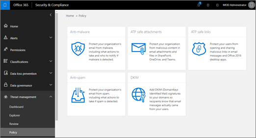

# 保护免遭威胁侵害Protect against threats

[!INCLUDE [Microsoft 365 Defender rebranding](../includes/microsoft-defender-for-office.md)]

下面是一个快速入门指南，用于将高级威胁防护的配置分解为多个块。Here's a quick-start guide that breaks the configuration of Advanced Threat Protection into chunks. 如果你刚开始使用 Office 365 中的威胁防护功能，则不确定从哪里开始，或者如果你了解 *最佳方法，* 请使用本指南作为检查表和起点。If you're new to threat protection features in Office 365, not sure where to begin, or if you learn best by *doing*, use this guidance as a checklist and a starting point.

> [!IMPORTANT]
> **为每种策略提供了初始推荐设置; 但是，有许多可用选项，您可以调整设置以满足特定组织的需求**。**Initial recommended settings are included for each kind of policy; however, many options are available, and you can adjust your settings to meet your specific organization's needs**. 为你的策略或更改允许大约30分钟，以在你的数据中心中工作。Allow approximately 30 minutes for your policies or changes to work their way through your datacenter.

## RequirementsRequirements

### 订阅Subscriptions

威胁防护功能包含在 *所有* Microsoft 或 Office 365 订阅中;但是，有些订阅具有高级功能。Threat protection features are included in *all* Microsoft or Office 365 subscriptions; however, some subscriptions have advanced features. 下表列出了本文附带的保护功能以及最低订阅要求。The table below lists the protection features included in this article together with the minimum subscription requirements.

> [!TIP]
> 请注意，除了打开审核的说明之外， *步骤* 还启动反恶意软件、反网络钓鱼和反垃圾邮件，它们被标记为 Office 365 Exchange Online Protection (**EOP**) 的一部分。Notice that, beyond the directions to turn on auditing, *steps* start anti-malware, anti-phishing, and anti-spam, which are marked as part of Office 365 Exchange Online Protection (**EOP**). 这在高级威胁防护文章中似乎是不正常的，除非您记下高级威胁防护 (**ATP**) 包含，并在 EOP 中进行构建。This can seem odd in an Advanced Threat Protection article, until you remember Advanced Threat Protection (**ATP**) contains, and builds on, EOP.

****

|保护类型Protection type|订阅要求Subscription requirement|
|---|---|
|用于报告目的的审核日志记录 () Audit logging (for reporting purposes)|[Exchange OnlineExchange Online](https://docs.microsoft.com/office365/servicedescriptions/exchange-online-service-description/exchange-online-service-description)|
|反恶意软件保护Anti-malware protection|[Exchange Online Protection](https://docs.microsoft.com/office365/servicedescriptions/exchange-online-protection-service-description/exchange-online-protection-service-description) (**EOP**) [Exchange Online Protection](https://docs.microsoft.com/office365/servicedescriptions/exchange-online-protection-service-description/exchange-online-protection-service-description) (**EOP**)|
|防钓鱼保护Anti-phishing protection|[EOPEOP](https://docs.microsoft.com/office365/servicedescriptions/exchange-online-protection-service-description/exchange-online-protection-service-description)|
|反垃圾邮件保护Anti-spam protection|[EOPEOP](https://docs.microsoft.com/office365/servicedescriptions/exchange-online-protection-service-description/exchange-online-protection-service-description)|
|电子邮件的零小时自动清除 () Zero-hour auto purge (for email)|[EOPEOP](https://docs.microsoft.com/office365/servicedescriptions/exchange-online-protection-service-description/exchange-online-protection-service-description)|
|防止电子邮件和 Office 文档中的恶意 Url 和文件 (安全链接和安全附件) Protection from malicious URLs and files in email and Office documents (safe links and safe attachments)|[Office 365 高级威胁防护](https://docs.microsoft.com/office365/servicedescriptions/office-365-advanced-threat-protection-service-description) (**ATP**) [Office 365 Advanced Threat Protection](https://docs.microsoft.com/office365/servicedescriptions/office-365-advanced-threat-protection-service-description) (**ATP**)|
|为 SharePoint、OneDrive 和 Microsoft 团队工作负荷启用 ATPTurn on ATP for SharePoint, OneDrive, and Microsoft Teams workloads| [ATPATP](https://docs.microsoft.com/microsoft-365/security/office-365-security/protect-against-threats?view=o365-worldwide)|
|高级反网络钓鱼防护Advanced anti-phishing protection|[ATPATP](https://docs.microsoft.com/office365/servicedescriptions/office-365-advanced-threat-protection-service-description)|

### 角色和权限Roles and permissions

若要配置 ATP 策略，必须在 [安全 & 合规性中心](https://docs.microsoft.com/office365/servicedescriptions/office-365-platform-service-description/office-365-securitycompliance-center)中为您分配适当的角色。To configure ATP policies, you must be assigned an appropriate role in the [Security & Compliance Center](https://docs.microsoft.com/office365/servicedescriptions/office-365-platform-service-description/office-365-securitycompliance-center). 有关可执行这些操作的角色，请查看下面的表格。Take a look at the table below for roles that can do these actions.

****

|角色或角色组Role or role group|了解详细信息Where to learn more|
|---|---|
|全局管理员global administrator|[关于 Microsoft 365 管理员角色About Microsoft 365 admin roles](https://docs.microsoft.com/microsoft-365/admin/add-users/about-admin-roles)|
|安全管理员Security Administrator|[Azure Active Directory 中的管理员角色权限Administrator role permissions in Azure Active Directory](https://docs.microsoft.com/azure/active-directory/users-groups-roles/directory-assign-admin-roles)|
|Exchange Online 组织管理Exchange Online Organization Management|[Exchange Online 中的权限Permissions in Exchange Online](https://docs.microsoft.com/exchange/permissions-exo/permissions-exo)  和and  [Exchange Online PowerShellExchange Online PowerShell](https://docs.microsoft.com/powershell/exchange/exchange-online-powershell)|
|

若要了解详细信息，请参阅 [安全 &amp; 合规性中心中的权限](permissions-in-the-security-and-compliance-center.md)。To learn more, see [Permissions in the Security &amp; Compliance Center](permissions-in-the-security-and-compliance-center.md).

## 在开始之前，请启用报告和调查的审核日志记录Before you begin, turn on Audit logging for reporting and investigation

尽早启动审核日志记录。Start your audit logging early. 您 **需要进行审核** ，以确保执行后续步骤。You'll need auditing to be **ON** for certain of the steps that follow. 审核日志记录在包括 [Exchange Online](https://docs.microsoft.com/office365/servicedescriptions/exchange-online-service-description/exchange-online-service-description)的订阅中可用。Audit logging is available in subscriptions that include [Exchange Online](https://docs.microsoft.com/office365/servicedescriptions/exchange-online-service-description/exchange-online-service-description). 为了查看威胁防护报告中的数据（如 [安全仪表板](security-dashboard.md)、 [电子邮件安全报告](view-email-security-reports.md)和 [浏览器](threat-explorer.md)），审核日志记录必须 *打开*。In order to view data in threat protection reports, such as the [Security Dashboard](security-dashboard.md), [email security reports](view-email-security-reports.md), and [Explorer](threat-explorer.md), audit logging must be *On*. 若要了解详细信息，请参阅 [打开或关闭审核日志搜索](../../compliance/turn-audit-log-search-on-or-off.md)。To learn more, see [Turn audit log search on or off](../../compliance/turn-audit-log-search-on-or-off.md).

## 第1部分-反恶意软件保护Part 1 - Anti-malware protection

[反恶意软件保护](anti-malware-protection.md) 在包含 [EOP](https://docs.microsoft.com/office365/servicedescriptions/exchange-online-protection-service-description/exchange-online-protection-service-description)的订阅中可用。[Anti-malware protection](anti-malware-protection.md) is available in subscriptions that include [EOP](https://docs.microsoft.com/office365/servicedescriptions/exchange-online-protection-service-description/exchange-online-protection-service-description).

1. 在[安全 & 合规性中心](https://protection.office.com)中，选择 "**威胁管理**  >  **策略**  >  **反恶意软件**"。In the [Security & Compliance Center](https://protection.office.com), choose **Threat management** > **Policy** > **Anti-malware**.

2. 双击 **默认** 策略，然后选择 " **设置**"。Double-click the **Default** policy, and then choose **settings**.

3. 指定以下设置：Specify the following settings:

    - 在 " **恶意软件检测响应** " 部分，保留默认设置 " **否**"。In the **Malware Detection Response** section, keep the default setting of **No**.

    - 在 " **常见附件类型筛选器** " 部分，选择 **"启用"**。In the **Common Attachment Types Filter** section, choose **On**.

4. 单击“**保存**”。Click **Save**.

若要了解有关反恶意软件策略选项的详细信息，请参阅 [配置反恶意软件策略](configure-anti-malware-policies.md)。To learn more about anti-malware policy options, see [Configure anti-malware policies](configure-anti-malware-policies.md).

## 第2部分-反网络钓鱼防护Part 2 - Anti-phishing protection

[反钓鱼][Anti-phishing]

在包含[EOP](https://docs.microsoft.com/office365/servicedescriptions/exchange-online-protection-service-description/exchange-online-protection-service-description)的订阅中提供了[反网络钓鱼保护](anti-phishing-protection.md)。[Anti-phishing protection](anti-phishing-protection.md) is available in subscriptions that include [EOP](https://docs.microsoft.com/office365/servicedescriptions/exchange-online-protection-service-description/exchange-online-protection-service-description). 在 [ATP](https://docs.microsoft.com/office365/servicedescriptions/office-365-advanced-threat-protection-service-description)中提供高级反钓鱼保护。Advanced anti-phishing protection is available in [ATP](https://docs.microsoft.com/office365/servicedescriptions/office-365-advanced-threat-protection-service-description).

以下过程介绍如何配置 ATP 反网络钓鱼策略。The following procedure describes how to configure an ATP anti-phishing policy. 在不使用 ATP) 配置反网络钓鱼策略 (的步骤类似。The steps are similar for configuring an anti-phishing policy (without ATP).

1. 在[安全 & 合规性中心](https://protection.office.com)中，选择**威胁管理**  >  **策略**  >  **ATP 反网络钓鱼**。In the [Security & Compliance Center](https://protection.office.com), choose **Threat management** > **Policy** > **ATP anti-phishing**.

2. 单击 " **默认策略**"。Click **Default policy**.

3. 在 " **模拟** " 部分，单击 " **编辑**"，然后指定以下设置：In the **Impersonation** section, click **Edit**, and then specify the following settings:

   - 在 " **添加要保护的用户** " 选项 *卡上，打开保护* 。On the **Add users to protect** tab, turn *On* protection. 然后添加用户，如贵组织的董事会成员、CEO、CFO 和其他高级领导者。Then add users, such as your organization's board members, your CEO, CFO, and other senior leaders.  (您可以键入单个电子邮件地址，或单击以显示列表。 ) (You can type an individual email address, or click to display a list.)

   - 在 " **要保护的添加域** " 选项卡上，打开 " **自动包括我拥有的域"**。On the **Add domains to protect** tab, turn on **Automatically include the domains I own**. 如果你有自定义域，请立即添加。If you have custom domains, add them now.

   - 在 "**操作**" 选项卡上，选择 "隔离**模拟用户**和**模拟域**的**邮件"** 选项。On the **Actions** tab, select **Quarantine the message** for both the **impersonated user** and **impersonated domain** options. 此外，打开模拟安全提示。Also, turn on impersonation safety tips.

   - 在 " **邮箱智能** " 选项卡上，确保已打开邮箱智能，并启用基于邮箱智能的模拟保护。On the **Mailbox intelligence** tab, make sure mailbox intelligence is turned on and turn on mailbox intelligence-based impersonation protection. 在 " **如果模拟用户发送电子邮件** " 列表中，选择 **"隔离邮件"**。In the **If email is sent by an impersonated user** list, choose **Quarantine the message**.

   - 在 " **添加受信任的发件人和域** " 选项卡上，指定要添加的任何受信任的发件人或域。On the **Add trusted senders and domains** tab, specify any trusted senders or domains that you want to add.

   - 查看设置后，**保存**在 "**查看您的设置**" 选项卡上。**Save** on the **Review your settings** tab after you've reviewed your settings.

4. 在 " **欺骗** " 部分，单击 " **编辑**"，然后指定以下设置：In the **Spoof** section, click **Edit**, and then specify the following settings:

   - 在 " **哄骗筛选器设置** " 选项卡上，确保已打开 "反欺骗保护"。On the **Spoofing filter settings** tab, make sure anti-spoofing protection is turned on.

   - 在 " **操作** " 选项卡上，选择 " **隔离邮件"**。On the **Actions** tab, choose **Quarantine the message**.

   - 在审阅完更改后，**保存**在 "**查看您的设置**" 选项卡上。**Save** on the **Review your settings** tab after you have reviewed your changes.  (如果未进行任何更改，请 **取消**。 ) (If you didn't make any changes, **Cancel**.)

5. 关闭 "默认策略设置" 页。Close the default policy settings page.

若要了解有关反网络钓鱼策略选项的详细信息，请参阅 [配置 ATP 反网络钓鱼策略](configure-atp-anti-phishing-policies.md)。To learn more about your anti-phishing policy options, see [Configure ATP anti-phishing policies](configure-atp-anti-phishing-policies.md).

## 第3部分-反垃圾邮件保护Part 3 - Anti-spam protection

[反垃圾邮件保护](anti-spam-protection.md) 在包含 [EOP](https://docs.microsoft.com/office365/servicedescriptions/exchange-online-protection-service-description/exchange-online-protection-service-description)的订阅中可用。[Anti-spam protection](anti-spam-protection.md) is available in subscriptions that include [EOP](https://docs.microsoft.com/office365/servicedescriptions/exchange-online-protection-service-description/exchange-online-protection-service-description).

1. 在[安全 & 合规性中心](https://protection.office.com)中，选择 "**威胁管理**  >  **策略**  >  **反垃圾邮件**"。In the [Security & Compliance Center](https://protection.office.com), choose **Threat management** > **Policy** > **Anti-spam**.

2. 在 " **自定义** " 选项卡上，打开 "自定义设置"。On the **Custom** tab, turn on Custom settings.

3. 展开 " **默认垃圾邮件筛选器策略**"，单击 " **编辑策略**"，然后指定以下设置：Expand **Default spam filter policy**, click **Edit policy**, and then specify the following settings:

   - 在 " **垃圾邮件和批量操作** " 部分，将阈值设置为值5或6。In the **Spam and bulk actions** section, set the threshold to a value of 5 or 6.

   - 在 " **允许列表** " 部分，查看 (和/或编辑) 您允许的发件人和域。In the **Allow lists** section, review (and/or edit) your allowed senders and domains.

4. 单击“**保存**”。Click **Save**.

若要了解有关您的反垃圾邮件策略选项的详细信息，请参阅 [在 EOP 中配置反垃圾邮件策略](configure-your-spam-filter-policies.md)。To learn more about your anti-spam policy options, see [Configure anti-spam policies in EOP](configure-your-spam-filter-policies.md).

## 第4部分-防止恶意 Url 和文件 (安全链接和安全附件) Part 4 - Protection from malicious URLs and files (Safe Links and Safe Attachments)

来自恶意 Url 和文件的点击时间保护在包含 [Office 365 atp](https://docs.microsoft.com/office365/servicedescriptions/office-365-advanced-threat-protection-service-description) (atp) 的订阅中可用。Time-of-click protection from malicious URLs and files is available in subscriptions that include [Office 365 ATP](https://docs.microsoft.com/office365/servicedescriptions/office-365-advanced-threat-protection-service-description) (ATP). 它通过 [Atp 安全附件](atp-safe-attachments.md) 和 [atp 安全链接](atp-safe-links.md) 策略进行设置。It's set up through [ATP Safe Attachments](atp-safe-attachments.md) and [ATP Safe Links](atp-safe-links.md) policies.

### ATP 安全附件策略ATP Safe Attachments policies

若要设置 [Atp 安全附件](atp-safe-attachments.md)，必须至少定义一个 ATP 安全附件策略。To set up [ATP Safe Attachments](atp-safe-attachments.md), you must define at least one ATP Safe Attachments policy.

1. 在 "[安全性 & 合规性中心](https://protection.office.com)中，选择"**威胁管理**  >  **策略**  >  **ATP 安全附件**"。In the [Security & Compliance Center](https://protection.office.com), choose **Threat management** > **Policy** > **ATP safe attachments**.

2. 选择 " **打开适用于 SharePoint、OneDrive 和 Microsoft 团队的 ATP**" 选项。Select the option **Turn on ATP for SharePoint, OneDrive, and Microsoft Teams**.

3. 在 " **保护电子邮件附件** " 部分，单击加号 (**+**) 。In the **Protect email attachments** section, click the plus sign (**+**).

4. 指定以下设置：Specify the following settings:

   - 在 " **名称** " 框中，键入 `Block malware` 。In the **Name** box, type `Block malware`.

   - 在 "响应" 部分，选择 " **阻止**"。In the response section, choose **Block**.

   - 在 " **重定向附件** " 部分，选择 " **启用重定向**" 选项。In the **Redirect attachment** section, select the option **Enable redirect**. 指定组织的安全管理员或操作员的电子邮件地址，该地址将审阅检测到的文件。Specify the email address for your organization's security administrator or operator, who will review detected files.

   - 在 " **应用** 于" 部分中，选择 **"收件人域"**。In the **Applied to** section, choose **The recipient domain is**. 然后，选择您的域，选择 " **添加**"，然后选择 **"确定"**。Then, select your domain, choose **Add**, and then **OK**.

5. **保存**。**Save**.

6.  (**建议的其他步骤**) 为全局管理员或 SharePoint Online 管理员，请运行 Microsoft 365 环境的**DisallowInfectedFileDownload**参数设置为*true*的**[set-spotenant](https://docs.microsoft.com/powershell/module/sharepoint-online/Set-SPOTenant)** cmdlet。(**Recommended additional step**) As a global administrator or a SharePoint Online administrator, run the **[Set-SPOTenant](https://docs.microsoft.com/powershell/module/sharepoint-online/Set-SPOTenant)** cmdlet with the **DisallowInfectedFileDownload** parameter set to  *true* for your Microsoft 365 environment.  (这将阻止用户打开、移动、复制或共享被检测为恶意的文件 ) (This prevents people from opening, moving, copying, or sharing files that are detected as malicious.)

若要了解详细信息，请参阅 [设置 office 365 Atp 安全附件策略](set-up-atp-safe-attachments-policies.md) 和 [打开 SharePoint、OneDrive 和 Microsoft 团队的 Office 365 ATP](turn-on-atp-for-spo-odb-and-teams.md)。To learn more, see [Set up Office 365 ATP Safe Attachments policies](set-up-atp-safe-attachments-policies.md) and [Turn on Office 365 ATP for SharePoint, OneDrive, and Microsoft Teams](turn-on-atp-for-spo-odb-and-teams.md).

### ATP 安全链接策略ATP Safe Links policies

若要设置 [ATP 安全链接](atp-safe-links.md)，请查看并编辑默认策略，并为特定用户添加策略。To set up [ATP Safe Links](atp-safe-links.md), review and edit your default policy, and add a policy for specific users.

1. 在 "[安全性 & 合规性中心](https://protection.office.com)中，选择"**威胁管理**  >  **策略**  >  **ATP 安全链接**"。In the [Security & Compliance Center](https://protection.office.com), choose **Threat management** > **Policy** > **ATP Safe Links**.

2. 双击 **默认** 策略。Double-click the **Default** policy.

3. 在 " **使用安全链接** " 部分，选择 " **Microsoft 365 Apps For enterprise，Office For iOS 和 Android**" 选项，然后单击 " **保存**"。In the **Use safe links in** section, select the option **Microsoft 365 Apps for enterprise, Office for iOS and Android**, and then click **Save**.

4. 在 " **适用于特定收件人的策略** " 部分，单击加号 (**+**) 。In the **Policies that apply to specific recipients** section, click the plus sign (**+**).

5. 指定以下设置：Specify the following settings:

   - 在 " **名称** " 框中，键入一个名称，例如 `Safe Links` 。In the **Name** box, type a name, such as `Safe Links`.

   - 在 " **选择操作** " 部分，选择 **"启用"**。In the **Select the action** section, choose **On**.

   - 选择以下选项：Select these options:

     - **使用安全附件扫描可下载的内容****Use safe attachments to scan downloadable content**

     - **将安全链接应用于在组织内发送的电子邮件****Apply safe links to email messages sent within the organization**

     - **不要让用户通过指向原始 URL 的安全链接进行单击****Do not let users click through safe links to original URL**

   - 在 " **应用** 于" 部分中，选择 **"收件人域"**。In the **Applied to** section, choose **The recipient domain is**. 然后，选择您的域，选择 " **添加**"，然后选择 **"确定"**。Then, select your domain, choose **Add**, and then **OK**.

6. **保存**。**Save**.

若要了解详细信息，请参阅[设置 Office 365 ATP 安全链接策略](set-up-atp-safe-links-policies.md)。To learn more, see [Set up Office 365 ATP Safe Links policies](set-up-atp-safe-links-policies.md).

## 第5部分-打开适用于 SharePoint、OneDrive 和 Microsoft 团队工作负荷的 ATPPart 5 - Turn on ATP for SharePoint, OneDrive, and Microsoft Teams workloads

SharePoint、OneDrive 和团队等工作负荷是为协作而构建的。Workloads like SharePoint, OneDrive, and Teams are built for collaboration. 使用 ATP 有助于阻止和检测在工作组网站和文档库中被标识为恶意的文件。Using ATP helps with blocking and detection of files that are identified as malicious in team sites and document libraries. 您可以阅读有关 [此处](https://docs.microsoft.com/microsoft-365/security/office-365-security/atp-for-spo-odb-and-teams?view=o365-worldwide)的工作方式的详细信息。You can read more about how that works [here](https://docs.microsoft.com/microsoft-365/security/office-365-security/atp-for-spo-odb-and-teams?view=o365-worldwide).

> [!IMPORTANT]
> 在**开始此过程之前，请确保已为您的 Microsoft 365 环境启用审核日志记录**。**Before you begin this procedure, make sure that audit logging is already turned on for your Microsoft 365 environment**. 这通常由在 Exchange Online 中分配了审核日志角色的人完成。This is typically done by someone who has the Audit Logs role assigned in Exchange Online. 有关详细信息，请参阅 [打开或关闭审核日志搜索](../../compliance/turn-audit-log-search-on-or-off.md)！For more information, see [Turn audit log search on or off](../../compliance/turn-audit-log-search-on-or-off.md)!

1. 转到 <https://protection.office.com> ，然后使用你的工作或学校帐户登录。Go to <https://protection.office.com>, and sign in with your work or school account.

2. 在安全 & 合规性中心的左侧导航窗格中的 " **威胁管理**" 下，选择 " **策略** \> **安全附件**"。In the Security & Compliance Center, in the left navigation pane, under **Threat management**, choose **Policy** \> **Safe Attachments**.

   

3. 选择 " **为 SharePoint、OneDrive 和 Microsoft 团队启用 ATP**"。Select **Turn on ATP for SharePoint, OneDrive, and Microsoft Teams**.

   

4. **保存**。**Save**.

5. 查看 (，并根据需要编辑) 组织的 [安全附件策略](set-up-atp-safe-attachments-policies.md) 和 [安全链接策略](set-up-atp-safe-links-policies.md)。Review (and, as appropriate, edit) your organization's [Safe Attachments policies](set-up-atp-safe-attachments-policies.md) and [Safe Links policies](set-up-atp-safe-links-policies.md).

6.  (推荐) 为全局管理员或 SharePoint Online 管理员，请运行 **[set-spotenant](https://docs.microsoft.com/powershell/module/sharepoint-online/Set-SPOTenant)** cmdlet，并将 _DisallowInfectedFileDownload_ 参数设置为 `$true` 。(Recommended) As a global administrator or a SharePoint Online administrator, run the **[Set-SPOTenant](https://docs.microsoft.com/powershell/module/sharepoint-online/Set-SPOTenant)** cmdlet with the _DisallowInfectedFileDownload_ parameter set to `$true`.

   - `$true` 阻止除 Delete) 检测到的文件之外的所有操作 (。`$true` blocks all actions (except Delete) for detected files. 用户无法打开、移动、复制或共享检测到的文件。People cannot open, move, copy, or share detected files.
   - `$false` 阻止除 "删除" 和 "下载" 以外的所有操作。`$false` blocks all actions except Delete and Download. 用户可以选择接受风险并下载检测到的文件。People can choose to accept the risk and download a detected file.

   > [!TIP]
   > 若要了解有关在 Microsoft 365 中使用 PowerShell 的详细信息，请参阅使用 [Powershell 管理 Microsoft 365](https://docs.microsoft.com/microsoft-365/enterprise/manage-microsoft-365-with-microsoft-365-powershell)。To learn more about using PowerShell with Microsoft 365, see [Manage Microsoft 365 with PowerShell](https://docs.microsoft.com/microsoft-365/enterprise/manage-microsoft-365-with-microsoft-365-powershell).

7. 允许最长30分钟，你的更改将传播到所有 Microsoft 365 数据中心。Allow up to 30 minutes for your changes to spread to all Microsoft 365 datacenters.

### 现在为检测到的文件设置通知Now set up alerts for detected files

若要在 SharePoint Online、OneDrive for Business 或 Microsoft 团队中的文件被标识为恶意文件时收到通知，可以设置警报。To receive notification when a file in SharePoint Online, OneDrive for Business, or Microsoft Teams has been identified as malicious, you can set up an alert.

1. 在 " [安全性 & 合规性中心](https://protection.office.com)中，选择" **通知**"" \> **管理通知**"。In the [Security & Compliance Center](https://protection.office.com), choose **Alerts** \> **Manage alerts**.

2. 选择 " **新建警报策略**"。Choose **New alert policy**.

3. 指定警报的名称。Specify a name for the alert. 例如，可以在库中键入恶意文件。For example, you could type Malicious Files in Libraries.

4. 键入警报的说明。Type a description for the alert. 例如，可以键入在 SharePoint Online、OneDrive 或 Microsoft 团队中检测到恶意文件时通知管理员。For example, you could type Notifies admins when malicious files are detected in SharePoint Online, OneDrive, or Microsoft Teams.

5. 在 "在 **以下时间发送此通知** " 部分中，设置：In the **Send this alert when...** section, set:

   a.a. 在 " **活动** " 列表中，选择 " **文件中检测到的恶意软件**"。In the **Activities** list, choose **Detected malware in file**.

   b.b. 将 " **用户** " 字段留空。Leave the **Users** field empty.

6. 在 " **将此通知发送给 ...** " 部分，选择一个或多个全局管理员、安全管理员或在检测到恶意文件时应收到通知的安全阅读者。In the **Send this alert to...** section, select one or more global administrators, security administrators, or security readers who should receive notification when a malicious file is detected.

7. **保存**。**Save**.

若要了解有关通知的详细信息，请参阅 [在安全 & 合规性中心中创建活动通知](../../compliance/create-activity-alerts.md)。To learn more about alerts, see [Create activity alerts in the Security & Compliance Center](../../compliance/create-activity-alerts.md).

> [!NOTE]
> 完成配置后，请使用以下链接启动工作负荷调查：When you're finished configuring, use these links to start workload investigations:
>
> - [查看有关在 SharePoint、OneDrive 或 Microsoft 团队中检测到的恶意文件的信息View information about malicious files detected in SharePoint, OneDrive, or Microsoft Teams](malicious-files-detected-in-spo-odb-or-teams.md)
> - [在 SharePoint Online、OneDrive 或 Microsoft 团队中找到恶意文件时要执行的操作What to do when a malicious file is found in SharePoint Online, OneDrive, or Microsoft Teams](https://support.microsoft.com/office/01e902ad-a903-4e0f-b093-1e1ac0c37ad2)
> - [在 Microsoft 365 中以管理员身份管理隔离的邮件和文件Manage quarantined messages and files as an administrator in Microsoft 365](manage-quarantined-messages-and-files.md)

## 第6部分-要配置的其他设置Part 6 - Additional settings to configure

通过对恶意软件、恶意 Url 和文件、网络钓鱼和垃圾邮件的保护进行配置，我们建议您配置零小时自动清除。Along with configuring protection from malware, malicious URLs and files, phishing, and spam, we recommend you configure zero-hour auto purge.

### EOP 中的电子邮件的零小时自动清除Zero-hour auto purge for email in EOP

[0 小时自动清除](zero-hour-auto-purge.md) (ZAP) 在包含 [EOP](https://docs.microsoft.com/office365/servicedescriptions/exchange-online-protection-service-description/exchange-online-protection-service-description)的订阅中可用。[Zero-hour auto purge](zero-hour-auto-purge.md) (ZAP) is available in subscriptions that include [EOP](https://docs.microsoft.com/office365/servicedescriptions/exchange-online-protection-service-description/exchange-online-protection-service-description). 此保护在默认情况下处于启用状态。但是，若要使保护生效，必须满足以下条件：This protection is turned on by default; however, the following conditions must be met for protection to be in effect:

- 垃圾邮件操作设置为将**邮件移动到**[反垃圾邮件策略](anti-spam-protection.md)中的 "垃圾邮件" 文件夹。Spam actions are set to **Move message to Junk Email folder** in [anti-spam policies](anti-spam-protection.md).

- 用户保留其默认的 [垃圾邮件设置](ensure-that-spam-is-routed-to-each-user-s-junk-email-folder.md)，但尚未关闭垃圾邮件保护。Users have kept their default [junk email settings](ensure-that-spam-is-routed-to-each-user-s-junk-email-folder.md), and haven't turned off junk email protection.

若要了解详细信息，请参阅 [针对垃圾邮件和恶意软件的零小时自动清除保护](zero-hour-auto-purge.md)。To learn more, see [Zero-hour auto purge - protection against spam and malware](zero-hour-auto-purge.md).

## 安装后任务和后续步骤Post-setup tasks and next steps

在配置威胁防护功能之后，请务必监视这些功能的工作方式！After configuring the threat protection features, make sure to monitor how those features are working! 查看和修订策略，以便他们可以执行所需的操作。Review and revise your policies so that they do what you need them to. 此外，还请注意可添加值的新功能和服务更新。Also, watch for new features and service updates that can add value.

****

|需执行的操作What to do|了解详细信息的资源Resources to learn more|
|---|---|
|查看报告的威胁防护功能是如何为你的组织工作的See how threat protection features are working for your organization by viewing reports|[安全仪表板Security dashboard](security-dashboard.md) [电子邮件安全报告Email security reports](view-email-security-reports.md) [Office 365 ATP 报告Reports for Office 365 ATP](view-reports-for-atp.md) [威胁资源管理器Threat Explorer](threat-explorer.md)|
|根据需要定期查看和修改威胁防护策略Periodically review and revise your threat protection policies as needed|[安全功能分数Secure Score](../mtp/microsoft-secure-score.md) [智能报告和见解Smart reports and insights](reports-and-insights-in-security-and-compliance.md) [Microsoft 365 威胁调查和响应功能Microsoft 365 threat investigation and response features](keep-users-safe-with-office-365-ti.md)|
|监视新功能和服务更新Watch for new features and service updates|[标准和目标发布选项Standard and Targeted release options](https://docs.microsoft.com/microsoft-365/admin/manage/release-options-in-office-365) [消息中心Message Center](https://docs.microsoft.com/microsoft-365/admin/manage/message-center) [Microsoft 365 路线图Microsoft 365 Roadmap](https://www.microsoft.com/microsoft-365/roadmap?filters=&searchterms=advanced%2Cthreat%2Cprotection) [服务说明Service Descriptions](https://docs.microsoft.com/office365/servicedescriptions/office-365-service-descriptions-technet-library)|
|了解有关 EOP 和 ATP 的推荐标准和严格安全配置的详细信息Learn the details about recommended Standard and Strict security configurations for EOP and ATP | [EOP 和 Office 365 ATP 安全性的建议设置Recommended settings for EOP and Office 365 ATP security](https://docs.microsoft.com/microsoft-365/security/office-365-security/recommended-settings-for-eop-and-office365-atp?view=o365-worldwide) |
