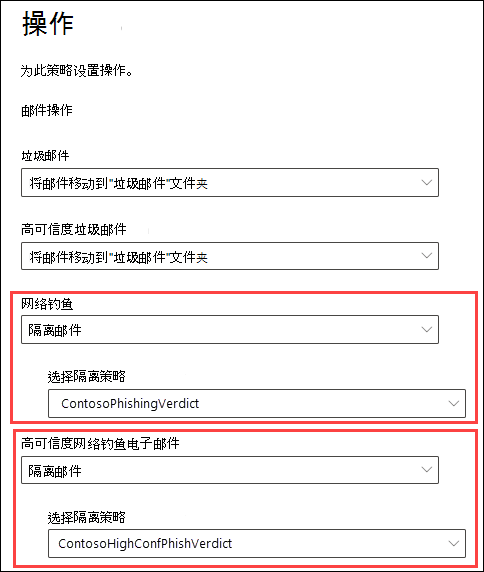
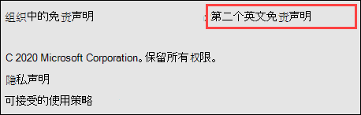
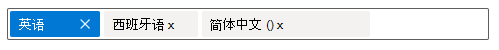
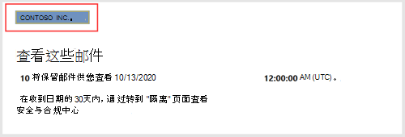
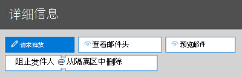
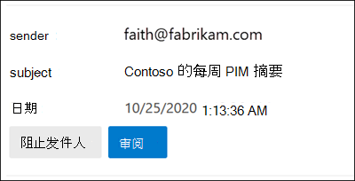
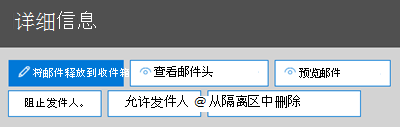
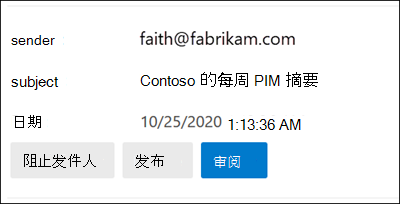

# <a name="quarantine-policies"></a>隔离策略

隔离 (在 Exchange Online Protection (EOP _) 和_ Microsoft Defender for Office 365 中以前称为隔离标记) ，允许管理员根据隔离邮件的原因来控制用户对隔离邮件可以执行哪些操作。

通常，根据隔离邮件的原因，已允许或拒绝隔离邮件的交互性级别。 例如，用户可以查看并释放被反垃圾邮件筛选隔离为垃圾邮件或批量邮件的邮件，但他们无法查看或释放被隔离为高可信度网络钓鱼或恶意软件的邮件。

对于 [受支持的保护](#step-2-assign-a-quarantine-policy-to-supported-features)功能，隔离策略指定允许用户对其自己的邮件执行哪些操作 (，这些邮件是隔离和隔离) 中的 _收件人的邮件。_ [隔离](use-spam-notifications-to-release-and-report-quarantined-messages.md) 通知是最终用户垃圾邮件通知的替换。 这些通知现在由隔离策略控制，并包含有关所有受支持的保护功能的隔离邮件的信息 (不仅仅是反垃圾邮件策略和反网络钓鱼策略裁定) 。

强制执行历史用户功能的默认隔离策略会自动分配给隔离邮件的受支持保护功能中的操作。 或者，您可以创建自定义隔离策略，并将其分配给受支持的保护功能，以允许或阻止用户对这些类型的隔离邮件执行特定操作。

各个隔离策略权限组合到以下预设权限组中：

- 无访问权限
- 受限访问
- 完全访问权限

下表介绍了预设权限组中包含的各个隔离策略权限：

<br>

****

|权限|无访问权限|受限访问|完全访问权限|
|---|:---:|:---:|:---:|
|**阻止发件人 (** _PermissionToBlockSender_) ||||
|**删除** (_PermissionToDelete_) ||||
|**预览** (_PermissionToPreview_) ||||
|**允许收件人使用** _PermissionToRelease (将_ 邮件从隔离) ||||
|**允许收件人请求从隔离区** 释放的邮件 (_PermissionToRequestRelease_) ||||
|

下表介绍了默认隔离策略及其关联权限组以及是否启用隔离通知：

<br>

|默认隔离策略|使用的权限组|启用隔离通知？|
|---|---|---|
|AdminOnlyAccessPolicy|禁止访问|否|
|DefaultFullAccessPolicy|完全访问权限|否|
|NotificationEnabledPolicy<sup>\*</sup>|完全访问权限|是|

如果您不喜欢预设权限组中的默认权限，或者希望启用隔离通知，请创建并使用自定义隔离策略。 有关每个权限执行哪些操作的详细信息，请参阅本文稍后[](#quarantine-policy-permission-details)介绍的隔离策略权限详细信息部分。

在 Microsoft 365 Defender 门户或 PowerShell (Exchange Online PowerShell 中为具有 Exchange Online 邮箱的 Microsoft 365 组织创建和分配隔离策略;在 EOP 组织中使用独立 EOP PowerShell，而无需Exchange Online邮箱) 。

> [!NOTE]
> 隔离邮件在过期之前在隔离中保留的时间由反垃圾邮件策略中的将垃圾邮件保留隔离的天数 (_隔离邮件) 隔离_ 邮件。 有关详细信息，请参阅[在 EOP 中配置反垃圾邮件策略](configure-your-spam-filter-policies.md)。
>
> 如果更改分配给受支持保护功能的隔离策略，则更改会影响在更改后被隔离的邮件。 以前由该保护功能隔离的邮件不受新隔离策略分配的设置的影响。

## <a name="full-access-permissions-and-quarantine-notifications"></a>完全访问权限和隔离通知

<sup>\*</sup> 所有环境中都不存在名为 NotificationEnabledPolicy 的隔离策略。 如果你的组织满足以下两个要求，你将拥有 NotificationEnabledPolicy 隔离策略：

- 您的组织在 2021 年 7 (年 8 月早期启用隔离策略功能之前) 。
- 您具有一个或多个反垃圾邮件[策略 (启用](configure-your-spam-filter-policies.md)最终用户垃圾邮件通知设置的默认反垃圾邮件策略) 自定义反垃圾邮件策略。

如前面所述，隔离策略中的隔离通知将取代用于在反垃圾邮件策略中打开或关闭的最终用户垃圾邮件通知。 名为 DefaultFullAccessPolicy 的内置隔离策略复制了隔离邮件的历史权限，但隔离策略中未启用隔离通知。 此外，由于无法修改内置策略，因此无法打开 DefaultFullAccessPolicy 中的隔离通知。

为了提供 DefaultFullAccessPolicy 的权限，但在启用隔离通知后，我们创建了名为 NotificationEnabledPolicy 的策略，以用于需要 DefaultFullAccessPolicy 的组织 (其中最终用户垃圾邮件通知已打开) 的组织。

对于从未在反垃圾邮件策略中启用最终用户垃圾邮件通知的新组织或旧组织，您将没有名为 NotificationEnabledPolicy 的隔离策略。 启用隔离通知的方式是创建和使用自定义隔离策略，其中隔离通知已打开。

## <a name="what-do-you-need-to-know-before-you-begin"></a>开始前，有必要了解什么？

- 访问 <https://security.microsoft.com> 打开 Microsoft 365 Defender 门户。 若要直接转到隔离 **策略页面** ，请使用 <https://security.microsoft.com/quarantinePolicies>。

- 若要连接到 Exchange Online PowerShell，请参阅[连接到 Exchange Online PowerShell](/powershell/exchange/connect-to-exchange-online-powershell)。 若要连接到独立 EOP PowerShell，请参阅[连接到 Exchange Online Protection PowerShell](/powershell/exchange/connect-to-exchange-online-protection-powershell)。

- 若要查看、创建、修改或删除隔离策略，您需要是管理门户中组织管理、安全管理员或隔离管理员Microsoft 365 Defender的成员。 有关详细信息，请参阅 [Microsoft 365 Defender 门户中的权限](permissions-microsoft-365-security-center.md)。

## <a name="step-1-create-quarantine-policies-in-the-microsoft-365-defender-portal"></a>步骤 1：在管理门户Microsoft 365 Defender隔离策略

1. 在 Microsoft 365 Defender [门户中](https://security.microsoft.com)，转到"规则"部分中的"电子邮件&**协作**\>策略&**规则** \> **威胁策略** \> **隔离****策略"**。

2. 在" **隔离策略"** 页上，单击"  **添加自定义策略**。

3. 将 **打开"新建策略** "向导。 在" **策略名称"** 页上，在"策略名称"框中输入简短但 **唯一** 的名称。 你需要在即将推出的步骤中按名称标识并选择隔离策略。 完成后，单击“**下一步**”。

4. 在" **收件人邮件访问"** 页上，选择下列值之一：
   - **受限访问**：本文前面介绍了此权限组中包含的单个权限。
   - **使用高级 (设置)**：使用此值可指定自定义权限。 配置以下显示设置：
     - **选择发布操作首选项**：选择下列值之一：
       - 空白：这是默认值。
       - **允许收件人从隔离中释放邮件**
       - **允许收件人请求从隔离区中释放邮件**
     - **选择收件人对隔离邮件** 可以执行的其他操作：选择以下部分值、全部值或下列值之一：
       - **删除**
       - **预览**
       - **阻止发件人**

   本文稍后的隔离策略权限详细信息部分介绍了这些权限及其对隔离邮件和隔离通知[](#quarantine-policy-permission-details)的影响。

   完成后，单击“**下一步**”。

5. 在"**最终用户垃圾邮件** 通知"页上，选择"启用"以启用隔离 (之前称为最终用户垃圾邮件通知) 。 完成后，单击“**下一步**”。

   > [!NOTE]
   > 如前面所述，内置策略 (AdminOnlyAccessPolicy 或 DefaultFullAccessPolicy) 未启用隔离通知，并且无法修改这些策略。

6. 在" **查看策略"** 页上，查看设置。 可以在每个部分中选择“**编辑**”来修改该部分中的设置。 或者，可以单击“**返回**”或选择向导中的特定页面。

   完成后，请单击“**提交**”。

7. 在出现的确认页面上，单击“**完成**”。

现在，你已准备好将隔离策略分配给隔离功能，如步骤 [2](#step-2-assign-a-quarantine-policy-to-supported-features) 部分中所述。

### <a name="create-quarantine-policies-in-powershell"></a>在 PowerShell 中创建隔离策略

如果你希望使用 PowerShell 创建隔离策略，请连接到 Exchange Online PowerShell 或 Exchange Online Protection PowerShell 并使用 **New-QuarantinePolicy** cmdlet。

> [!NOTE]
> 如果不使用 _ESNEnabled_ 参数和值 `$true`，则隔离通知将关闭。

#### <a name="use-the-enduserquarantinepermissionsvalue-parameter"></a>使用 EndUserQuarantinePermissionsValue 参数

若要使用 _EndUserQuarantinePermissionsValue_ 参数创建隔离策略，请使用以下语法：

```powershell
New-QuarantinePolicy -Name "<UniqueName>" -EndUserQuarantinePermissionsValue <0 to 236> [-EsnEnabled $true]
```

_EndUserQuarantinePermissionsValue_ 参数使用从二进制值转换的十进制值。 二进制值对应于按特定顺序可用的最终用户隔离权限。 对于每个权限，值 1 等于 True，值 0 等于 False。

下表介绍了各个权限的必需顺序和值：

<br>

****

|权限|十进制值|二进制值|
|---|:---:|:---:|
|PermissionToViewHeader<sup>\*</sup>|128|10000000|
|PermissionToDownload<sup>\*\*</sup>|64|01000000|
|PermissionToAllowSender<sup>\*\*</sup>|32|00100000|
|PermissionToBlockSender|16|00010000|
|PermissionToRequestRelease<sup>\*\*\*</sup>|8 |00001000|
|PermissionToRelease<sup>\*\*\*</sup>|4|00000100|
|PermissionToPreview|2|00000010|
|PermissionToDelete|1|00000001|
|

<sup>\*</sup>值 0 不会在隔离邮件的详细信息中隐藏"查看邮件头"按钮 (该按钮始终) 。

<sup>\*\*</sup> 如果值 0 或 1 (值不执行任何操作，则不) 。

<sup>\*\*\*</sup> 不要将两个值都设置为 1。 将一个设置为 1，另一个设置为 0，或同时设置为 0。

对于"受限访问权限"，所需的值为：

<br>

****

|权限|受限访问|
|---|:--:|
|PermissionToViewHeader|0|
|PermissionToDownload|0|
|PermissionToAllowSender|0|
|PermissionToBlockSender|1|
|PermissionToRequestRelease|1|
|PermissionToRelease|0|
|PermissionToPreview|1|
|PermissionToDelete|1|
|二进制值|00011011|
|使用的小数值|27|
|

本示例创建名为 LimitedAccess 的新隔离策略，并启用隔离通知，该策略分配"受限"访问权限，如上表所述。

```powershell
New-QuarantinePolicy -Name LimitedAccess -EndUserQuarantinePermissionsValue 27 -EsnEnabled $true
```

对于自定义权限，请使用上表获取与所需的权限对应的二进制值。 将二进制值转换为十进制值，并将小数值用于 _EndUserQuarantinePermissionsValue_ 参数。

有关语法和参数的详细信息，请参阅 [New-QuarantinePolicy](/powershell/module/exchange/new-quarantinepolicy)。

## <a name="step-2-assign-a-quarantine-policy-to-supported-features"></a>步骤 2：将隔离策略分配给支持的功能

在 _隔离_ 电子邮件的支持保护功能中，可以将隔离策略分配给可用的隔离操作。 下表介绍了隔离邮件的功能和隔离策略的可用性：

<br>

****

|功能|支持隔离策略？|使用的默认隔离策略|
|---|:---:|---|
|[反垃圾邮件策略](configure-your-spam-filter-policies.md)： <ul><li>**Spam** (_SpamAction_) </li><li>**高可信度垃圾邮件** (_HighConfidenceSpamAction_) </li><li>**Phishing (** _PhishSpamAction_) </li><li>**高可信度网络钓鱼** (_HighConfidencePhishAction_) </li><li>**批量** (_BulkSpamAction_) </li></ul>|是|<ul><li>DefaultFullAccessPolicy<sup>\*</sup> (完全访问权限) </li><li>DefaultFullAccessPolicy<sup>\*</sup> (完全访问权限) </li><li>DefaultFullAccessPolicy<sup>\*</sup> (完全访问权限) </li><li>AdminOnlyAccessPolicy (无法访问) </li><li>DefaultFullAccessPolicy<sup>\*</sup> (完全访问权限) </li></ul>|
|防钓鱼策略: <ul><li>[](set-up-anti-phishing-policies.md#spoof-settings) _AuthenticationFailAction (欺骗智能_) </li><li>[Defender for Office 365 中的模拟Office 365](set-up-anti-phishing-policies.md#impersonation-settings-in-anti-phishing-policies-in-microsoft-defender-for-office-365)：<ul><li>**如果邮件被检测为** _TargetedUserProtectionAction (模拟_) </li><li>**如果邮件被检测为** _TargetedDomainProtectionAction (的_) </li><li>**如果邮箱智能检测到并模拟了** _MailboxIntelligenceProtectionAction (邮箱_) </li></ul></li></ul>|是|<ul><li>DefaultFullAccessPolicy<sup>\*</sup> (完全访问权限) </li><li>模拟保护：<ul><li>DefaultFullAccessPolicy<sup>\*</sup> (完全访问权限) </li><li>DefaultFullAccessPolicy<sup>\*</sup> (完全访问权限) </li><li>DefaultFullAccessPolicy<sup>\*</sup> (完全访问权限) </li></ul></li></ul>|
|[反恶意软件策略](configure-anti-malware-policies.md)：始终隔离所有检测到的邮件。|是|AdminOnlyAccessPolicy (无法访问) |
|[保险箱附件保护](safe-attachments.md)： <ul><li>附件被"启用"和"操作"策略保险箱 _隔离为恶意软件__(电子邮件)_</li><li>由附件中隔离为保险箱[恶意软件的文件SharePoint、OneDrive和Microsoft Teams](mdo-for-spo-odb-and-teams.md)</li></ul>|<ul><li>是</li><li>否</li></ul>|<ul><li>AdminOnlyAccessPolicy (无法访问) </li><li>不适用</li></ul>|
|[邮件流规则](/exchange/security-and-compliance/mail-flow-rules/mail-flow-rules) (操作) 传输规则： **将** 邮件发送到托管隔离邮箱 (_隔离_) 。|否|不适用|
|

<sup>\*</sup> 如 [本文前面所述](#full-access-permissions-and-quarantine-notifications)，您的组织可能使用 NotificationEnabledPolicy 而不是 DefaultFullAccessPolicy。 这两个隔离策略之间的唯一区别是隔离通知在 NotificationEnabledPolicy 中打开，在 DefaultFullAccessPolicy 中关闭。

默认隔离策略、预设权限组和权限在本文开头和本文的[](#quarantine-policies)稍后部分[进行介绍](#preset-permissions-groups)。

> [!NOTE]
> 如果您对默认隔离策略提供的默认最终用户权限和隔离通知 (或未) ，则无需执行任何操作。 如果要添加或删除最终用户功能 (则对于用户隔离邮件，可用按钮) ，或者启用隔离通知，以及添加或删除隔离通知中的相同功能，可以将不同的隔离策略分配给隔离操作。

## <a name="assign-quarantine-policies-in-supported-policies-in-the-microsoft-365-defender-portal"></a>在策略门户的受支持策略中分配Microsoft 365 Defender策略

### <a name="anti-spam-policies"></a>反垃圾邮件策略

1. 在 Microsoft 365 Defender [门户中](https://security.microsoft.com)，\>转到"策略"&电子邮件&**策略** \>  \>""威胁策略 **""** 反 **垃圾邮件"。**

   或者，若要直接转到 **"Ant-spam policies"** 页面，请使用 <https://security.microsoft.com/antispam>。

2. 在 **"反垃圾邮件策略"** 页上，执行下列步骤之一：
   - 查找并选择现有的 **入站** 反垃圾邮件策略。
   - 创建新的 **入站** 反垃圾邮件策略。

3. 请按照以下步骤之一操作：
   - **编辑现有**：单击策略的名称选择策略。 在策略详细信息飞出控件中，转到" **操作** "部分，然后单击"编辑 **操作"**。
   - **新建：** 在新建策略向导中，进入" **操作"** 页面。

4. 在"**操作**"页上，具有"隔离邮件"操作的每一个裁定还将具有"选择隔离策略"框，供你选择相应的隔离策略。

   **注意**：创建新策略时，空白的"选择隔离策略"值指示已使用该裁定的默认隔离策略。 稍后编辑策略时，空白值将替换为实际的默认隔离策略名称，如上表所述。

   

有关创建和修改反垃圾邮件策略的完整说明，请参阅在 [EOP 中配置反垃圾邮件策略](configure-your-spam-filter-policies.md)。

#### <a name="anti-spam-policies-in-powershell"></a>PowerShell 中的反垃圾邮件策略

如果您更希望使用 PowerShell 在反垃圾邮件策略中分配隔离策略，请连接到 Exchange Online PowerShell 或 Exchange Online Protection PowerShell 并使用以下语法：

```powershell
<New-HostedContentFilterPolicy -Name "<Unique name>" | Set-HostedContentFilterPolicy -Identity "<Policy name>"> [-SpamAction Quarantine] [-SpamQuarantineTag <QuarantineTagName>] [-HighConfidenceSpamAction Quarantine] [-HighConfidenceSpamQuarantineTag <QuarantineTagName>] [-PhishSpamAction Quarantine] [-PhishQuarantineTag <QuarantineTagName>] [-HighConfidencePhishQuarantineTag <QuarantineTagName>] [-BulkSpamAction Quarantine] [-BulkQuarantineTag <QuarantineTagName>] ...
```

**注意**：

- _PhishSpamAction_ 和 _HighConfidencePhishAction_ 参数的默认值为 Quarantine，因此在 PowerShell 中创建新的垃圾邮件筛选器策略时，无需使用这些参数。 对于新的或现有的反垃圾邮件策略中的 _SpamAction_、 _HighConfidenceSpamAction_ 和 _BulkSpamAction_ 参数，隔离策略仅在值为 Quarantine 时有效。

  若要查看现有反垃圾邮件策略中的重要参数值，请运行以下命令：

  ```powershell
  Get-HostedContentFilterPolicy | Format-List Name,*SpamAction,HighConfidencePhishAction,*QuarantineTag
  ```

  有关默认操作值以及 Standard 和 Strict 的建议操作值的信息，请参阅 [EOP 反垃圾邮件策略设置](recommended-settings-for-eop-and-office365.md#eop-anti-spam-policy-settings)。

- 创建新的反垃圾邮件策略时，不带相应隔离策略参数的垃圾邮件筛选裁定意味着使用该裁定的默认隔离[](#step-2-assign-a-quarantine-policy-to-supported-features)策略。

  只有当您想要更改特定垃圾邮件筛选裁定的隔离邮件的默认最终用户功能时，才需要将默认隔离策略替换为自定义隔离策略。

- PowerShell 中的新反垃圾邮件策略需要使用 **New-HostedContentFilterPolicy** cmdlet 和独占垃圾邮件筛选器规则 (收件人筛选器) cmdlet 创建垃圾邮件筛选策略 (设置) 。 有关说明，请参阅 [使用 PowerShell 创建反垃圾邮件策略](configure-your-spam-filter-policies.md#use-powershell-to-create-anti-spam-policies)。

本示例将创建一个名为"Research Department"的新垃圾邮件筛选策略，并具有以下设置：

- 所有垃圾邮件筛选裁定的操作均设置为"隔离"。
- 分配"无访问权限"的名为 NoAccess 的自定义隔离策略将替换默认情况下尚未分配"无访问权限"的任何默认隔离策略。

```powershell
New-HostedContentFilterPolicy -Name "Research Department" -SpamAction Quarantine -SpamQuarantineTag NoAccess -HighConfidenceSpamAction Quarantine -HighConfidenceSpamQuarantineTag NoAction -PhishSpamAction Quarantine -PhishQuarantineTag NoAction -BulkSpamAction Quarantine -BulkQuarantineTag NoAccess
```

若要详细了解语法和参数，请参阅 [New-HostedContentFilterPolicy](/powershell/module/exchange/new-hostedcontentfilterpolicy)。

此示例修改名为 Human Resources 的现有垃圾邮件筛选器策略。 垃圾邮件隔离裁定的操作设置为"隔离"，并分配了名为 NoAccess 的自定义隔离策略。

```powershell
Set-HostedContentFilterPolicy -Identity "Human Resources" -SpamAction Quarantine -SpamQuarantineTag NoAccess
```

若要详细了解语法和参数，请参阅 [Set-HostedContentFilterPolicy](/powershell/module/exchange/set-hostedcontentfilterpolicy)。

### <a name="anti-phishing-policies"></a>防钓鱼策略

EOP 和 Defender for Office 365。 用户模拟保护、域模拟保护和邮箱智能仅在 Defender for Office 365。 有关详细信息，请参阅 [Microsoft 365 中的防钓鱼策略](set-up-anti-phishing-policies.md)。

1. 在 Microsoft 365 Defender [门户中](https://security.microsoft.com)\>，转到"策略"&电子邮件&**策略** \>  \>""威胁策略"**"防钓鱼****"**。

   或者，若要直接转到 **"Ant-spam policies"** 页面，请使用 <https://security.microsoft.com/antiphishing>。

2. 在 **"防钓鱼"页上** ，执行下列步骤之一：
   - 查找并选择现有的防钓鱼策略。
   - 创建新的防钓鱼策略。

3. 请按照以下步骤之一操作：
   - **编辑现有**：单击策略的名称选择策略。 在策略详细信息飞出控件中，转到 **"保护设置** "部分，然后单击" **编辑保护设置"**。
   - **新建：** 在新建策略向导中，进入" **操作"** 页面。

4. 在 **"保护设置** "页上，验证是否打开并配置了以下设置：
   - **启用要保护的用户：** 指定用户。
   - **已启用要保护的域**：选择 **包括我拥有** 和/或 **包括自定义** 域的域并指定域。
   - **启用邮箱智能**
   - **启用模拟保护的智能**
   - **启用欺骗智能**

5. 请按照以下步骤之一操作：
   - **编辑现有**：在策略详细信息飞出控件中，转到" **操作** "部分，然后单击"编辑 **操作"**。
   - **新建：** 在新建策略向导中，进入" **操作"** 页面。

6. 在"**操作**"页上，具有"隔离"邮件操作的每一个裁定还将具有"应用隔离策略"框，以选择相应的隔离策略。

   **注意**：创建新策略时，空白的 **"** 应用隔离策略"值指示使用该操作的默认隔离策略。 稍后编辑策略时，空白值将替换为实际的默认隔离策略名称，如上表所述。

   

以下主题提供了创建和修改反网络钓鱼策略的完整说明：

- [在 EOP 中配置反网络钓鱼策略](configure-anti-phishing-policies-eop.md)
- [在 Microsoft Defender for Office 365](configure-mdo-anti-phishing-policies.md)

#### <a name="anti-phishing-policies-in-powershell"></a>PowerShell 中的防钓鱼策略

如果你希望使用 PowerShell 在反网络钓鱼策略中分配隔离策略，请连接到 Exchange Online PowerShell 或 Exchange Online Protection PowerShell，然后使用以下语法：

```powershell
<New-AntiPhishPolicy -Name "<Unique name>" | Set-AntiPhishPolicy -Identity "<Policy name>"> [-EnableSpoofIntelligence $true] [-AuthenticationFailAction Quarantine] [-SpoofQuarantineTag <QuarantineTagName>] [-EnableMailboxIntelligence $true] [-EnableMailboxIntelligenceProtection $true] [-MailboxIntelligenceProtectionAction Quarantine] [-MailboxIntelligenceQuarantineTag <QuarantineTagName>] [-EnableOrganizationDomainsProtection $true] [-EnableTargetedDomainsProtection $true] [-TargetedDomainProtectionAction Quarantine] [-TargetedDomainQuarantineTag <QuarantineTagName>] [-EnableTargetedUserProtection $true] [-TargetedUserProtectionAction Quarantine] [-TargetedUserQuarantineTag <QuarantineTagName>] ...
```

**注意**：

- _需要 Enable\*_ 参数才能启用特定的保护功能。 _EnableMailboxIntelligence_ 和 _EnableSpoofIntelligence_ 参数的默认值为 $true，因此在 PowerShell 中创建新的防钓鱼策略时，无需使用这些参数。 所有其他 _Enable\*_ 参数都需要具有值 $true以便您可以在相应的 Action 参数中设置值 _Quarantine\*_，然后分配隔离策略。 任何 _*\Action_ 参数都没有默认值 Quarantine。

  若要查看现有防钓鱼策略中的重要参数值，请运行以下命令：

  ```powershell
  Get-AntiPhishPolicy | Format-List Name,Enable*Intelligence,Enable*Protection,*Action,*QuarantineTag
  ```

  有关 Standard 和 Strict 的默认操作值以及建议的操作值的信息，请参阅 [EOP](recommended-settings-for-eop-and-office365.md#eop-anti-phishing-policy-settings) 防钓鱼策略设置和 [Microsoft Defender for Office 365](recommended-settings-for-eop-and-office365.md#impersonation-settings-in-anti-phishing-policies-in-microsoft-defender-for-office-365) 中的防钓鱼策略中的模拟设置。

- 创建反网络钓鱼策略时，不带相应隔离策略参数的防钓鱼操作意味着使用该裁定的默认隔离策略。[](#step-2-assign-a-quarantine-policy-to-supported-features)

  只有当您想要更改该特定裁定的隔离邮件上的默认最终用户功能时，才需要将默认隔离策略替换为自定义隔离策略。

- PowerShell 中的新防钓鱼策略需要使用 **New-AntiPhishPolicy** cmdlet 和排他式防钓鱼规则 (收件人筛选器) 使用 **New-AntiPhishRule** cmdlet 创建反网络钓鱼策略 (设置) 。 有关说明，请参阅以下主题：
  - [使用 PowerShell 在 EOP 中配置防钓鱼策略](configure-anti-phishing-policies-eop.md#use-exchange-online-powershell-to-configure-anti-phishing-policies)
  - [使用 Exchange Online PowerShell 配置防钓鱼策略](configure-mdo-anti-phishing-policies.md#use-exchange-online-powershell-to-configure-anti-phishing-policies)

本示例将创建一个名为"Research Department"的新防钓鱼策略，并具有以下设置：

- 所有垃圾邮件筛选裁定的操作均设置为"隔离"。
- 分配"无访问权限"的名为 NoAccess 的自定义隔离策略将替换默认情况下尚未分配"无访问权限"的任何默认隔离策略。

```powershell
New-AntiPhishPolicy -Name "Research Department" -AuthenticationFailAction Quarantine -SpoofQuarantineTag NoAccess -EnableMailboxIntelligenceProtection $true -MailboxIntelligenceProtectionAction Quarantine -MailboxIntelligenceQuarantineTag NoAccess -EnableOrganizationDomainsProtection $true -EnableTargetedDomainsProtection $true -TargetedDomainProtectionAction Quarantine -TargetedDomainQuarantineTag NoAccess -EnableTargetedUserProtection $true -TargetedUserProtectionAction Quarantine -TargetedUserQuarantineTag NoAccess
```

有关语法和参数的详细信息，请参阅 [New-AntiPhishPolicy](/powershell/module/exchange/new-antiphishpolicy)。

此示例修改名为 Human Resources 的现有防钓鱼策略。 用户模拟和域模拟检测到的邮件的操作设置为"隔离"，并分配名为 NoAccess 的自定义隔离策略。

```powershell
Set-AntiPhishPolicy -Identity "Human Resources" -EnableTargetedDomainsProtection $true -TargetedDomainProtectionAction Quarantine -TargetedDomainQuarantineTag NoAccess -EnableTargetedUserProtection $true -TargetedUserProtectionAction Quarantine -TargetedUserQuarantineTag NoAccess
```

有关语法和参数的详细信息，请参阅 [Set-AntiPhishPolicy](/powershell/module/exchange/set-antiphishpolicy)。

### <a name="anti-malware-policies"></a>反恶意软件策略

1. 在 Microsoft 365 Defender [门户中](https://security.microsoft.com)\>，转到"策略"&电子邮件&**策略"** \>  \>"威胁策略""反 **恶意软件"。** 

   或者，若要直接转到 **"反恶意软件"页面，** 请使用 <https://security.microsoft.com/antimalwarev2>。

2. 在 **"反恶意软件"** 页上，执行下列步骤之一：
   - 查找并选择现有的反恶意软件策略。
   - 创建新的反恶意软件策略。

3. 请按照以下步骤之一操作：
   - **编辑现有**：单击策略的名称选择策略。 在策略详细信息飞出控件中，转到 **"保护设置** "部分，然后单击" **编辑保护设置"**。
   - **新建：** 在新建策略向导中，进入" **操作"** 页面。

4. 在" **保护设置"** 页上，在"隔离策略"框中 **选择隔离** 策略。

   **注意**：创建新策略时，空白隔离策略值指示所使用的默认隔离策略。 以后编辑策略时，空白值将替换为上表中所述的实际默认隔离策略名称。

#### <a name="anti-malware-policies-in-powershell"></a>PowerShell 中的反恶意软件策略

如果更希望使用 PowerShell 在反恶意软件策略中分配隔离策略，Exchange Online PowerShell 或 Exchange Online Protection PowerShell 并使用以下语法：

```powershell
<New-AntiMalwarePolicy -Name "<Unique name>" | Set-AntiMalwarePolicy -Identity "<Policy name>"> [-QuarantineTag <QuarantineTagName>]
```

**注意**：

- 在创建新的反恶意软件策略时，如果不使用 QuarantineTag 参数创建新的反恶意软件策略，恶意软件检测的默认隔离策略 (AdminOnlyAccessPolicy) 。

  只有在要更改被隔离为恶意软件的邮件的默认最终用户功能时，才需要将默认隔离策略替换为自定义隔离策略。

  若要查看现有防钓鱼策略中的重要参数值，请运行以下命令：

  ```powershell
  Get-MalwareFilterPolicy | Format-Table Name,QuarantineTag
  ```

- PowerShell 中的新反恶意软件策略需要使用 **New-MalwareFilterPolicy** cmdlet 和独占恶意软件筛选器规则) cmdlet 的恶意软件筛选器策略 (设置，以及使用 **New-MalwareFilterRule** cmdlet 的独占恶意软件筛选器规则 (收件人筛选器) 。 有关说明，请参阅使用 [Exchange Online PowerShell 或独立 EOP PowerShell 配置反恶意软件策略](configure-anti-malware-policies.md#use-exchange-online-powershell-or-standalone-eop-powershell-to-configure-anti-malware-policies)。

此示例创建名为"研究部门"的恶意软件筛选器策略，该策略使用名为 NoAccess 的自定义隔离策略，该策略为隔离邮件分配"无访问权限"。

```powershell
New-MalwareFilterPolicy -Name "Research Department" -QuarantineTag NoAccess
```

有关语法和参数的详细信息，请参阅 [New-MalwareFilterPolicy](/powershell/module/exchange/new-malwarefilterpolicy)。

此示例通过分配名为 NoAccess 的自定义隔离策略来修改名为 Human Resources 的现有恶意软件筛选器策略，该策略向隔离邮件分配"无访问权限"。

```powershell
New-MalwareFilterPolicy -Identity "Human Resources" -QuarantineTag NoAccess
```

有关语法和参数的详细信息，请参阅 [Set-MalwareFilterPolicy](/powershell/module/exchange/set-malwarefilterpolicy)。

### <a name="safe-attachments-policies-in-defender-for-office-365"></a>保险箱 Defender for Office 365 中的附件策略

1. 在 Microsoft 365 Defender [门户](https://security.microsoft.com)中，转到"策略"部分中的"电子邮件&**协作**\>策略&**策略** \>  \>"保险箱 **附件****"**。

   或者，若要直接转到"附件保险箱 **，** 请使用 <https://security.microsoft.com/safeattachmentv2>。

2. 在"**保险箱"** 页上，执行下列步骤之一：
   - 查找并选择现有"附件保险箱策略。
   - 创建新的"附件保险箱策略。

3. 请按照以下步骤之一操作：
   - **编辑现有**：单击策略的名称选择策略。 在策略详细信息飞出控件中，转到"**设置"部分**，然后单击"编辑 **设置"**。
   - **新建：** 在新建策略向导中，访问 **设置页面。**

4. 在 **设置** 页上，执行以下步骤：
   1. **保险箱未知恶意软件响应：** 选择 **"阻止**、**替换**"或"**动态传递"**。
   2. 在"隔离策略"框中 **选择隔离** 策略。

   **注意**：创建新策略时，空白的 **隔离** 策略值指示使用默认隔离策略。 以后编辑策略时，空白值将替换为上表中所述的实际默认隔离策略名称。

有关创建和修改附件保险箱的完整说明，请参阅在 Microsoft Defender 中为附件保险箱[设置附件策略Office 365](set-up-safe-attachments-policies.md)。

#### <a name="safe-attachments-policies-in-powershell"></a>保险箱 PowerShell 中的附件策略

如果你希望使用 PowerShell 在 保险箱 附件策略中分配隔离策略，请连接到 Exchange Online PowerShell 或 Exchange Online Protection PowerShell，然后使用以下语法：

```powershell
<New-SafeAttachmentPolicy -Name "<Unique name>" | Set-SafeAttachmentPolicy -Identity "<Policy name>"> -Enable $true -Action <Block | Replace | DynamicDelivery> [-QuarantineTag <QuarantineTagName>]
```

**注意**：

- _Action 参数_ 值 Block、Replace 或 DynamicDelivery 可能会导致隔离邮件 (值 Allow 不隔离邮件) 。 只有在 _Enable_ 参数的值为 时 _，Action_ 参数的值才有意义`$true`。

- 如果不使用 QuarantineTag 参数保险箱"附件"策略，电子邮件中 保险箱 附件检测的默认隔离策略将 (AdminOnlyAccessPolicy) 。

  只有在要更改由"附件"策略隔离的电子邮件的默认最终用户功能时，才需要将默认隔离策略保险箱隔离策略。

  若要查看重要参数值，请运行以下命令：

  ```powershell
  Get-SafeAttachmentPolicy | Format-List Name,Enable,Action,QuarantineTag
  ```

- PowerShell 中的新 保险箱 附件策略需要使用 **New-SafeAttachmentPolicy** cmdlet 的安全附件策略 (设置) 以及使用 **New-SafeAttachmentRule** cmdlet 的独占安全附件规则 (收件人筛选器) 。 有关说明，请参阅使用 [Exchange Online PowerShell 或独立 EOP PowerShell 配置保险箱附件策略](set-up-safe-attachments-policies.md#use-exchange-online-powershell-or-standalone-eop-powershell-to-configure-safe-attachments-policies)。

本示例创建名为"研究部门"的安全附件策略，用于阻止检测到的邮件，并使用名为 NoAccess 的自定义隔离策略，该策略为隔离邮件分配"无访问权限"。

```powershell
New-SafeAttachmentPolicy -Name "Research Department" -Enable $true -Action Block -QuarantineTag NoAccess
```

有关语法和参数的详细信息，请参阅 [New-MalwareFilterPolicy](/powershell/module/exchange/new-malwarefilterpolicy)。

此示例通过分配名为 NoAccess 的自定义隔离策略来修改名为 Human Resources 的现有安全附件策略，该策略分配 **无** 访问权限。

```powershell
Set-SafeAttachmentPolicy -Identity "Human Resources" -QuarantineTag NoAccess
```

有关语法和参数的详细信息，请参阅 [Set-MalwareFilterPolicy](/powershell/module/exchange/set-malwarefilterpolicy)。

## <a name="configure-global-quarantine-notification-settings-in-the-microsoft-365-defender-portal"></a>在门户中配置全局隔离Microsoft 365 Defender设置

隔离策略的全局设置允许您自定义在隔离策略中打开隔离通知时发送给隔离邮件收件人的隔离通知。 有关这些通知详细信息，请参阅隔离 [通知](use-spam-notifications-to-release-and-report-quarantined-messages.md)。

1. 在 Microsoft 365 Defender 门户中，转到"规则"部分中的"电子邮件&**协作** \> 策略&策略 \> \>""**威胁** 策略 **隔离策略"**。

2. 在" **隔离策略"** 页上，选择" **全局设置"**。

3. 在打开 **的"隔离** 通知设置"飞出中，配置以下部分或所有设置：

   - **显示** 名称：自定义发件人显示名称隔离通知中使用的发件人地址。

     对于已添加的每种语言，选择第二种语言框中的语言 (不要单击 X) 请在"显示名称"框中输入 **您需要的文本值** 。

     以下屏幕截图显示了隔离显示名称中的自定义邮件：

     

   - **免责声明**：将自定义免责声明添加到隔离通知的底部。 您组织的本地化文本 **（免责声明：** ）始终先包含，后跟您指定的文本。

     对于已添加的每种语言，选择第二种语言框中 (不要单击 X) 请在"免责声明"框中输入 **您需要的文本值** 。

     以下屏幕截图显示了隔离通知中的自定义免责声明：

     

   - **选择语言**：隔离通知已根据收件人的语言设置进行本地化。 您可以为"显示名称"和"免责声明"值指定 **不同语言的****自定义** 文本。

     至少从第一种语言框中选择一种语言，**然后单击添加。** 可以通过单击每种语言后的 **"添加"** 来选择多种语言。 部分语言框显示你选择的所有语言：

     

   - **使用我的公司徽标**：选择此选项可替换隔离通知顶部使用的默认 Microsoft 徽标。 在这样做之前，你需要按照自定义组织的自定义Microsoft 365[主题](../../admin/setup/customize-your-organization-theme.md)中的说明上载自定义徽标。

     以下屏幕截图显示了隔离通知中的自定义徽标：

     

   - **每两天发送一次最终用户 ()**：选择隔离通知的频率。

## <a name="view-quarantine-policies-in-the-microsoft-365-defender-portal"></a>在门户中查看Microsoft 365 Defender策略

1. 在 Microsoft 365 Defender 门户中，转到"规则"部分中的"电子邮件&**协作** \> 策略&策略 \> \>""**威胁** 策略 **隔离策略"**。

2. "**隔离策略**"页按名称和上次更新日期 **显示策略** 列表。

3. 若要查看内置或自定义隔离策略的设置，请通过单击名称从列表中选择隔离策略。

4. 若要查看全局设置，请单击" **全局设置"**

### <a name="view-quarantine-policies-in-powershell"></a>在 PowerShell 中查看隔离策略

如果更希望使用 PowerShell 查看隔离策略，请执行以下步骤之一：

- 若要查看所有内置或自定义策略的摘要列表，请运行以下命令：

  ```powershell
  Get-QuarantinePolicy | Format-Table Name
  ```

- 若要查看内置或自定义隔离策略的设置，请将 替换为 \<QuarantinePolicyName\> 隔离策略的名称，然后运行以下命令：

  ```powershell
  Get-QuarantinePolicy -Identity "<QuarantinePolicyName>"
  ```

- 若要查看隔离通知的全局设置，请运行以下命令：

  ```powershell
  Get-QuarantinePolicy -QuarantinePolicyType GlobalQuarantinePolicy
  ```

若要详细了解语法和参数，请参阅 [Get-HostedContentFilterPolicy](/powershell/module/exchange/get-hostedcontentfilterpolicy)。

## <a name="modify-quarantine-policies-in-the-microsoft-365-defender-portal"></a>修改 Microsoft 365 Defender 门户中的隔离策略

不能修改名为 AdminOnlyAccessPolicy 或 DefaultFullAccessPolicy 的内置隔离策略。 可以将名为 NotificationEnabledPolicy 的内置策略修改为 ([自定义](#full-access-permissions-and-quarantine-notifications) 隔离策略) 策略。

1. 在 Microsoft 365 Defender 门户中，转到"规则"部分中的"电子邮件&**协作** \> 策略&策略 \> \>""**威胁** 策略 **隔离策略"**。

2. 在" **隔离策略"** 页上，通过单击名称选择策略。

3. 选择策略后，单击"编辑  **编辑显示** 的策略图标。

4. 打开 **的"** 编辑策略"向导几乎与"新建策略"向导完全相同，如本文前面在 Microsoft 365 Defender [门户](#step-1-create-quarantine-policies-in-the-microsoft-365-defender-portal)创建隔离策略部分所述。

   主要区别在于：无法重命名现有策略。

5. 完成策略修改后，请转到摘要 **页面**，**然后单击提交。**

### <a name="modify-quarantine-policies-in-powershell"></a>在 PowerShell 中修改隔离策略

如果您更希望使用 PowerShell 修改自定义隔离策略，请将 替换为 \<QuarantinePolicyName\> 隔离策略的名称，并使用以下语法：

```powershell
Set-QuarantinePolicy -Identity "<QuarantinePolicyName>" [Settings]
```

可用的设置与本文前面介绍的创建隔离策略的设置相同。

有关语法和参数的详细信息，请参阅 [Set-QuarantinePolicy](/powershell/module/exchange/set-quarantinepolicy)。

## <a name="remove-quarantine-policies-in-the-microsoft-365-defender-portal"></a>在管理门户中删除Microsoft 365 Defender策略

**注意**：

- 不能删除名为 AdminOnlyAccessPolicy 或 DefaultFullAccessPolicy 的内置隔离策略。 如果将名为 NotificationEnabledPolicy 的内置策略 ([自定义](#full-access-permissions-and-quarantine-notifications) 隔离策略) 删除它。
- 在删除隔离策略之前，请验证该策略是否未使用。 例如，在 PowerShell 中运行以下命令：

  ```powershell
  Write-Output -InputObject "Anti-spam policies","----------------------";Get-HostedContentFilterPolicy | Format-List Name,*QuarantineTag; Write-Output -InputObject "Anti-phishing policies","----------------------";Get-AntiPhishPolicy | Format-List Name,*QuarantineTag; Write-Output -InputObject "Anti-malware policies","----------------------";Get-MalwareFilterPolicy | Format-List Name,QuarantineTag; Write-Output -InputObject "Safe Attachments policies","---------------------------";Get-SafeAttachmentPolicy | Format-List Name,QuarantineTag
  ```

  如果使用隔离策略， [请替换已分配的隔离策略](#step-2-assign-a-quarantine-policy-to-supported-features) ，然后再删除它。

1. 在 Microsoft 365 Defender 门户中，转到"规则"部分中的"电子邮件&**协作**\>策略"**&"** \>  \>威胁策略 **隔离策略"**。

2. 在" **隔离策略** "页上，单击名称，选择要删除的自定义隔离策略。

3. 选择策略后，单击"删除策略  **删除显示** 的策略图标。

4. 单击 **出现的** 确认对话框中的"删除策略"。

### <a name="remove-quarantine-policies-in-powershell"></a>在 PowerShell 中删除隔离策略

如果你希望使用 PowerShell 删除自定义隔离策略，请将 替换为 \<QuarantinePolicyName\> 隔离策略的名称，然后运行以下命令：

```powershell
Remove-QuarantinePolicy -Identity "<QuarantinePolicyName>"
```

有关语法和参数的详细信息，请参阅 [Remove-QuarantinePolicy](/powershell/module/exchange/remove-quarantinepolicy)。

## <a name="system-alerts-for-quarantine-release-requests"></a>隔离释放请求的系统警报

默认情况下，名为 **User requested to release a quarantined message** 的默认警报策略会在用户请求释放隔离邮件时自动生成信息警报，并将通知邮件发送给以下角色组的成员：

- 隔离管理员
- 安全管理员
- 组织管理 (全局管理员) 

管理员可以自定义电子邮件通知收件人或创建自定义警报策略，了解更多选项。

有关警报策略的详细信息，请参阅 [Microsoft 365 中的警报策略](../../compliance/alert-policies.md)。

## <a name="quarantine-policy-permission-details"></a>隔离策略权限详细信息

以下各节介绍预设权限组和单个权限在隔离邮件的详细信息和隔离通知中的效果。

### <a name="preset-permissions-groups"></a>预设权限组

本文开头的表中列出了预设权限组中包含的单个权限。

#### <a name="no-access"></a>无访问权限

如果隔离策略为管理员分配"无访问权限 (仅访问) ，则用户将无法看到被隔离的邮件：

- **隔离邮件详细信息**：最终用户视图中不会显示任何邮件。
- **隔离通知**：不会为这些邮件发送任何通知。

#### <a name="limited-access"></a>受限访问

如果隔离策略分配 **"受限"** 访问权限，则用户会获得以下功能：

- **隔离邮件详细信息**：以下按钮可用：
  - **请求释放**
  - **查看邮件头**
  - **预览邮件**
  - **从隔离区中删除**
  - **阻止发件人**

  

- **隔离通知**：以下按钮可用：
  - **阻止发件人**
  - **请求释放**
  - **审阅**

  

#### <a name="full-access"></a>完全访问权限

如果隔离策略分配了"完全访问权限 (所有可用) ，则用户会获得以下功能：

- **隔离邮件详细信息**：以下按钮可用：
  - **释放邮件**
  - **查看邮件头**
  - **预览邮件**
  - **从隔离区中删除**
  - **阻止发件人**

  

- **隔离通知**：以下按钮可用：
  - **阻止发件人**
  - **发布**
  - **审阅**

  

### <a name="individual-permissions"></a>个人权限

#### <a name="block-sender-permission"></a>阻止发件人权限

_PermissionToBlockSender_ (阻止发件人) 控制对按钮的访问权限，该按钮允许用户方便地将隔离的邮件发件人添加到其阻止的发件人列表。

- **隔离邮件详细信息**：
  - **阻止发件人** 权限已启用： **"阻止发件人"** 按钮可用。
  - **阻止发件人** 权限已禁用：阻止 **发件人** 按钮不可用。

- **隔离通知**：
  - **阻止发件人** 权限已启用： **"阻止发件人"** 按钮可用。
  - **阻止发件人** 权限已禁用：阻止 **发件人** 按钮不可用。

有关阻止的发件人列表的信息，请参阅阻止来自某人的邮件[](https://support.microsoft.com/office/274ae301-5db2-4aad-be21-25413cede077#__toc304379667)和使用 Exchange Online [PowerShell 配置邮箱的安全列表集合](configure-junk-email-settings-on-exo-mailboxes.md#use-exchange-online-powershell-to-configure-the-safelist-collection-on-a-mailbox)。

#### <a name="delete-permission"></a>删除权限

_PermissionToDelete (PermissionToDelete_) 控制用户删除其邮件的能力 (用户是收件人的邮件，) 隔离。

- **隔离邮件详细信息**：
  - **启用** 删除权限：" **从隔离区删除"** 按钮可用。
  - **删除** 权限已禁用：" **从隔离区删除"** 按钮不可用。

- **隔离通知**：不起作用。

#### <a name="preview-permission"></a>预览权限

_PermissionToPreview (预览_) 控制用户在隔离区中预览邮件的能力。

- **隔离邮件详细信息**：
  - **预览** 权限已启用： **预览邮件** 按钮可用。
  - **预览** 权限已禁用： **预览邮件** 按钮不可用。

- **隔离通知**：不起作用。

#### <a name="allow-recipients-to-release-a-message-from-quarantine-permission"></a>允许收件人解除邮件隔离权限

 ( _PermissionToRelease_) "允许收件人从隔离中释放邮件"权限) 控制用户直接释放其隔离邮件的能力，而无需经过管理员批准。

- **隔离邮件详细信息**：
  - 已启用权限： **"释放邮件"** 按钮可用。
  - 权限已禁用： **"释放邮件** "按钮不可用。

- **隔离通知**：
  - 已启用权限： **"释放** "按钮可用。
  - 权限已禁用： **"释放** "按钮不可用。

#### <a name="allow-recipients-to-request-a-message-to-be-released-from-quarantine-permission"></a>允许收件人请求从隔离权限中释放邮件

允许 **收件人** 请求从隔离中释放的邮件权限 (_PermissionToRequestRelease_) 控制用户请求释放其隔离邮件的能力。 邮件仅在管理员批准请求后释放。

- **隔离邮件详细信息**：
  - 已启用权限： **"请求释放** "按钮可用。
  - 权限已禁用： **"请求释放** "按钮不可用。

- **隔离通知**：
  - 已启用权限： **"请求释放** "按钮可用。
  - 权限已禁用： **"请求释放** "按钮不可用。
