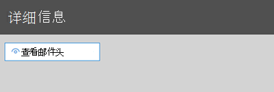
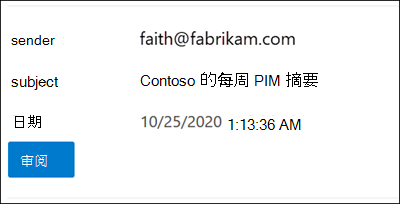

# <a name="quarantine-tags"></a><span data-ttu-id="6cb42-103">隔离标记</span><span class="sxs-lookup"><span data-stu-id="6cb42-103">Quarantine tags</span></span>

> [!NOTE]
> <span data-ttu-id="6cb42-104">本文中介绍的功能目前处于预览阶段，并非对所有人都可用，并且可能会更改。</span><span class="sxs-lookup"><span data-stu-id="6cb42-104">The features that are described in this article are currently in Preview, aren't available to everyone, and are subject to change.</span></span>

<span data-ttu-id="6cb42-105">Exchange Online Protection (EOP) 中的隔离标记允许管理员根据邮件如何到达隔离区来控制用户能够对隔离邮件执行哪些操作。</span><span class="sxs-lookup"><span data-stu-id="6cb42-105">Quarantine tags in Exchange Online Protection (EOP) allow admins to control what users are able to do to their quarantined messages based on how the message arrived in quarantine.</span></span>

<span data-ttu-id="6cb42-106">EOP 在传统上允许或阻止隔离邮件和最终用户垃圾邮件通知中的邮件的某些[](find-and-release-quarantined-messages-as-a-user.md)[交互级别](use-spam-notifications-to-release-and-report-quarantined-messages.md)。</span><span class="sxs-lookup"><span data-stu-id="6cb42-106">EOP has traditionally allowed or prevented certain levels of interactivity for messages in [quarantine](find-and-release-quarantined-messages-as-a-user.md) and in [end-user spam notifications](use-spam-notifications-to-release-and-report-quarantined-messages.md).</span></span> <span data-ttu-id="6cb42-107">例如，最终用户可以查看并释放被反垃圾邮件筛选作为垃圾邮件或批量隔离的邮件，但他们无法查看或释放被隔离为高可信度网络钓鱼的邮件。</span><span class="sxs-lookup"><span data-stu-id="6cb42-107">For example, end-users can view and release messages that were quarantined by anti-spam filtering as spam or bulk, but they can't view or release messages that were quarantined as high confidence phishing.</span></span>

<span data-ttu-id="6cb42-108">对于 [受支持的](#step-2-assign-a-quarantine-tag-to-supported-features)保护功能，隔离标记指定允许用户在最终用户垃圾邮件通知邮件中以及用户是收件人收件人的 (邮件的隔离邮件中) 。</span><span class="sxs-lookup"><span data-stu-id="6cb42-108">For [supported protection features](#step-2-assign-a-quarantine-tag-to-supported-features), quarantine tags specify what users are allowed to do in end-user spam notification messages and in their quarantined messages in quarantine (messages where the user is a recipient).</span></span> <span data-ttu-id="6cb42-109">自动分配默认隔离标记，以对隔离邮件的最终用户强制实施历史功能。</span><span class="sxs-lookup"><span data-stu-id="6cb42-109">Default quarantine tags are automatically assigned to enforce the historical capabilities for end-users on quarantined messages.</span></span> <span data-ttu-id="6cb42-110">或者，可以创建和分配自定义隔离标记，以允许或阻止最终用户对隔离邮件执行特定操作。</span><span class="sxs-lookup"><span data-stu-id="6cb42-110">Or, you can create and assign custom quarantine tags to allow or prevent end-users from performing specific actions on quarantined messages.</span></span>

<span data-ttu-id="6cb42-111">各个权限组合到以下预设权限组中：</span><span class="sxs-lookup"><span data-stu-id="6cb42-111">The individual permissions are combined into the following preset permission groups:</span></span>

- <span data-ttu-id="6cb42-112">禁止访问</span><span class="sxs-lookup"><span data-stu-id="6cb42-112">No access</span></span>
- <span data-ttu-id="6cb42-113">受限访问</span><span class="sxs-lookup"><span data-stu-id="6cb42-113">Limited access</span></span>
- <span data-ttu-id="6cb42-114">完全访问权限</span><span class="sxs-lookup"><span data-stu-id="6cb42-114">Full access</span></span>

<span data-ttu-id="6cb42-115">下表介绍了可用的单个权限以及预设权限组中包含或不包含哪些权限：</span><span class="sxs-lookup"><span data-stu-id="6cb42-115">The available individual permissions and what's included or not included in the preset permission groups are described in the following table:</span></span>

|<span data-ttu-id="6cb42-116">权限</span><span class="sxs-lookup"><span data-stu-id="6cb42-116">Permission</span></span>|<span data-ttu-id="6cb42-117">禁止访问</span><span class="sxs-lookup"><span data-stu-id="6cb42-117">No access</span></span>|<span data-ttu-id="6cb42-118">受限访问</span><span class="sxs-lookup"><span data-stu-id="6cb42-118">Limited access</span></span>|<span data-ttu-id="6cb42-119">完全访问权限</span><span class="sxs-lookup"><span data-stu-id="6cb42-119">Full access</span></span>|
|---|:---:|:---:|:---:|
|<span data-ttu-id="6cb42-120">**允许发件人 (** _PermissionToAllowSender)_</span><span class="sxs-lookup"><span data-stu-id="6cb42-120">**Allow sender** (_PermissionToAllowSender_)</span></span>||||
|<span data-ttu-id="6cb42-122">**阻止发件人 (** _PermissionToBlockSender)_</span><span class="sxs-lookup"><span data-stu-id="6cb42-122">**Block sender** (_PermissionToBlockSender_)</span></span>||||
|<span data-ttu-id="6cb42-125">**删除** (_PermissionToDelete_) </span><span class="sxs-lookup"><span data-stu-id="6cb42-125">**Delete** (_PermissionToDelete_)</span></span>||||
|<span data-ttu-id="6cb42-128">**预览** (_PermissionToPreview)_</span><span class="sxs-lookup"><span data-stu-id="6cb42-128">**Preview** (_PermissionToPreview_)</span></span>||||
|<span data-ttu-id="6cb42-131">**允许收件人将邮件从隔离邮箱 (** _PermissionToRelease_) </span><span class="sxs-lookup"><span data-stu-id="6cb42-131">**Allow recipients to release a message from quarantine** (_PermissionToRelease_)</span></span>||||
|<span data-ttu-id="6cb42-133">**允许收件人请求从隔离邮箱** 释放 (_PermissionToRequestRelease_) </span><span class="sxs-lookup"><span data-stu-id="6cb42-133">**Allow recipients to request a message to be released from quarantine** (_PermissionToRequestRelease_)</span></span>||||
|

<span data-ttu-id="6cb42-135">如果不喜欢预设权限组中的默认权限，可以在创建或修改自定义隔离标记时使用自定义权限。</span><span class="sxs-lookup"><span data-stu-id="6cb42-135">If you don't like the default permissions in the preset permission groups, you can use custom permissions when you create or modify custom quarantine tags.</span></span> <span data-ttu-id="6cb42-136">有关每个权限执行哪些操作的详细信息，请参阅本文稍后的"隔离 [标记](#quarantine-tag-permission-details) 权限详细信息"部分。</span><span class="sxs-lookup"><span data-stu-id="6cb42-136">For more information about what each permission does, see the [Quarantine tag permission details](#quarantine-tag-permission-details) section later in this article.</span></span>

<span data-ttu-id="6cb42-137">在安全与合规中心或 PowerShell &为具有 Exchange Online 邮箱的 Microsoft 365 (Exchange Online PowerShell 创建和分配隔离标记;EOP 组织中没有 Exchange Online 邮箱的独立 EOP PowerShell) 。</span><span class="sxs-lookup"><span data-stu-id="6cb42-137">You create and assign quarantine tags in the Security & Compliance Center or in PowerShell (Exchange Online PowerShell for Microsoft 365 organizations with Exchange Online Mailboxes; standalone EOP PowerShell in EOP organizations without Exchange Online mailboxes).</span></span>

## <a name="what-do-you-need-to-know-before-you-begin"></a><span data-ttu-id="6cb42-138">开始前，有必要了解什么？</span><span class="sxs-lookup"><span data-stu-id="6cb42-138">What do you need to know before you begin?</span></span>

- <span data-ttu-id="6cb42-139">安全与合规中心的打开网址为 <https://protection.office.com/>。</span><span class="sxs-lookup"><span data-stu-id="6cb42-139">You open the Security & Compliance Center at <https://protection.office.com/>.</span></span> <span data-ttu-id="6cb42-140">若要直接转到"隔离 **标记"** 页，请打开 <https://protection.office.com/quarantineTags> 。</span><span class="sxs-lookup"><span data-stu-id="6cb42-140">To go directly to the **Quarantine tags** page, open <https://protection.office.com/quarantineTags>.</span></span>

- <span data-ttu-id="6cb42-141">若要连接到 Exchange Online PowerShell，请参阅[连接到 Exchange Online PowerShell](https://docs.microsoft.com/powershell/exchange/connect-to-exchange-online-powershell)。</span><span class="sxs-lookup"><span data-stu-id="6cb42-141">To connect to Exchange Online PowerShell, see [Connect to Exchange Online PowerShell](https://docs.microsoft.com/powershell/exchange/connect-to-exchange-online-powershell).</span></span> <span data-ttu-id="6cb42-142">若要连接到独立 EOP PowerShell，请参阅[连接到 Exchange Online Protection PowerShell](https://docs.microsoft.com/powershell/exchange/connect-to-exchange-online-protection-powershell)。</span><span class="sxs-lookup"><span data-stu-id="6cb42-142">To connect to standalone EOP PowerShell, see [Connect to Exchange Online Protection PowerShell](https://docs.microsoft.com/powershell/exchange/connect-to-exchange-online-protection-powershell).</span></span>

- <span data-ttu-id="6cb42-143">若要查看、创建、修改或删除隔离标记，你需要是安全与合规中心内组织管理或安全管理员&[的成员](permissions-in-the-security-and-compliance-center.md)。 </span><span class="sxs-lookup"><span data-stu-id="6cb42-143">To view, create, modify, or remove quarantine tags, you need to be a member of the **Organization Management** or **Security Administrator** roles in the [Security & Compliance Center](permissions-in-the-security-and-compliance-center.md).</span></span>

## <a name="step-1-create-quarantine-tags-in-the-security--compliance-center"></a><span data-ttu-id="6cb42-144">步骤 1：在安全与合规中心&隔离标记</span><span class="sxs-lookup"><span data-stu-id="6cb42-144">Step 1: Create quarantine tags in the Security & Compliance Center</span></span>

1. <span data-ttu-id="6cb42-145">在安全&，转到 **"威胁管理** 策略 \> "，然后选择"**隔离"标记**。</span><span class="sxs-lookup"><span data-stu-id="6cb42-145">In the Security & Compliance Center, go to **Threat management** \> **Policy** and then select **Quarantine tags**.</span></span>

2. <span data-ttu-id="6cb42-146">在"**隔离标记"** 页上，选择 **"添加自定义标记"。**</span><span class="sxs-lookup"><span data-stu-id="6cb42-146">On the **Quarantine tags** page, select **Add custom tag**.</span></span>

3. <span data-ttu-id="6cb42-147">将 **打开"新建标记** "向导。</span><span class="sxs-lookup"><span data-stu-id="6cb42-147">The **New tag** wizard opens.</span></span> <span data-ttu-id="6cb42-148">在 **"标记名称** "页上，在"标记名称"字段中输入简短但 **唯一** 的名称。</span><span class="sxs-lookup"><span data-stu-id="6cb42-148">On the **Tag name** page, enter a brief but unique name in the **Tag name** field.</span></span> <span data-ttu-id="6cb42-149">你需要在即将推出的步骤中按名称标识和选择标记。</span><span class="sxs-lookup"><span data-stu-id="6cb42-149">You'll need to identify and select the tag by name in upcoming steps.</span></span> <span data-ttu-id="6cb42-150">完成后，单击“下一步”。</span><span class="sxs-lookup"><span data-stu-id="6cb42-150">When you're finished, click **Next**.</span></span>

4. <span data-ttu-id="6cb42-151">在 **"收件人邮件访问** "页上，选择下列值之一：</span><span class="sxs-lookup"><span data-stu-id="6cb42-151">On the **Recipient message access** page, select one of the following values:</span></span>
   - <span data-ttu-id="6cb42-152">**禁止访问**</span><span class="sxs-lookup"><span data-stu-id="6cb42-152">**No access**</span></span>
   - <span data-ttu-id="6cb42-153">**受限访问**</span><span class="sxs-lookup"><span data-stu-id="6cb42-153">**Limited access**</span></span>
   - <span data-ttu-id="6cb42-154">**完全访问权限**</span><span class="sxs-lookup"><span data-stu-id="6cb42-154">**Full access**</span></span>

   <span data-ttu-id="6cb42-155">本文前面介绍了这些权限组中包含的单个权限。</span><span class="sxs-lookup"><span data-stu-id="6cb42-155">The individual permissions that are included in these permission groups are described earlier in this article.</span></span>

   <span data-ttu-id="6cb42-156">若要指定自定义权限，请选择"在高级 (**设置**) 并配置以下设置：</span><span class="sxs-lookup"><span data-stu-id="6cb42-156">To specify custom permissions, select **Set specific access (Advanced)** and configure the following settings:</span></span>

     - <span data-ttu-id="6cb42-157">**选择释放操作首选项**：选择下列值之一：</span><span class="sxs-lookup"><span data-stu-id="6cb42-157">**Select release action preference**: Select one of the following values:</span></span>
       - <span data-ttu-id="6cb42-158">**无发布操作**：这是默认值。</span><span class="sxs-lookup"><span data-stu-id="6cb42-158">**No release action**: This is the default value.</span></span>
       - <span data-ttu-id="6cb42-159">**允许收件人从隔离区释放邮件**</span><span class="sxs-lookup"><span data-stu-id="6cb42-159">**Allow recipients to release a message from quarantine**</span></span>
       - <span data-ttu-id="6cb42-160">**允许收件人请求从隔离区释放邮件**</span><span class="sxs-lookup"><span data-stu-id="6cb42-160">**Allow recipients to request a message to be released from quarantine**</span></span>

     - <span data-ttu-id="6cb42-161">**选择收件人对隔离邮件可以执行的其他** 操作：选择以下一些、全部或无以下值：</span><span class="sxs-lookup"><span data-stu-id="6cb42-161">**Select additional actions recipients can take on quarantined messages**: Select some, all, or none of the following values:</span></span>
       - <span data-ttu-id="6cb42-162">**删除**</span><span class="sxs-lookup"><span data-stu-id="6cb42-162">**Delete**</span></span>
       - <span data-ttu-id="6cb42-163">**预览**</span><span class="sxs-lookup"><span data-stu-id="6cb42-163">**Preview**</span></span>
       - <span data-ttu-id="6cb42-164">**允许发件人**</span><span class="sxs-lookup"><span data-stu-id="6cb42-164">**Allow sender**</span></span>
       - <span data-ttu-id="6cb42-165">**阻止发件人**</span><span class="sxs-lookup"><span data-stu-id="6cb42-165">**Block sender**</span></span>

   <span data-ttu-id="6cb42-166">这些权限及其对隔离邮件和最终用户垃圾邮件通知的影响在本文稍后的"隔离 [标记](#quarantine-tag-permission-details) 权限详细信息"部分进行介绍。</span><span class="sxs-lookup"><span data-stu-id="6cb42-166">These permissions and their effect on quarantined messages and in end-user spam notifications are described in the [Quarantine tag permission details](#quarantine-tag-permission-details) section later in this article.</span></span>

   <span data-ttu-id="6cb42-167">完成后，单击“下一步”。</span><span class="sxs-lookup"><span data-stu-id="6cb42-167">When you're finished, click **Next**.</span></span>

5. <span data-ttu-id="6cb42-168">在 **出现的"摘要** "页上，查看设置。</span><span class="sxs-lookup"><span data-stu-id="6cb42-168">On the **Summary** page that appears, review your settings.</span></span> <span data-ttu-id="6cb42-169">可以单击 **每个设置** 上的"编辑"来修改它。</span><span class="sxs-lookup"><span data-stu-id="6cb42-169">You can click **Edit** on each setting to modify it.</span></span>

   <span data-ttu-id="6cb42-170">完成后，单击"提交 **"。**</span><span class="sxs-lookup"><span data-stu-id="6cb42-170">When you're finished, click **Submit**.</span></span>

6. <span data-ttu-id="6cb42-171">在 **出现的** 确认页面上单击"完成"。</span><span class="sxs-lookup"><span data-stu-id="6cb42-171">Click **Done** on the confirmation page that appears.</span></span>

<span data-ttu-id="6cb42-172">现在，您已准备好将隔离标记分配给隔离功能，如步骤 [2](#step-2-assign-a-quarantine-tag-to-supported-features) 中所述。</span><span class="sxs-lookup"><span data-stu-id="6cb42-172">Now you are ready to assign the quarantine tag to a quarantine feature as described in the [Step 2](#step-2-assign-a-quarantine-tag-to-supported-features) section.</span></span>

### <a name="create-quarantine-tags-in-powershell"></a><span data-ttu-id="6cb42-173">在 PowerShell 中创建隔离标记</span><span class="sxs-lookup"><span data-stu-id="6cb42-173">Create quarantine tags in PowerShell</span></span>

<span data-ttu-id="6cb42-174">如果你想要使用 PowerShell 创建隔离标记，请连接到 Exchange Online PowerShell 或 Exchange Online Protection PowerShell 并使用 **New-QuarantineTag** cmdlet。</span><span class="sxs-lookup"><span data-stu-id="6cb42-174">If you'd rather use PowerShell to create quarantine tags, connect to Exchange Online PowerShell or Exchange Online Protection PowerShell and use the **New-QuarantineTag** cmdlet.</span></span> <span data-ttu-id="6cb42-175">有两种不同的方法可供选择：</span><span class="sxs-lookup"><span data-stu-id="6cb42-175">You have two different methods to choose from:</span></span>

- <span data-ttu-id="6cb42-176">使用 _EndUserQuarantinePermissionsValue_ 参数。</span><span class="sxs-lookup"><span data-stu-id="6cb42-176">Use the _EndUserQuarantinePermissionsValue_ parameter.</span></span>
- <span data-ttu-id="6cb42-177">使用 _EndUserQuarantinePermissions_ 参数。</span><span class="sxs-lookup"><span data-stu-id="6cb42-177">Use the _EndUserQuarantinePermissions_ parameter.</span></span>

<span data-ttu-id="6cb42-178">以下各节介绍了这些方法。</span><span class="sxs-lookup"><span data-stu-id="6cb42-178">These methods are described in the following sections.</span></span>

#### <a name="use-the-enduserquarantinepermissionsvalue-parameter"></a><span data-ttu-id="6cb42-179">使用 EndUserQuarantinePermissionsValue 参数</span><span class="sxs-lookup"><span data-stu-id="6cb42-179">Use the EndUserQuarantinePermissionsValue parameter</span></span>

<span data-ttu-id="6cb42-180">若要使用 _EndUserQuarantinePermissionsValue_ 参数创建隔离标记，请使用以下语法：</span><span class="sxs-lookup"><span data-stu-id="6cb42-180">To create a quarantine tag using the _EndUserQuarantinePermissionsValue_ parameter, use the following syntax:</span></span>

```powershell
New-QuarantineTag -Name "<UniqueName>" -EndUserQuarantinePermissionsValue <0 to 236>
```

<span data-ttu-id="6cb42-181">_EndUserQuarantinePermissionsValue_ 参数使用从二进制值转换的十进制值。</span><span class="sxs-lookup"><span data-stu-id="6cb42-181">The _EndUserQuarantinePermissionsValue_ parameter uses a decimal value that's converted from a binary value.</span></span> <span data-ttu-id="6cb42-182">二进制值对应于按特定顺序可用的最终用户隔离权限。</span><span class="sxs-lookup"><span data-stu-id="6cb42-182">The binary value corresponds to the available end-user quarantine permissions in a specific order.</span></span> <span data-ttu-id="6cb42-183">对于每个权限，值 1 等于 True，值 0 等于 False。</span><span class="sxs-lookup"><span data-stu-id="6cb42-183">For each permission, the value 1 equals True and the value 0 equals False.</span></span>

<span data-ttu-id="6cb42-184">下表介绍了预设权限组中各个权限的必需顺序和值：</span><span class="sxs-lookup"><span data-stu-id="6cb42-184">The required order and values for each individual permission in preset permission groups are described in the following table:</span></span>

****

|<span data-ttu-id="6cb42-185">权限</span><span class="sxs-lookup"><span data-stu-id="6cb42-185">Permission</span></span>|<span data-ttu-id="6cb42-186">禁止访问</span><span class="sxs-lookup"><span data-stu-id="6cb42-186">No access</span></span>|<span data-ttu-id="6cb42-187">受限访问</span><span class="sxs-lookup"><span data-stu-id="6cb42-187">Limited access</span></span>|<span data-ttu-id="6cb42-188">完全访问权限</span><span class="sxs-lookup"><span data-stu-id="6cb42-188">Full access</span></span>|
|---|:---:|:---:|:---:|
|<span data-ttu-id="6cb42-189">PermissionToAllowSender</span><span class="sxs-lookup"><span data-stu-id="6cb42-189">PermissionToAllowSender</span></span>|<span data-ttu-id="6cb42-190">0</span><span class="sxs-lookup"><span data-stu-id="6cb42-190">0</span></span>|<span data-ttu-id="6cb42-191">0</span><span class="sxs-lookup"><span data-stu-id="6cb42-191">0</span></span>|<span data-ttu-id="6cb42-192">1 </span><span class="sxs-lookup"><span data-stu-id="6cb42-192">1</span></span>|
|<span data-ttu-id="6cb42-193">PermissionToBlockSender</span><span class="sxs-lookup"><span data-stu-id="6cb42-193">PermissionToBlockSender</span></span>|<span data-ttu-id="6cb42-194">0</span><span class="sxs-lookup"><span data-stu-id="6cb42-194">0</span></span>|<span data-ttu-id="6cb42-195">1 </span><span class="sxs-lookup"><span data-stu-id="6cb42-195">1</span></span>|<span data-ttu-id="6cb42-196">1 </span><span class="sxs-lookup"><span data-stu-id="6cb42-196">1</span></span>|
|<span data-ttu-id="6cb42-197">PermissionToDelete</span><span class="sxs-lookup"><span data-stu-id="6cb42-197">PermissionToDelete</span></span>|<span data-ttu-id="6cb42-198">0</span><span class="sxs-lookup"><span data-stu-id="6cb42-198">0</span></span>|<span data-ttu-id="6cb42-199">1 </span><span class="sxs-lookup"><span data-stu-id="6cb42-199">1</span></span>|<span data-ttu-id="6cb42-200">1 </span><span class="sxs-lookup"><span data-stu-id="6cb42-200">1</span></span>|
|<span data-ttu-id="6cb42-201">PermissionToDownload<sup>\*</sup></span><span class="sxs-lookup"><span data-stu-id="6cb42-201">PermissionToDownload<sup>\*</sup></span></span>|<span data-ttu-id="6cb42-202">0</span><span class="sxs-lookup"><span data-stu-id="6cb42-202">0</span></span>|<span data-ttu-id="6cb42-203">0</span><span class="sxs-lookup"><span data-stu-id="6cb42-203">0</span></span>|<span data-ttu-id="6cb42-204">0</span><span class="sxs-lookup"><span data-stu-id="6cb42-204">0</span></span>|
|<span data-ttu-id="6cb42-205">PermissionToPreview</span><span class="sxs-lookup"><span data-stu-id="6cb42-205">PermissionToPreview</span></span>|<span data-ttu-id="6cb42-206">0</span><span class="sxs-lookup"><span data-stu-id="6cb42-206">0</span></span>|<span data-ttu-id="6cb42-207">1 </span><span class="sxs-lookup"><span data-stu-id="6cb42-207">1</span></span>|<span data-ttu-id="6cb42-208">1 </span><span class="sxs-lookup"><span data-stu-id="6cb42-208">1</span></span>|
|<span data-ttu-id="6cb42-209">PermissionToRelease<sup>\*\*</sup></span><span class="sxs-lookup"><span data-stu-id="6cb42-209">PermissionToRelease<sup>\*\*</sup></span></span>|<span data-ttu-id="6cb42-210">0</span><span class="sxs-lookup"><span data-stu-id="6cb42-210">0</span></span>|<span data-ttu-id="6cb42-211">0</span><span class="sxs-lookup"><span data-stu-id="6cb42-211">0</span></span>|<span data-ttu-id="6cb42-212">1 </span><span class="sxs-lookup"><span data-stu-id="6cb42-212">1</span></span>|
|<span data-ttu-id="6cb42-213">PermissionToRequestRelease<sup>\*\*</sup></span><span class="sxs-lookup"><span data-stu-id="6cb42-213">PermissionToRequestRelease<sup>\*\*</sup></span></span>|<span data-ttu-id="6cb42-214">0</span><span class="sxs-lookup"><span data-stu-id="6cb42-214">0</span></span>|<span data-ttu-id="6cb42-215">1 </span><span class="sxs-lookup"><span data-stu-id="6cb42-215">1</span></span>|<span data-ttu-id="6cb42-216">0</span><span class="sxs-lookup"><span data-stu-id="6cb42-216">0</span></span>|
|<span data-ttu-id="6cb42-217">PermissionToViewHeader<sup>\*</sup></span><span class="sxs-lookup"><span data-stu-id="6cb42-217">PermissionToViewHeader<sup>\*</sup></span></span>|<span data-ttu-id="6cb42-218">0</span><span class="sxs-lookup"><span data-stu-id="6cb42-218">0</span></span>|<span data-ttu-id="6cb42-219">0</span><span class="sxs-lookup"><span data-stu-id="6cb42-219">0</span></span>|<span data-ttu-id="6cb42-220">0</span><span class="sxs-lookup"><span data-stu-id="6cb42-220">0</span></span>|
|<span data-ttu-id="6cb42-221">二进制值</span><span class="sxs-lookup"><span data-stu-id="6cb42-221">Binary value</span></span>|<span data-ttu-id="6cb42-222">00000000</span><span class="sxs-lookup"><span data-stu-id="6cb42-222">00000000</span></span>|<span data-ttu-id="6cb42-223">01101010</span><span class="sxs-lookup"><span data-stu-id="6cb42-223">01101010</span></span>|<span data-ttu-id="6cb42-224">11101100</span><span class="sxs-lookup"><span data-stu-id="6cb42-224">11101100</span></span>|
|<span data-ttu-id="6cb42-225">要使用的十进制值</span><span class="sxs-lookup"><span data-stu-id="6cb42-225">Decimal value to use</span></span>|<span data-ttu-id="6cb42-226">0</span><span class="sxs-lookup"><span data-stu-id="6cb42-226">0</span></span>|<span data-ttu-id="6cb42-227">106</span><span class="sxs-lookup"><span data-stu-id="6cb42-227">106</span></span>|<span data-ttu-id="6cb42-228">236</span><span class="sxs-lookup"><span data-stu-id="6cb42-228">236</span></span>|

<span data-ttu-id="6cb42-229"><sup>\*</sup> 目前，此值始终为 0。</span><span class="sxs-lookup"><span data-stu-id="6cb42-229"><sup>\*</sup> Currently, this value is always 0.</span></span> <span data-ttu-id="6cb42-230">对于 PermissionToViewHeader，值 0 不会在隔离邮件的详细信息中隐藏"查看邮件头"按钮 (该按钮始终可用) 。</span><span class="sxs-lookup"><span data-stu-id="6cb42-230">For PermissionToViewHeader, the value 0 doesn't hide the **View message header** button in the details of the quarantined message (the button is always available).</span></span>

<span data-ttu-id="6cb42-231"><sup>\*\*</sup> 不要同时将这两个值都设置为 1。</span><span class="sxs-lookup"><span data-stu-id="6cb42-231"><sup>\*\*</sup> Don't set both of these values to 1.</span></span> <span data-ttu-id="6cb42-232">将一个设置为 1，另一个设置为 0，或同时设置为 0。</span><span class="sxs-lookup"><span data-stu-id="6cb42-232">Set one to 1 and the other to 0, or set both to 0.</span></span>

<span data-ttu-id="6cb42-233">此示例创建一个新的隔离标记名称 NoAccess，该名称分配"无访问权限"权限，如上表所述。</span><span class="sxs-lookup"><span data-stu-id="6cb42-233">This example creates a new quarantine tag name NoAccess that assigns the No access permissions as described in the previous table.</span></span>

```powershell
New-QuarantineTag -Name NoAccess -EndUserQuarantinePermissionsValue 0
```

<span data-ttu-id="6cb42-234">对于受限访问权限，请使用值 106。</span><span class="sxs-lookup"><span data-stu-id="6cb42-234">For Limited access permissions, use the value 106.</span></span> <span data-ttu-id="6cb42-235">对于完全访问权限，请使用值 236。</span><span class="sxs-lookup"><span data-stu-id="6cb42-235">For Full access permissions, use the value 236.</span></span>

<span data-ttu-id="6cb42-236">对于自定义权限，使用上表获取与所需的权限对应的二进制值。</span><span class="sxs-lookup"><span data-stu-id="6cb42-236">For custom permissions, use the previous table to get the binary value that corresponds to the permissions you want.</span></span> <span data-ttu-id="6cb42-237">将二进制值转换为十进制值，并使用 _EndUserQuarantinePermissionsValue_ 参数的十进制值。</span><span class="sxs-lookup"><span data-stu-id="6cb42-237">Convert the binary value to a decimal value and use the decimal value for the _EndUserQuarantinePermissionsValue_ parameter.</span></span>

<span data-ttu-id="6cb42-238">有关语法和参数的详细信息，请参阅[New-QuarantineTag。](https://docs.microsoft.com/powershell/module/exchange/new-quarantinetag)</span><span class="sxs-lookup"><span data-stu-id="6cb42-238">For detailed syntax and parameter information, see [New-QuarantineTag](https://docs.microsoft.com/powershell/module/exchange/new-quarantinetag).</span></span>

#### <a name="use-the-enduserquarantinepermissions-parameter"></a><span data-ttu-id="6cb42-239">使用 EndUserQuarantinePermissions 参数</span><span class="sxs-lookup"><span data-stu-id="6cb42-239">Use the EndUserQuarantinePermissions parameter</span></span>

<span data-ttu-id="6cb42-240">若要使用 _EndUserQuarantinePermissionsValue_ 参数创建隔离标记，请执行以下步骤：</span><span class="sxs-lookup"><span data-stu-id="6cb42-240">To create a quarantine tag using the _EndUserQuarantinePermissionsValue_ parameter, do the following steps:</span></span>

<span data-ttu-id="6cb42-241">A.</span><span class="sxs-lookup"><span data-stu-id="6cb42-241">A.</span></span> <span data-ttu-id="6cb42-242">使用 **New-QuarantinePermissions** cmdlet 将隔离权限对象存储在变量中。</span><span class="sxs-lookup"><span data-stu-id="6cb42-242">Store a quarantine permissions object in a variable using the **New-QuarantinePermissions** cmdlet.</span></span>

<p>

<span data-ttu-id="6cb42-243">B.</span><span class="sxs-lookup"><span data-stu-id="6cb42-243">B.</span></span> <span data-ttu-id="6cb42-244">在 **New-QuarantineTag** 命令中将变量用作 _EndUserQuarantinePermissions_ 值。</span><span class="sxs-lookup"><span data-stu-id="6cb42-244">Use the variable as the _EndUserQuarantinePermissions_ value in the **New-QuarantineTag** command.</span></span>

##### <a name="step-a-store-a-quarantine-permissions-object-in-a-variable"></a><span data-ttu-id="6cb42-245">步骤 A：将隔离权限对象存储在变量中</span><span class="sxs-lookup"><span data-stu-id="6cb42-245">Step A: Store a quarantine permissions object in a variable</span></span>

<span data-ttu-id="6cb42-246">使用以下语法：</span><span class="sxs-lookup"><span data-stu-id="6cb42-246">Use the following syntax:</span></span>

```powershell
$<VariableName> = New-QuarantinePermissions [-PermissionToAllowSender <$true | $False>] [-PermissionToBlockSender <$true | $False>] [-PermissionToDelete <$true | $False>] [-PermissionToPreview <$true | $False>] [-PermissionToRelease <$true | $False>] [-PermissionToRequestRelease <$true | $False>]
```

<span data-ttu-id="6cb42-247">任何未使用的参数的默认值都是，因此只需使用要设置值 `$false` 的参数 `$true` 。</span><span class="sxs-lookup"><span data-stu-id="6cb42-247">The default value for any unused parameters is `$false`, so you only need to use the parameters where you want to set value to `$true`.</span></span>

<span data-ttu-id="6cb42-248">以下示例显示如何创建与预设权限组对应的权限对象：</span><span class="sxs-lookup"><span data-stu-id="6cb42-248">The following examples show how to create permission objects that correspond to the preset permissions groups:</span></span>

- <span data-ttu-id="6cb42-249">**无法访问**：</span><span class="sxs-lookup"><span data-stu-id="6cb42-249">**No access**:</span></span>

  ```powershell
  $NoAccess = New-QuarantinePermissions
  ```

- <span data-ttu-id="6cb42-250">**受限访问**：</span><span class="sxs-lookup"><span data-stu-id="6cb42-250">**Limited access**:</span></span>

  ```powershell
  $LimitedAccess = New-QuarantinePermissions -PermissionToBlockSender $true -PermissionToDelete $true -PermissionToPreview $true -PermissionToRequestRelease $true
  ```

- <span data-ttu-id="6cb42-251">**完全访问权限**：</span><span class="sxs-lookup"><span data-stu-id="6cb42-251">**Full access**:</span></span>

  ```powershell
  $FullAccess = New-QuarantinePermissions -PermissionToAllowSender $true -PermissionToBlockSender $true -PermissionToDelete $true -PermissionToPreview $true -PermissionToRelease $true
  ```

<span data-ttu-id="6cb42-252">To see the values that you've set， run the variable name as a command (for example， run the command `$NoAccess`) .</span><span class="sxs-lookup"><span data-stu-id="6cb42-252">To see the values that you've set, run the variable name as a command (for example, run the command `$NoAccess`).</span></span>

<span data-ttu-id="6cb42-253">对于自定义权限，不要同时将 _PermissionToRelease_ 和 _PermissionToRequestRelease_ 参数设置为 `$true` 。</span><span class="sxs-lookup"><span data-stu-id="6cb42-253">For custom permissions, don't set both the _PermissionToRelease_ and _PermissionToRequestRelease_ parameters to `$true`.</span></span> <span data-ttu-id="6cb42-254">将一个 `$true` 设置为另一个，另一个保留 `$false` 为，或同时保留为 `$false` 。</span><span class="sxs-lookup"><span data-stu-id="6cb42-254">Set one to `$true` and leave the other as `$false`, or leave both as `$false`.</span></span>

<span data-ttu-id="6cb42-255">您还可以在使用 **Set-QuarantinePermissions** cmdlet 创建现有权限对象变量之后使用该变量之前对其进行修改。</span><span class="sxs-lookup"><span data-stu-id="6cb42-255">You can also modify an existing permissions object variable after you create but before you use it by using the **Set-QuarantinePermissions** cmdlet.</span></span>

<span data-ttu-id="6cb42-256">有关语法和参数的详细信息，请参阅[New-QuarantinePermissions](https://docs.microsoft.com/powershell/module/exchange/new-quarantinepermissions)和[Set-QuarantinePermissions。](https://docs.microsoft.com/powershell/module/exchange/set-quarantinepermissions)</span><span class="sxs-lookup"><span data-stu-id="6cb42-256">For detailed syntax and parameter information, see [New-QuarantinePermissions](https://docs.microsoft.com/powershell/module/exchange/new-quarantinepermissions) and [Set-QuarantinePermissions](https://docs.microsoft.com/powershell/module/exchange/set-quarantinepermissions).</span></span>

##### <a name="step-b-use-the-variable-in-the-new-quarantinetag-command"></a><span data-ttu-id="6cb42-257">步骤 B：在命令中New-QuarantineTag变量</span><span class="sxs-lookup"><span data-stu-id="6cb42-257">Step B: Use the variable in the New-QuarantineTag command</span></span>

<span data-ttu-id="6cb42-258">在变量中创建和存储权限对象后，请使用以下 **New-QuarantineTag** 命令中的 _EndUserQuarantinePermission_ 参数值变量：</span><span class="sxs-lookup"><span data-stu-id="6cb42-258">After you've created and stored the permissions object in a variable, use the variable for the _EndUserQuarantinePermission_ parameter value in the following **New-QuarantineTag** command:</span></span>

```powershell
New-QuarantineTag -Name "<UniqueName>" -EndUserQuarantinePermissions $<VariableName>
```

<span data-ttu-id="6cb42-259">此示例使用上一步中介绍和创建的权限对象创建名为 LimitedAccess 的新 `$LimitedAccess` 隔离标记。</span><span class="sxs-lookup"><span data-stu-id="6cb42-259">This example creates a new quarantine tag named LimitedAccess using the `$LimitedAccess` permissions object that was described and created in the previous step.</span></span>

```powershell
New-QuarantineTag -Name LimitedAccess -EndUserQuarantinePermissions $LimitedAccess
```

<span data-ttu-id="6cb42-260">有关语法和参数的详细信息，请参阅[New-QuarantineTag。](https://docs.microsoft.com/powershell/module/exchange/new-quarantinetag)</span><span class="sxs-lookup"><span data-stu-id="6cb42-260">For detailed syntax and parameter information, see [New-QuarantineTag](https://docs.microsoft.com/powershell/module/exchange/new-quarantinetag).</span></span>

## <a name="step-2-assign-a-quarantine-tag-to-supported-features"></a><span data-ttu-id="6cb42-261">步骤 2：向支持的功能分配隔离标记</span><span class="sxs-lookup"><span data-stu-id="6cb42-261">Step 2: Assign a quarantine tag to supported features</span></span>

<span data-ttu-id="6cb42-262">在 _可_ 自动隔离邮件或文件 (或作为可配置操作) 功能中，可以将隔离标记分配给可用的隔离操作。</span><span class="sxs-lookup"><span data-stu-id="6cb42-262">In _supported_ protection features that quarantine messages or files (automatically or as a configurable action), you can assign a quarantine tag to the available quarantine actions.</span></span> <span data-ttu-id="6cb42-263">下表介绍了隔离邮件的功能和隔离标记的可用性：</span><span class="sxs-lookup"><span data-stu-id="6cb42-263">Features that quarantine messages and the availability of quarantine tags are described in the following table:</span></span>

****

|<span data-ttu-id="6cb42-264">功能</span><span class="sxs-lookup"><span data-stu-id="6cb42-264">Feature</span></span>|<span data-ttu-id="6cb42-265">支持隔离标记？</span><span class="sxs-lookup"><span data-stu-id="6cb42-265">Quarantine tags supported?</span></span>|<span data-ttu-id="6cb42-266">使用的默认隔离标记</span><span class="sxs-lookup"><span data-stu-id="6cb42-266">Default quarantine tags used</span></span>|
|---|:---:|---|
|<span data-ttu-id="6cb42-267">[反垃圾邮件策略](configure-your-spam-filter-policies.md)：</span><span class="sxs-lookup"><span data-stu-id="6cb42-267">[Anti-spam policies](configure-your-spam-filter-policies.md):</span></span> <ul><li><span data-ttu-id="6cb42-268">**Spam** (_SpamAction_) </span><span class="sxs-lookup"><span data-stu-id="6cb42-268">**Spam** (_SpamAction_)</span></span></li><li><span data-ttu-id="6cb42-269">**高可信度垃圾邮件 (** _HighConfidenceSpamAction_) </span><span class="sxs-lookup"><span data-stu-id="6cb42-269">**High confidence spam** (_HighConfidenceSpamAction_)</span></span></li><li><span data-ttu-id="6cb42-270"> _PhishSpamAction_ (网络钓鱼) </span><span class="sxs-lookup"><span data-stu-id="6cb42-270">**Phishing email** (_PhishSpamAction_)</span></span></li><li><span data-ttu-id="6cb42-271">**高可信度网络钓鱼电子邮件 (** _HighConfidencePhishAction_) </span><span class="sxs-lookup"><span data-stu-id="6cb42-271">**High confidence phishing email** (_HighConfidencePhishAction_)</span></span></li><li><span data-ttu-id="6cb42-272">**BulkSpamAction** (_群_ 发) </span><span class="sxs-lookup"><span data-stu-id="6cb42-272">**Bulk email** (_BulkSpamAction_)</span></span></li></ul>|<span data-ttu-id="6cb42-273">是</span><span class="sxs-lookup"><span data-stu-id="6cb42-273">Yes</span></span>|<ul><li><span data-ttu-id="6cb42-274">DefaultSpamTag (完全访问权限) </span><span class="sxs-lookup"><span data-stu-id="6cb42-274">DefaultSpamTag (Full access)</span></span></li><li><span data-ttu-id="6cb42-275">DefaultHighConfSpamTag (完全访问权限) </span><span class="sxs-lookup"><span data-stu-id="6cb42-275">DefaultHighConfSpamTag (Full access)</span></span></li><li><span data-ttu-id="6cb42-276">DefaultPhishTag (完全访问权限) </span><span class="sxs-lookup"><span data-stu-id="6cb42-276">DefaultPhishTag (Full access)</span></span></li><li><span data-ttu-id="6cb42-277">DefaultHighConfPhishTag (无法访问) </span><span class="sxs-lookup"><span data-stu-id="6cb42-277">DefaultHighConfPhishTag (No access)</span></span></li><li><span data-ttu-id="6cb42-278">DefaultBulkTag (完全访问权限) </span><span class="sxs-lookup"><span data-stu-id="6cb42-278">DefaultBulkTag (Full access)</span></span></li></ul>
|<span data-ttu-id="6cb42-279">防钓鱼策略：</span><span class="sxs-lookup"><span data-stu-id="6cb42-279">Anti-phishing policies:</span></span> <ul><li><span data-ttu-id="6cb42-280">[AuthenticationFailAction](set-up-anti-phishing-policies.md#spoof-settings) (_欺骗智能_) </span><span class="sxs-lookup"><span data-stu-id="6cb42-280">[Spoof intelligence protection](set-up-anti-phishing-policies.md#spoof-settings) (_AuthenticationFailAction_)</span></span></li><li><span data-ttu-id="6cb42-281">[模拟保护](set-up-anti-phishing-policies.md#impersonation-settings-in-anti-phishing-policies-in-microsoft-defender-for-office-365)：<sup>\*</sup></span><span class="sxs-lookup"><span data-stu-id="6cb42-281">[Impersonation protection](set-up-anti-phishing-policies.md#impersonation-settings-in-anti-phishing-policies-in-microsoft-defender-for-office-365):<sup>\*</sup></span></span> <ul><li><span data-ttu-id="6cb42-282">**如果电子邮件是由模拟用户 (** _TargetedUserProtectionAction_) </span><span class="sxs-lookup"><span data-stu-id="6cb42-282">**If email is sent by an impersonated user** (_TargetedUserProtectionAction_)</span></span></li><li><span data-ttu-id="6cb42-283">**如果电子邮件是由模拟域 (** _TargetedDomainProtectionAction_) </span><span class="sxs-lookup"><span data-stu-id="6cb42-283">**If email is sent by an impersonated domain** (_TargetedDomainProtectionAction_)</span></span></li><li><span data-ttu-id="6cb42-284">**邮箱智能** \>**如果电子邮件是由模拟用户 (** _MailboxIntelligenceProtectionAction_) </span><span class="sxs-lookup"><span data-stu-id="6cb42-284">**Mailbox intelligence** \> **If email is sent by an impersonated user** (_MailboxIntelligenceProtectionAction_)</span></span></li></ul></li></ul></ul>|<span data-ttu-id="6cb42-285">否</span><span class="sxs-lookup"><span data-stu-id="6cb42-285">No</span></span>|<span data-ttu-id="6cb42-286">不适用</span><span class="sxs-lookup"><span data-stu-id="6cb42-286">n/a</span></span>|
|<span data-ttu-id="6cb42-287">[反恶意软件策略](configure-anti-malware-policies.md)：始终隔离所有检测到的邮件。</span><span class="sxs-lookup"><span data-stu-id="6cb42-287">[Anti-malware policies](configure-anti-malware-policies.md): All detected messages are always quarantined.</span></span>|<span data-ttu-id="6cb42-288">否</span><span class="sxs-lookup"><span data-stu-id="6cb42-288">No</span></span>|<span data-ttu-id="6cb42-289">不适用</span><span class="sxs-lookup"><span data-stu-id="6cb42-289">n/a</span></span>|
|[<span data-ttu-id="6cb42-290">适用于 SharePoint、OneDrive 和 Microsoft Teams 的 ATP</span><span class="sxs-lookup"><span data-stu-id="6cb42-290">ATP for SharePoint, OneDrive, and Microsoft Teams</span></span>](atp-for-spo-odb-and-teams.md)|<span data-ttu-id="6cb42-291">否</span><span class="sxs-lookup"><span data-stu-id="6cb42-291">No</span></span>|<span data-ttu-id="6cb42-292">不适用</span><span class="sxs-lookup"><span data-stu-id="6cb42-292">n/a</span></span>|
|<span data-ttu-id="6cb42-293">[邮件流规则](https://docs.microsoft.com/exchange/security-and-compliance/mail-flow-rules/mail-flow-rules) (操作) 传输规则：将邮件发送到托管隔离邮箱 (_隔离_) 。 </span><span class="sxs-lookup"><span data-stu-id="6cb42-293">[Mail flow rules](https://docs.microsoft.com/exchange/security-and-compliance/mail-flow-rules/mail-flow-rules) (also known as transport rules) with the action: **Deliver the message to the hosted quarantine** (_Quarantine_).</span></span>|<span data-ttu-id="6cb42-294">否</span><span class="sxs-lookup"><span data-stu-id="6cb42-294">No</span></span>|<span data-ttu-id="6cb42-295">不适用</span><span class="sxs-lookup"><span data-stu-id="6cb42-295">n/a</span></span>|
|

<span data-ttu-id="6cb42-296"><sup>\*</sup> 模拟保护设置仅在 Microsoft Defender for Office 365 中的防钓鱼策略中可用。</span><span class="sxs-lookup"><span data-stu-id="6cb42-296"><sup>\*</sup> Impersonation protection settings are available only in anti-phishing policies in Microsoft Defender for Office 365.</span></span>

<span data-ttu-id="6cb42-297">如果您对默认隔离标记提供的最终用户权限满意，则无需执行任何操作。</span><span class="sxs-lookup"><span data-stu-id="6cb42-297">If you're happy with the end-user permissions that are provided by the default quarantine tags, you don't need to do anything.</span></span> <span data-ttu-id="6cb42-298">如果要自定义最终用户功能 (最终用户垃圾邮件) 或隔离邮件详细信息中的可用按钮，可以分配自定义隔离标记。</span><span class="sxs-lookup"><span data-stu-id="6cb42-298">If you want to customize the end-user capabilities (available buttons) in end-user spam notifications or in quarantined message details, you can assign a custom quarantine tag.</span></span>

### <a name="assign-quarantine-tags-in-anti-spam-policies-in-the-security--compliance-center"></a><span data-ttu-id="6cb42-299">在安全与合规中心的反垃圾邮件策略中&标记</span><span class="sxs-lookup"><span data-stu-id="6cb42-299">Assign quarantine tags in anti-spam policies in the Security & Compliance Center</span></span>

<span data-ttu-id="6cb42-300">有关创建和修改反垃圾邮件策略的完整说明在 [EOP 中的"配置反垃圾邮件策略"中进行了介绍](configure-your-spam-filter-policies.md)。</span><span class="sxs-lookup"><span data-stu-id="6cb42-300">Full instructions for creating and modifying anti-spam policies are described in [Configure anti-spam policies in EOP](configure-your-spam-filter-policies.md).</span></span>

1. <span data-ttu-id="6cb42-301">在安全&，转到 **"威胁管理** 策略 \>  \> "，然后选择 **"反垃圾邮件"。**</span><span class="sxs-lookup"><span data-stu-id="6cb42-301">In the Security & Compliance Center, go to **Threat management** \> **Policy** \> and then select **Anti-spam**.</span></span> <span data-ttu-id="6cb42-302">或者，打开 <https://protection.office.com/antispam> 。</span><span class="sxs-lookup"><span data-stu-id="6cb42-302">Or, open <https://protection.office.com/antispam>.</span></span>

2. <span data-ttu-id="6cb42-303">查找并选择要编辑的现有反垃圾邮件策略，或创建新的反垃圾邮件策略。</span><span class="sxs-lookup"><span data-stu-id="6cb42-303">Find and select an existing anti-spam policy to edit, or create a new anti-spam policy.</span></span>

3. <span data-ttu-id="6cb42-304">在策略详细信息飞出中，展开" **垃圾邮件和批量操作"** 部分。</span><span class="sxs-lookup"><span data-stu-id="6cb42-304">In the policy details flyout, expand the **Spam and bulk actions** section.</span></span>

4. <span data-ttu-id="6cb42-305">如果选择了"隔离邮件"以执行可用垃圾邮件筛选裁定的操作，则"应用隔离策略标记"框可供你选择该裁定的隔离标记。</span><span class="sxs-lookup"><span data-stu-id="6cb42-305">If you've selected **Quarantine message** for the action of an available spam filtering verdict, the **Apply quarantine policy tag** box is available for you to select the quarantine tag for that verdict.</span></span>

   <span data-ttu-id="6cb42-306">**注意**：创建新策略时，垃圾邮件筛选裁定的空白隔离标记值指示已使用该裁定的默认隔离标记。</span><span class="sxs-lookup"><span data-stu-id="6cb42-306">**Note**: When you create a new policy, a blank quarantine tag value for a spam filtering verdict indicates the default quarantine tag for that verdict is used.</span></span> <span data-ttu-id="6cb42-307">稍后编辑策略时，空白值将替换为实际的默认隔离标记名称，如上表所述。</span><span class="sxs-lookup"><span data-stu-id="6cb42-307">When you later edit the policy, the blank values are replaced by the actual default quarantine tag names as described in the previous table.</span></span>

   

5. <span data-ttu-id="6cb42-309">完成时，请单击“保存”。</span><span class="sxs-lookup"><span data-stu-id="6cb42-309">When you're finished, click **Save**.</span></span>

#### <a name="assign-quarantine-tags-in-anti-spam-policies-in-powershell"></a><span data-ttu-id="6cb42-310">在 PowerShell 中的反垃圾邮件策略中分配隔离标记</span><span class="sxs-lookup"><span data-stu-id="6cb42-310">Assign quarantine tags in anti-spam policies in PowerShell</span></span>

<span data-ttu-id="6cb42-311">如果希望使用 PowerShell 在反垃圾邮件策略中分配隔离标记，请连接到 Exchange Online PowerShell 或 Exchange Online Protection PowerShell，并使用以下语法：</span><span class="sxs-lookup"><span data-stu-id="6cb42-311">If you'd rather use PowerShell to assign quarantine tags in anti-spam policies, connect to Exchange Online PowerShell or Exchange Online Protection PowerShell and use the following syntax:</span></span>

```powershell
<New-HostedContentFilterPolicy -Name "<Unique name>" | Set-HostedContentFilterPolicy -Identity "<Policy name>">  [-SpamAction Quarantine] [-SpamQuarantineTag <QuarantineTagName>] [-HighConfidenceSpamAction Quarantine] [-HighConfidenceSpamQuarantineTag <QuarantineTagName>] [-PhishSpamAction Quarantine] [-PhishQuarantineTag <QuarantineTagName>] [-HighConfidencePhishQuarantineTag <QuarantineTagName>] [-BulkSpamAction Quarantine] [-BulkQuarantineTag <QuarantineTagName>] ...
```

<span data-ttu-id="6cb42-312">**注意**：</span><span class="sxs-lookup"><span data-stu-id="6cb42-312">**Notes**:</span></span>

- <span data-ttu-id="6cb42-313">_HighConfidencePhishAction_ 参数的默认值为"隔离"，因此无需设置新反垃圾邮件策略中的高可信度网络钓鱼检测的隔离操作。</span><span class="sxs-lookup"><span data-stu-id="6cb42-313">The default value for the _HighConfidencePhishAction_ parameter is Quarantine, so you don't need to set the Quarantine action for high confidence phishing detections in new anti-spam policies.</span></span> <span data-ttu-id="6cb42-314">对于新的或现有的反垃圾邮件策略中的所有其他垃圾邮件筛选裁定，隔离标记仅在操作值为"隔离"时有效。</span><span class="sxs-lookup"><span data-stu-id="6cb42-314">For all other spam filtering verdicts in new or existing anti-spam policies, the quarantine tag is only effective if the action value is Quarantine.</span></span> <span data-ttu-id="6cb42-315">若要查看现有反垃圾邮件策略中的操作值，请运行以下命令：</span><span class="sxs-lookup"><span data-stu-id="6cb42-315">To see the action values in existing anti-spam policies, run the following command:</span></span>

  ```powershell
  Get-HostedContentFilterPolicy | Format-Table Name,*SpamAction,HighConfidencePhishAction
  ```

  <span data-ttu-id="6cb42-316">有关默认操作值以及 Standard 和 Strict 的建议操作值的信息，请参阅 [EOP 反垃圾邮件策略设置](recommended-settings-for-eop-and-office365-atp.md#eop-anti-spam-policy-settings)。</span><span class="sxs-lookup"><span data-stu-id="6cb42-316">For information about the default action values and the recommended action values for Standard and Strict, see [EOP anti-spam policy settings](recommended-settings-for-eop-and-office365-atp.md#eop-anti-spam-policy-settings).</span></span>

- <span data-ttu-id="6cb42-317">没有相应隔离标记参数的垃圾邮件筛选裁定意味着使用该 [裁定的默认](#step-2-assign-a-quarantine-tag-to-supported-features) 隔离标记。</span><span class="sxs-lookup"><span data-stu-id="6cb42-317">A spam filtering verdict without a corresponding quarantine tag parameter means the [default quarantine tag](#step-2-assign-a-quarantine-tag-to-supported-features) for that verdict is used.</span></span>

  <span data-ttu-id="6cb42-318">如果希望更改已隔离邮件的默认最终用户功能，只需将默认隔离标记替换为自定义隔离标记。</span><span class="sxs-lookup"><span data-stu-id="6cb42-318">You only need to replace a default quarantine tag with a custom quarantine tag if you want to change the default end-user capabilities on quarantined messages.</span></span>

- <span data-ttu-id="6cb42-319">PowerShell 中的新反垃圾邮件策略需要使用 **New-HostedContentFilterPolicy** cmdlet 和新的垃圾邮件筛选器规则 (收件人筛选器) 使用 **New-HostedContentFilterRule** cmdlet 将垃圾邮件筛选器策略 (设置设置为) 。</span><span class="sxs-lookup"><span data-stu-id="6cb42-319">A new anti-spam policy in PowerShell requires a spam filter policy (settings) using the **New-HostedContentFilterPolicy** cmdlet and a new spam filter rule (recipient filters) using the **New-HostedContentFilterRule** cmdlet.</span></span> <span data-ttu-id="6cb42-320">有关说明，请参阅 [使用 PowerShell 创建反垃圾邮件策略](configure-your-spam-filter-policies.md#use-powershell-to-create-anti-spam-policies)。</span><span class="sxs-lookup"><span data-stu-id="6cb42-320">For instructions, see [Use PowerShell to create anti-spam policies](configure-your-spam-filter-policies.md#use-powershell-to-create-anti-spam-policies).</span></span>

<span data-ttu-id="6cb42-321">本示例创建一个名为 Research Department 的新垃圾邮件筛选器策略，该策略具有以下设置：</span><span class="sxs-lookup"><span data-stu-id="6cb42-321">This example creates a new spam filter policy named Research Department with the following settings:</span></span>

- <span data-ttu-id="6cb42-322">所有垃圾邮件筛选裁定的操作都设置为"隔离"。</span><span class="sxs-lookup"><span data-stu-id="6cb42-322">The action for all spam filtering verdicts is set to Quarantine.</span></span>
- <span data-ttu-id="6cb42-323">分配"无访问权限"的名为 NoAccess的自定义隔离标记将替换默认情况下尚未分配"无访问权限"的任何默认隔离标记。</span><span class="sxs-lookup"><span data-stu-id="6cb42-323">The custom quarantine tag named NoAccess that assigns **No access** permissions replaces any default quarantine tags that don't already assign **No access** permissions by default.</span></span>

```powershell
New-HostedContentFilterPolicy -Name Research Department -SpamAction Quarantine -SpamQuarantineTag NoAccess -HighConfidenceSpamAction Quarantine -HighConfidenceSpamQuarantineTag NoAction -PhishSpamAction Quarantine -PhishQuarantineTag NoAction -BulkSpamAction Quarantine -BulkQuarantineTag NoAccess
```

<span data-ttu-id="6cb42-324">若要详细了解语法和参数，请参阅 [New-HostedContentFilterPolicy](https://docs.microsoft.com/powershell/module/exchange/new-hostedcontentfilterpolicy)。</span><span class="sxs-lookup"><span data-stu-id="6cb42-324">For detailed syntax and parameter information, see [New-HostedContentFilterPolicy](https://docs.microsoft.com/powershell/module/exchange/new-hostedcontentfilterpolicy).</span></span>

<span data-ttu-id="6cb42-325">本示例修改名为 Human Resources 的现有垃圾邮件筛选器策略。</span><span class="sxs-lookup"><span data-stu-id="6cb42-325">This example modifies the existing spam filter policy named Human Resources.</span></span> <span data-ttu-id="6cb42-326">垃圾邮件隔离裁定的操作设置为"隔离"，并分配了名为 NoAccess 的自定义隔离标记。</span><span class="sxs-lookup"><span data-stu-id="6cb42-326">The action for the spam quarantine verdict is set to Quarantine, and the custom quarantine tag named NoAccess is assigned.</span></span>

```powershell
Set-HostedContentFilterPolicy -Identity "Human Resources" -SpamAction Quarantine -SpamQuarantineTag NoAccess
```

<span data-ttu-id="6cb42-327">若要详细了解语法和参数，请参阅 [Set-HostedContentFilterPolicy](https://docs.microsoft.com/powershell/module/exchange/set-hostedcontentfilterpolicy)。</span><span class="sxs-lookup"><span data-stu-id="6cb42-327">For detailed syntax and parameter information, see [Set-HostedContentFilterPolicy](https://docs.microsoft.com/powershell/module/exchange/set-hostedcontentfilterpolicy).</span></span>

## <a name="configure-global-quarantine-notification-settings-in-the-security--compliance-center"></a><span data-ttu-id="6cb42-328">在安全与合规中心&全局隔离通知设置</span><span class="sxs-lookup"><span data-stu-id="6cb42-328">Configure global quarantine notification settings in the Security & Compliance Center</span></span>

<span data-ttu-id="6cb42-329">使用隔离标记的全局设置，可以自定义发送到已隔离邮件收件人的最终用户垃圾邮件通知。</span><span class="sxs-lookup"><span data-stu-id="6cb42-329">The global settings for quarantine tags allow you to customize the end-user spam notifications that are sent to recipients of messages that were quarantined.</span></span> <span data-ttu-id="6cb42-330">有关这些通知详细信息，请参阅 [最终用户垃圾邮件通知](use-spam-notifications-to-release-and-report-quarantined-messages.md)。</span><span class="sxs-lookup"><span data-stu-id="6cb42-330">For more information about these notifications, see [End-user spam notifications](use-spam-notifications-to-release-and-report-quarantined-messages.md).</span></span>

1. <span data-ttu-id="6cb42-331">在安全&，转到 **"威胁管理** 策略 \> "，然后选择"**隔离"标记**。</span><span class="sxs-lookup"><span data-stu-id="6cb42-331">In the Security & Compliance Center, go to **Threat management** \> **Policy** and then select **Quarantine tags**.</span></span>

2. <span data-ttu-id="6cb42-332">在"**隔离标记"** 页上，选择 **"全局设置"。**</span><span class="sxs-lookup"><span data-stu-id="6cb42-332">On the **Quarantine tags** page, select **Global settings**.</span></span>

3. <span data-ttu-id="6cb42-333">在打开 **的隔离通知** 设置飞出中，配置以下部分或所有设置：</span><span class="sxs-lookup"><span data-stu-id="6cb42-333">In the **Quarantine notification settings** flyout that opens, configure some or all of the following settings:</span></span>

   - <span data-ttu-id="6cb42-334">**使用我的公司徽标**：选择此选项可替换最终用户垃圾邮件通知顶部使用的默认 Microsoft 徽标。</span><span class="sxs-lookup"><span data-stu-id="6cb42-334">**Use my company logo**: Select this option to replace the default Microsoft logo that's use at the top of end-user spam notifications.</span></span> <span data-ttu-id="6cb42-335">在这样做之前，你需要按照 [自定义组织的 Microsoft 365](https://docs.microsoft.com/microsoft-365/admin/setup/customize-your-organization-theme) 主题中的说明上载自定义徽标。</span><span class="sxs-lookup"><span data-stu-id="6cb42-335">Before you do this, you need to follow the instructions in [Customize the Microsoft 365 theme for your organization](https://docs.microsoft.com/microsoft-365/admin/setup/customize-your-organization-theme) to upload your custom logo.</span></span>

     <span data-ttu-id="6cb42-336">以下屏幕截图显示了最终用户垃圾邮件通知中的自定义徽标：</span><span class="sxs-lookup"><span data-stu-id="6cb42-336">The following screenshot shows a custom logo in an end-user spam notification:</span></span>

     

   - <span data-ttu-id="6cb42-338">**选择语言**：已根据收件人的语言设置对最终用户垃圾邮件通知进行本地化。</span><span class="sxs-lookup"><span data-stu-id="6cb42-338">**Choose language**: End-user spam notifications are already localized based on the recipient's language settings.</span></span> <span data-ttu-id="6cb42-339">您可以为显示名称和免责声明值指定不同语言的 **自定义** 文本。</span><span class="sxs-lookup"><span data-stu-id="6cb42-339">You can specify customized text in different languages for the **Display name** and **Disclaimer** values.</span></span>

     <span data-ttu-id="6cb42-340">至少从第一种语言框中选择一种语言，然后单击"添加 **"。**</span><span class="sxs-lookup"><span data-stu-id="6cb42-340">Select at least one language from the first language box and then click **Add**.</span></span> <span data-ttu-id="6cb42-341">可以通过单击每种语言后的"添加 **"来选择** 多种语言。</span><span class="sxs-lookup"><span data-stu-id="6cb42-341">You can select multiple languages by clicking **Add** after each one.</span></span> <span data-ttu-id="6cb42-342">节语言框显示你选择的所有语言：</span><span class="sxs-lookup"><span data-stu-id="6cb42-342">A section language box shows all of the languages that you've selected:</span></span>

     

   - <span data-ttu-id="6cb42-344">**显示名称**：自定义显示名称垃圾邮件通知中使用的发件人地址。</span><span class="sxs-lookup"><span data-stu-id="6cb42-344">**Display name**: Customize the sender's display name that's used in end-user spam notifications.</span></span>

     <span data-ttu-id="6cb42-345">对于已添加的每种语言，选择第二种语言框中的语言 (不要单击 X) 请在"显示名称"框中输入您想要 **的文本值。**</span><span class="sxs-lookup"><span data-stu-id="6cb42-345">For each language that you've added, select the language in the second language box (don't click on the X) and enter the text value you want in the **Display name** box.</span></span>

     <span data-ttu-id="6cb42-346">以下屏幕截图显示了最终用户显示名称中的自定义邮件：</span><span class="sxs-lookup"><span data-stu-id="6cb42-346">The following screenshot shows the customized display name in an end-user spam notification:</span></span>

     

   - <span data-ttu-id="6cb42-348">**免责声明**：将自定义免责声明添加到最终用户垃圾邮件通知的底部。</span><span class="sxs-lookup"><span data-stu-id="6cb42-348">**Disclaimer**: Add a custom disclaimer to the bottom of end-user spam notifications.</span></span> <span data-ttu-id="6cb42-349">本地化文本， **即您组织的** 免责声明：始终先包含，后跟您指定的文本。</span><span class="sxs-lookup"><span data-stu-id="6cb42-349">The localized text, **A disclaimer from your organization:** is always included first, followed by the text you specify.</span></span>

     <span data-ttu-id="6cb42-350">对于已添加的每种语言，请选择第二种语言框中的语言 (不要单击 X) 请在"免责声明"框中输入 **您想要的文本值** 。</span><span class="sxs-lookup"><span data-stu-id="6cb42-350">For each language that you've added, select the language in the second language box  (don't click the X) and enter the text value you want in the **Disclaimer** box.</span></span>

     <span data-ttu-id="6cb42-351">以下屏幕截图显示了最终用户垃圾邮件通知中的自定义免责声明：</span><span class="sxs-lookup"><span data-stu-id="6cb42-351">The following screenshot shows the customized disclaimer in an end-user spam notification:</span></span>

     

## <a name="view-quarantine-tags-in-the-security--compliance-center"></a><span data-ttu-id="6cb42-353">在安全与合规中心&隔离标记</span><span class="sxs-lookup"><span data-stu-id="6cb42-353">View quarantine tags in the Security & Compliance Center</span></span>

1. <span data-ttu-id="6cb42-354">在安全&，转到 **"威胁管理** 策略 \> "，然后选择"**隔离"标记**。</span><span class="sxs-lookup"><span data-stu-id="6cb42-354">In the Security & Compliance Center, go to **Threat management** \> **Policy** and then select **Quarantine tags**.</span></span>

- <span data-ttu-id="6cb42-355">若要查看内置或自定义隔离标记的设置，请从列表中选择隔离标记 (不要选中复选框) 。</span><span class="sxs-lookup"><span data-stu-id="6cb42-355">To view the settings of built-in or custom quarantine tags, select the quarantine tag from the list (don't select the check box).</span></span>

- <span data-ttu-id="6cb42-356">若要查看全局设置，请选择" **全局设置"**</span><span class="sxs-lookup"><span data-stu-id="6cb42-356">To view the global settings, select **Global settings**</span></span>

### <a name="view-quarantine-tags-in-powershell"></a><span data-ttu-id="6cb42-357">在 PowerShell 中查看隔离标记</span><span class="sxs-lookup"><span data-stu-id="6cb42-357">View quarantine tags in PowerShell</span></span>

<span data-ttu-id="6cb42-358">如果你希望使用 PowerShell 查看隔离标记，请执行以下步骤之一：</span><span class="sxs-lookup"><span data-stu-id="6cb42-358">If you'd rather use PowerShell to view quarantine tags, do any of the following steps:</span></span>

- <span data-ttu-id="6cb42-359">若要查看所有内置或自定义标记的摘要列表，请运行以下命令：</span><span class="sxs-lookup"><span data-stu-id="6cb42-359">To view a summary list of all built-in or custom tags, run the following command:</span></span>

  ```powershell
  Get-QuarantineTag | Format-Table Name
  ```

- <span data-ttu-id="6cb42-360">若要查看内置或自定义隔离标记的设置，请替换为隔离标记的名称， \<TagName\> 然后运行以下命令：</span><span class="sxs-lookup"><span data-stu-id="6cb42-360">To view the settings of built-in or custom quarantine tags, replace \<TagName\> with the name of the quarantine tag, and run the following command:</span></span>

  ```powershell
  Get-QuarantineTag -Identity "<TagName>"
  ```

- <span data-ttu-id="6cb42-361">若要查看全局设置，请运行以下命令：</span><span class="sxs-lookup"><span data-stu-id="6cb42-361">To view the global settings, run the following command:</span></span>

  ```powershell
  Get-QuarantineTag -QuarantineTagType GlobalQuarantineTag
  ```

<span data-ttu-id="6cb42-362">若要详细了解语法和参数，请参阅 [Get-HostedContentFilterPolicy](https://docs.microsoft.com/powershell/module/exchange/get-hostedcontentfilterpolicy)。</span><span class="sxs-lookup"><span data-stu-id="6cb42-362">For detailed syntax and parameter information, see [Get-HostedContentFilterPolicy](https://docs.microsoft.com/powershell/module/exchange/get-hostedcontentfilterpolicy).</span></span>

## <a name="remove-quarantine-tags-in-the-security--compliance-center"></a><span data-ttu-id="6cb42-363">在安全与合规中心&隔离标记</span><span class="sxs-lookup"><span data-stu-id="6cb42-363">Remove quarantine tags in the Security & Compliance Center</span></span>

<span data-ttu-id="6cb42-364">**注意**：</span><span class="sxs-lookup"><span data-stu-id="6cb42-364">**Notes**:</span></span>

- <span data-ttu-id="6cb42-365">无法删除内置隔离标记。</span><span class="sxs-lookup"><span data-stu-id="6cb42-365">You can't remove built-in quarantine tags.</span></span>

- <span data-ttu-id="6cb42-366">在删除自定义隔离标记之前，请验证该标记是否未使用。</span><span class="sxs-lookup"><span data-stu-id="6cb42-366">Before you remove a custom quarantine tag, verify that it's not being used.</span></span> <span data-ttu-id="6cb42-367">例如，在 PowerShell 中运行以下命令：</span><span class="sxs-lookup"><span data-stu-id="6cb42-367">For example, run the following command in PowerShell:</span></span>

  ```powershell
  Get-HostedContentFilterPolicy | Format-List Name,*QuarantineTag
  ```

  <span data-ttu-id="6cb42-368">如果使用隔离标记， [请替换分配的隔离](#step-2-assign-a-quarantine-tag-to-supported-features) 标记，然后再将其删除。</span><span class="sxs-lookup"><span data-stu-id="6cb42-368">If the quarantine tag is being used, [replace the assigned quarantine tag](#step-2-assign-a-quarantine-tag-to-supported-features) before you remove it.</span></span>

1. <span data-ttu-id="6cb42-369">在安全&，转到 **"威胁管理** 策略 \> "，然后选择"**隔离"标记**。</span><span class="sxs-lookup"><span data-stu-id="6cb42-369">In the Security & Compliance Center, go to **Threat management** \> **Policy** and then select **Quarantine tags**.</span></span>

2. <span data-ttu-id="6cb42-370">在"**隔离标记"** 页上，选择要删除的自定义隔离标记，然后单击"**删除标记"。**</span><span class="sxs-lookup"><span data-stu-id="6cb42-370">On the **Quarantine tags** page, select the custom quarantine tag that you want to remove, and the click **Delete tag**.</span></span>

3. <span data-ttu-id="6cb42-371">单击 **出现的** 确认对话框中的"删除标记"。</span><span class="sxs-lookup"><span data-stu-id="6cb42-371">Click **Remove tag** in the confirmation dialog that appears.</span></span>

### <a name="remove-quarantine-tags-in-powershell"></a><span data-ttu-id="6cb42-372">在 PowerShell 中删除隔离标记</span><span class="sxs-lookup"><span data-stu-id="6cb42-372">Remove quarantine tags in PowerShell</span></span>

<span data-ttu-id="6cb42-373">如果希望使用 PowerShell 删除自定义隔离标记，请替换为隔离标记的名称， \<TagName\> 然后运行以下命令：</span><span class="sxs-lookup"><span data-stu-id="6cb42-373">If you'd rather use PowerShell to remove a custom quarantine tag, replace \<TagName\> with the name of the quarantine tag, and run the following command:</span></span>

```powershell
Remove-QuarantineTag -Identity "<TagName>"
```

<span data-ttu-id="6cb42-374">有关语法和参数的详细信息，请参阅 [Remove-QuarantineTag](https://docs.microsoft.com/powershell/module/exchange/remove-quarantinetag)。</span><span class="sxs-lookup"><span data-stu-id="6cb42-374">For detailed syntax and parameter information, see [Remove-QuarantineTag](https://docs.microsoft.com/powershell/module/exchange/remove-quarantinetag).</span></span>

## <a name="quarantine-tag-permission-details"></a><span data-ttu-id="6cb42-375">隔离标记权限详细信息</span><span class="sxs-lookup"><span data-stu-id="6cb42-375">Quarantine tag permission details</span></span>

<span data-ttu-id="6cb42-376">以下各节介绍预设权限组和单个权限在隔离邮件的详细信息和最终用户垃圾邮件通知中的影响。</span><span class="sxs-lookup"><span data-stu-id="6cb42-376">The following sections describe the effects of preset permission groups and individual permissions in the details of quarantined messages and in end-user spam notifications.</span></span>

### <a name="preset-permissions-groups"></a><span data-ttu-id="6cb42-377">预设权限组</span><span class="sxs-lookup"><span data-stu-id="6cb42-377">Preset permissions groups</span></span>

<span data-ttu-id="6cb42-378">本文开头的表中列出了预设权限组中包含的单个权限。</span><span class="sxs-lookup"><span data-stu-id="6cb42-378">The individual permissions that are included in preset permission groups are listed in the table at the beginning of this article.</span></span>

#### <a name="no-access"></a><span data-ttu-id="6cb42-379">禁止访问</span><span class="sxs-lookup"><span data-stu-id="6cb42-379">No access</span></span>

<span data-ttu-id="6cb42-380">如果隔离标记将"无访问权限" (没有权限) ，则用户仍将获得一些基线功能：</span><span class="sxs-lookup"><span data-stu-id="6cb42-380">If the quarantine tag assigns the **No access** permissions (no permissions), users still get some baseline capabilities:</span></span>

- <span data-ttu-id="6cb42-381">**隔离邮件详细信息\*\*\*\*："查看邮件头**"按钮始终可用。</span><span class="sxs-lookup"><span data-stu-id="6cb42-381">**Quarantined message details**: The **View message header** button is always available.</span></span>

  

- <span data-ttu-id="6cb42-383">**最终用户垃圾邮件通知\*\*\*\*：将用户** 发送到隔离邮件的"审阅"按钮始终可用。</span><span class="sxs-lookup"><span data-stu-id="6cb42-383">**End-user spam notifications**: The **Review** button that takes the user to the message in quarantine is always available.</span></span>

  

#### <a name="limited-access"></a><span data-ttu-id="6cb42-385">受限访问</span><span class="sxs-lookup"><span data-stu-id="6cb42-385">Limited access</span></span>

<span data-ttu-id="6cb42-386">如果隔离标记分配"受限 **"** 访问权限，则用户获得以下功能：</span><span class="sxs-lookup"><span data-stu-id="6cb42-386">If the quarantine tag assigns the **Limited access** permissions, users get the following capabilities:</span></span>

- <span data-ttu-id="6cb42-387">**隔离邮件详细信息**：以下按钮可用：</span><span class="sxs-lookup"><span data-stu-id="6cb42-387">**Quarantined message details**: The following buttons are available:</span></span>
  - <span data-ttu-id="6cb42-388">**请求释放**</span><span class="sxs-lookup"><span data-stu-id="6cb42-388">**Request release**</span></span>
  - <span data-ttu-id="6cb42-389">**查看邮件头**</span><span class="sxs-lookup"><span data-stu-id="6cb42-389">**View message header**</span></span>
  - <span data-ttu-id="6cb42-390">**预览邮件**</span><span class="sxs-lookup"><span data-stu-id="6cb42-390">**Preview message**</span></span>
  - <span data-ttu-id="6cb42-391">**阻止发件人**</span><span class="sxs-lookup"><span data-stu-id="6cb42-391">**Block sender**</span></span>
  - <span data-ttu-id="6cb42-392">**从隔离区删除**</span><span class="sxs-lookup"><span data-stu-id="6cb42-392">**Remove from quarantine**</span></span>

  

- <span data-ttu-id="6cb42-394">**最终用户垃圾邮件通知**：以下按钮可用：</span><span class="sxs-lookup"><span data-stu-id="6cb42-394">**End-user spam notifications**: The following buttons are available:</span></span>
  - <span data-ttu-id="6cb42-395">**阻止发件人**</span><span class="sxs-lookup"><span data-stu-id="6cb42-395">**Block sender**</span></span>
  - <span data-ttu-id="6cb42-396">审阅</span><span class="sxs-lookup"><span data-stu-id="6cb42-396">**Review**</span></span>

  

#### <a name="full-access"></a><span data-ttu-id="6cb42-398">完全访问权限</span><span class="sxs-lookup"><span data-stu-id="6cb42-398">Full access</span></span>

<span data-ttu-id="6cb42-399">如果隔离标记将"完全访问权限" (所有可用权限) ，则用户会获得以下功能：</span><span class="sxs-lookup"><span data-stu-id="6cb42-399">If the quarantine tag assigns the **Full access** permissions (all available permissions), users get the following capabilities:</span></span>

- <span data-ttu-id="6cb42-400">**隔离邮件详细信息**：以下按钮可用：</span><span class="sxs-lookup"><span data-stu-id="6cb42-400">**Quarantined message details**: The following buttons are available:</span></span>
  - <span data-ttu-id="6cb42-401">**释放邮件**</span><span class="sxs-lookup"><span data-stu-id="6cb42-401">**Release message**</span></span>
  - <span data-ttu-id="6cb42-402">**查看邮件头**</span><span class="sxs-lookup"><span data-stu-id="6cb42-402">**View message header**</span></span>
  - <span data-ttu-id="6cb42-403">**预览邮件**</span><span class="sxs-lookup"><span data-stu-id="6cb42-403">**Preview message**</span></span>
  - <span data-ttu-id="6cb42-404">**阻止发件人**</span><span class="sxs-lookup"><span data-stu-id="6cb42-404">**Block sender**</span></span>
  - <span data-ttu-id="6cb42-405">**允许发件人**</span><span class="sxs-lookup"><span data-stu-id="6cb42-405">**Allow sender**</span></span>
  - <span data-ttu-id="6cb42-406">**从隔离区删除**</span><span class="sxs-lookup"><span data-stu-id="6cb42-406">**Remove from quarantine**</span></span>

  

- <span data-ttu-id="6cb42-408">**最终用户垃圾邮件通知**：以下按钮可用：</span><span class="sxs-lookup"><span data-stu-id="6cb42-408">**End-user spam notifications**: The following buttons are available:</span></span>
  - <span data-ttu-id="6cb42-409">**阻止发件人**</span><span class="sxs-lookup"><span data-stu-id="6cb42-409">**Block sender**</span></span>
  - <span data-ttu-id="6cb42-410">**发布**</span><span class="sxs-lookup"><span data-stu-id="6cb42-410">**Release**</span></span>
  - <span data-ttu-id="6cb42-411">审阅</span><span class="sxs-lookup"><span data-stu-id="6cb42-411">**Review**</span></span>

  

### <a name="individual-permissions"></a><span data-ttu-id="6cb42-413">个人权限</span><span class="sxs-lookup"><span data-stu-id="6cb42-413">Individual permissions</span></span>

> [!NOTE]
> <span data-ttu-id="6cb42-414">请记住，用户始终获取"无访问"部分 [中描述的按钮](#no-access) 。</span><span class="sxs-lookup"><span data-stu-id="6cb42-414">Remember, users always get the buttons described in the [No access](#no-access) section.</span></span> <span data-ttu-id="6cb42-415">这些按钮不包含在单个权限说明中。</span><span class="sxs-lookup"><span data-stu-id="6cb42-415">These buttons are not included in the individual permission descriptions.</span></span>

#### <a name="allow-sender-permission"></a><span data-ttu-id="6cb42-416">允许发件人权限</span><span class="sxs-lookup"><span data-stu-id="6cb42-416">Allow sender permission</span></span>

<span data-ttu-id="6cb42-417">_PermissionToAllowSender_ () 中的"允许发件人"权限控制对按钮的访问权限，该按钮允许用户方便地将隔离的邮件发件人添加到其安全发件人列表。 </span><span class="sxs-lookup"><span data-stu-id="6cb42-417">The **Allow sender** permission (_PermissionToAllowSender_) controls access to the button that allows users to conveniently add the quarantined message sender to their Safe Senders list.</span></span>

- <span data-ttu-id="6cb42-418">**隔离邮件详细信息**：</span><span class="sxs-lookup"><span data-stu-id="6cb42-418">**Quarantined message details**:</span></span>
  - <span data-ttu-id="6cb42-419">**启用"** 允许发件人"权限 **："允许发件人"** 按钮可用。</span><span class="sxs-lookup"><span data-stu-id="6cb42-419">**Allow sender** permission enabled: The **Allow sender** button is available.</span></span>
  - <span data-ttu-id="6cb42-420">**禁用"** 允许发件人"权限："允许 **发件人"** 按钮不可用。</span><span class="sxs-lookup"><span data-stu-id="6cb42-420">**Allow sender** permission disabled: The **Allow sender** button is not available.</span></span>

- <span data-ttu-id="6cb42-421">**最终用户垃圾邮件通知：** 不起作用。</span><span class="sxs-lookup"><span data-stu-id="6cb42-421">**End-user spam notifications**: No effect.</span></span>

<span data-ttu-id="6cb42-422">有关安全发件人列表详细信息，请参阅"防止受信任[](https://support.microsoft.com/office/274ae301-5db2-4aad-be21-25413cede077#__toc304379666)发件人被阻止"和"使用 Exchange Online PowerShell 配置邮箱的安全列表[集合"。](configure-junk-email-settings-on-exo-mailboxes.md#use-exchange-online-powershell-to-configure-the-safelist-collection-on-a-mailbox)</span><span class="sxs-lookup"><span data-stu-id="6cb42-422">For more information about the Safe Senders list, see [Prevent trusted senders from being blocked](https://support.microsoft.com/office/274ae301-5db2-4aad-be21-25413cede077#__toc304379666) and [Use Exchange Online PowerShell to configure the safelist collection on a mailbox](configure-junk-email-settings-on-exo-mailboxes.md#use-exchange-online-powershell-to-configure-the-safelist-collection-on-a-mailbox).</span></span>

#### <a name="block-sender-permission"></a><span data-ttu-id="6cb42-423">阻止发件人权限</span><span class="sxs-lookup"><span data-stu-id="6cb42-423">Block sender permission</span></span>

<span data-ttu-id="6cb42-424">_PermissionToBlockSender_ (的阻止发件人权限) 控制对按钮的访问，该按钮允许用户方便地将隔离的邮件发件人添加到其阻止的发件人列表。 </span><span class="sxs-lookup"><span data-stu-id="6cb42-424">The **Block sender** permission (_PermissionToBlockSender_) controls access to the button that allows users to conveniently add the quarantined message sender to their Blocked Senders list.</span></span>

- <span data-ttu-id="6cb42-425">**隔离邮件详细信息**：</span><span class="sxs-lookup"><span data-stu-id="6cb42-425">**Quarantined message details**:</span></span>
  - <span data-ttu-id="6cb42-426">**启用阻止发件人** 权限 **："阻止发件人"** 按钮可用。</span><span class="sxs-lookup"><span data-stu-id="6cb42-426">**Block sender** permission enabled: The **Block sender** button is available.</span></span>
  - <span data-ttu-id="6cb42-427">**阻止发件人** 权限已禁用：阻止 **发件人** 按钮不可用。</span><span class="sxs-lookup"><span data-stu-id="6cb42-427">**Block sender** permission disabled: The **Block sender** button is not available.</span></span>

- <span data-ttu-id="6cb42-428">**最终用户垃圾邮件通知**：</span><span class="sxs-lookup"><span data-stu-id="6cb42-428">**End-user spam notifications**:</span></span>
  - <span data-ttu-id="6cb42-429">**阻止发件人** 权限已禁用：阻止 **发件人** 按钮不可用。</span><span class="sxs-lookup"><span data-stu-id="6cb42-429">**Block sender** permission disabled: The **Block sender** button is not available.</span></span>
  - <span data-ttu-id="6cb42-430">**启用阻止发件人** 权限 **："阻止发件人"** 按钮可用。</span><span class="sxs-lookup"><span data-stu-id="6cb42-430">**Block sender** permission enabled: The **Block sender** button is available.</span></span>

<span data-ttu-id="6cb42-431">有关阻止发件人列表的信息，请参阅"阻止来自某人的邮件[](https://support.microsoft.com/office/274ae301-5db2-4aad-be21-25413cede077#__toc304379667)"，并使用 Exchange Online PowerShell 在邮箱上配置[安全列表集合](configure-junk-email-settings-on-exo-mailboxes.md#use-exchange-online-powershell-to-configure-the-safelist-collection-on-a-mailbox)。</span><span class="sxs-lookup"><span data-stu-id="6cb42-431">For more information about the Blocked Senders list, see [Block messages from someone](https://support.microsoft.com/office/274ae301-5db2-4aad-be21-25413cede077#__toc304379667) and [Use Exchange Online PowerShell to configure the safelist collection on a mailbox](configure-junk-email-settings-on-exo-mailboxes.md#use-exchange-online-powershell-to-configure-the-safelist-collection-on-a-mailbox).</span></span>

#### <a name="delete-permission"></a><span data-ttu-id="6cb42-432">删除权限</span><span class="sxs-lookup"><span data-stu-id="6cb42-432">Delete permission</span></span>

<span data-ttu-id="6cb42-433">_PermissionToDelete_ (权限) 控制用户能否删除其邮件， (用户是隔离收件人的邮件) 邮件。 </span><span class="sxs-lookup"><span data-stu-id="6cb42-433">The **Delete** permission (_PermissionToDelete_) controls the ability to of users to delete their messages (messages where the user is a recipient) from quarantine.</span></span>

- <span data-ttu-id="6cb42-434">**隔离邮件详细信息**：</span><span class="sxs-lookup"><span data-stu-id="6cb42-434">**Quarantined message details**:</span></span>
  - <span data-ttu-id="6cb42-435">**启用** 删除权限 **："从隔离区删除"** 按钮可用。</span><span class="sxs-lookup"><span data-stu-id="6cb42-435">**Delete** permission enabled: The **Remove from quarantine** button is available.</span></span>
  - <span data-ttu-id="6cb42-436">**删除** 权限已禁用：" **从隔离区删除** "按钮不可用。</span><span class="sxs-lookup"><span data-stu-id="6cb42-436">**Delete** permission disabled: The **Remove from quarantine** button is not available.</span></span>

- <span data-ttu-id="6cb42-437">**最终用户垃圾邮件通知：** 不起作用。</span><span class="sxs-lookup"><span data-stu-id="6cb42-437">**End-user spam notifications**: No effect.</span></span>

#### <a name="preview-permission"></a><span data-ttu-id="6cb42-438">预览权限</span><span class="sxs-lookup"><span data-stu-id="6cb42-438">Preview permission</span></span>

<span data-ttu-id="6cb42-439">_PermissionToPreview_ (预览) 控制用户在隔离中预览邮件的能力。 </span><span class="sxs-lookup"><span data-stu-id="6cb42-439">The **Preview** permission (_PermissionToPreview_) controls the ability to of users to preview their messages in quarantine.</span></span>

- <span data-ttu-id="6cb42-440">**隔离邮件详细信息**：</span><span class="sxs-lookup"><span data-stu-id="6cb42-440">**Quarantined message details**:</span></span>
  - <span data-ttu-id="6cb42-441">**启用** 预览权限： **预览邮件** 按钮可用。</span><span class="sxs-lookup"><span data-stu-id="6cb42-441">**Preview** permission enabled: The **Preview message** button is available.</span></span>
  - <span data-ttu-id="6cb42-442">**预览** 权限已禁用： **预览邮件** 按钮不可用。</span><span class="sxs-lookup"><span data-stu-id="6cb42-442">**Preview** permission disabled: The **Preview message** button is not available.</span></span>

- <span data-ttu-id="6cb42-443">**最终用户垃圾邮件通知：** 不起作用。</span><span class="sxs-lookup"><span data-stu-id="6cb42-443">**End-user spam notifications**: No effect.</span></span>

#### <a name="allow-recipients-to-release-a-message-from-quarantine-permission"></a><span data-ttu-id="6cb42-444">允许收件人解除邮件隔离权限</span><span class="sxs-lookup"><span data-stu-id="6cb42-444">Allow recipients to release a message from quarantine permission</span></span>

<span data-ttu-id="6cb42-445">允许 **收件人** 从隔离权限 (_PermissionToRelease_) 中释放邮件控制用户直接释放其隔离邮件的能力，而无需经过管理员批准。</span><span class="sxs-lookup"><span data-stu-id="6cb42-445">The **Allow recipients to release a message from quarantine** permission (_PermissionToRelease_) controls the ability of users to release their quarantined messages directly and without the approval of an admin.</span></span>

- <span data-ttu-id="6cb42-446">**隔离邮件详细信息**：</span><span class="sxs-lookup"><span data-stu-id="6cb42-446">**Quarantined message details**:</span></span>
  - <span data-ttu-id="6cb42-447">已启用权限 **："释放邮件"** 按钮可用。</span><span class="sxs-lookup"><span data-stu-id="6cb42-447">Permission enabled: The **Release message** button is available.</span></span>
  - <span data-ttu-id="6cb42-448">权限已禁用 **："释放邮件** "按钮不可用。</span><span class="sxs-lookup"><span data-stu-id="6cb42-448">Permission disabled: The **Release message** button is not available.</span></span>

- <span data-ttu-id="6cb42-449">**最终用户垃圾邮件通知**：</span><span class="sxs-lookup"><span data-stu-id="6cb42-449">**End-user spam notifications**:</span></span>
  - <span data-ttu-id="6cb42-450">已启用权限 **："释放"** 按钮可用。</span><span class="sxs-lookup"><span data-stu-id="6cb42-450">Permission enabled: The **Release** button is available.</span></span>
  - <span data-ttu-id="6cb42-451">权限已禁用 **："释放** "按钮不可用。</span><span class="sxs-lookup"><span data-stu-id="6cb42-451">Permission disabled: The **Release** button is not available.</span></span>

#### <a name="allow-recipients-to-request-a-message-to-be-released-from-quarantine-permission"></a><span data-ttu-id="6cb42-452">允许收件人请求从隔离权限释放邮件</span><span class="sxs-lookup"><span data-stu-id="6cb42-452">Allow recipients to request a message to be released from quarantine permission</span></span>

<span data-ttu-id="6cb42-453">允许 **收件人** 请求从隔离权限 (_PermissionToRequestRelease_) 释放邮件控制用户请求释放其隔离邮件的能力。 </span><span class="sxs-lookup"><span data-stu-id="6cb42-453">The **Allow recipients to request a message to be released from quarantine** permission (_PermissionToRequestRelease_) controls the ability of users to _request_ the release of their quarantined messages.</span></span> <span data-ttu-id="6cb42-454">邮件仅在管理员批准请求后释放。</span><span class="sxs-lookup"><span data-stu-id="6cb42-454">The message is only released after an admin approves the request.</span></span>

- <span data-ttu-id="6cb42-455">**隔离邮件详细信息**：</span><span class="sxs-lookup"><span data-stu-id="6cb42-455">**Quarantined message details**:</span></span>
  - <span data-ttu-id="6cb42-456">已启用权限 **："请求释放"** 按钮可用。</span><span class="sxs-lookup"><span data-stu-id="6cb42-456">Permission enabled: The **Request release** button is available.</span></span>
  - <span data-ttu-id="6cb42-457">权限已禁用 **："请求释放** "按钮不可用。</span><span class="sxs-lookup"><span data-stu-id="6cb42-457">Permission disabled: The **Request release** button is not available.</span></span>

- <span data-ttu-id="6cb42-458">**最终用户垃圾邮件通知**：" **释放** "按钮不可用。</span><span class="sxs-lookup"><span data-stu-id="6cb42-458">**End-user spam notifications**: The **Release** button is not available.</span></span>
