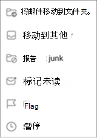
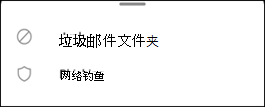
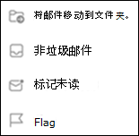

# 在 Exchange Online 中的 Outlook for iOS 和 Outlook for Android 中报告垃圾邮件和网络钓鱼电子邮件Report junk and phishing email in Outlook for iOS and Android in Exchange Online

[!INCLUDE [Microsoft 365 Defender rebranding](../includes/microsoft-defender-for-office.md)]

在使用 [混合新式身份验证](https://docs.microsoft.com/microsoft-365/enterprise/hybrid-modern-auth-overview)的 Exchange Online 或本地邮箱中具有邮箱的 Microsoft 365 组织中，您可以使用 Outlook for IOS 和 Outlook for Android 中的内置报告选项来提交误报 (良好的电子邮件，并将其标记为垃圾邮件) 、漏报 (错误的电子邮件) 并将网络钓鱼邮件发送到 Exchange Online PROTECTION (EOP) 。In Microsoft 365 organizations with mailboxes in Exchange Online or on-premises mailboxes using [hybrid modern authentication](https://docs.microsoft.com/microsoft-365/enterprise/hybrid-modern-auth-overview), you can use the built-in reporting options in Outlook for iOS and Android to submit false positives (good email marked as spam), false negatives (bad email allowed), and phishing messages to Exchange Online Protection (EOP).

## 在开始之前，您需要知道什么What do you need to know before you begin

- 如果您是具有 Exchange Online 邮箱的组织中的管理员，我们建议您在安全 & 合规性中心中使用提交门户。If you're an admin in an organization with Exchange Online mailboxes, we recommend that you use the Submissions portal in the Security & Compliance Center. 有关详细信息，请参阅 [使用管理员提交将可疑的垃圾邮件、网络钓鱼、url 和文件提交给 Microsoft](admin-submission.md)。For more information, see [Use Admin Submission to submit suspected spam, phish, URLs, and files to Microsoft](admin-submission.md).

- 您可以将报告的邮件配置为复制或重定向到您指定的邮箱。You can configure reported messages to be copied or redirected to a mailbox that you specify. 有关详细信息，请参阅 [用户提交策略](user-submission.md)。For more information, see [User Submissions policies](user-submission.md).

- 有关向 Microsoft 报告邮件的详细信息，请参阅 [将邮件和文件报告给 microsoft](report-junk-email-messages-to-microsoft.md)。For more information about reporting messages to Microsoft, see [Report messages and files to Microsoft](report-junk-email-messages-to-microsoft.md).

  > [!NOTE]
  > 如果在用户提交策略中禁用了 Outlook 的垃圾邮件报告功能，则垃圾邮件或仿冒邮件将移至 "垃圾邮件" 文件夹，而不会报告给您的管理员或 Microsoft。If junk email reporting is disabled for Outlook in the user submission policy, junk or phishing messages will be moved to the Junk folder and not reported to your admin or Microsoft.

## 在 Outlook for iOS 和 Outlook for Android 中报告垃圾邮件和网络钓鱼邮件Report spam and phishing messages in Outlook for iOS and Android

对于收件箱中的邮件，或除垃圾邮件以外的任何其他电子邮件文件夹，请使用以下步骤报告 iOS 和 Android 的垃圾邮件和网络钓鱼邮件：For messages in the Inbox, or any other email folder except Junk Email, use the following steps to report spam and phishing messages for iOS and Android:

1. 选择一个或多个邮件。Select one or more messages.
2. 在右上角点击三个垂直点。In the top-right corner tap on the three vertical dots. 将打开 "操作" 菜单。The action menu opens.

   

3. 点击 " **报告垃圾邮件** "，然后选择 " **垃圾邮件** 或 **网络钓鱼** "。Tap **Report junk** and then select **Junk** or **Phishing**.

   

4. 在出现的对话框中，可以选择 " **报告** " 或 " **无感谢** "。In the dialog that appears, you can choose **Report** or **No Thanks**. 如果选择 " **否** "，则如果你攻出了 **垃圾** 邮件，如果你点击了 "垃圾 **邮件" 文件夹** ，则会将邮件移动到 "已删除邮件" 文件夹。On selecting **No Thanks** , if you tapped **Junk** the message moves to the Junk Email folder, if you tapped **Phishing** the message moves to the Deleted Items folder. 选择 " **报告** "，同时将邮件的副本发送给 Microsoft。Select **Report** to also send a copy of the message to Microsoft.

   

如果你改变主意，请在出现的 toast 通知中选择 " **撤消** "。If you change your mind, select **Undo** on the toast notification that appears. 邮件将保留在 "收件箱" 文件夹中。The message remains in the Inbox folder.

## 从 Outlook for iOS 和 Outlook for Android 中的 "垃圾邮件" 文件夹报告非垃圾邮件Report non-spam messages from the Junk folder in Outlook for iOS and Android

在 "垃圾邮件" 文件夹中，使用以下步骤报告垃圾邮件误报：In the Junk folder, use the following steps to report spam false positives:

1. 选择一个或多个邮件。Select one or more messages.
2. 在右上角点击三个垂直点。In the top-right corner tap on the three vertical dots. 将打开 "操作" 菜单。The action menu opens.

   

3. 点击 " **非垃圾邮件** "。Tap **Not junk**.

出现 toast 通知，表明电子邮件已移动到您的收件箱。A toast notification appears that the email has moved to your Inbox. 如果你改变主意，请在 toast 通知上选择 " **撤消** "。If you change your mind, select **Undo** on the toast notification. 电子邮件仍保留在 "垃圾邮件" 文件夹中。The email remains in the Junk folder.
