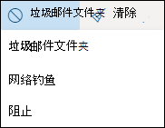
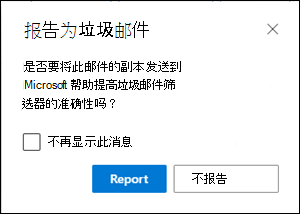
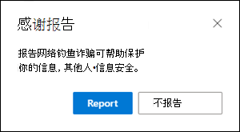
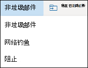
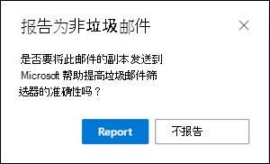

# <a name="report-junk-and-phishing-email-in-outlook-on-the-web-in-exchange-online"></a>在 Exchange Online 中的 Outlook 网页上报告垃圾邮件和仿冒电子邮件

[!INCLUDE [Microsoft 365 Defender rebranding](../includes/microsoft-defender-for-office.md)]


在 Exchange Online 中有邮箱的 Microsoft 365 组织中，您可以使用 Outlook Web App) 的 (web 上的内置报告选项来提交误报 (良好的电子邮件) 、漏报 (EOP 错误的电子邮件的) 和网络钓鱼邮件以 Exchange Online Protection () 。

## <a name="what-do-you-need-to-know-before-you-begin"></a>开始前，有必要了解什么？

- 如果您是具有 Exchange Online 邮箱的组织中的管理员，我们建议您在安全 & 合规性中心中使用提交门户。 有关详细信息，请参阅 [使用管理员提交将可疑的垃圾邮件、网络钓鱼、url 和文件提交给 Microsoft](admin-submission.md)。

- 管理员可以在 Outlook 网页版中禁用或启用用户将邮件报告给 Microsoft 的功能。 有关详细信息，请参阅本主题后面的在 [Outlook 网页版中禁用或启用垃圾邮件报告](#disable-or-enable-junk-email-reporting-in-outlook-on-the-web) 一节。

- 您可以将报告的邮件配置为复制或重定向到您指定的邮箱。 有关详细信息，请参阅 [用户提交策略](user-submission.md)。

- 有关向 Microsoft 报告邮件的详细信息，请参阅 [将邮件和文件报告给 microsoft](report-junk-email-messages-to-microsoft.md)。

## <a name="report-spam-and-phishing-messages-in-outlook-on-the-web"></a>在 Outlook 网页网络中报告垃圾邮件和网络钓鱼邮件

1. 对于收件箱中的邮件或除垃圾邮件以外的任何其他电子邮件文件夹中的邮件，请使用下列方法之一来报告垃圾邮件和网络钓鱼邮件：

   - 选择邮件，单击工具栏上的 " **垃圾** 邮件"，然后选择 " **垃圾** 邮件" 或 " **网络钓鱼**"。

     

   - 选择一个或多个邮件，单击鼠标右键，然后选择 " **标记为垃圾**邮件"。

2. 在出现的对话框中，单击 " **报告**"。 如果你改变主意，请单击 " **不报告**"。

   |可疑|网络钓鱼|
   |:---:|:---:|
   |||

3. 选定的邮件将发送给 Microsoft 进行分析。 若要确认已提交的邮件，请打开您的“已发送邮件”**** 文件夹查看已提交的邮件。

## <a name="report-non-spam-and-phishing-messages-from-the-junk-email-folder-in-outlook-on-the-web"></a>从 web 上的 Outlook 中的 "垃圾邮件" 文件夹报告非垃圾邮件和网络钓鱼邮件

1. 在 "垃圾邮件" 文件夹中，使用以下任一方法报告垃圾邮件误报或网络钓鱼邮件：

   - 选择邮件，单击工具栏上的 " **非垃圾** 邮件"，然后选择 " **不垃圾** 邮件" 或 " **网络钓鱼**"。

     

   - 选择一个或多个邮件，单击鼠标右键，然后选择 " **标记为非垃圾**邮件"。

2. 在出现的对话框中，阅读信息，然后单击 " **报告**"。 如果你改变主意，请单击 " **不报告**"。

   |非垃圾邮件|网络钓鱼|
   |:---:|:---:|
   |||

3. 选定的邮件将发送给 Microsoft 进行分析。 若要确认已提交的邮件，请打开您的“已发送邮件”**** 文件夹查看已提交的邮件。

## <a name="disable-or-enable-junk-email-reporting-in-outlook-on-the-web"></a>在 web 上的 Outlook 中禁用或启用垃圾电子邮件报告

默认情况下，用户可以在 web 上的 Outlook 中将垃圾邮件误报、漏报和网络钓鱼邮件报告给 Microsoft 进行分析。 管理员可以在 Exchange Online PowerShell 中对 web 邮箱策略配置 Outlook，以防止用户向 Microsoft 报告垃圾邮件误报和垃圾邮件漏报。 您无法禁用用户将网络钓鱼邮件报告给 Microsoft 的功能。

### <a name="what-do-you-need-to-know-before-you-begin"></a>开始前，有必要了解什么？

- 若要连接到 Exchange Online PowerShell，请参阅[连接到 Exchange Online PowerShell](https://docs.microsoft.com/powershell/exchange/connect-to-exchange-online-powershell)。

- 必须先分配有权限，然后才能执行这些过程。 特别是，您需要 Exchange Online 中的 **收件人策略** 或 **邮件收件人** 角色，默认情况下，这些角色分配给 **组织管理** 角色组和 **收件人管理** 角色组。 有关 Exchange Online 中的角色组的详细信息，请参阅 [Modify role groups In Exchange online](https://docs.microsoft.com/Exchange/permissions-exo/role-groups#modify-role-groups)。

- 每个组织都有一个名为 "Set-owamailboxpolicy" 的默认策略-默认值，但您可以创建自定义策略。 在默认策略之前，自定义策略将应用于作用域内的用户。 有关 Outlook 网页版邮箱策略的详细信息，请参阅 [Exchange Online 中的 "outlook on web 邮箱策略"](https://docs.microsoft.com/Exchange/clients-and-mobile-in-exchange-online/outlook-on-the-web/outlook-web-app-mailbox-policies)。

- 禁用垃圾邮件报告不会删除在 web 上的 Outlook 中将邮件标记为垃圾邮件或非垃圾邮件的功能。 在 "垃圾邮件" 文件夹中选择一封邮件，并单击 " **非垃圾**邮件" 并不是 \> **垃圾** 邮件仍将邮件移回收件箱。 选择任何其他电子邮件文件夹中的邮件并单击 " **垃圾** \> **邮件** " 仍会将邮件移至 "垃圾邮件" 文件夹。 不再可用的选项是将邮件报告给 Microsoft 的选项。

### <a name="use-exchange-online-powershell-to-disable-or-enable-junk-email-reporting-in-outlook-on-the-web"></a>使用 Exchange Online PowerShell 在 web 上的 Outlook 中禁用或启用垃圾电子邮件报告

1. 若要在 web 邮箱策略和 "垃圾邮件报告" 状态中查找您的现有 Outlook，请运行以下命令：

   ```powershell
   Get-OwaMailboxPolicy | Format-Table Name,ReportJunkEmailEnabled
   ```

2. 若要在 web 上的 Outlook 中禁用或启用垃圾邮件报告，请使用以下语法：

   ```powershell
   Set-OwaMailboxPolicy -Identity "<OWAMailboxPolicyName>" -ReportJunkEmailEnabled <$true | $false>
   ```

   本示例禁用默认策略中的垃圾邮件报告。

   ```powershell
   Set-OwaMailboxPolicy -Identity "OwaMailboxPolicy-Default" -ReportJunkEmailEnabled $false
   ```

   本示例在名为 Contoso 管理员的自定义策略中启用垃圾邮件报告。

   ```powershell
   Set-OwaMailboxPolicy -Identity "Contoso Managers" -ReportJunkEmailEnabled $true
   ```

有关语法和参数的详细信息，请参阅 [set-owamailboxpolicy](https://docs.microsoft.com/powershell/module/exchange/get-owamailboxpolicy) 和 [set-owamailboxpolicy](https://docs.microsoft.com/powershell/module/exchange/set-owamailboxpolicy)。

### <a name="how-do-you-know-this-worked"></a>如何判断是否生效？

若要验证您是否已成功启用或禁用 web 上的 Outlook 中的垃圾邮件报告功能，请执行以下任一步骤：

- 在 Exchange Online PowerShell 中，运行以下命令并验证 **ReportJunkEmailEnabled** 属性值：

  ```powershell
  Get-OwaMailboxPolicy | Format-Table Name,ReportJunkEmailEnabled
  ```

- 在 Outlook 网页上打开受影响用户的邮箱，在 "收件箱" 中选择一封邮件，单击 "**垃圾**邮件"， \> **Junk**并验证提示将邮件报告给 Microsoft 是不显示。<sup>\*</sup>

- 在 Outlook 网页上打开一个受影响的用户的邮箱，在 "垃圾邮件" 文件夹中选择一封邮件，单击 "**垃圾**邮件"， \> **Junk**并验证提示将该邮件报告给 Microsoft 是不显示。<sup>\*</sup>

<sup>\*</sup> 用户可以在仍报告邮件的同时隐藏报告邮件的提示。 若要在 Outlook 网页网络中检查此设置，请执行以下操作：

1. 单击**Settings**  \> **查看所有 Outlook 设置** \> **垃圾邮件**。
2. 在 " **报告** " 部分，验证值： " **发送报告前询问我**"。

   
