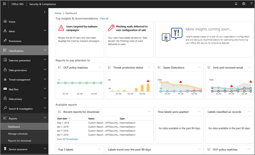

# 安全与合规中心内的智能报告和见解

[!INCLUDE [Microsoft 365 Defender rebranding](../includes/microsoft-defender-for-office.md)]

**适用对象**
- [Exchange Online Protection](exchange-online-protection-overview.md)
- [Microsoft Defender for Office 365 计划 1 和计划 2](defender-for-office-365.md)
- [Microsoft 365 Defender](../defender/microsoft-365-defender.md)

如果你是组织的 Microsoft 365 商业版安全团队的成员，并且拥有在安全 [&](permissions-in-the-security-and-compliance-center.md) 合规中心中分配的必要权限，可以访问各种报告，包括智能报告和见解。 阅读本文可大致了解这些报告和见解，以及在何处了解有关特定报告的信息。

## 智能报告和见解概述

安全与合规中心提供的监视功能&智能报告和见解，使合规性和安全管理员能够重点关注高优先级问题，如安全攻击或可疑活动增加。 在仪表板中，智能报表和见解类似于下图：

除了突出显示问题区域外，智能报告和见解还包括用于查看和浏览数据的建议和链接，以及快速操作。 例如，如果组织突然有大量电子邮件被最终用户标记为垃圾邮件，可能会建议你重新访问反垃圾邮件策略，以确保正确的保护级别已到位。

## 安全与合规中心&类型

安全与合规中心提供了各种&报告。  (转到 **ReportsSecurity** >  报告，获取一个全部视图。) 下表列出了可用的报告以及用于了解更多信息的链接：

|信息类型|如何到达那里|在何处了解更多信息|
|---|---|---|
|**安全&合规中心报告 (** 全部)  
 顶级见解和建议，以及指向安全与&报告的链接，包括数据丢失防护报告、标签、电子邮件安全报告、Defender for Office 365 报告等|在安全与&中心，转到"报告 **仪表板** \> **"**|[安全与合规中心中的报告](../../compliance/reports-in-security-and-compliance.md)|
|**数据丢失防护** 
 数据丢失防护策略匹配、误报和覆盖以及用于创建或编辑策略的链接|在安全&合规中心，转到 **"数据丢失防护策略** \> **"**|[查看数据丢失防护报告](../../compliance/view-the-dlp-reports.md)|
|**数据管理** 
 有关如何应用标签、分类为记录的标签、标签趋势等方面的信息|在安全与&中心，转到 **"信息治理仪表板** \> **"**|[查看数据管理报告](../../compliance/view-the-data-governance-reports.md)|
|**威胁管理** (也称为安全仪表板)  
 威胁检测、恶意软件趋势、主要目标用户、有关已发送和已接收电子邮件的详细信息等|在安全与&中心，转到 **漏洞管理** \> **仪表板**|[查看 Defender for Office 365](view-reports-for-mdo.md)|
|**资源管理器** (也称为威胁资源管理器) 或 **实时检测** 
 电子邮件和电子邮件中的文件中检测到的可疑Microsoft 365|在安全&中心，转到漏洞 **管理** \> **资源管理器** 或 **实时检测**  |[威胁资源管理器（或实时检测）](threat-explorer.md)|
|**Defender for Office 365 和电子邮件安全报告** 
 电子邮件安全和威胁防护报告 (包括恶意软件、垃圾邮件、网络钓鱼和欺骗报告) |在安全&合规中心，**转到"** > 报告 **""** 电子邮件&" > 电子邮件&**[协作报告"](https://security.microsoft.com/emailandcollabreport)**|[查看 Defender for Office 365](view-reports-for-mdo.md) 
 [查看安全与合规中心内的电子邮件安全报告](view-email-security-reports.md)|
|**邮件流** 
 已发送和已接收的电子邮件、最近的警报、主要发件人和收件人、电子邮件转发报告等相关信息|在安全与&中心， **转到"邮件** 流 \>" **"仪表板"** 和" **报告仪表板** \> **"**|[安全与合规中心内的邮件流见解](mail-flow-insights-v2.md) 
 [在安全与合规中心内查看&流报告](view-mail-flow-reports.md)|
|**GDPR 合规性** 
 有关 GDPR 合规性的信息，包括指向数据主体的链接、标签趋势和已关闭&活动|在安全与&中心，转到数据 **隐私** \> **GDPR 仪表板**|[一般数据保护条例摘要](/compliance/regulatory/gdpr)|
|**审核日志** 
 有关 Microsoft 365 活动、用户、文件或文件夹等的信息|在安全与&中心，转到"搜索& **调查 审核** \> **日志搜索"**|[在安全与合规中心内搜索审核日志](../../compliance/search-the-audit-log-in-security-and-compliance.md)。|
|**合规性报告** 
 FedRAMP 报告、管理、风险和合规性报告、ISO 信息安全管理报告以及 Service Organization Controls 审核和评估报告|在安全与&中心，转到" **服务保证** \> **合规性报告"**|[规划安全&合规性Office 365](../../compliance/plan-for-security-and-compliance.md)|

## 相关主题

[Microsoft 365 Defender 门户](../defender/microsoft-365-defender.md#the-microsoft-365-defender-portal)

[防范威胁Office 365](protect-against-threats.md)
