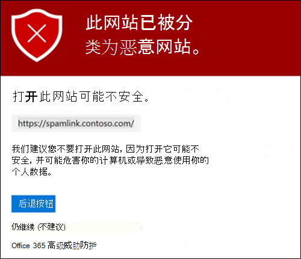
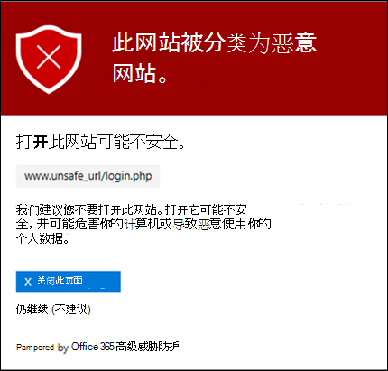
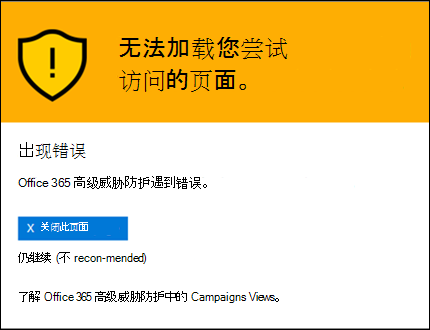

# 保险箱 Microsoft Defender for Office 365

[!INCLUDE [Microsoft 365 Defender rebranding](../includes/microsoft-defender-for-office.md)]

**适用对象**
- [Microsoft Defender for Office 365 计划 1 和计划 2](defender-for-office-365.md)
- [Microsoft 365 Defender](../defender/microsoft-365-defender.md)

> [!IMPORTANT]
> 本文适用于拥有 [Microsoft Defender for Office 365](defender-for-office-365.md)的企业客户。 如果你使用的是 Outlook.com、Microsoft 365 家庭版 或 Microsoft 365 个人版，并且正在查找有关 Outlook 中的安全链接的信息，请参阅高级[Outlook.com 安全](https://support.microsoft.com/office/882d2243-eab9-4545-a58a-b36fee4a46e2)。

保险箱 链接是[Office 365](defender-for-office-365.md) Defender 中的一项功能，它提供邮件流中入站电子邮件的 URL 扫描和重写，以及电子邮件和其他位置中 URL 和链接的单击验证时间。 保险箱 EOP 电子邮件中的入站电子邮件中执行常规反垃圾邮件和反恶意软件Exchange Online Protection (扫描) 。 安全链接扫描有助于保护组织免受网络钓鱼和其他攻击中使用的恶意链接的攻击。

在以下位置提供安全链接保护：

- 电子邮件：尽管没有默认的 保险箱 链接策略，但内置保护预设安全策略为未在自定义 保险箱 链接策略 (中定义的所有收件人 (提供 保险箱) 链接保护。 有关详细信息，请参阅[Preset security policies in EOP and Microsoft Defender for Office 365](preset-security-policies.md)。 您还可以创建适用于保险箱用户、组或域的链接策略。 有关说明，请参阅在[Microsoft Defender 保险箱设置链接策略Office 365。](set-up-safe-links-policies.md)

  有关电子邮件的链接保险箱保护功能，请参阅本文保险箱电子邮件的链接设置"部分。 
  
  > [!NOTE]
  > 保险箱链接对已启用邮件的公用文件夹不起作用。

- **Microsoft Teams**：对 Teams 对话、群组聊天或频道中的链接的安全链接保护也由安全链接策略控制。

  有关在 保险箱 链接Teams保护保险箱请参阅本文稍后介绍的 Microsoft Teams链接设置一节。

- **Office 365 应用**：在受支持的桌面、移动和 Web 应用中提供 Office 365 应用的安全链接保护。 在 **保险箱** 链接策略Office 365全局设置中为应用配置链接保险箱保护。  有关说明，请参阅在 Microsoft Defender 中为 保险箱[链接设置配置全局Office 365。](configure-global-settings-for-safe-links.md)

  Office 365 应用的安全链接保护应用于组织中获得 Defender for Office 365 许可的所有用户，无论用户是否包含在活动安全链接策略中。

  有关在 Office 365 应用中保险箱链接保护保险箱请参阅本文稍后介绍的 Office 365[应用](#safe-links-settings-for-office-365-apps)的链接设置部分。

本文包含以下类型链接保险箱详细说明：

- **设置链接** 保险箱：这些设置仅适用于特定策略中包含的用户，并且策略之间的设置可能不同。 这些设置包括：

  - [保险箱电子邮件的链接设置](#safe-links-settings-for-email-messages)
  - [保险箱链接设置Microsoft Teams](#safe-links-settings-for-microsoft-teams)
  - [链接策略中的"不重写保险箱 URL"](#do-not-rewrite-the-following-urls-lists-in-safe-links-policies)

- **全局保险箱链接设置**：这些设置是全局配置的，而不是在保险箱策略中配置的。 这些设置包括：

  - [保险箱应用的链接Office 365设置](#safe-links-settings-for-office-365-apps)
  - [链接的"阻止以下 URL"保险箱列表](#block-the-following-urls-list-for-safe-links)

下表介绍了 Microsoft 365 Microsoft 365 和 Office 365 组织中包含 Defender for Office 365 (的 保险箱 链接的方案，请注意，) 示例中永远不会出现缺少许可的问题。

 

****

|方案|结果|
|---|---|
|表示是市场营销部门的成员。 保险箱针对 Office 365 应用的链接保护在 保险箱 链接的全局设置中打开，并且存在适用于市场营销部门成员的 保险箱 链接策略。 在电子邮件PowerPoint打开一个演示文稿，然后单击演示文稿中的 URL。|百分之百受链接保险箱保护。 
 该链接策略中包含 保险箱，保险箱应用的链接Office 365保护已打开。 
 有关 Office 365 应用中 保险箱 链接保护的要求，请参阅本文稍后介绍的 保险箱 链接Office 365[部分](#safe-links-settings-for-office-365-apps)。|
|Chris 的Microsoft 365 E5未配置保险箱链接策略。 Chris 从外部发件人收到一封电子邮件，其中包含他最终单击的恶意网站的 URL。|Chris 不受链接保险箱保护。 
 管理员必须至少为任何人创建一保险箱链接策略，才能在入站电子邮件保险箱链接保护。 Chris 必须包含在策略条件中，才能保险箱链接保护。|
|在 Pat 的组织中，管理员尚未创建任何保险箱链接策略，保险箱应用的链接Office 365保护已打开。 Pat 打开 Word 文档并单击该文件中的 URL。|Pat 不受链接保险箱保护。 
 尽管保险箱应用的链接保护Office 365全局打开，但 Pat 未包含在任何活动的 保险箱 Links 策略中，因此无法应用保护。|
|In Lee's organization， `https://tailspintoys.com` is configured in the **Block the following URLs** list in the global settings for 保险箱 Links. 一保险箱包含 Lee 的"链接"策略已存在。 Lee 收到一封包含 URL 的电子邮件 `https://tailspintoys.com/aboutus/trythispage` 。 Lee 单击 URL。|可能为 Lee 自动阻止 URL;这取决于列表中的 URL 条目和所使用的电子邮件客户端 Lee。 有关详细信息，请参阅本文稍后介绍的"阻止以下[URL"保险箱链接](#block-the-following-urls-list-for-safe-links)"一节。|
|Jamie 和 Julia 都负责 contoso.com。 在很长一段时间之前，管理员保险箱适用于 Jamie 和 Julia 的链接策略。 Jamie 向 Julia 发送了一封电子邮件，但不知道该电子邮件包含恶意 URL。|如果适用于 Julia 保险箱的链接保险箱策略配置为应用于内部收件人之间的邮件，则"Julia"受"链接"保护。 有关详细信息，请参阅本文保险箱[电子邮件](#safe-links-settings-for-email-messages)的链接设置部分。|
|

## 保险箱电子邮件的链接设置

安全链接会扫描传入电子邮件中已知的恶意超链接。 扫描的 URL 使用 Microsoft 标准 URL 前缀重写 `https://nam01.safelinks.protection.outlook.com` ：。 重写链接后，会对其进行分析，以查找潜在的恶意内容。

在保险箱链接重写 URL 之后，即使手动将邮件转发或答复给内部和外部收件人， ( URL 仍) 。 不会重写添加到转发或答复邮件的其他链接。 但是，在收件箱规则或SMTP 转发自动转发的情况下，不会在发送给最终收件人的邮件中重写 URL，除非该收件人还受 保险箱 链接保护，或者 URL 已在以前的通信中重写。 只要启用保险箱，URL 就仍将在传递之前扫描，而不管是否已重写它们。 在 Outlook 桌面版 16.0.12513 或更高版本中单击时，客户端 API 对 保险箱 链接的未包 URL 仍将进行检查。

以下列表保险箱电子邮件的链接策略中的设置：

- **选择邮件中未知潜在** 恶意 URL 的操作：启用或禁用保险箱电子邮件中的链接扫描。 建议的值是 **On**。 打开此设置会导致以下操作。

  - 保险箱在 Outlook (C2R) 启用链接Windows。
  - 当单击邮件中的 URL 时，URL 将被重写保险箱链接保护进行路由。
  - 单击后，将针对已知恶意 URL 列表和"阻止以下 URL"列表检查[URL。](#block-the-following-urls-list-for-safe-links)
  - 没有有效信誉的 URL 将在后台异步触发。

- **对指向文件的** 可疑链接应用实时 URL 扫描：启用链接（包括指向可下载内容的电子邮件中的链接）实时扫描。 建议的值已启用。
  - **等待 URL 扫描完成，然后再传递邮件**：
    - 已启用：包含 URL 的邮件将一直进行，直到扫描完成。 仅在确认 URL 是安全的之后，才传递邮件。 这是建议的值。
    - 已禁用：如果 URL 扫描无法完成，无论如何传递邮件。

- **Apply 保险箱 Links to email messages sent within the organization**： Enables or disables 保险箱 Links scanning on messages sent between internal senders and internal recipients within the same Exchange Online organization. 建议的值已启用。

- **Do not track user clicks**： Enables or disables storing 保险箱 Links click data for URLs clicked in email messages. 建议的值是保持此设置未选择 (跟踪用户单击) 。

  目前不支持在内部发件人和内部收件人之间发送的电子邮件中的链接的 URL 单击跟踪。

- **不允许用户单击到原始 URL：** 允许或阻止用户通过警告 [页面](#warning-pages-from-safe-links) 单击到原始 URL。 推荐值已启用。

- **在通知和警告页面上** 显示组织品牌：此选项在警告页面上显示组织的品牌。 品牌打造可帮助用户识别合法警告，因为默认 Microsoft 警告页面经常被攻击者使用。 有关自定义品牌打造详细信息，请参阅[自定义Microsoft 365自定义自定义主题](../../admin/setup/customize-your-organization-theme.md)。

- **不要重写以下 URL：** 保留 URL。 保留不需要扫描的安全 URL 的自定义列表。 该列表对于每个链接策略保险箱唯一。 有关不重写以下 **URL** 列表的信息，请参阅本文稍后的"保险箱 [链接策略"](#do-not-rewrite-the-following-urls-lists-in-safe-links-policies)一节中的"不重写以下 URL"列表。

  有关链接策略的标准策略和严格策略设置的建议值保险箱，请参阅保险箱[链接策略设置。](recommended-settings-for-eop-and-office365.md#safe-links-policy-settings)

- **不要重写 URL，请仅通过 SafeLinks API** 进行检查：如果启用此设置，则不发生 URL 换行。 保险箱链接在支持 URL 的客户端单击 URL 时Outlook以独占方式调用。 建议值已禁用。
  
- **收件人** 筛选器：需要指定确定策略适用的收件人条件和例外。 可以将这些属性用于条件和例外：
  - **收件人为**
  - **收件人域为**
  - **收件人为以下组的成员**

  一次只能使用一个条件或例外，但条件或例外可以包含多个值。 同一个条件或例外的多个值使用“或”逻辑（例如，_\<recipient1\>_ 或 _\<recipient2\>_）。 不同的条件或例外使用“和”逻辑（例如，_\<recipient1\>_ 和 _\<member of group 1\>_）。

- **优先级**：如果创建多个策略，可以指定策略的应用顺序。 没有两个策略可以具有相同的优先级，并且在应用第一个策略之后，策略处理将停止。

  有关优先级顺序以及如何评估和应用多个策略的详细信息，请参阅[电子邮件保护的顺序和优先级](how-policies-and-protections-are-combined.md)。
  
### 保险箱链接在电子邮件中的工作方式

在高级别上，下面将保险箱链接保护如何作用于电子邮件中的 URL：

1. 所有电子邮件均通过 EOP，其中 Internet 协议 (IP) 和信封筛选器、基于签名的恶意软件保护、反垃圾邮件和反恶意软件筛选器在邮件传递到收件人邮箱之前。

2. 用户在邮箱中打开邮件，并单击邮件中的 URL。

3. 保险箱链接在打开网站之前立即检查 URL：

   - 如果 URL 包含在"阻止以下 **URL"** 列表中，将打开 [阻止的 URL](#blocked-url-warning) 警告。

   - 如果 URL 指向已确定为恶意的网站，将打开恶意 (或其他警告) 页面。

   - 如果 URL 指向可下载的文件，并且适用于用户的策略中启用了"对指向文件的可疑链接和链接应用实时 **URL** 扫描"设置，则选中可下载的文件。

   - 如果确定 URL 是安全的，将打开网站。

## 保险箱链接设置Microsoft Teams

在链接策略中保险箱或禁用Microsoft Teams链接保险箱保护。 具体来说，使用"**选择用于未知或潜在** 恶意 URL 的操作"设置Microsoft Teams URL。 建议的值是 **On**。

> [!NOTE]
> 当你打开或关闭保险箱链接保护Teams，可能需要 24 小时更改才能生效。

电子邮件中保险箱的链接策略中的以下设置也适用于电子邮件中Teams：

- **对指向文件的可疑链接应用实时 URL 扫描**
- **不跟踪用户单击**
- **不允许用户单击至初始 URL**

这些设置之前在电子邮件保险箱[链接设置中进行了介绍](#safe-links-settings-for-email-messages)。

为 Microsoft Teams 启用 保险箱 链接保护后，当受保护的用户单击 (单击链接时，将针对已知恶意链接列表检查 Teams 中的 URL) 。 不重写 URL。 如果发现链接是恶意链接，用户将具有以下体验：

- 如果在对话、群组Teams或频道中单击了链接，则以下屏幕截图中显示的警告页面将显示在默认 Web 浏览器中。
- 如果从固定选项卡单击了链接，则警告页面将显示在该选项卡Teams的"页面"界面中。出于安全考虑，禁用在 Web 浏览器中打开链接的选项。
- 根据配置策略中的"不允许用户单击到原始 **URL"** 设置，用户将允许或不允许单击到原始 URL (继续 (屏幕截图) 中不建议) 。  我们建议您启用"不允许用户单击访问原始 **URL"** 设置，以便用户无法单击到原始 URL。

如果发送链接的用户未包括在启用了 Teams 保护的 保险箱 链接策略中，则用户可以随意单击访问其计算机或设备上的原始 URL。

单击 **警告页面上的"** 返回"按钮将用户返回到其原始上下文或 URL 位置。 但是，再次单击原始链接将导致保险箱链接重新扫描 URL，因此警告页面将重新出现。

### 链接保险箱中的工作原理Teams

在高级别上，下面保险箱链接保护如何作用于网站中的MICROSOFT TEAMS：

1. 用户启动Teams应用。

2. Microsoft 365验证用户组织是否包含适用于 Office 365 的 Microsoft Defender，以及该用户是否包含在启用了 Microsoft Teams 保护的活动 保险箱 链接策略中。

3. 在用户单击聊天、群聊、频道和选项卡时验证 URL。

## 保险箱应用的链接Office 365设置

保险箱 Office 365 应用的链接保护会检查 Office 文档中的链接，而不是电子邮件 (但可以在打开) 后检查电子邮件中附加的 Office 文档中的链接。

保险箱应用的链接Office 365具有以下客户端要求：

- Microsoft 365 应用版 或 Microsoft 365 商业高级版。
  - Word、Excel 和 PowerPoint、Windows 或 Web 浏览器中的当前版本。
  - Office iOS 或 Android 设备上的应用。
  - Visio Windows。
  - OneNote Web 浏览器中显示。

- Office 365应用配置为使用新式验证。 有关详细信息，请参阅新式验证如何适用于[Office 2013、Office 2016 和 Office 2019 客户端应用](../../enterprise/modern-auth-for-office-2013-and-2016.md)。

- 用户使用工作或学校帐户登录。 有关详细信息，请参阅登录[Office。](https://support.microsoft.com/office/b9582171-fd1f-4284-9846-bdd72bb28426)

你可以保险箱链接的全局Office 365（而不是在"链接"策略中）为保险箱应用配置保险箱保护。 保护适用于组织中获得 Defender for Office 365 许可的所有用户，而不管这些用户是否包含在活动的 保险箱 链接策略中。

以下保险箱链接设置可用于Office 365应用：

- **Office 365应用程序**：启用或禁用保险箱应用中的链接Office 365扫描。 默认值和推荐值为 **On。**

- Do **not track when users click 保险箱 Links**： Enables or disables storing 保险箱 Links click data for URLs clicked in the desktop versions Word， Excel， PowerPoint， and Visio. 建议值为 **Off**，这意味着将跟踪用户点击量。

- 不允许用户单击指向原始 URL 的安全链接：允许或阻止用户通过警告页面单击 Word、Excel、PowerPoint 和 Visio 桌面版中的原始 **URL。** 默认值和推荐值为 **On。**

若要为应用保险箱链接Office 365，请参阅为 Office 365 应用配置保险箱[链接保护](configure-global-settings-for-safe-links.md#configure-safe-links-protection-for-office-365-apps-in-the-microsoft-365-defender-portal)。

有关"标准"和"严格"策略设置的建议值详细信息，请参阅全局设置["保险箱链接"。](recommended-settings-for-eop-and-office365.md#global-settings-for-safe-links)

### 链接保险箱在应用中Office 365的工作原理

在高级别上，下面将保险箱链接保护如何作用于应用中Office 365 URL。 上Office 365介绍了受支持的应用。

1. 用户在组织中使用工作或学校帐户登录，包括Microsoft 365 应用版或Microsoft 365 商业高级版。

2. 用户打开并单击支持文档中Office文档的链接Office 应用。

3. 保险箱链接在打开目标网站之前立即检查 URL：

   - 如果 URL 包含在跳过链接扫描列表保险箱阻止 (阻止的 URL) 将打开阻止[的 URL 警告](#blocked-url-warning)页。

   - 如果 URL 指向已确定为恶意的网站，将打开恶意 (或其他警告) 页面。

   - 如果 URL 指向可下载文件，并且适用于用户的 保险箱 链接策略配置为扫描指向可下载内容的链接 (应用实时 **URL** 扫描，以找到指向文件) 的可疑链接和链接，则检查可下载文件。

   - 如果 URL 被视为安全 URL，则用户将访问网站。

   - 如果保险箱链接扫描无法完成，保险箱链接保护不会触发。 在Office客户端中，在用户继续访问目标网站之前，将警告用户。

> [!NOTE]
> 在每个会话开始时，可能需要几秒钟来验证用户是否已启用保险箱链接Office。

## 链接的"阻止以下 URL"保险箱列表

"**阻止以下 URL"** 列表定义始终被以下位置保险箱链接扫描阻止的链接：

- 电子邮件。
- Office 365和 Mac Windows应用中的文档。
- 适用于 iOS Office Android 的文档中。

当活动应用中的用户单击保险箱链接策略单击受支持的应用中的阻止链接时，他们会访问阻止[的 URL 警告](#blocked-url-warning)页面。

您可以在全局设置中为"链接"配置保险箱列表。 有关说明，请参阅 [配置"阻止以下 URL"列表](configure-global-settings-for-safe-links.md#configure-the-block-the-following-urls-list-in-the-microsoft-365-defender-portal)。

**注意**：

- 有关被阻止的 URL 的真正通用列表，请参阅管理 [租户允许/阻止列表](tenant-allow-block-list.md)。
- 阻止以下 **URL 列表** 的限制：
  - 最大条目数为 500。
  - 条目的最大长度为 128 个字符。
  - 所有条目不能超过 10，000 个字符。
- 不要在 URL 末尾添加 `/` () 斜杠。 例如，使用 `https://www.contoso.com` ，而不是 `https://www.contoso.com/` 。
- 例如或 (仅域 URL) 将阻止 `contoso.com` `tailspintoys.com` 包含该域的任何 URL。
- 可以阻止子域，但不阻止整个域。 例如，阻止包含子域的任何 URL，但不阻止包含完整域 `toys.contoso.com*` 的 `contoso.com` URL。
- 每个 URL 条目可以包含最多三 () `*` 通配符。

### "阻止以下 URL"列表的条目语法

下表介绍了您可以输入的值及其结果的示例：

 

****

|值|结果|
|---|---|
|`contoso.com` 
 或 
 `*contoso.com*`|阻止域、子域和路径。 例如， `https://www.contoso.com` `https://sub.contoso.com` 、 和 `https://contoso.com/abc` 被阻止。|
|`https://contoso.com/a`|阻止 `https://contoso.com/a` 但不阻止其他子路径（如 `https://contoso.com/a/b` ）。|
|`https://contoso.com/a*`|块 `https://contoso.com/a` 和其他子路径（如 `https://contoso.com/a/b` ）。|
|`https://toys.contoso.com*`|阻止子域 (`toys` 此示例中) 但允许单击其他域 URL， (或 `https://contoso.com` `https://home.contoso.com`) 。|
|

## 链接策略中的"不重写保险箱 URL"

> [!NOTE]
> 如果组织使用保险箱链接策略，则不重写以下 **URL** 列表是第三方网络钓鱼测试唯一受支持的方法。

每个保险箱链接策略都包含一个"不重写以下 URL"列表，您可以使用该列表指定未由"链接"扫描保险箱 URL。 换句话说，该列表允许策略中包含的用户访问指定的 URL，否则，这些 URL 将被链接保险箱阻止。 可以在不同的链接策略中配置保险箱列表。 策略处理在应用策略的第一 (可能停止，) 策略的最高优先级。 因此，只有一个"不重写以下 **URL"** 列表应用于包含多个活动"链接"策略保险箱用户。

若要将条目添加到新列表或现有链接保险箱，请参阅 Create 保险箱 Links [policies](set-up-safe-links-policies.md#use-the-microsoft-365-defender-portal-to-create-safe-links-policies)或[Modify 保险箱 Links policies](set-up-safe-links-policies.md#use-the-microsoft-365-defender-portal-to-modify-safe-links-policies)。

**注意**：

- 以下客户端无法识别"不重写链接"策略中的保险箱 URL 列表。 根据以下客户端中链接扫描的结果，可阻止包含在保险箱中的用户访问 URL：
  - Microsoft Teams
  - Office Web 应用

  有关任何地方允许的 URL 的真正通用列表，请参阅 [管理租户允许/阻止列表](tenant-allow-block-list.md)。 但是请注意，添加的 URL 不会从保险箱链接重写中排除，因为必须在"链接"策略中保险箱 URL。

- 请考虑将常用的内部 URL 添加到列表中，以改进用户体验。 例如，如果你有本地服务（如 Skype for Business 或 SharePoint，可以添加这些 URL 以将其从扫描中排除。
- 如果"链接"**策略** 中已经有"不重写保险箱 URL 条目，请务必查看列表并根据需要添加通配符。 例如，你的列表有一个类似 的条目 `https://contoso.com/a` ，你稍后决定包括子路径（如 `https://contoso.com/a/b` ）。 不要添加新条目，而是向现有条目添加通配符，以便它成为 `https://contoso.com/a/*` 。
- 每个 URL 条目可以包含最多三 () `*` 通配符。 通配符明确包括前缀或子域。 例如，条目与 不同，因为允许用户访问指定域中的子域 `contoso.com` `*.contoso.com/*` `*.contoso.com/*` 和路径。
- 如果 URL 使用 HTTP 到 HTTPS (例如 302 重定向到) ，并且您尝试为列表中的同一 URL 输入 HTTP 和 HTTPS 条目，您可能会注意到第二个 URL 条目将替换第一 `http://www.contoso.com` 个 URL 条目。 `https://www.contoso.com` 如果 URL 的 HTTP 和 HTTPS 版本是完全独立的，则不会发生此行为。
- 不要指定 http:// 或 https:// (，即 contoso.com) HTTP 和 HTTPS 版本。
- `*.contoso.com`不包括 contoso.com，因此您需要同时排除这两者，以涵盖指定域和任何子域。
- `contoso.com/*`**仅** contoso.com，因此无需同时排除 和 `contoso.com` `contoso.com/*` ; `contoso.com/*` 只需满足。
- 若要排除域的所有迭代，需要两个排除项; `contoso.com/*` 和 `*.contoso.com/*` 。 它们组合在一起可排除 HTTP 和 HTTPS、主域 contoso.com 和任何子域，以及任何或不终止部分 (例如，contoso.com 和 contoso.com/vdir1 都涵盖在) 中。

### "不重写以下 URL"列表的条目语法

下表介绍了您可以输入的值及其结果的示例：

 

****

|值|结果|
|---|---|
|`contoso.com`|允许访问 `https://contoso.com` 子域或路径，但不能访问子域或路径。|
|`*.contoso.com/*`|允许访问域、子域和路径 (例如、 `https://www.contoso.com` `https://www.contoso.com` 或 `https://maps.contoso.com` `https://www.contoso.com/a`) 。 
 此条目本质上优于 ，因为它不允许潜在的欺诈网站 `*contoso.com*` ，如 `https://www.falsecontoso.com` 或 `https://www.false.contoso.completelyfalse.com`|
|`https://contoso.com/a`|允许访问 `https://contoso.com/a` ，但不允许访问子路径（如 ） `https://contoso.com/a/b`|
|`https://contoso.com/a/*`|允许访问 `https://contoso.com/a` 和子路径，如 `https://contoso.com/a/b`|
|

## 链接中的保险箱页

本节包含单击 URL 时由链接保险箱触发的各种警告页面的示例。

请注意，已更新多个警告页面。 如果还没有看到更新的页面，你很快就会看到。 更新的页面包括新的配色方案、更多详细信息，以及即使给定警告和建议，仍可以继续访问网站。

### 扫描正在进行通知

单击的 URL 正由链接保险箱扫描。 在再次尝试链接之前，可能需要等待片刻。

原始通知页面如下所示：

### 可疑邮件警告

单击的 URL 位于类似于其他可疑邮件的电子邮件中。 我们建议您在继续网站之前仔细检查电子邮件。

### 网络钓鱼尝试警告

单击的 URL 位于已标识为网络钓鱼攻击的电子邮件中。 因此，电子邮件中所有 URL 都将被阻止。 建议您不要继续访问该网站。

### 恶意网站警告

单击的 URL 指向已标识为恶意的网站。 建议您不要继续访问该网站。

原始警告页面如下所示：

### 阻止的 URL 警告

单击的 URL 已被您组织的管理员手动阻止 ("链接") 全局设置中的"阻止以下 URL"保险箱 URL。 链接未由链接保险箱，因为它已被手动阻止。

管理员手动阻止特定 URL 的原因有多种。 如果认为不应阻止网站，请与管理员联系。

原始警告页面如下所示：

### 错误警告

发生了某种错误，无法打开 URL。

原始警告页面如下所示：

