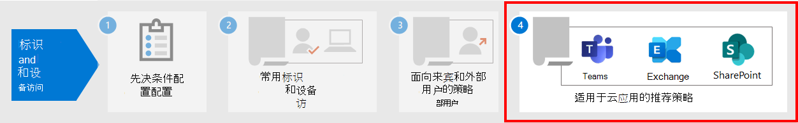

# <a name="policy-recommendations-for-securing-email"></a>用于保护电子邮件的策略建议

**适用对象**
- [Exchange Online Protection](exchange-online-protection-overview.md)
- [Microsoft Defender for Office 365 计划 1 和计划 2](defender-for-office-365.md)

本文介绍如何实施推荐的零信任标识和设备访问策略，以保护支持新式身份验证和条件访问的组织电子邮件和电子邮件客户端。 本指南基于通用 [标识和设备](identity-access-policies.md) 访问策略，还包含一些其他建议。

这些建议基于三种不同的安全和保护层，这些层可以基于你的需求粒度应用：起始点、企业和 **专用安全**。   You can learn more about these security tiers, and the recommended client operating systems, referenced by these recommendations in the [recommended security policies and configurations introduction](microsoft-365-policies-configurations.md).

这些建议要求用户使用新式电子邮件客户端，Outlook适用于 iOS 和 Android 的客户端。 Outlook for iOS 和 Android 的移动设备支持 Office 365。 这些Outlook应用还构建了支持移动使用的管理功能，并与其他 Microsoft 云安全性功能协同工作。 有关详细信息，请参阅适用于[iOS Outlook Android 常见问题解答](/exchange/clients-and-mobile-in-exchange-online/outlook-for-ios-and-android/outlook-for-ios-and-android-faq)。

## <a name="update-common-policies-to-include-email"></a>更新常见策略以包括电子邮件

为了保护电子邮件，下图说明了从通用标识和设备访问策略更新的策略。

:::image type="content" source="../../media/microsoft-365-policies-configurations/identity-access-ruleset-mail.png" alt-text="用于保护对应用程序的访问权限的策略更新Exchange。" lightbox="../../media/microsoft-365-policies-configurations/identity-access-ruleset-mail.png":::

请注意添加用于阻止 ActiveSync Exchange Online的新策略。 这将强制使用移动Outlook。

如果在设置Exchange Online策略Outlook策略作用域中包含了策略和策略，则只需创建新策略以阻止 ActiveSync 客户端。 查看下表中列出的策略，并添加建议的策略，或确认已包含这些策略。 每个策略链接到常见标识和设备访问策略中的 [关联配置说明](identity-access-policies.md)。

|保护级别|策略|更多信息|
|---|---|---|
|**起点**|[当登录风险为中或高 *时需要* MFA](identity-access-policies.md#require-mfa-based-on-sign-in-risk)|将Exchange Online包括在云应用的分配中|
||[阻止不支持新式身份验证的客户端](identity-access-policies.md#block-clients-that-dont-support-multi-factor)|将Exchange Online包括在云应用的分配中|
||[应用 APP 数据保护策略](identity-access-policies.md#apply-app-data-protection-policies)|请确保Outlook包含在应用列表中。 请务必为 iOS、Android 和 (平台更新Windows) |
||[需要批准的应用和应用保护](identity-access-policies.md#require-approved-apps-and-app-protection)|将Exchange Online包括在云应用列表中|
||[阻止 ActiveSync 客户端](#block-activesync-clients)|添加新策略|
|企业|[登录风险低、中或高 *时需要* MFA](identity-access-policies.md#require-mfa-based-on-sign-in-risk)|将Exchange Online包括在云应用的分配中|
||[要求兼容电脑 *和* 移动设备](identity-access-policies.md#require-compliant-pcs-and-mobile-devices)|将Exchange Online包括在云应用列表中|
|**专用安全**|[*始终* 需要 MFA](identity-access-policies.md#require-mfa-based-on-sign-in-risk)|将Exchange Online包括在云应用的分配中|
|

## <a name="block-activesync-clients"></a>阻止 ActiveSync 客户端

此策略阻止 ActiveSync 客户端绕过其他条件访问策略。 策略配置仅适用于 ActiveSync 客户端。 通过选择 **["需要应用保护策略"，](/azure/active-directory/conditional-access/concept-conditional-access-grant#require-app-protection-policy)** 此策略将阻止 ActiveSync 客户端。 有关创建此策略的详细信息，请参阅使用条件访问要求 [云应用访问的应用保护策略](/azure/active-directory/conditional-access/app-protection-based-conditional-access)。

- 按照方案[1：Office 365](/azure/active-directory/conditional-access/app-protection-based-conditional-access#scenario-1-office-365-apps-require-approved-apps-with-app-protection-policies)应用需要具有应用保护策略的已批准应用（可防止利用基本身份验证的 Exchange ActiveSync 客户端连接到）中的"步骤 2：使用 ActiveSync (EAS) 为 Exchange Online 配置 Azure AD 条件访问策略"Exchange Online。

您还可以使用身份验证策略禁用 [基本身份验证](/exchange/clients-and-mobile-in-exchange-online/disable-basic-authentication-in-exchange-online)，这将强制所有客户端访问请求使用新式验证。

## <a name="limit-access-to-exchange-online-from-outlook-on-the-web"></a>限制对Exchange Online Outlook 网页版

你可以限制用户在非托管设备上从Outlook 网页版附件。 这些设备上的用户可以使用 Office Online 查看和编辑这些文件，而无需泄露和存储设备上的文件。 还可以阻止用户在非托管设备上查看附件。

步骤如下：

1. [连接远程 PowerShell 会话Exchange Online远程 PowerShell 会话](/powershell/exchange/exchange-online/connect-to-exchange-online-powershell/connect-to-exchange-online-powershell)。
2. 如果还没有 OWA 邮箱策略，则使用 [New-OwaMailboxPolicy](/powershell/module/exchange/new-owamailboxpolicy) cmdlet 创建一个。
3. 如果要允许查看附件但不允许下载，请使用以下命令：

   ```powershell
   Set-OwaMailboxPolicy -Identity Default -ConditionalAccessPolicy ReadOnly
   ```

4. 如果要阻止附件，请使用此命令：

   ```powershell
   Set-OwaMailboxPolicy -Identity Default -ConditionalAccessPolicy ReadOnlyPlusAttachmentsBlocked
   ```

5. 在 Azure 门户中，使用这些设置创建新的条件访问策略：

   **工作分配** \>**用户和组**：选择要包括和排除的适当用户和组。

   **工作分配** \>**云应用或操作** \>**云应用** \>**Include** \>**选择应用**：**选择Office 365 Exchange Online**

   **访问控制** \>**会话**：**选择"使用应用强制的限制"**

## <a name="require-that-ios-and-android-devices-must-use-outlook"></a>要求 iOS 和 Android 设备必须使用Outlook

若要确保 iOS 和 Android 设备的用户只能使用 Outlook for iOS 和 Android 访问工作或学校内容，你需要一个面向这些潜在用户的条件访问策略。

请参阅使用适用于 iOS 和 Android 的 Outlook 管理邮件[协作访问中配置此策略的步骤](/mem/intune/apps/app-configuration-policies-outlook#apply-conditional-access)。

## <a name="set-up-message-encryption"></a>设置邮件加密

借助 OME Office 365 邮件加密 (OME) 功能（利用 Azure 信息保护中的保护功能）你的组织可以轻松地与任何设备上的任何用户共享受保护的电子邮件。 用户可以与其他 Microsoft 365 组织以及使用 Outlook.com、Gmail 和其他电子邮件服务的非客户一起发送和接收受保护的邮件。

有关详细信息，请参阅设置[新的Office 365 邮件加密功能](../../compliance/set-up-new-message-encryption-capabilities.md)。

## <a name="next-steps"></a>后续步骤



为：配置条件访问策略：

- [Microsoft Teams](teams-access-policies.md)
- [SharePoint](sharepoint-file-access-policies.md)
