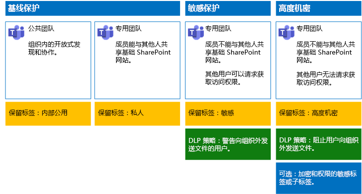

# 保护 Microsoft Teams 中的文件

本文为如何在 Microsoft Teams 中配置团队及其基础 SharePoint 网站以实现通过轻松协作权衡安全性的文件保护提供了相关建议。 本文定义了四个不同的配置，首先介绍的是具有最开放的共享策略的组织内的公共网站。 每个额外配置均表示有意义的保护设置，但对 Teams 中存储的文件的访问和协作限定为一组相关团队成员。 使用这些建议作为起点并调整配置，以满足组织的需求。

本文中的配置符合 Microsoft 针对数据、标识和设备的三层保护的建议：

- 基线保护

- 敏感保护

- 高度机密保护

有关这些保护层以及针对每层建议的功能的详细信息，请参阅以下资源。

- [Office 365 的标识和设备保护](https://docs.microsoft.com/office365/enterprise/microsoft-cloud-it-architecture-resources#identity-and-device-protection-for-office-365)

- [Office 365 中的文件保护解决方案](https://docs.microsoft.com/office365/enterprise/microsoft-cloud-it-architecture-resources#file-protection-solutions-in-office-365)

## 功能概述

针对各种 Microsoft 365 功能的受保护团队网站绘制的建议。 下图显示了建议配置。

如图所示：

- 基线保护同时包括公共团队和私人团队。 组织中的任何人均可发现和访问公共团队。 只有团队成员可以发现和访问私人团队。 这两种配置均允许共享基础 SharePoint 网站（这些网站上的文件存储在团队组之外）。

- 有关敏感和高度机密保护的团队是私人团队，在这些团队中，对基础网站的共享和访问请求受到限制。

- [保留标签](../../compliance/labels.md)提供了一种对基础 SharePoint 网站内的文件进行分类的方法。 每个基础 SharePoint 网站均被配置为使用默认保留标签自动标记文档库中的文件。 与四个团队配置相对应，此示例中的标签分别为内部公开、私人、敏感和高度机密。 用户可以更改单个文件中的标签，但此配置可确保所有文件均接收默认的标签。

- 为敏感和高度机密保留标签配置[数据丢失防护](../../compliance/data-loss-prevention-policies.md) (DLP) 策略，在其试图向组织外部发送这些类型的文件时警告或阻止用户。

- 如果方案需要，可以使用[敏感度标签](../../compliance/sensitivity-labels.md)来通过加密和权限来保护高度机密文件。 对于 Azure 信息保护客户，你可以在 Microsoft 365 合规中心内使用 Azure 信息保护标签。如果你选择执行其他配置或高级配置，这些标签便会与 Azure 门户同步。 Azure 信息保护标签和 Office 365 敏感度标签彼此完全相互兼容。 也就是说，例如，如果内容已有 Azure 信息保护标签，无需重新对此内容进行分类或标记。 并非所有客户都需要这一级别的保护。

## SharePoint 和 OneDrive 的全组织设置

SharePoint 和 OneDrive 包括影响所有网站和用户的组织范围内设置。 其中一些设置也可在网站级别进行调整，使其更具有（而不是更不具有）限制性。 本部分讨论影响安全性和协作的租户范围内设置。

### 共享

对于此解决方案，建议使用以下组织范围内设置：

- 保留允许所有与所有帐户类型共享（包括匿名共享）的默认共享策略。

- 如果需要，请将匿名链接设置为过期。

- 将共享的默认链接类型更改为“内部”。 这有助于防止数据意外泄露到组织外部。

虽然允许外部共享可能看起来有悖常理，但相较于通过电子邮件发送文件，此方法可更好地控制文件共享。 SharePoint 和 Outlook 彼此协作，提供安全的文件协作。

- 默认情况下，Outlook 共享文件链接，而不是通过电子邮件发送文件。

- SharePoint 和 OneDrive 可轻松实现与组织内外部的参与者共享文件链接

用户还可进行控制，帮助管理外部共享。 例如，你能够：

- 禁用匿名来宾链接。

- 撤销用户对网站的访问权限。

- 查看谁有权访问特定网站或文档。

- 将匿名共享链接设置为过期（租户设置）。

- 限制可与之共享的组织外部用户（租户设置）。

### 配合使用外部共享与数据丢失预防 (DLP)

如果不允许外部共享，则有业务需求的用户需要寻找备用工具和方法。Microsoft 建议结合使用外部共享和 DLP 策略来保护敏感和高度机密的文件。

### 设备访问设置

SharePoint 和 OneDrive 的设备访问设置可确定是否已将访问权限限制为仅限浏览器（不能下载文件）或访问被阻止。 有关详细信息，请参阅[控制非托管设备的访问](https://docs.microsoft.com/sharepoint/control-access-from-unmanaged-devices)。

若要在 Azure Active Directory 中使用具有推荐条件访问策略的设备访问设置，请参阅[用于保护 SharePoint 网站和文件的策略建议](https://docs.microsoft.com/microsoft-365/enterprise/sharepoint-file-access-policies)。

访问这些设置，确定是否要更改 OneDrive 网站的默认设置。 目前，共享和设备访问设置与 SharePoint 管理中心重复，并适用于这两个环境。

## 团队和 SharePoint 网站配置

下表总结了本文前面所述的每个团队及其基础 SharePoint 网站的配置。 使用这些配置作为起点建议并调整网站类型和配置，以满足组织的需求。 不是每个组织都需要每种类型的团队。 只有少许组织需要具有高度机密保护的团队。

||||||
|:-----|:-----|:-----|:-----|:-----|
||**基线保护 #1**|**基线保护 #2**|**敏感保护**|**高度机密**|
|Description|在组织内公开发现和协作的公共团队。|在组外允许共享基础 SharePoint 网站的私人团队。|私人团队，但仅允许网站成员共享基础 SharePoint 网站。 DLP 在用户试图向组织外发送文件时警告用户。|私人团队，其中包含文件加密的敏感标签和浏览文件的权限。 DLP 阻止用户向组织外发送文件。|
|专用或公用团队网站|公用|Private|Private|Private|
|谁可以访问？|组织中的每个人（包括 B2B 用户）。|仅限网站成员。 其他人可以请求访问。|仅限团队成员。 其他人可以请求访问团队所有者批准的基础网站。|仅限成员。 其他人无法请求访问基础网站。|
|网站级共享控制|允许与任何人共享。默认设置。|允许与任何人共享。默认设置。|成员无法共享对网站的访问权限。   非成员可请求访问网站，但需要由团队的组所有者来处理这些请求。|成员无法共享对网站的访问权限。   非成员无法请求访问网站或其内容。|
|网站级别的设备访问控制|无任何额外控制。|无任何额外控制。|防止用户将文件下载到不符合或未加入域的设备。使所有其他设备仅限浏览器访问。|阻止将文件下载到不符合或未加入域的设备。|
|保留标签|内部公用|Private|敏感|高度机密|
|DLP 策略|||在用户向组织外发送标记为“敏感”的文件时进行警告。   要阻止外部共享敏感数据类型，如信用卡号或其他个人数据，可以针对这些数据类型（包括所配置的自定义数据类型）配置其他 DLP 策略。|阻止用户向组织外发送标记为“高度机密”的文件。允许用户通过提供他们与之共享的对象等理由来替代此行为。|
|敏感度标签||||使用敏感度标签加密文件和授予对文件的权限。 此保护一直伴随文件，以防它们从基础 SharePoint 网站泄漏。|

有关在此解决方案中部署四种不同团队的步骤，请参阅[部署团队以实现文件的三层保护](deploy-teams-three-tiers.md)。

## Office 365 保留标签

对于具有敏感数据的环境，建议使用保留标签。 在配置和发布保留标签后：

- 可将默认标签应用于团队的基础 SharePoint 网站中的文档库，以便团队“文件”**** 部分中的所有文档都获取默认标签。

- 只要标签与特定条件匹配，就可以将其自动应用到内容。

- 你可以应用基于保留标签的 DLP 策略。

- 组织中的人员可以将标签手动应用于 Outlook 网页版、Outlook 2010 及更高版本、OneDrive、SharePoint 和 Office 365 组中的内容。 用户通常知道他们正在使用的内容类型，以便对其进行分类并应用适当的 DLP 策略。

如图所示，此解决方案包括创建以下保留标签：

- 高度机密

- 敏感

- Private

- 内部公用

这些标签均映射到本文前述插图和图表中建议的网站。本解决方案建议配置 DLP 策略，以帮助防止泄露标记为“敏感”和“高度机密”的文件。

有关在此解决方案中配置保留标签和 DLP 策略的步骤，请参阅[通过保留标签和 DLP 保护团队中的文件](deploy-teams-retention-DLP.md)。

## 敏感度标签

如果你的安全方案需要保护，则可以使用敏感度标签应用与文件如影随形的保护。 Microsoft 365 合规中心内的敏感度标签与 Azure 信息保护标签是相同的。 对于此解决方案，建议使用灵敏度标签或子标签来加密需要最高安全性级别保护的文件，并授予对这些文件的权限。

有关详细信息，请参阅[敏感度标签概述](../../compliance/sensitivity-labels.md)。

有关在此解决方案中配置灵敏度标签的步骤，请参阅[使用灵敏度标签保护团队中的文件](deploy-teams-sensitivity-labels.md)。

## 另请参阅

[云应用和混合解决方案](https://docs.microsoft.com/office365/enterprise/cloud-adoption-and-hybrid-solutions)
