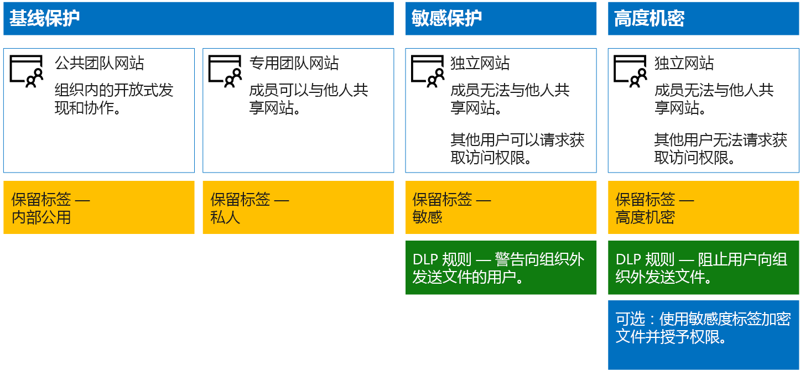

# 保护 SharePoint Online 网站和文件Secure SharePoint Online sites and files

本文就如何配置 SharePoint Online 团队网站并在平衡安全性与易于协作的同时如何进行文件保护方面提供了相关建议。本文定义了四个不同的配置，首先是具有最开放共享策略的组织内的公共网站。每个额外配置均表示一个有意义的保护设置，但对资源的访问和协作被限定为一组相关用户。以这些建议为出发点，并调整配置以满足组织的需要。This article provides recommendations for configuring SharePoint Online team sites and file protection that balances security with ease of collaboration. This article defines four different configurations, starting with a public site within your organization with the most open sharing policies. Each additional configuration represents a meaningful step up in protection, but the ability to access and collaborate on resources is reduced to the relevant set of users. Use these recommendations as a starting point and adjust the configurations to meet the needs of your organization.

本文中的配置符合 Microsoft 针对数据、标识和设备的三层保护的建议：The configurations in this article align with Microsoft's recommendations for three tiers of protection for data, identities, and devices:

- 基线保护Baseline protection

- 敏感保护Sensitive protection

- 高度机密保护Highly confidential protection

有关这些保护层以及针对每层建议的功能的详细信息，请参阅以下资源。For more information about these tiers and capabilities recommended for each tier, see the following resources.

- [Office 365 的标识和设备保护Identity and Device Protection for Office 365](https://docs.microsoft.com/office365/enterprise/microsoft-cloud-it-architecture-resources#identity-and-device-protection-for-office-365)

- [Office 365 中的文件保护解决方案File Protection Solutions in Office 365](https://docs.microsoft.com/office365/enterprise/microsoft-cloud-it-architecture-resources#file-protection-solutions-in-office-365)

## 功能概述Capability overview

针对各种 Microsoft 365 功能的 SharePoint Online 团队网站绘制的建议。Recommendations for SharePoint Online team sites draw on a variety of Microsoft 365 capabilities. 下图显示了针对四个 SharePoint Online 团队网站的建议配置。The following illustration shows the recommended configurations for four SharePoint Online team sites.

如图所示：As illustrated:

- 基线保护包含针对 SharePoint Online 团队网站的两个选项 - 公共网站和专用网站。 组织中的任何人均可发现和访问公共网站。 只有网站成员可以发现和访问专用网站。 这两个网站配置均允许组外共享。Baseline protection includes two options for SharePoint Online team sites — a public site and private site. Public sites can be discovered and accessed by anybody in the organization. Private sites can only be discovered and accessed by members of the site. Both of these site configurations allow for sharing outside the group.

- 敏感保护和高度机密的保护的网站是专用网站，只有特定组的成员才具有相关访问权限。Sites for sensitive and highly confidential protection are private sites with access limited only to members of specific groups.

- [保留标签](../../compliance/labels.md)提供了一种对网站内的文件进行分类的方法。[Retention labels](../../compliance/labels.md) provide a way to classify files within the sites. 每个 SharePoint Online 团队网站均被配置为使用网站的默认保留标签自动标记文档库中的文件。Each of the SharePoint Online team sites are configured to automatically label files in document libraries with a default retention label for the site. 与四个网站配置相对应，此示例中的标签分别为内部公开、专用、敏感和高度机密。Corresponding to the four site configurations, the labels in this example are Internal Public, Private, Sensitive, and Highly Confidential. 用户可以更改标签，但此配置可确保所有文件均接收默认的标签。Users can change the labels, but this configuration ensures all files receive a default label.

- 为敏感和高度机密保留标签配置[数据丢失防护](../../compliance/data-loss-prevention-policies.md) (DLP) 策略，在其试图向组织外部发送这些类型的文件时警告或阻止用户。[Data loss prevention](../../compliance/data-loss-prevention-policies.md) (DLP) policies are configured for the Sensitive and Highly Confidential retention labels to either warn or prevent users when they attempt to send these types of files outside the organization.

- 如果方案需要，可以使用[敏感度标签](../../compliance/sensitivity-labels.md)来通过加密和权限来保护高度机密文件。If needed for your scenario, you can use [sensitivity labels](../../compliance/sensitivity-labels.md) to protect highly confidential files with encryption and permissions. 对于 Azure 信息保护客户，你可以在 Microsoft 365 合规中心内使用 Azure 信息保护标签。如果你选择执行其他配置或高级配置，这些标签便会与 Azure 门户同步。For Azure Information Protection customers, you can use your Azure Information Protection labels in the Microsoft 365 compliance center, and your labels will be synced with the Azure portal in case you choose to perform additional or advanced configuration. Azure 信息保护标签和 Office 365 敏感度标签彼此完全相互兼容。Azure Information Protection labels and Office 365 sensitivity labels are fully compatible with each other. 也就是说，例如，如果内容已有 Azure 信息保护标签，无需重新对此内容进行分类或标记。This means, for example, if you have content labeled by Azure Information Protection, you won't need to reclassify or relabel your content. 并非所有客户都需要这一级别的保护。Not all customers need this level of protection.

## SharePoint Online 和 OneDrive for Business 的租户范围内设置Tenant-wide settings for SharePoint Online and OneDrive for Business

SharePoint Online 和 OneDrive for Business 包括影响所有网站和用户的租户范围内设置。 其中一些设置也可在网站级别进行调整，使其更具有（而不是更不具有）限制性。 本部分讨论影响安全性和协作的租户范围内设置。SharePoint Online and OneDrive for Business include tenant-wide settings that affect all sites and users. Some of these settings can also be adjusted at the site level to be more restrictive (but not less). This section discusses tenant-wide settings that affect security and collaboration.

### 共享Sharing

对于此解决方案，建议使用以下租户范围内设置：For this solution, we recommend the following tenant-wide settings:

- 保留允许所有与所有帐户类型共享（包括匿名共享）的默认共享策略。Keep the default sharing policy that allows all sharing with all account types, including anonymous sharing.

- 如果需要，请将匿名链接设置为过期。Set anonymous links to expire, if desired.

- 将共享的默认链接类型更改为“内部”。 这有助于防止数据意外泄露到组织外部。Change the default link type for sharing to Internal. This helps prevent accidental data leakage outside your organization.

虽然允许外部共享可能看起来有悖常理，但相较于通过电子邮件发送文件，此方法可更好地控制文件共享。 SharePoint Online 和 Outlook 彼此协作，提供安全的文件协作。While it might seem counterintuitive to allow external sharing, this approach provides more control over file sharing compared to sending files in email. SharePoint Online and Outlook work together to provide secure collaboration on files.

- 默认情况下，Outlook 共享文件链接，而不是通过电子邮件发送文件。By default, Outlook shares a link to a file instead of sending the file in email.

- SharePoint Online 和 OneDrive for Business 可轻松实现与组织内外部的参与者共享文件链接SharePoint Online and OneDrive for Business make it easy to share links to files with contributors who are both inside and outside your organization

用户还可进行控制，帮助管理外部共享。 例如，你能够：You also have controls to help govern external sharing. For example, you can:

- 禁用匿名来宾链接。Disable an anonymous guest link.

- 撤销用户对网站的访问权限。Revoke user access to a site.

- 查看谁有权访问特定网站或文档。See who has access to a specific site or document.

- 将匿名共享链接设置为过期（租户设置）。Set anonymous sharing links to expire (tenant setting).

- 限制可与之共享的组织外部用户（租户设置）。Limit who can share outside your organization (tenant setting).

### 配合使用外部共享与数据丢失预防 (DLP)Use external sharing together with data loss prevention (DLP)

如果不允许外部共享，则有业务需求的用户需要寻找备用工具和方法。Microsoft 建议结合使用外部共享和 DLP 策略来保护敏感和高度机密的文件。If you don't allow external sharing, users with a business need will find alternate tools and methods. Microsoft recommends you combine external sharing with DLP policies to protect sensitive and highly confidential files.

### 设备访问设置Device access settings

SharePoint Online 和 OneDrive for Business 的设备访问设置可确定是否已将访问权限限制为仅限浏览器（不能下载文件）或访问被阻止。Device access settings for SharePoint Online and OneDrive for Business let you determine whether access is limited to browser only (files can't be downloaded) or if access is blocked. 有关详细信息，请参阅[控制非托管设备的访问](https://docs.microsoft.com/sharepoint/control-access-from-unmanaged-devices)。For more information, see [Control access from unmanaged devices](https://docs.microsoft.com/sharepoint/control-access-from-unmanaged-devices).

若要在 Azure Active Directory 中使用具有推荐条件访问策略的设备访问设置，请参阅[用于保护 SharePoint 网站和文件的策略建议](https://docs.microsoft.com/microsoft-365/enterprise/sharepoint-file-access-policies)。To use device access settings with recommended conditional access policies in Azure Active Directory, see [Policy recommendations for securing SharePoint sites and files](https://docs.microsoft.com/microsoft-365/enterprise/sharepoint-file-access-policies).

### OneDrive for BusinessOneDrive for Business

访问这些设置，确定是否要更改 OneDrive for Business 网站的默认设置。目前，共享和设备访问设置与 SharePoint Online 管理中心重复，并适用于这两个环境。Visit these settings to decide if you want to change the default settings for OneDrive for Business sites. Currently, the sharing and device access settings are duplicated from the SharePoint Online admin center and apply to both environments.

## SharePoint 团队网站配置SharePoint team site configuration

下表总结了本文前面所述的每个团队网站的配置。使用这些配置作为起点建议并调整网站类型和配置，以满足组织的需求。不是每个组织都需要每种类型的网站。只有少许组织需要高度机密的保护。The following table summarizes the configuration for each of the team sites described earlier in this article. Use these configurations as starting point recommendations and adjust the site types and configurations to meet the needs of your organization. Not every organization needs every type of site. Only a small number of organizations require highly confidential protection.

||||||
|:-----|:-----|:-----|:-----|:-----|
||**基线保护 #1****Baseline protection #1**|**基线保护 #2****Baseline protection #2**|**敏感保护****Sensitive protection**|**高度机密****Highly confidential**|
|描述Description|组织内的开放式发现和协作。Open discovery and collaboration within the organization.|允许在组外部共享的专用网站和组。Private site and group with sharing allowed outside the group.|仅允许网站成员进行共享的专用网站。DLP 在用户试图向组织外发送文件时警告用户。Private site with sharing allowed only to members of the site. DLP warns users when attempting to send files outside the organization.|具有敏感标签的专用网站和文件加密及权限。Private site and file encryption and permissions with sensitivity labels. DLP 阻止用户向组织外发送文件。DLP prevents users from sending files outside the organization.|
|专用或公用团队网站Private or public team site|公用Public|PrivatePrivate|PrivatePrivate|PrivatePrivate|
|谁可以访问？Who has access?|组织中的任何人，包括 B2B 用户和来宾用户。Everybody in the organization, including B2B users and guest users.|仅限网站成员。其他人可以请求访问。Members of the site only. Others can request access.|仅限网站成员。其他人可以请求访问。Members of the site only. Others can request access.|仅限成员。其他人无法请求访问。Members only. Others cannot request access.|
|网站级共享控制Site-level sharing controls|允许与任何人共享。默认设置。Sharing allowed with anybody. Default settings.|允许与任何人共享。默认设置。Sharing allowed with anybody. Default settings.|成员无法共享对网站的访问权限。Members cannot share access to the site.   非成员可以请求访问该网站，但需要由网站管理员对这些请求进行寻址。Non-members can request access to the site, but these requests need to be addressed by a site administrator.|成员无法共享对网站的访问权限。Members cannot share access to the site.   非成员无法请求访问网站或内容。Non-members cannot request access to the site or contents.|
|网站级别的设备访问控制Site-level device access controls|无任何额外控制。No additional controls.|无任何额外控制。No additional controls.|防止用户将文件下载到不符合或未加入域的设备。使所有其他设备仅限浏览器访问。Prevents users from downloading files to non-compliant or non-domain joined devices. This allows browser-only access from all other devices.|阻止将文件下载到不符合或未加入域的设备。Block downloading of files to non-compliant or non-domain joined devices.|
|保留标签Retention labels|内部公用Internal Public|PrivatePrivate|敏感Sensitive|高度机密Highly Confidential|
|DLP 策略DLP policies|||在用户向组织外发送标记为“敏感”的文件时进行警告。Warn users when sending files that are labeled as Sensitive outside the organization.   要阻止外部共享敏感数据类型，如信用卡号或其他个人数据，可以针对这些数据类型（包括所配置的自定义数据类型）配置其他 DLP 策略。To block external sharing of sensitive data types, such as credit card numbers or other personal data, you can configure additional DLP policies for these data types (including custom data types you configure).|阻止用户向组织外发送标记为“高度机密”的文件。允许用户通过提供他们与之共享的对象等理由来替代此行为。Block users from sending files that are labeled as highly confidential outside organization. Allow users to override this by providing justification, including who they are sharing the file with.|
|敏感度标签Sensitivity labels||||使用敏感度标签自动加密和授予文件权限。Use sensitivity labels to automatically encrypt and grant permissions to files. 此保护将始终伴随文件，以防其泄露。This protection travels with the files in case they are leaked.   Office 365 无法读取使用敏感度标签加密的文件。Office 365 cannot read files encrypted with sensitivity labels. 此外，DLP 策略只适用于元数据（包括标签），但并不适用于这些文件的内容（如文件内的信用卡号）。Additionally, DLP policies can only work with the metadata (including labels) but not the contents of these files (such as credit card numbers within files).|

有关如何部署此解决方案中四种不同类型的 SharePoint Online 团队网站的步骤，请参阅[部署具有三层保护的 SharePoint Online 网站](../../compliance/deploy-sharepoint-online-sites-for-three-tiers-of-protection.md)。For the steps to deploy the four different types of SharePoint Online team sites in this solution, see [Deploy SharePoint Online sites for three tiers of protection](../../compliance/deploy-sharepoint-online-sites-for-three-tiers-of-protection.md).

## Office 365 保留标签Office 365 retention labels

对于具有敏感和高度机密数据的环境，建议使用保留标签。Using retention labels is recommended for environments with sensitive and highly confidential data. 在配置和发布保留标签后：After you configure and publish retention labels:

- 可以将默认标签应用于 SharePoint Online 团队网站中的文档库，以便该库中的所有文档都能获取默认标签。You can apply a default label to a document library in a SharePoint Online team site, so that all documents in that library get the default label.

- 只要标签与特定条件匹配，就可以将其自动应用到内容。You can apply labels to content automatically if it matches specific conditions.

- 你可以应用基于保留标签的 DLP 策略。You can apply DLP policies that are based on retention labels.

- 组织中的用户可手动将标签应用于 Outlook 网页版、Outlook 2010 及更高版本、OneDrive for Business、SharePoint Online 以及 Office 365 组。用户通常都很了解他们处理的内容类型，以便可以对其进行分类并应用相应的 DLP 策略。People in your organization can apply a label manually to content in Outlook on the web, Outlook 2010 and later, OneDrive for Business, SharePoint Online, and Office 365 groups. Users often know best what type of content they're working with, so they can classify it and have the appropriate DLP policy applied.

如图所示，此解决方案包括创建以下保留标签：As illustrated, this solution includes creating the following retention labels:

- 高度机密Highly Confidential

- 敏感Sensitive

- PrivatePrivate

- 内部公用Internal Public

这些标签均映射到本文前述插图和图表中建议的网站。本解决方案建议配置 DLP 策略，以帮助防止泄露标记为“敏感”和“高度机密”的文件。These labels are mapped to the recommended sites in the illustrations and charts earlier in this article. This solution recommends configuring DLP policies to help prevent the leakage of files labeled as Sensitive and Highly Confidential.

有关在此解决方案中配置保留标签和 DLP 策略的步骤，请参阅[使用保留标签和 DLP 保护 SharePoint Online文件](../../compliance/protect-sharepoint-online-files-with-office-365-labels-and-dlp.md)。For the steps to configure retention labels and DLP policies in this solution, see [Protect SharePoint Online files with retention labels and DLP](../../compliance/protect-sharepoint-online-files-with-office-365-labels-and-dlp.md).

## 敏感度标签Sensitivity labels

如果你的安全方案需要保护，则可以使用敏感度标签应用与文件如影随形的保护。If warranted for your security scenario, you can use sensitivity labels to apply protections that follow the files wherever they go. Microsoft 365 合规中心内的敏感度标签与 Azure 信息保护标签是相同的。Sensitivity labels in the Microsoft 365 compliance center and Azure Information Protection labels are the same. 对于此解决方案，建议使用敏感度标签或高度机密敏感度标签的子标签来加密需要最高级别安全性保护的文件并授予相应权限。For this solution, we recommend you use a sensitivity label or a sub-label of the Highly Confidential sensitivity label to encrypt and grant permissions to files that need to be protected with the highest level of security.

请注意，将敏感度标签加密应用于 Office 365 中存储的文件时，该服务无法处理这些文件的内容。Be aware that when sensitivity label encryption is applied to files stored in Office 365, the service cannot process the contents of these files. 共同创作、电子数据展示、搜索、Delve 和其他协作功能将无法正常使用。Co-authoring, eDiscovery, search, Delve, and other collaborative features do not work. DLP 策略只适用于元数据（包括保留标签），但并不适用于这些文件的内容（如文件内的信用卡号）。DLP policies can only work with the metadata (including retention labels) but not the contents of these files (such as credit card numbers within files).

有关详细信息，请参阅[敏感度标签概述](../../compliance/sensitivity-labels.md)。For more information, see [Overview of sensitivity labels](../../compliance/sensitivity-labels.md).

### 为外部用户添加权限Adding permissions for external users

可通过两种方式授予使用敏感度标签进行保护的文件的外部用户访问权限。There are two ways you can grant external users access to files protected with a sensitivity label. 在这两种情况下，外部用户均须具有 Azure AD 帐户。In both these cases, external users must have an Azure AD account. 如果外部用户不是使用 Azure AD 的组织的成员，他们可以通过使用此注册页面以个人身份获得 Azure AD 帐户：[https://aka.ms/aip-signup](https://aka.ms/aip-signup)。If external users aren't members of an organization that uses Azure AD, they can obtain an Azure AD account as an individual by using this sign-up page: [https://aka.ms/aip-signup](https://aka.ms/aip-signup).

- 将外部用户添加到用于配置标签保护的 Azure AD 组Add external users to an Azure AD group that is used to configure protection for a label

  你需要先将该帐户作为 B2B 用户添加到目录中。[通过 Azure 权限管理缓存组成员资格](https://docs.microsoft.com/information-protection/plan-design/prepare)可能需要几个小时的时间。使用此方法，可将权限授予使用标签保护的所有现有文件（甚至在将用户添加到 Azure AD 组之前受保护的文件）。You'll need to first add the account as a B2B user in your directory. It can take a couple of hours for [group membership caching by Azure Rights Management](https://docs.microsoft.com/information-protection/plan-design/prepare). With this method, permissions are granted to all existing files protected with the label (even files protected before a user is added to the Azure AD group).

- 将外部用户直接添加到标签保护Add external users directly to the label protection

  你可以添加组织（例如 Fabrikam.com）、Azure AD 组（如组织内的财务组）中的所有用户或单个用户。例如，可以将监管机构的外部团队添加到标签保护中。使用此方法，可仅向在外部实体添加到保护后使用标签进行保护的文件授予权限。You can add all users from an organization (e.g. Fabrikam.com), an Azure AD group (such as a finance group within an organization), or an individual user. For example, you can add an external team of regulators to the protection for a label. With this method, permissions are granted only to files protected with the label after the external entity is added to the protection.

### 部署和使用敏感度标签Deploying and using a sensitivity label

有关在此解决方案中配置敏感度标签的步骤，请参阅[使用敏感度标签保护 SharePoint Online 文件](../../compliance/protect-sharepoint-online-files-with-sensitivity-label.md)。For the steps to configure a sensitivity label in this solution, see [Protect SharePoint Online files with a sensitivity label](../../compliance/protect-sharepoint-online-files-with-sensitivity-label.md).

## 后续步骤Next step

通过[在开发/测试环境中保护 SharePoint Online 网站](secure-sharepoint-online-sites-in-a-dev-test-environment.md)将此项作为概念证明进行构建。Build this out as a proof-of-concept with [Secure SharePoint Online sites in a dev/test environment](secure-sharepoint-online-sites-in-a-dev-test-environment.md).

## 另请参阅See Also

[Microsoft 针对政治宣传活动、非营利组织和其他敏捷性组织的安全指南Microsoft Security Guidance for Political Campaigns, Nonprofits, and Other Agile Organizations](microsoft-security-guidance-for-political-campaigns-nonprofits-and-other-agile-o.md)

[云应用和混合解决方案Cloud adoption and hybrid solutions](https://docs.microsoft.com/office365/enterprise/cloud-adoption-and-hybrid-solutions)
