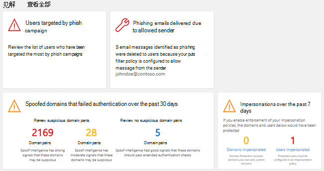
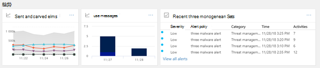

# 安全与合规中心&仪表板

[!INCLUDE [Microsoft 365 Defender rebranding](../includes/microsoft-defender-for-office.md)]

## 基本函数以及如何打开安全仪表板

组织&安全与 <https://protection.office.com> 合规中心管理数据保护和合规性。 假设您具有必要的权限，则安全仪表板使您能够查看威胁防护状态，以及查看安全警报并采取行动。

观看视频获取概述，然后阅读本文了解更多信息。

> [!VIDEO https://www.microsoft.com/videoplayer/embed/RE1VV3o]

根据组织的订阅内容，安全仪表板包括几个小组件，如威胁管理摘要、威胁防护状态、全球每周威胁检测、恶意软件等，如以下部分所述。

若要查看安全与合规中心内的安全&，请转到"威胁管理仪表板 \> **"。** 若要直接转到安全仪表板，请使用 <https://protection.office.com/searchandinvestigation/dashboard> 。

> [!NOTE]
> 您必须是全局管理员、安全管理员或安全读者才能查看安全仪表板。 某些小组件需要其他权限才能查看。 若要了解更多信息，请参阅 [安全与合规&中的权限](permissions-in-the-security-and-compliance-center.md)[。

## 威胁管理摘要

通过"威胁管理摘要"小组件，你可以一目了然地了解在过去七年 7 天内，组织如何 (威胁) 保护。

你将在威胁管理摘要中看到的信息取决于你的订阅包括哪些内容。 下表介绍了包括哪些信息用于Office 365 E3 Office 365 E5。

 

****

|Office 365 E3|Office 365 E5|
|---|---|
|恶意软件邮件被阻止 已阻止钓鱼邮件 用户报告的邮件    |恶意软件邮件被阻止 已阻止钓鱼邮件 用户报告的邮件 零日恶意软件被阻止 检测到高级钓鱼邮件 阻止恶意 URL|
|

若要查看或访问"威胁管理摘要"小组件，你必须有权查看适用于报告Office 365 Defender。 若要了解更多信息，请参阅查看 Defender for Office 365[报告需要哪些权限？。](view-reports-for-mdo.md#what-permissions-are-needed-to-view-the-defender-for-office-365-reports)

## 威胁防护状态

"威胁防护状态"小部件通过网络钓鱼和恶意软件的趋势和详细视图显示威胁防护有效性。

详细信息取决于你的 Microsoft 365 订阅是否Exchange Online Protection (EOP) [Microsoft Defender for Office 365。](defender-for-office-365.md) 

 

****

|如果你的订阅包括...|你将看到这些详细信息|
|---|---|
|EOP，但不是 Microsoft Defender for Office 365|EOP 检测到并阻止的恶意电子邮件。
 请参阅[威胁防护状态报告 (EOP) 。 ](view-email-security-reports.md#threat-protection-status-report)|
|Microsoft Defender for Office 365|EOP 和 Defender 检测并阻止恶意内容和恶意Office 365 
 具有反恶意软件引擎阻止的恶意内容、零时差自动清除和 Defender的 Office 365 功能 (包括[保险箱 Links、保险箱](safe-links.md) [Attachments](safe-attachments.md)和[Office 365) ](set-up-anti-phishing-policies.md#exclusive-settings-in-anti-phishing-policies-in-microsoft-defender-for-office-365)中的反钓鱼功能的唯一电子邮件的聚合计数。 
 请参阅 [威胁防护状态报告](view-reports-for-mdo.md#threat-protection-status-report)。|
|

若要查看或访问"威胁防护状态"小组件，你必须有权查看 Defender 才能查看Office 365报告。 若要了解更多信息，请参阅查看 Defender for Office 365[报告需要哪些权限？](view-reports-for-mdo.md#what-permissions-are-needed-to-view-the-defender-for-office-365-reports)

## 全球每周威胁检测

"全球每周威胁检测"小组件显示在过去七年 7 天内，电子邮件中检测到 (威胁) 数。

按照下表所述计算指标：

 

****

|跃点数|计算方式|
|---|---|
|扫描的邮件|扫描的电子邮件数乘以收件人数|
|威胁已停止|标识为包含恶意软件的电子邮件数乘以收件人数|
|被[Defender 阻止Office 365](defender-for-office-365.md)|Defender 阻止的电子邮件数量Office 365数乘以收件人数|
|在传递后删除|ZAP (0 [小时 ](zero-hour-auto-purge.md) 自动清除) 邮件数乘以收件人数|
|

## 恶意软件

恶意软件小部件显示过去七年 7 天内恶意软件趋势和恶意软件系列 (7) 详细信息。

## 见解

Insights不仅应查看关键问题，还包括要考虑的建议和操作。

例如，您可能看到正在传递网络钓鱼电子邮件，因为某些用户已禁用其垃圾邮件选项。 若要详细了解见解如何工作，请参阅安全与合规中心中的& [和见解](reports-and-insights-in-security-and-compliance.md)。

## 威胁调查和响应

如果你的组织订阅包含 Microsoft [Defender for Office 365计划 2，](office-365-ti.md)你的安全仪表板有一个包含高级威胁调查和响应工具的部分。 这些工具包括 [自动调查和响应功能](automated-investigation-response-office.md)。 自动调查和响应在诸如快速解决受损用户帐户等情况下 [很有用](address-compromised-users-quickly.md)。

若要了解更多信息，请参阅 Office 365 中的自动调查和响应 ([AIR) 入门](office-365-air.md)。

## 趋势

安全仪表板底部附近是"趋势 **"部分，** 其中总结了组织的电子邮件流趋势。 报告提供有关分类为垃圾邮件、恶意软件、网络钓鱼尝试和良好电子邮件的电子邮件的信息。 单击磁贴以查看报告中的更多详细信息。

此外，如果你组织的订阅包含[适用于 Office 365 计划 2](office-365-ti.md)的 Defender，则本部分中还将提供"最近使用的威胁管理警报"报告，使安全团队可以查看高优先级安全警报并采取措施。

若要查看或访问"已发送和已接收电子邮件"小组件，你必须有权查看 Defender 才能查看Office 365报告。 若要了解更多信息，请参阅查看 Defender for Office 365[报告需要哪些权限？。](view-reports-for-mdo.md#what-permissions-are-needed-to-view-the-defender-for-office-365-reports)

若要查看或访问"最近的威胁管理警报"小组件，您必须具有查看警报的权限。 若要了解更多信息，请参阅 [查看警报所需的 RBAC 权限](../../compliance/alert-policies.md#rbac-permissions-required-to-view-alerts)。

## 相关文章

[查看安全与合规中心内的电子邮件安全报告](view-email-security-reports.md)

[查看 Microsoft Defender for Office 365](view-reports-for-mdo.md)

[Defender for Office 365](defender-for-office-365.md)

[Office 365威胁调查和响应](office-365-ti.md)
