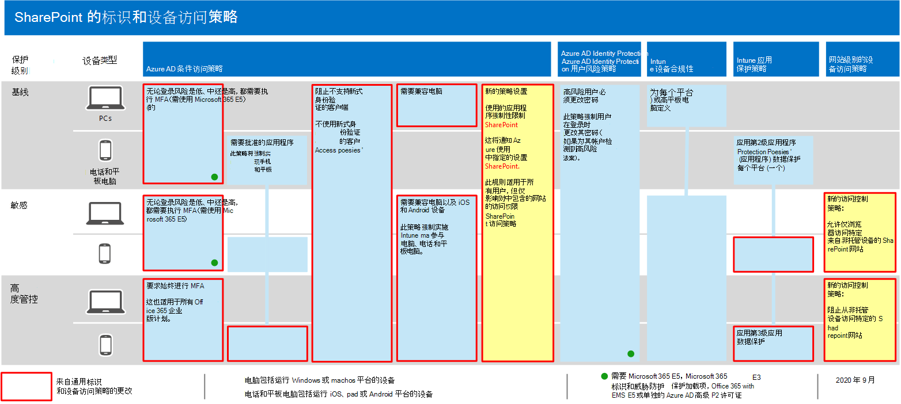

# 保护 SharePoint 网站和文件的策略建议

本文介绍如何实施推荐的标识和设备访问策略来保护 SharePoint 和 OneDrive for business。 本指南建立在 [通用标识和设备访问策略](identity-access-policies.md)之上。

这些建议基于三种不同的安全性和保护层，可根据您的需要进行应用： **比较基准**、 **敏感** 和 **高度管控** 的 SharePoint 文件。 您可以在 [概述](microsoft-365-policies-configurations.md)中了解有关这些安全层和推荐的客户端操作系统的详细信息。

除了实现本指南之外，请务必使用适当的保护措施配置 SharePoint 网站，包括为敏感和高度管控的内容设置适当的权限。

## 更新常见策略以包括 SharePoint 和 OneDrive for Business

若要保护 SharePoint 和 OneDrive 中的文件，下图说明了要从通用标识和设备访问策略中更新的策略。

[查看此图像的更大版本](https://github.com/MicrosoftDocs/microsoft-365-docs/raw/public/microsoft-365/media/microsoft-365-policies-configurations/identity-access-ruleset-sharepoint.png)

如果您在创建通用策略时包含 SharePoint，则只需创建新策略。 对于条件访问策略，SharePoint 包括 OneDrive。

新策略通过将特定访问要求应用于您指定的 SharePoint 网站来实现敏感和高度管控内容的设备保护。

下表列出了查看和更新或新建 SharePoint 时所需的策略。 常见策略链接到 [常见标识和设备访问策略](identity-access-policies.md) 文章中相关的配置说明。

|保护级别|策略|更多信息|
|---|---|---|
|**Baseline**|[当登录风险为 "*中*" 或 "*高*" 时，需要进行 MFA](identity-access-policies.md#require-mfa-based-on-sign-in-risk)|在云应用的分配中包括 SharePoint。|
||[阻止不支持新式身份验证的客户端](identity-access-policies.md#block-clients-that-dont-support-modern-authentication)|在云应用的分配中包括 SharePoint。|
||[应用应用数据保护策略](identity-access-policies.md#apply-app-data-protection-policies)|请确保所有建议的应用均包含在应用程序列表中。 请务必为每个平台 (iOS、Android、Windows) 更新策略。|
||[需要兼容电脑](identity-access-policies.md#require-compliant-pcs-but-not-compliant-phones-and-tablets)|在云应用列表中加入 SharePoint。|
||[在 SharePoint 中使用应用强制实施限制](#use-app-enforced-restrictions-in-sharepoint)|添加此新策略。 这将告知 Azure Active Directory (Azure AD) 以使用 SharePoint 中指定的设置。 此策略适用于所有用户，但仅影响对 SharePoint 访问策略中包括的网站的访问。|
|**敏感**|[当登录风险为 *低*、*中* 或 *高* 时，需要进行 MFA](identity-access-policies.md#require-mfa-based-on-sign-in-risk)|在云应用的工作分配中加入 SharePoint。|
||[需要符合要求 *的 pc 和* 移动设备](identity-access-policies.md#require-compliant-pcs-and-mobile-devices)|将 SharePoint 包括在云应用列表中。|
||[SharePoint 访问控制策略](#sharepoint-access-control-policies)：允许从非托管设备对特定 SharePoint 网站进行仅浏览器访问。|这将阻止文件的编辑和下载。 使用 PowerShell 指定网站。|
|**高度管控**|[*始终* 要求进行 MFA](identity-access-policies.md#require-mfa-based-on-sign-in-risk)|在云应用的分配中包括 SharePoint。|
||[SharePoint 访问控制策略](#use-app-enforced-restrictions-in-sharepoint)：阻止来自非托管设备的对特定 SharePoint 网站的访问。|使用 PowerShell 指定网站。|
|

## 在 SharePoint 中使用应用程序强制性限制

如果在 SharePoint 中实现访问控制，则必须在 Azure AD 中创建此条件访问策略，以通知 Azure AD 强制实施您在 SharePoint 中配置的策略。 此策略适用于所有用户，但仅影响在 SharePoint 中创建访问控制时使用 PowerShell 指定的网站的访问权限。

若要配置此策略，请参阅 [控制来自非托管设备的访问](https://docs.microsoft.com/sharepoint/control-access-from-unmanaged-devices)中的 "阻止或限制对特定 SharePoint 网站集或 OneDrive 帐户的访问权限"。

## SharePoint 访问控制策略

Microsoft 建议使用设备访问控制保护 SharePoint 网站中的内容与敏感和高度管控的内容。 为此，请创建指定保护级别的策略和要向其应用保护的网站。

- 敏感网站：允许仅浏览器访问。 这将阻止用户编辑和下载文件。
- 高度管控的网站：阻止来自非托管设备的访问。

请参阅 [控制来自非托管设备的访问](https://docs.microsoft.com/sharepoint/control-access-from-unmanaged-devices)中的 "阻止或限制对特定 SharePoint 网站集或 OneDrive 帐户的访问"。

## 这些策略如何协同工作

了解 SharePoint 网站权限通常基于访问网站的业务需求，了解这一点非常重要。 这些权限由网站所有者管理，并且可以是高度动态的。 使用 SharePoint 设备访问策略可确保对这些网站的保护，而不管是否将用户分配到与比较基准、敏感或高度管控保护相关联的 Azure AD 组。

下图提供了 SharePoint 设备访问策略如何保护对用户网站的访问的示例。

[查看此图像的更大版本](https://github.com/MicrosoftDocs/microsoft-365-docs/raw/public/microsoft-365/media/microsoft-365-policies-configurations/SharePoint-rules-scenario.png)

James 具有已分配的基准条件访问策略，但可以向他授予对具有敏感保护或高度管控保护的 SharePoint 网站的访问权限。

- 如果 James 访问敏感或高度管控的站点，他是使用他的电脑的成员，那么只要他的 PC 符合要求，就会向其授予访问权限。
- 如果 James 访问敏感站点，他是使用他的非托管电话的成员，这对于基准用户是允许的，他将收到对敏感网站的仅浏览器访问权限，这是由于为此网站配置的设备访问策略。
- 如果 James 访问高度管控的网站，他是使用其非托管手机的成员，则会由于为此网站配置的访问策略而被阻止。 他只能使用其受管理且合规的电脑来访问此网站。

## 后续步骤

为以下项配置条件访问策略：

- [Microsoft Teams](teams-access-policies.md)
- [Exchange Online](secure-email-recommended-policies.md)
